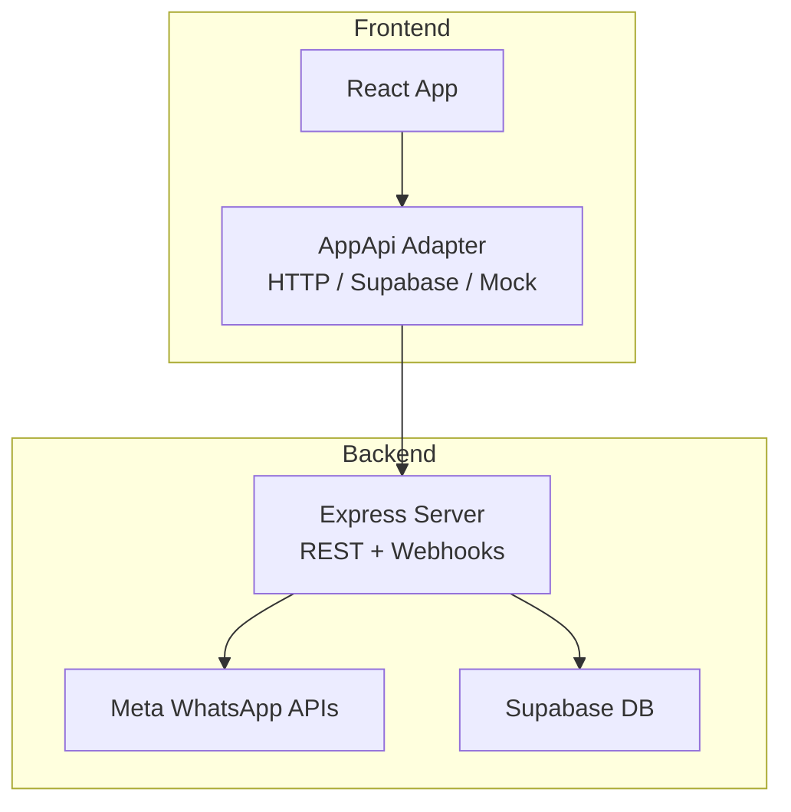
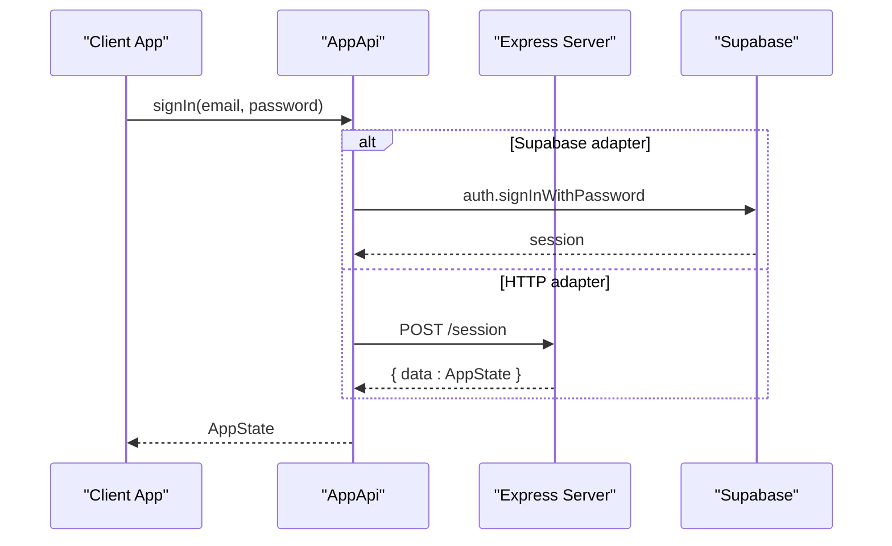
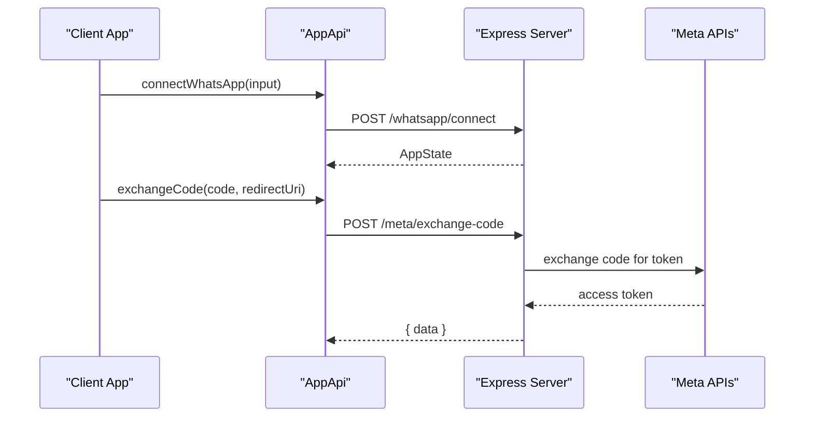
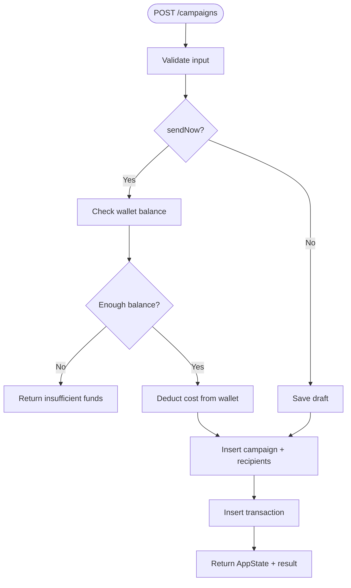
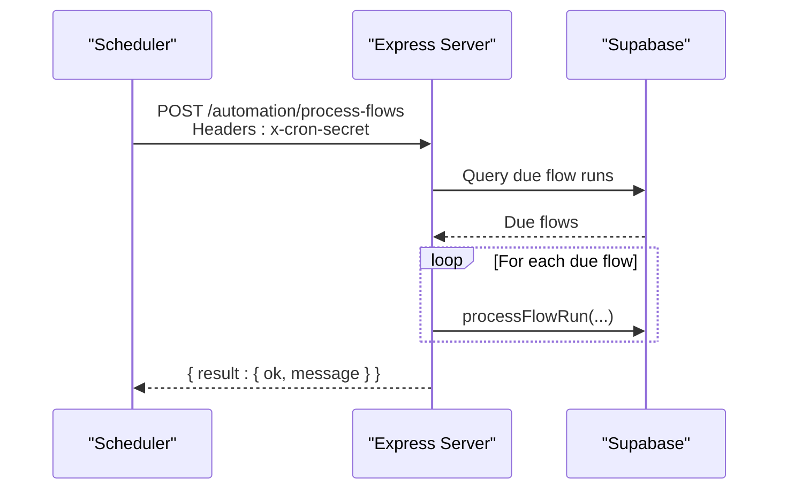
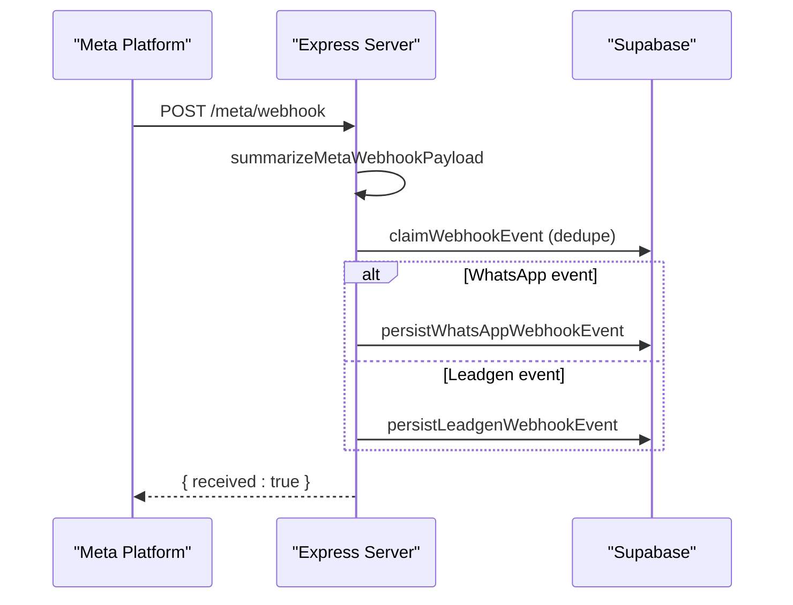
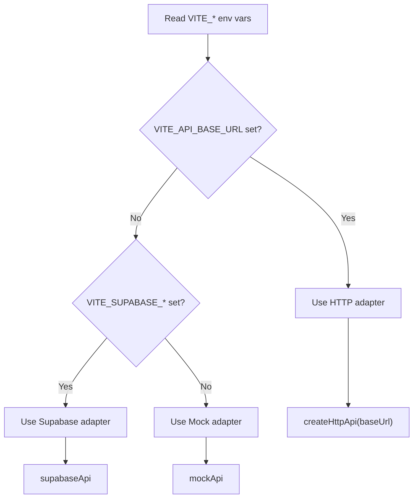
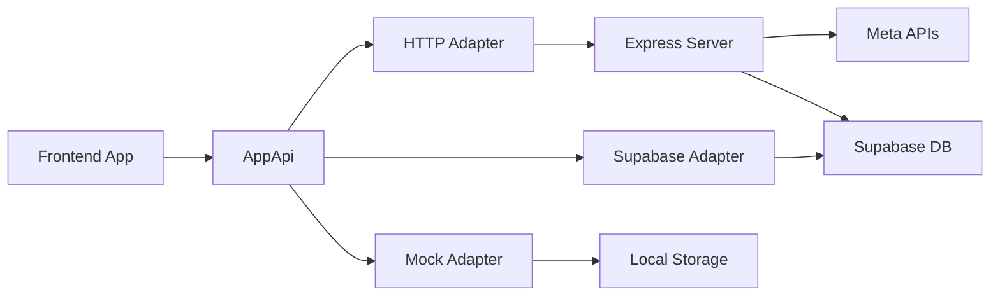

# API Reference

<cite>
**Referenced Files in This Document**
- [api/index.ts](file://api/index.ts)
- [server/index.ts](file://server/index.ts)
- [src/lib/api/index.ts](file://src/lib/api/index.ts)
- [src/lib/api/httpApi.ts](file://src/lib/api/httpApi.ts)
- [src/lib/api/mockApi.ts](file://src/lib/api/mockApi.ts)
- [src/lib/api/supabaseApi.ts](file://src/lib/api/supabaseApi.ts)
- [src/lib/api/contracts.ts](file://src/lib/api/contracts.ts)
- [src/lib/api/types.ts](file://src/lib/api/types.ts)
- [src/lib/supabase/client.ts](file://src/lib/supabase/client.ts)
- [package.json](file://package.json)
</cite>

## Table of Contents
1. [Introduction](#introduction)
2. [Project Structure](#project-structure)
3. [Core Components](#core-components)
4. [Architecture Overview](#architecture-overview)
5. [Detailed Component Analysis](#detailed-component-analysis)
6. [Dependency Analysis](#dependency-analysis)
7. [Performance Considerations](#performance-considerations)
8. [Troubleshooting Guide](#troubleshooting-guide)
9. [Conclusion](#conclusion)
10. [Appendices](#appendices)

## Introduction
This document provides a comprehensive API reference for the WhatsAppFly platform. It covers:
- Authentication endpoints
- WhatsApp integration APIs
- Campaign management APIs
- Automation APIs
- Webhook endpoints
- API adapter system (HTTP, Supabase, Mock)
- Authentication flows, token management, and security best practices
- Rate limiting, versioning, and backwards compatibility
- Practical usage examples, SDK integration, and client implementation guidelines
- Testing strategies, debugging tools, and performance optimization

## Project Structure
The API surface is implemented in two primary places:
- Server-side Express routes for backend endpoints and webhooks
- Frontend API adapters that expose a unified AppApi interface



**Diagram sources**
- [api/index.ts:36-849](file://api/index.ts#L36-L849)
- [src/lib/api/index.ts:1-23](file://src/lib/api/index.ts#L1-L23)
- [src/lib/api/httpApi.ts:62-212](file://src/lib/api/httpApi.ts#L62-L212)
- [src/lib/api/supabaseApi.ts:481-1205](file://src/lib/api/supabaseApi.ts#L481-L1205)
- [src/lib/api/mockApi.ts:122-768](file://src/lib/api/mockApi.ts#L122-L768)

**Section sources**
- [api/index.ts:36-849](file://api/index.ts#L36-L849)
- [src/lib/api/index.ts:1-23](file://src/lib/api/index.ts#L1-L23)

## Core Components
- REST endpoints: Implemented in the Express server with route handlers for authentication, WhatsApp integration, campaigns, automation, and operations.
- Webhooks: Meta webhook verification and ingestion endpoints.
- API adapters: A unified AppApi interface backed by HTTP, Supabase, or Mock implementations.
- Contracts and types: Shared request/response contracts and TypeScript types for frontend/backend alignment.

**Section sources**
- [api/index.ts:808-849](file://api/index.ts#L808-L849)
- [src/lib/api/contracts.ts:10-33](file://src/lib/api/contracts.ts#L10-L33)
- [src/lib/api/types.ts:255-375](file://src/lib/api/types.ts#L255-L375)

## Architecture Overview
The platform supports three API adapter modes:
- HTTP adapter: Calls backend REST endpoints via fetch with JSON payloads.
- Supabase adapter: Directly interacts with Supabase tables and auth.
- Mock adapter: Simulates state transitions for local development and testing.

```mermaid
classDiagram
class AppApi {
+getAppState()
+signIn(email, password)
+signUp(name, email, password)
+signOut()
+completeOnboarding()
+connectWhatsApp(input)
+disconnectWhatsApp()
+addWalletFunds(amount, source)
+addContact(input)
+uploadSampleContacts()
+createCampaign(input)
+updateConversation(input)
+addConversationNote(input)
+updateLead(input)
+updateAutomation(input)
+runAutomationSweep()
+retryFailedSend(input)
+getPartners()
+getPartnerDashboard()
+applyAsPartner(input)
+approvePartner(id)
+rejectPartner(id)
+getPartnerReferrals()
+getPartnerPayouts()
+requestPayout(amount, method, details)
+updatePartnerCommission(id, rate)
}
class HttpApi {
+createHttpApi({baseUrl})
}
class SupabaseApi {
+supabaseApi
}
class MockApi {
+mockApi
}
AppApi <|.. HttpApi
AppApi <|.. SupabaseApi
AppApi <|.. MockApi
```

**Diagram sources**
- [src/lib/api/httpApi.ts:62-212](file://src/lib/api/httpApi.ts#L62-L212)
- [src/lib/api/supabaseApi.ts:481-1205](file://src/lib/api/supabaseApi.ts#L481-L1205)
- [src/lib/api/mockApi.ts:122-768](file://src/lib/api/mockApi.ts#L122-L768)

**Section sources**
- [src/lib/api/index.ts:1-23](file://src/lib/api/index.ts#L1-L23)
- [src/lib/api/httpApi.ts:62-212](file://src/lib/api/httpApi.ts#L62-L212)
- [src/lib/api/supabaseApi.ts:481-1205](file://src/lib/api/supabaseApi.ts#L481-L1205)
- [src/lib/api/mockApi.ts:122-768](file://src/lib/api/mockApi.ts#L122-L768)

## Detailed Component Analysis

### Authentication Endpoints
- POST /session
  - Purpose: Sign in with email/password.
  - Request: { email, password }
  - Response: AppState
  - Notes: Uses Supabase auth when adapter is Supabase; otherwise HTTP calls backend.
- POST /auth/signup
  - Purpose: Sign up with name, email, password.
  - Request: { name, email, password }
  - Response: AppState
- POST /auth/signout
  - Purpose: Sign out.
  - Response: AppState
- POST /onboarding/complete
  - Purpose: Mark onboarding complete.
  - Response: AppState

Authentication flow:
- Frontend adapter calls signIn/signUp/signOut.
- Supabase adapter uses Supabase auth; HTTP adapter posts to backend routes.
- After successful auth, the adapter rebuilds AppState from backend or Supabase tables.



**Diagram sources**
- [src/lib/api/httpApi.ts:91-104](file://src/lib/api/httpApi.ts#L91-L104)
- [src/lib/api/supabaseApi.ts:486-524](file://src/lib/api/supabaseApi.ts#L486-L524)
- [api/index.ts:761-763](file://api/index.ts#L761-L763)

**Section sources**
- [src/lib/api/contracts.ts:10-33](file://src/lib/api/contracts.ts#L10-L33)
- [src/lib/api/httpApi.ts:91-104](file://src/lib/api/httpApi.ts#L91-L104)
- [src/lib/api/supabaseApi.ts:486-524](file://src/lib/api/supabaseApi.ts#L486-L524)
- [api/index.ts:761-763](file://api/index.ts#L761-L763)

### WhatsApp Integration APIs
- POST /whatsapp/connect
  - Purpose: Upsert WhatsApp connection metadata for workspace.
  - Request: ConnectWhatsAppInput
  - Response: AppState
- POST /whatsapp/disconnect
  - Purpose: Set connection status to disconnected.
  - Response: AppState
- POST /meta/exchange-code
  - Purpose: Exchange Meta OAuth code for access token and persist authorization.
  - Request: { code, redirectUri }
  - Response: { data: authorization info }
- GET /meta/webhook
  - Purpose: Verify webhook subscription.
  - Query: hub.mode, hub.verify_token, hub.challenge
  - Response: challenge or 403
- POST /meta/webhook
  - Purpose: Receive Meta webhook events (WhatsApp and Leadgen), deduplicate, persist, and trigger automation.
  - Request: Meta webhook payload
  - Response: { received: true }



**Diagram sources**
- [src/lib/api/httpApi.ts:109-119](file://src/lib/api/httpApi.ts#L109-L119)
- [api/index.ts:851-875](file://api/index.ts#L851-L875)
- [api/index.ts:808-849](file://api/index.ts#L808-L849)

**Section sources**
- [src/lib/api/httpApi.ts:109-119](file://src/lib/api/httpApi.ts#L109-L119)
- [api/index.ts:851-875](file://api/index.ts#L851-L875)
- [api/index.ts:808-849](file://api/index.ts#L808-L849)

### Campaign Management APIs
- POST /campaigns
  - Purpose: Create a campaign (draft or send immediately).
  - Request: { name, templateId, contactIds, sendNow }
  - Response: { data: AppState, result: ActionResult }
  - Behavior: Deducts wallet if sendNow=true; records transactions and campaign recipients.
- GET /app-state
  - Purpose: Fetch full application state (contacts, templates, campaigns, transactions, WhatsApp connection, conversations, messages, notes, events, logs, leads, automations, and recent activity).



**Diagram sources**
- [src/lib/api/httpApi.ts:134-138](file://src/lib/api/httpApi.ts#L134-L138)
- [src/lib/api/supabaseApi.ts:829-891](file://src/lib/api/supabaseApi.ts#L829-L891)

**Section sources**
- [src/lib/api/httpApi.ts:134-138](file://src/lib/api/httpApi.ts#L134-L138)
- [src/lib/api/supabaseApi.ts:829-891](file://src/lib/api/supabaseApi.ts#L829-L891)

### Automation APIs
- POST /automation/process-reminders
  - Purpose: Trigger no-reply reminder sweep for overdue conversations.
  - Response: { result: { ok, message } }
- GET /automation/definitions
  - Purpose: List automation flow definitions for workspace.
- POST /automation/definitions
  - Purpose: Upsert automation flow definition.
- POST /automation/process-flows
  - Purpose: Process scheduled automation flow runs (cron authorized or workspace-scoped).
  - Headers: x-cron-secret (optional)
- POST /automation/lead-contacted
  - Purpose: Trigger follow-up automation after a lead is marked contacted.
  - Request: { leadId }



**Diagram sources**
- [api/index.ts:1387-1426](file://api/index.ts#L1387-L1426)
- [src/lib/api/supabaseApi.ts:813-819](file://src/lib/api/supabaseApi.ts#L813-L819)

**Section sources**
- [api/index.ts:1224-1328](file://api/index.ts#L1224-L1328)
- [api/index.ts:1332-1385](file://api/index.ts#L1332-L1385)
- [api/index.ts:1387-1426](file://api/index.ts#L1387-L1426)
- [api/index.ts:1428-1580](file://api/index.ts#L1428-L1580)
- [src/lib/api/supabaseApi.ts:813-819](file://src/lib/api/supabaseApi.ts#L813-L819)

### Operations and Utilities
- POST /ops/retry-failed-send
  - Purpose: Retry a previously failed send.
  - Request: { failedSendLogId }
  - Response: { state, result }

**Section sources**
- [api/index.ts:1582-1599](file://api/index.ts#L1582-L1599)
- [src/lib/api/supabaseApi.ts:821-827](file://src/lib/api/supabaseApi.ts#L821-L827)

### Webhook Endpoints
- GET /meta/webhook
  - Purpose: Verify webhook subscription.
  - Query: hub.mode, hub.verify_token, hub.challenge
  - Response: challenge or 403
- POST /meta/webhook
  - Purpose: Receive and process Meta webhooks (WhatsApp and Leadgen).
  - Request: Webhook payload
  - Response: { received: true }

Processing pipeline:
- Summarize payload
- Deduplicate by fingerprint
- Persist events to database
- Trigger automation and operational logging



**Diagram sources**
- [api/index.ts:822-849](file://api/index.ts#L822-L849)
- [api/index.ts:319-342](file://api/index.ts#L319-L342)
- [api/index.ts:369-406](file://api/index.ts#L369-L406)
- [api/index.ts:631-750](file://api/index.ts#L631-L750)

**Section sources**
- [api/index.ts:808-849](file://api/index.ts#L808-L849)
- [api/index.ts:319-342](file://api/index.ts#L319-L342)
- [api/index.ts:369-406](file://api/index.ts#L369-L406)
- [api/index.ts:631-750](file://api/index.ts#L631-L750)

### API Adapter System
- Active adapter selection:
  - http: Requires VITE_API_BASE_URL
  - supabase: Requires VITE_SUPABASE_URL and VITE_SUPABASE_ANON_KEY
  - mock: Default fallback
- HTTP adapter:
  - Uses fetch with credentials and JSON
  - Parses responses and throws ApiError on non-OK status
- Supabase adapter:
  - Uses Supabase client auth and tables
  - Builds AppState from multiple tables
  - Triggers server-side automation and retry helpers
- Mock adapter:
  - Local storage-backed state simulation
  - Useful for development and testing



**Diagram sources**
- [src/lib/api/index.ts:13-23](file://src/lib/api/index.ts#L13-L23)
- [src/lib/supabase/client.ts:1-16](file://src/lib/supabase/client.ts#L1-L16)
- [src/lib/api/httpApi.ts:62-74](file://src/lib/api/httpApi.ts#L62-L74)
- [src/lib/api/supabaseApi.ts:481-484](file://src/lib/api/supabaseApi.ts#L481-L484)
- [src/lib/api/mockApi.ts:122-125](file://src/lib/api/mockApi.ts#L122-L125)

**Section sources**
- [src/lib/api/index.ts:13-23](file://src/lib/api/index.ts#L13-L23)
- [src/lib/supabase/client.ts:1-16](file://src/lib/supabase/client.ts#L1-L16)
- [src/lib/api/httpApi.ts:62-74](file://src/lib/api/httpApi.ts#L62-L74)
- [src/lib/api/supabaseApi.ts:481-484](file://src/lib/api/supabaseApi.ts#L481-L484)
- [src/lib/api/mockApi.ts:122-125](file://src/lib/api/mockApi.ts#L122-L125)

### Authentication Flows, Token Management, and Security Best Practices
- Supabase auth:
  - Frontend adapter uses Supabase auth for sign-in/sign-up/sign-out.
  - Sessions persisted and refreshed automatically when configured.
- Meta OAuth:
  - Exchange code via /meta/exchange-code and persist access token with expiry.
  - Authorization status derived from expiry.
- Security:
  - Use HTTPS in production.
  - Store secrets in environment variables.
  - Validate and sanitize all inputs using Zod schemas on the server.
  - Enforce workspace scoping for all requests requiring authorization.

**Section sources**
- [src/lib/api/supabaseApi.ts:486-524](file://src/lib/api/supabaseApi.ts#L486-L524)
- [api/index.ts:851-875](file://api/index.ts#L851-L875)
- [api/index.ts:225-244](file://api/index.ts#L225-L244)

### Rate Limiting, Versioning, and Backwards Compatibility
- Rate limiting:
  - Not explicitly implemented in the server code. Consider adding rate limiting middleware or platform-level limits.
- Versioning:
  - No explicit API versioning observed. Use base URL versioning (e.g., /v1/) in future deployments.
- Backwards compatibility:
  - Maintain stable request/response shapes; avoid breaking changes to shared contracts.
  - Keep Zod schemas strict to prevent silent regressions.

[No sources needed since this section provides general guidance]

### Practical Examples and SDK Integration
- Initialize adapter:
  - Configure VITE_API_BASE_URL for HTTP adapter.
  - Configure VITE_SUPABASE_URL and VITE_SUPABASE_ANON_KEY for Supabase adapter.
  - Use api.activeApiAdapter and api to call methods.
- Example flows:
  - Sign in -> connect WhatsApp -> create campaign -> send reply -> process automation -> retry failed send.
- Client implementation guidelines:
  - Wrap adapter calls in try/catch blocks.
  - Handle ApiError.status for client-side UX.
  - Use AppState fields to drive UI state.

**Section sources**
- [src/lib/api/index.ts:13-23](file://src/lib/api/index.ts#L13-L23)
- [src/lib/api/httpApi.ts:31-59](file://src/lib/api/httpApi.ts#L31-L59)
- [src/lib/api/types.ts:255-375](file://src/lib/api/types.ts#L255-L375)

### Testing Strategies and Debugging Tools
- Unit tests:
  - Use Vitest for unit tests.
- End-to-end tests:
  - Use Playwright fixtures and configuration.
- Debugging:
  - Inspect Supabase tables for state and logs.
  - Use operational logs and failed send logs to diagnose issues.
  - Enable server-side logging for webhook processing.

**Section sources**
- [package.json:19-21](file://package.json#L19-L21)
- [api/index.ts:258-275](file://api/index.ts#L258-L275)
- [api/index.ts:277-317](file://api/index.ts#L277-L317)

## Dependency Analysis
- Frontend depends on:
  - AppApi abstraction
  - HTTP adapter for REST calls
  - Supabase adapter for auth and data
  - Mock adapter for local dev
- Backend depends on:
  - Express for routing
  - Supabase for data persistence
  - Zod for request validation
  - Meta APIs for WhatsApp integration



**Diagram sources**
- [src/lib/api/index.ts:1-23](file://src/lib/api/index.ts#L1-L23)
- [src/lib/api/httpApi.ts:62-212](file://src/lib/api/httpApi.ts#L62-L212)
- [src/lib/api/supabaseApi.ts:481-1205](file://src/lib/api/supabaseApi.ts#L481-L1205)
- [src/lib/api/mockApi.ts:122-768](file://src/lib/api/mockApi.ts#L122-L768)
- [api/index.ts:36-849](file://api/index.ts#L36-L849)

**Section sources**
- [src/lib/api/index.ts:1-23](file://src/lib/api/index.ts#L1-L23)
- [src/lib/api/httpApi.ts:62-212](file://src/lib/api/httpApi.ts#L62-L212)
- [src/lib/api/supabaseApi.ts:481-1205](file://src/lib/api/supabaseApi.ts#L481-L1205)
- [src/lib/api/mockApi.ts:122-768](file://src/lib/api/mockApi.ts#L122-L768)
- [api/index.ts:36-849](file://api/index.ts#L36-L849)

## Performance Considerations
- Batch operations:
  - Use batched inserts for contacts and campaign recipients.
- Caching:
  - Cache frequently accessed lists (templates, contacts) in AppState.
- Asynchronous processing:
  - Persist webhook events and process automation in background.
- Database queries:
  - Use selective projections and appropriate indexes on workspace_id.

[No sources needed since this section provides general guidance]

## Troubleshooting Guide
- Common errors:
  - Unauthorized: Ensure workspace context is present for protected endpoints.
  - Insufficient balance: Wallet top-up before sending campaigns.
  - Meta authorization missing/expired: Reconnect WhatsApp and exchange code.
  - Duplicate webhook events: Deduplication handled via fingerprinting.
- Logging:
  - Operational logs and failed send logs provide diagnostic insights.
- Error handling:
  - ApiError thrown by HTTP adapter with status codes.
  - Server routes return structured error responses parsed by the adapter.

**Section sources**
- [api/index.ts:258-275](file://api/index.ts#L258-L275)
- [api/index.ts:277-317](file://api/index.ts#L277-L317)
- [api/index.ts:319-342](file://api/index.ts#L319-L342)
- [src/lib/api/httpApi.ts:31-59](file://src/lib/api/httpApi.ts#L31-L59)

## Conclusion
WhatsAppFly exposes a cohesive API surface spanning authentication, WhatsApp integration, campaigns, automation, and webhooks. The adapter system enables flexible deployment against HTTP, Supabase, or mock environments. By following the documented endpoints, contracts, and best practices, teams can integrate and extend the platform reliably.

## Appendices

### Endpoint Catalog

- Authentication
  - POST /session
  - POST /auth/signup
  - POST /auth/signout
  - POST /onboarding/complete

- WhatsApp Integration
  - POST /whatsapp/connect
  - POST /whatsapp/disconnect
  - POST /meta/exchange-code
  - GET /meta/webhook
  - POST /meta/webhook

- Campaign Management
  - POST /campaigns
  - GET /app-state

- Automation
  - POST /automation/process-reminders
  - GET /automation/definitions
  - POST /automation/definitions
  - POST /automation/process-flows
  - POST /automation/lead-contacted

- Operations
  - POST /ops/retry-failed-send

- Partner System (via Supabase adapter)
  - GET /partners
  - GET /partners/dashboard
  - POST /partners/apply
  - POST /partners/:id/approve
  - POST /partners/:id/reject
  - PATCH /partners/:id/commission
  - GET /partners/referrals
  - GET /partners/payouts
  - POST /partners/payouts/request
  - POST /partners/payouts/:id/process

**Section sources**
- [src/lib/api/contracts.ts:10-33](file://src/lib/api/contracts.ts#L10-L33)
- [api/index.ts:808-849](file://api/index.ts#L808-L849)
- [api/index.ts:936-1222](file://api/index.ts#L936-L1222)
- [api/index.ts:1224-1580](file://api/index.ts#L1224-L1580)
- [api/index.ts:1582-1599](file://api/index.ts#L1582-L1599)
- [src/lib/api/supabaseApi.ts:893-1205](file://src/lib/api/supabaseApi.ts#L893-L1205)

### Request/Response Schemas and Contracts
- Shared contracts define route paths and backend record structures.
- Frontend types define AppState and input/output shapes.

**Section sources**
- [src/lib/api/contracts.ts:10-167](file://src/lib/api/contracts.ts#L10-L167)
- [src/lib/api/types.ts:255-375](file://src/lib/api/types.ts#L255-L375)