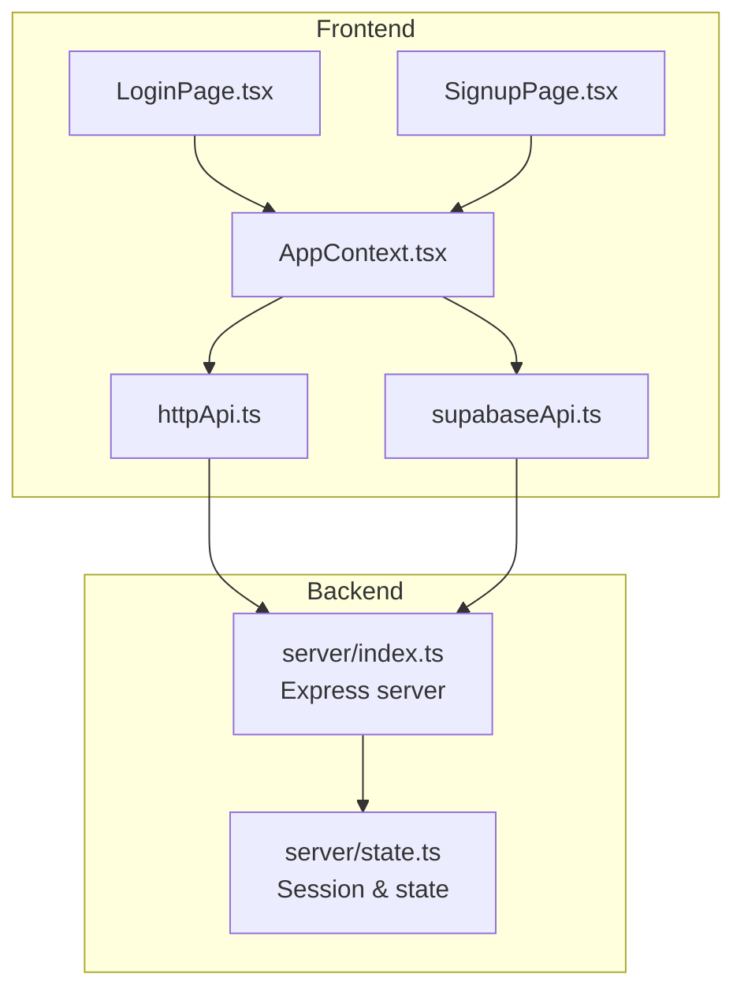
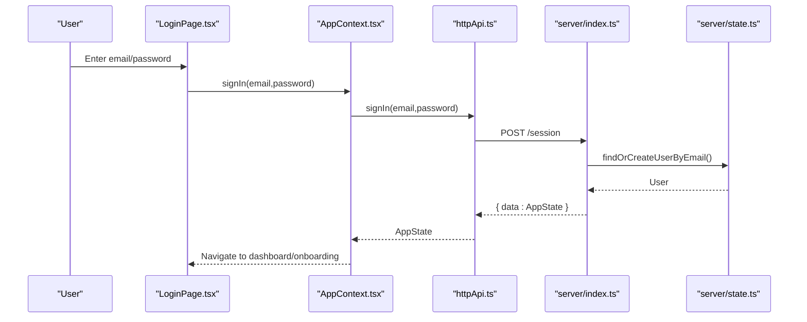
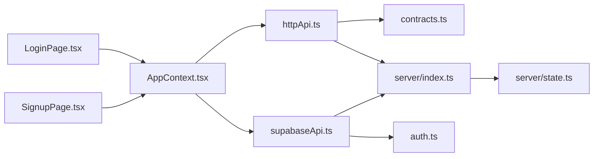

# Authentication API

<cite>
**Referenced Files in This Document**
- [index.ts](file://server/index.ts)
- [state.ts](file://server/state.ts)
- [contracts.ts](file://src/lib/api/contracts.ts)
- [httpApi.ts](file://src/lib/api/httpApi.ts)
- [AppContext.tsx](file://src/context/AppContext.tsx)
- [LoginPage.tsx](file://src/pages/LoginPage.tsx)
- [SignupPage.tsx](file://src/pages/SignupPage.tsx)
- [auth.ts](file://src/lib/supabase/auth.ts)
- [authErrors.ts](file://src/lib/authErrors.ts)
- [supabaseApi.ts](file://src/lib/api/supabaseApi.ts)
</cite>

## Table of Contents
1. [Introduction](#introduction)
2. [Project Structure](#project-structure)
3. [Core Components](#core-components)
4. [Architecture Overview](#architecture-overview)
5. [Detailed Component Analysis](#detailed-component-analysis)
6. [Dependency Analysis](#dependency-analysis)
7. [Performance Considerations](#performance-considerations)
8. [Troubleshooting Guide](#troubleshooting-guide)
9. [Conclusion](#conclusion)

## Introduction
This document describes the authentication API for WhatsAppFly, focusing on login, signup, logout, and session management. It covers HTTP endpoints, request/response schemas, authentication methods, session token management, and security considerations. Practical examples, client implementation guidelines, error handling strategies, rate limiting policies, token expiration handling, and refresh token mechanisms are included. Common authentication issues, debugging approaches, and production security best practices are also addressed.

## Project Structure
Authentication endpoints are implemented in the backend server module and consumed by the frontend via an abstraction layer. The frontend pages trigger authentication actions that call into the API layer, which either uses a mock adapter for local development or an HTTP adapter against the backend routes. Supabase-based authentication is supported as an alternate backend adapter.

**Diagram sources**
- [index.ts:39-43](file://server/index.ts#L39-L43)
- [state.ts:51-74](file://server/state.ts#L51-L74)
- [httpApi.ts:62-104](file://src/lib/api/httpApi.ts#L62-L104)
- [supabaseApi.ts:481-524](file://src/lib/api/supabaseApi.ts#L481-L524)

**Section sources**
- [index.ts:39-43](file://server/index.ts#L39-L43)
- [contracts.ts:10-33](file://src/lib/api/contracts.ts#L10-L33)
- [httpApi.ts:62-104](file://src/lib/api/httpApi.ts#L62-L104)
- [supabaseApi.ts:481-524](file://src/lib/api/supabaseApi.ts#L481-L524)

## Core Components
- Authentication routes:
  - POST /session: Login by email; creates or retrieves a user session and returns app state.
  - POST /auth/signup: Register a new user; optionally seeds workspace; sets current user session.
  - POST /auth/signout: Clear current user session; returns empty app state.
- Frontend adapters:
  - httpApi: Uses credentials-enabled fetch with JSON bodies and parses JSON responses.
  - supabaseApi: Integrates with Supabase Auth for password and OAuth flows.
- State management:
  - Session persistence via a singleton app session record; current user stored per session.
  - App state built from database records and returned on each auth operation.

**Section sources**
- [index.ts:1764-1796](file://server/index.ts#L1764-L1796)
- [state.ts:51-74](file://server/state.ts#L51-L74)
- [state.ts:257-451](file://server/state.ts#L257-L451)
- [httpApi.ts:62-104](file://src/lib/api/httpApi.ts#L62-L104)
- [supabaseApi.ts:481-524](file://src/lib/api/supabaseApi.ts#L481-L524)

## Architecture Overview
The authentication flow connects the frontend UI to backend routes through an API abstraction. The backend enforces schema validation, manages sessions, and builds a normalized app state. Supabase adapter supports password-based and OAuth-based sign-in/out.

**Diagram sources**
- [LoginPage.tsx:20-41](file://src/pages/LoginPage.tsx#L20-L41)
- [AppContext.tsx:111-115](file://src/context/AppContext.tsx#L111-L115)
- [httpApi.ts:91-95](file://src/lib/api/httpApi.ts#L91-L95)
- [index.ts:1764-1773](file://server/index.ts#L1764-L1773)
- [state.ts:98-108](file://server/state.ts#L98-L108)

## Detailed Component Analysis

### Authentication Endpoints

- POST /session
  - Purpose: Authenticate by email and establish a session.
  - Request body: email (string; validated as email).
  - Response: AppState object containing user, wallet, campaigns, templates, and other fields.
  - Behavior: Finds or creates user by email, sets current user in session, builds app state.
  - Security: Uses Zod schema validation; cookies enabled via fetch credentials.

- POST /auth/signup
  - Purpose: Create a new user and workspace; optionally requires email confirmation depending on backend adapter.
  - Request body: name (string), email (string; validated as email).
  - Response: AppState object.
  - Behavior: Checks existing user; if absent, creates workspace and user, sets current user, builds app state.
  - Notes: With Supabase adapter, email confirmation may be required before sign-in succeeds.

- POST /auth/signout
  - Purpose: End current session.
  - Request body: none.
  - Response: AppState with user=null and onboarding cleared.
  - Behavior: Clears current user from session and returns empty state.

**Section sources**
- [index.ts:1764-1796](file://server/index.ts#L1764-L1796)
- [state.ts:98-108](file://server/state.ts#L98-L108)
- [state.ts:257-451](file://server/state.ts#L257-L451)
- [httpApi.ts:91-104](file://src/lib/api/httpApi.ts#L91-L104)
- [supabaseApi.ts:495-524](file://src/lib/api/supabaseApi.ts#L495-L524)

### Request/Response Schemas

- Request schemas (validated in backend):
  - Email login: { email: string }
  - Signup: { name: string, email: string }

- Response schemas:
  - AppState: Includes user, onboardingComplete, walletBalance, totalSpent, messagesSent, contacts, templates, campaigns, transactions, whatsApp, and various lists.

- Frontend API contracts:
  - Routes: session (/session), signup (/auth/signup), signout (/auth/signout).
  - Types: SignInRequest, SignUpRequest, ApiStateResponse, AppState.

**Section sources**
- [index.ts:45-52](file://server/index.ts#L45-L52)
- [contracts.ts:10-33](file://src/lib/api/contracts.ts#L10-L33)
- [contracts.ts:35-44](file://src/lib/api/contracts.ts#L35-L44)
- [contracts.ts:51-58](file://src/lib/api/contracts.ts#L51-L58)

### Authentication Methods

- Local adapter (HTTP):
  - Uses fetch with credentials: include and JSON content type.
  - Parses JSON responses; throws ApiError on non-OK responses.

- Supabase adapter:
  - signInWithPassword for email/password.
  - signUp with optional metadata (e.g., full_name).
  - signOut to terminate session.
  - Google OAuth via Supabase client.

**Section sources**
- [httpApi.ts:62-104](file://src/lib/api/httpApi.ts#L62-L104)
- [supabaseApi.ts:486-524](file://src/lib/api/supabaseApi.ts#L486-L524)
- [auth.ts:3-19](file://src/lib/supabase/auth.ts#L3-L19)

### Session Management

- Session persistence:
  - A singleton app session record stores the current user ID.
  - setCurrentUser updates the session; getCurrentUser reads it.
  - requireUser enforces an active session for protected routes.

- App state building:
  - buildAppState constructs a normalized state from database records.
  - Returns empty state when user is null.

- Frontend hydration:
  - AppContext hydrates state on mount and subscribes to Supabase auth state changes.

**Section sources**
- [state.ts:51-74](file://server/state.ts#L51-L74)
- [state.ts:257-451](file://server/state.ts#L257-L451)
- [AppContext.tsx:64-98](file://src/context/AppContext.tsx#L64-L98)

### Token Expiration and Refresh Tokens
- No explicit token rotation or refresh token mechanism is implemented in the referenced code.
- Sessions rely on cookie-based credentials with fetch requests.
- Supabase adapter handles its own token lifecycle; the local HTTP adapter does not expose refresh endpoints.

Recommendations:
- Implement short-lived access tokens and long-lived refresh tokens.
- Add token introspection and automatic refresh prior to expiry.
- Enforce token revocation on logout.

**Section sources**
- [httpApi.ts:62-74](file://src/lib/api/httpApi.ts#L62-L74)
- [supabaseApi.ts:517-524](file://src/lib/api/supabaseApi.ts#L517-L524)

### Rate Limiting Policies
- No explicit rate limiting is implemented in the referenced code.
- Consider applying rate limits per IP/email for login/signup/signout endpoints.
- Integrate middleware such as express-rate-limit or platform-specific rate limiting.

**Section sources**
- [index.ts:39-43](file://server/index.ts#L39-L43)

### Practical Examples

- Login (HTTP adapter)
  - Endpoint: POST /session
  - Request: { email, password }
  - Response: AppState
  - Example steps:
    - Call api.signIn(email, password)
    - On success, navigate to dashboard or onboarding based on state

- Signup (HTTP adapter)
  - Endpoint: POST /auth/signup
  - Request: { name, email, password }
  - Response: AppState
  - Example steps:
    - Call api.signUp(name, email, password)
    - On success, navigate to onboarding

- Logout (HTTP adapter)
  - Endpoint: POST /auth/signout
  - Request: none
  - Response: AppState (user=null)

- Supabase login (OAuth)
  - Call signInWithGoogle()
  - Redirect handled by Supabase; app state refreshed via auth subscription

**Section sources**
- [httpApi.ts:91-104](file://src/lib/api/httpApi.ts#L91-L104)
- [LoginPage.tsx:20-41](file://src/pages/LoginPage.tsx#L20-L41)
- [SignupPage.tsx:25-55](file://src/pages/SignupPage.tsx#L25-L55)
- [auth.ts:3-19](file://src/lib/supabase/auth.ts#L3-L19)

### Client Implementation Guidelines
- Use the active API adapter selection:
  - http: createHttpApi with baseUrl
  - supabase: supabaseApi when environment is configured
  - mock: default for local development
- Persist and propagate session state via AppContext.
- Handle errors gracefully using getAuthErrorMessage for user-friendly messages.

**Section sources**
- [httpApi.ts:18-23](file://src/lib/api/httpApi.ts#L18-L23)
- [AppContext.tsx:111-124](file://src/context/AppContext.tsx#L111-L124)
- [authErrors.ts:1-59](file://src/lib/authErrors.ts#L1-L59)

## Dependency Analysis

**Diagram sources**
- [httpApi.ts:62-104](file://src/lib/api/httpApi.ts#L62-L104)
- [contracts.ts:10-33](file://src/lib/api/contracts.ts#L10-L33)
- [index.ts:1764-1796](file://server/index.ts#L1764-L1796)
- [state.ts:51-74](file://server/state.ts#L51-L74)
- [supabaseApi.ts:481-524](file://src/lib/api/supabaseApi.ts#L481-L524)
- [auth.ts:3-19](file://src/lib/supabase/auth.ts#L3-L19)
- [AppContext.tsx:111-124](file://src/context/AppContext.tsx#L111-L124)
- [LoginPage.tsx:20-41](file://src/pages/LoginPage.tsx#L20-L41)
- [SignupPage.tsx:25-55](file://src/pages/SignupPage.tsx#L25-L55)

**Section sources**
- [httpApi.ts:62-104](file://src/lib/api/httpApi.ts#L62-L104)
- [supabaseApi.ts:481-524](file://src/lib/api/supabaseApi.ts#L481-L524)
- [index.ts:1764-1796](file://server/index.ts#L1764-L1796)
- [state.ts:51-74](file://server/state.ts#L51-L74)

## Performance Considerations
- Keep request bodies minimal (only required fields).
- Cache app state client-side to reduce redundant requests.
- Avoid frequent sign-in/sign-out calls; reuse sessions.
- For Supabase adapter, minimize network round-trips by batching operations where possible.

## Troubleshooting Guide

Common issues and resolutions:
- Invalid login credentials
  - Symptom: Error indicating invalid credentials.
  - Resolution: Verify email and password; ensure account exists.

- Email confirmation required
  - Symptom: Signup succeeds but requires email confirmation before sign-in.
  - Resolution: Complete email confirmation flow; then sign in again.

- Permission denied or row-level security errors
  - Symptom: Blocked workspace queries.
  - Resolution: Review Supabase policies and table setup.

- Missing CRM tables
  - Symptom: Errors referencing conversations, leads, etc.
  - Resolution: Apply latest database upgrades and retry.

- Supabase not configured
  - Symptom: Google login throws configuration error.
  - Resolution: Set up Supabase environment variables and redirect URL.

Debugging tips:
- Inspect ApiError status and message thrown by httpApi.
- Use getAuthErrorMessage to present friendly messages to users.
- Monitor Supabase auth state changes and app state hydration logs.

**Section sources**
- [authErrors.ts:1-59](file://src/lib/authErrors.ts#L1-L59)
- [httpApi.ts:31-59](file://src/lib/api/httpApi.ts#L31-L59)
- [auth.ts:3-19](file://src/lib/supabase/auth.ts#L3-L19)
- [AppContext.tsx:64-98](file://src/context/AppContext.tsx#L64-L98)

## Conclusion
WhatsAppFly’s authentication API provides straightforward endpoints for login, signup, and logout, returning a normalized app state. The HTTP adapter offers a simple JSON contract with credential-based cookies, while the Supabase adapter adds robust password and OAuth flows. For production, implement token expiration handling, refresh mechanisms, and rate limiting. Follow the provided client guidelines and troubleshooting steps to ensure reliable authentication experiences.