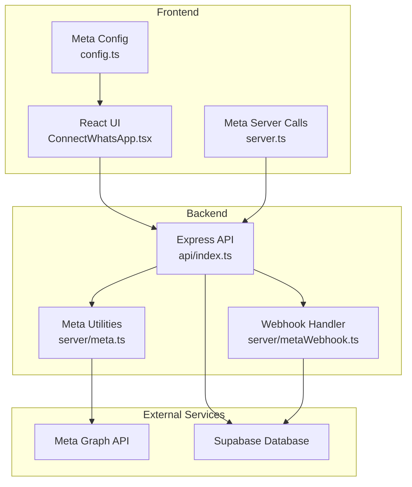
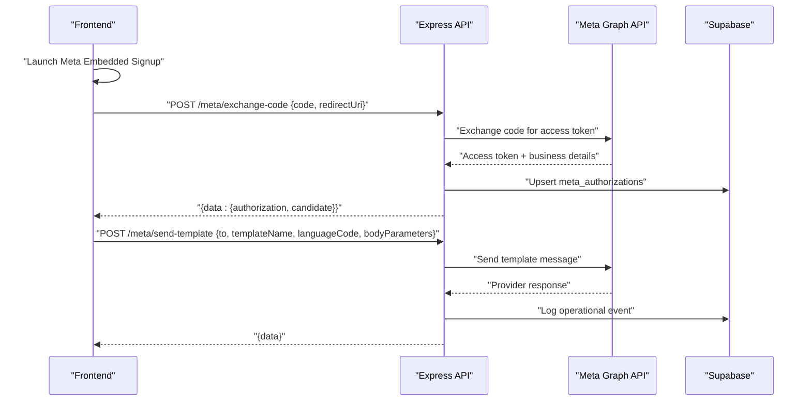
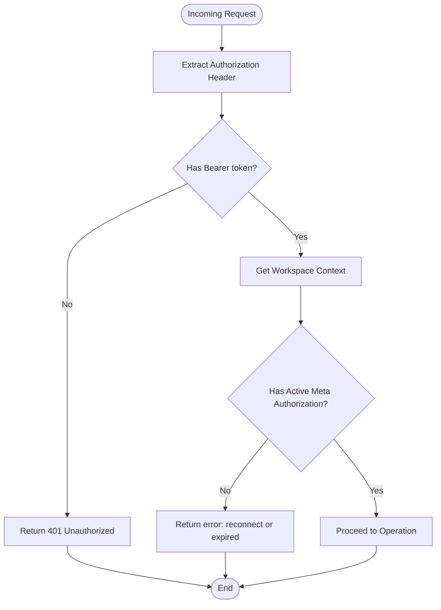
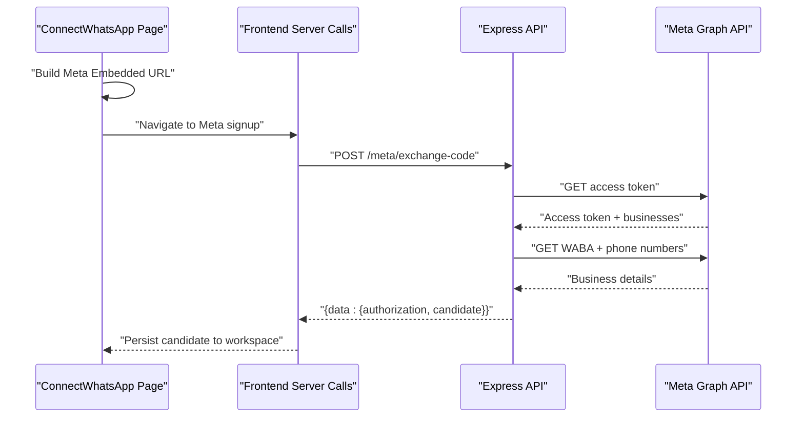
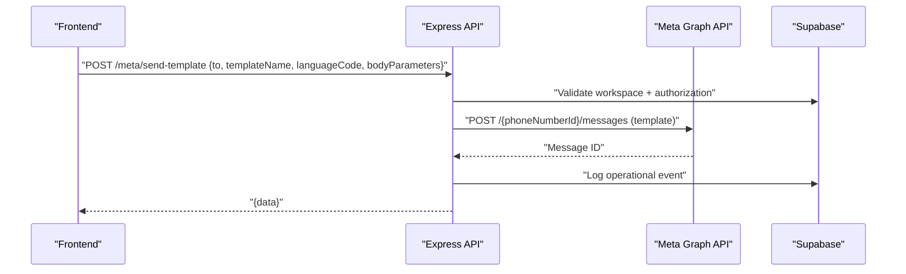
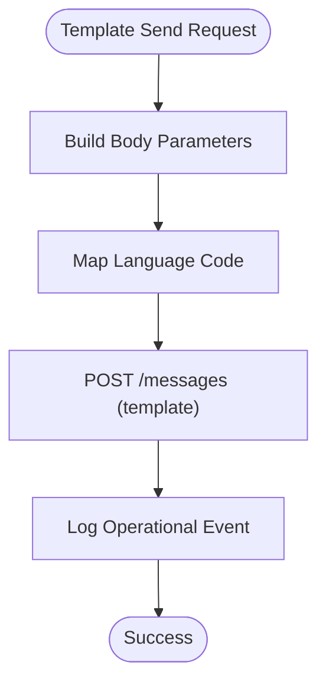
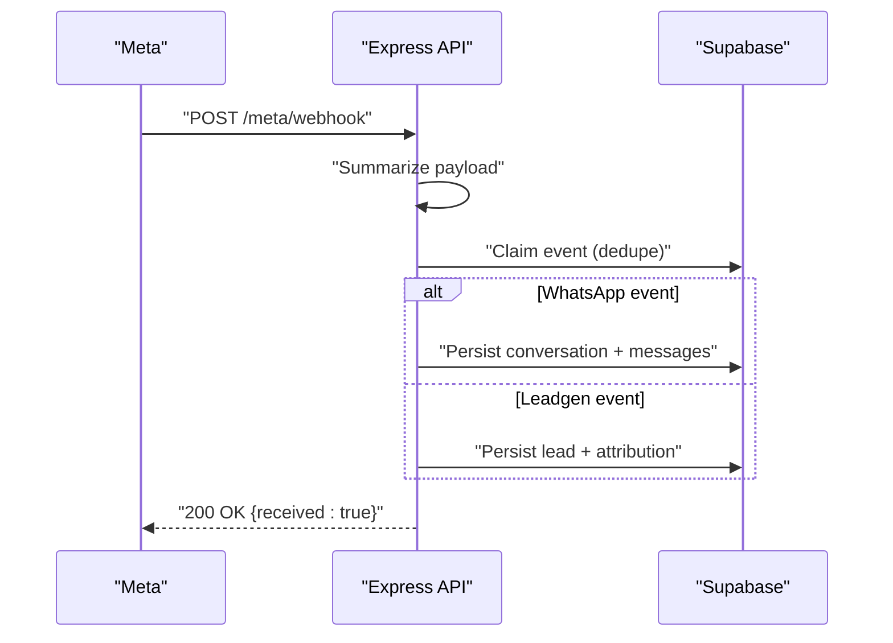
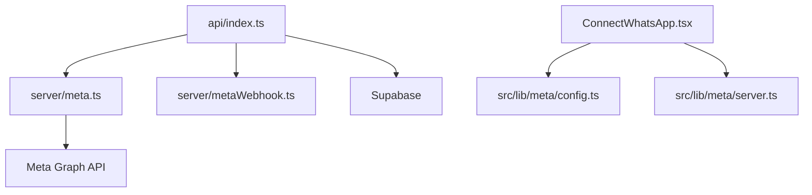

# WhatsApp Integration API

<cite>
**Referenced Files in This Document**
- [api/index.ts](file://api/index.ts)
- [server/meta.ts](file://server/meta.ts)
- [server/metaWebhook.ts](file://server/metaWebhook.ts)
- [src/lib/meta/config.ts](file://src/lib/meta/config.ts)
- [src/lib/meta/server.ts](file://src/lib/meta/server.ts)
- [src/pages/ConnectWhatsApp.tsx](file://src/pages/ConnectWhatsApp.tsx)
- [README.md](file://README.md)
- [DEPLOYMENT_GUIDE.md](file://DEPLOYMENT_GUIDE.md)
- [NGROK_SETUP_GUIDE.md](file://NGROK_SETUP_GUIDE.md)
- [IMPLEMENTATION_FIXES.md](file://IMPLEMENTATION_FIXES.md)
</cite>

## Table of Contents
1. [Introduction](#introduction)
2. [Project Structure](#project-structure)
3. [Core Components](#core-components)
4. [Architecture Overview](#architecture-overview)
5. [Detailed Component Analysis](#detailed-component-analysis)
6. [Dependency Analysis](#dependency-analysis)
7. [Performance Considerations](#performance-considerations)
8. [Troubleshooting Guide](#troubleshooting-guide)
9. [Conclusion](#conclusion)
10. [Appendices](#appendices)

## Introduction
This document provides comprehensive API documentation for integrating WhatsApp Business via the Meta Graph API. It covers connection management, OAuth authorization flow, message sending, template operations, webhook configuration, authentication, rate limiting considerations, error handling, and production deployment guidance. The system integrates a frontend React application with an Express backend that communicates with Meta APIs and persists state in Supabase.

## Project Structure
The repository is organized into:
- Frontend (React + Vite) under src/ with pages and libraries for Meta integration
- Backend (Express) under api/ and server/ implementing API routes and Meta integrations
- Supabase database schema and migrations under supabase/
- Deployment and setup guides under DEPLOYMENT_GUIDE.md, NGROK_SETUP_GUIDE.md, IMPLEMENTATION_FIXES.md, and README.md

**Diagram sources**
- [api/index.ts:1-200](file://api/index.ts#L1-L200)
- [server/meta.ts:1-120](file://server/meta.ts#L1-L120)
- [server/metaWebhook.ts:1-161](file://server/metaWebhook.ts#L1-L161)
- [src/lib/meta/config.ts:1-47](file://src/lib/meta/config.ts#L1-L47)
- [src/lib/meta/server.ts:1-148](file://src/lib/meta/server.ts#L1-L148)

**Section sources**
- [README.md:1-26](file://README.md#L1-L26)
- [DEPLOYMENT_GUIDE.md:1-64](file://DEPLOYMENT_GUIDE.md#L1-L64)

## Core Components
- Authentication and Authorization
  - Supabase session-based Authorization header is required for protected endpoints.
  - Meta OAuth code exchange persists access tokens and connection details per workspace.
- Meta Integration Layer
  - Utility functions to exchange OAuth code, send text/template/interactive messages, and map languages.
- Webhook Processing
  - Validates and processes Meta webhooks for WhatsApp messages and lead generation events.
- Frontend Integration
  - Launches Meta Embedded Signup, exchanges code with backend, and saves connection details.

Key responsibilities:
- api/index.ts: Defines all HTTP endpoints, request validation, authorization checks, and orchestrates Meta operations.
- server/meta.ts: Encapsulates Meta Graph API interactions and data mapping.
- server/metaWebhook.ts: Transforms incoming webhook payloads into summarized events.
- src/lib/meta/config.ts and src/lib/meta/server.ts: Frontend helpers for launching Meta flows and invoking backend endpoints.

**Section sources**
- [api/index.ts:45-1222](file://api/index.ts#L45-L1222)
- [server/meta.ts:69-391](file://server/meta.ts#L69-L391)
- [server/metaWebhook.ts:64-161](file://server/metaWebhook.ts#L64-L161)
- [src/lib/meta/config.ts:1-47](file://src/lib/meta/config.ts#L1-L47)
- [src/lib/meta/server.ts:1-148](file://src/lib/meta/server.ts#L1-L148)

## Architecture Overview
The system follows a client-server model:
- Frontend triggers Meta OAuth and invokes backend endpoints.
- Backend validates sessions, interacts with Meta Graph API, persists state to Supabase, and emits operational logs.
- Meta sends webhooks to the backend endpoint, which persists events and updates conversations/leads.

**Diagram sources**
- [api/index.ts:851-875](file://api/index.ts#L851-L875)
- [server/meta.ts:237-292](file://server/meta.ts#L237-L292)
- [server/meta.ts:298-331](file://server/meta.ts#L298-L331)
- [src/lib/meta/server.ts:18-47](file://src/lib/meta/server.ts#L18-L47)

## Detailed Component Analysis

### Authentication and Authorization
- Authorization header
  - All protected endpoints require a Bearer token from a signed-in Supabase session.
  - Backend extracts workspace context from the Authorization header to scope operations.
- Meta authorization lifecycle
  - Exchange OAuth code for access token and store it with expiration.
  - Enforce active authorization before sending messages.

**Diagram sources**
- [api/index.ts:225-244](file://api/index.ts#L225-L244)
- [api/index.ts:936-999](file://api/index.ts#L936-L999)

**Section sources**
- [api/index.ts:225-244](file://api/index.ts#L225-L244)
- [api/index.ts:851-875](file://api/index.ts#L851-L875)

### OAuth Flow and Connection Management
- Frontend launches Meta Embedded Signup with state and redirect URI.
- Backend exchanges code for access token and retrieves Meta business/WABA/phone details.
- Frontend saves connection details (business portfolio, WABA, phone number, verification status).

**Diagram sources**
- [src/pages/ConnectWhatsApp.tsx:134-132](file://src/pages/ConnectWhatsApp.tsx#L134-L132)
- [src/lib/meta/config.ts:25-46](file://src/lib/meta/config.ts#L25-L46)
- [src/lib/meta/server.ts:18-47](file://src/lib/meta/server.ts#L18-L47)
- [api/index.ts:851-875](file://api/index.ts#L851-L875)
- [server/meta.ts:237-292](file://server/meta.ts#L237-L292)

**Section sources**
- [src/pages/ConnectWhatsApp.tsx:134-132](file://src/pages/ConnectWhatsApp.tsx#L134-L132)
- [src/lib/meta/config.ts:1-47](file://src/lib/meta/config.ts#L1-L47)
- [src/lib/meta/server.ts:1-47](file://src/lib/meta/server.ts#L1-L47)
- [api/index.ts:851-875](file://api/index.ts#L851-L875)
- [server/meta.ts:237-292](file://server/meta.ts#L237-L292)

### Message Sending Endpoints
- Send Template
  - Endpoint: POST /meta/send-template
  - Required headers: Authorization (Bearer)
  - Request body: { to, templateName, languageCode, bodyParameters? }
  - Response: Provider-specific message response
- Send Campaign
  - Endpoint: POST /meta/send-campaign
  - Required headers: Authorization (Bearer)
  - Request body: { templateId, contactIds[], bodyParameters? }
  - Response: { sentCount, failedCount, results[], failures[] }
- Send Reply
  - Endpoint: POST /meta/send-reply
  - Required headers: Authorization (Bearer)
  - Request body: { conversationId, to, body }
  - Response: { messageId, sentAt, providerResponse }

**Diagram sources**
- [api/index.ts:936-999](file://api/index.ts#L936-L999)
- [server/meta.ts:298-331](file://server/meta.ts#L298-L331)

**Section sources**
- [api/index.ts:936-1222](file://api/index.ts#L936-L1222)
- [server/meta.ts:298-353](file://server/meta.ts#L298-L353)

### Template Operations
- Language mapping
  - Hindi/Hindi code maps to "hi"; otherwise defaults to "en".
- Body parameter building
  - Supports placeholders and optional overrides per campaign.
- Interactive messages
  - Buttons and list types supported via interactive message API.

**Diagram sources**
- [server/meta.ts:164-191](file://server/meta.ts#L164-L191)
- [server/meta.ts:207-235](file://server/meta.ts#L207-L235)
- [server/meta.ts:298-331](file://server/meta.ts#L298-L331)

**Section sources**
- [server/meta.ts:164-191](file://server/meta.ts#L164-L191)
- [server/meta.ts:207-235](file://server/meta.ts#L207-L235)
- [server/meta.ts:355-391](file://server/meta.ts#L355-L391)

### Webhook Configuration and Processing
- Verification endpoint
  - GET /meta/webhook validates hub.mode, hub.verify_token, and hub.challenge.
- Event processing
  - POST /meta/webhook receives payload, summarizes events, deduplicates, and persists:
    - WhatsApp inbound messages and status updates
    - Lead generation events
  - Updates conversations, leads, and logs automation events.

**Diagram sources**
- [api/index.ts:808-849](file://api/index.ts#L808-L849)
- [server/metaWebhook.ts:111-161](file://server/metaWebhook.ts#L111-L161)
- [api/index.ts:369-629](file://api/index.ts#L369-L629)

**Section sources**
- [api/index.ts:808-849](file://api/index.ts#L808-L849)
- [server/metaWebhook.ts:64-161](file://server/metaWebhook.ts#L64-L161)
- [api/index.ts:369-629](file://api/index.ts#L369-L629)

### Frontend Integration Patterns
- Launching Meta Embedded Signup
  - Builds URL with appId, configId, response_type, redirect_uri, and optional state.
- Exchanging code with backend
  - Sends code and redirectUri to /meta/exchange-code with optional Authorization header.
- Saving connection details
  - Persists candidate Meta identifiers (businessPortfolio, wabaId, phoneNumberId, etc.) to workspace.

**Section sources**
- [src/lib/meta/config.ts:25-46](file://src/lib/meta/config.ts#L25-L46)
- [src/lib/meta/server.ts:18-47](file://src/lib/meta/server.ts#L18-L47)
- [src/pages/ConnectWhatsApp.tsx:134-179](file://src/pages/ConnectWhatsApp.tsx#L134-L179)

## Dependency Analysis
- Internal dependencies
  - api/index.ts depends on server/meta.ts for Meta operations and server/metaWebhook.ts for webhook summarization.
  - Frontend components depend on src/lib/meta/config.ts and src/lib/meta/server.ts for OAuth and API calls.
- External dependencies
  - Meta Graph API for OAuth token exchange and message sending.
  - Supabase for authentication, authorization persistence, and operational/event logging.

**Diagram sources**
- [api/index.ts:1-50](file://api/index.ts#L1-L50)
- [server/meta.ts:1-20](file://server/meta.ts#L1-L20)
- [server/metaWebhook.ts:1-20](file://server/metaWebhook.ts#L1-L20)
- [src/lib/meta/config.ts:1-20](file://src/lib/meta/config.ts#L1-L20)
- [src/lib/meta/server.ts:1-20](file://src/lib/meta/server.ts#L1-L20)

**Section sources**
- [api/index.ts:1-50](file://api/index.ts#L1-L50)
- [server/meta.ts:1-20](file://server/meta.ts#L1-L20)
- [server/metaWebhook.ts:1-20](file://server/metaWebhook.ts#L1-L20)
- [src/lib/meta/config.ts:1-20](file://src/lib/meta/config.ts#L1-L20)
- [src/lib/meta/server.ts:1-20](file://src/lib/meta/server.ts#L1-L20)

## Performance Considerations
- Batch operations
  - Use /meta/send-campaign to batch send templates to multiple contacts; the backend iterates and logs failures separately.
- Deduplication
  - Webhook processing uses a fingerprint to prevent duplicate event handling.
- Asynchronous logging
  - Logging and webhook persistence are performed asynchronously to minimize latency.

[No sources needed since this section provides general guidance]

## Troubleshooting Guide
Common issues and resolutions:
- Authorization errors
  - Ensure a valid Supabase session token is included in the Authorization header for protected endpoints.
  - Verify active Meta authorization exists and has not expired.
- OAuth code exchange failures
  - Confirm redirectUri matches the one used in the Meta Embedded Signup URL.
  - Check META_APP_ID, META_APP_SECRET, and META_API_VERSION environment variables.
- Webhook verification failures
  - Ensure META_WEBHOOK_VERIFY_TOKEN matches the verify token configured in the Meta Developer Portal.
  - Callback URL must point to /meta/webhook.
- Template sending failures
  - Verify the template is approved in Meta Business Manager and language code is supported.
  - Check bodyParameters length and placeholders align with template definition.
- Rate limiting and Meta API limits
  - Implement retries with exponential backoff for transient failures.
  - Monitor provider responses for throttling indicators and adjust cadence accordingly.

**Section sources**
- [api/index.ts:225-244](file://api/index.ts#L225-L244)
- [api/index.ts:808-849](file://api/index.ts#L808-L849)
- [IMPLEMENTATION_FIXES.md:31-40](file://IMPLEMENTATION_FIXES.md#L31-L40)

## Conclusion
This API provides a robust foundation for WhatsApp Business integration, covering OAuth, message sending, templating, and webhook processing. By following the documented endpoints, authentication patterns, and deployment guides, teams can integrate Meta’s WhatsApp Business API effectively while maintaining secure, scalable operations.

[No sources needed since this section summarizes without analyzing specific files]

## Appendices

### API Reference Summary

- OAuth and Connection
  - POST /meta/exchange-code
    - Headers: Content-Type: application/json, Authorization: Bearer <session_token> (optional)
    - Body: { code, redirectUri }
    - Response: { data: { authorization, candidate, raw } }
  - GET /meta/webhook
    - Query: hub.mode, hub.verify_token, hub.challenge
    - Response: Challenge string on success, 403 on failure

- Message Operations
  - POST /meta/send-template
    - Headers: Authorization: Bearer <session_token>
    - Body: { to, templateName, languageCode, bodyParameters? }
    - Response: Provider message response
  - POST /meta/send-campaign
    - Headers: Authorization: Bearer <session_token>
    - Body: { templateId, contactIds[], bodyParameters? }
    - Response: { sentCount, failedCount, results[], failures[] }
  - POST /meta/send-reply
    - Headers: Authorization: Bearer <session_token>
    - Body: { conversationId, to, body }
    - Response: { messageId, sentAt, providerResponse }

- Webhook
  - POST /meta/webhook
    - Body: Meta webhook payload
    - Response: { received: true }

**Section sources**
- [api/index.ts:808-849](file://api/index.ts#L808-L849)
- [api/index.ts:851-875](file://api/index.ts#L851-L875)
- [api/index.ts:936-1222](file://api/index.ts#L936-L1222)

### Environment Variables
- Frontend
  - VITE_API_BASE_URL: Base URL for backend API
  - VITE_API_ADAPTER: Adapter selection (http/supabase/mock)
  - VITE_SUPABASE_URL, VITE_SUPABASE_ANON_KEY: Supabase configuration
  - VITE_META_APP_ID, VITE_META_CONFIG_ID, VITE_META_API_VERSION: Meta Embedded Signup
- Backend
  - META_APP_ID, META_APP_SECRET, META_API_VERSION: Meta Graph API credentials
  - META_WEBHOOK_VERIFY_TOKEN: Webhook verify token
  - CRON_SECRET: Secret for automation cron endpoint

**Section sources**
- [README.md:11-26](file://README.md#L11-L26)
- [DEPLOYMENT_GUIDE.md:18-22](file://DEPLOYMENT_GUIDE.md#L18-L22)
- [src/lib/meta/config.ts:7-21](file://src/lib/meta/config.ts#L7-L21)

### Practical Examples
- Launching Meta Embedded Signup
  - Build URL with appId, configId, response_type, redirect_uri, and optional state.
- Exchanging code with backend
  - Call POST /meta/exchange-code with code and redirectUri.
- Sending a template
  - Call POST /meta/send-template with to, templateName, languageCode, and optional bodyParameters.

**Section sources**
- [src/lib/meta/config.ts:25-46](file://src/lib/meta/config.ts#L25-L46)
- [src/lib/meta/server.ts:18-47](file://src/lib/meta/server.ts#L18-L47)
- [api/index.ts:936-999](file://api/index.ts#L936-L999)

### Production Deployment Checklist
- Supabase setup and schema migration
- Vercel deployment with environment variables
- Meta App configuration (OAuth, Webhook, Templates)
- Cron automation via GitHub Actions (for free tier)
- SSL/TLS and domain configuration

**Section sources**
- [DEPLOYMENT_GUIDE.md:1-64](file://DEPLOYMENT_GUIDE.md#L1-L64)
- [NGROK_SETUP_GUIDE.md:1-40](file://NGROK_SETUP_GUIDE.md#L1-L40)