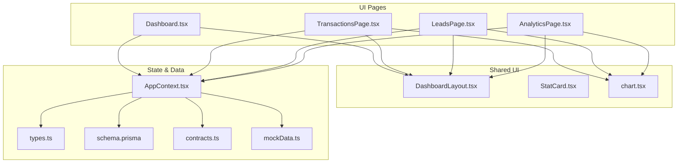
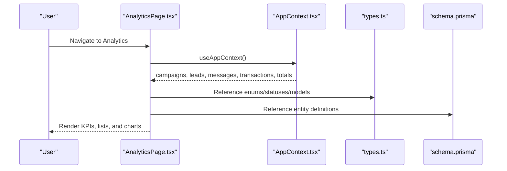
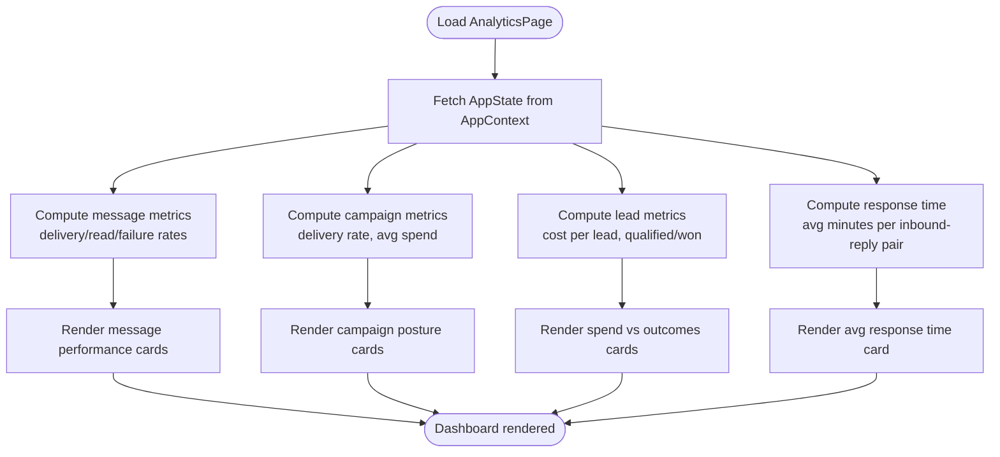
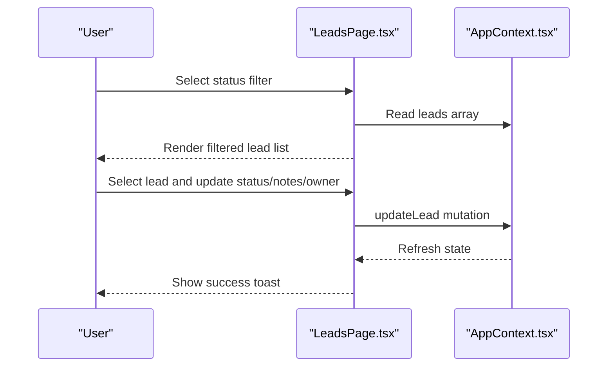
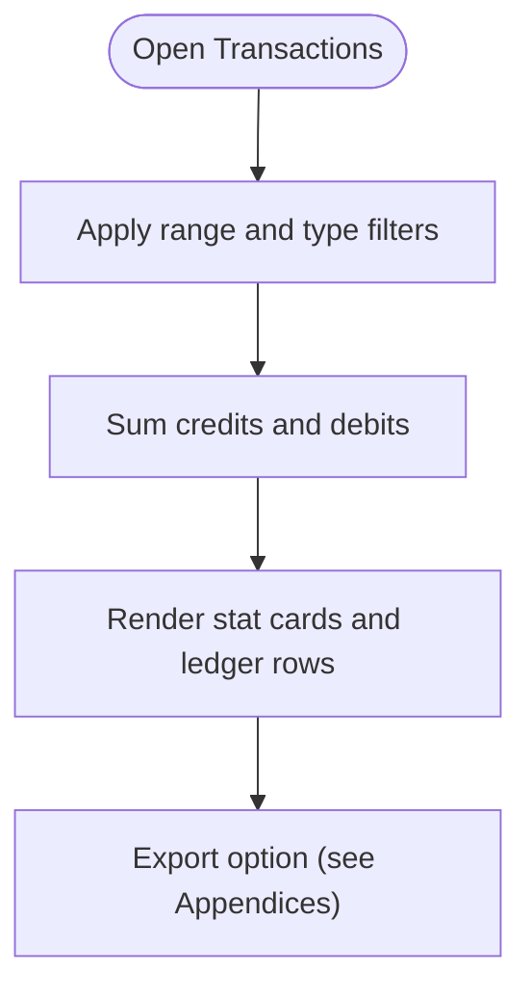
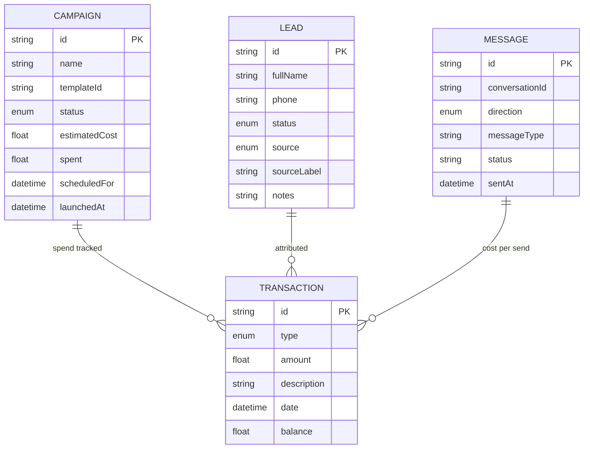
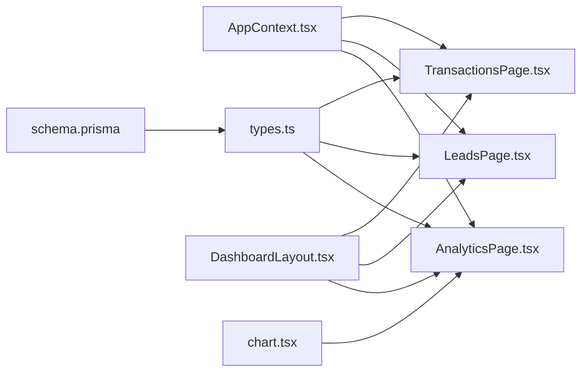

# Analytics & Reporting

<cite>
**Referenced Files in This Document**
- [AnalyticsPage.tsx](file://src/pages/AnalyticsPage.tsx)
- [Dashboard.tsx](file://src/pages/Dashboard.tsx)
- [LeadsPage.tsx](file://src/pages/LeadsPage.tsx)
- [TransactionsPage.tsx](file://src/pages/TransactionsPage.tsx)
- [AppContext.tsx](file://src/context/AppContext.tsx)
- [DashboardLayout.tsx](file://src/components/DashboardLayout.tsx)
- [chart.tsx](file://src/components/ui/chart.tsx)
- [schema.prisma](file://prisma/schema.prisma)
- [types.ts](file://src/lib/api/types.ts)
- [contracts.ts](file://src/lib/api/contracts.ts)
- [mockData.ts](file://src/lib/api/mockData.ts)
</cite>

## Table of Contents
1. [Introduction](#introduction)
2. [Project Structure](#project-structure)
3. [Core Components](#core-components)
4. [Architecture Overview](#architecture-overview)
5. [Detailed Component Analysis](#detailed-component-analysis)
6. [Dependency Analysis](#dependency-analysis)
7. [Performance Considerations](#performance-considerations)
8. [Troubleshooting Guide](#troubleshooting-guide)
9. [Conclusion](#conclusion)
10. [Appendices](#appendices)

## Introduction
This document explains the Analytics and Reporting capabilities of the platform with a focus on:
- Dashboard overview and KPI presentation
- Performance metrics (delivery, read, failure rates; response time)
- Campaign analytics (delivery posture, spend, cost per acquisition)
- Lead analytics (source attribution, qualification, win rates)
- Financial reporting (wallet movements, spend categorization)
- Data aggregation, historical data, and real-time processing
- Practical examples for report generation, custom dashboards, and export
- Guidance for interpreting analytics and making data-driven decisions

The analytics layer is implemented as a React-based dashboard that consumes application state from a shared context, aggregates metrics client-side, and surfaces insights via cards and lists. Charts are supported via a reusable Recharts wrapper.

## Project Structure
The analytics surface is primarily implemented in dedicated pages and shared UI components:
- Analytics overview page: [AnalyticsPage.tsx](file://src/pages/AnalyticsPage.tsx)
- Dashboard highlights: [Dashboard.tsx](file://src/pages/Dashboard.tsx)
- Lead pipeline and attribution: [LeadsPage.tsx](file://src/pages/LeadsPage.tsx)
- Financial ledger and spend: [TransactionsPage.tsx](file://src/pages/TransactionsPage.tsx)
- Shared layout and metrics: [DashboardLayout.tsx](file://src/components/DashboardLayout.tsx), [StatCard.tsx](file://src/components/StatCard.tsx)
- Data model and types: [schema.prisma](file://prisma/schema.prisma), [types.ts](file://src/lib/api/types.ts)
- API contracts and state shape: [contracts.ts](file://src/lib/api/contracts.ts), [mockData.ts](file://src/lib/api/mockData.ts)

**Diagram sources**
- [AnalyticsPage.tsx:1-269](file://src/pages/AnalyticsPage.tsx#L1-L269)
- [Dashboard.tsx:214-236](file://src/pages/Dashboard.tsx#L214-L236)
- [LeadsPage.tsx:1-266](file://src/pages/LeadsPage.tsx#L1-L266)
- [TransactionsPage.tsx:1-214](file://src/pages/TransactionsPage.tsx#L1-L214)
- [DashboardLayout.tsx:1-37](file://src/components/DashboardLayout.tsx#L1-L37)
- [chart.tsx:1-304](file://src/components/ui/chart.tsx#L1-L304)
- [AppContext.tsx:1-193](file://src/context/AppContext.tsx#L1-L193)
- [types.ts:1-299](file://src/lib/api/types.ts#L1-L299)
- [schema.prisma:1-189](file://prisma/schema.prisma#L1-L189)
- [contracts.ts:1-156](file://src/lib/api/contracts.ts#L1-L156)
- [mockData.ts:1-367](file://src/lib/api/mockData.ts#L1-L367)

**Section sources**
- [AnalyticsPage.tsx:1-269](file://src/pages/AnalyticsPage.tsx#L1-L269)
- [Dashboard.tsx:214-236](file://src/pages/Dashboard.tsx#L214-L236)
- [LeadsPage.tsx:1-266](file://src/pages/LeadsPage.tsx#L1-L266)
- [TransactionsPage.tsx:1-214](file://src/pages/TransactionsPage.tsx#L1-L214)
- [DashboardLayout.tsx:1-37](file://src/components/DashboardLayout.tsx#L1-L37)
- [chart.tsx:1-304](file://src/components/ui/chart.tsx#L1-L304)
- [AppContext.tsx:1-193](file://src/context/AppContext.tsx#L1-L193)
- [types.ts:1-299](file://src/lib/api/types.ts#L1-L299)
- [schema.prisma:1-189](file://prisma/schema.prisma#L1-L189)
- [contracts.ts:1-156](file://src/lib/api/contracts.ts#L1-L156)
- [mockData.ts:1-367](file://src/lib/api/mockData.ts#L1-L367)

## Core Components
- Analytics dashboard page: Aggregates and displays KPIs for message delivery/read/failure, campaign posture, lead source performance, and spend efficiency.
- Leads pipeline: Provides lead source attribution, qualification, and stage transitions.
- Financial ledger: Filters and summarizes wallet transactions by type and period.
- Shared layout and metrics: Provides consistent header, sidebar, and metric cards.
- Data model and types: Defines entities (campaigns, leads, transactions, messages) and statuses used across analytics.

Key metrics computed in the analytics page:
- Outbound delivery rate, read rate, failure rate
- Average response time (minutes) from inbound to first outbound reply
- Campaign delivery rate and average campaign spend
- Cost per lead, cost per qualified lead, cost per won lead
- Lead source totals, qualified, and won counts

**Section sources**
- [AnalyticsPage.tsx:5-206](file://src/pages/AnalyticsPage.tsx#L5-L206)
- [LeadsPage.tsx:1-266](file://src/pages/LeadsPage.tsx#L1-L266)
- [TransactionsPage.tsx:21-53](file://src/pages/TransactionsPage.tsx#L21-L53)
- [DashboardLayout.tsx:1-37](file://src/components/DashboardLayout.tsx#L1-L37)
- [types.ts:87-211](file://src/lib/api/types.ts#L87-L211)

## Architecture Overview
The analytics layer relies on a centralized application state consumed via a React context. Pages compute metrics from this state and render them in cards and lists. Charts are supported via a Recharts wrapper.

**Diagram sources**
- [AnalyticsPage.tsx:5-13](file://src/pages/AnalyticsPage.tsx#L5-L13)
- [AppContext.tsx:94-180](file://src/context/AppContext.tsx#L94-L180)
- [types.ts:87-211](file://src/lib/api/types.ts#L87-L211)
- [schema.prisma:147-188](file://prisma/schema.prisma#L147-L188)

## Detailed Component Analysis

### Analytics Dashboard
The analytics dashboard computes and presents:
- Top stats: total spent, wallet balance, qualified pipeline
- Metric cards: delivery rate, read rate, campaign delivery, average response time, cost per lead
- Message performance: delivery/read/failure rates and inbound/outbound mix
- Campaign posture: delivered/live campaigns, average spend, read-tracked messages
- Lead source performance: totals, qualified, won per source
- Spend vs outcomes: total spend, cost per lead, cost per qualified lead, cost per won lead

**Diagram sources**
- [AnalyticsPage.tsx:15-79](file://src/pages/AnalyticsPage.tsx#L15-L79)

**Section sources**
- [AnalyticsPage.tsx:5-206](file://src/pages/AnalyticsPage.tsx#L5-L206)

### Leads Analytics
The leads page supports:
- Filtering by status (All/New/Contacted/Qualified/Won/Lost)
- Attribution details parsing from lead notes (e.g., Meta page/ad/form identifiers)
- Operator actions: assign owner, update qualification notes, move stages

**Diagram sources**
- [LeadsPage.tsx:9-49](file://src/pages/LeadsPage.tsx#L9-L49)
- [AppContext.tsx:153-156](file://src/context/AppContext.tsx#L153-L156)

**Section sources**
- [LeadsPage.tsx:1-266](file://src/pages/LeadsPage.tsx#L1-L266)
- [AppContext.tsx:153-156](file://src/context/AppContext.tsx#L153-L156)

### Financial Reporting
The transactions page enables:
- Filtering by date range (all/7/30/90 days) and type (all/credit/debit)
- Computing totals for credits and debits within the selected window
- Displaying ledger balance and summarized stat cards

**Diagram sources**
- [TransactionsPage.tsx:26-53](file://src/pages/TransactionsPage.tsx#L26-L53)

**Section sources**
- [TransactionsPage.tsx:1-214](file://src/pages/TransactionsPage.tsx#L1-L214)

### Data Model and Metrics Mapping
Entities and statuses used in analytics:
- Campaigns: status, estimatedCost, spent
- Leads: status, source, sourceLabel, notes
- Messages: direction, status, sentAt
- Transactions: type, amount, date, balance

**Diagram sources**
- [schema.prisma:147-188](file://prisma/schema.prisma#L147-L188)
- [types.ts:87-105](file://src/lib/api/types.ts#L87-L105)
- [types.ts:175-188](file://src/lib/api/types.ts#L175-L188)
- [types.ts:127-135](file://src/lib/api/types.ts#L127-L135)

**Section sources**
- [schema.prisma:147-188](file://prisma/schema.prisma#L147-L188)
- [types.ts:87-188](file://src/lib/api/types.ts#L87-L188)

## Dependency Analysis
- AnalyticsPage depends on AppContext for campaigns, leads, messages, and totals.
- LeadsPage depends on AppContext for leads and updateLead mutations.
- TransactionsPage depends on AppContext for transactions and applies local filtering.
- Shared UI components (DashboardLayout, StatCard, chart wrapper) are reused across pages.
- Data types and Prisma models define the canonical schema for analytics computations.

**Diagram sources**
- [AppContext.tsx:94-180](file://src/context/AppContext.tsx#L94-L180)
- [AnalyticsPage.tsx:5-13](file://src/pages/AnalyticsPage.tsx#L5-L13)
- [LeadsPage.tsx:9-10](file://src/pages/LeadsPage.tsx#L9-L10)
- [TransactionsPage.tsx:22-23](file://src/pages/TransactionsPage.tsx#L22-L23)
- [types.ts:190-211](file://src/lib/api/types.ts#L190-L211)
- [schema.prisma:147-188](file://prisma/schema.prisma#L147-L188)
- [DashboardLayout.tsx:5-36](file://src/components/DashboardLayout.tsx#L5-L36)
- [chart.tsx:32-59](file://src/components/ui/chart.tsx#L32-L59)

**Section sources**
- [AppContext.tsx:94-180](file://src/context/AppContext.tsx#L94-L180)
- [AnalyticsPage.tsx:5-13](file://src/pages/AnalyticsPage.tsx#L5-L13)
- [LeadsPage.tsx:9-10](file://src/pages/LeadsPage.tsx#L9-L10)
- [TransactionsPage.tsx:22-23](file://src/pages/TransactionsPage.tsx#L22-L23)
- [types.ts:190-211](file://src/lib/api/types.ts#L190-L211)
- [schema.prisma:147-188](file://prisma/schema.prisma#L147-L188)
- [DashboardLayout.tsx:5-36](file://src/components/DashboardLayout.tsx#L5-L36)
- [chart.tsx:32-59](file://src/components/ui/chart.tsx#L32-L59)

## Performance Considerations
- Client-side computation: Metrics are computed from the current AppState snapshot. For large datasets, consider virtualized lists and memoization to avoid unnecessary re-renders.
- Filtering and sorting: Sorting messages per conversation and computing response times scales with conversation length. Consider precomputing or caching response intervals if data volume grows.
- Rendering charts: Use the chart wrapper to minimize repeated configuration and leverage Recharts’ internal optimizations.

[No sources needed since this section provides general guidance]

## Troubleshooting Guide
- Missing lead-source data: The analytics page hides empty lead-source rows; ensure leads are present and have a non-empty source.
- No response time: Average response time appears as “-” when no inbound-reply pairs are found; ensure conversations contain both inbound and outbound messages.
- Insufficient wallet balance: Campaign creation is blocked when balance is below threshold; top up the wallet to enable sends.
- Meta connection required: Live campaign sends require a connected Meta WhatsApp number; connect before sending.

**Section sources**
- [AnalyticsPage.tsx:175-187](file://src/pages/AnalyticsPage.tsx#L175-L187)
- [AnalyticsPage.tsx:71-73](file://src/pages/AnalyticsPage.tsx#L71-L73)
- [CampaignsPage.tsx:121-128](file://src/pages/CampaignsPage.tsx#L121-L128)
- [CampaignsPage.tsx:440-448](file://src/pages/CampaignsPage.tsx#L440-L448)

## Conclusion
The analytics and reporting layer provides a practical, real-time view of message delivery, campaign performance, lead sources, and financial outcomes. It leverages a shared state model and reusable UI components to deliver actionable insights. For deeper analysis, integrate the chart wrapper for trend visualization and expand filtering to support custom date ranges and export formats.

[No sources needed since this section summarizes without analyzing specific files]

## Appendices

### Practical Examples

- Report generation
  - Use the filters on the Transactions page to isolate a period and transaction type, then export the visible ledger rows to CSV or PDF using browser tools.
  - Example path: [TransactionsPage.tsx:118-145](file://src/pages/TransactionsPage.tsx#L118-L145)

- Custom dashboard creation
  - Build a new page similar to AnalyticsPage by consuming AppState via AppContext and rendering StatCard components.
  - Example path: [AnalyticsPage.tsx:105-205](file://src/pages/AnalyticsPage.tsx#L105-L205)

- Real-time updates
  - The AppContext hydrates state on mount and subscribes to auth changes; pages re-render when state updates.
  - Example path: [AppContext.tsx:58-92](file://src/context/AppContext.tsx#L58-L92)

- Historical data and retention
  - Historical data is represented by the AppState arrays (transactions, campaigns, leads, messages). Retention policies are not enforced in the frontend; consider backend retention rules if needed.
  - Example path: [types.ts:190-211](file://src/lib/api/types.ts#L190-L211)

- Trend visualization
  - Wrap chart components with the chart container and tooltip to visualize trends over time.
  - Example path: [chart.tsx:32-59](file://src/components/ui/chart.tsx#L32-L59)

- Advanced analytics (conceptual)
  - Predictive modeling: Use historical campaign and lead data to train simple regressions for cost-per-acquisition or conversion probability.
  - Cohort analysis: Group leads by source and measure retention or conversion over time windows.
  - A/B testing: Compare delivery/read rates and cost per lead across template variants or send windows.

[No sources needed since this section provides general guidance]