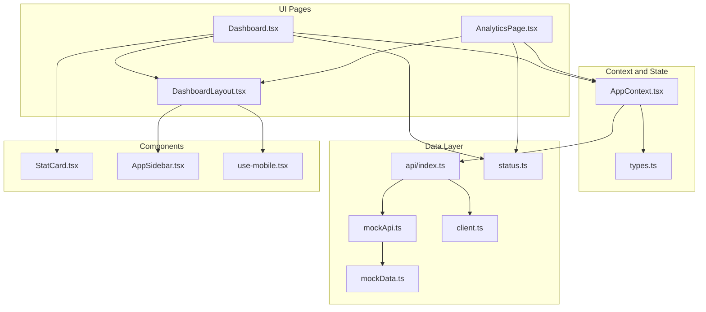
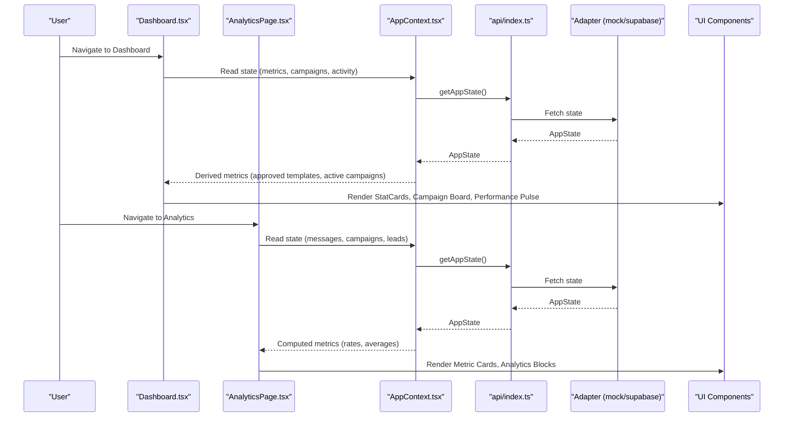
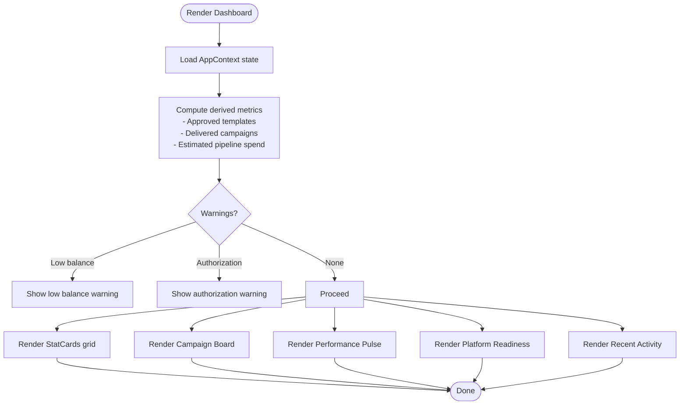
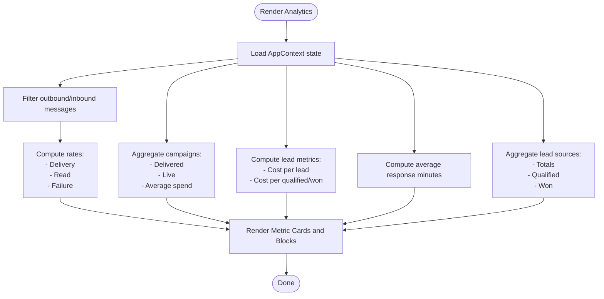
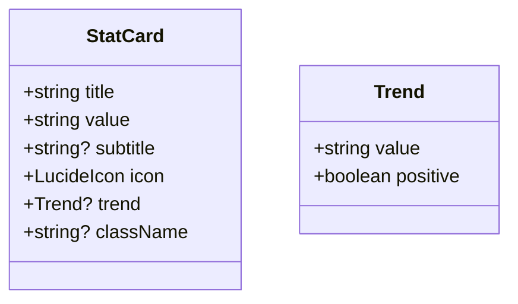
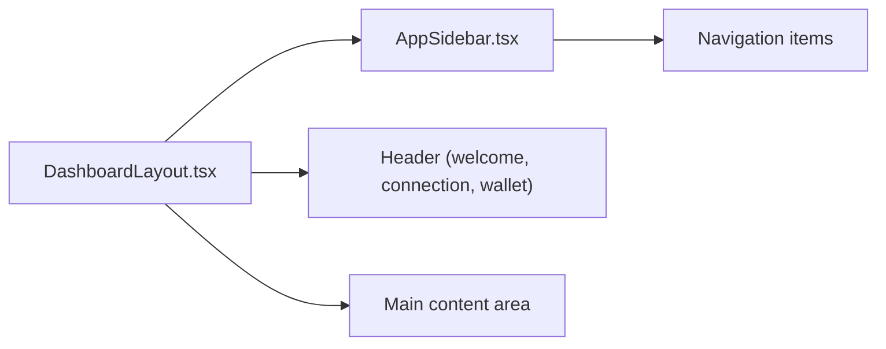
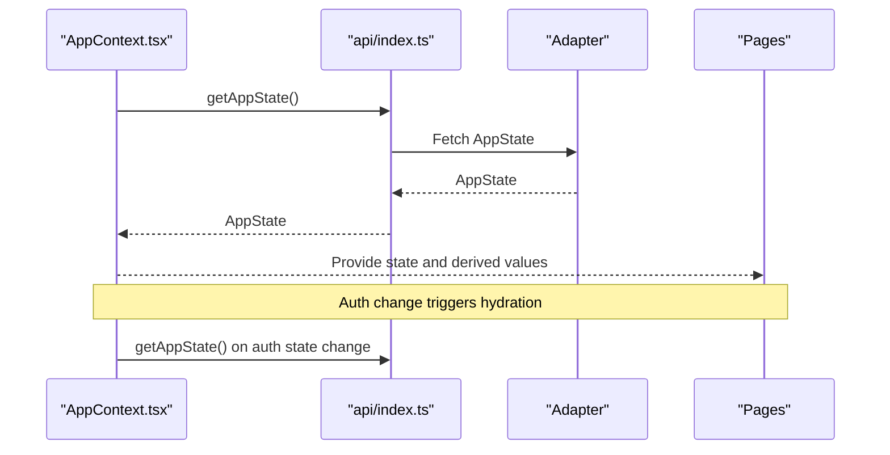
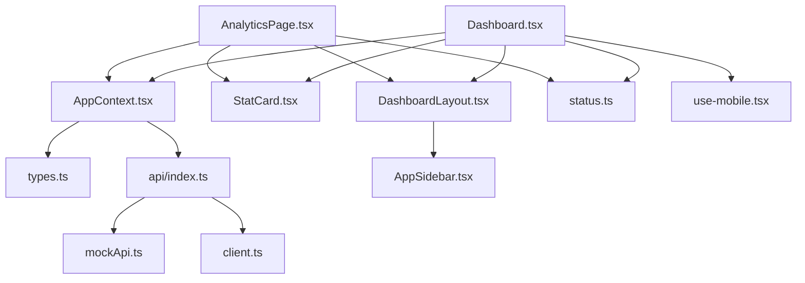

# Dashboard Overview

<cite>
**Referenced Files in This Document**
- [Dashboard.tsx](file://src/pages/Dashboard.tsx)
- [AnalyticsPage.tsx](file://src/pages/AnalyticsPage.tsx)
- [StatCard.tsx](file://src/components/StatCard.tsx)
- [DashboardLayout.tsx](file://src/components/DashboardLayout.tsx)
- [AppContext.tsx](file://src/context/AppContext.tsx)
- [types.ts](file://src/lib/api/types.ts)
- [status.ts](file://src/lib/meta/status.ts)
- [mockApi.ts](file://src/lib/api/mockApi.ts)
- [mockData.ts](file://src/lib/api/mockData.ts)
- [index.ts](file://src/lib/api/index.ts)
- [client.ts](file://src/lib/supabase/client.ts)
- [use-mobile.tsx](file://src/hooks/use-mobile.tsx)
- [AppSidebar.tsx](file://src/components/AppSidebar.tsx)
</cite>

## Table of Contents
1. [Introduction](#introduction)
2. [Project Structure](#project-structure)
3. [Core Components](#core-components)
4. [Architecture Overview](#architecture-overview)
5. [Detailed Component Analysis](#detailed-component-analysis)
6. [Dependency Analysis](#dependency-analysis)
7. [Performance Considerations](#performance-considerations)
8. [Troubleshooting Guide](#troubleshooting-guide)
9. [Conclusion](#conclusion)
10. [Appendices](#appendices)

## Introduction
This document provides a comprehensive overview of the Analytics Dashboard, focusing on the main dashboard interface, key performance indicators (KPIs), and real-time data visualization. It explains the dashboard layout, including top statistics cards, metric cards with icons, and performance overview sections. It documents the data aggregation system that computes delivery rates, read rates, campaign performance, and response times, and details the real-time data updates mechanism and how metrics are refreshed. Practical examples illustrate dashboard navigation, metric interpretation, and trend identification. The responsive design approach and mobile-friendly features are addressed, along with customization options, widget arrangement, and personalization features. Guidance is provided on understanding dashboard data, identifying performance trends, and making informed business decisions based on visual analytics.

## Project Structure
The dashboard is implemented as two primary pages:
- Dashboard: A concise overview of workspace health, recent activity, and quick KPIs.
- Analytics: A deeper analytical view covering message performance, campaign posture, lead source performance, and spend efficiency.

Both pages are wrapped in a shared layout that provides consistent navigation, branding, and header controls.

**Diagram sources**
- [Dashboard.tsx:1-333](file://src/pages/Dashboard.tsx#L1-L333)
- [AnalyticsPage.tsx:1-269](file://src/pages/AnalyticsPage.tsx#L1-L269)
- [DashboardLayout.tsx:1-37](file://src/components/DashboardLayout.tsx#L1-L37)
- [AppContext.tsx:1-239](file://src/context/AppContext.tsx#L1-L239)
- [types.ts:1-375](file://src/lib/api/types.ts#L1-L375)
- [index.ts:1-23](file://src/lib/api/index.ts#L1-L23)
- [mockApi.ts:1-768](file://src/lib/api/mockApi.ts#L1-L768)
- [status.ts:1-85](file://src/lib/meta/status.ts#L1-L85)
- [mockData.ts:1-367](file://src/lib/api/mockData.ts#L1-L367)
- [client.ts:1-16](file://src/lib/supabase/client.ts#L1-L16)
- [StatCard.tsx:1-34](file://src/components/StatCard.tsx#L1-L34)
- [AppSidebar.tsx:1-146](file://src/components/AppSidebar.tsx#L1-L146)
- [use-mobile.tsx:1-20](file://src/hooks/use-mobile.tsx#L1-L20)

**Section sources**
- [Dashboard.tsx:1-333](file://src/pages/Dashboard.tsx#L1-L333)
- [AnalyticsPage.tsx:1-269](file://src/pages/AnalyticsPage.tsx#L1-L269)
- [DashboardLayout.tsx:1-37](file://src/components/DashboardLayout.tsx#L1-L37)
- [AppContext.tsx:1-239](file://src/context/AppContext.tsx#L1-L239)
- [types.ts:1-375](file://src/lib/api/types.ts#L1-L375)
- [index.ts:1-23](file://src/lib/api/index.ts#L1-L23)
- [mockApi.ts:1-768](file://src/lib/api/mockApi.ts#L1-L768)
- [status.ts:1-85](file://src/lib/meta/status.ts#L1-L85)
- [mockData.ts:1-367](file://src/lib/api/mockData.ts#L1-L367)
- [client.ts:1-16](file://src/lib/supabase/client.ts#L1-L16)
- [StatCard.tsx:1-34](file://src/components/StatCard.tsx#L1-L34)
- [AppSidebar.tsx:1-146](file://src/components/AppSidebar.tsx#L1-L146)
- [use-mobile.tsx:1-20](file://src/hooks/use-mobile.tsx#L1-L20)

## Core Components
- Dashboard page: Presents a high-level overview with top statistics, connection and template status, recent activity, and performance pulse. It aggregates derived metrics from the global state.
- Analytics page: Provides detailed KPIs such as delivery/read/failure rates, campaign delivery posture, response time, and cost-per-lead metrics. It also displays lead source performance and spend efficiency.
- StatCard component: A reusable card for displaying metrics with icons, subtitles, and optional trend indicators.
- DashboardLayout: A shared layout that renders the sidebar, header, and main content area.
- AppContext: Central state provider that hydrates application state from either a mock adapter or a Supabase-backed adapter, exposes actions, and exposes computed values (e.g., approved templates, active campaigns).
- Status helpers: Utility functions to translate internal status enums into human-readable labels and tones.
- Responsive hooks and sidebar: Provide mobile-friendly navigation and responsive behavior.

**Section sources**
- [Dashboard.tsx:26-332](file://src/pages/Dashboard.tsx#L26-L332)
- [AnalyticsPage.tsx:5-206](file://src/pages/AnalyticsPage.tsx#L5-L206)
- [StatCard.tsx:13-33](file://src/components/StatCard.tsx#L13-L33)
- [DashboardLayout.tsx:5-36](file://src/components/DashboardLayout.tsx#L5-L36)
- [AppContext.tsx:58-229](file://src/context/AppContext.tsx#L58-L229)
- [status.ts:9-85](file://src/lib/meta/status.ts#L9-L85)
- [use-mobile.tsx:5-19](file://src/hooks/use-mobile.tsx#L5-L19)

## Architecture Overview
The dashboard architecture follows a unidirectional data flow:
- AppContext hydrates state from the active API adapter (mock or Supabase).
- Pages consume state via hooks and render UI.
- Metrics are computed locally from the hydrated state.
- Actions (e.g., retry failed send, refresh state) update state and trigger re-render.

**Diagram sources**
- [Dashboard.tsx:26-332](file://src/pages/Dashboard.tsx#L26-L332)
- [AnalyticsPage.tsx:5-206](file://src/pages/AnalyticsPage.tsx#L5-L206)
- [AppContext.tsx:58-98](file://src/context/AppContext.tsx#L58-L98)
- [index.ts:13-23](file://src/lib/api/index.ts#L13-L23)
- [mockApi.ts:123-125](file://src/lib/api/mockApi.ts#L123-L125)
- [client.ts:8-15](file://src/lib/supabase/client.ts#L8-L15)

## Detailed Component Analysis

### Dashboard Page
The Dashboard page organizes information into:
- Hero banner with workspace summary and connection/template/pipeline status.
- Low balance and authorization warnings.
- Grid of StatCards for Messages Sent, Reachable Contacts, Wallet Balance, Active Campaigns.
- Campaign operating board: recent campaigns with recipients, dates, costs, and statuses.
- Performance pulse: high-level metrics such as delivery quality, average campaign cost, and template availability.
- Platform readiness: connection health, business verification, OBA status, and wallet/template controls.
- Recent activity feed.

**Diagram sources**
- [Dashboard.tsx:26-332](file://src/pages/Dashboard.tsx#L26-L332)
- [AppContext.tsx:100-111](file://src/context/AppContext.tsx#L100-L111)
- [status.ts:9-68](file://src/lib/meta/status.ts#L9-L68)

**Section sources**
- [Dashboard.tsx:26-332](file://src/pages/Dashboard.tsx#L26-L332)
- [AppContext.tsx:100-111](file://src/context/AppContext.tsx#L100-L111)
- [status.ts:9-68](file://src/lib/meta/status.ts#L9-L68)

### Analytics Page
The Analytics page focuses on deeper insights:
- Top stats: Total spent, Wallet balance, Qualified pipeline.
- Metric cards: Delivery rate, Read rate, Campaign delivery, Average response time, Cost per lead.
- Message performance: Outbound delivery/read/failure rates and message mix.
- Campaign delivery and read posture: Delivered/live campaigns, average campaign spend, read-tracked messages.
- Lead source performance: Totals, qualified, and won counts per source.
- Spend versus outcome: Total spend and cost per lead variants.

**Diagram sources**
- [AnalyticsPage.tsx:5-206](file://src/pages/AnalyticsPage.tsx#L5-L206)

**Section sources**
- [AnalyticsPage.tsx:5-206](file://src/pages/AnalyticsPage.tsx#L5-L206)

### StatCard Component
StatCard is a reusable component that renders a metric with:
- Title and value.
- Optional subtitle and trend indicator.
- Icon slot for visual emphasis.

**Diagram sources**
- [StatCard.tsx:4-11](file://src/components/StatCard.tsx#L4-L11)

**Section sources**
- [StatCard.tsx:13-33](file://src/components/StatCard.tsx#L13-L33)

### DashboardLayout and Navigation
DashboardLayout provides:
- Collapsible sidebar with navigation links.
- Header with welcome message, connection status, and wallet balance.
- Main content area for page rendering.

**Diagram sources**
- [DashboardLayout.tsx:5-36](file://src/components/DashboardLayout.tsx#L5-L36)
- [AppSidebar.tsx:36-51](file://src/components/AppSidebar.tsx#L36-L51)

**Section sources**
- [DashboardLayout.tsx:5-36](file://src/components/DashboardLayout.tsx#L5-L36)
- [AppSidebar.tsx:36-51](file://src/components/AppSidebar.tsx#L36-L51)

### Data Aggregation and Real-Time Updates
- Aggregation: Delivery/read/failure rates, campaign delivery posture, average response time, and cost-per-lead are computed from hydrated state arrays (messages, campaigns, leads).
- Real-time updates: AppContext hydrates state on mount and subscribes to auth state changes (when using Supabase). Actions like retrying failed sends and refreshing state trigger re-fetches and re-renders.

**Diagram sources**
- [AppContext.tsx:58-98](file://src/context/AppContext.tsx#L58-L98)
- [index.ts:13-23](file://src/lib/api/index.ts#L13-L23)
- [mockApi.ts:123-125](file://src/lib/api/mockApi.ts#L123-L125)
- [client.ts:8-15](file://src/lib/supabase/client.ts#L8-L15)

**Section sources**
- [AppContext.tsx:58-98](file://src/context/AppContext.tsx#L58-L98)
- [index.ts:13-23](file://src/lib/api/index.ts#L13-L23)
- [mockApi.ts:123-125](file://src/lib/api/mockApi.ts#L123-L125)
- [client.ts:8-15](file://src/lib/supabase/client.ts#L8-L15)

## Dependency Analysis
- Pages depend on AppContext for state and derived metrics.
- AppContext depends on the active API adapter (mock or Supabase).
- Status helpers transform internal enums into readable labels.
- Components like StatCard are used across pages for consistent presentation.
- Sidebar and layout components provide navigation and responsive behavior.

**Diagram sources**
- [Dashboard.tsx:26-332](file://src/pages/Dashboard.tsx#L26-L332)
- [AnalyticsPage.tsx:5-206](file://src/pages/AnalyticsPage.tsx#L5-L206)
- [AppContext.tsx:58-229](file://src/context/AppContext.tsx#L58-L229)
- [types.ts:1-375](file://src/lib/api/types.ts#L1-L375)
- [index.ts:1-23](file://src/lib/api/index.ts#L1-L23)
- [mockApi.ts:1-768](file://src/lib/api/mockApi.ts#L1-L768)
- [client.ts:1-16](file://src/lib/supabase/client.ts#L1-L16)
- [StatCard.tsx:1-34](file://src/components/StatCard.tsx#L1-L34)
- [DashboardLayout.tsx:1-37](file://src/components/DashboardLayout.tsx#L1-L37)
- [AppSidebar.tsx:1-146](file://src/components/AppSidebar.tsx#L1-L146)
- [status.ts:1-85](file://src/lib/meta/status.ts#L1-L85)
- [use-mobile.tsx:1-20](file://src/hooks/use-mobile.tsx#L1-L20)

**Section sources**
- [Dashboard.tsx:26-332](file://src/pages/Dashboard.tsx#L26-L332)
- [AnalyticsPage.tsx:5-206](file://src/pages/AnalyticsPage.tsx#L5-L206)
- [AppContext.tsx:58-229](file://src/context/AppContext.tsx#L58-L229)
- [types.ts:1-375](file://src/lib/api/types.ts#L1-L375)
- [index.ts:1-23](file://src/lib/api/index.ts#L1-L23)
- [mockApi.ts:1-768](file://src/lib/api/mockApi.ts#L1-L768)
- [client.ts:1-16](file://src/lib/supabase/client.ts#L1-L16)
- [StatCard.tsx:1-34](file://src/components/StatCard.tsx#L1-L34)
- [DashboardLayout.tsx:1-37](file://src/components/DashboardLayout.tsx#L1-L37)
- [AppSidebar.tsx:1-146](file://src/components/AppSidebar.tsx#L1-L146)
- [status.ts:1-85](file://src/lib/meta/status.ts#L1-L85)
- [use-mobile.tsx:1-20](file://src/hooks/use-mobile.tsx#L1-L20)

## Performance Considerations
- Rendering efficiency: Pages compute metrics from state arrays; memoization and derived values reduce recomputation overhead.
- Hydration strategy: On mount, state is fetched once and then subscribed to auth changes (Supabase). This minimizes redundant network calls.
- Local computation: Metrics are calculated client-side from the hydrated state, avoiding server round trips for dashboards.
- Responsive design: Mobile hook detects viewport and informs layout decisions; sidebar collapses for smaller screens.

[No sources needed since this section provides general guidance]

## Troubleshooting Guide
- Low wallet balance warning: Appears when the wallet balance is below a configured threshold. Add funds to maintain campaign velocity.
- Authorization warnings: Displayed when Meta authorization is expired, expiring soon, or missing. Reconnect WhatsApp from the Connect screen to restore sending capabilities.
- Failed send logs and operational logs: Investigate errors and warnings to identify root causes and take corrective actions (e.g., retry failed sends).
- Refreshing state: Use the refresh action to pull the latest state from the adapter and update metrics.

**Section sources**
- [Dashboard.tsx:99-135](file://src/pages/Dashboard.tsx#L99-L135)
- [ReliabilityPage.tsx:8-43](file://src/pages/ReliabilityPage.tsx#L8-L43)
- [AppContext.tsx:182-185](file://src/context/AppContext.tsx#L182-L185)

## Conclusion
The Analytics Dashboard delivers a comprehensive, real-time view of workspace performance. It combines high-level summaries with detailed analytics, enabling operators and founders to monitor connection health, campaign velocity, message quality, and spend efficiency. The modular architecture, centralized state management, and responsive design ensure a robust and accessible experience across devices. By interpreting the presented metrics and trends, stakeholders can make informed decisions to optimize messaging operations and drive business outcomes.

[No sources needed since this section summarizes without analyzing specific files]

## Appendices

### Practical Examples
- Dashboard navigation:
  - Use the sidebar to navigate between Dashboard, Analytics, Campaigns, Inbox, Leads, Automations, Templates, Contacts, Wallet, Transactions, and Settings.
  - The header displays the current user, connection status, and wallet balance.
- Metric interpretation:
  - Delivery rate: Percentage of outbound messages successfully delivered.
  - Read rate: Percentage of outbound messages with read receipts.
  - Campaign delivery: Percentage of campaigns that completed successfully.
  - Average response time: Minutes between the first inbound and the first outbound reply.
  - Cost per lead: Total spend divided by the number of leads.
- Trend identification:
  - Compare StatCard trends and recent activity to spot changes in campaign velocity, template approvals, and authorization status.
  - Monitor lead source performance to allocate marketing budgets effectively.

**Section sources**
- [AppSidebar.tsx:36-51](file://src/components/AppSidebar.tsx#L36-L51)
- [DashboardLayout.tsx:13-27](file://src/components/DashboardLayout.tsx#L13-L27)
- [AnalyticsPage.tsx:81-102](file://src/pages/AnalyticsPage.tsx#L81-L102)

### Responsive Design and Mobile-Friendly Features
- Mobile detection: A dedicated hook determines whether the device is mobile and influences layout choices.
- Collapsible sidebar: The sidebar collapses to an icon-only mode on smaller screens, preserving navigation while saving space.
- Grid layouts: Responsive grids adapt to different screen sizes, ensuring readability and usability on mobile devices.

**Section sources**
- [use-mobile.tsx:5-19](file://src/hooks/use-mobile.tsx#L5-L19)
- [AppSidebar.tsx:57-60](file://src/components/AppSidebar.tsx#L57-L60)

### Dashboard Customization and Personalization
- Widget arrangement: The grid-based layout allows rearranging sections by modifying the page composition.
- Personalization: The header reflects the current user and connection status, providing contextual awareness.
- Status indicators: Color-coded badges and labels communicate readiness and health at a glance.

**Section sources**
- [DashboardLayout.tsx:13-27](file://src/components/DashboardLayout.tsx#L13-L27)
- [status.ts:70-84](file://src/lib/meta/status.ts#L70-L84)