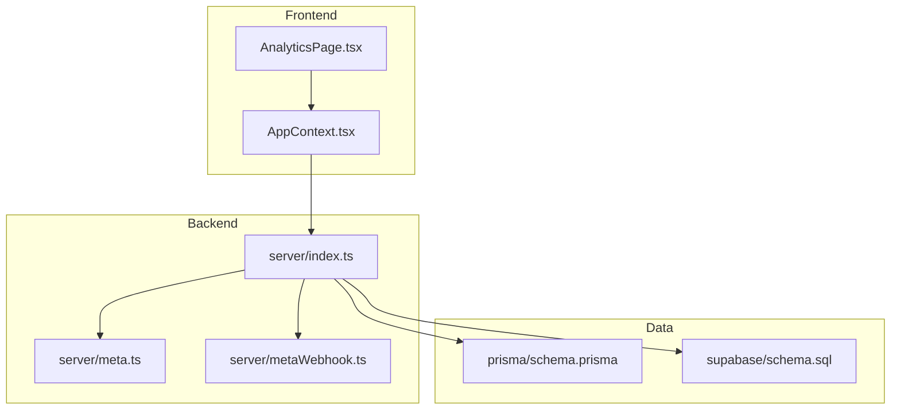
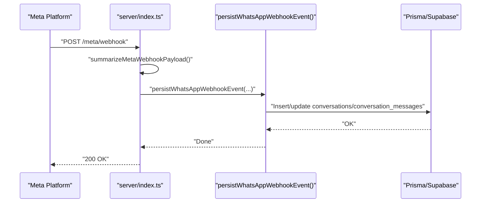
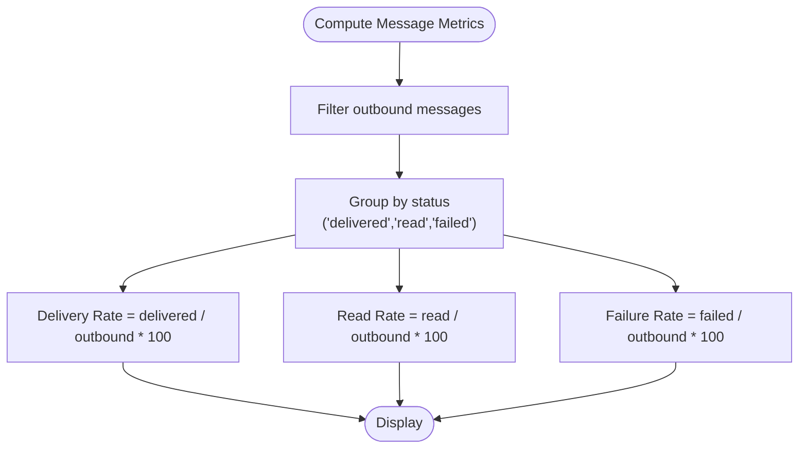
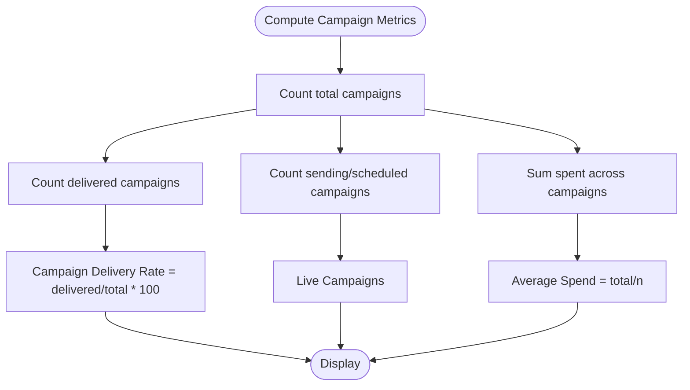
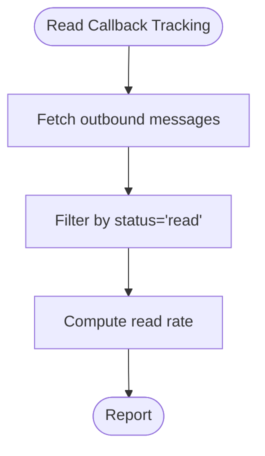
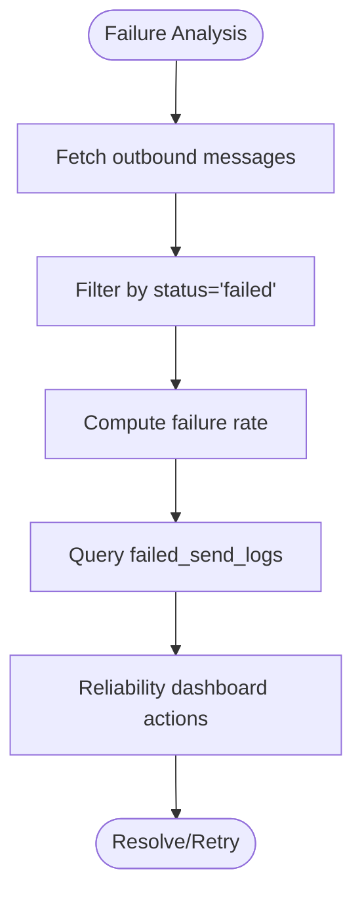
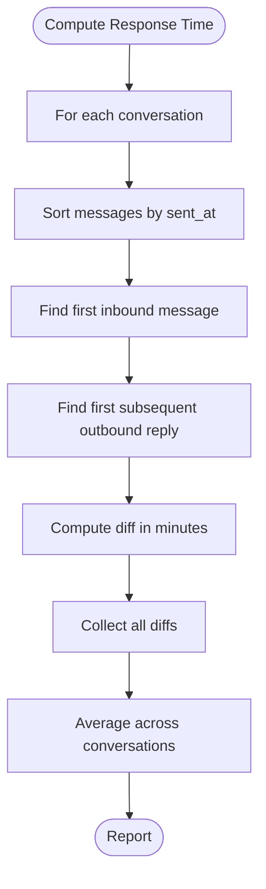
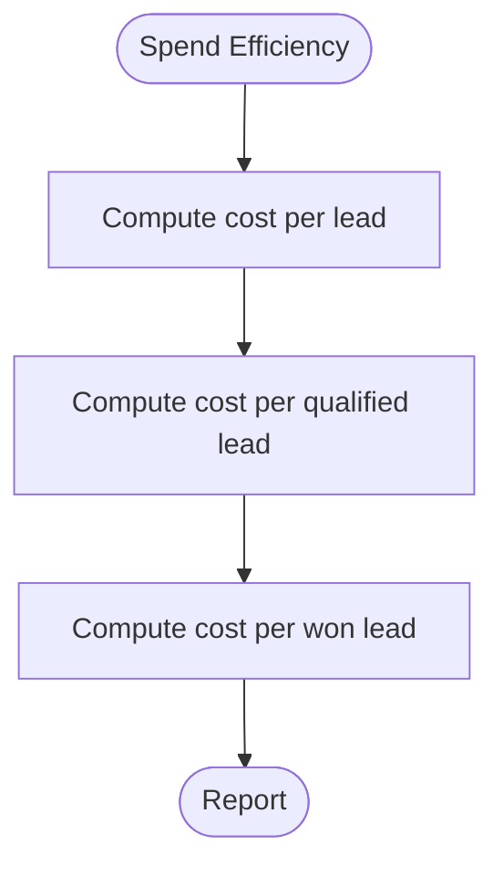
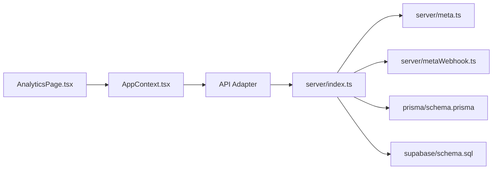

# Performance Metrics

<cite>
**Referenced Files in This Document**
- [AnalyticsPage.tsx](file://src/pages/AnalyticsPage.tsx)
- [ReliabilityPage.tsx](file://src/pages/ReliabilityPage.tsx)
- [AppContext.tsx](file://src/context/AppContext.tsx)
- [types.ts](file://src/lib/api/types.ts)
- [contracts.ts](file://src/lib/api/contracts.ts)
- [schema.prisma](file://prisma/schema.prisma)
- [schema.sql](file://supabase/schema.sql)
- [index.ts](file://server/index.ts)
- [meta.ts](file://server/meta.ts)
- [metaWebhook.ts](file://server/metaWebhook.ts)
- [index.ts](file://api/index.ts)
</cite>

## Table of Contents
1. [Introduction](#introduction)
2. [Project Structure](#project-structure)
3. [Core Components](#core-components)
4. [Architecture Overview](#architecture-overview)
5. [Detailed Component Analysis](#detailed-component-analysis)
6. [Dependency Analysis](#dependency-analysis)
7. [Performance Considerations](#performance-considerations)
8. [Troubleshooting Guide](#troubleshooting-guide)
9. [Conclusion](#conclusion)
10. [Appendices](#appendices)

## Introduction
This document explains the Performance Metrics implemented in the application, focusing on message delivery rates, read rates, failure rates, campaign performance indicators, and inbound-to-outbound reply timing. It details how metrics are calculated, where the data comes from, and how to interpret and act on them. It also covers thresholds, benchmarks, trend analysis, and optimization guidance grounded in the codebase.

## Project Structure
The performance metrics are surfaced in the Analytics dashboard and derived from application state and backend persistence. Key building blocks:
- Frontend analytics page computes and displays metrics from the shared application state.
- Application state aggregates conversations, messages, campaigns, leads, and operational logs.
- Backend persists message status updates via Meta webhooks and logs failures for reliability tracking.
- Data models define the canonical entities and statuses used to compute metrics.

**Diagram sources**
- [AnalyticsPage.tsx:1-269](file://src/pages/AnalyticsPage.tsx#L1-L269)
- [AppContext.tsx:1-239](file://src/context/AppContext.tsx#L1-L239)
- [server/index.ts:1-2494](file://server/index.ts#L1-L2494)
- [server/meta.ts:1-391](file://server/meta.ts#L1-L391)
- [server/metaWebhook.ts:1-113](file://server/metaWebhook.ts#L1-L113)
- [prisma/schema.prisma:1-279](file://prisma/schema.prisma#L1-L279)
- [schema.sql:175-206](file://supabase/schema.sql#L175-L206)

**Section sources**
- [AnalyticsPage.tsx:1-269](file://src/pages/AnalyticsPage.tsx#L1-L269)
- [AppContext.tsx:1-239](file://src/context/AppContext.tsx#L1-L239)
- [server/index.ts:1-2494](file://server/index.ts#L1-L2494)
- [prisma/schema.prisma:1-279](file://prisma/schema.prisma#L1-L279)
- [schema.sql:175-206](file://supabase/schema.sql#L175-L206)

## Core Components
- Outbound delivery rate: Percentage of outbound messages marked as delivered.
- Outbound read rate: Percentage of outbound messages with read callbacks.
- Outbound failure rate: Percentage of outbound messages marked as failed.
- Campaign delivery rate: Percentage of campaigns with status “Delivered”.
- Live campaigns: Count of campaigns with status “Sending” or “Scheduled”.
- Average campaign spend: Total spent across campaigns divided by number of campaigns.
- Average response time: Minutes between an inbound message and the operator’s first outbound reply.
- Cost per lead metrics: Total spend divided by total leads, qualified leads, and won leads.

These metrics are computed from:
- Application state fields: campaigns, conversationMessages, conversations, leads, totalSpent, walletBalance.
- Backend webhook processing updates message statuses and persists operational logs and failed send records.

**Section sources**
- [AnalyticsPage.tsx:15-31](file://src/pages/AnalyticsPage.tsx#L15-L31)
- [AnalyticsPage.tsx:25-31](file://src/pages/AnalyticsPage.tsx#L25-L31)
- [AnalyticsPage.tsx:45-73](file://src/pages/AnalyticsPage.tsx#L45-L73)
- [types.ts:255-282](file://src/lib/api/types.ts#L255-L282)
- [types.ts:127-135](file://src/lib/api/types.ts#L127-L135)
- [types.ts:87-96](file://src/lib/api/types.ts#L87-L96)
- [types.ts:175-188](file://src/lib/api/types.ts#L175-L188)

## Architecture Overview
The metrics pipeline integrates frontend computation with backend data sources:
- Frontend reads AppState and computes metrics.
- Backend receives Meta webhooks, updates message statuses, and logs operational events and failures.
- Persistence is handled by Prisma (SQLite) and Supabase (PostgreSQL) depending on the adapter.

**Diagram sources**
- [server/index.ts:822-849](file://server/index.ts#L822-L849)
- [server/index.ts:407-629](file://server/index.ts#L407-L629)
- [server/metaWebhook.ts:111-113](file://server/metaWebhook.ts#L111-L113)
- [schema.sql:175-206](file://supabase/schema.sql#L175-L206)
- [prisma/schema.prisma:184-212](file://prisma/schema.prisma#L184-L212)

## Detailed Component Analysis

### Message Delivery and Read Rates
- Outbound delivery rate: Count of delivered outbound messages divided by total outbound messages, multiplied by 100 and rounded.
- Outbound read rate: Count of read outbound messages divided by total outbound messages, multiplied by 100 and rounded.
- Outbound failure rate: Count of failed outbound messages divided by total outbound messages, multiplied by 100 and rounded.
- Data sources:
  - Outbound messages: Filtered from conversationMessages where direction is “Outbound”.
  - Statuses: Derived from conversationMessages.status (e.g., “delivered”, “read”, “failed”).
  - Campaign-level delivery: Aggregated from campaigns.status.

**Diagram sources**
- [AnalyticsPage.tsx:15-23](file://src/pages/AnalyticsPage.tsx#L15-L23)
- [types.ts:127-135](file://src/lib/api/types.ts#L127-L135)

**Section sources**
- [AnalyticsPage.tsx:15-23](file://src/pages/AnalyticsPage.tsx#L15-L23)
- [types.ts:127-135](file://src/lib/api/types.ts#L127-L135)

### Campaign Performance Indicators
- Campaign delivery rate: Count of delivered campaigns divided by total campaigns, multiplied by 100 and rounded.
- Live campaigns: Count of campaigns with status “Sending” or “Scheduled”.
- Average campaign spend: Sum of campaigns.spent divided by number of campaigns, rounded.
- Data sources:
  - campaigns array from AppState.
  - Campaign status and spend fields defined in types and Prisma schema.

**Diagram sources**
- [AnalyticsPage.tsx:25-31](file://src/pages/AnalyticsPage.tsx#L25-L31)
- [types.ts:87-96](file://src/lib/api/types.ts#L87-L96)
- [prisma/schema.prisma:184-199](file://prisma/schema.prisma#L184-L199)

**Section sources**
- [AnalyticsPage.tsx:25-31](file://src/pages/AnalyticsPage.tsx#L25-L31)
- [types.ts:87-96](file://src/lib/api/types.ts#L87-L96)
- [prisma/schema.prisma:184-199](file://prisma/schema.prisma#L184-L199)

### Read Callback Tracking
- Read callbacks are reflected in conversationMessages.status for outbound messages.
- The read rate metric uses the count of messages with status indicating read.

**Diagram sources**
- [AnalyticsPage.tsx:17-18](file://src/pages/AnalyticsPage.tsx#L17-L18)
- [types.ts:127-135](file://src/lib/api/types.ts#L127-L135)

**Section sources**
- [AnalyticsPage.tsx:17-18](file://src/pages/AnalyticsPage.tsx#L17-L18)
- [types.ts:127-135](file://src/lib/api/types.ts#L127-L135)

### Failure Rate Analysis and Reliability
- Failure rate is computed from outbound messages with status “failed”.
- Failures are logged in failed_send_logs with channel, target, destination, and error details.
- Reliability page surfaces open failed sends and operational logs for triage and retry.

**Diagram sources**
- [AnalyticsPage.tsx:19](file://src/pages/AnalyticsPage.tsx#L19)
- [ReliabilityPage.tsx:17-22](file://src/pages/ReliabilityPage.tsx#L17-L22)
- [types.ts:154-165](file://src/lib/api/types.ts#L154-L165)

**Section sources**
- [AnalyticsPage.tsx:19](file://src/pages/AnalyticsPage.tsx#L19)
- [ReliabilityPage.tsx:17-22](file://src/pages/ReliabilityPage.tsx#L17-L22)
- [types.ts:154-165](file://src/lib/api/types.ts#L154-L165)

### Inbound to Outbound Reply Timing
- Average response minutes: For each conversation, find the first inbound message and the first subsequent outbound reply, compute the difference in minutes, then average across all conversations.
- Data sources:
  - conversations and conversationMessages arrays.
  - Sorting messages by sentAt to establish thread order.

**Diagram sources**
- [AnalyticsPage.tsx:45-73](file://src/pages/AnalyticsPage.tsx#L45-L73)
- [types.ts:114-125](file://src/lib/api/types.ts#L114-L125)
- [types.ts:127-135](file://src/lib/api/types.ts#L127-L135)

**Section sources**
- [AnalyticsPage.tsx:45-73](file://src/pages/AnalyticsPage.tsx#L45-L73)
- [types.ts:114-125](file://src/lib/api/types.ts#L114-L125)
- [types.ts:127-135](file://src/lib/api/types.ts#L127-L135)

### Spend Efficiency and Lead Metrics
- Cost per lead: totalSpent divided by number of leads.
- Cost per qualified lead: totalSpent divided by number of qualified/won leads.
- Cost per won lead: totalSpent divided by number of won leads.
- Lead source performance: counts and conversions by source.

**Diagram sources**
- [AnalyticsPage.tsx:75-79](file://src/pages/AnalyticsPage.tsx#L75-L79)
- [types.ts:255-282](file://src/lib/api/types.ts#L255-L282)

**Section sources**
- [AnalyticsPage.tsx:75-79](file://src/pages/AnalyticsPage.tsx#L75-L79)
- [types.ts:255-282](file://src/lib/api/types.ts#L255-L282)

## Dependency Analysis
- Frontend metrics depend on AppState fields populated by AppContext.
- AppContext hydrates state from API adapters (HTTP, Supabase, or mock).
- Backend depends on Meta APIs and persists data to Prisma (SQLite) or Supabase (PostgreSQL).
- Message status updates flow from Meta webhooks to database via webhook handlers.

**Diagram sources**
- [AppContext.tsx:1-239](file://src/context/AppContext.tsx#L1-L239)
- [server/index.ts:1-2494](file://server/index.ts#L1-L2494)
- [server/meta.ts:1-391](file://server/meta.ts#L1-L391)
- [server/metaWebhook.ts:1-113](file://server/metaWebhook.ts#L1-L113)
- [prisma/schema.prisma:1-279](file://prisma/schema.prisma#L1-279)
- [schema.sql:175-206](file://supabase/schema.sql#L175-L206)

**Section sources**
- [AppContext.tsx:1-239](file://src/context/AppContext.tsx#L1-L239)
- [server/index.ts:1-2494](file://server/index.ts#L1-L2494)
- [prisma/schema.prisma:1-279](file://prisma/schema.prisma#L1-279)
- [schema.sql:175-206](file://supabase/schema.sql#L175-L206)

## Performance Considerations
- Metric computation is client-side and lightweight, relying on filtered arrays from AppState.
- Message status updates are asynchronous via webhooks; delays may occur before read/delivery statuses reflect in metrics.
- Large conversation threads increase computation time for response-time metrics; consider pagination or sampling for very large datasets.
- Frequent polling of AppState is unnecessary; rely on reactive updates and explicit refresh actions where needed.

[No sources needed since this section provides general guidance]

## Troubleshooting Guide
- Low read rate:
  - Verify Meta webhook endpoint is reachable and correctly configured.
  - Confirm message status updates are persisted to conversation_messages.
- High failure rate:
  - Review failed_send_logs for channel, destination, and error_message.
  - Use Reliability dashboard to retry failed sends and monitor operational logs.
- Slow response time:
  - Investigate delays in first outbound replies; ensure automation rules and operator response times are optimized.
- Data gaps:
  - Confirm Supabase or Prisma adapters are active and authenticated.
  - Check backend logs for webhook processing errors.

**Section sources**
- [ReliabilityPage.tsx:17-22](file://src/pages/ReliabilityPage.tsx#L17-L22)
- [types.ts:154-165](file://src/lib/api/types.ts#L154-L165)
- [server/index.ts:822-849](file://server/index.ts#L822-L849)

## Conclusion
The application computes key performance metrics from AppState and backend persistence, enabling operators to track delivery, read, and failure rates, monitor campaign performance, and measure response times. By leveraging the reliability tools and understanding data sources, teams can identify issues, set targets, and optimize campaign effectiveness.

[No sources needed since this section summarizes without analyzing specific files]

## Appendices

### Data Sources and Definitions
- AppState fields used:
  - campaigns, conversationMessages, conversations, leads, totalSpent, walletBalance.
- Entities and statuses:
  - Campaign: status includes “Draft”, “Scheduled”, “Sending”, “Delivered”; spend fields used for average spend.
  - ConversationMessage: direction “Inbound”/“Outbound”, status values include “received”, “sent”, “delivered”, “failed”, and read-like states.
  - Lead: status includes “New”, “Contacted”, “Qualified”, “Won”, “Lost”.

**Section sources**
- [types.ts:255-282](file://src/lib/api/types.ts#L255-L282)
- [types.ts:87-96](file://src/lib/api/types.ts#L87-L96)
- [types.ts:127-135](file://src/lib/api/types.ts#L127-L135)
- [types.ts:175-188](file://src/lib/api/types.ts#L175-L188)

### Calculation Algorithms
- Outbound delivery/read/failure rates:
  - Count messages by status among outbound messages; divide by total outbound; multiply by 100; round.
- Campaign delivery rate and live campaigns:
  - Count delivered campaigns vs. total campaigns; count campaigns with status “Sending” or “Scheduled”.
- Average campaign spend:
  - Sum campaigns.spent; divide by number of campaigns; round.
- Average response time:
  - For each conversation, sort messages by sent_at; find first inbound and first subsequent outbound; compute minute difference; average across conversations.
- Cost per lead metrics:
  - totalSpent divided by total leads, qualified leads, or won leads.

**Section sources**
- [AnalyticsPage.tsx:15-31](file://src/pages/AnalyticsPage.tsx#L15-L31)
- [AnalyticsPage.tsx:45-73](file://src/pages/AnalyticsPage.tsx#L45-L73)
- [types.ts:87-96](file://src/lib/api/types.ts#L87-L96)
- [types.ts:127-135](file://src/lib/api/types.ts#L127-L135)
- [types.ts:175-188](file://src/lib/api/types.ts#L175-L188)

### Statistical Significance and Benchmarking
- Use historical windows (daily/weekly/monthly) to compute rolling averages for delivery, read, and failure rates.
- Compare against industry benchmarks for WhatsApp delivery and read rates; adjust expectations based on template categories and timing.
- Track seasonality by grouping metrics by month or quarter; identify recurring patterns and plan campaigns accordingly.
- Establish targets (e.g., >95% delivery, >80% read, <5% failure) and monitor variance over time.

[No sources needed since this section provides general guidance]