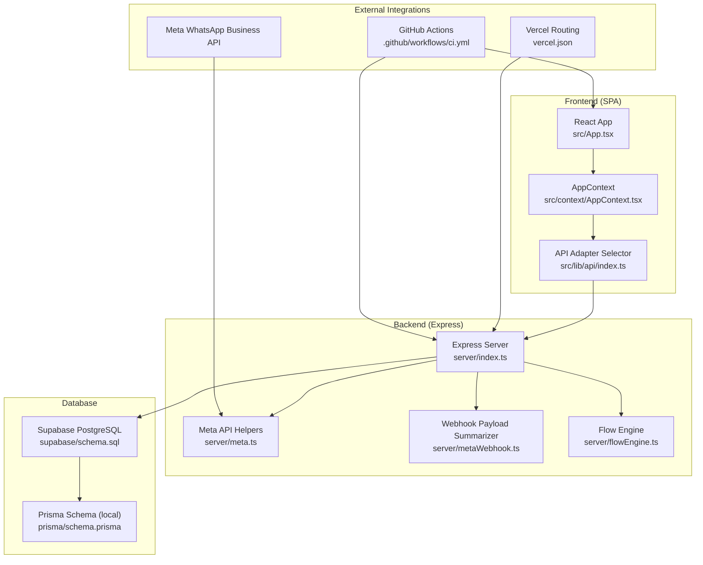
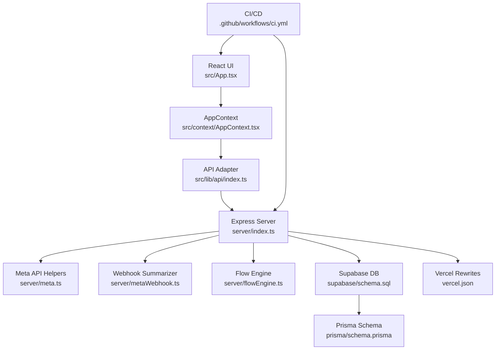
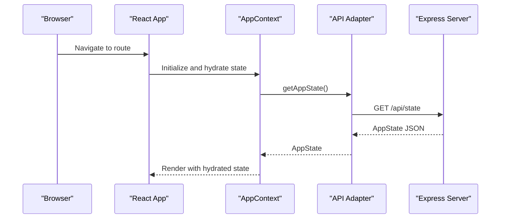
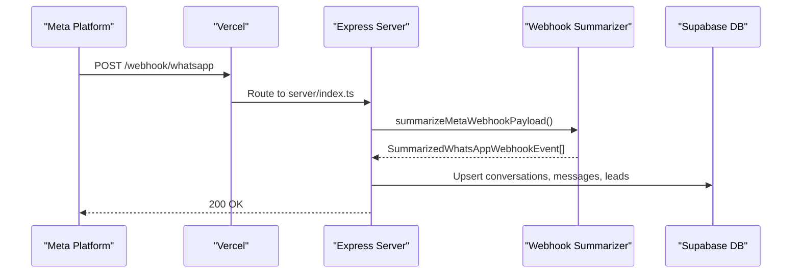
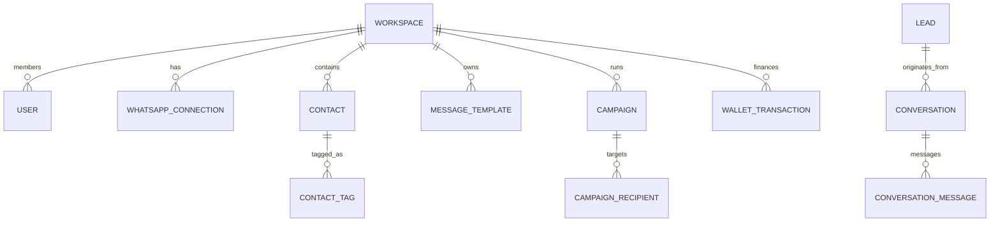
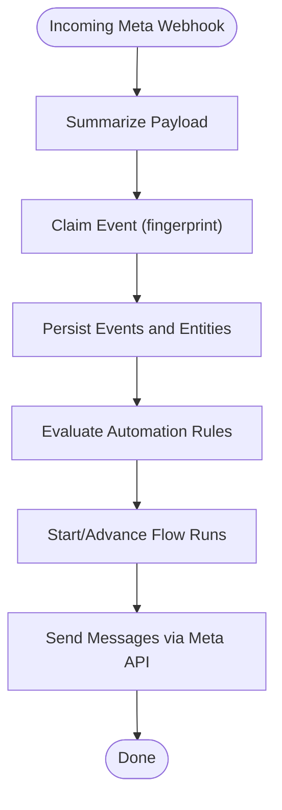
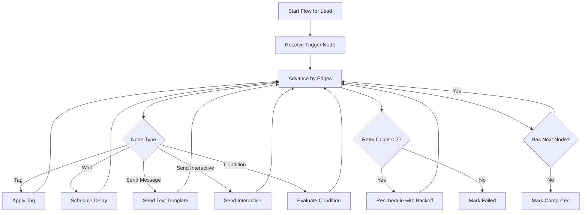
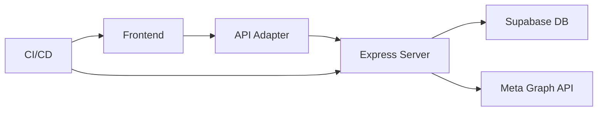
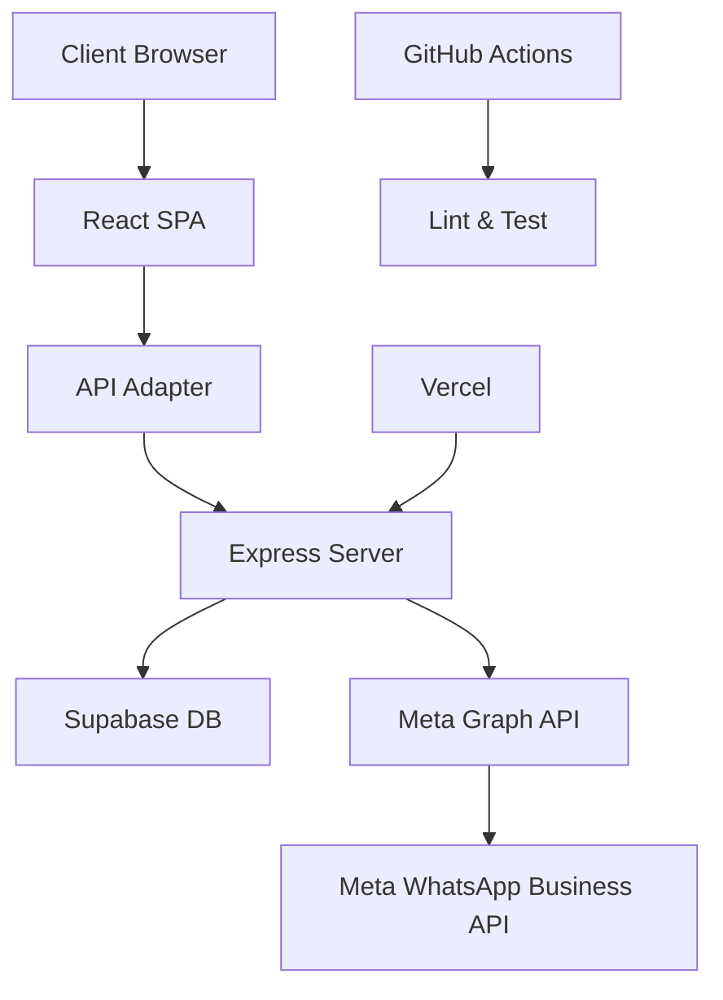

# Architecture & Design

<cite>
**Referenced Files in This Document**
- [README.md](file://README.md)
- [package.json](file://package.json)
- [vercel.json](file://vercel.json)
- [src/App.tsx](file://src/App.tsx)
- [src/context/AppContext.tsx](file://src/context/AppContext.tsx)
- [src/lib/api/index.ts](file://src/lib/api/index.ts)
- [server/index.ts](file://server/index.ts)
- [server/meta.ts](file://server/meta.ts)
- [server/metaWebhook.ts](file://server/metaWebhook.ts)
- [server/flowEngine.ts](file://server/flowEngine.ts)
- [prisma/schema.prisma](file://prisma/schema.prisma)
- [supabase/schema.sql](file://supabase/schema.sql)
- [DEPLOYMENT_GUIDE.md](file://DEPLOYMENT_GUIDE.md)
- [.github/workflows/ci.yml](file://.github/workflows/ci.yml)
</cite>

## Table of Contents
1. [Introduction](#introduction)
2. [Project Structure](#project-structure)
3. [Core Components](#core-components)
4. [Architecture Overview](#architecture-overview)
5. [Detailed Component Analysis](#detailed-component-analysis)
6. [Dependency Analysis](#dependency-analysis)
7. [Performance Considerations](#performance-considerations)
8. [Troubleshooting Guide](#troubleshooting-guide)
9. [Conclusion](#conclusion)
10. [Appendices](#appendices)

## Introduction
This document describes the architecture and design patterns of the WhatsAppFly platform. It explains the layered system design integrating a React frontend, Express backend, Supabase database, and Meta WhatsApp Business API. It documents component interactions, data flows, and operational flows such as webhook processing and automation. It also outlines deployment topology, scalability considerations, and cross-cutting concerns like authentication, authorization, and monitoring.

## Project Structure
The repository follows a clear separation of concerns:
- Frontend: Vite + React + Tailwind-based SPA under src/.
- API Layer: Express serverless endpoints under server/ and aliased via api/ for Vercel rewrites.
- Database: Supabase-managed PostgreSQL with Row Level Security and custom policies.
- Automation: Flow engine orchestrates automated workflows triggered by leads and inbound messages.
- CI/CD: GitHub Actions for linting and testing; optional cron automation via GitHub Actions for free tier.

**Diagram sources**
- [src/App.tsx:1-69](file://src/App.tsx#L1-L69)
- [src/context/AppContext.tsx:1-193](file://src/context/AppContext.tsx#L1-L193)
- [src/lib/api/index.ts:1-23](file://src/lib/api/index.ts#L1-L23)
- [server/index.ts:1-2079](file://server/index.ts#L1-L2079)
- [server/meta.ts:1-391](file://server/meta.ts#L1-L391)
- [server/metaWebhook.ts:1-161](file://server/metaWebhook.ts#L1-L161)
- [server/flowEngine.ts:1-260](file://server/flowEngine.ts#L1-L260)
- [supabase/schema.sql:1-517](file://supabase/schema.sql#L1-L517)
- [prisma/schema.prisma:1-189](file://prisma/schema.prisma#L1-L189)
- [vercel.json:1-22](file://vercel.json#L1-L22)
- [.github/workflows/ci.yml:1-30](file://.github/workflows/ci.yml#L1-L30)

**Section sources**
- [README.md:1-26](file://README.md#L1-L26)
- [package.json:1-110](file://package.json#L1-L110)
- [vercel.json:1-22](file://vercel.json#L1-L22)
- [src/App.tsx:1-69](file://src/App.tsx#L1-L69)
- [src/context/AppContext.tsx:1-193](file://src/context/AppContext.tsx#L1-L193)
- [src/lib/api/index.ts:1-23](file://src/lib/api/index.ts#L1-L23)
- [server/index.ts:1-2079](file://server/index.ts#L1-L2079)
- [server/meta.ts:1-391](file://server/meta.ts#L1-L391)
- [server/metaWebhook.ts:1-161](file://server/metaWebhook.ts#L1-L161)
- [server/flowEngine.ts:1-260](file://server/flowEngine.ts#L1-L260)
- [prisma/schema.prisma:1-189](file://prisma/schema.prisma#L1-L189)
- [supabase/schema.sql:1-517](file://supabase/schema.sql#L1-L517)
- [DEPLOYMENT_GUIDE.md:1-64](file://DEPLOYMENT_GUIDE.md#L1-L64)
- [.github/workflows/ci.yml:1-30](file://.github/workflows/ci.yml#L1-L30)

## Core Components
- Frontend (React SPA)
  - Routing and protected routes orchestrated via React Router.
  - Global state and authentication managed by AppContext, which delegates to API adapters.
  - API adapter selection supports mock, http (Express), and supabase modes.

- Backend (Express)
  - Centralized Express server handling health checks, webhooks, automation triggers, and business endpoints.
  - Meta API integration helpers for token exchange, template/text/interactive sends, and webhook verification token retrieval.
  - Webhook payload summarization for both WhatsApp inbound messages and Meta Leadgen events.
  - Flow engine implementing a simple workflow engine with nodes for tagging, waiting, sending messages, sending interactive content, and conditions.

- Database (Supabase)
  - PostgreSQL schema with Row Level Security policies ensuring per-user/workspace isolation.
  - Rich domain model covering workspaces, users, connections, contacts, conversations, leads, campaigns, templates, and operational logs.

- Automation Engine
  - Flow definitions and runs persisted in Supabase.
  - Execution loop with retries and scheduling.

- CI/CD and Deployment
  - GitHub Actions for linting and testing.
  - Vercel rewrites routing /webhook, /automation, and /t/* to the Express server.
  - Optional GitHub Actions cron to trigger automation processing for free tier.

**Section sources**
- [src/App.tsx:1-69](file://src/App.tsx#L1-L69)
- [src/context/AppContext.tsx:1-193](file://src/context/AppContext.tsx#L1-L193)
- [src/lib/api/index.ts:1-23](file://src/lib/api/index.ts#L1-L23)
- [server/index.ts:1-2079](file://server/index.ts#L1-L2079)
- [server/meta.ts:1-391](file://server/meta.ts#L1-L391)
- [server/metaWebhook.ts:1-161](file://server/metaWebhook.ts#L1-L161)
- [server/flowEngine.ts:1-260](file://server/flowEngine.ts#L1-L260)
- [supabase/schema.sql:1-517](file://supabase/schema.sql#L1-L517)
- [prisma/schema.prisma:1-189](file://prisma/schema.prisma#L1-L189)
- [vercel.json:1-22](file://vercel.json#L1-L22)
- [DEPLOYMENT_GUIDE.md:1-64](file://DEPLOYMENT_GUIDE.md#L1-L64)
- [.github/workflows/ci.yml:1-30](file://.github/workflows/ci.yml#L1-L30)

## Architecture Overview
The system follows a layered architecture:
- Presentation Layer: React SPA with global state and routing.
- API Abstraction Layer: API adapter selector chooses between mock, http, or supabase-backed implementations.
- Application Layer: Express server encapsulates business logic, data access, and integrations.
- Data Access Layer: Supabase PostgreSQL with RLS policies and custom enums/types.
- External Integrations: Meta WhatsApp Business API for messaging and lead capture.

**Diagram sources**
- [src/App.tsx:1-69](file://src/App.tsx#L1-L69)
- [src/context/AppContext.tsx:1-193](file://src/context/AppContext.tsx#L1-L193)
- [src/lib/api/index.ts:1-23](file://src/lib/api/index.ts#L1-L23)
- [server/index.ts:1-2079](file://server/index.ts#L1-L2079)
- [server/meta.ts:1-391](file://server/meta.ts#L1-L391)
- [server/metaWebhook.ts:1-161](file://server/metaWebhook.ts#L1-L161)
- [server/flowEngine.ts:1-260](file://server/flowEngine.ts#L1-L260)
- [supabase/schema.sql:1-517](file://supabase/schema.sql#L1-L517)
- [prisma/schema.prisma:1-189](file://prisma/schema.prisma#L1-L189)
- [vercel.json:1-22](file://vercel.json#L1-L22)
- [.github/workflows/ci.yml:1-30](file://.github/workflows/ci.yml#L1-L30)

## Detailed Component Analysis

### Frontend Layer
- App routing and protected routes define the user journey.
- AppContext manages authentication state, hydrates initial state, and exposes actions delegated to the active API adapter.
- API adapter selection determines whether to use a mock, HTTP, or Supabase-backed API.

**Diagram sources**
- [src/App.tsx:1-69](file://src/App.tsx#L1-L69)
- [src/context/AppContext.tsx:1-193](file://src/context/AppContext.tsx#L1-L193)
- [src/lib/api/index.ts:1-23](file://src/lib/api/index.ts#L1-L23)
- [server/index.ts:1-2079](file://server/index.ts#L1-L2079)

**Section sources**
- [src/App.tsx:1-69](file://src/App.tsx#L1-L69)
- [src/context/AppContext.tsx:1-193](file://src/context/AppContext.tsx#L1-L193)
- [src/lib/api/index.ts:1-23](file://src/lib/api/index.ts#L1-L23)

### Backend Layer
- Express server initializes CORS and JSON middleware, defines Zod schemas for request validation, and exposes endpoints for health checks, link clicks, and automation triggers.
- Meta API helpers encapsulate token exchange, template/text/interactive sends, and webhook verification token retrieval.
- Webhook summarizer normalizes incoming Meta payloads into structured events for downstream processing.
- Flow engine persists and executes automation flows with nodes for tagging, waiting, sending messages, sending interactive content, and conditions.

**Diagram sources**
- [server/index.ts:1-2079](file://server/index.ts#L1-L2079)
- [server/metaWebhook.ts:1-161](file://server/metaWebhook.ts#L1-L161)
- [server/meta.ts:1-391](file://server/meta.ts#L1-L391)
- [vercel.json:1-22](file://vercel.json#L1-L22)

**Section sources**
- [server/index.ts:1-2079](file://server/index.ts#L1-L2079)
- [server/meta.ts:1-391](file://server/meta.ts#L1-L391)
- [server/metaWebhook.ts:1-161](file://server/metaWebhook.ts#L1-L161)
- [server/flowEngine.ts:1-260](file://server/flowEngine.ts#L1-L260)

### Database Layer
- Supabase schema defines core entities and policies for Row Level Security.
- Enums and types ensure consistent domain semantics across the application.
- Prisma schema mirrors the domain model for local development and tooling.

**Diagram sources**
- [supabase/schema.sql:19-276](file://supabase/schema.sql#L19-L276)
- [prisma/schema.prisma:56-189](file://prisma/schema.prisma#L56-L189)

**Section sources**
- [supabase/schema.sql:1-517](file://supabase/schema.sql#L1-L517)
- [prisma/schema.prisma:1-189](file://prisma/schema.prisma#L1-L189)

### Meta Integration and Webhook Processing
- Meta API integration handles OAuth code exchange, token storage, and message sending (text, template, interactive).
- Webhook processing normalizes incoming events, deduplicates via a fingerprint table, and persists events and related entities.
- Automation rules and flow engine react to inbound messages and lead captures.

**Diagram sources**
- [server/meta.ts:1-391](file://server/meta.ts#L1-L391)
- [server/metaWebhook.ts:1-161](file://server/metaWebhook.ts#L1-L161)
- [server/index.ts:369-750](file://server/index.ts#L369-L750)
- [server/flowEngine.ts:32-168](file://server/flowEngine.ts#L32-L168)

**Section sources**
- [server/meta.ts:1-391](file://server/meta.ts#L1-L391)
- [server/metaWebhook.ts:1-161](file://server/metaWebhook.ts#L1-L161)
- [server/index.ts:369-750](file://server/index.ts#L369-L750)
- [server/flowEngine.ts:32-168](file://server/flowEngine.ts#L32-L168)

### Automation Engine
- Flow definitions and runs are persisted in Supabase.
- Execution loop advances nodes, applies delays, retries on failure, and transitions to completion or failure states.

**Diagram sources**
- [server/flowEngine.ts:32-168](file://server/flowEngine.ts#L32-L168)
- [server/flowEngine.ts:199-259](file://server/flowEngine.ts#L199-L259)

**Section sources**
- [server/flowEngine.ts:1-260](file://server/flowEngine.ts#L1-L260)

## Dependency Analysis
- Frontend depends on API adapter abstraction, which selects runtime behavior based on environment variables.
- Backend depends on Supabase for persistence and Meta Graph API for messaging.
- CI/CD integrates linting and testing; optional cron automation via GitHub Actions complements Vercel’s limitations.

**Diagram sources**
- [src/lib/api/index.ts:1-23](file://src/lib/api/index.ts#L1-L23)
- [server/index.ts:1-2079](file://server/index.ts#L1-L2079)
- [supabase/schema.sql:1-517](file://supabase/schema.sql#L1-L517)
- [server/meta.ts:1-391](file://server/meta.ts#L1-L391)
- [.github/workflows/ci.yml:1-30](file://.github/workflows/ci.yml#L1-L30)

**Section sources**
- [src/lib/api/index.ts:1-23](file://src/lib/api/index.ts#L1-L23)
- [server/index.ts:1-2079](file://server/index.ts#L1-L2079)
- [supabase/schema.sql:1-517](file://supabase/schema.sql#L1-L517)
- [server/meta.ts:1-391](file://server/meta.ts#L1-L391)
- [.github/workflows/ci.yml:1-30](file://.github/workflows/ci.yml#L1-L30)

## Performance Considerations
- Asynchronous logging and non-blocking operations reduce latency for webhook processing.
- Deduplication of webhook events prevents redundant processing.
- Retry logic with capped attempts and exponential backoff improves resilience.
- Prisma client generation and schema alignment help maintain efficient queries.
- Supabase RLS ensures minimal filtering overhead by constraining data access at the database level.

[No sources needed since this section provides general guidance]

## Troubleshooting Guide
- Authentication and Authorization
  - Supabase Row Level Security policies ensure per-workspace isolation. Verify policies are enabled and user is a member of the workspace.
  - Auth state changes are observed by the frontend context to keep state synchronized.

- Meta Webhooks
  - Ensure Vercel rewrite routes match Meta’s Callback URL and Verify Token.
  - Confirm webhook payload summarization and fingerprint-based deduplication are functioning.

- Automation Engine
  - Inspect automation events and failed send logs for errors.
  - Use the automation sweep endpoint (protected by cron secret) to trigger processing.

- Database
  - Confirm schema migrations are applied in order and enums/types align with application expectations.

**Section sources**
- [supabase/schema.sql:402-517](file://supabase/schema.sql#L402-L517)
- [src/context/AppContext.tsx:78-87](file://src/context/AppContext.tsx#L78-L87)
- [server/index.ts:319-342](file://server/index.ts#L319-L342)
- [DEPLOYMENT_GUIDE.md:51-64](file://DEPLOYMENT_GUIDE.md#L51-L64)

## Conclusion
WhatsAppFly employs a clean layered architecture with a React SPA, Express backend, Supabase database, and Meta integration. The system leverages RLS for security, robust webhook processing, and a flexible automation engine. CI/CD and optional GitHub Actions cron support continuous delivery and automation scheduling. The documented patterns and flows provide a foundation for scaling and extending the platform.

[No sources needed since this section summarizes without analyzing specific files]

## Appendices

### System Context Diagram

**Diagram sources**
- [src/lib/api/index.ts:1-23](file://src/lib/api/index.ts#L1-L23)
- [server/index.ts:1-2079](file://server/index.ts#L1-L2079)
- [supabase/schema.sql:1-517](file://supabase/schema.sql#L1-L517)
- [server/meta.ts:1-391](file://server/meta.ts#L1-L391)
- [vercel.json:1-22](file://vercel.json#L1-L22)
- [.github/workflows/ci.yml:1-30](file://.github/workflows/ci.yml#L1-L30)

### Technology Stack Summary
- Frontend: Vite + React + Tailwind + Framer Motion
- Backend: Express (Vercel Serverless)
- Database: Supabase (PostgreSQL)
- Automation: GitHub Actions + x-cron-secret
- CI/CD: GitHub Actions

**Section sources**
- [README.md:5-9](file://README.md#L5-L9)
- [package.json:22-78](file://package.json#L22-L78)
- [DEPLOYMENT_GUIDE.md:10-31](file://DEPLOYMENT_GUIDE.md#L10-L31)

### Architectural Patterns Observed
- Repository pattern: Data access through Supabase client and Prisma client.
- Factory pattern: API adapter factory selecting runtime implementation based on environment.
- Observer pattern: Auth state subscription in AppContext observes changes and refreshes state.
- Strategy pattern: Different API strategies (mock, http, supabase) selected at runtime.

**Section sources**
- [src/lib/api/index.ts:1-23](file://src/lib/api/index.ts#L1-L23)
- [src/context/AppContext.tsx:78-87](file://src/context/AppContext.tsx#L78-L87)
- [server/index.ts:1-2079](file://server/index.ts#L1-L2079)