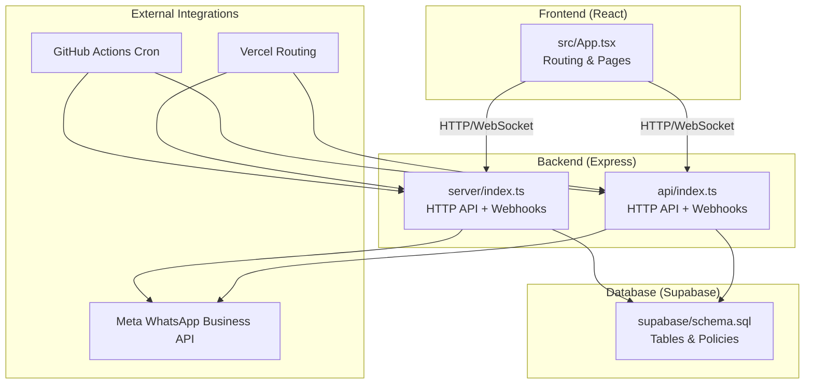
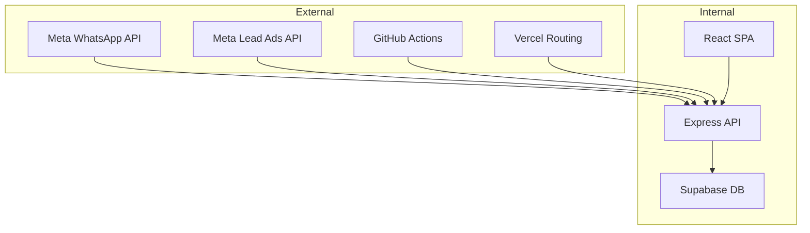
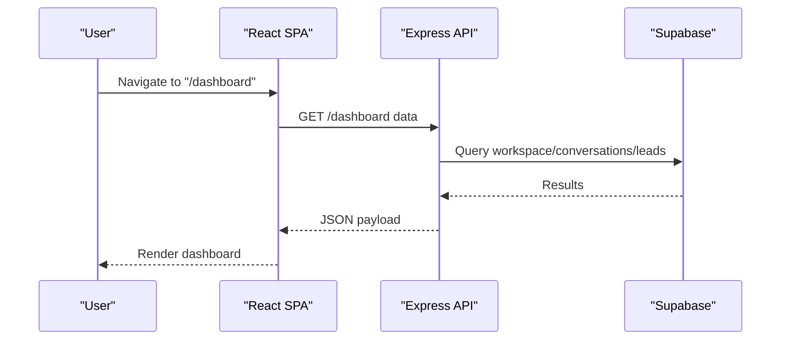
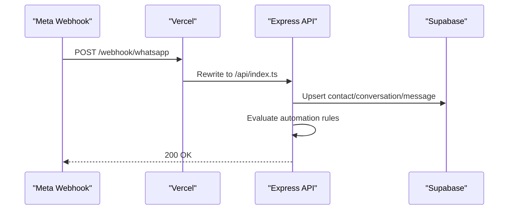
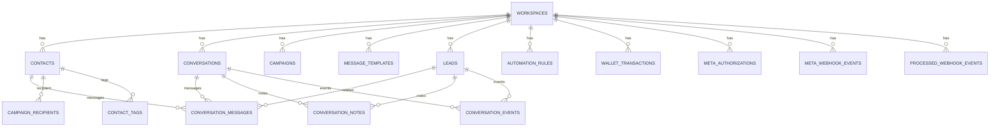
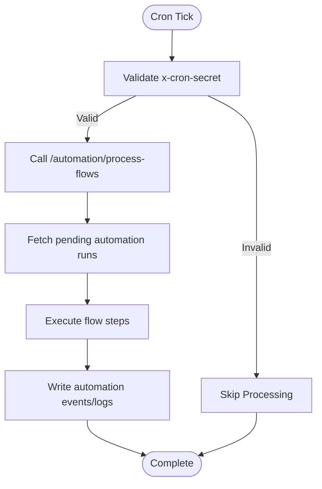
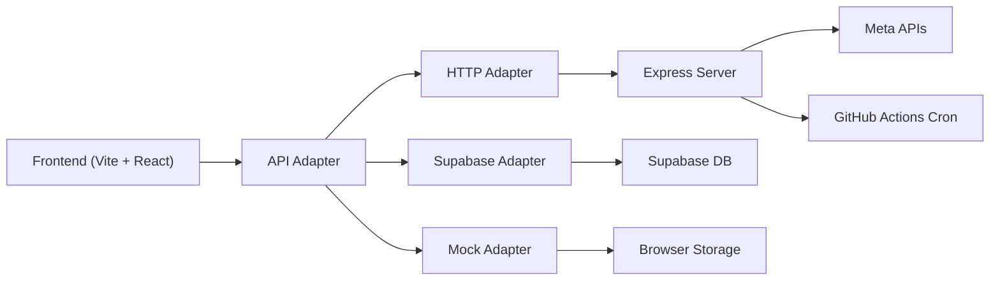

# System Overview

<cite>
**Referenced Files in This Document**
- [README.md](file://README.md)
- [package.json](file://package.json)
- [src/App.tsx](file://src/App.tsx)
- [server/index.ts](file://server/index.ts)
- [api/index.ts](file://api/index.ts)
- [vercel.json](file://vercel.json)
- [DEPLOYMENT_GUIDE.md](file://DEPLOYMENT_GUIDE.md)
- [supabase/schema.sql](file://supabase/schema.sql)
- [.github/workflows/cron.yml](file://.github/workflows/cron.yml)
- [src/lib/api/index.ts](file://src/lib/api/index.ts)
</cite>

## Table of Contents
1. [Introduction](#introduction)
2. [Project Structure](#project-structure)
3. [Core Components](#core-components)
4. [Architecture Overview](#architecture-overview)
5. [Detailed Component Analysis](#detailed-component-analysis)
6. [Dependency Analysis](#dependency-analysis)
7. [Performance Considerations](#performance-considerations)
8. [Troubleshooting Guide](#troubleshooting-guide)
9. [Conclusion](#conclusion)

## Introduction
WhatsAppFly is a WhatsApp Business automation platform designed for Shopify stores and D2C brands. It connects Meta’s WhatsApp Business API with campaign management and automation workflows, enabling businesses to capture leads from Meta ads, manage conversations, send templated messages at scale, and automate customer journeys through configurable rules and flows.

Why it matters:
- Real-time lead capture from Meta Lead Ads and inbound WhatsApp messages
- Automated first-response and follow-up sequences
- Campaign orchestration with templates and scheduling
- Conversation management with tagging, notes, and analytics
- Scalable infrastructure with Supabase and serverless hosting

## Project Structure
The project follows a modern full-stack architecture:
- Frontend: React + Vite with TypeScript and Tailwind CSS
- Backend: Express server (hosted serverless via Vercel)
- Database: Supabase (PostgreSQL) with Row Level Security
- Automation: GitHub Actions cron for recurring tasks on free tier

**Diagram sources**
- [src/App.tsx:1-75](file://src/App.tsx#L1-L75)
- [server/index.ts:1-800](file://server/index.ts#L1-L800)
- [api/index.ts:1-800](file://api/index.ts#L1-L800)
- [supabase/schema.sql:1-517](file://supabase/schema.sql#L1-L517)
- [vercel.json:1-22](file://vercel.json#L1-L22)
- [.github/workflows/cron.yml:1-16](file://.github/workflows/cron.yml#L1-L16)

**Section sources**
- [README.md:1-26](file://README.md#L1-L26)
- [package.json:1-110](file://package.json#L1-L110)
- [src/App.tsx:1-75](file://src/App.tsx#L1-L75)
- [vercel.json:1-22](file://vercel.json#L1-L22)

## Core Components
- Frontend React Application
  - Single-page application with protected routes and shared UI components
  - Pages for dashboard, campaigns, automations, inbox, leads, analytics, and settings
- Express Backend
  - REST-like endpoints for campaigns, contacts, templates, wallet, and automation
  - Meta webhook handlers for inbound messages and lead events
  - Automation engine triggers via cron or manual endpoint
- Supabase Database
  - Workspace-centric schema with RLS policies
  - Tables for contacts, leads, conversations, campaigns, templates, and logs
- External Integrations
  - Meta Webhooks for WhatsApp and Lead Ads
  - GitHub Actions cron for automation processing on free tiers
  - Vercel rewrites for unified domain routing

**Section sources**
- [src/App.tsx:1-75](file://src/App.tsx#L1-L75)
- [server/index.ts:1-800](file://server/index.ts#L1-L800)
- [api/index.ts:1-800](file://api/index.ts#L1-L800)
- [supabase/schema.sql:1-517](file://supabase/schema.sql#L1-L517)
- [DEPLOYMENT_GUIDE.md:1-64](file://DEPLOYMENT_GUIDE.md#L1-L64)
- [.github/workflows/cron.yml:1-16](file://.github/workflows/cron.yml#L1-L16)

## Architecture Overview
WhatsAppFly uses a layered architecture:
- Presentation Layer: React SPA with routing and UI components
- Application Layer: Express HTTP endpoints and webhook handlers
- Domain/Workflow Layer: Automation rules, campaign orchestration, and flow engine
- Persistence Layer: Supabase Postgres with RLS and policies
- Integration Layer: Meta APIs for messaging and lead generation

System boundaries:
- Internal: Frontend, Backend, Database
- External: Meta (WhatsApp Business API, Lead Ads), GitHub Actions, Vercel

**Diagram sources**
- [server/index.ts:1-800](file://server/index.ts#L1-L800)
- [api/index.ts:1-800](file://api/index.ts#L1-L800)
- [supabase/schema.sql:1-517](file://supabase/schema.sql#L1-L517)
- [vercel.json:1-22](file://vercel.json#L1-L22)
- [.github/workflows/cron.yml:1-16](file://.github/workflows/cron.yml#L1-L16)

## Detailed Component Analysis

### Frontend React Application
- Purpose: Provides the user interface for managing campaigns, automations, leads, inbox, analytics, and settings
- Routing: Centralized in App with protected routes and nested layouts
- API Adapter: Selects between http, supabase, or mock adapters based on environment

**Diagram sources**
- [src/App.tsx:1-75](file://src/App.tsx#L1-L75)
- [src/lib/api/index.ts:1-23](file://src/lib/api/index.ts#L1-L23)

**Section sources**
- [src/App.tsx:1-75](file://src/App.tsx#L1-L75)
- [src/lib/api/index.ts:1-23](file://src/lib/api/index.ts#L1-L23)

### Express Backend (HTTP API + Webhooks)
- Responsibilities:
  - Authentication and workspace scoping
  - Campaign creation and dispatch
  - Contact and lead management
  - Conversation and message persistence
  - Automation rule evaluation and triggering
  - Meta webhook ingestion (WhatsApp and Lead Ads)
  - Operational logging and failure tracking
- Hosting: Vercel rewrites route webhooks and automation endpoints to the Express server

**Diagram sources**
- [vercel.json:1-22](file://vercel.json#L1-L22)
- [api/index.ts:1-800](file://api/index.ts#L1-L800)
- [server/index.ts:1-800](file://server/index.ts#L1-L800)

**Section sources**
- [vercel.json:1-22](file://vercel.json#L1-L22)
- [api/index.ts:1-800](file://api/index.ts#L1-L800)
- [server/index.ts:1-800](file://server/index.ts#L1-L800)

### Supabase Database Schema
- Core entities:
  - Workspaces, Profiles, Workspace Members
  - WhatsApp Connections, Message Templates, Campaigns
  - Contacts, Conversations, Conversation Messages
  - Leads, Automation Rules, Automation Events
  - Operational Logs, Failed Send Logs, Processed Webhook Events
- Row Level Security: Policies scoped to current workspace
- Triggers: Automatic updated_at timestamps

**Diagram sources**
- [supabase/schema.sql:1-517](file://supabase/schema.sql#L1-L517)

**Section sources**
- [supabase/schema.sql:1-517](file://supabase/schema.sql#L1-L517)

### Automation Engine and Cron
- Purpose: Periodically process automation flows and retries
- Mechanism:
  - Free tier: GitHub Actions cron triggers a process endpoint every 5 minutes
  - Self-hosted: Use a serverless cron secret header to invoke the endpoint
- Endpoint: POST /automation/process-flows (protected by x-cron-secret)

**Diagram sources**
- [.github/workflows/cron.yml:1-16](file://.github/workflows/cron.yml#L1-L16)
- [DEPLOYMENT_GUIDE.md:24-64](file://DEPLOYMENT_GUIDE.md#L24-L64)

**Section sources**
- [.github/workflows/cron.yml:1-16](file://.github/workflows/cron.yml#L1-L16)
- [DEPLOYMENT_GUIDE.md:24-64](file://DEPLOYMENT_GUIDE.md#L24-L64)

## Dependency Analysis
- Technology stack highlights:
  - Frontend: Vite, React, Tailwind, Radix UI, React Query
  - Backend: Express, Zod for validation, Prisma client
  - Database: Supabase (PostgreSQL) with RLS
  - DevOps: Vercel rewrites, GitHub Actions cron
- API adapter selection:
  - http adapter requires VITE_API_BASE_URL and VITE_API_ADAPTER=http
  - supabase adapter requires VITE_SUPABASE_URL and VITE_SUPABASE_ANON_KEY
  - mock adapter for local browser storage

**Diagram sources**
- [package.json:1-110](file://package.json#L1-L110)
- [src/lib/api/index.ts:1-23](file://src/lib/api/index.ts#L1-L23)
- [server/index.ts:1-800](file://server/index.ts#L1-L800)

**Section sources**
- [package.json:1-110](file://package.json#L1-L110)
- [src/lib/api/index.ts:1-23](file://src/lib/api/index.ts#L1-L23)

## Performance Considerations
- Database scaling: Use Supabase managed Postgres; optimize queries with indexes on frequently filtered columns (workspace_id, phone, meta_lead_id)
- API latency: Keep Express endpoints lean; defer heavy processing to cron jobs
- Webhook throughput: Deduplicate events with processed_webhook_events fingerprinting
- Frontend responsiveness: Use React Query caching and optimistic updates for list-heavy pages (contacts, leads, campaigns)

## Troubleshooting Guide
Common issues and resolutions:
- Meta webhook not received
  - Verify callback URL and verify token in Meta Developer Console match Vercel configuration
  - Check Vercel rewrites for /webhook/* routes
- Automation not running on free tier
  - Ensure GitHub Actions cron is enabled and CRON_SECRET matches the endpoint header
- Supabase RLS errors
  - Confirm current workspace is set and user has membership
- Frontend adapter mismatch
  - Set VITE_API_ADAPTER to http or supabase and configure related environment variables

**Section sources**
- [DEPLOYMENT_GUIDE.md:51-64](file://DEPLOYMENT_GUIDE.md#L51-L64)
- [vercel.json:1-22](file://vercel.json#L1-L22)
- [src/lib/api/index.ts:1-23](file://src/lib/api/index.ts#L1-L23)

## Conclusion
WhatsAppFly provides a complete, extensible solution for D2C brands and Shopify stores to automate customer engagement via WhatsApp. Its layered architecture—React frontend, Express backend, Supabase database, and Meta integrations—enables rapid iteration and reliable operation. The combination of serverless hosting, GitHub Actions cron, and robust automation rules makes it practical for teams of all sizes to capture leads, manage conversations, and scale messaging workflows effectively.