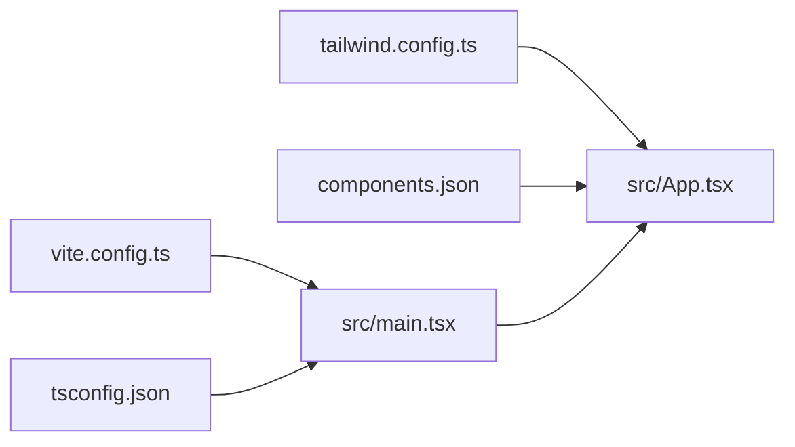
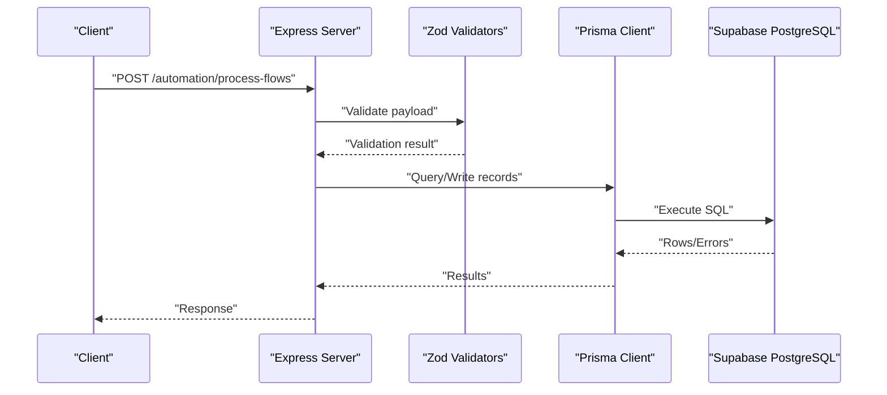
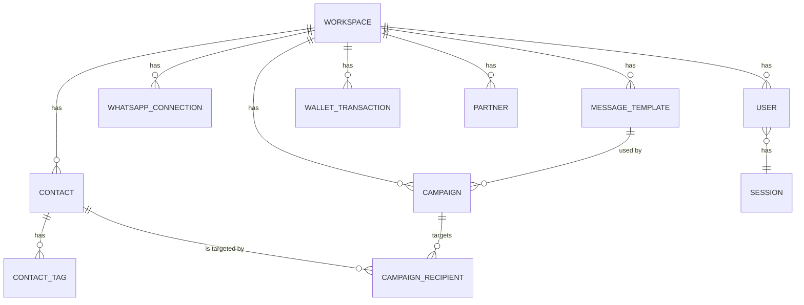
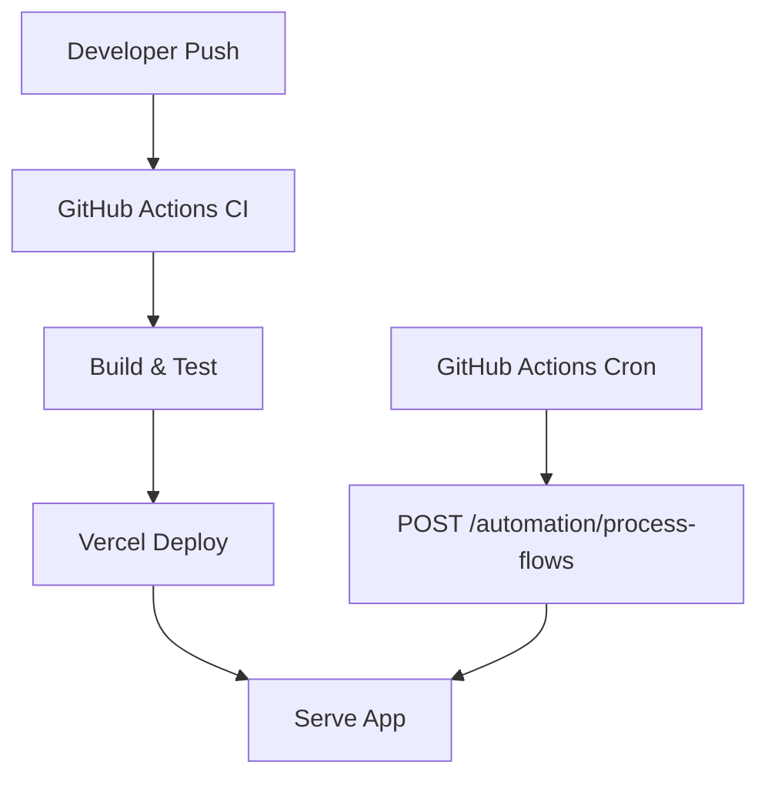
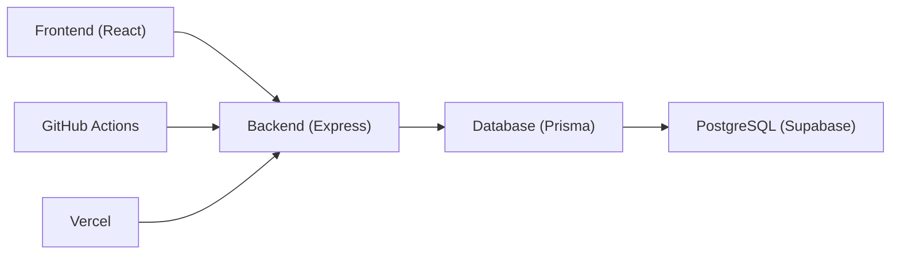

# Technology Stack

<cite>
**Referenced Files in This Document**
- [package.json](file://package.json)
- [vite.config.ts](file://vite.config.ts)
- [tailwind.config.ts](file://tailwind.config.ts)
- [components.json](file://components.json)
- [tsconfig.json](file://tsconfig.json)
- [prisma/schema.prisma](file://prisma/schema.prisma)
- [prisma.config.ts](file://prisma.config.ts)
- [server/index.ts](file://server/index.ts)
- [api/index.ts](file://api/index.ts)
- [vercel.json](file://vercel.json)
- [.github/workflows/ci.yml](file://.github/workflows/ci.yml)
- [.github/workflows/cron.yml](file://.github/workflows/cron.yml)
- [DEPLOYMENT_GUIDE.md](file://DEPLOYMENT_GUIDE.md)
- [src/main.tsx](file://src/main.tsx)
- [src/App.tsx](file://src/App.tsx)
</cite>

## Table of Contents
1. [Introduction](#introduction)
2. [Project Structure](#project-structure)
3. [Core Components](#core-components)
4. [Architecture Overview](#architecture-overview)
5. [Detailed Component Analysis](#detailed-component-analysis)
6. [Dependency Analysis](#dependency-analysis)
7. [Performance Considerations](#performance-considerations)
8. [Troubleshooting Guide](#troubleshooting-guide)
9. [Conclusion](#conclusion)

## Introduction
This document describes the technology stack used in WhatsAppFly, covering frontend, backend, database, and DevOps tooling. It explains version compatibility, the rationale behind each choice, and how the technologies integrate across layers. Practical examples illustrate how React, Express, Prisma, and Supabase collaborate to power the application’s messaging automation, webhooks, and scheduling.

## Project Structure
WhatsAppFly is organized into a modern full-stack monorepo-like structure:
- Frontend built with Vite and React 18.3.1, styled with Tailwind CSS and composed via shadcn/ui components.
- Backend implemented as an Express 5.2.1 service with TypeScript for type safety.
- Database layer using Prisma with a SQLite provider and Supabase-managed PostgreSQL schema.
- DevOps orchestrated via Vercel for frontend hosting, GitHub Actions for CI/CD and scheduled tasks, and cron-based automation triggers.

```mermaid
graph TB
subgraph "Frontend"
Vite["Vite Build Tool"]
React["React 18.3.1"]
Tailwind["Tailwind CSS"]
Shadcn["shadcn/ui Components"]
Router["React Router DOM"]
Query["TanStack React Query"]
end
subgraph "Backend"
Express["Express 5.2.1"]
Zod["Zod Validation"]
Prisma["Prisma Client"]
Supabase["Supabase PostgreSQL"]
end
subgraph "DevOps"
Vercel["Vercel Hosting"]
GHActions["GitHub Actions"]
Cron["Cron Jobs"]
end
Vite --> React
React --> Tailwind
React --> Shadcn
React --> Router
React --> Query
Express --> Zod
Express --> Prisma
Prisma --> Supabase
Vercel <- --> Express
GHActions --> Vercel
GHActions --> Cron
Cron --> Express
```

**Diagram sources**
- [vite.config.ts:1-22](file://vite.config.ts#L1-L22)
- [package.json:22-106](file://package.json#L22-L106)
- [tailwind.config.ts:1-110](file://tailwind.config.ts#L1-L110)
- [components.json:1-21](file://components.json#L1-L21)
- [server/index.ts:36-44](file://server/index.ts#L36-L44)
- [api/index.ts:36-44](file://api/index.ts#L36-L44)
- [prisma/schema.prisma:1-279](file://prisma/schema.prisma#L1-L279)
- [vercel.json:1-22](file://vercel.json#L1-L22)
- [.github/workflows/ci.yml:1-30](file://.github/workflows/ci.yml#L1-L30)
- [.github/workflows/cron.yml:1-16](file://.github/workflows/cron.yml#L1-L16)

**Section sources**
- [package.json:1-110](file://package.json#L1-L110)
- [vite.config.ts:1-22](file://vite.config.ts#L1-L22)
- [tailwind.config.ts:1-110](file://tailwind.config.ts#L1-L110)
- [components.json:1-21](file://components.json#L1-L21)
- [tsconfig.json:1-24](file://tsconfig.json#L1-L24)
- [prisma/schema.prisma:1-279](file://prisma/schema.prisma#L1-L279)
- [prisma.config.ts:1-10](file://prisma.config.ts#L1-L10)
- [server/index.ts:36-44](file://server/index.ts#L36-L44)
- [api/index.ts:36-44](file://api/index.ts#L36-L44)
- [vercel.json:1-22](file://vercel.json#L1-L22)
- [.github/workflows/ci.yml:1-30](file://.github/workflows/ci.yml#L1-L30)
- [.github/workflows/cron.yml:1-16](file://.github/workflows/cron.yml#L1-L16)
- [DEPLOYMENT_GUIDE.md:1-64](file://DEPLOYMENT_GUIDE.md#L1-L64)
- [src/main.tsx:1-6](file://src/main.tsx#L1-L6)
- [src/App.tsx:1-75](file://src/App.tsx#L1-L75)

## Core Components
- Frontend: React 18.3.1 with Vite for fast builds and HMR, Tailwind CSS for utility-first styling, and shadcn/ui for accessible, themeable components.
- Backend: Express 5.2.1 with TypeScript for type-safe endpoints, Zod for runtime validation, and Prisma for database modeling and queries.
- Database: Prisma schema defines models and enums; the project config selects a SQLite provider, while Supabase manages the production PostgreSQL schema and migrations.
- DevOps: Vercel handles frontend hosting and backend routing rewrites; GitHub Actions automates CI and cron-triggered automation processing.

**Section sources**
- [package.json:22-106](file://package.json#L22-L106)
- [vite.config.ts:7-21](file://vite.config.ts#L7-L21)
- [tailwind.config.ts:4-109](file://tailwind.config.ts#L4-L109)
- [components.json:6-19](file://components.json#L6-L19)
- [tsconfig.json:7-14](file://tsconfig.json#L7-L14)
- [prisma/schema.prisma:1-279](file://prisma/schema.prisma#L1-L279)
- [prisma.config.ts:4-9](file://prisma.config.ts#L4-L9)
- [server/index.ts:36-44](file://server/index.ts#L36-L44)
- [api/index.ts:36-44](file://api/index.ts#L36-L44)
- [vercel.json:3-20](file://vercel.json#L3-L20)
- [.github/workflows/ci.yml:9-29](file://.github/workflows/ci.yml#L9-L29)
- [.github/workflows/cron.yml:8-15](file://.github/workflows/cron.yml#L8-L15)

## Architecture Overview
The application follows a layered architecture:
- Frontend (React + Vite + Tailwind + shadcn/ui) renders the UI and orchestrates user interactions.
- Backend (Express + Zod + Prisma) exposes REST endpoints and processes webhooks, validating payloads and interacting with the database.
- Database (SQLite via Prisma in dev; Supabase PostgreSQL in prod) stores application data and schema.
- DevOps (Vercel + GitHub Actions) deploys and scales the frontend and backend, and triggers automation tasks on a schedule.

```mermaid
graph TB
Browser["Browser"]
Vite["Vite Dev Server / Build"]
ReactApp["React App"]
ExpressAPI["Express API"]
PrismaClient["Prisma Client"]
SupaDB["Supabase PostgreSQL"]
Browser --> Vite
Vite --> ReactApp
ReactApp --> |HTTP| ExpressAPI
ExpressAPI --> |Validation| Zod
ExpressAPI --> |Queries| PrismaClient
PrismaClient --> |SQLite (dev)| SupaDB
ExpressAPI --> |Webhooks| Browser
```

**Diagram sources**
- [vite.config.ts:7-21](file://vite.config.ts#L7-L21)
- [src/App.tsx:34-72](file://src/App.tsx#L34-L72)
- [server/index.ts:36-44](file://server/index.ts#L36-L44)
- [api/index.ts:36-44](file://api/index.ts#L36-L44)
- [prisma/schema.prisma:1-279](file://prisma/schema.prisma#L1-L279)
- [prisma.config.ts:4-9](file://prisma.config.ts#L4-L9)

## Detailed Component Analysis

### Frontend Stack: React, Vite, Tailwind CSS, shadcn/ui
- React 18.3.1 powers the UI with concurrent features and hooks. Routing is handled by React Router DOM, and TanStack React Query manages server state.
- Vite 5.4.19 provides fast development builds, HMR, and optimized production bundles. Aliasing for @/ paths improves developer ergonomics.
- Tailwind CSS 3.4.17 configures dark mode, custom animations, spacing, and color tokens. It integrates with shadcn/ui for consistent component styling.
- shadcn/ui 2.0+ is configured via components.json to use Tailwind CSS, TSX, and local aliases for components and utilities.



**Diagram sources**
- [vite.config.ts:7-21](file://vite.config.ts#L7-L21)
- [tsconfig.json:7-14](file://tsconfig.json#L7-L14)
- [tailwind.config.ts:4-109](file://tailwind.config.ts#L4-L109)
- [components.json:6-19](file://components.json#L6-L19)
- [src/main.tsx:1-6](file://src/main.tsx#L1-L6)
- [src/App.tsx:34-72](file://src/App.tsx#L34-L72)

**Section sources**
- [package.json:62-78](file://package.json#L62-L78)
- [vite.config.ts:7-21](file://vite.config.ts#L7-L21)
- [tsconfig.json:7-14](file://tsconfig.json#L7-L14)
- [tailwind.config.ts:4-109](file://tailwind.config.ts#L4-L109)
- [components.json:6-19](file://components.json#L6-L19)
- [src/main.tsx:1-6](file://src/main.tsx#L1-L6)
- [src/App.tsx:32-72](file://src/App.tsx#L32-L72)

### Backend Stack: Express, TypeScript, Zod, Prisma
- Express 5.2.1 serves routes, enables CORS, and parses JSON. Middleware ensures cross-origin requests and request bodies are handled safely.
- TypeScript 5.8.3 provides compile-time type safety across the backend.
- Zod 3.23.8 validates incoming request payloads for endpoints, ensuring robustness against malformed data.
- Prisma 7.5.0 generates a strongly-typed client and connects to the database via a datasource URL. The schema defines domain models and enums.



**Diagram sources**
- [server/index.ts:36-44](file://server/index.ts#L36-L44)
- [api/index.ts:36-44](file://api/index.ts#L36-L44)
- [prisma/schema.prisma:1-279](file://prisma/schema.prisma#L1-L279)
- [prisma.config.ts:4-9](file://prisma.config.ts#L4-L9)

**Section sources**
- [package.json:62-78](file://package.json#L62-L78)
- [server/index.ts:36-44](file://server/index.ts#L36-L44)
- [api/index.ts:36-44](file://api/index.ts#L36-L44)
- [prisma/schema.prisma:1-279](file://prisma/schema.prisma#L1-L279)
- [prisma.config.ts:4-9](file://prisma.config.ts#L4-L9)

### Database Stack: Prisma Schema and Supabase PostgreSQL
- Prisma schema defines core models (Workspace, User, Contact, MessageTemplate, Campaign, etc.) and enums for statuses and types. It also includes relations and unique constraints.
- The project configuration selects a SQLite provider for development, while Supabase manages the production PostgreSQL schema and migrations. The deployment guide outlines applying SQL migration files in order.



**Diagram sources**
- [prisma/schema.prisma:90-279](file://prisma/schema.prisma#L90-L279)

**Section sources**
- [prisma/schema.prisma:1-279](file://prisma/schema.prisma#L1-L279)
- [DEPLOYMENT_GUIDE.md:33-39](file://DEPLOYMENT_GUIDE.md#L33-L39)

### DevOps and Deployment Tools: Vercel, GitHub Actions, Cron
- Vercel hosts the frontend and routes backend endpoints via rewrites defined in vercel.json. This centralizes routing for webhooks and automation endpoints.
- GitHub Actions CI runs on pushes and pull requests, installing dependencies, linting, and testing.
- A cron job triggers automation processing every 5 minutes. On free plans without cron, the deployment guide recommends using GitHub Actions cron to call the automation endpoint with a secret header.



**Diagram sources**
- [.github/workflows/ci.yml:9-29](file://.github/workflows/ci.yml#L9-L29)
- [.github/workflows/cron.yml:8-15](file://.github/workflows/cron.yml#L8-L15)
- [vercel.json:3-20](file://vercel.json#L3-L20)

**Section sources**
- [vercel.json:3-20](file://vercel.json#L3-L20)
- [.github/workflows/ci.yml:9-29](file://.github/workflows/ci.yml#L9-L29)
- [.github/workflows/cron.yml:8-15](file://.github/workflows/cron.yml#L8-L15)
- [DEPLOYMENT_GUIDE.md:24-31](file://DEPLOYMENT_GUIDE.md#L24-L31)

## Dependency Analysis
- Frontend-to-Backend: The React app communicates with Express endpoints using HTTP requests. Environment variables configure base URLs and Supabase keys.
- Backend-to-Database: Express endpoints use Prisma to query and mutate data. Prisma connects to Supabase PostgreSQL in production and SQLite in development.
- DevOps-to-Backend: Vercel rewrites routes to Express handlers, and GitHub Actions cron invokes automation endpoints.



**Diagram sources**
- [src/App.tsx:34-72](file://src/App.tsx#L34-L72)
- [server/index.ts:36-44](file://server/index.ts#L36-L44)
- [api/index.ts:36-44](file://api/index.ts#L36-L44)
- [prisma/schema.prisma:1-279](file://prisma/schema.prisma#L1-L279)
- [vercel.json:3-20](file://vercel.json#L3-L20)
- [.github/workflows/cron.yml:8-15](file://.github/workflows/cron.yml#L8-L15)

**Section sources**
- [src/App.tsx:34-72](file://src/App.tsx#L34-L72)
- [server/index.ts:36-44](file://server/index.ts#L36-L44)
- [api/index.ts:36-44](file://api/index.ts#L36-L44)
- [prisma/schema.prisma:1-279](file://prisma/schema.prisma#L1-L279)
- [vercel.json:3-20](file://vercel.json#L3-L20)
- [.github/workflows/cron.yml:8-15](file://.github/workflows/cron.yml#L8-L15)

## Performance Considerations
- Use Vite’s optimized production builds for the frontend to minimize bundle sizes and improve load times.
- Enable Prisma client caching and limit unnecessary queries in Express endpoints to reduce database overhead.
- Apply Tailwind’s utility classes judiciously to avoid bloated CSS in production builds.
- Offload heavy automation tasks to cron-triggered jobs and avoid synchronous long-running operations in request handlers.

## Troubleshooting Guide
- Validation errors: Zod schemas validate request payloads. Ensure incoming data matches the expected shape to prevent runtime failures.
- Database connectivity: Confirm the DATABASE_URL environment variable and Prisma datasource configuration. In development, verify the SQLite provider; in production, confirm Supabase credentials.
- Webhook delivery: Verify Meta webhook callback URLs and verify tokens align with Vercel-hosted routes and environment variables.
- Cron execution: On free Vercel plans without cron, rely on GitHub Actions cron to trigger automation endpoints with the configured secret header.

**Section sources**
- [server/index.ts:45-116](file://server/index.ts#L45-L116)
- [api/index.ts:45-116](file://api/index.ts#L45-L116)
- [prisma.config.ts:4-9](file://prisma.config.ts#L4-L9)
- [DEPLOYMENT_GUIDE.md:51-58](file://DEPLOYMENT_GUIDE.md#L51-L58)
- [.github/workflows/cron.yml:8-15](file://.github/workflows/cron.yml#L8-L15)

## Conclusion
WhatsAppFly leverages a cohesive stack: React 18.3.1 with Vite for a responsive frontend, Express 5.2.1 with TypeScript and Zod for a robust backend, Prisma for database modeling, and Supabase PostgreSQL for scalable persistence. Vercel simplifies hosting and routing, while GitHub Actions ensures continuous integration and automated task execution. Together, these technologies enable a maintainable, extensible architecture suitable for messaging automation and real-world deployments.