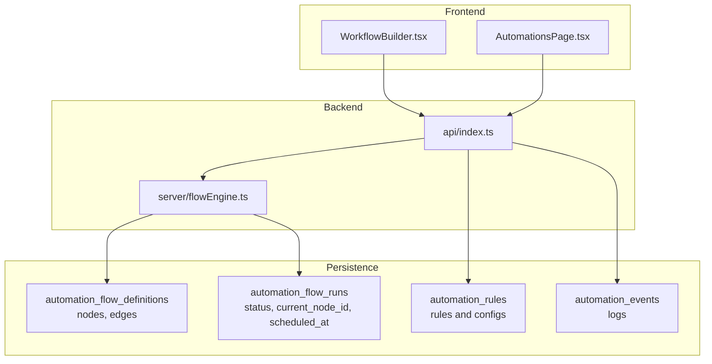
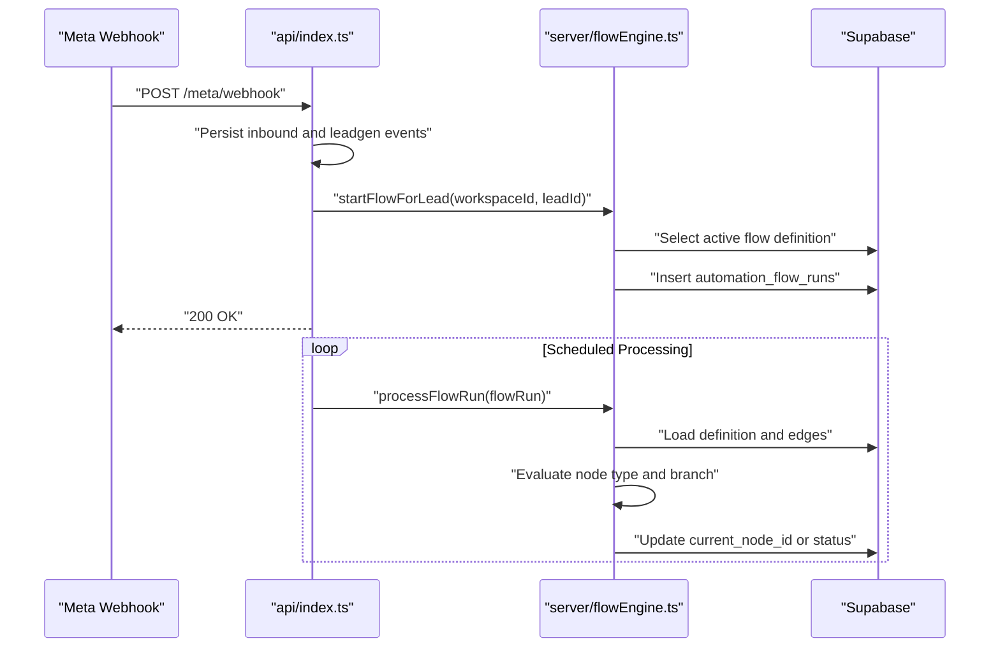
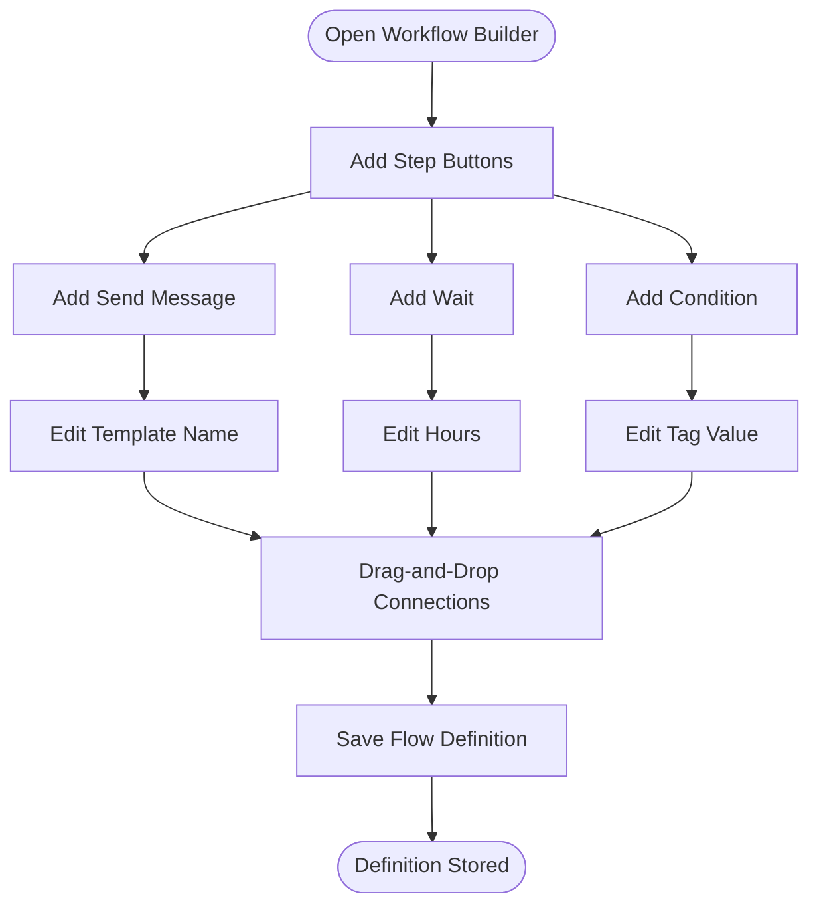
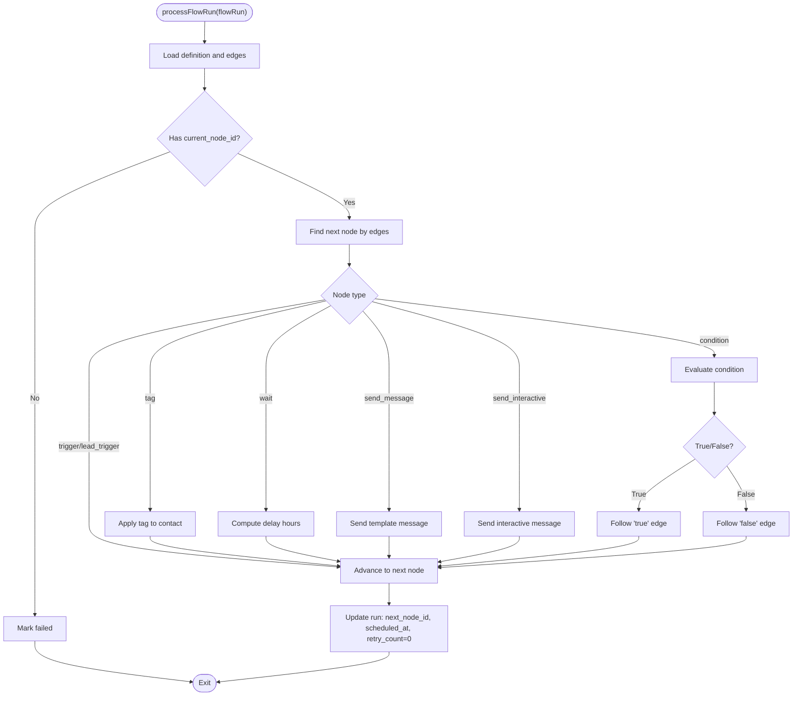
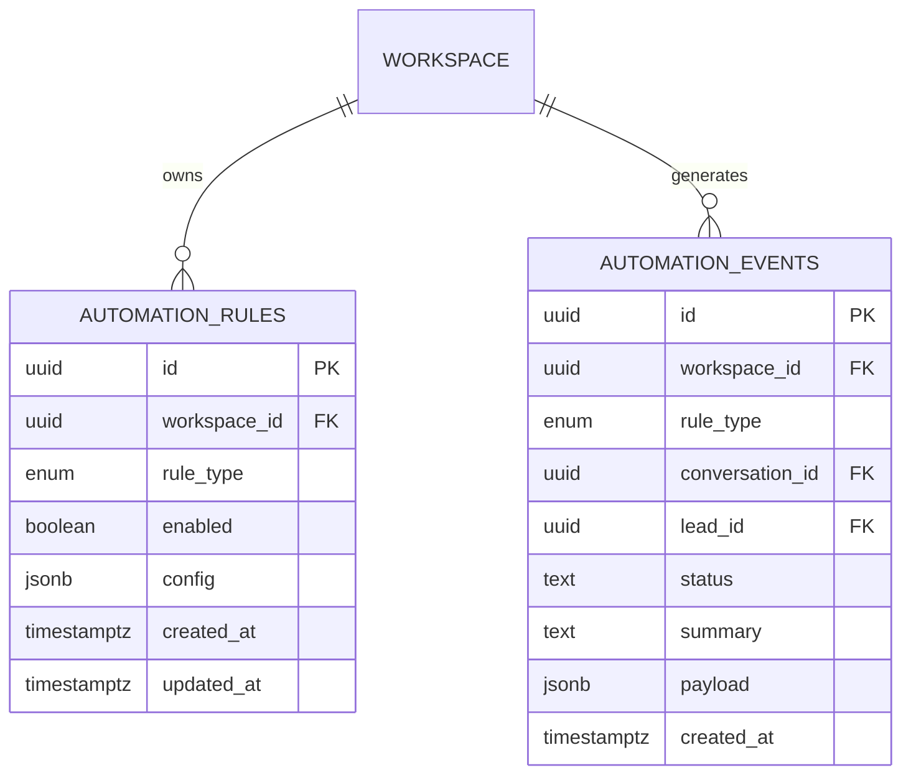
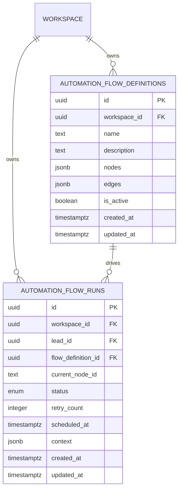
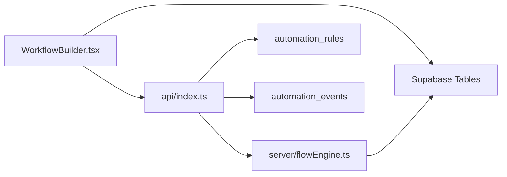

# Automation Engine

<cite>
**Referenced Files in This Document**
- [WorkflowBuilder.tsx](file://src/pages/WorkflowBuilder.tsx)
- [AutomationsPage.tsx](file://src/pages/AutomationsPage.tsx)
- [flowEngine.ts](file://server/flowEngine.ts)
- [index.ts](file://api/index.ts)
- [20260325_workflow_definitions.sql](file://supabase/20260325_workflow_definitions.sql)
- [20260325_automation_flows.sql](file://supabase/20260325_automation_flows.sql)
- [automation_v1_upgrade.sql](file://supabase/automation_v1_upgrade.sql)
- [README.md](file://README.md)
</cite>

## Table of Contents
1. [Introduction](#introduction)
2. [Project Structure](#project-structure)
3. [Core Components](#core-components)
4. [Architecture Overview](#architecture-overview)
5. [Detailed Component Analysis](#detailed-component-analysis)
6. [Dependency Analysis](#dependency-analysis)
7. [Performance Considerations](#performance-considerations)
8. [Troubleshooting Guide](#troubleshooting-guide)
9. [Conclusion](#conclusion)
10. [Appendices](#appendices)

## Introduction
This document describes the Automation Engine that powers workflow-driven automation for WhatsApp Business. It covers the visual workflow builder interface, automation node types, the flow execution engine, rule management, monitoring, and operational guidance. The system integrates a React-based visual builder with an Express backend and Supabase-backed persistence to orchestrate flows that start from triggers (webhook, schedule, manual) and execute actions (send message, add tag, wait, update contact), conditions (if/else logic), and interactive steps (quick replies, buttons).

## Project Structure
The Automation Engine spans three main areas:
- Frontend: Visual workflow builder and automation rule management UI
- Backend: Automation APIs, flow scheduler, and execution engine
- Persistence: Supabase tables for automation definitions, runs, rules, and events



**Diagram sources**
- [WorkflowBuilder.tsx:117-298](file://src/pages/WorkflowBuilder.tsx#L117-L298)
- [AutomationsPage.tsx:32-326](file://src/pages/AutomationsPage.tsx#L32-L326)
- [index.ts:1332-1426](file://api/index.ts#L1332-L1426)
- [flowEngine.ts:32-75](file://server/flowEngine.ts#L32-L75)
- [20260325_workflow_definitions.sql:4-14](file://supabase/20260325_workflow_definitions.sql#L4-L14)
- [20260325_automation_flows.sql:4-15](file://supabase/20260325_automation_flows.sql#L4-L15)
- [automation_v1_upgrade.sql:8-30](file://supabase/automation_v1_upgrade.sql#L8-L30)

**Section sources**
- [README.md:1-26](file://README.md#L1-L26)
- [WorkflowBuilder.tsx:117-298](file://src/pages/WorkflowBuilder.tsx#L117-L298)
- [AutomationsPage.tsx:32-326](file://src/pages/AutomationsPage.tsx#L32-L326)
- [index.ts:1332-1426](file://api/index.ts#L1332-L1426)
- [flowEngine.ts:32-75](file://server/flowEngine.ts#L32-L75)
- [20260325_workflow_definitions.sql:1-36](file://supabase/20260325_workflow_definitions.sql#L1-L36)
- [20260325_automation_flows.sql:1-31](file://supabase/20260325_automation_flows.sql#L1-L31)
- [automation_v1_upgrade.sql:1-60](file://supabase/automation_v1_upgrade.sql#L1-L60)

## Core Components
- Visual Workflow Builder: Drag-and-drop canvas with node palette, property panel, and real-time validation feedback
- Automation Node Types: Trigger, Action (send message, add tag, wait, update contact), Condition (if/else), Interactive (buttons/quick replies)
- Flow Execution Engine: Scheduler that advances flow runs based on nodes and edges, with retries and completion/failure states
- Rule Management: Operational rules (first reply, lead assignment, reminders, follow-up) and custom workflow definitions
- Monitoring and Logging: Events and operational logs for automation runs and failures

**Section sources**
- [WorkflowBuilder.tsx:29-102](file://src/pages/WorkflowBuilder.tsx#L29-L102)
- [flowEngine.ts:4-30](file://server/flowEngine.ts#L4-L30)
- [index.ts:173-194](file://api/index.ts#L173-L194)
- [20260325_workflow_definitions.sql:4-14](file://supabase/20260325_workflow_definitions.sql#L4-L14)
- [20260325_automation_flows.sql:4-15](file://supabase/20260325_automation_flows.sql#L4-L15)

## Architecture Overview
The Automation Engine follows a request-response and scheduled-processing model:
- Webhooks and internal triggers initiate flows
- The scheduler queries due flow runs and invokes the execution engine
- The engine evaluates nodes, updates run state, and schedules next steps
- UI surfaces definitions, runs, and events for monitoring



**Diagram sources**
- [index.ts:822-849](file://api/index.ts#L822-L849)
- [index.ts:744-749](file://api/index.ts#L744-L749)
- [flowEngine.ts:32-75](file://server/flowEngine.ts#L32-L75)
- [flowEngine.ts:77-168](file://server/flowEngine.ts#L77-L168)

**Section sources**
- [index.ts:822-849](file://api/index.ts#L822-L849)
- [index.ts:744-749](file://api/index.ts#L744-L749)
- [flowEngine.ts:32-75](file://server/flowEngine.ts#L32-L75)
- [flowEngine.ts:77-168](file://server/flowEngine.ts#L77-L168)

## Detailed Component Analysis

### Visual Workflow Builder
The builder provides:
- Canvas with draggable nodes and handles for connections
- Node palette: Send Message, Wait, Condition
- Properties panel to edit node-specific settings
- Real-time validation via connection and property updates
- Save to Supabase-backed definitions



**Diagram sources**
- [WorkflowBuilder.tsx:117-298](file://src/pages/WorkflowBuilder.tsx#L117-L298)

**Section sources**
- [WorkflowBuilder.tsx:117-298](file://src/pages/WorkflowBuilder.tsx#L117-L298)

### Automation Node Types
Supported node types and their roles:
- Trigger: Starts a flow (e.g., lead capture)
- Action: Perform operations (send message, add tag, wait, update contact)
- Condition: Branch based on evaluation (e.g., has tag)
- Interactive: Send interactive messages (buttons/quick replies)

```mermaid
classDiagram
class FlowStep {
+type : "wait"|"tag"|"send_message"|"send_interactive"|"condition"
+config : Record<string, any>
}
class TriggerNode {
+type : "trigger"
+data : {}
}
class SendMessageNode {
+type : "send_message"
+data : { templateName, languageCode }
}
class WaitNode {
+type : "wait"
+data : { hours }
}
class ConditionNode {
+type : "condition"
+data : { type, tag }
}
class InteractiveNode {
+type : "send_interactive"
+data : { body, buttons }
}
FlowStep --> TriggerNode
FlowStep --> SendMessageNode
FlowStep --> WaitNode
FlowStep --> ConditionNode
FlowStep --> InteractiveNode
```

**Diagram sources**
- [flowEngine.ts:4-30](file://server/flowEngine.ts#L4-L30)
- [WorkflowBuilder.tsx:29-102](file://src/pages/WorkflowBuilder.tsx#L29-L102)

**Section sources**
- [flowEngine.ts:4-30](file://server/flowEngine.ts#L4-L30)
- [WorkflowBuilder.tsx:29-102](file://src/pages/WorkflowBuilder.tsx#L29-L102)

### Flow Execution Engine
Execution logic:
- Load active flow definition and edges
- Resolve next node based on current node and edges
- Execute node-specific handler (tag, wait, send message, interactive, condition)
- Schedule next step with optional delay or mark completed/failed
- Retry up to a fixed limit with exponential-like backoff



**Diagram sources**
- [flowEngine.ts:77-168](file://server/flowEngine.ts#L77-L168)
- [flowEngine.ts:170-173](file://server/flowEngine.ts#L170-L173)

**Section sources**
- [flowEngine.ts:77-168](file://server/flowEngine.ts#L77-L168)
- [flowEngine.ts:170-173](file://server/flowEngine.ts#L170-L173)

### Rule Management
Operational rules (v1):
- Auto reply to first inbound
- Auto assign new lead
- No-reply reminder
- Follow-up after contacted

UI enables toggling and editing rule configurations per workspace.



**Diagram sources**
- [automation_v1_upgrade.sql:8-30](file://supabase/automation_v1_upgrade.sql#L8-L30)

**Section sources**
- [AutomationsPage.tsx:32-326](file://src/pages/AutomationsPage.tsx#L32-L326)
- [automation_v1_upgrade.sql:1-60](file://supabase/automation_v1_upgrade.sql#L1-L60)

### Workflow Definition System, Versioning, and Deployment
- Definitions: Stored as JSONB with nodes and edges; supports activation toggling
- Runs: Track active, completed, failed, paused; include current node and scheduling
- Versioning: Definitions include timestamps; UI lists and edits definitions
- Deployment: Cron-triggered endpoint processes due runs; requires secret header



**Diagram sources**
- [20260325_workflow_definitions.sql:4-14](file://supabase/20260325_workflow_definitions.sql#L4-L14)
- [20260325_automation_flows.sql:4-15](file://supabase/20260325_automation_flows.sql#L4-L15)

**Section sources**
- [index.ts:1332-1385](file://api/index.ts#L1332-L1385)
- [index.ts:1387-1426](file://api/index.ts#L1387-L1426)
- [20260325_workflow_definitions.sql:1-36](file://supabase/20260325_workflow_definitions.sql#L1-L36)
- [20260325_automation_flows.sql:1-31](file://supabase/20260325_automation_flows.sql#L1-L31)

### Practical Examples of Common Workflows
- Lead qualification: Capture lead via webhook → add tag → wait → send interactive → branch on user choice
- Customer onboarding: Capture lead → tag → wait → send template → add tag → condition on tag → next steps
- Abandoned cart recovery: Trigger on inactivity → send reminder → condition on reply → branch to offer or follow-up

Note: These are conceptual examples derived from supported node types and execution logic.

[No sources needed since this section doesn't analyze specific files]

## Dependency Analysis
Key dependencies and relationships:
- UI depends on ReactFlow for drag-and-drop and on Supabase for persistence
- Backend depends on Supabase for data access and Meta APIs for messaging
- Execution engine depends on definitions and runs tables to advance state
- Rules and events tables provide operational visibility



**Diagram sources**
- [WorkflowBuilder.tsx:117-298](file://src/pages/WorkflowBuilder.tsx#L117-L298)
- [index.ts:1332-1426](file://api/index.ts#L1332-L1426)
- [flowEngine.ts:32-75](file://server/flowEngine.ts#L32-L75)
- [automation_v1_upgrade.sql:8-30](file://supabase/automation_v1_upgrade.sql#L8-L30)

**Section sources**
- [WorkflowBuilder.tsx:117-298](file://src/pages/WorkflowBuilder.tsx#L117-L298)
- [index.ts:1332-1426](file://api/index.ts#L1332-L1426)
- [flowEngine.ts:32-75](file://server/flowEngine.ts#L32-L75)
- [automation_v1_upgrade.sql:1-60](file://supabase/automation_v1_upgrade.sql#L1-L60)

## Performance Considerations
- Scheduler efficiency: Use indexed columns (scheduled_at, lead_id) to scan due runs quickly
- Parallelism: Process multiple runs concurrently within safe limits; avoid overwhelming external providers
- Retry strategy: Limit retries and backoff to prevent thundering herds
- Validation: Keep node property updates minimal to reduce re-renders in the builder
- Caching: Cache frequently accessed rule configurations and templates

[No sources needed since this section provides general guidance]

## Troubleshooting Guide
Common issues and remedies:
- Flow stuck on a node: Verify edges and current_node_id; ensure nextNodeId resolution
- Missing prerequisites: Authorization, connection, or lead data errors cause failures; check logs and retry counts
- Webhook delivery: Confirm verify token and payload parsing; inspect persisted events
- Rule misconfiguration: Validate rule enablement and config fields; re-save and re-run sweeps

Operational logging and endpoints:
- Automation events and operational logs record statuses and payloads
- Retry failed sends for campaign/template/reply channels
- Sweep endpoints for reminders and follow-ups

**Section sources**
- [flowEngine.ts:154-167](file://server/flowEngine.ts#L154-L167)
- [index.ts:196-217](file://api/index.ts#L196-L217)
- [index.ts:1582-1751](file://api/index.ts#L1582-L1751)
- [index.ts:1224-1328](file://api/index.ts#L1224-L1328)

## Conclusion
The Automation Engine combines a visual builder, robust execution engine, and operational rules to deliver flexible, monitorable workflows. By leveraging Supabase for persistence and Meta APIs for messaging, it supports scalable automation from lead capture to engagement and retention.

[No sources needed since this section summarizes without analyzing specific files]

## Appendices

### Appendix A: API Endpoints for Automation
- GET /automation/definitions: List definitions for the workspace
- POST /automation/definitions: Upsert a definition
- POST /automation/process-flows: Cron-triggered processor for due runs
- POST /automation/lead-contacted: Follow-up automation after lead contacted
- POST /ops/retry-failed-send: Retry failed sends
- GET /automation/process-reminders: Run reminder sweep

**Section sources**
- [index.ts:1332-1385](file://api/index.ts#L1332-L1385)
- [index.ts:1387-1426](file://api/index.ts#L1387-L1426)
- [index.ts:1428-1580](file://api/index.ts#L1428-L1580)
- [index.ts:1582-1751](file://api/index.ts#L1582-L1751)
- [index.ts:1224-1328](file://api/index.ts#L1224-L1328)