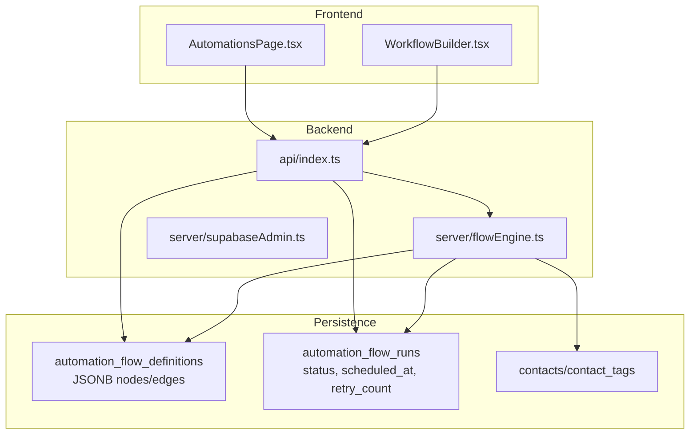
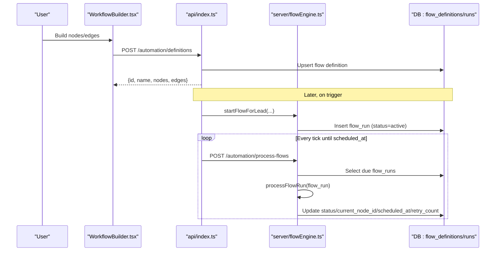
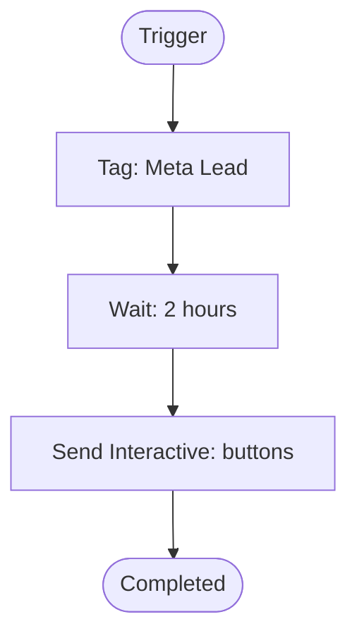
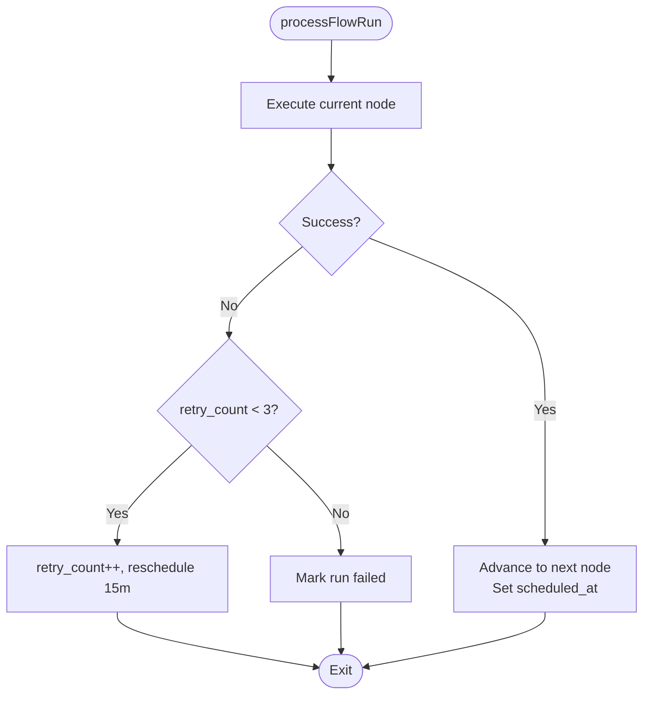
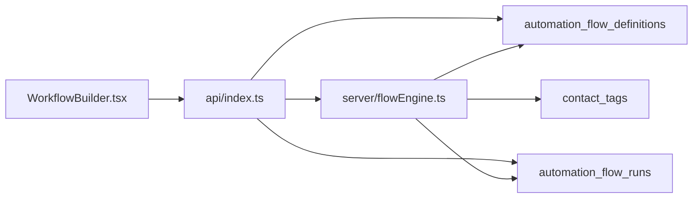
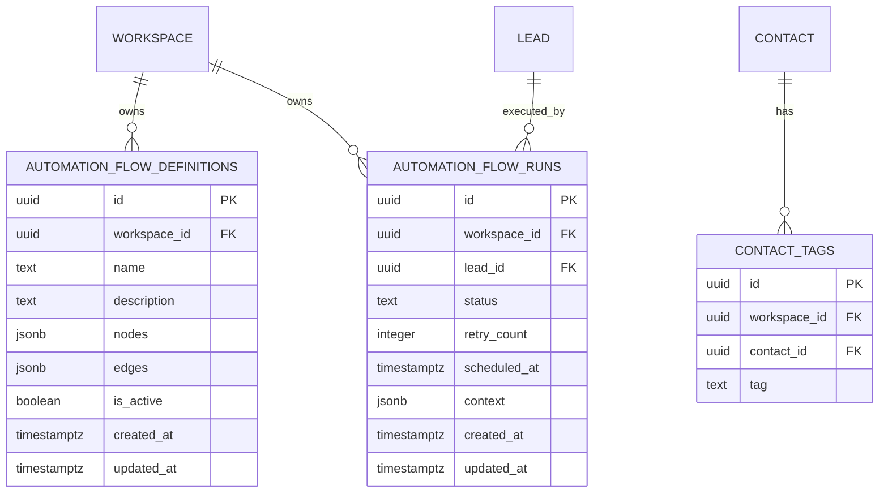

# Automation Node Types

<cite>
**Referenced Files in This Document**
- [AutomationsPage.tsx](file://src/pages/AutomationsPage.tsx)
- [WorkflowBuilder.tsx](file://src/pages/WorkflowBuilder.tsx)
- [flowEngine.ts](file://server/flowEngine.ts)
- [index.ts](file://api/index.ts)
- [schema.prisma](file://prisma/schema.prisma)
- [20260325_workflow_definitions.sql](file://supabase/20260325_workflow_definitions.sql)
- [20260325_automation_flows.sql](file://supabase/20260325_automation_flows.sql)
- [automation/server.ts](file://src/lib/automation/server.ts)
</cite>

## Table of Contents
1. [Introduction](#introduction)
2. [Project Structure](#project-structure)
3. [Core Components](#core-components)
4. [Architecture Overview](#architecture-overview)
5. [Detailed Component Analysis](#detailed-component-analysis)
6. [Dependency Analysis](#dependency-analysis)
7. [Performance Considerations](#performance-considerations)
8. [Troubleshooting Guide](#troubleshooting-guide)
9. [Conclusion](#conclusion)
10. [Appendices](#appendices)

## Introduction
This document describes the Automation Node Types available in the system, focusing on how flows are defined, executed, and monitored. It covers supported node categories, configuration schemas, parameter validation, defaults, error handling, retries, and performance considerations. Practical examples show how nodes combine to form end-to-end flows.

## Project Structure
The automation system spans frontend builder UI, backend flow engine, and persistence layers:
- Frontend builder renders nodes and allows saving flow definitions
- Backend engine executes flows and handles retries and scheduling
- Database stores flow definitions and runtime runs with row-level security

**Diagram sources**
- [WorkflowBuilder.tsx:106-113](file://src/pages/WorkflowBuilder.tsx#L106-L113)
- [index.ts:1332-1385](file://api/index.ts#L1332-L1385)
- [flowEngine.ts:32-75](file://server/flowEngine.ts#L32-L75)
- [20260325_workflow_definitions.sql:4-14](file://supabase/20260325_workflow_definitions.sql#L4-L14)
- [20260325_automation_flows.sql:4-15](file://supabase/20260325_automation_flows.sql#L4-L15)

**Section sources**
- [WorkflowBuilder.tsx:106-113](file://src/pages/WorkflowBuilder.tsx#L106-L113)
- [index.ts:1332-1385](file://api/index.ts#L1332-L1385)
- [flowEngine.ts:32-75](file://server/flowEngine.ts#L32-L75)
- [20260325_workflow_definitions.sql:4-14](file://supabase/20260325_workflow_definitions.sql#L4-L14)
- [20260325_automation_flows.sql:4-15](file://supabase/20260325_automation_flows.sql#L4-L15)

## Core Components
- Flow Definition: JSONB nodes and edges persisted per workspace with row-level security
- Flow Run: Per-lead execution state with status, scheduled_at, retry_count, and current_node_id
- Supported Node Types: trigger, tag, wait, send_message, send_interactive, condition
- Execution Engine: Processes nodes, applies branching, schedules next steps, retries on failure

**Section sources**
- [flowEngine.ts:4-9](file://server/flowEngine.ts#L4-L9)
- [flowEngine.ts:110-168](file://server/flowEngine.ts#L110-L168)
- [20260325_workflow_definitions.sql:4-14](file://supabase/20260325_workflow_definitions.sql#L4-L14)
- [20260325_automation_flows.sql:4-15](file://supabase/20260325_automation_flows.sql#L4-L15)

## Architecture Overview
End-to-end flow lifecycle:
- Define flows in the builder and persist definitions
- Start flows on triggers (e.g., lead creation)
- Engine executes nodes sequentially or conditionally, honoring edges
- Retry logic and scheduling keep flows resilient

**Diagram sources**
- [WorkflowBuilder.tsx:132-156](file://src/pages/WorkflowBuilder.tsx#L132-L156)
- [index.ts:1352-1385](file://api/index.ts#L1352-L1385)
- [flowEngine.ts:32-75](file://server/flowEngine.ts#L32-L75)
- [flowEngine.ts:77-168](file://server/flowEngine.ts#L77-L168)
- [index.ts:1387-1426](file://api/index.ts#L1387-L1426)

## Detailed Component Analysis

### Node Categories and Configurations

#### Trigger Nodes
- Types: trigger, lead_trigger
- Purpose: Start a flow when a lead is created or a Meta event occurs
- Activation: First node in a flow; engine advances to the next node via edges
- Defaults: None required; depends on flow definition edges

**Section sources**
- [flowEngine.ts:110-114](file://server/flowEngine.ts#L110-L114)
- [flowEngine.ts:52-54](file://server/flowEngine.ts#L52-L54)

#### Action Nodes

##### send_message
- Purpose: Send a templated message to the lead’s phone
- Config keys:
  - templateName: string (required)
  - languageCode: string (optional, defaults to en)
  - bodyParameters: string[] (optional)
- Validation: Requires workspace connection and Meta authorization; throws if missing prerequisites
- Defaults: languageCode defaults to "en"
- Error handling: Logs failures and automation events; does not auto-retry within this handler

**Section sources**
- [flowEngine.ts:199-228](file://server/flowEngine.ts#L199-L228)
- [index.ts:1488-1526](file://api/index.ts#L1488-L1526)

##### send_interactive
- Purpose: Send an interactive message (buttons) to the lead
- Config keys:
  - body: string (required)
  - buttons: array of button objects (required)
- Button object:
  - type: "reply" (supported)
  - reply.id: string (required)
  - reply.title: string (required)
- Validation: Requires connection and authorization; throws if missing
- Defaults: None required; buttons must be provided
- Error handling: Logs failures and automation events

**Section sources**
- [flowEngine.ts:230-259](file://server/flowEngine.ts#L230-L259)
- [index.ts:1488-1526](file://api/index.ts#L1488-L1526)

##### tag
- Purpose: Apply a tag to the contact associated with the lead
- Config keys:
  - tag: string (required)
- Behavior: Upserts contact_tags with conflict on (contact_id, tag)
- Defaults: None required

**Section sources**
- [flowEngine.ts:175-184](file://server/flowEngine.ts#L175-L184)

##### wait
- Purpose: Pause flow execution for a configurable number of hours
- Config keys:
  - hours: number (required)
- Defaults: hours defaults to 1 if not present
- Behavior: Sets scheduled_at in the future; engine resumes on next tick

**Section sources**
- [flowEngine.ts:121-124](file://server/flowEngine.ts#L121-L124)
- [flowEngine.ts:142-150](file://server/flowEngine.ts#L142-L150)

##### condition
- Purpose: Branch the flow based on a condition
- Config keys:
  - type: "has_tag" (supported)
  - tag: string (required when type=has_tag)
- Evaluation: Checks if the contact has the specified tag
- Branching: Uses edges with sourceHandle "true" or "false" to route flow

**Section sources**
- [flowEngine.ts:136-139](file://server/flowEngine.ts#L136-L139)
- [flowEngine.ts:186-197](file://server/flowEngine.ts#L186-L197)

#### Interactive Nodes
- Buttons and quick replies are configured under send_interactive
- Response handling: Incoming interactive clicks are logged as automation events during inbound processing

**Section sources**
- [flowEngine.ts:230-259](file://server/flowEngine.ts#L230-L259)
- [index.ts:475-492](file://api/index.ts#L475-L492)

### Configuration Schemas and Parameter Validation
- Frontend builder saves nodes/edges to /automation/definitions with upsert
- Backend validates authorization and persists JSONB nodes/edges
- Node handlers validate prerequisites (connections, authorizations) and throw errors if missing

**Section sources**
- [WorkflowBuilder.tsx:132-156](file://src/pages/WorkflowBuilder.tsx#L132-L156)
- [index.ts:1352-1385](file://api/index.ts#L1352-L1385)
- [flowEngine.ts:199-228](file://server/flowEngine.ts#L199-L228)
- [flowEngine.ts:230-259](file://server/flowEngine.ts#L230-L259)

### Default Values
- wait.hours defaults to 1 if not provided
- send_message.languageCode defaults to "en"
- condition.type defaults to "has_tag" in the builder; evaluation requires tag

**Section sources**
- [flowEngine.ts:121-124](file://server/flowEngine.ts#L121-L124)
- [flowEngine.ts:199-228](file://server/flowEngine.ts#L199-L228)
- [WorkflowBuilder.tsx:169-174](file://src/pages/WorkflowBuilder.tsx#L169-L174)

### Practical Examples

#### Example 1: Lead Nurturing Flow
- Trigger → Tag → Wait → Send Interactive
- Steps:
  - Trigger: Start on lead creation
  - Tag: Apply "Meta Lead"
  - Wait: 2 hours
  - Send Interactive: Body + buttons

**Diagram sources**
- [flowEngine.ts:11-30](file://server/flowEngine.ts#L11-L30)
- [flowEngine.ts:110-139](file://server/flowEngine.ts#L110-L139)

**Section sources**
- [flowEngine.ts:11-30](file://server/flowEngine.ts#L11-L30)
- [flowEngine.ts:110-139](file://server/flowEngine.ts#L110-L139)

#### Example 2: Conditional Follow-Up
- Trigger → Condition (Has Tag: Joined) → Send Message (True branch) → Wait → Send Message (False branch)
- Notes: Edges must specify sourceHandle "true"/"false" for branching

**Section sources**
- [flowEngine.ts:136-139](file://server/flowEngine.ts#L136-L139)
- [WorkflowBuilder.tsx:76-95](file://src/pages/WorkflowBuilder.tsx#L76-L95)

### Node-Specific Error Handling and Retries
- Node execution errors:
  - Increment retry_count
  - Reschedule after fixed delay (15 minutes)
  - After 3 retries, mark run as failed
- Prerequisite errors (missing connections/authorizations):
  - Throw immediately; logged via failed-send logs and automation events
- Reminder sweep and follow-up automation:
  - Dedicated endpoints log automation events and operational logs

**Diagram sources**
- [flowEngine.ts:142-168](file://server/flowEngine.ts#L142-L168)

**Section sources**
- [flowEngine.ts:142-168](file://server/flowEngine.ts#L142-L168)
- [index.ts:1224-1328](file://api/index.ts#L1224-L1328)
- [index.ts:1428-1580](file://api/index.ts#L1428-L1580)

## Dependency Analysis
- Frontend builder depends on Supabase auth for Authorization header
- API endpoints depend on Supabase admin client and workspace context
- Flow engine depends on Meta connections and authorizations
- Persistence uses JSONB nodes/edges and RLS policies

**Diagram sources**
- [WorkflowBuilder.tsx:132-156](file://src/pages/WorkflowBuilder.tsx#L132-L156)
- [index.ts:1352-1385](file://api/index.ts#L1352-L1385)
- [flowEngine.ts:32-75](file://server/flowEngine.ts#L32-L75)
- [20260325_workflow_definitions.sql:4-14](file://supabase/20260325_workflow_definitions.sql#L4-L14)
- [20260325_automation_flows.sql:4-15](file://supabase/20260325_automation_flows.sql#L4-L15)

**Section sources**
- [automation/server.ts:3-22](file://src/lib/automation/server.ts#L3-L22)
- [index.ts:1352-1385](file://api/index.ts#L1352-L1385)
- [flowEngine.ts:32-75](file://server/flowEngine.ts#L32-L75)

## Performance Considerations
- Scheduler efficiency: Indexes on automation_flow_runs.scheduled_at and lead_id reduce scan costs
- JSONB storage: Nodes/edges stored compactly; avoid overly deep graphs
- Retry backoff: Fixed 15-minute intervals prevent hot loops; limit retries to 3
- Batch processing: Cron endpoint processes all due runs; consider rate-limiting if scaling

**Section sources**
- [20260325_automation_flows.sql:17-19](file://supabase/20260325_automation_flows.sql#L17-L19)
- [flowEngine.ts:155-167](file://server/flowEngine.ts#L155-L167)

## Troubleshooting Guide
- Missing authorization or connection:
  - Symptoms: Errors indicating missing Meta authorization or phone number
  - Resolution: Reconnect WhatsApp and ensure active authorization
- Duplicate webhook events:
  - Mechanism: Fingerprinting prevents reprocessing; check processed_webhook_events
- Failed sends:
  - Use retry endpoint to resend failed messages; logs indicate channel and payload
- Flow stuck:
  - Check automation_flow_runs status and scheduled_at; verify edges and node configs

**Section sources**
- [flowEngine.ts:225-244](file://server/flowEngine.ts#L225-L244)
- [index.ts:319-342](file://api/index.ts#L319-L342)
- [index.ts:1582-1751](file://api/index.ts#L1582-L1751)

## Conclusion
The automation system supports a flexible, JSONB-driven flow model with robust execution, retry, and persistence. Triggers, tags, waits, messages, interactive buttons, and conditions cover common engagement scenarios. Use the builder to define flows, rely on the engine for execution, and leverage logs and retry mechanisms for resilience.

## Appendices

### Data Model Overview

**Diagram sources**
- [schema.prisma:90-108](file://prisma/schema.prisma#L90-L108)
- [20260325_workflow_definitions.sql:4-14](file://supabase/20260325_workflow_definitions.sql#L4-L14)
- [20260325_automation_flows.sql:4-15](file://supabase/20260325_automation_flows.sql#L4-L15)