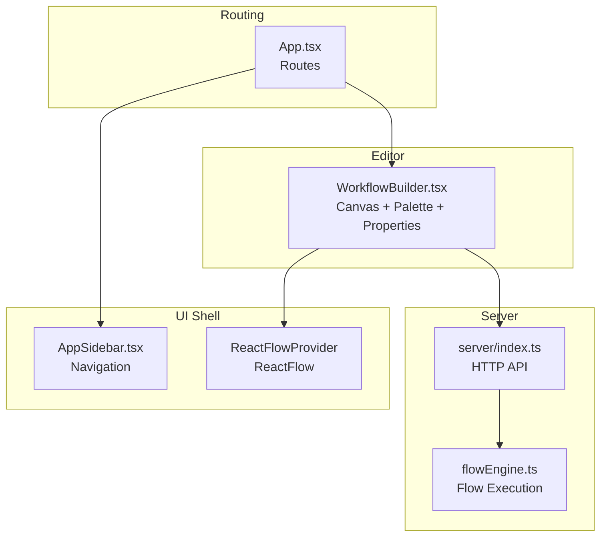
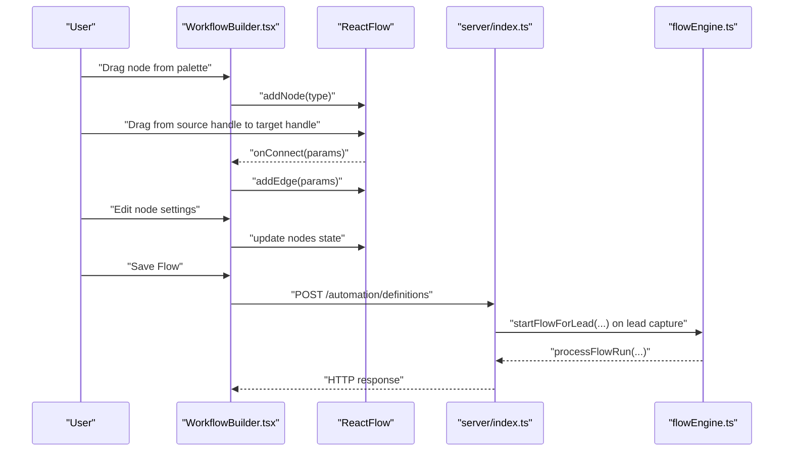
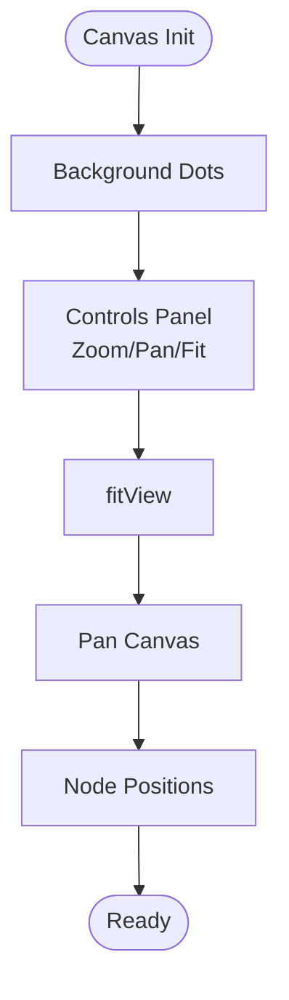
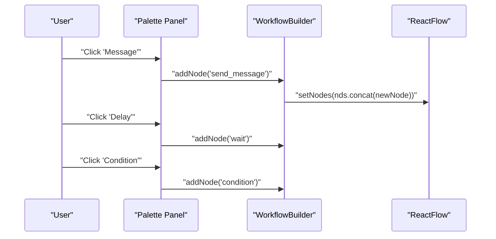
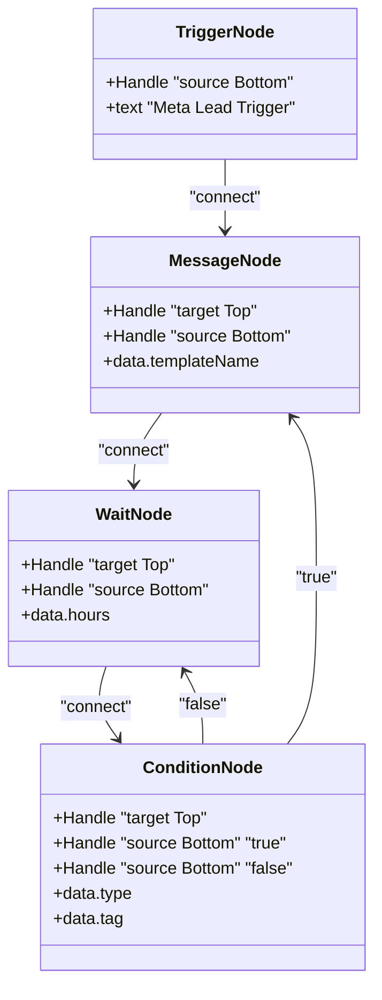
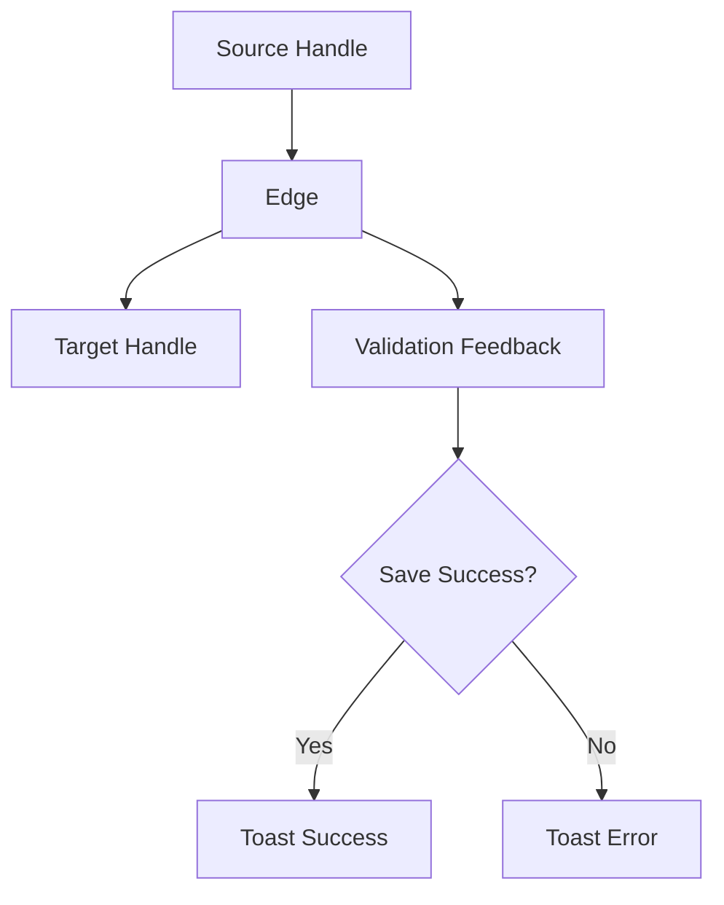
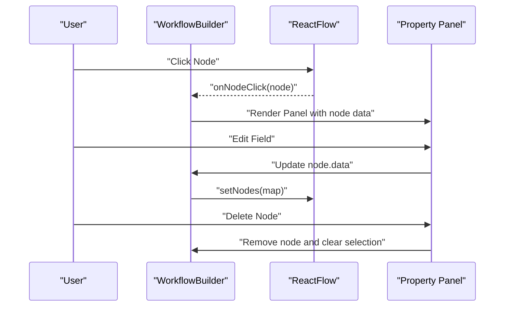
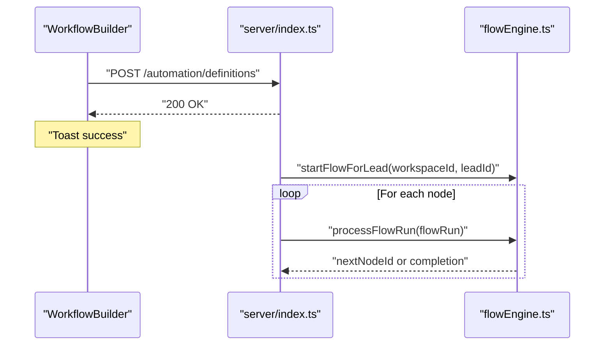
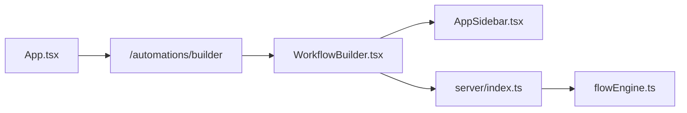

# Workflow Builder Interface

<cite>
**Referenced Files in This Document**
- [WorkflowBuilder.tsx](file://src/pages/WorkflowBuilder.tsx)
- [App.tsx](file://src/App.tsx)
- [AppSidebar.tsx](file://src/components/AppSidebar.tsx)
- [flowEngine.ts](file://server/flowEngine.ts)
- [index.ts](file://server/index.ts)
- [use-mobile.tsx](file://src/hooks/use-mobile.tsx)
</cite>

## Table of Contents
1. [Introduction](#introduction)
2. [Project Structure](#project-structure)
3. [Core Components](#core-components)
4. [Architecture Overview](#architecture-overview)
5. [Detailed Component Analysis](#detailed-component-analysis)
6. [Dependency Analysis](#dependency-analysis)
7. [Performance Considerations](#performance-considerations)
8. [Troubleshooting Guide](#troubleshooting-guide)
9. [Conclusion](#conclusion)
10. [Appendices](#appendices)

## Introduction
This document describes the Workflow Builder Interface component, a drag-and-drop visual editor for designing automation flows. It covers node creation, connection management, real-time validation feedback, canvas controls (zoom, pan, grid), the node palette, connection system, property panel configuration, and practical examples for common workflows. It also addresses responsive design, accessibility, and keyboard navigation considerations, along with best practices for node organization and visual hierarchy.

## Project Structure
The Workflow Builder is implemented as a standalone page component integrated into the application router. It uses React Flow for the canvas and a sidebar-based layout for navigation and property editing.

**Diagram sources**
- [App.tsx:41-67](file://src/App.tsx#L41-L67)
- [WorkflowBuilder.tsx:202-223](file://src/pages/WorkflowBuilder.tsx#L202-L223)
- [flowEngine.ts:32-75](file://server/flowEngine.ts#L32-L75)
- [index.ts:13-18](file://server/index.ts#L13-L18)

**Section sources**
- [App.tsx:41-67](file://src/App.tsx#L41-L67)
- [WorkflowBuilder.tsx:176-297](file://src/pages/WorkflowBuilder.tsx#L176-L297)

## Core Components
- Canvas and Controls: React Flow canvas with background dots, built-in controls, and fit-to-view behavior.
- Node Palette: Top-right panel with buttons to add Message, Delay, and Condition nodes.
- Node Types: Custom nodes for Trigger, Send Message, Wait, and Condition with handles for connecting edges.
- Property Panel: Right-side panel that appears when a node is selected, enabling inline editing of node settings.
- Save Flow: Persists the workflow definition to the backend via an HTTP endpoint.

Key behaviors:
- Drag-and-drop creation: Add nodes from the palette; nodes appear near random positions.
- Connection management: Connect nodes by dragging from source to target handles; edges are stored with source/target IDs and optional handle IDs.
- Real-time updates: Editing node properties updates the nodes state immediately.
- Validation feedback: Toast notifications indicate success or failure during save.

**Section sources**
- [WorkflowBuilder.tsx:29-102](file://src/pages/WorkflowBuilder.tsx#L29-L102)
- [WorkflowBuilder.tsx:117-174](file://src/pages/WorkflowBuilder.tsx#L117-L174)
- [WorkflowBuilder.tsx:132-156](file://src/pages/WorkflowBuilder.tsx#L132-L156)
- [WorkflowBuilder.tsx:227-292](file://src/pages/WorkflowBuilder.tsx#L227-L292)

## Architecture Overview
The Workflow Builder integrates frontend and backend components to enable flow design and execution.

**Diagram sources**
- [WorkflowBuilder.tsx:132-156](file://src/pages/WorkflowBuilder.tsx#L132-L156)
- [index.ts:13-18](file://server/index.ts#L13-L18)
- [flowEngine.ts:32-75](file://server/flowEngine.ts#L32-L75)

## Detailed Component Analysis

### Canvas and Controls
- Background: Dot pattern background for improved visibility.
- Controls: Zoom, fit-view, and reset controls provided by React Flow.
- Fit View: Automatically centers and scales the canvas to show all nodes.
- Panning: Built-in panning via mouse/touch.
- Grid Snapping: Not explicitly enabled; nodes snap to grid via positioning logic in the palette.

**Diagram sources**
- [WorkflowBuilder.tsx:212-214](file://src/pages/WorkflowBuilder.tsx#L212-L214)
- [WorkflowBuilder.tsx:202-211](file://src/pages/WorkflowBuilder.tsx#L202-L211)

**Section sources**
- [WorkflowBuilder.tsx:202-214](file://src/pages/WorkflowBuilder.tsx#L202-L214)

### Node Palette and Drag Behaviors
- Palette: Top-right panel with buttons to add Message, Delay, and Condition nodes.
- Drag Creation: Clicking a palette button creates a new node with default data and a randomized position.
- Default Data: Each node type initializes with sensible defaults (e.g., hours, template name, condition tag).

**Diagram sources**
- [WorkflowBuilder.tsx:215-222](file://src/pages/WorkflowBuilder.tsx#L215-L222)
- [WorkflowBuilder.tsx:158-174](file://src/pages/WorkflowBuilder.tsx#L158-L174)

**Section sources**
- [WorkflowBuilder.tsx:215-222](file://src/pages/WorkflowBuilder.tsx#L215-L222)
- [WorkflowBuilder.tsx:158-174](file://src/pages/WorkflowBuilder.tsx#L158-L174)

### Node Types and Handles
- Trigger: Primary entry node with a bottom source handle.
- Send Message: Blue-styled node with top target and bottom source handles; displays template name.
- Wait: Orange-styled node with top target and bottom source handles; displays hours.
- Condition: Purple-styled node with top target and two bottom source handles labeled TRUE/FALSE.

**Diagram sources**
- [WorkflowBuilder.tsx:29-95](file://src/pages/WorkflowBuilder.tsx#L29-L95)

**Section sources**
- [WorkflowBuilder.tsx:29-95](file://src/pages/WorkflowBuilder.tsx#L29-L95)

### Connection System
- Edge Drawing: Drag from a source handle to a target handle to create an edge.
- Storage: Edges are stored with source, target, and optional sourceHandle identifiers.
- Validation: No explicit validation rules are enforced in the frontend; validation feedback occurs on save via toast messages.
- Styling: Edges inherit default React Flow styles; handles are styled per node type.

**Diagram sources**
- [WorkflowBuilder.tsx:123-126](file://src/pages/WorkflowBuilder.tsx#L123-L126)
- [WorkflowBuilder.tsx:132-156](file://src/pages/WorkflowBuilder.tsx#L132-L156)

**Section sources**
- [WorkflowBuilder.tsx:123-126](file://src/pages/WorkflowBuilder.tsx#L123-L126)
- [WorkflowBuilder.tsx:132-156](file://src/pages/WorkflowBuilder.tsx#L132-L156)

### Property Panel
- Activation: Appears when a node is clicked; shows step settings for the selected node.
- Fields:
  - Step ID: Read-only identifier.
  - Wait: Numeric hours input bound to node data.
  - Send Message: Text template name input bound to node data.
  - Condition: Variable is fixed; Tag Value editable.
- Deletion: Trash icon removes the selected node and clears selection.

**Diagram sources**
- [WorkflowBuilder.tsx:128-130](file://src/pages/WorkflowBuilder.tsx#L128-L130)
- [WorkflowBuilder.tsx:227-292](file://src/pages/WorkflowBuilder.tsx#L227-L292)

**Section sources**
- [WorkflowBuilder.tsx:227-292](file://src/pages/WorkflowBuilder.tsx#L227-L292)

### Saving and Execution
- Save Flow: Posts nodes and edges to the backend endpoint with a bearer token header.
- Execution: On lead capture, the server starts a flow run using the active flow definition and processes steps sequentially, including tagging, waiting, sending messages, and evaluating conditions.

**Diagram sources**
- [WorkflowBuilder.tsx:132-156](file://src/pages/WorkflowBuilder.tsx#L132-L156)
- [index.ts:13-18](file://server/index.ts#L13-L18)
- [flowEngine.ts:32-75](file://server/flowEngine.ts#L32-L75)

**Section sources**
- [WorkflowBuilder.tsx:132-156](file://src/pages/WorkflowBuilder.tsx#L132-L156)
- [flowEngine.ts:77-168](file://server/flowEngine.ts#L77-L168)

## Dependency Analysis
- Routing: The builder is mounted under the protected route at /automations/builder.
- Sidebar: AppSidebar provides navigation across the application; it remains visible alongside the builder.
- Backend: The builder posts definitions to the server; the server orchestrates flow execution.

**Diagram sources**
- [App.tsx:59](file://src/App.tsx#L59)
- [WorkflowBuilder.tsx:179](file://src/pages/WorkflowBuilder.tsx#L179)
- [index.ts:13-18](file://server/index.ts#L13-L18)

**Section sources**
- [App.tsx:41-67](file://src/App.tsx#L41-L67)
- [WorkflowBuilder.tsx:176-179](file://src/pages/WorkflowBuilder.tsx#L176-L179)

## Performance Considerations
- Rendering: React Flow efficiently renders nodes and edges; keep node counts reasonable for smooth panning and zooming.
- Updates: Inline edits update nodes state directly; batch updates when adding many nodes to minimize re-renders.
- Network: Save requests should be debounced to avoid frequent network calls during rapid edits.

## Troubleshooting Guide
- Save fails: Verify backend connectivity and authentication token presence. Inspect toast messages for errors.
- Connections not sticking: Ensure source and target handles align; edges require a valid sourceHandle to target handle pairing.
- Node disappears: Deleting a node clears the selection; re-add nodes from the palette if needed.
- Execution issues: Confirm the active flow definition exists and that the lead capture triggers the start flow logic.

**Section sources**
- [WorkflowBuilder.tsx:132-156](file://src/pages/WorkflowBuilder.tsx#L132-L156)
- [flowEngine.ts:77-168](file://server/flowEngine.ts#L77-L168)

## Conclusion
The Workflow Builder Interface provides a robust, extensible foundation for designing automation flows. Its modular components—canvas, palette, nodes, connections, and property panel—enable intuitive flow construction. With clear separation between frontend editing and backend execution, it supports iterative development and reliable operation.

## Appendices

### Practical Examples

#### Example 1: Lead Qualification Flow
- Steps:
  - Trigger (Meta Lead)
  - Wait (e.g., 2 hours)
  - Condition (Has Tag: Joined)
  - TRUE branch: Send Interactive Message
  - FALSE branch: Send Message (welcome)
- Notes:
  - Use the Condition node to branch based on contact tags.
  - Configure template names and hours in the property panel.

**Section sources**
- [WorkflowBuilder.tsx:29-95](file://src/pages/WorkflowBuilder.tsx#L29-L95)
- [WorkflowBuilder.tsx:227-292](file://src/pages/WorkflowBuilder.tsx#L227-L292)

#### Example 2: Customer Onboarding Flow
- Steps:
  - Trigger (Meta Lead)
  - Send Message (welcome)
  - Wait (e.g., 24 hours)
  - Condition (Has Tag: Provided Email)
  - TRUE branch: Send Message (email verification)
  - FALSE branch: Send Message (request email)
- Notes:
  - Use tags to track user actions and tailor messaging.
  - Adjust hours to control pacing.

**Section sources**
- [WorkflowBuilder.tsx:29-95](file://src/pages/WorkflowBuilder.tsx#L29-L95)
- [WorkflowBuilder.tsx:227-292](file://src/pages/WorkflowBuilder.tsx#L227-L292)

### Best Practices and Design Guidance
- Node Organization:
  - Place Trigger at the top-left; arrange downstream nodes vertically or horizontally for readability.
  - Use Condition nodes to split logic cleanly; label branches clearly.
- Visual Hierarchy:
  - Use distinct colors per node type to improve scanning.
  - Keep edges straight and avoid crossing when possible.
- Validation:
  - Validate critical fields (template names, hours) before saving.
  - Use the property panel to confirm settings match intended behavior.
- Accessibility and Keyboard Navigation:
  - Ensure focus indicators are visible when navigating nodes.
  - Provide keyboard shortcuts for common actions (e.g., delete selected node).
  - Use screen reader-friendly labels for handles and buttons.
- Responsive Design:
  - The sidebar and canvas adapt to viewport width; test on mobile and tablet.
  - Consider using the mobile hook to adjust layout for smaller screens.

**Section sources**
- [use-mobile.tsx:1-19](file://src/hooks/use-mobile.tsx#L1-L19)
- [AppSidebar.tsx:57-144](file://src/components/AppSidebar.tsx#L57-L144)