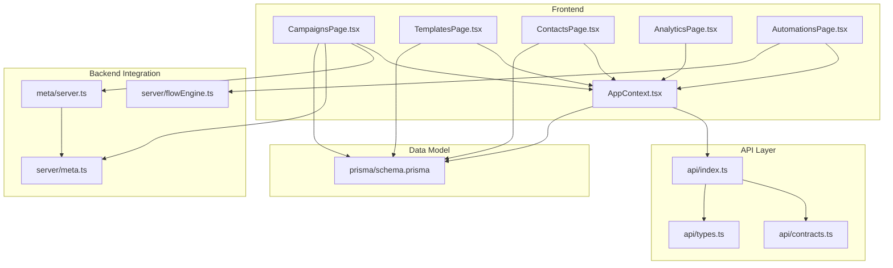
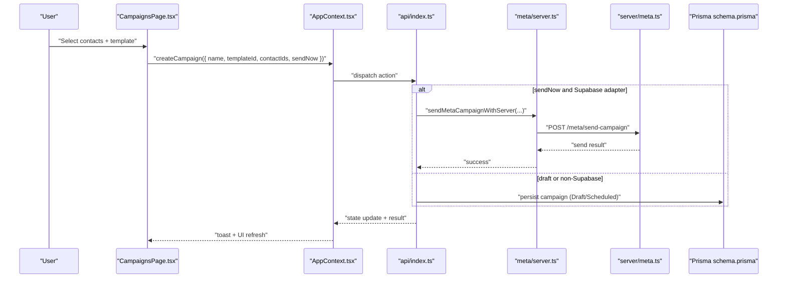
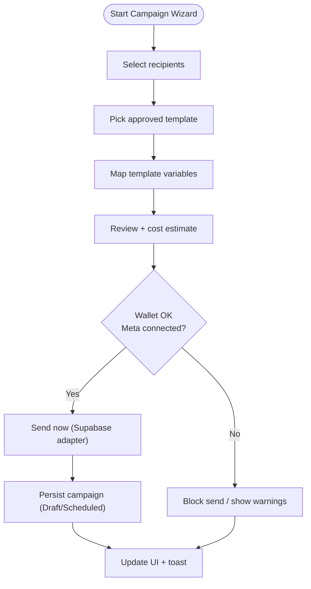
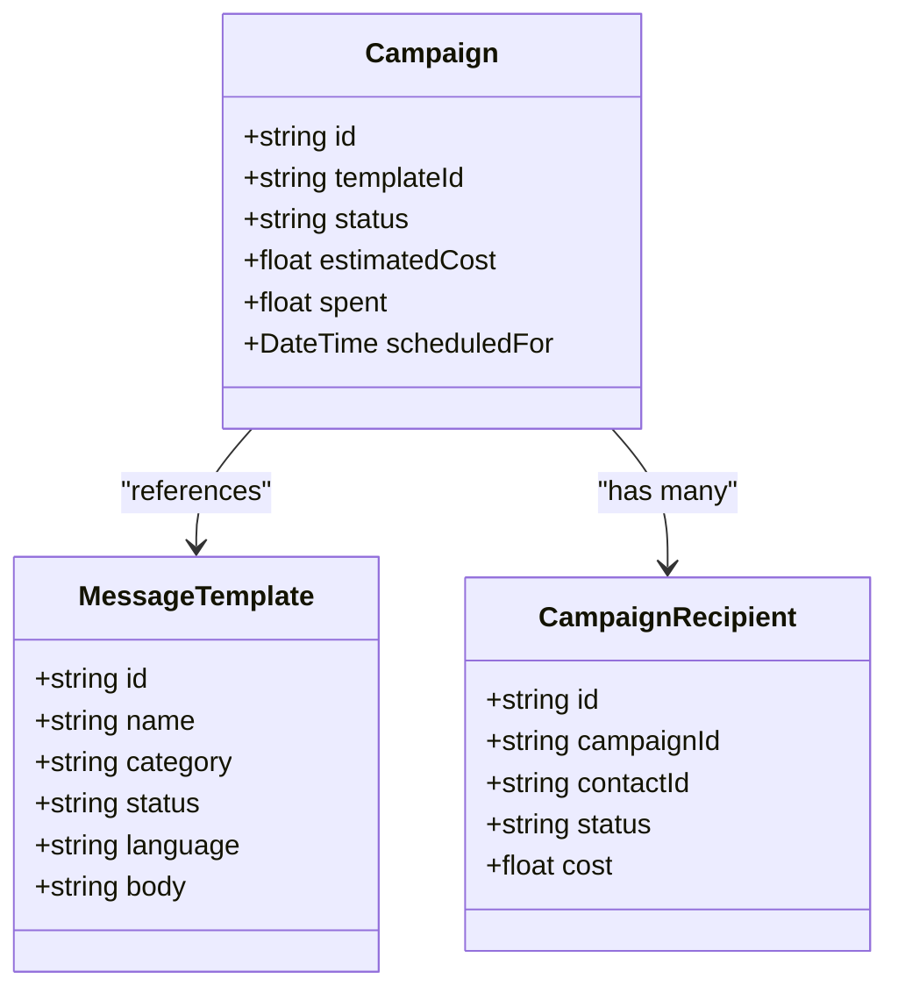
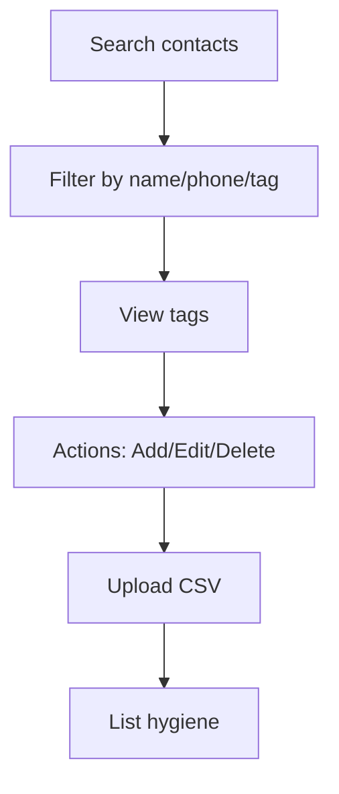
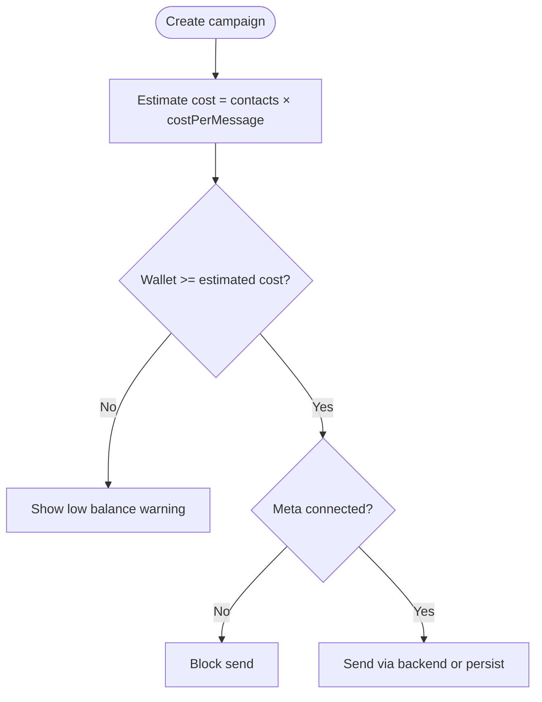
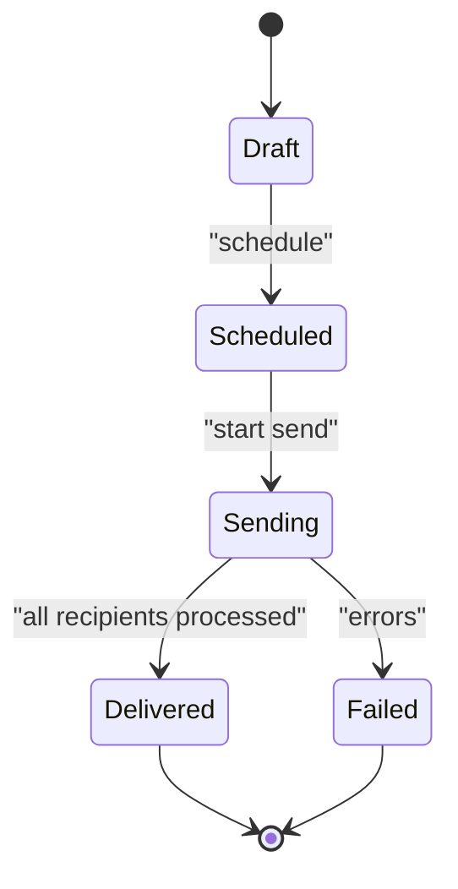
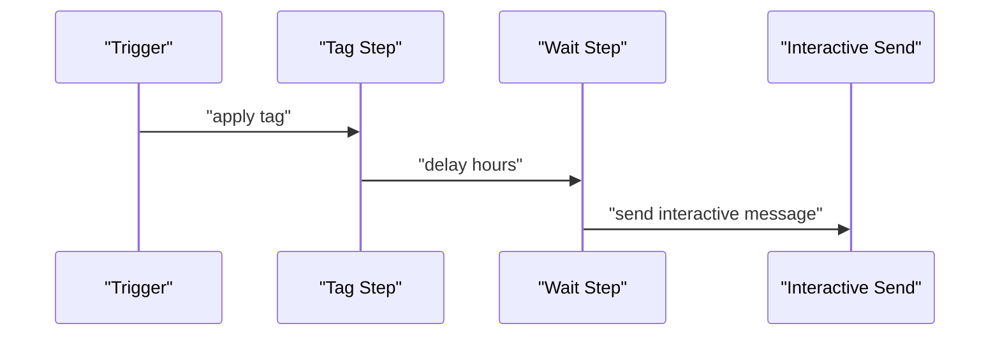
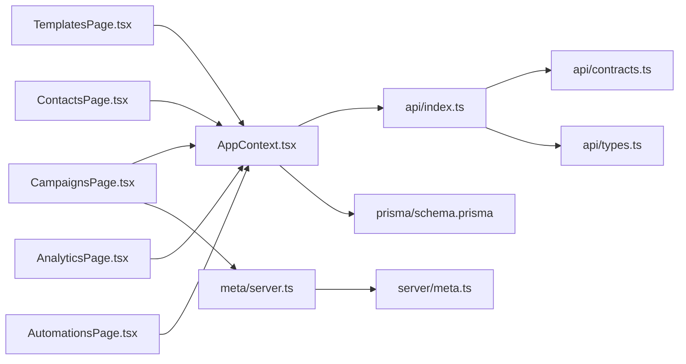

# Campaign Management

<cite>
**Referenced Files in This Document**
- [CampaignsPage.tsx](file://src/pages/CampaignsPage.tsx)
- [TemplatesPage.tsx](file://src/pages/TemplatesPage.tsx)
- [ContactsPage.tsx](file://src/pages/ContactsPage.tsx)
- [AppContext.tsx](file://src/context/AppContext.tsx)
- [api/index.ts](file://src/lib/api/index.ts)
- [api/contracts.ts](file://src/lib/api/contracts.ts)
- [api/types.ts](file://src/lib/api/types.ts)
- [meta/server.ts](file://src/lib/meta/server.ts)
- [meta.ts](file://server/meta.ts)
- [flowEngine.ts](file://server/flowEngine.ts)
- [schema.prisma](file://prisma/schema.prisma)
- [AnalyticsPage.tsx](file://src/pages/AnalyticsPage.tsx)
- [AutomationsPage.tsx](file://src/pages/AutomationsPage.tsx)
</cite>

## Table of Contents
1. [Introduction](#introduction)
2. [Project Structure](#project-structure)
3. [Core Components](#core-components)
4. [Architecture Overview](#architecture-overview)
5. [Detailed Component Analysis](#detailed-component-analysis)
6. [Dependency Analysis](#dependency-analysis)
7. [Performance Considerations](#performance-considerations)
8. [Troubleshooting Guide](#troubleshooting-guide)
9. [Conclusion](#conclusion)
10. [Appendices](#appendices)

## Introduction
This document explains the Campaign Management system with a focus on template creation, contact list management, campaign scheduling, and delivery tracking. It covers the template system (rich media templates, interactive components, approval workflows, and version management), contact management (import from various sources, tagging, segmentation, and privacy controls), campaign creation workflows (draft vs active campaigns, scheduling options, budget management, and cost estimation), and practical examples for campaign setup, template customization, contact targeting, and performance monitoring. It also documents the campaign execution engine, delivery tracking mechanisms, real-time status updates, optimization techniques, A/B testing capabilities, analytics reporting, best practices, compliance requirements, and troubleshooting.

## Project Structure
The campaign management feature spans frontend pages, shared context/state, API adapters, backend Meta integration, and Prisma data models. The primary UI surfaces are:
- Campaigns center with wizard-driven creation, review, and send
- Templates library with approval states
- Contacts workspace with tagging and import
- Analytics dashboard for delivery and spend metrics
- Automations page for operational rules and custom workflows

**Diagram sources**
- [CampaignsPage.tsx:1-557](file://src/pages/CampaignsPage.tsx#L1-L557)
- [TemplatesPage.tsx:1-116](file://src/pages/TemplatesPage.tsx#L1-L116)
- [ContactsPage.tsx:1-222](file://src/pages/ContactsPage.tsx#L1-L222)
- [AppContext.tsx:1-193](file://src/context/AppContext.tsx#L1-L193)
- [api/index.ts:1-23](file://src/lib/api/index.ts#L1-L23)
- [api/contracts.ts:1-156](file://src/lib/api/contracts.ts#L1-L156)
- [api/types.ts:1-299](file://src/lib/api/types.ts#L1-L299)
- [meta/server.ts:1-148](file://src/lib/meta/server.ts#L1-L148)
- [meta.ts:1-391](file://server/meta.ts#L1-L391)
- [flowEngine.ts:1-260](file://server/flowEngine.ts#L1-L260)
- [schema.prisma:1-189](file://prisma/schema.prisma#L1-L189)

**Section sources**
- [CampaignsPage.tsx:1-557](file://src/pages/CampaignsPage.tsx#L1-L557)
- [TemplatesPage.tsx:1-116](file://src/pages/TemplatesPage.tsx#L1-L116)
- [ContactsPage.tsx:1-222](file://src/pages/ContactsPage.tsx#L1-L222)
- [AppContext.tsx:1-193](file://src/context/AppContext.tsx#L1-L193)
- [api/index.ts:1-23](file://src/lib/api/index.ts#L1-L23)
- [api/contracts.ts:1-156](file://src/lib/api/contracts.ts#L1-L156)
- [api/types.ts:1-299](file://src/lib/api/types.ts#L1-L299)
- [meta/server.ts:1-148](file://src/lib/meta/server.ts#L1-L148)
- [meta.ts:1-391](file://server/meta.ts#L1-L391)
- [flowEngine.ts:1-260](file://server/flowEngine.ts#L1-L260)
- [schema.prisma:1-189](file://prisma/schema.prisma#L1-L189)

## Core Components
- Campaigns center: Wizard-based creation, template variable mapping, cost estimation, wallet checks, and send/draft actions.
- Templates library: Approval-aware templates with status tracking and preview rendering.
- Contacts workspace: Tagging, search, CSV import, and hygiene-focused list management.
- Analytics dashboard: Delivery rates, campaign delivery, response time, and cost-per-lead metrics.
- Automations: Operational rules and custom workflow engine for lead triggers and interactive sends.
- Backend Meta integration: Token exchange, template/text/interactive sends, and campaign send orchestration.

**Section sources**
- [CampaignsPage.tsx:32-161](file://src/pages/CampaignsPage.tsx#L32-L161)
- [TemplatesPage.tsx:14-110](file://src/pages/TemplatesPage.tsx#L14-L110)
- [ContactsPage.tsx:19-217](file://src/pages/ContactsPage.tsx#L19-L217)
- [AnalyticsPage.tsx:5-206](file://src/pages/AnalyticsPage.tsx#L5-L206)
- [AutomationsPage.tsx:32-326](file://src/pages/AutomationsPage.tsx#L32-L326)
- [meta/server.ts:18-114](file://src/lib/meta/server.ts#L18-L114)
- [meta.ts:298-390](file://server/meta.ts#L298-L390)

## Architecture Overview
The system integrates a frontend wizard with a flexible API adapter (mock, HTTP, or Supabase), a backend Meta integration for WhatsApp messaging, and a Prisma schema for persistence. The AppContext orchestrates state hydration and exposes actions for campaign creation, contact management, and wallet operations. Campaigns are persisted with status transitions (Draft → Scheduled → Sending → Delivered), while delivery tracking is computed from outbound metrics and campaign recipient records.

**Diagram sources**
- [CampaignsPage.tsx:121-161](file://src/pages/CampaignsPage.tsx#L121-L161)
- [AppContext.tsx:171-175](file://src/context/AppContext.tsx#L171-L175)
- [api/index.ts:18-23](file://src/lib/api/index.ts#L18-L23)
- [meta/server.ts:83-114](file://src/lib/meta/server.ts#L83-L114)
- [meta.ts:298-331](file://server/meta.ts#L298-L331)
- [schema.prisma:147-162](file://prisma/schema.prisma#L147-L162)

## Detailed Component Analysis

### Campaign Creation and Execution Engine
- Wizard-driven creation: Audience selection, template selection with variable mapping, and review with cost estimation and wallet checks.
- Approval gating: Only Approved templates are selectable; send is blocked if wallet is below threshold or Meta connection is missing.
- Execution path:
  - Live send via backend server endpoint when adapter is Supabase and connection exists.
  - Draft/Scheduled persistence otherwise.
- Delivery tracking: Campaigns expose status and recipient-level records; analytics compute delivery/read/failure rates.

**Diagram sources**
- [CampaignsPage.tsx:75-161](file://src/pages/CampaignsPage.tsx#L75-L161)
- [meta/server.ts:83-114](file://src/lib/meta/server.ts#L83-L114)
- [schema.prisma:42-47](file://prisma/schema.prisma#L42-L47)

**Section sources**
- [CampaignsPage.tsx:32-161](file://src/pages/CampaignsPage.tsx#L32-L161)
- [meta/server.ts:83-114](file://src/lib/meta/server.ts#L83-L114)
- [schema.prisma:147-162](file://prisma/schema.prisma#L147-L162)

### Template System: Rich Media, Interactive Components, Approval, Versioning
- Approval-aware templates: Templates are filtered by status and presented with preview and category/language metadata.
- Variable mapping: Placeholders are extracted from template previews and mapped to dynamic tokens (e.g., contact name/phone).
- Interactive sends: The backend supports interactive messages (buttons/list) and template sends; the flow engine demonstrates interactive flows.
- Version management: The schema supports template records; versioning can be introduced by adding version fields and migration logic.

**Diagram sources**
- [schema.prisma:133-145](file://prisma/schema.prisma#L133-L145)
- [schema.prisma:147-162](file://prisma/schema.prisma#L147-L162)
- [schema.prisma:164-175](file://prisma/schema.prisma#L164-L175)

**Section sources**
- [TemplatesPage.tsx:14-110](file://src/pages/TemplatesPage.tsx#L14-L110)
- [CampaignsPage.tsx:62-184](file://src/pages/CampaignsPage.tsx#L62-L184)
- [meta.ts:128-162](file://server/meta.ts#L128-L162)
- [flowEngine.ts:11-30](file://server/flowEngine.ts#L11-L30)

### Contact Management: Import, Tagging, Segmentation, Privacy Controls
- Tagging and segmentation: Contacts support tags with color-coded display; filtering by name, phone, or tag.
- Import: CSV upload capability is exposed in the UI; backend routes exist for sample uploads.
- Privacy controls: The schema enforces unique phone per workspace; UI surfaces warnings for deletion actions.

**Diagram sources**
- [ContactsPage.tsx:27-36](file://src/pages/ContactsPage.tsx#L27-L36)
- [ContactsPage.tsx:104-117](file://src/pages/ContactsPage.tsx#L104-L117)
- [schema.prisma:108-120](file://prisma/schema.prisma#L108-L120)

**Section sources**
- [ContactsPage.tsx:19-217](file://src/pages/ContactsPage.tsx#L19-L217)
- [schema.prisma:108-120](file://prisma/schema.prisma#L108-L120)

### Campaign Scheduling, Budget Management, and Cost Estimation
- Cost per message and thresholds are defined centrally; cost estimation multiplies contact count by unit cost.
- Wallet checks prevent sends below threshold; Meta connection gating prevents live sends without a connected number.
- Scheduling: Campaigns can be created as Scheduled; backend logic can advance status to Sending upon readiness.

**Diagram sources**
- [CampaignsPage.tsx:70-73](file://src/pages/CampaignsPage.tsx#L70-L73)
- [api/types.ts:2-6](file://src/lib/api/types.ts#L2-L6)
- [CampaignsPage.tsx:121-161](file://src/pages/CampaignsPage.tsx#L121-L161)

**Section sources**
- [CampaignsPage.tsx:70-73](file://src/pages/CampaignsPage.tsx#L70-L73)
- [api/types.ts:2-6](file://src/lib/api/types.ts#L2-L6)
- [schema.prisma:42-47](file://prisma/schema.prisma#L42-L47)

### Delivery Tracking and Real-Time Status Updates
- Campaign statuses: Draft, Scheduled, Sending, Delivered.
- Recipient-level tracking: Queued, Sent, Delivered, Failed.
- Analytics: Delivery/read/failure rates, campaign delivery percentage, average spend, and lead-source attribution.

**Diagram sources**
- [schema.prisma:42-47](file://prisma/schema.prisma#L42-L47)
- [schema.prisma:49-54](file://prisma/schema.prisma#L49-L54)
- [AnalyticsPage.tsx:25-31](file://src/pages/AnalyticsPage.tsx#L25-L31)

**Section sources**
- [schema.prisma:147-162](file://prisma/schema.prisma#L147-L162)
- [schema.prisma:164-175](file://prisma/schema.prisma#L164-L175)
- [AnalyticsPage.tsx:25-31](file://src/pages/AnalyticsPage.tsx#L25-L31)

### Campaign Execution Engine and Interactive Flows
- Flow engine supports tag steps, wait steps, send message, send interactive, and condition evaluation.
- Interactive sends use button or list types with configurable buttons and headers/footers.
- Lead-triggered flows demonstrate end-to-end automation from trigger to interactive send.

**Diagram sources**
- [flowEngine.ts:32-75](file://server/flowEngine.ts#L32-L75)
- [flowEngine.ts:110-168](file://server/flowEngine.ts#L110-L168)
- [flowEngine.ts:230-259](file://server/flowEngine.ts#L230-L259)

**Section sources**
- [flowEngine.ts:11-30](file://server/flowEngine.ts#L11-L30)
- [flowEngine.ts:110-168](file://server/flowEngine.ts#L110-L168)
- [meta.ts:153-162](file://server/meta.ts#L153-L162)

### Practical Examples
- Campaign setup:
  - Choose audience from Contacts workspace.
  - Select an Approved template and map placeholders to tokens.
  - Review cost and wallet balance; send immediately or save as Draft.
- Template customization:
  - Use placeholders and tokens; preview updates dynamically.
- Contact targeting:
  - Filter by name/phone/tag; apply tags for segmentation.
- Performance monitoring:
  - Use Analytics dashboard for delivery/read/failure rates and cost-per-lead.

**Section sources**
- [CampaignsPage.tsx:268-450](file://src/pages/CampaignsPage.tsx#L268-L450)
- [ContactsPage.tsx:27-36](file://src/pages/ContactsPage.tsx#L27-L36)
- [AnalyticsPage.tsx:104-206](file://src/pages/AnalyticsPage.tsx#L104-L206)

## Dependency Analysis
- Frontend pages depend on AppContext for state and actions.
- AppContext selects the active API adapter and delegates to mock, HTTP, or Supabase implementations.
- Campaign creation routes to backend Meta endpoints when applicable.
- Prisma schema defines domain entities and relationships.

**Diagram sources**
- [AppContext.tsx:52-92](file://src/context/AppContext.tsx#L52-L92)
- [api/index.ts:18-23](file://src/lib/api/index.ts#L18-L23)
- [meta/server.ts:18-47](file://src/lib/meta/server.ts#L18-L47)
- [schema.prisma:56-71](file://prisma/schema.prisma#L56-L71)

**Section sources**
- [AppContext.tsx:52-92](file://src/context/AppContext.tsx#L52-L92)
- [api/index.ts:18-23](file://src/lib/api/index.ts#L18-L23)
- [meta/server.ts:18-47](file://src/lib/meta/server.ts#L18-L47)
- [schema.prisma:56-71](file://prisma/schema.prisma#L56-L71)

## Performance Considerations
- Cost estimation is O(n) with contact count; avoid unnecessary re-computation by memoizing derived values.
- Template variable mapping uses regex extraction and replacement; keep placeholder counts reasonable.
- Analytics computations aggregate outbound messages and campaign recipients; pre-aggregate where possible.
- Backend send requests should be batched or rate-limited to align with Meta API constraints.

## Troubleshooting Guide
- Low wallet balance: The UI warns when balance is below threshold; top up funds before sending.
- Insufficient balance for send: The UI disables send and shows a warning; increase wallet balance.
- Meta connection required: Live sends are blocked without a connected Meta WhatsApp number; connect before sending.
- Template send failures: Use the failed send logs to diagnose errors; retry failed sends via the provided action.
- Automation sweep failures: The sweep action returns a result; check toast messages and logs.

**Section sources**
- [CampaignsPage.tsx:420-448](file://src/pages/CampaignsPage.tsx#L420-L448)
- [api/types.ts:154-165](file://src/lib/api/types.ts#L154-L165)
- [AutomationsPage.tsx:98-112](file://src/pages/AutomationsPage.tsx#L98-L112)

## Conclusion
The Campaign Management system provides a robust, approval-aware template layer, safe contact targeting, and a guided wizard for campaign creation with strong financial controls. The backend Meta integration enables scalable delivery, while the analytics dashboard offers actionable insights. The automation engine supports advanced workflows, and the modular architecture allows for future enhancements such as A/B testing and richer template versioning.

## Appendices

### Best Practices
- Always use Approved templates to ensure compliance and reduce send failures.
- Segment audiences using tags for targeted campaigns and improved delivery rates.
- Monitor wallet balance and set aside reserves for larger sends.
- Schedule campaigns during optimal hours and track performance via analytics.

### Compliance Requirements
- Respect privacy by ensuring unique phone constraints per workspace.
- Use Meta’s template guidelines and language codes for approved content.
- Maintain audit trails via failed send logs and automation events.

### A/B Testing and Optimization
- Use tags to split audiences and compare delivery/read rates.
- Iterate on template variables and interactive components to improve engagement.
- Track cost-per-lead and optimize spend by focusing on high-converting sources.