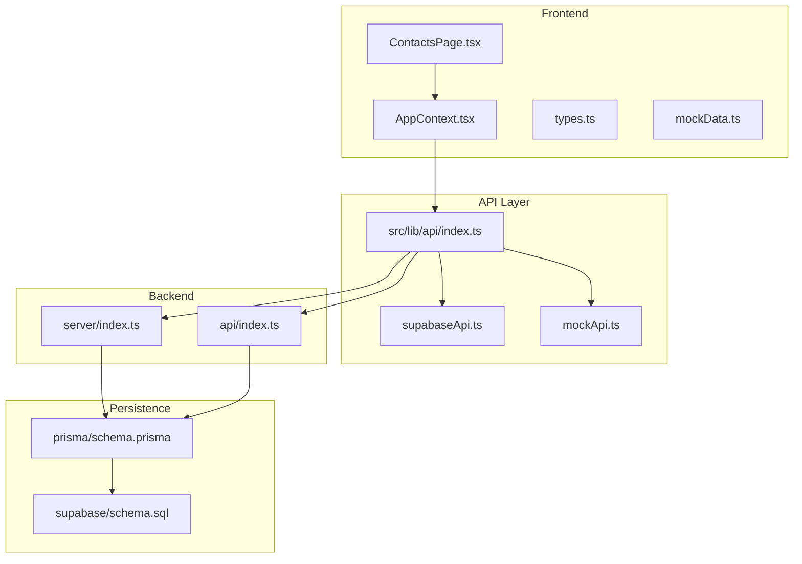
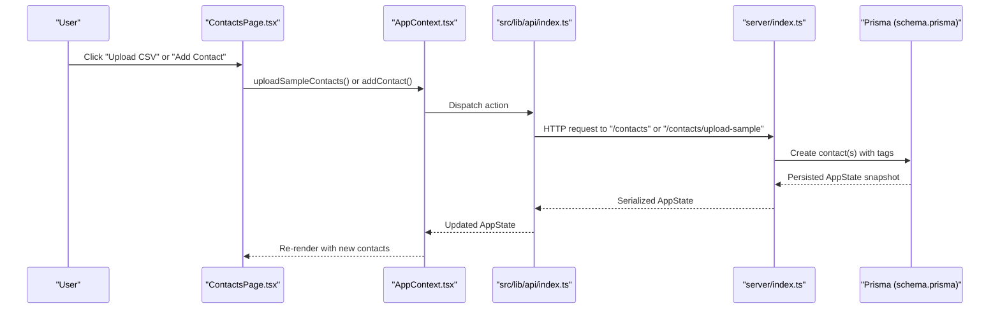
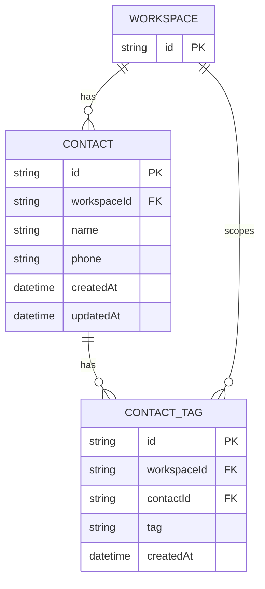
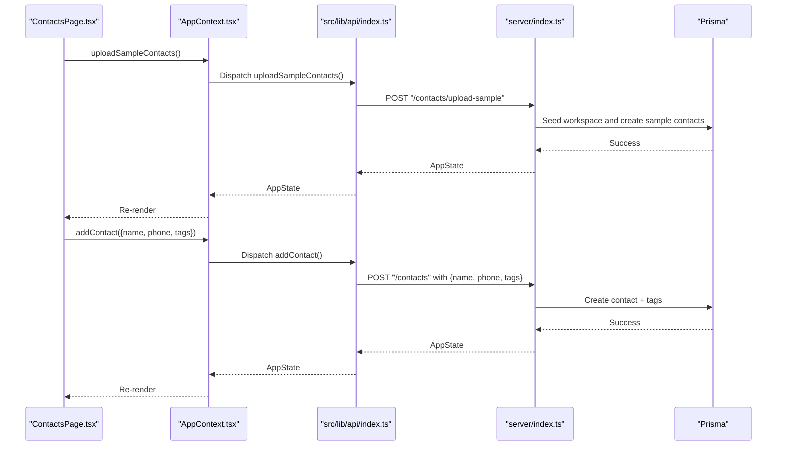
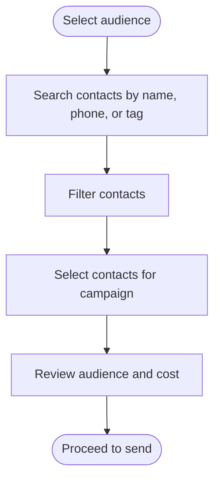
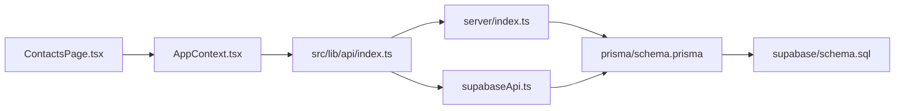

# Contact Management

<cite>
**Referenced Files in This Document**
- [ContactsPage.tsx](file://src/pages/ContactsPage.tsx)
- [AppContext.tsx](file://src/context/AppContext.tsx)
- [types.ts](file://src/lib/api/types.ts)
- [mockData.ts](file://src/lib/api/mockData.ts)
- [index.ts](file://src/lib/api/index.ts)
- [schema.prisma](file://prisma/schema.prisma)
- [server index.ts](file://server/index.ts)
- [api index.ts](file://api/index.ts)
- [supabaseApi.ts](file://src/lib/api/supabaseApi.ts)
- [schema.sql](file://supabase/schema.sql)
- [CampaignsPage.tsx](file://src/pages/CampaignsPage.tsx)
</cite>

## Table of Contents
1. [Introduction](#introduction)
2. [Project Structure](#project-structure)
3. [Core Components](#core-components)
4. [Architecture Overview](#architecture-overview)
5. [Detailed Component Analysis](#detailed-component-analysis)
6. [Dependency Analysis](#dependency-analysis)
7. [Performance Considerations](#performance-considerations)
8. [Troubleshooting Guide](#troubleshooting-guide)
9. [Conclusion](#conclusion)
10. [Appendices](#appendices)

## Introduction
This document describes the Contact Management system within the application. It focuses on how contacts are imported, validated, deduplicated, tagged, segmented, and used for targeted campaigns. It also covers profile management, privacy controls, data retention, GDPR-related features, and integration points with external systems.

## Project Structure
The Contact Management feature spans the frontend UI, shared types, API adapters, and backend persistence. Key areas:
- Frontend page for managing contacts and importing sample data
- Application state and actions for adding contacts and uploading sample contacts
- Shared types defining the Contact model and related structures
- Prisma schema modeling contacts, tags, and workspace scoping
- Backend routes for creating contacts and seeding sample contacts
- Supabase-backed API adapter and row-level security policies
- Campaign selection page consuming contacts for targeting

**Diagram sources**
- [ContactsPage.tsx:1-222](file://src/pages/ContactsPage.tsx#L1-L222)
- [AppContext.tsx:1-239](file://src/context/AppContext.tsx#L1-L239)
- [types.ts:71-76](file://src/lib/api/types.ts#L71-L76)
- [mockData.ts:360-366](file://src/lib/api/mockData.ts#L360-L366)
- [index.ts:1-23](file://src/lib/api/index.ts#L1-L23)
- [server index.ts:1893-1928](file://server/index.ts#L1893-L1928)
- [api index.ts:1893-1928](file://api/index.ts#L1893-L1928)
- [schema.prisma:145-168](file://prisma/schema.prisma#L145-L168)
- [schema.sql:447-453](file://supabase/schema.sql#L447-L453)

**Section sources**
- [ContactsPage.tsx:1-222](file://src/pages/ContactsPage.tsx#L1-L222)
- [AppContext.tsx:1-239](file://src/context/AppContext.tsx#L1-L239)
- [types.ts:71-76](file://src/lib/api/types.ts#L71-L76)
- [mockData.ts:360-366](file://src/lib/api/mockData.ts#L360-L366)
- [index.ts:1-23](file://src/lib/api/index.ts#L1-L23)
- [server index.ts:1893-1928](file://server/index.ts#L1893-L1928)
- [api index.ts:1893-1928](file://api/index.ts#L1893-L1928)
- [schema.prisma:145-168](file://prisma/schema.prisma#L145-L168)
- [schema.sql:447-453](file://supabase/schema.sql#L447-L453)

## Core Components
- Contact model: id, name, phone, tags
- Tagging system: per-contact tags stored via ContactTag relation
- Workspace scoping: all contacts belong to a workspace; uniqueness enforced per workspace
- Import mechanisms:
  - Sample upload endpoint seeds predefined sample contacts
  - Direct contact creation endpoint persists a single contact with tags
- Campaign targeting: contacts are selectable for campaign audiences

Key implementation references:
- Contact type definition and AppState composition
- Prisma models for Contact and ContactTag with uniqueness constraints
- Frontend UI for adding contacts and uploading sample contacts
- Backend routes for creating contacts and seeding sample contacts
- Supabase API adapter and row-level security policies

**Section sources**
- [types.ts:71-76](file://src/lib/api/types.ts#L71-L76)
- [schema.prisma:145-168](file://prisma/schema.prisma#L145-L168)
- [ContactsPage.tsx:19-57](file://src/pages/ContactsPage.tsx#L19-L57)
- [server index.ts:1893-1928](file://server/index.ts#L1893-L1928)
- [api index.ts:1893-1928](file://api/index.ts#L1893-L1928)
- [supabaseApi.ts:279-313](file://src/lib/api/supabaseApi.ts#L279-L313)

## Architecture Overview
The system supports multiple API adapters (mock, HTTP, Supabase). The frontend interacts with a unified API abstraction, which routes to either a mock implementation for local development or a real backend. Persistence is handled by Prisma with row-level security enforced by Supabase policies.

**Diagram sources**
- [ContactsPage.tsx:104-117](file://src/pages/ContactsPage.tsx#L104-L117)
- [AppContext.tsx:143-150](file://src/context/AppContext.tsx#L143-L150)
- [index.ts:18-23](file://src/lib/api/index.ts#L18-L23)
- [server index.ts:1893-1928](file://server/index.ts#L1893-L1928)
- [schema.prisma:145-168](file://prisma/schema.prisma#L145-L168)

## Detailed Component Analysis

### Contact Model and Tagging
- Contact: id, name, phone, tags
- Tags: stored in a separate ContactTag entity linked to Contact
- Uniqueness: phone numbers are unique per workspace
- Workspace scoping: all entities scoped to a workspace

**Diagram sources**
- [schema.prisma:145-168](file://prisma/schema.prisma#L145-L168)

**Section sources**
- [types.ts:71-76](file://src/lib/api/types.ts#L71-L76)
- [schema.prisma:145-168](file://prisma/schema.prisma#L145-L168)

### Contact Import and Validation
- Frontend import:
  - "Upload CSV" triggers a sample upload action
  - "Add Contact" validates presence of name and phone, splits comma-separated tags
- Backend creation:
  - Validates payload shape and creates contact with associated tags
  - Returns a refreshed AppState snapshot

**Diagram sources**
- [ContactsPage.tsx:104-117](file://src/pages/ContactsPage.tsx#L104-L117)
- [AppContext.tsx:143-150](file://src/context/AppContext.tsx#L143-L150)
- [server index.ts:1893-1928](file://server/index.ts#L1893-L1928)
- [api index.ts:1893-1928](file://api/index.ts#L1893-L1928)

**Section sources**
- [ContactsPage.tsx:19-57](file://src/pages/ContactsPage.tsx#L19-L57)
- [server index.ts:1893-1928](file://server/index.ts#L1893-L1928)
- [api index.ts:1893-1928](file://api/index.ts#L1893-L1928)
- [mockData.ts:360-366](file://src/lib/api/mockData.ts#L360-L366)

### Duplicate Detection and Prevention
- Phone number uniqueness is enforced per workspace via a unique constraint on Contact(phone, workspaceId)
- Attempting to create a duplicate phone number for the same workspace will fail at the persistence layer

**Section sources**
- [schema.prisma:156](file://prisma/schema.prisma#L156)

### Contact Tagging and Segmentation
- Tags are stored separately and linked to contacts
- UI displays tags with color mapping for common tag names
- Campaign audience selection allows filtering by name, phone, or tag

**Diagram sources**
- [ContactsPage.tsx:27-36](file://src/pages/ContactsPage.tsx#L27-L36)
- [CampaignsPage.tsx:268-397](file://src/pages/CampaignsPage.tsx#L268-L397)

**Section sources**
- [ContactsPage.tsx:9-17](file://src/pages/ContactsPage.tsx#L9-L17)
- [ContactsPage.tsx:194-200](file://src/pages/ContactsPage.tsx#L194-L200)
- [CampaignsPage.tsx:268-397](file://src/pages/CampaignsPage.tsx#L268-L397)

### Contact Profile Management
- Fields supported: name, phone, tags
- Editing is not implemented in the UI yet; placeholders indicate future inline editing
- Deletion is not implemented in the UI yet; placeholders indicate future delete capability

**Section sources**
- [ContactsPage.tsx:120-150](file://src/pages/ContactsPage.tsx#L120-L150)
- [ContactsPage.tsx:202-212](file://src/pages/ContactsPage.tsx#L202-L212)

### Privacy Controls and Data Retention
- Row-level security policies restrict access to workspace-scoped resources:
  - contacts_workspace_member
  - contact_tags_workspace_member
- These policies ensure users can only access contacts and tags within their workspace

**Section sources**
- [schema.sql:447-453](file://supabase/schema.sql#L447-L453)

### GDPR Compliance Features
- Workspace scoping ensures data isolation per tenant
- Row-level security policies enforce access control at the database level
- No explicit data portability or erasure features are present in the current codebase

**Section sources**
- [schema.prisma:90-108](file://prisma/schema.prisma#L90-L108)
- [schema.sql:447-453](file://supabase/schema.sql#L447-L453)

### Practical Examples

#### Import Workflows
- Sample CSV import:
  - Trigger "Upload CSV" to seed sample contacts
  - Backend seeds workspace and inserts predefined sample contacts
- Manual contact entry:
  - Fill name, phone, and comma-separated tags
  - Validation enforces presence of name and phone

**Section sources**
- [ContactsPage.tsx:104-117](file://src/pages/ContactsPage.tsx#L104-L117)
- [server index.ts:1920-1928](file://server/index.ts#L1920-L1928)
- [mockData.ts:360-366](file://src/lib/api/mockData.ts#L360-L366)
- [ContactsPage.tsx:38-57](file://src/pages/ContactsPage.tsx#L38-L57)

#### Segmentation Strategies
- VIP customers: tag as VIP
- E-commerce customers: tag as Shopify
- New vs returning: tag as New or Returning
- Business categories: tag as D2C or Retail
- Imported lists: tag as CSV

These strategies enable filtering and targeting in campaign audience selection.

**Section sources**
- [ContactsPage.tsx:9-17](file://src/pages/ContactsPage.tsx#L9-L17)
- [ContactsPage.tsx:27-36](file://src/pages/ContactsPage.tsx#L27-L36)
- [CampaignsPage.tsx:268-397](file://src/pages/CampaignsPage.tsx#L268-L397)

#### Data Enrichment Techniques
- Enrich existing contacts by adding tags (e.g., lifecycle stage, acquisition channel)
- Use tags to drive dynamic content personalization in templates
- Combine tags with campaign targeting to segment by behavior or demographics

[No sources needed since this section provides general guidance]

### Contact Deletion Procedures
- Not implemented in the UI yet; placeholder indicates future capability
- Backend does not expose a delete endpoint for contacts

**Section sources**
- [ContactsPage.tsx:207-209](file://src/pages/ContactsPage.tsx#L207-L209)
- [server index.ts:1893-1928](file://server/index.ts#L1893-L1928)

### Data Export Capabilities
- Not implemented in the current codebase
- No export endpoint for contacts or tags

[No sources needed since this section provides general guidance]

### Integration with External CRM Systems
- No explicit CRM integration is present in the current codebase
- The system relies on internal workspace-scoped contacts and tags

[No sources needed since this section provides general guidance]

## Dependency Analysis
- Frontend depends on shared types and API abstraction
- API abstraction selects adapter at runtime (mock, HTTP, Supabase)
- Backend routes depend on Prisma models and require authentication
- Supabase policies depend on current workspace context

**Diagram sources**
- [ContactsPage.tsx:1-222](file://src/pages/ContactsPage.tsx#L1-L222)
- [AppContext.tsx:1-239](file://src/context/AppContext.tsx#L1-L239)
- [index.ts:1-23](file://src/lib/api/index.ts#L1-L23)
- [server index.ts:1893-1928](file://server/index.ts#L1893-L1928)
- [schema.prisma:145-168](file://prisma/schema.prisma#L145-L168)
- [schema.sql:447-453](file://supabase/schema.sql#L447-L453)

**Section sources**
- [index.ts:1-23](file://src/lib/api/index.ts#L1-L23)
- [schema.prisma:145-168](file://prisma/schema.prisma#L145-L168)
- [schema.sql:447-453](file://supabase/schema.sql#L447-L453)

## Performance Considerations
- Tag retrieval and rendering are client-side; large tag sets may impact UI responsiveness
- Filtering by name, phone, and tags is client-side; consider server-side filtering for very large datasets
- Deduplication occurs at the database level via unique constraints, minimizing duplicate writes

[No sources needed since this section provides general guidance]

## Troubleshooting Guide
- Missing name or phone when adding a contact:
  - The UI prevents submission and shows a toast notification
- Duplicate phone number:
  - Backend throws an error; resolve by changing the phone number or removing duplicates
- Workspace access denied:
  - Ensure the user belongs to the correct workspace; row-level security policies restrict access

**Section sources**
- [ContactsPage.tsx:38-57](file://src/pages/ContactsPage.tsx#L38-L57)
- [schema.prisma:156](file://prisma/schema.prisma#L156)
- [schema.sql:447-453](file://supabase/schema.sql#L447-L453)

## Conclusion
The Contact Management system provides a solid foundation for importing, validating, tagging, and segmenting contacts. It leverages workspace scoping and row-level security for privacy and isolation. While advanced features like bulk CSV parsing, inline editing, deletion, and CRM integration are not present, the underlying models and APIs support incremental enhancements to meet evolving needs.

## Appendices

### API Definitions
- POST /contacts
  - Request: AddContactInput (name, phone, tags)
  - Response: AppState with updated contacts
- POST /contacts/upload-sample
  - Request: none
  - Response: AppState with seeded sample contacts

**Section sources**
- [server index.ts:1893-1928](file://server/index.ts#L1893-L1928)
- [api index.ts:1893-1928](file://api/index.ts#L1893-L1928)
- [types.ts:327](file://src/lib/api/types.ts#L327)