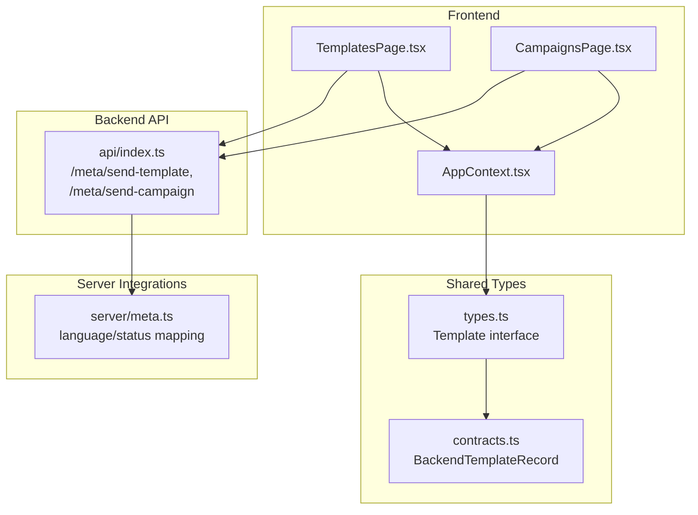
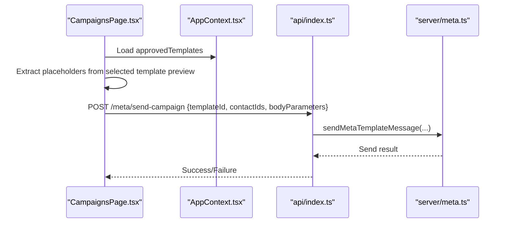
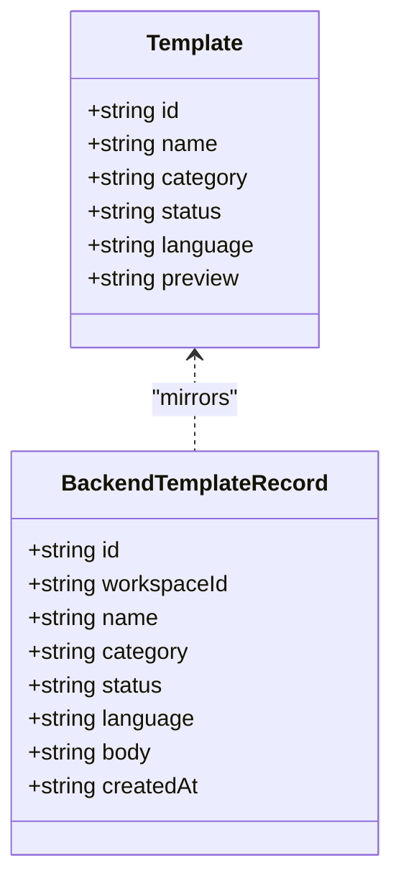
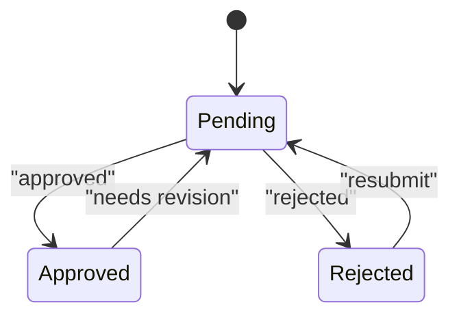
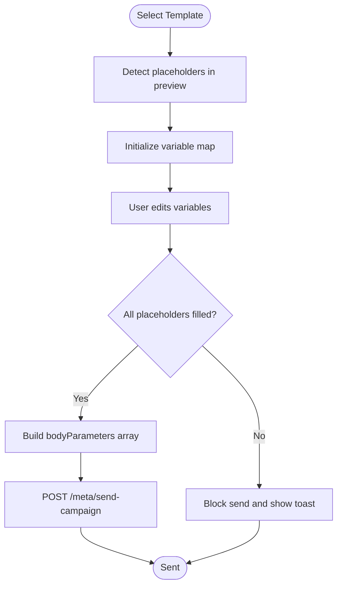
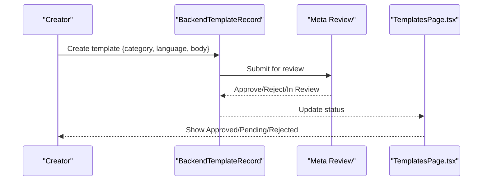
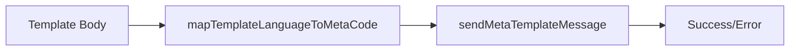
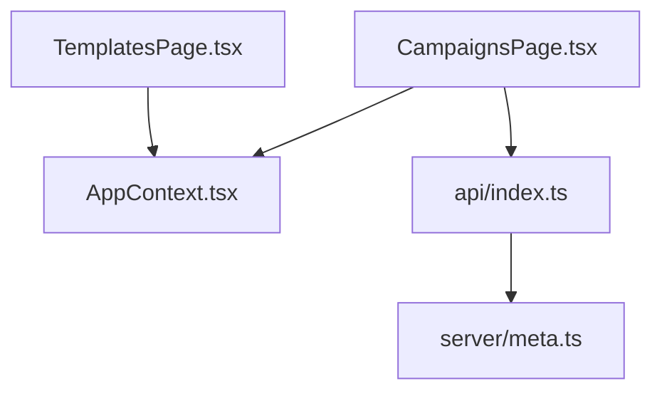

# Template Management

<cite>
**Referenced Files in This Document**
- [TemplatesPage.tsx](file://src/pages/TemplatesPage.tsx)
- [AppContext.tsx](file://src/context/AppContext.tsx)
- [types.ts](file://src/lib/api/types.ts)
- [contracts.ts](file://src/lib/api/contracts.ts)
- [index.ts](file://api/index.ts)
- [meta.ts](file://server/meta.ts)
- [CampaignsPage.tsx](file://src/pages/CampaignsPage.tsx)
- [IMPLEMENTATION_FIXES.md](file://IMPLEMENTATION_FIXES.md)
</cite>

## Table of Contents
1. [Introduction](#introduction)
2. [Project Structure](#project-structure)
3. [Core Components](#core-components)
4. [Architecture Overview](#architecture-overview)
5. [Detailed Component Analysis](#detailed-component-analysis)
6. [Dependency Analysis](#dependency-analysis)
7. [Performance Considerations](#performance-considerations)
8. [Troubleshooting Guide](#troubleshooting-guide)
9. [Conclusion](#conclusion)

## Introduction
This document describes the Template Management system for the application. It covers how templates are modeled, curated, and used in campaigns, including approval workflows, categories, languages, and formatting. It also documents the template variable system, how placeholders are resolved during campaign creation, and how the system integrates with Meta’s template approval and sending infrastructure. Practical guidance is included for designing effective templates, managing versions, and troubleshooting common validation and runtime errors.

## Project Structure
The Template Management system spans frontend UI, shared types, backend APIs, and server integrations:
- Frontend pages and context expose templates and drive campaign creation
- Shared TypeScript types define the template data model
- Backend routes handle Meta template sending and logging
- Server utilities map languages and statuses for Meta compliance

**Diagram sources**
- [TemplatesPage.tsx:14-115](file://src/pages/TemplatesPage.tsx#L14-L115)
- [CampaignsPage.tsx:311-332](file://src/pages/CampaignsPage.tsx#L311-L332)
- [AppContext.tsx:24-106](file://src/context/AppContext.tsx#L24-L106)
- [types.ts:78-85](file://src/lib/api/types.ts#L78-L85)
- [contracts.ts:134-143](file://src/lib/api/contracts.ts#L134-L143)
- [index.ts:935-1007](file://api/index.ts#L935-L1007)
- [meta.ts:18-48](file://server/meta.ts#L18-L48)

**Section sources**
- [TemplatesPage.tsx:14-115](file://src/pages/TemplatesPage.tsx#L14-L115)
- [AppContext.tsx:24-106](file://src/context/AppContext.tsx#L24-L106)
- [types.ts:78-85](file://src/lib/api/types.ts#L78-L85)
- [contracts.ts:134-143](file://src/lib/api/contracts.ts#L134-L143)
- [index.ts:935-1007](file://api/index.ts#L935-L1007)
- [meta.ts:18-48](file://server/meta.ts#L18-L48)

## Core Components
- Template data model
  - Frontend shape: Template with id, name, category, status, language, preview
  - Backend record: BackendTemplateRecord with id, workspaceId, name, category, status, language, body, createdAt
- Approved template filter
  - AppContext computes approvedTemplates from the global state for quick access in UI
- Campaign template selection
  - CampaignsPage allows selecting only approved templates and prepares variable placeholders
- Meta integration
  - API routes send templates via Meta, mapping languages and statuses appropriately

**Section sources**
- [types.ts:78-85](file://src/lib/api/types.ts#L78-L85)
- [contracts.ts:134-143](file://src/lib/api/contracts.ts#L134-L143)
- [AppContext.tsx:100-106](file://src/context/AppContext.tsx#L100-L106)
- [CampaignsPage.tsx:311-332](file://src/pages/CampaignsPage.tsx#L311-L332)
- [index.ts:935-1007](file://api/index.ts#L935-L1007)

## Architecture Overview
The template lifecycle is:
- Creation and storage: Templates are persisted as BackendTemplateRecord with category, language, and body
- Curation and approval: Templates are reviewed and transition to approved/pending/rejected
- Selection: Only approved templates appear in the campaign wizard
- Variable resolution: Placeholders are extracted from the template preview and mapped to contact data
- Sending: The backend sends the template to Meta using the correct language code and body parameters

**Diagram sources**
- [CampaignsPage.tsx:311-332](file://src/pages/CampaignsPage.tsx#L311-L332)
- [AppContext.tsx:100-106](file://src/context/AppContext.tsx#L100-L106)
- [index.ts:1001-1047](file://api/index.ts#L1001-L1047)
- [meta.ts:18-48](file://server/meta.ts#L18-L48)

## Detailed Component Analysis

### Template Data Model and Categories
- Frontend Template interface includes id, name, category ("Marketing" | "Utility"), status ("Approved" | "Pending" | "Rejected"), language, and preview
- Backend template record mirrors this with workspaceId, category ("marketing" | "utility"), status ("approved" | "pending" | "rejected"), language, and body
- Categories and statuses align with Meta’s template taxonomy and approval states

**Diagram sources**
- [types.ts:78-85](file://src/lib/api/types.ts#L78-L85)
- [contracts.ts:134-143](file://src/lib/api/contracts.ts#L134-L143)

**Section sources**
- [types.ts:78-85](file://src/lib/api/types.ts#L78-L85)
- [contracts.ts:134-143](file://src/lib/api/contracts.ts#L134-L143)

### Template Approval and Lifecycle
- Approval states: Approved, Pending, Rejected
- UI displays status badges and color-coded indicators
- Campaigns wizard restricts template selection to approved templates only
- Meta integration maps internal statuses to Meta’s review/approval terminology

**Diagram sources**
- [TemplatesPage.tsx:8-12](file://src/pages/TemplatesPage.tsx#L8-L12)
- [CampaignsPage.tsx:311-332](file://src/pages/CampaignsPage.tsx#L311-L332)
- [meta.ts:29-45](file://server/meta.ts#L29-L45)

**Section sources**
- [TemplatesPage.tsx:8-12](file://src/pages/TemplatesPage.tsx#L8-L12)
- [CampaignsPage.tsx:311-332](file://src/pages/CampaignsPage.tsx#L311-L332)
- [meta.ts:29-45](file://server/meta.ts#L29-L45)

### Template Variables and Placeholders
- Placeholders are detected from the selected template preview
- The campaign wizard extracts placeholders and initializes an input map for each placeholder
- During send, bodyParameters are constructed from the mapped values

**Diagram sources**
- [CampaignsPage.tsx:61-98](file://src/pages/CampaignsPage.tsx#L61-L98)
- [CampaignsPage.tsx:108-145](file://src/pages/CampaignsPage.tsx#L108-L145)
- [index.ts:1001-1047](file://api/index.ts#L1001-L1047)

**Section sources**
- [CampaignsPage.tsx:61-98](file://src/pages/CampaignsPage.tsx#L61-L98)
- [CampaignsPage.tsx:108-145](file://src/pages/CampaignsPage.tsx#L108-L145)
- [index.ts:1001-1047](file://api/index.ts#L1001-L1047)

### Template Creation and Approval Workflow
- Creation: Templates are stored with category, language, and body
- Approval: Status transitions occur via external Meta review; UI reflects approved/pending/rejected
- Versioning: The system stores multiple versions per template; the latest approved version is used for sending
- Deactivation: Templates can be marked as rejected or removed from use

**Diagram sources**
- [contracts.ts:134-143](file://src/lib/api/contracts.ts#L134-L143)
- [meta.ts:29-45](file://server/meta.ts#L29-L45)
- [TemplatesPage.tsx:8-12](file://src/pages/TemplatesPage.tsx#L8-L12)

**Section sources**
- [contracts.ts:134-143](file://src/lib/api/contracts.ts#L134-L143)
- [meta.ts:29-45](file://server/meta.ts#L29-L45)
- [TemplatesPage.tsx:8-12](file://src/pages/TemplatesPage.tsx#L8-L12)

### Template Export/Import and Meta Integration
- Export/import: Not implemented in the current codebase; templates are managed via backend records and Meta
- Meta approval: Templates must be approved in Meta Business Manager before use
- Language mapping: The backend maps template language to Meta’s language codes for sending

**Diagram sources**
- [index.ts:1044](file://api/index.ts#L1044)
- [index.ts:935-1007](file://api/index.ts#L935-L1007)
- [meta.ts:18-48](file://server/meta.ts#L18-L48)

**Section sources**
- [index.ts:1044](file://api/index.ts#L1044)
- [index.ts:935-1007](file://api/index.ts#L935-L1007)
- [meta.ts:18-48](file://server/meta.ts#L18-L48)

## Dependency Analysis
- TemplatesPage depends on AppContext for templates and status display
- CampaignsPage depends on AppContext for approvedTemplates and builds variable mappings
- Backend routes depend on server/meta utilities for language/status mapping and sending

**Diagram sources**
- [TemplatesPage.tsx:14-115](file://src/pages/TemplatesPage.tsx#L14-L115)
- [AppContext.tsx:24-106](file://src/context/AppContext.tsx#L24-L106)
- [CampaignsPage.tsx:311-332](file://src/pages/CampaignsPage.tsx#L311-L332)
- [index.ts:935-1007](file://api/index.ts#L935-L1007)
- [meta.ts:18-48](file://server/meta.ts#L18-L48)

**Section sources**
- [TemplatesPage.tsx:14-115](file://src/pages/TemplatesPage.tsx#L14-L115)
- [AppContext.tsx:24-106](file://src/context/AppContext.tsx#L24-L106)
- [CampaignsPage.tsx:311-332](file://src/pages/CampaignsPage.tsx#L311-L332)
- [index.ts:935-1007](file://api/index.ts#L935-L1007)
- [meta.ts:18-48](file://server/meta.ts#L18-L48)

## Performance Considerations
- Filter approved templates client-side to minimize re-renders and improve UX responsiveness
- Batch campaign sends leverage bodyParameters ordering to reduce per-message overhead
- Avoid excessive polling of template states; rely on server logs and operational events for updates

## Troubleshooting Guide
- Template not selectable in campaigns
  - Ensure the template status is “Approved”
  - Verify approvedTemplates filtering in AppContext
- Placeholder mapping errors
  - Confirm all detected placeholders are filled before sending
  - Check that the number and order of bodyParameters match placeholders
- Meta send failures
  - Verify Meta authorization and connected phone number
  - Confirm language code mapping and template name
  - Inspect operational logs and failed send logs for details
- Implementation note
  - The system expects an approved template in flows; adjust or use non-template messages if needed

**Section sources**
- [AppContext.tsx:100-106](file://src/context/AppContext.tsx#L100-L106)
- [CampaignsPage.tsx:108-145](file://src/pages/CampaignsPage.tsx#L108-L145)
- [index.ts:935-1007](file://api/index.ts#L935-L1007)
- [IMPLEMENTATION_FIXES.md:36-40](file://IMPLEMENTATION_FIXES.md#L36-L40)

## Conclusion
The Template Management system provides a structured approach to template creation, approval, and usage. By enforcing approved-only selection in campaigns, supporting dynamic placeholders, and integrating with Meta’s template infrastructure, it ensures safe, scalable messaging. Adopting the recommended patterns and troubleshooting steps will help teams maintain high-quality, compliant templates for e-commerce and D2C brands.