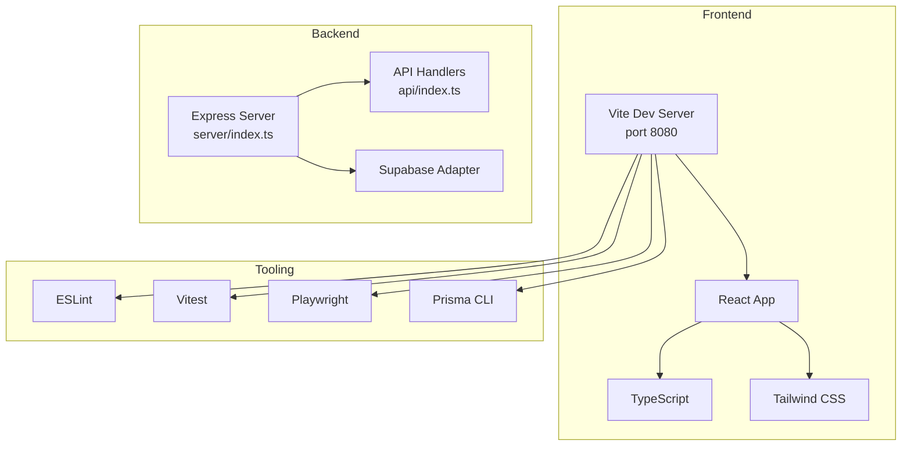
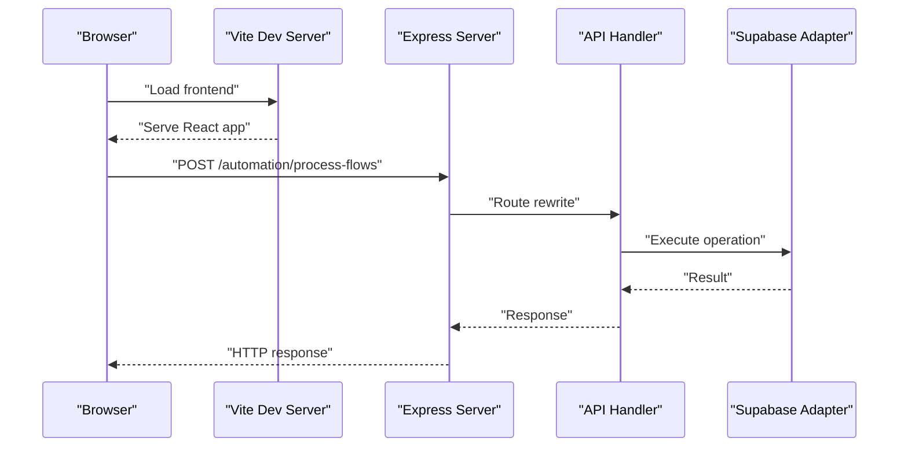
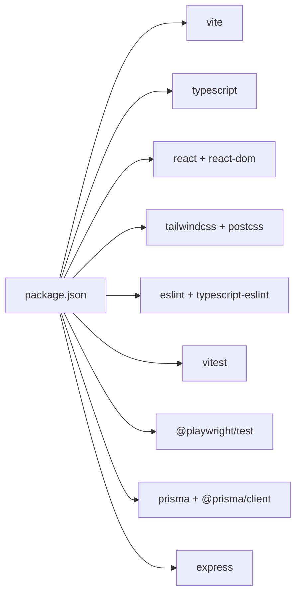

# Contributing & Development

<cite>
**Referenced Files in This Document**
- [package.json](file://package.json)
- [README.md](file://README.md)
- [DEPLOYMENT_GUIDE.md](file://DEPLOYMENT_GUIDE.md)
- [NGROK_SETUP_GUIDE.md](file://NGROK_SETUP_GUIDE.md)
- [eslint.config.js](file://eslint.config.js)
- [vite.config.ts](file://vite.config.ts)
- [vitest.config.ts](file://vitest.config.ts)
- [playwright.config.ts](file://playwright.config.ts)
- [tsconfig.json](file://tsconfig.json)
- [tailwind.config.ts](file://tailwind.config.ts)
- [postcss.config.js](file://postcss.config.js)
- [prisma.config.ts](file://prisma.config.ts)
- [vercel.json](file://vercel.json)
- [src/test/setup.ts](file://src/test/setup.ts)
</cite>

## Table of Contents
1. [Introduction](#introduction)
2. [Project Structure](#project-structure)
3. [Core Components](#core-components)
4. [Architecture Overview](#architecture-overview)
5. [Detailed Component Analysis](#detailed-component-analysis)
6. [Dependency Analysis](#dependency-analysis)
7. [Performance Considerations](#performance-considerations)
8. [Troubleshooting Guide](#troubleshooting-guide)
9. [Conclusion](#conclusion)
10. [Appendices](#appendices)

## Introduction
This guide explains how to set up a development environment, adhere to code standards, contribute effectively, and manage releases for the project. It covers Node.js requirements, dependency installation, local development server configuration, linting and formatting, testing, debugging, and deployment workflows. It also outlines contribution practices such as branch naming, pull request procedures, code review expectations, and merge requirements.

## Project Structure
The project is a Vite + React + TypeScript frontend with an Express-based backend intended for serverless deployment. It integrates with Supabase for database and authentication, uses Prisma for schema and migrations, and Tailwind CSS for styling. Testing is supported via Vitest and Playwright.

**Diagram sources**
- [vite.config.ts:1-22](file://vite.config.ts#L1-L22)
- [server/index.ts](file://server/index.ts)
- [api/index.ts](file://api/index.ts)
- [eslint.config.js:1-27](file://eslint.config.js#L1-L27)
- [vitest.config.ts:1-17](file://vitest.config.ts#L1-L17)
- [playwright.config.ts:1-11](file://playwright.config.ts#L1-L11)
- [prisma.config.ts:1-10](file://prisma.config.ts#L1-L10)

**Section sources**
- [README.md:1-26](file://README.md#L1-L26)
- [package.json:1-110](file://package.json#L1-L110)
- [vite.config.ts:1-22](file://vite.config.ts#L1-L22)
- [tsconfig.json:1-24](file://tsconfig.json#L1-L24)
- [tailwind.config.ts:1-110](file://tailwind.config.ts#L1-L110)
- [postcss.config.js:1-7](file://postcss.config.js#L1-L7)
- [prisma.config.ts:1-10](file://prisma.config.ts#L1-L10)
- [vercel.json:1-22](file://vercel.json#L1-L22)

## Core Components
- Node.js and package manager: The project requires Node.js 20.x and uses npm scripts for development tasks.
- Frontend toolchain: Vite with React SWC plugin, TypeScript, Tailwind CSS, and PostCSS.
- Backend: Express server configured for serverless environments; routes are rewritten for Vercel.
- Database: Prisma schema and migrations; Supabase adapter is supported.
- Testing: Vitest for unit/integration tests and Playwright for E2E tests.
- Linting and formatting: ESLint with TypeScript rules and recommended plugins; formatting is handled by the toolchain’s defaults.

Key commands and roles:
- Development server: frontend via Vite, backend via TSX watcher.
- Build: frontend build for production distribution.
- Tests: run unit tests and watch mode; E2E tests via Playwright.
- Prisma: generate client and apply schema changes.
- Lint: run ESLint across the project.

**Section sources**
- [package.json:6-21](file://package.json#L6-L21)
- [vite.config.ts:7-21](file://vite.config.ts#L7-L21)
- [eslint.config.js:1-27](file://eslint.config.js#L1-L27)
- [vitest.config.ts:5-16](file://vitest.config.ts#L5-L16)
- [playwright.config.ts:1-11](file://playwright.config.ts#L1-L11)
- [prisma.config.ts:4-9](file://prisma.config.ts#L4-L9)
- [vercel.json:3-20](file://vercel.json#L3-L20)

## Architecture Overview
The application follows a frontend-first architecture with a thin backend that exposes API endpoints and webhooks. Vercel rewrites incoming requests to the Express API handler, enabling serverless routing. Supabase serves as the primary backend adapter for authentication and persistence.

**Diagram sources**
- [vercel.json:3-20](file://vercel.json#L3-L20)
- [server/index.ts](file://server/index.ts)
- [api/index.ts](file://api/index.ts)

## Detailed Component Analysis

### Development Environment Setup
- Prerequisites
  - Node.js 20.x and npm.
  - A Supabase project for database and auth.
- Steps
  - Install dependencies: run the standard npm install command.
  - Configure environment variables: copy the example to .env and set Supabase credentials and adapter selection.
  - Apply database migrations: run the SQL migration files in the supabase directory using the Supabase SQL Editor.
  - Start servers:
    - Frontend: npm run dev starts Vite on port 8080.
    - Backend: npm run server:dev runs the Express server with TSX watch mode.
- Local webhook testing
  - Use Ngrok to expose the local backend to the internet for Meta webhooks during development.
  - Update Meta app callback URL and verify token accordingly.
- Build and preview
  - Build the frontend with npm run build.
  - Preview the built app with npm run preview.

Practical examples
- Start frontend and backend servers concurrently using separate terminals:
  - Terminal 1: npm run dev
  - Terminal 2: npm run server:dev
- Apply migrations in Supabase SQL Editor in the order specified in the deployment guide.

**Section sources**
- [package.json:6-21](file://package.json#L6-L21)
- [README.md:11-26](file://README.md#L11-L26)
- [DEPLOYMENT_GUIDE.md:33-39](file://DEPLOYMENT_GUIDE.md#L33-L39)
- [NGROK_SETUP_GUIDE.md:1-40](file://NGROK_SETUP_GUIDE.md#L1-L40)
- [vite.config.ts:8-14](file://vite.config.ts#L8-L14)

### Code Standards and Formatting
- TypeScript conventions
  - Strictness is intentionally relaxed in the project’s TypeScript configuration to ease development. Review tsconfig for compiler options and path aliases.
- ESLint rules
  - Recommended base rules plus TypeScript-specific rules are enabled.
  - React Hooks and React Refresh plugins are configured.
  - Unused variable rule is disabled at the project level.
- Formatting
  - Formatting is enforced by the toolchain defaults; no separate Prettier configuration is present in this repository.
- Commit message guidelines
  - No repository-defined commit message convention is present. Follow a conventional pattern (e.g., feat:, fix:, chore:, docs:) when contributing to maintain consistency.

**Section sources**
- [eslint.config.js:7-26](file://eslint.config.js#L7-L26)
- [tsconfig.json:2-14](file://tsconfig.json#L2-L14)

### Testing and Debugging
- Unit and integration tests
  - Run tests with npm run test and watch with npm run test:watch.
  - Vitest config sets jsdom as the environment, global flags, and a setup file for DOM mocks.
- E2E tests
  - Playwright configuration is provided via a shared agent config factory.
- Debugging
  - Use TSX watch mode for the backend to enable immediate reloads during development.
  - Use browser devtools for frontend debugging; inspect network requests and console logs.
  - For backend debugging, attach a Node debugger to the TSX process.

Practical examples
- Run unit tests:
  - npm run test
- Watch mode for tests:
  - npm run test:watch
- Run E2E tests:
  - npx playwright test (configuration is provided)

**Section sources**
- [package.json:19-20](file://package.json#L19-L20)
- [vitest.config.ts:5-16](file://vitest.config.ts#L5-L16)
- [src/test/setup.ts:1-16](file://src/test/setup.ts#L1-L16)
- [playwright.config.ts:1-11](file://playwright.config.ts#L1-L11)

### Contribution Workflow
Branching model
- Feature branches: develop features from main; prefix with feature/, fix/, chore/.
- Hotfixes: use hotfix/ for urgent production fixes.
- Naming: keep names concise and descriptive; reference related issues if applicable.
Pull requests
- Target: main branch for regular features; hotfix/ branches may target release branches depending on project policy.
- Description: include a summary, rationale, and links to related issues.
- Checks: ensure lint passes, tests pass, and builds succeed.
Code review
- Expect reviewers to check code quality, adherence to standards, and correctness.
- Address feedback promptly and update PRs as needed.
Merge requirements
- All checks must pass.
- Approval from maintainers is required.
- Squash or rebase merges are typical; confirm with maintainers.

Note: This workflow is derived from common OSS practices and the absence of explicit contribution guidelines in the repository.

### Release Management
Versioning
- The project currently uses semantic versioning in package.json (major.minor.patch).
Changelog
- Maintain a changelog file to track changes per release.
Deployment
- Vercel deployment with automatic routing rewrites for API endpoints.
- GitHub Actions cron workflow supports automation engine scheduling on free tier.
- Supabase database migrations are applied via SQL scripts in order.

Practical examples
- Trigger automation flows manually after deployment:
  - POST to the automation endpoint with the required secret header.
- Verify webhook configuration in the Meta Developer Portal:
  - Ensure the callback URL and verify token match your environment.

**Section sources**
- [package.json:4](file://package.json#L4)
- [DEPLOYMENT_GUIDE.md:10-31](file://DEPLOYMENT_GUIDE.md#L10-L31)
- [DEPLOYMENT_GUIDE.md:56-58](file://DEPLOYMENT_GUIDE.md#L56-L58)
- [vercel.json:3-20](file://vercel.json#L3-L20)

### Development Best Practices
- Feature branching: create feature branches from main; keep commits small and focused.
- Keep main clean: avoid committing directly to main; use pull requests.
- Hotfixes: isolate hotfixes and merge them quickly; consider a dedicated release branch if needed.
- Documentation: update inline comments and README updates as part of feature work.
- Environment parity: keep .env configurations synchronized across contributors.

### Community Contributions
- Issues: report bugs and feature requests with clear reproduction steps and environment details.
- Discussions: use GitHub Discussions for design proposals and questions.
- Pull requests: follow the contribution workflow outlined above; ensure tests and linting pass.

## Dependency Analysis
The project’s toolchain and runtime dependencies are declared in package.json. The frontend toolchain includes Vite, React, TypeScript, Tailwind CSS, and PostCSS. The backend relies on Express and Prisma. Testing is supported by Vitest and Playwright.

**Diagram sources**
- [package.json:22-107](file://package.json#L22-L107)

**Section sources**
- [package.json:22-107](file://package.json#L22-L107)

## Performance Considerations
- Prefer incremental builds: use Vite’s fast HMR for frontend development.
- Minimize unnecessary re-renders: leverage React best practices and state normalization.
- Optimize Tailwind usage: purge unused styles in production builds.
- Database queries: use Prisma client efficiently; batch operations when possible.
- Network calls: debounce or throttle API calls in the frontend.

## Troubleshooting Guide
Common issues and resolutions
- Node.js version mismatch
  - Ensure Node.js 20.x is installed; reinstall if necessary.
- Missing environment variables
  - Copy .env.example to .env and populate Supabase credentials and adapter settings.
- Supabase migrations not applied
  - Run the SQL migration files in the order specified in the deployment guide.
- Port conflicts
  - Change Vite’s port in vite.config.ts if 8080 is in use.
- Backend not reachable
  - Confirm the Express server is running and TSX is watching changes.
- Webhook callbacks failing
  - Use Ngrok to expose the local backend and update Meta app settings accordingly.
- Tests failing in CI
  - Run npm run test locally to reproduce failures; ensure Vitest and jsdom are configured correctly.

**Section sources**
- [README.md:15-18](file://README.md#L15-L18)
- [DEPLOYMENT_GUIDE.md:33-39](file://DEPLOYMENT_GUIDE.md#L33-L39)
- [vite.config.ts:8-14](file://vite.config.ts#L8-L14)
- [NGROK_SETUP_GUIDE.md:18-22](file://NGROK_SETUP_GUIDE.md#L18-L22)
- [vitest.config.ts:7-12](file://vitest.config.ts#L7-L12)

## Conclusion
By following this guide, contributors can set up a reliable development environment, adhere to code standards, collaborate effectively via pull requests, and manage releases smoothly. Use the provided scripts, configurations, and deployment workflows to streamline local development and production deployments.

## Appendices

### Appendix A: Quick Start Checklist
- Install Node.js 20.x and npm.
- Clone the repository and install dependencies.
- Create a Supabase project and apply migrations.
- Copy .env.example to .env and configure variables.
- Start frontend and backend servers.
- Run tests and lint checks.
- Build and preview the application.

### Appendix B: Useful Commands Reference
- npm run dev: Start Vite frontend.
- npm run server:dev: Start Express backend with TSX watch.
- npm run server:start: Start Express backend without watch.
- npm run build: Build the frontend.
- npm run build:dev: Build with development mode.
- npm run lint: Run ESLint.
- npm run test: Run Vitest.
- npm run test:watch: Watch mode for Vitest.
- npm run prisma:generate: Generate Prisma client.
- npm run prisma:push: Apply Prisma schema to database.

**Section sources**
- [package.json:9-21](file://package.json#L9-L21)