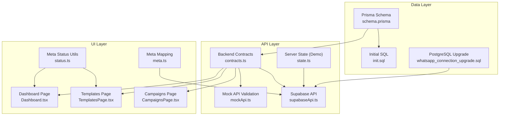
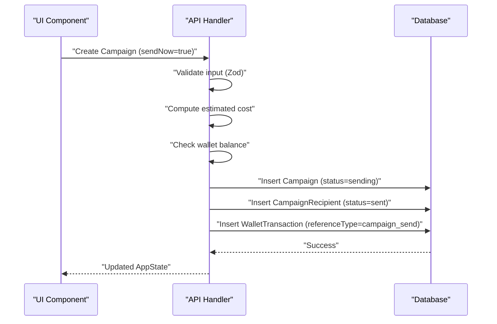
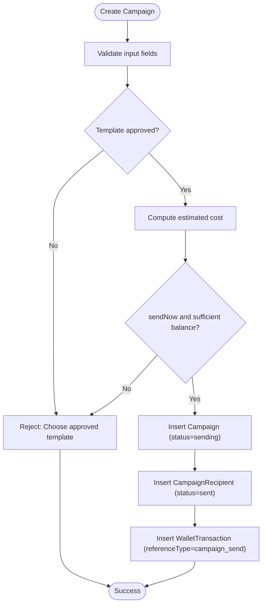
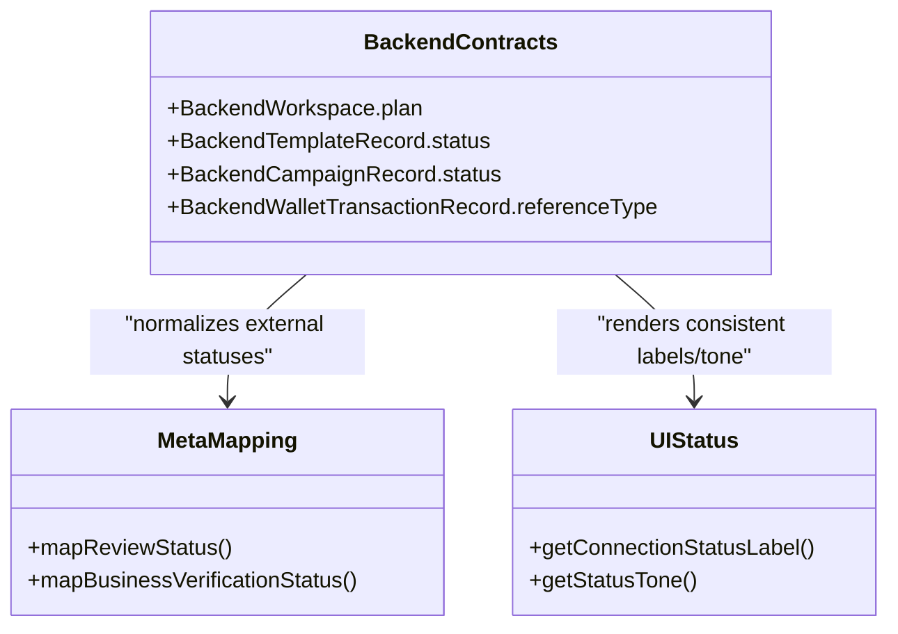
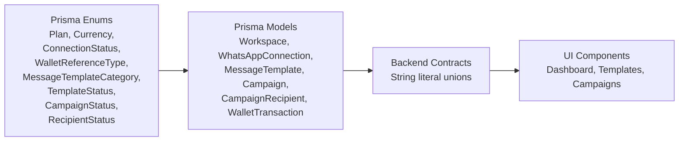

# Data Types & Enums

<cite>
**Referenced Files in This Document**
- [schema.prisma](file://prisma/schema.prisma)
- [init.sql](file://prisma/init.sql)
- [contracts.ts](file://src/lib/api/contracts.ts)
- [mockApi.ts](file://src/lib/api/mockApi.ts)
- [supabaseApi.ts](file://src/lib/api/supabaseApi.ts)
- [Dashboard.tsx](file://src/pages/Dashboard.tsx)
- [TemplatesPage.tsx](file://src/pages/TemplatesPage.tsx)
- [CampaignsPage.tsx](file://src/pages/CampaignsPage.tsx)
- [state.ts](file://server/state.ts)
- [status.ts](file://src/lib/meta/status.ts)
- [meta.ts](file://server/meta.ts)
- [whatsapp_connection_upgrade.sql](file://supabase/whatsapp_connection_upgrade.sql)
</cite>

## Table of Contents
1. [Introduction](#introduction)
2. [Project Structure](#project-structure)
3. [Core Components](#core-components)
4. [Architecture Overview](#architecture-overview)
5. [Detailed Component Analysis](#detailed-component-analysis)
6. [Dependency Analysis](#dependency-analysis)
7. [Performance Considerations](#performance-considerations)
8. [Troubleshooting Guide](#troubleshooting-guide)
9. [Conclusion](#conclusion)

## Introduction
This document describes WhatsAppFly’s data types and enumeration systems with a focus on custom data types, validation rules, and business constraints. It documents the enum definitions used across the system (Plan, Currency, ConnectionStatus, WalletReferenceType, MessageTemplateCategory, TemplateStatus, CampaignStatus, RecipientStatus) and explains their purpose, usage, validation rules, and business logic constraints. It also covers how these enums are enforced in database schemas, validated at the API boundary, transformed for UI presentation, and integrated into business operations such as campaign creation and wallet transactions.

## Project Structure
WhatsAppFly defines its domain enums and relations in the Prisma schema and initializes the underlying SQL tables accordingly. The frontend consumes backend contracts that map Prisma enums to string literal unions for type safety. Validation occurs at the API boundary using Zod schemas and runtime checks, and UI components render statuses with consistent labels and tones.

**Diagram sources**
- [schema.prisma:1-279](file://prisma/schema.prisma#L1-L279)
- [init.sql:1-137](file://prisma/init.sql#L1-L137)
- [contracts.ts:80-166](file://src/lib/api/contracts.ts#L80-L166)
- [mockApi.ts:430-486](file://src/lib/api/mockApi.ts#L430-L486)
- [supabaseApi.ts:835-891](file://src/lib/api/supabaseApi.ts#L835-L891)
- [state.ts:173-255](file://server/state.ts#L173-L255)
- [Dashboard.tsx:187-212](file://src/pages/Dashboard.tsx#L187-L212)
- [TemplatesPage.tsx:8-12](file://src/pages/TemplatesPage.tsx#L8-L12)
- [CampaignsPage.tsx:311-332](file://src/pages/CampaignsPage.tsx#L311-L332)
- [status.ts:1-85](file://src/lib/meta/status.ts#L1-L85)
- [meta.ts:29-45](file://server/meta.ts#L29-L45)
- [whatsapp_connection_upgrade.sql:1-32](file://supabase/whatsapp_connection_upgrade.sql#L1-L32)

**Section sources**
- [schema.prisma:1-279](file://prisma/schema.prisma#L1-L279)
- [init.sql:1-137](file://prisma/init.sql#L1-L137)
- [contracts.ts:80-166](file://src/lib/api/contracts.ts#L80-L166)

## Core Components
This section documents each enum and related data type, including defaults, validations, and business constraints.

- Plan (starter, growth, enterprise)
  - Purpose: Tiered subscription plans for workspaces.
  - Defaults: Defined at model level with a default value.
  - Validation: Enforced by Prisma and UI copy; no additional runtime validation observed for this enum.
  - Business constraints: Determines feature access and limits; surfaced in pricing UI.
  - Example usage: Workspace model references this enum; UI displays plan tiers.

- Currency (INR)
  - Purpose: Monetary unit for wallet balances and transactions.
  - Defaults: Defined at model level with a default value.
  - Validation: No numeric validation observed; treated as a string literal union in contracts.
  - Business constraints: Used consistently across wallet and campaign cost calculations.

- ConnectionStatus (pending, connected, disconnected)
  - Purpose: Operational state of a WhatsApp connection.
  - Defaults: Defined at model level with a default value.
  - Validation: UI maps to human-readable labels and status tones; Meta mapping normalizes external statuses.
  - Business constraints: Controls UI affordances and downstream operations.

- WalletReferenceType (manual_topup, campaign_send, adjustment)
  - Purpose: Categorizes wallet transactions.
  - Defaults: Not enforced at model level; constrained by contract types.
  - Validation: API routes and mock logic restrict allowed values.
  - Business constraints: Ensures transaction categorization for auditability and reporting.

- MessageTemplateCategory (marketing, utility)
  - Purpose: Template classification for approval workflows.
  - Defaults: Not enforced at model level; constrained by contract types.
  - Validation: UI filters approved templates; API requires approved templates for campaign send.
  - Business constraints: Template-first campaigns rely on approved templates.

- TemplateStatus (approved, pending, rejected)
  - Purpose: Approval lifecycle of message templates.
  - Defaults: Not enforced at model level; constrained by contract types.
  - Validation: UI renders status badges; API prevents sending with non-approved templates.
  - Business constraints: Governance of messaging content.

- CampaignStatus (draft, scheduled, sending, delivered)
  - Purpose: Lifecycle of a campaign execution.
  - Defaults: Not enforced at model level; constrained by contract types.
  - Validation: UI renders status with color coding; API sets status based on sendNow flag.
  - Business constraints: Wallet governance and spend controls depend on status transitions.

- RecipientStatus (queued, sent, delivered, failed)
  - Purpose: Per-contact delivery state within a campaign.
  - Defaults: Defined at model level with a default value.
  - Validation: API and UI track per-contact progression; failures trigger retries or alerts.
  - Business constraints: Delivery analytics and retry logic.

**Section sources**
- [schema.prisma:9-54](file://prisma/schema.prisma#L9-L54)
- [schema.prisma:90-108](file://prisma/schema.prisma#L90-L108)
- [schema.prisma:130-143](file://prisma/schema.prisma#L130-L143)
- [schema.prisma:170-182](file://prisma/schema.prisma#L170-L182)
- [schema.prisma:184-199](file://prisma/schema.prisma#L184-L199)
- [schema.prisma:201-212](file://prisma/schema.prisma#L201-L212)
- [schema.prisma:214-225](file://prisma/schema.prisma#L214-L225)
- [contracts.ts:80-166](file://src/lib/api/contracts.ts#L80-L166)
- [Dashboard.tsx:187-212](file://src/pages/Dashboard.tsx#L187-L212)
- [TemplatesPage.tsx:8-12](file://src/pages/TemplatesPage.tsx#L8-L12)
- [CampaignsPage.tsx:311-332](file://src/pages/CampaignsPage.tsx#L311-L332)
- [status.ts:1-85](file://src/lib/meta/status.ts#L1-L85)
- [meta.ts:29-45](file://server/meta.ts#L29-L45)

## Architecture Overview
The enum system spans three layers:
- Data layer: Prisma enums define canonical values and defaults.
- API layer: Zod schemas and runtime checks validate inputs; backend contracts map Prisma enums to frontend unions.
- UI layer: Components render statuses and enforce user-driven transitions.

**Diagram sources**
- [mockApi.ts:430-486](file://src/lib/api/mockApi.ts#L430-L486)
- [supabaseApi.ts:835-891](file://src/lib/api/supabaseApi.ts#L835-L891)
- [contracts.ts:145-166](file://src/lib/api/contracts.ts#L145-L166)
- [schema.prisma:184-225](file://prisma/schema.prisma#L184-L225)

## Detailed Component Analysis

### Enum Definitions and Defaults
- Plan and Currency defaults are set at the Prisma model level, ensuring consistent initialization.
- ConnectionStatus, TemplateStatus, CampaignStatus, and RecipientStatus defaults are explicitly set where applicable.
- WalletReferenceType lacks a model-level default; it is constrained via contract types and API logic.

**Section sources**
- [schema.prisma:93-94](file://prisma/schema.prisma#L93-L94)
- [schema.prisma:139](file://prisma/schema.prisma#L139)
- [schema.prisma:174-175](file://prisma/schema.prisma#L174-L175)
- [schema.prisma:189](file://prisma/schema.prisma#L189)
- [schema.prisma:206](file://prisma/schema.prisma#L206)
- [schema.prisma:220](file://prisma/schema.prisma#L220)

### Validation Rules and Business Constraints
- Template selection: Campaign creation requires an approved template; UI enforces this by filtering templates and disabling send actions for non-approved ones.
- Wallet governance: When launching a campaign immediately, the system validates sufficient balance before proceeding.
- Transaction categorization: Wallet transactions must use allowed reference types; API inserts restrict to known categories.

**Diagram sources**
- [mockApi.ts:430-486](file://src/lib/api/mockApi.ts#L430-L486)
- [supabaseApi.ts:835-891](file://src/lib/api/supabaseApi.ts#L835-L891)
- [contracts.ts:145-166](file://src/lib/api/contracts.ts#L145-L166)

**Section sources**
- [TemplatesPage.tsx:8-12](file://src/pages/TemplatesPage.tsx#L8-L12)
- [CampaignsPage.tsx:311-332](file://src/pages/CampaignsPage.tsx#L311-L332)
- [mockApi.ts:430-486](file://src/lib/api/mockApi.ts#L430-L486)
- [supabaseApi.ts:835-891](file://src/lib/api/supabaseApi.ts#L835-L891)

### Data Transformation and Consistency
- Contract types: Frontend receives backend records with enum values mapped to string literal unions, ensuring type-safe handling across boundaries.
- Meta integration: External statuses are normalized to internal enums for consistency (e.g., review and verification states).
- UI rendering: Status labels and tones are derived from enums for consistent user experience.

**Diagram sources**
- [contracts.ts:80-166](file://src/lib/api/contracts.ts#L80-L166)
- [meta.ts:29-45](file://server/meta.ts#L29-L45)
- [status.ts:1-85](file://src/lib/meta/status.ts#L1-L85)

**Section sources**
- [contracts.ts:80-166](file://src/lib/api/contracts.ts#L80-L166)
- [meta.ts:29-45](file://server/meta.ts#L29-L45)
- [status.ts:1-85](file://src/lib/meta/status.ts#L1-L85)

### Examples of Enum Usage in Queries and Operations
- Campaign creation:
  - Sets campaign status based on sendNow flag.
  - Inserts recipient records with initial status based on sendNow.
  - Creates wallet transaction with reference type indicating campaign send.
- Wallet transactions:
  - Reference type restricted to known categories.
  - Balance tracking ensures financial integrity.
- Template approvals:
  - UI filters templates by approved status.
  - API prevents sending with non-approved templates.

**Section sources**
- [mockApi.ts:430-486](file://src/lib/api/mockApi.ts#L430-L486)
- [supabaseApi.ts:835-891](file://src/lib/api/supabaseApi.ts#L835-L891)
- [state.ts:173-255](file://server/state.ts#L173-L255)
- [Dashboard.tsx:187-212](file://src/pages/Dashboard.tsx#L187-L212)
- [TemplatesPage.tsx:8-12](file://src/pages/TemplatesPage.tsx#L8-L12)

## Dependency Analysis
Enums propagate from the data layer to the API and UI layers. The following diagram shows how Prisma enums influence backend contracts and UI rendering.

**Diagram sources**
- [schema.prisma:9-54](file://prisma/schema.prisma#L9-L54)
- [schema.prisma:90-225](file://prisma/schema.prisma#L90-L225)
- [contracts.ts:80-166](file://src/lib/api/contracts.ts#L80-L166)
- [Dashboard.tsx:187-212](file://src/pages/Dashboard.tsx#L187-L212)
- [TemplatesPage.tsx:8-12](file://src/pages/TemplatesPage.tsx#L8-L12)
- [CampaignsPage.tsx:311-332](file://src/pages/CampaignsPage.tsx#L311-L332)

**Section sources**
- [schema.prisma:9-54](file://prisma/schema.prisma#L9-L54)
- [schema.prisma:90-225](file://prisma/schema.prisma#L90-L225)
- [contracts.ts:80-166](file://src/lib/api/contracts.ts#L80-L166)

## Performance Considerations
- Enum comparisons are O(1) and efficient; keep UI and API logic simple string comparisons for status rendering.
- Prefer pre-filtering approved templates in UI to avoid unnecessary API calls.
- Batch insertions for campaign recipients and wallet transactions improve throughput during high-volume sends.

## Troubleshooting Guide
- Template not approved: Ensure the chosen template has an approved status before attempting to send.
- Insufficient wallet balance: Verify balance before launching campaigns with immediate send enabled.
- Unexpected status transitions: Confirm that API logic sets status correctly based on sendNow flag and that UI reflects the latest state.

**Section sources**
- [TemplatesPage.tsx:8-12](file://src/pages/TemplatesPage.tsx#L8-L12)
- [mockApi.ts:430-486](file://src/lib/api/mockApi.ts#L430-L486)
- [supabaseApi.ts:835-891](file://src/lib/api/supabaseApi.ts#L835-L891)

## Conclusion
WhatsAppFly’s enum system provides strong data typing and business constraint enforcement across the stack. Prisma enums define canonical values and defaults, contracts ensure safe transport to the UI, and validation logic at the API boundary maintains data consistency. Together, these mechanisms support reliable campaign execution, wallet governance, and template approval workflows.