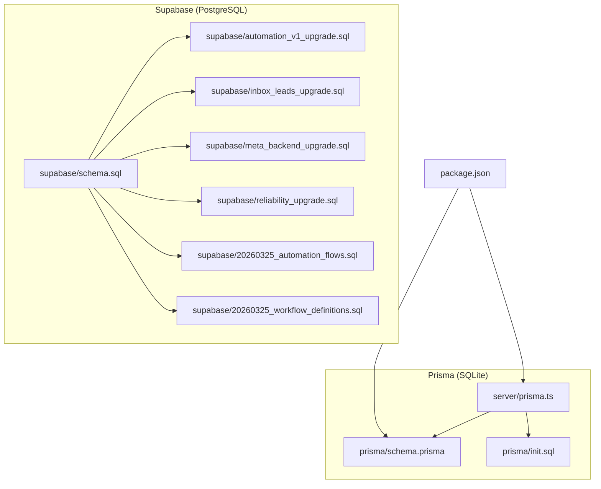
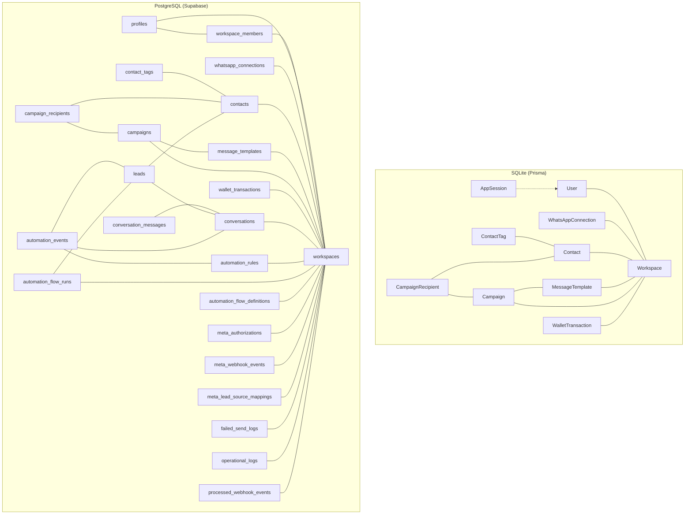
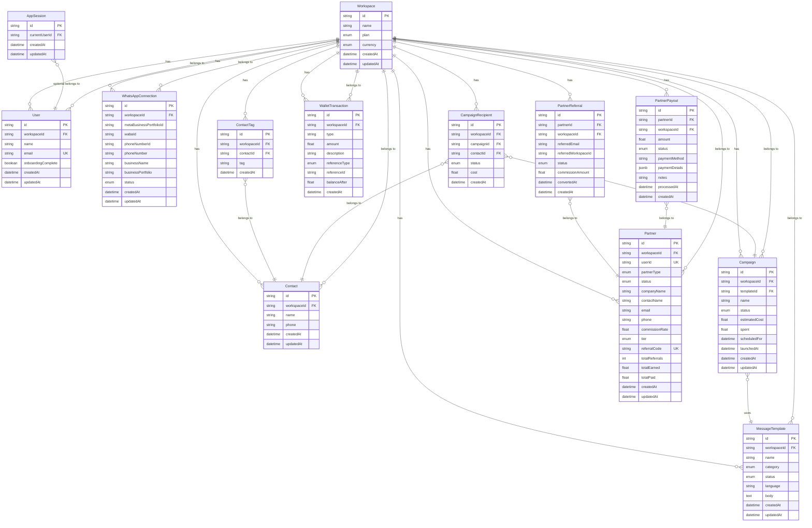
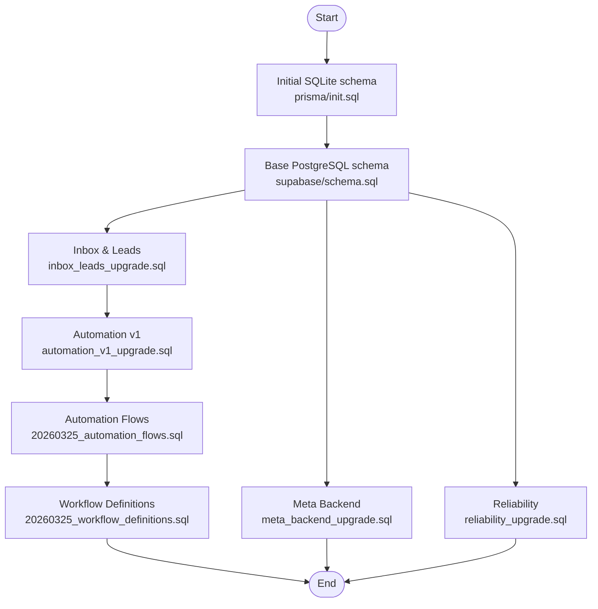
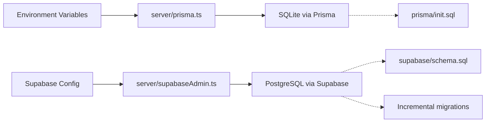

# Database Design

<cite>
**Referenced Files in This Document**
- [schema.prisma](file://prisma/schema.prisma)
- [init.sql](file://prisma/init.sql)
- [schema.sql](file://supabase/schema.sql)
- [automation_v1_upgrade.sql](file://supabase/automation_v1_upgrade.sql)
- [inbox_leads_upgrade.sql](file://supabase/inbox_leads_upgrade.sql)
- [meta_backend_upgrade.sql](file://supabase/meta_backend_upgrade.sql)
- [reliability_upgrade.sql](file://supabase/reliability_upgrade.sql)
- [20260325_automation_flows.sql](file://supabase/20260325_automation_flows.sql)
- [20260325_workflow_definitions.sql](file://supabase/20260325_workflow_definitions.sql)
- [prisma.ts](file://server/prisma.ts)
- [package.json](file://package.json)
</cite>

## Table of Contents
1. [Introduction](#introduction)
2. [Project Structure](#project-structure)
3. [Core Components](#core-components)
4. [Architecture Overview](#architecture-overview)
5. [Detailed Component Analysis](#detailed-component-analysis)
6. [Dependency Analysis](#dependency-analysis)
7. [Performance Considerations](#performance-considerations)
8. [Troubleshooting Guide](#troubleshooting-guide)
9. [Conclusion](#conclusion)
10. [Appendices](#appendices)

## Introduction
This document describes the database design for WhatsAppFly, focusing on the entity relationship model, field definitions, data types, constraints, and schema evolution. It covers two complementary data stores:
- SQLite via Prisma (local development and testing)
- PostgreSQL via Supabase (production-like schema and Row Level Security)

It documents the relationships among users, workspaces, contacts, leads, campaigns, messages, automation flows, and transactions, along with migration strategies, access control, and operational guidelines.

## Project Structure
The database design spans:
- Prisma schema and initial SQLite DDL
- Supabase PostgreSQL schema and migration scripts
- Server-side Prisma client configuration
- Package scripts for Prisma operations



**Diagram sources**
- [prisma/schema.prisma:1-279](file://prisma/schema.prisma#L1-L279)
- [prisma/init.sql:1-137](file://prisma/init.sql#L1-L137)
- [server/prisma.ts:1-14](file://server/prisma.ts#L1-L14)
- [supabase/schema.sql:1-517](file://supabase/schema.sql#L1-L517)
- [supabase/automation_v1_upgrade.sql:1-60](file://supabase/automation_v1_upgrade.sql#L1-L60)
- [supabase/inbox_leads_upgrade.sql:1-105](file://supabase/inbox_leads_upgrade.sql#L1-L105)
- [supabase/meta_backend_upgrade.sql:1-75](file://supabase/meta_backend_upgrade.sql#L1-L75)
- [supabase/reliability_upgrade.sql:1-53](file://supabase/reliability_upgrade.sql#L1-L53)
- [supabase/20260325_automation_flows.sql:1-32](file://supabase/20260325_automation_flows.sql#L1-L32)
- [supabase/20260325_workflow_definitions.sql:1-36](file://supabase/20260325_workflow_definitions.sql#L1-L36)
- [package.json:1-110](file://package.json#L1-L110)

**Section sources**
- [prisma/schema.prisma:1-279](file://prisma/schema.prisma#L1-L279)
- [prisma/init.sql:1-137](file://prisma/init.sql#L1-L137)
- [supabase/schema.sql:1-517](file://supabase/schema.sql#L1-L517)
- [package.json:1-110](file://package.json#L1-L110)

## Core Components
This section defines the core entities and their attributes, constraints, and relationships. It consolidates the Prisma and Supabase schemas to present a unified view.

- Workspace
  - Purpose: Tenant container for all resources.
  - Fields: id, name, plan, currency, timestamps.
  - Constraints: Primary key; plan defaults to starter; currency defaults to INR.
  - Relationships: One-to-many with users, connections, contacts, templates, campaigns, recipients, wallet transactions, partners, partner referrals, partner payouts.

- User
  - Purpose: Application users linked to a workspace.
  - Fields: id, workspaceId, name, email (unique), onboardingComplete, timestamps.
  - Constraints: Primary key; unique email; on_delete cascade to workspace.
  - Relationships: Belongs to Workspace; has sessions.

- AppSession
  - Purpose: Client session metadata.
  - Fields: id (fixed primary), currentUserId, timestamps.
  - Constraints: Primary key; on_delete set null to user.
  - Relationships: Optional relation to User.

- WhatsAppConnection
  - Purpose: Meta WhatsApp Business connection per workspace.
  - Fields: id, workspaceId, identifiers, business info, status, timestamps.
  - Constraints: Unique workspace; status enum; on_delete cascade.
  - Relationships: Belongs to Workspace.

- Contact
  - Purpose: Customer profile.
  - Fields: id, workspaceId, name, phone, timestamps.
  - Constraints: Unique workspace+phone; on_delete cascade.
  - Relationships: Many-to-many via ContactTag; many-to-many via CampaignRecipient.

- ContactTag
  - Purpose: Tagging mechanism for contacts.
  - Fields: id, workspaceId, contactId, tag, timestamps.
  - Constraints: Unique contact+tag; on_delete cascade.
  - Relationships: Belongs to Workspace and Contact.

- MessageTemplate
  - Purpose: Reusable message templates.
  - Fields: id, workspaceId, name, category, status, language, body, timestamps.
  - Constraints: on_delete cascade; restrict on template deletion from Campaign.
  - Relationships: Belongs to Workspace; referenced by Campaign.

- Campaign
  - Purpose: Mass messaging job.
  - Fields: id, workspaceId, templateId, name, status, estimatedCost, spent, scheduledFor, launchedAt, timestamps.
  - Constraints: on_delete cascade; restrict on template deletion; default status draft.
  - Relationships: Belongs to Workspace and MessageTemplate; has recipients.

- CampaignRecipient
  - Purpose: Per-contact delivery record.
  - Fields: id, workspaceId, campaignId, contactId, status, cost, timestamps.
  - Constraints: on_delete cascade; default queued.
  - Relationships: Belongs to Workspace, Campaign, Contact.

- WalletTransaction
  - Purpose: Financial ledger entries.
  - Fields: id, workspaceId, type, amount, description, referenceType, referenceId, balanceAfter, timestamps.
  - Constraints: on_delete cascade; referenceType enum-like values.
  - Relationships: Belongs to Workspace.

- Partner, PartnerReferral, PartnerPayout
  - Purpose: Partner program entities.
  - Fields and constraints: See dedicated section below.
  - Relationships: Partner has many referrals and payouts; belongs to Workspace.

- Conversations, ConversationMessages, Leads
  - Purpose: Inbox and lead management (PostgreSQL-only).
  - Fields and constraints: See dedicated section below.

- AutomationRules, AutomationEvents, AutomationFlowRuns, AutomationFlowDefinitions
  - Purpose: Advanced automation orchestration (PostgreSQL-only).
  - Fields and constraints: See dedicated section below.

- MetaAuthorizations, MetaWebhookEvents, MetaLeadSourceMappings
  - Purpose: Meta integration backend (PostgreSQL-only).
  - Fields and constraints: See dedicated section below.

- FailedSendLogs, OperationalLogs, ProcessedWebhookEvents
  - Purpose: Reliability and observability (PostgreSQL-only).
  - Fields and constraints: See dedicated section below.

**Section sources**
- [prisma/schema.prisma:90-279](file://prisma/schema.prisma#L90-L279)
- [supabase/schema.sql:19-284](file://supabase/schema.sql#L19-L284)

## Architecture Overview
The system uses dual datastores:
- SQLite via Prisma for local development and testing
- PostgreSQL via Supabase for production-like environments with Row Level Security (RLS)



**Diagram sources**
- [prisma/schema.prisma:90-279](file://prisma/schema.prisma#L90-L279)
- [supabase/schema.sql:19-284](file://supabase/schema.sql#L19-L284)

## Detailed Component Analysis

### Entity Relationship Model


**Diagram sources**
- [prisma/schema.prisma:90-279](file://prisma/schema.prisma#L90-L279)

### PostgreSQL Schema (Supabase) Entities
```mermaid
erDiagram
workspaces {
uuid id PK
text name
workspace_plan plan
text currency
timestamptz created_at
timestamptz updated_at
}
profiles {
uuid id PK
text full_name
text email UK
boolean onboarding_complete
timestamptz created_at
timestamptz updated_at
}
workspace_members {
uuid workspace_id FK
uuid user_id FK
text role
timestamptz created_at
PK workspace_id, user_id
}
whatsapp_connections {
uuid id PK
uuid workspace_id FK
text meta_business_id
text meta_business_portfolio_id
text waba_id
text phone_number_id
text display_phone_number
text verified_name
text business_name
text business_portfolio
connection_status status
business_verification_status business_verification_status
account_review_status account_review_status
oba_status oba_status
timestamptz created_at
timestamptz updated_at
}
contacts {
uuid id PK
uuid workspace_id FK
text name
text phone
timestamptz created_at
timestamptz updated_at
UK workspace_id, phone
}
contact_tags {
uuid id PK
uuid workspace_id FK
uuid contact_id FK
text tag
timestamptz created_at
UK contact_id, tag
}
message_templates {
uuid id PK
uuid workspace_id FK
text name
template_category category
template_status status
text language
text body
timestamptz created_at
timestamptz updated_at
}
campaigns {
uuid id PK
uuid workspace_id FK
uuid template_id FK
text name
campaign_status status
numeric estimated_cost
numeric spent
timestamptz scheduled_for
timestamptz launched_at
timestamptz created_at
timestamptz updated_at
}
campaign_recipients {
uuid id PK
uuid workspace_id FK
uuid campaign_id FK
uuid contact_id FK
recipient_status status
numeric cost
timestamptz created_at
}
wallet_transactions {
uuid id PK
uuid workspace_id FK
text type CK
numeric amount
text description
wallet_reference_type reference_type
uuid reference_id
numeric balance_after
timestamptz created_at
}
meta_authorizations {
uuid workspace_id PK
text access_token
text token_type
timestamptz expires_at
timestamptz created_at
timestamptz updated_at
}
meta_webhook_events {
uuid id PK
uuid workspace_id FK
text event_type
jsonb payload
timestamptz received_at
}
meta_lead_source_mappings {
uuid id PK
uuid workspace_id FK
text label
text page_id
text ad_id
text form_id
timestamptz created_at
timestamptz updated_at
}
conversations {
uuid id PK
uuid workspace_id FK
uuid contact_id FK
text phone
text display_name
conversation_status status
lead_source source
text assigned_to
text last_message_preview
timestamptz last_message_at
int unread_count
timestamptz created_at
timestamptz updated_at
}
conversation_messages {
uuid id PK
uuid workspace_id FK
uuid conversation_id FK
text meta_message_id
message_direction direction
text message_type
text body
text status
jsonb payload
timestamptz sent_at
timestamptz created_at
}
leads {
uuid id PK
uuid workspace_id FK
uuid contact_id FK
uuid conversation_id FK
text meta_lead_id UK
text full_name
text phone
text email
lead_status status
lead_source source
text source_label
text assigned_to
text notes
timestamptz created_at
timestamptz updated_at
}
automation_rules {
uuid id PK
uuid workspace_id FK
automation_rule_type rule_type
text name
boolean enabled
jsonb config
timestamptz created_at
timestamptz updated_at
UK workspace_id, rule_type
}
automation_events {
uuid id PK
uuid workspace_id FK
automation_rule_type rule_type
uuid conversation_id FK
uuid lead_id FK
text status
text summary
jsonb payload
timestamptz created_at
}
automation_flow_runs {
uuid id PK
uuid workspace_id FK
uuid lead_id FK
text status
int current_step
int retry_count
timestamptz scheduled_at
jsonb context
timestamptz created_at
timestamptz updated_at
}
automation_flow_definitions {
uuid id PK
uuid workspace_id FK
text name
text description
jsonb nodes
jsonb edges
boolean is_active
timestamptz created_at
timestamptz updated_at
}
failed_send_logs {
uuid id PK
uuid workspace_id FK
text channel CK
text target_type CK
uuid target_id
text destination
text template_name
text message_body
text error_message
text status CK
int retry_count
jsonb payload
timestamptz last_attempt_at
timestamptz resolved_at
timestamptz created_at
}
operational_logs {
uuid id PK
uuid workspace_id FK
text event_type
text level CK
text summary
jsonb payload
timestamptz created_at
}
processed_webhook_events {
uuid id PK
text fingerprint UK
text event_type
uuid workspace_id FK
timestamptz created_at
}
workspaces ||--o{ workspace_members : "has"
workspaces ||--o{ whatsapp_connections : "has"
workspaces ||--o{ contacts : "has"
workspaces ||--o{ contact_tags : "has"
workspaces ||--o{ message_templates : "has"
workspaces ||--o{ campaigns : "has"
workspaces ||--o{ campaign_recipients : "has"
workspaces ||--o{ wallet_transactions : "has"
workspaces ||--o{ meta_authorizations : "has"
workspaces ||--o{ meta_webhook_events : "has"
workspaces ||--o{ meta_lead_source_mappings : "has"
workspaces ||--o{ conversations : "has"
workspaces ||--o{ leads : "has"
workspaces ||--o{ automation_rules : "has"
workspaces ||--o{ automation_events : "has"
workspaces ||--o{ automation_flow_runs : "has"
workspaces ||--o{ automation_flow_definitions : "has"
workspaces ||--o{ failed_send_logs : "has"
workspaces ||--o{ operational_logs : "has"
workspaces ||--o{ processed_webhook_events : "has"
profiles ||--o{ workspace_members : "member of"
workspace_members ||--|| workspaces : "membership"
whatsapp_connections }o--|| workspaces : "belongs to"
contacts }o--|| workspaces : "belongs to"
contact_tags }o--|| contacts : "belongs to"
message_templates }o--|| workspaces : "belongs to"
campaigns }o--|| workspaces : "belongs to"
campaigns }o--|| message_templates : "uses"
campaign_recipients }o--|| campaigns : "belongs to"
campaign_recipients }o--|| contacts : "belongs to"
wallet_transactions }o--|| workspaces : "belongs to"
meta_authorizations }o--|| workspaces : "belongs to"
meta_webhook_events }o--|| workspaces : "belongs to"
meta_lead_source_mappings }o--|| workspaces : "belongs to"
conversations }o--|| workspaces : "belongs to"
conversations }o--|| contacts : "optional belongs to"
conversation_messages }o--|| conversations : "belongs to"
leads }o--|| workspaces : "belongs to"
leads }o--|| contacts : "optional belongs to"
leads }o--|| conversations : "optional belongs to"
automation_rules }o--|| workspaces : "belongs to"
automation_events }o--|| workspaces : "belongs to"
automation_events }o--|| automation_rules : "applies"
automation_events }o--|| conversations : "optional belongs to"
automation_events }o--|| leads : "optional belongs to"
automation_flow_runs }o--|| workspaces : "belongs to"
automation_flow_runs }o--|| leads : "tracked for"
automation_flow_definitions }o--|| workspaces : "belongs to"
failed_send_logs }o--|| workspaces : "belongs to"
operational_logs }o--|| workspaces : "belongs to"
processed_webhook_events }o--|| workspaces : "belongs to"
```

**Diagram sources**
- [supabase/schema.sql:19-284](file://supabase/schema.sql#L19-L284)

### Data Types and Constraints
- SQLite (Prisma)
  - Strings: Text fields for identifiers and names.
  - Numbers: Real for floats; integers for counts.
  - Enums: Defined via Prisma enums mapped to text.
  - Dates: DateTime with default now() for timestamps.
  - Unique indexes: Email uniqueness, workspace+phone, contact+tag.
  - Foreign keys: Cascading deletes where appropriate; restrict on template deletion.

- PostgreSQL (Supabase)
  - UUID primary keys for most entities.
  - Enum types created as PostgreSQL enums.
  - Numeric precision for financial amounts.
  - JSONB for flexible payloads.
  - Unique constraints and checks for controlled values.
  - Row Level Security enabled on all tables.

**Section sources**
- [prisma/schema.prisma:1-279](file://prisma/schema.prisma#L1-L279)
- [prisma/init.sql:1-137](file://prisma/init.sql#L1-L137)
- [supabase/schema.sql:1-517](file://supabase/schema.sql#L1-L517)

### Data Validation Rules and Business Logic
- Workspace plan and currency defaults enforced at creation.
- Campaign status transitions constrained; template deletion restricted while referenced.
- Contact uniqueness enforced per workspace.
- Wallet transaction type constrained to credit/debit.
- Automation rule uniqueness per workspace+rule_type.
- Lead and conversation statuses use enums; message direction and channel checks.
- Meta authorization tokens stored securely; webhook events persisted with deduplication fingerprint.

**Section sources**
- [prisma/schema.prisma:190-225](file://prisma/schema.prisma#L190-L225)
- [supabase/schema.sql:95-129](file://supabase/schema.sql#L95-L129)
- [supabase/automation_v1_upgrade.sql:8-30](file://supabase/automation_v1_upgrade.sql#L8-L30)
- [supabase/inbox_leads_upgrade.sql:17-63](file://supabase/inbox_leads_upgrade.sql#L17-L63)
- [supabase/meta_backend_upgrade.sql:4-30](file://supabase/meta_backend_upgrade.sql#L4-L30)
- [supabase/reliability_upgrade.sql:1-27](file://supabase/reliability_upgrade.sql#L1-L27)

### Referential Integrity
- SQLite: Foreign keys defined in DDL with cascades and restricts.
- PostgreSQL: Foreign keys with on_delete cascade or set null where appropriate; RLS policies enforce workspace scoping.

**Section sources**
- [prisma/init.sql:12-126](file://prisma/init.sql#L12-L126)
- [supabase/schema.sql:45-139](file://supabase/schema.sql#L45-L139)

### Schema Evolution and Migration Strategies
- Initial SQLite schema generated from Prisma.
- PostgreSQL schema evolves through incremental migrations:
  - Inbox and leads: introduces conversations, messages, leads.
  - Automation v1: rules and events.
  - Automation flows: run tracking and definitions.
  - Meta backend: authorizations, webhooks, lead source mappings.
  - Reliability: send logs, operational logs, processed webhook events.
- Migrations use conditional existence checks to avoid redefinition errors.
- RLS policies and triggers are applied per migration.



**Diagram sources**
- [prisma/init.sql:1-137](file://prisma/init.sql#L1-L137)
- [supabase/schema.sql:1-517](file://supabase/schema.sql#L1-L517)
- [supabase/inbox_leads_upgrade.sql:1-105](file://supabase/inbox_leads_upgrade.sql#L1-L105)
- [supabase/automation_v1_upgrade.sql:1-60](file://supabase/automation_v1_upgrade.sql#L1-L60)
- [supabase/20260325_automation_flows.sql:1-32](file://supabase/20260325_automation_flows.sql#L1-L32)
- [supabase/20260325_workflow_definitions.sql:1-36](file://supabase/20260325_workflow_definitions.sql#L1-L36)
- [supabase/meta_backend_upgrade.sql:1-75](file://supabase/meta_backend_upgrade.sql#L1-L75)
- [supabase/reliability_upgrade.sql:1-53](file://supabase/reliability_upgrade.sql#L1-L53)

**Section sources**
- [prisma/init.sql:1-137](file://prisma/init.sql#L1-L137)
- [supabase/schema.sql:1-517](file://supabase/schema.sql#L1-L517)
- [supabase/inbox_leads_upgrade.sql:1-105](file://supabase/inbox_leads_upgrade.sql#L1-L105)
- [supabase/automation_v1_upgrade.sql:1-60](file://supabase/automation_v1_upgrade.sql#L1-L60)
- [supabase/20260325_automation_flows.sql:1-32](file://supabase/20260325_automation_flows.sql#L1-L32)
- [supabase/20260325_workflow_definitions.sql:1-36](file://supabase/20260325_workflow_definitions.sql#L1-L36)
- [supabase/meta_backend_upgrade.sql:1-75](file://supabase/meta_backend_upgrade.sql#L1-L75)
- [supabase/reliability_upgrade.sql:1-53](file://supabase/reliability_upgrade.sql#L1-L53)

### Data Access Patterns, Query Optimization, and Caching
- Access patterns
  - Workspace-scoped queries using current workspace resolution.
  - Junction tables for many-to-many relationships (ContactTag, CampaignRecipient).
  - Enum-filtered queries for status and type fields.
- Optimization
  - Unique composite indexes on workspace+phone and contact+tag.
  - Additional indexes in flows migration for scheduler efficiency.
  - JSONB fields for flexible payloads; consider selective indexing if queries become frequent.
- Caching
  - No explicit caching layer defined in the schema; consider application-level caching for frequently accessed templates and rules.

**Section sources**
- [supabase/schema.sql:64-81](file://supabase/schema.sql#L64-L81)
- [supabase/20260325_automation_flows.sql:17-18](file://supabase/20260325_automation_flows.sql#L17-L18)

### Data Lifecycle Policies
- Retention and archival
  - No explicit retention or archival policies defined in the schema.
- Deletion rules
  - Cascading deletes on workspace and related entities.
  - Set null on optional foreign keys (e.g., contact_id in leads/conversations).
- Operational logs
  - Operational logs and processed webhook events are kept with timestamps; no automated purge logic present.

**Section sources**
- [prisma/init.sql:12-126](file://prisma/init.sql#L12-L126)
- [supabase/schema.sql:19-284](file://supabase/schema.sql#L19-L284)
- [supabase/reliability_upgrade.sql:1-27](file://supabase/reliability_upgrade.sql#L1-L27)

### Data Security, Privacy Compliance, and Access Control
- Row Level Security (RLS)
  - All tables enabled with RLS.
  - Policies scoped to current workspace derived from the authenticated user.
- Authentication and authorization
  - Supabase auth integration; admin client configured for service role operations.
  - Workspace membership validated via workspace_members lookup.
- Meta integrations
  - Tokens and sensitive payloads stored in dedicated tables; access controlled by policies.

**Section sources**
- [supabase/schema.sql:402-517](file://supabase/schema.sql#L402-L517)
- [server/supabaseAdmin.ts:1-50](file://server/supabaseAdmin.ts#L1-L50)

### Sample Data Structures
- Workspace
  - id: identifier
  - name: tenant name
  - plan: starter/growth/enterprise
  - currency: INR
  - timestamps: created_at, updated_at
- User
  - id: identifier
  - workspaceId: FK
  - name: full name
  - email: unique
  - onboardingComplete: boolean
  - timestamps: created_at, updated_at
- Contact
  - id: identifier
  - workspaceId: FK
  - name: full name
  - phone: E164 or normalized
  - timestamps: created_at, updated_at
- MessageTemplate
  - id: identifier
  - workspaceId: FK
  - name: template name
  - category: marketing/utility
  - status: approved/pending/rejected
  - language: ISO code
  - body: template text
  - timestamps: created_at, updated_at
- Campaign
  - id: identifier
  - workspaceId: FK
  - templateId: FK
  - name: campaign name
  - status: draft/scheduled/sending/delivered
  - estimatedCost: numeric
  - spent: numeric
  - scheduledFor/launchedAt: timestamps
  - timestamps: created_at, updated_at
- CampaignRecipient
  - id: identifier
  - workspaceId: FK
  - campaignId: FK
  - contactId: FK
  - status: queued/sent/delivered/failed
  - cost: numeric
  - timestamps: created_at
- WalletTransaction
  - id: identifier
  - workspaceId: FK
  - type: credit/debit
  - amount: numeric
  - description: text
  - referenceType: manual_topup/campaign_send/adjustment
  - referenceId: identifier
  - balanceAfter: numeric
  - timestamps: created_at
- Partner
  - id: identifier
  - workspaceId: FK
  - userId: unique
  - partnerType: affiliate/reseller/white_label/api_integration
  - status: pending/approved/rejected/suspended
  - contactName/email/phone: contact info
  - commissionRate: numeric
  - tier: standard/silver/gold/platinum
  - referralCode: unique
  - timestamps: created_at, updated_at
- PartnerReferral
  - id: identifier
  - partnerId: FK
  - workspaceId: FK
  - referredEmail: text
  - referredWorkspaceId: FK
  - status: pending/converted/expired
  - commissionAmount: numeric
  - convertedAt: timestamp
  - timestamps: created_at
- PartnerPayout
  - id: identifier
  - partnerId: FK
  - workspaceId: FK
  - amount: numeric
  - status: pending/processing/completed/failed
  - paymentMethod/paymentDetails/notes: text/jsonb
  - processedAt: timestamp
  - timestamps: created_at
- Conversations
  - id: identifier
  - workspaceId: FK
  - contactId: FK
  - phone/display_name/status/source/assigned_to/last_message_preview/last_message_at/unread_count: fields
  - timestamps: created_at, updated_at
- ConversationMessages
  - id: identifier
  - workspaceId: FK
  - conversationId: FK
  - meta_message_id/direction/message_type/body/status/payload/sent_at: fields
  - timestamps: created_at
- Leads
  - id: identifier
  - workspaceId: FK
  - contactId: FK
  - conversationId: FK
  - meta_lead_id: unique
  - full_name/phone/email/status/source/source_label/assigned_to/notes: fields
  - timestamps: created_at, updated_at
- AutomationRules
  - id: identifier
  - workspaceId: FK
  - rule_type: enum
  - name/enabled/config: fields
  - timestamps: created_at, updated_at
- AutomationEvents
  - id: identifier
  - workspaceId: FK
  - rule_type: enum
  - conversationId/leadId/status/summary/payload: fields
  - timestamps: created_at
- AutomationFlowRuns
  - id: identifier
  - workspaceId: FK
  - leadId: FK
  - status/current_step/retry_count/scheduled_at/context: fields
  - timestamps: created_at, updated_at
- AutomationFlowDefinitions
  - id: identifier
  - workspaceId: FK
  - name/description/nodes/edges/is_active: fields
  - timestamps: created_at, updated_at
- MetaAuthorizations
  - workspace_id: PK
  - access_token/token_type/expires_at: fields
  - timestamps: created_at, updated_at
- MetaWebhookEvents
  - id: identifier
  - workspace_id: FK
  - event_type/payload/received_at: fields
- MetaLeadSourceMappings
  - id: identifier
  - workspace_id: FK
  - label/page_id/ad_id/form_id: fields
  - timestamps: created_at, updated_at
- FailedSendLogs
  - id: identifier
  - workspace_id: FK
  - channel/target_type/target_id/destination/template_name/message_body/error_message/status/retry_count/payload/last_attempt_at/resolved_at: fields
  - timestamps: created_at
- OperationalLogs
  - id: identifier
  - workspace_id: FK
  - event_type/level/summary/payload: fields
  - timestamps: created_at
- ProcessedWebhookEvents
  - id: identifier
  - fingerprint: unique
  - event_type/workspace_id: fields
  - timestamps: created_at

**Section sources**
- [prisma/schema.prisma:90-279](file://prisma/schema.prisma#L90-L279)
- [supabase/schema.sql:19-284](file://supabase/schema.sql#L19-L284)

### Migration Scripts and Administration Procedures
- Prisma operations
  - Generate client: package script invokes Prisma generate.
  - Push schema: package script invokes Prisma db push.
- Supabase migrations
  - Apply schema.sql to establish base tables and enums.
  - Apply incremental upgrades in order: inbox_leads, automation_v1, automation_flows, workflow_definitions, meta_backend, reliability.
- Administration
  - Use Supabase admin client for privileged operations.
  - Verify workspace membership via workspace_members for secure access.

**Section sources**
- [package.json:17-18](file://package.json#L17-L18)
- [supabase/schema.sql:1-517](file://supabase/schema.sql#L1-L517)
- [supabase/inbox_leads_upgrade.sql:1-105](file://supabase/inbox_leads_upgrade.sql#L1-L105)
- [supabase/automation_v1_upgrade.sql:1-60](file://supabase/automation_v1_upgrade.sql#L1-L60)
- [supabase/20260325_automation_flows.sql:1-32](file://supabase/20260325_automation_flows.sql#L1-L32)
- [supabase/20260325_workflow_definitions.sql:1-36](file://supabase/20260325_workflow_definitions.sql#L1-L36)
- [supabase/meta_backend_upgrade.sql:1-75](file://supabase/meta_backend_upgrade.sql#L1-L75)
- [supabase/reliability_upgrade.sql:1-53](file://supabase/reliability_upgrade.sql#L1-L53)
- [server/supabaseAdmin.ts:1-50](file://server/supabaseAdmin.ts#L1-L50)

## Dependency Analysis
- Prisma client depends on DATABASE_URL and uses better-sqlite3 adapter.
- Supabase relies on environment variables for admin client initialization.
- Migrations depend on PostgreSQL enums and RLS policies.



**Diagram sources**
- [server/prisma.ts:1-14](file://server/prisma.ts#L1-L14)
- [server/supabaseAdmin.ts:1-50](file://server/supabaseAdmin.ts#L1-L50)
- [prisma/init.sql:1-137](file://prisma/init.sql#L1-L137)
- [supabase/schema.sql:1-517](file://supabase/schema.sql#L1-L517)

**Section sources**
- [server/prisma.ts:1-14](file://server/prisma.ts#L1-L14)
- [server/supabaseAdmin.ts:1-50](file://server/supabaseAdmin.ts#L1-L50)
- [prisma/init.sql:1-137](file://prisma/init.sql#L1-L137)
- [supabase/schema.sql:1-517](file://supabase/schema.sql#L1-L517)

## Performance Considerations
- Indexes
  - Composite unique indexes on workspace+phone and contact+tag.
  - Scheduler index on automation_flow_runs.scheduled_at for sweep efficiency.
- Data types
  - Numeric with fixed precision for financial fields.
  - JSONB for flexible payloads; consider normalization if query volume increases.
- RLS overhead
  - Enabling RLS adds policy evaluation; ensure policies are minimal and efficient.

[No sources needed since this section provides general guidance]

## Troubleshooting Guide
- Prisma client initialization
  - Ensure DATABASE_URL is set; otherwise, client creation fails.
- Supabase admin client
  - Verify VITE_SUPABASE_URL and SUPABASE_SERVICE_ROLE_KEY; missing values cause configuration errors.
- Workspace membership
  - If no workspace membership is found for a user, operations requiring current workspace will fail.
- Migration conflicts
  - Run migrations in order; conditional checks prevent redefinition errors but ordering still matters.

**Section sources**
- [server/prisma.ts:7-9](file://server/prisma.ts#L7-L9)
- [server/supabaseAdmin.ts:3-9](file://server/supabaseAdmin.ts#L3-L9)
- [server/supabaseAdmin.ts:19-49](file://server/supabaseAdmin.ts#L19-L49)

## Conclusion
WhatsAppFly’s database design combines a compact SQLite schema for development with a robust PostgreSQL schema for production, including RLS, enums, and structured migrations. The entity model supports core workflows: workspace tenants, users, contacts, campaigns, messaging, leads, automation, and financial transactions. Migrations evolve the schema incrementally, and RLS ensures workspace-scoped access. For production readiness, consider adding retention and archival policies, and evaluate caching strategies for high-frequency reads.

[No sources needed since this section summarizes without analyzing specific files]

## Appendices
- Backward compatibility
  - Migrations use conditional checks to avoid breaking existing deployments.
- Version management
  - Prisma schema and PostgreSQL migrations track schema evolution; keep them synchronized with application logic.

[No sources needed since this section provides general guidance]