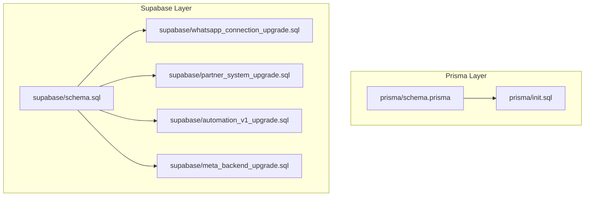
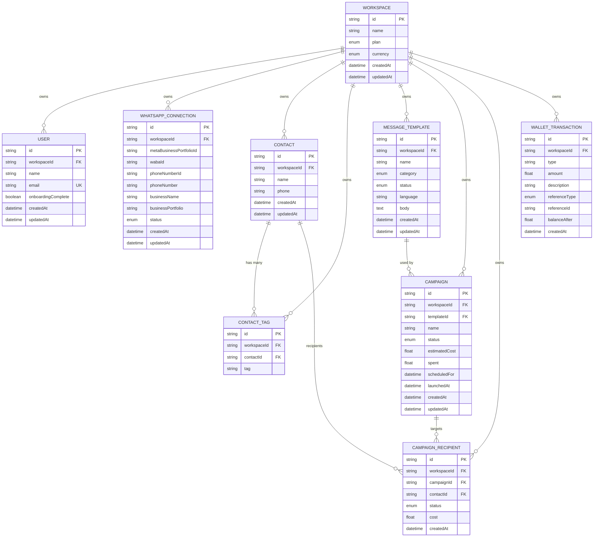
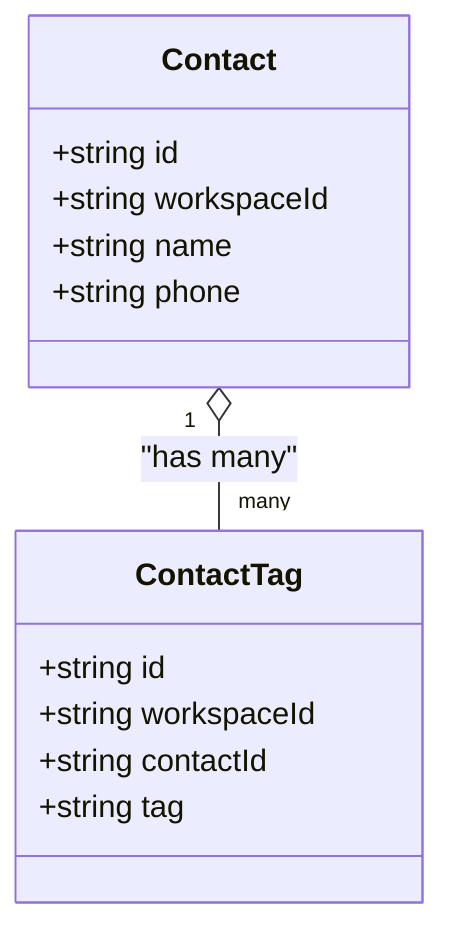
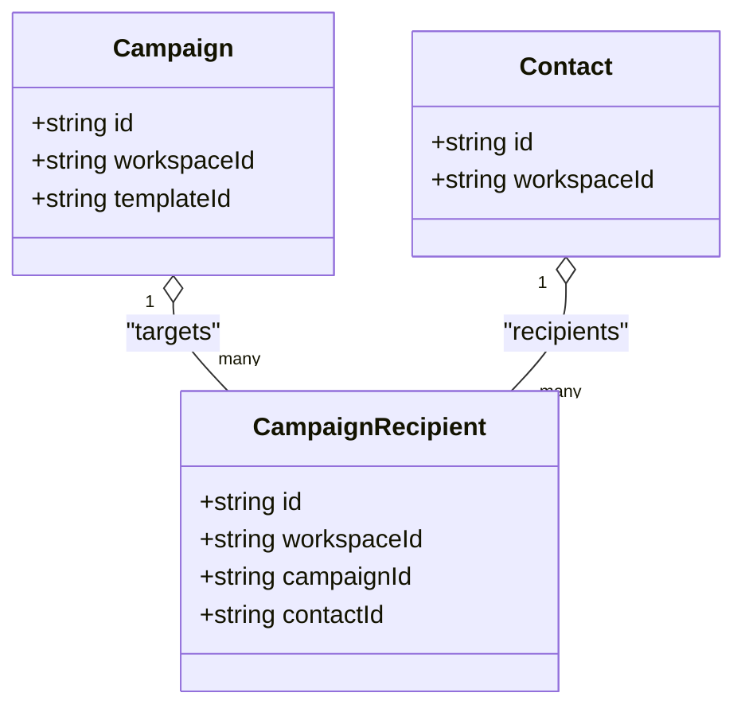
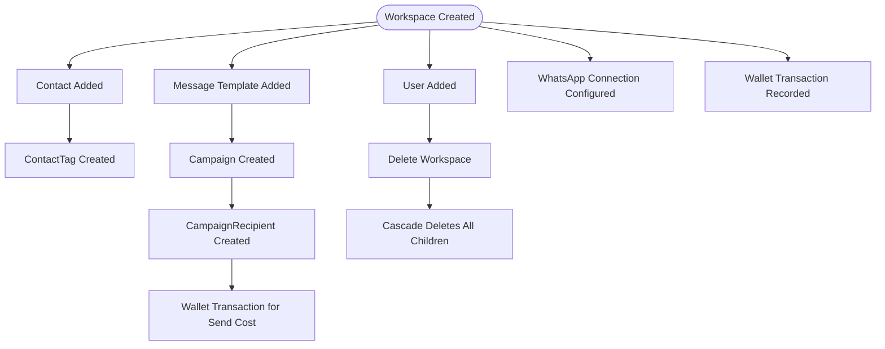
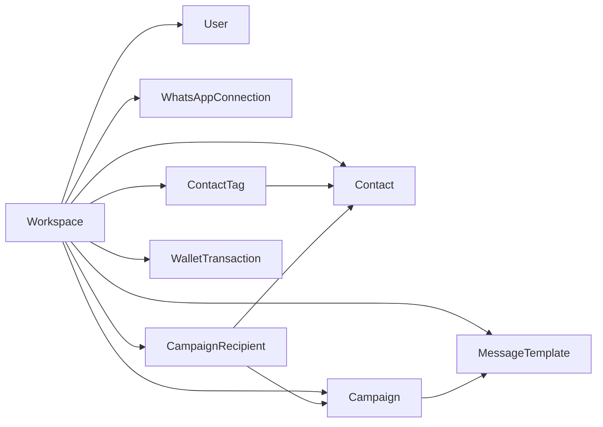

# Entity Relationships

<cite>
**Referenced Files in This Document**
- [schema.prisma](file://prisma/schema.prisma)
- [init.sql](file://prisma/init.sql)
- [schema.sql](file://supabase/schema.sql)
- [whatsapp_connection_upgrade.sql](file://supabase/whatsapp_connection_upgrade.sql)
- [partner_system_upgrade.sql](file://supabase/partner_system_upgrade.sql)
- [automation_v1_upgrade.sql](file://supabase/automation_v1_upgrade.sql)
- [meta_backend_upgrade.sql](file://supabase/meta_backend_upgrade.sql)
- [prisma.ts](file://server/prisma.ts)
- [supabaseApi.ts](file://src/lib/api/supabaseApi.ts)
</cite>

## Table of Contents
1. [Introduction](#introduction)
2. [Project Structure](#project-structure)
3. [Core Components](#core-components)
4. [Architecture Overview](#architecture-overview)
5. [Detailed Component Analysis](#detailed-component-analysis)
6. [Dependency Analysis](#dependency-analysis)
7. [Performance Considerations](#performance-considerations)
8. [Troubleshooting Guide](#troubleshooting-guide)
9. [Conclusion](#conclusion)

## Introduction
This document describes the entity relationship model for WhatsAppFly’s data layer with a focus on table relationships, foreign key constraints, referential integrity, and many-to-many associations. It covers the core entities Workspace, User, WhatsAppConnection, Contact, ContactTag, MessageTemplate, Campaign, CampaignRecipient, and WalletTransaction. It explains primary keys, cascading delete behaviors, unique constraints, cardinalities, ownership patterns, and how these relationships support the application’s business logic around WhatsApp Business messaging, contact management, templated campaigns, and wallet accounting.

## Project Structure
The data model is defined in two complementary layers:
- Prisma schema for SQLite development and migrations
- Supabase Postgres schema for production

Key files:
- Prisma schema defines models, enums, relations, and constraints
- Supabase schema defines tables, enums, indexes, and row-level security policies
- Upgrade scripts evolve the schema over time

**Diagram sources**
- [schema.prisma:1-279](file://prisma/schema.prisma#L1-L279)
- [init.sql:1-137](file://prisma/init.sql#L1-L137)
- [schema.sql:1-517](file://supabase/schema.sql#L1-L517)
- [whatsapp_connection_upgrade.sql:1-33](file://supabase/whatsapp_connection_upgrade.sql#L1-L33)
- [partner_system_upgrade.sql:1-98](file://supabase/partner_system_upgrade.sql#L1-L98)
- [automation_v1_upgrade.sql:1-60](file://supabase/automation_v1_upgrade.sql#L1-L60)
- [meta_backend_upgrade.sql:1-75](file://supabase/meta_backend_upgrade.sql#L1-L75)

**Section sources**
- [schema.prisma:1-279](file://prisma/schema.prisma#L1-L279)
- [init.sql:1-137](file://prisma/init.sql#L1-L137)
- [schema.sql:1-517](file://supabase/schema.sql#L1-L517)

## Core Components
This section documents each entity with primary keys, foreign keys, unique constraints, and referential actions.

- Workspace
  - Primary key: id
  - Ownership: parent of Users, WhatsAppConnections, Contacts, ContactTags, MessageTemplates, Campaigns, CampaignRecipients, WalletTransactions
  - Unique constraints: none
  - Cascades: children deleted on workspace deletion

- User
  - Primary key: id
  - Foreign key: workspaceId → Workspace(id)
  - Unique constraint: email
  - Referential action: onDelete Cascade

- WhatsAppConnection
  - Primary key: id
  - Foreign key: workspaceId → Workspace(id)
  - Unique constraint: workspaceId (unique per workspace)
  - Referential action: onDelete Cascade

- Contact
  - Primary key: id
  - Foreign key: workspaceId → Workspace(id)
  - Unique constraint: (workspaceId, phone)
  - Referential action: onDelete Cascade

- ContactTag (many-to-many bridge)
  - Primary key: id
  - Foreign keys: contactId → Contact(id), workspaceId → Workspace(id)
  - Unique constraint: (contactId, tag)
  - Referential actions: onDelete Cascade for both

- MessageTemplate
  - Primary key: id
  - Foreign key: workspaceId → Workspace(id)
  - Referential action: onDelete Cascade

- Campaign
  - Primary key: id
  - Foreign keys: workspaceId → Workspace(id), templateId → MessageTemplate(id)
  - Referential actions: onDelete Cascade for workspace; onDelete Restrict for template
  - Unique constraints: none

- CampaignRecipient (many-to-many bridge)
  - Primary key: id
  - Foreign keys: campaignId → Campaign(id), contactId → Contact(id), workspaceId → Workspace(id)
  - Referential actions: onDelete Cascade for all

- WalletTransaction
  - Primary key: id
  - Foreign key: workspaceId → Workspace(id)
  - Referential action: onDelete Cascade

Notes:
- Prisma schema enforces relations and onDelete behaviors.
- Supabase schema enforces foreign keys, unique indexes, and row-level security policies.

**Section sources**
- [schema.prisma:90-225](file://prisma/schema.prisma#L90-L225)
- [init.sql:1-137](file://prisma/init.sql#L1-L137)
- [schema.sql:19-129](file://supabase/schema.sql#L19-L129)

## Architecture Overview
The data model centers on Workspace as the tenant root. Entities under Workspace own child entities and enforce cascading deletes. Many-to-many relationships are modeled via explicit junction tables (ContactTag and CampaignRecipient). Referential integrity is enforced at the database level with foreign keys and unique indexes.

**Diagram sources**
- [schema.prisma:90-225](file://prisma/schema.prisma#L90-L225)
- [init.sql:1-137](file://prisma/init.sql#L1-L137)
- [schema.sql:19-129](file://supabase/schema.sql#L19-L129)

## Detailed Component Analysis

### Workspace
- Ownership: All listed entities belong to a Workspace.
- Cascading: Deleting a Workspace deletes all owned entities.
- Purpose: Tenant isolation and multi-tenant billing.

**Section sources**
- [schema.prisma:90-108](file://prisma/schema.prisma#L90-L108)
- [schema.sql:19-26](file://supabase/schema.sql#L19-L26)

### User
- Unique constraint: email is unique.
- Relation: belongs to Workspace via workspaceId.
- Behavior: onDelete Cascade ensures user removal when workspace is deleted.

**Section sources**
- [schema.prisma:110-120](file://prisma/schema.prisma#L110-L120)
- [init.sql:11-21](file://prisma/init.sql#L11-L21)
- [schema.sql:28-35](file://supabase/schema.sql#L28-L35)

### WhatsAppConnection
- Unique constraint: workspaceId is unique (one connection per workspace).
- Relation: belongs to Workspace via workspaceId.
- Behavior: onDelete Cascade.

**Section sources**
- [schema.prisma:130-143](file://prisma/schema.prisma#L130-L143)
- [init.sql:32-46](file://prisma/init.sql#L32-L46)
- [schema.sql:45-62](file://supabase/schema.sql#L45-L62)
- [whatsapp_connection_upgrade.sql:22-28](file://supabase/whatsapp_connection_upgrade.sql#L22-L28)

### Contact
- Unique constraint: (workspaceId, phone) prevents duplicates per workspace.
- Relation: belongs to Workspace via workspaceId.
- Behavior: onDelete Cascade.

**Section sources**
- [schema.prisma:145-157](file://prisma/schema.prisma#L145-L157)
- [init.sql:48-57](file://prisma/init.sql#L48-L57)
- [schema.sql:64-72](file://supabase/schema.sql#L64-L72)

### ContactTag (Many-to-Many: Contact ↔ Tag)
- Junction table linking Contact to tags.
- Unique constraint: (contactId, tag) ensures a tag appears once per contact.
- Relations: belongs to Workspace and Contact.
- Behavior: onDelete Cascade for both workspace and contact.

**Diagram sources**
- [schema.prisma:159-168](file://prisma/schema.prisma#L159-L168)
- [init.sql:59-67](file://prisma/init.sql#L59-L67)
- [schema.sql:74-81](file://supabase/schema.sql#L74-L81)

**Section sources**
- [schema.prisma:159-168](file://prisma/schema.prisma#L159-L168)
- [init.sql:59-67](file://prisma/init.sql#L59-L67)
- [schema.sql:74-81](file://supabase/schema.sql#L74-L81)

### MessageTemplate
- Relation: belongs to Workspace via workspaceId.
- Behavior: onDelete Cascade.

**Section sources**
- [schema.prisma:170-182](file://prisma/schema.prisma#L170-L182)
- [init.sql:69-81](file://prisma/init.sql#L69-L81)
- [schema.sql:83-93](file://supabase/schema.sql#L83-L93)

### Campaign
- Relation: belongs to Workspace via workspaceId; references MessageTemplate via templateId.
- Behavior: onDelete Cascade for workspace; onDelete Restrict for template to prevent orphaning campaigns without a template.

**Section sources**
- [schema.prisma:184-199](file://prisma/schema.prisma#L184-L199)
- [init.sql:83-98](file://prisma/init.sql#L83-L98)
- [schema.sql:95-107](file://supabase/schema.sql#L95-L107)

### CampaignRecipient (Many-to-Many: Campaign ↔ Contact)
- Junction table linking Campaign to Contact.
- Relations: belongs to Workspace, Campaign, and Contact.
- Behavior: onDelete Cascade for all.

**Diagram sources**
- [schema.prisma:201-212](file://prisma/schema.prisma#L201-L212)
- [init.sql:100-112](file://prisma/init.sql#L100-L112)
- [schema.sql:109-117](file://supabase/schema.sql#L109-L117)

**Section sources**
- [schema.prisma:201-212](file://prisma/schema.prisma#L201-L212)
- [init.sql:100-112](file://prisma/init.sql#L100-L112)
- [schema.sql:109-117](file://supabase/schema.sql#L109-L117)

### WalletTransaction
- Relation: belongs to Workspace via workspaceId.
- Behavior: onDelete Cascade.

**Section sources**
- [schema.prisma:214-225](file://prisma/schema.prisma#L214-L225)
- [init.sql:114-126](file://prisma/init.sql#L114-L126)
- [schema.sql:119-129](file://supabase/schema.sql#L119-L129)

### Conceptual Overview
The relationships support:
- Multi-tenant isolation via Workspace
- Contact tagging for segmentation
- Template-driven campaigns with per-contact delivery tracking
- Wallet accounting with reference types and balances

[No sources needed since this diagram shows conceptual workflow, not actual code structure]

## Dependency Analysis
- Workspace is the root entity; all others depend on it.
- Many-to-many relationships are explicit via junction tables with unique composite keys.
- Referential integrity is enforced by foreign keys and unique indexes.
- Row-level security policies in Supabase ensure per-workspace access.

**Diagram sources**
- [schema.prisma:90-225](file://prisma/schema.prisma#L90-L225)
- [schema.sql:19-129](file://supabase/schema.sql#L19-L129)

**Section sources**
- [schema.prisma:90-225](file://prisma/schema.prisma#L90-L225)
- [schema.sql:19-129](file://supabase/schema.sql#L19-L129)

## Performance Considerations
- Indexes and unique constraints:
  - User.email (unique)
  - Contact(workspaceId, phone) (unique)
  - ContactTag(contactId, tag) (unique)
- Join patterns commonly used:
  - Fetch workspace-scoped contacts with tags: join Contact with ContactTag on contactId
  - Fetch campaign recipients with contact details: join CampaignRecipient with Contact on contactId
  - Filter campaigns by template: join Campaign with MessageTemplate on templateId
- Cascading deletes:
  - Workspace deletion cascades to all child entities, minimizing orphan cleanup overhead
- Row-level security:
  - Policies restrict access to current workspace, reducing cross-tenant scans

[No sources needed since this section provides general guidance]

## Troubleshooting Guide
Common issues and resolutions:
- Duplicate contact per workspace:
  - Symptom: Insert fails with unique violation on (workspaceId, phone)
  - Resolution: Deduplicate or update existing contact
- Template-less campaign:
  - Symptom: Insert fails due to restrict on templateId
  - Resolution: Ensure MessageTemplate exists and is approved
- Cascade delete side effects:
  - Symptom: Deleting Workspace removes all related records unexpectedly
  - Resolution: Confirm intended tenant isolation; use staging environments
- Many-to-many consistency:
  - Symptom: Duplicate tag per contact or missing recipient rows
  - Resolution: Enforce unique constraints and use upserts for ContactTag and CampaignRecipient

**Section sources**
- [init.sql:128-136](file://prisma/init.sql#L128-L136)
- [schema.sql:70-81](file://supabase/schema.sql#L70-L81)
- [schema.sql:100-117](file://supabase/schema.sql#L100-L117)

## Conclusion
WhatsAppFly’s data model enforces strong tenant boundaries via Workspace, maintains referential integrity with foreign keys and unique constraints, and models many-to-many relationships explicitly through ContactTag and CampaignRecipient. These design choices support scalable multi-tenant operations, reliable campaign delivery, and robust contact segmentation while enabling efficient query patterns and predictable cascading behaviors.