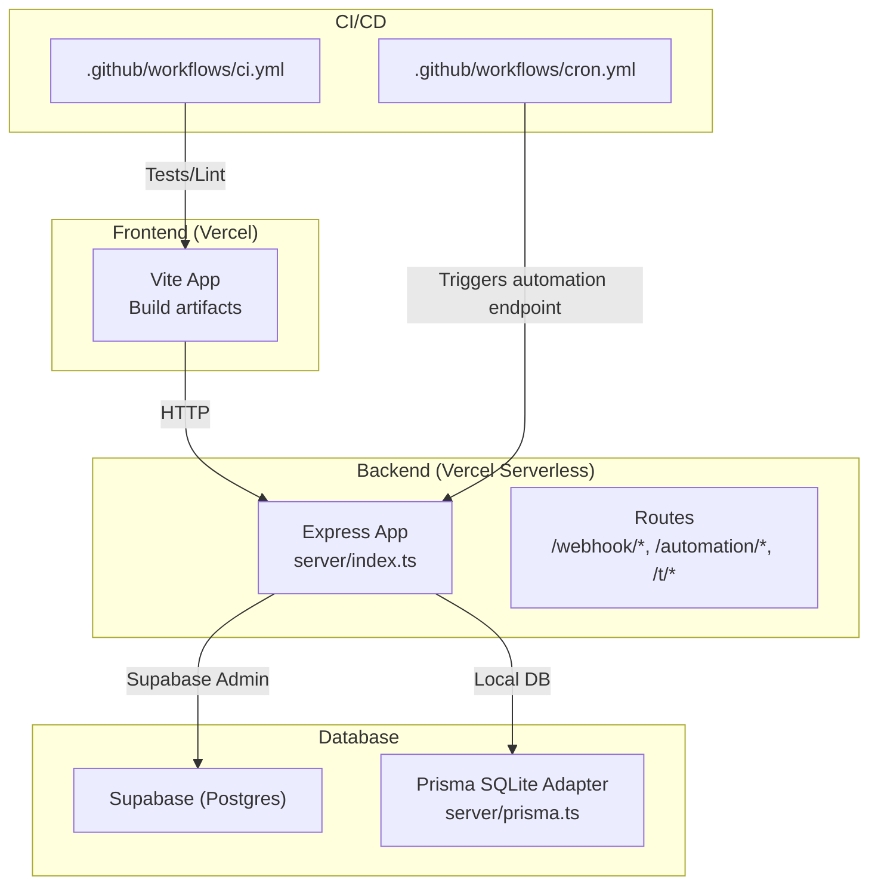
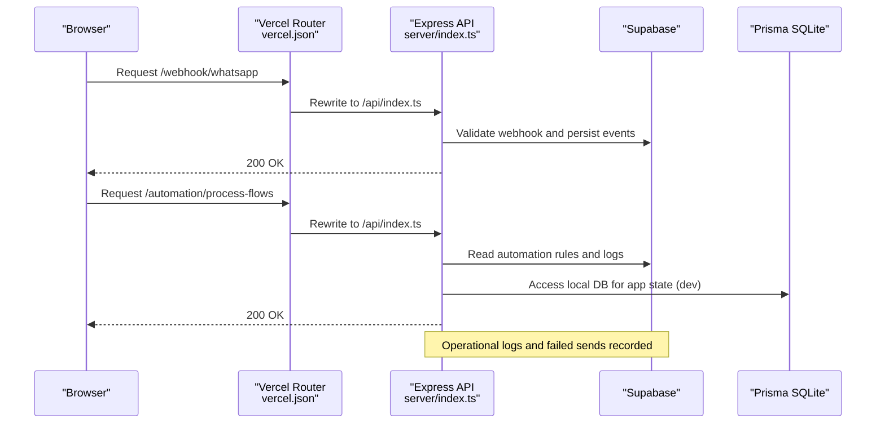
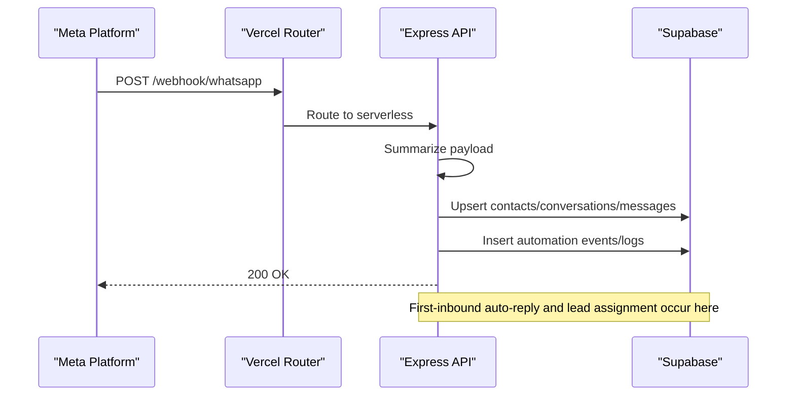
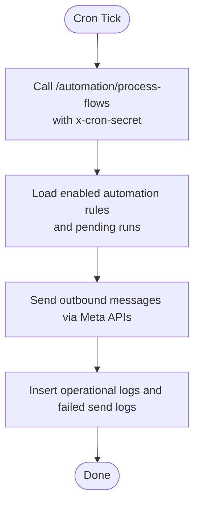
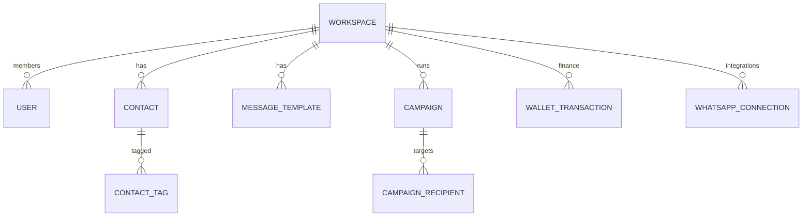
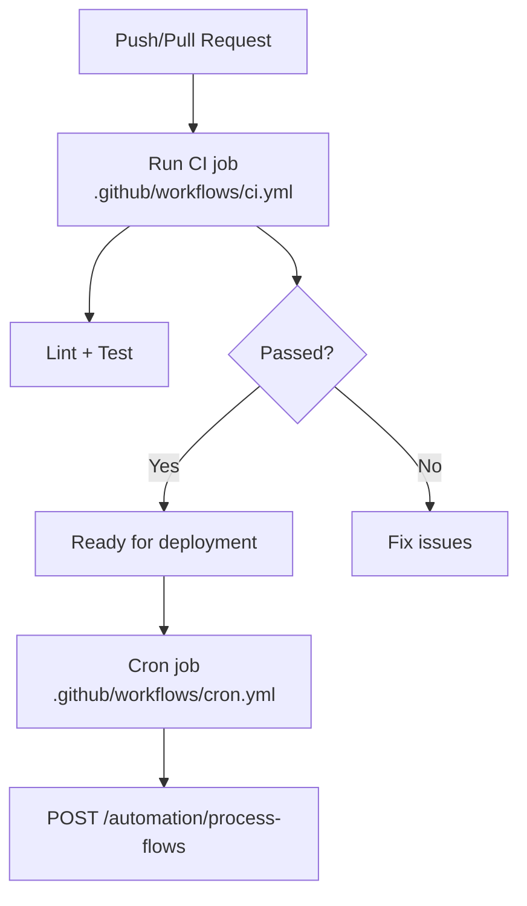
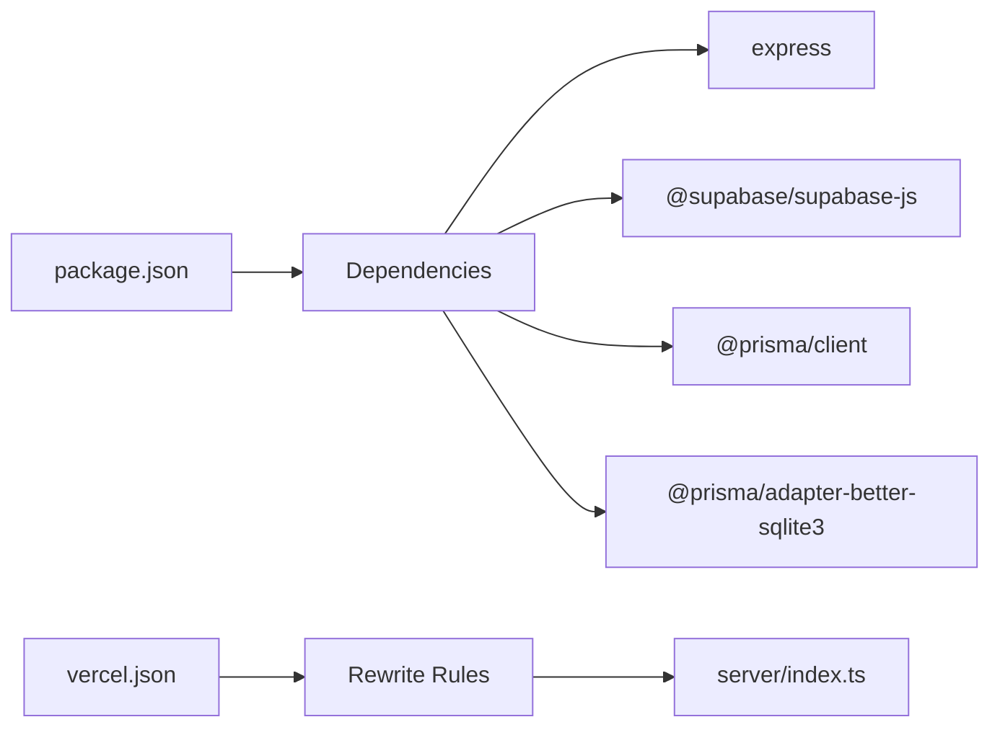

# Deployment & Operations

<cite>
**Referenced Files in This Document**
- [DEPLOYMENT_GUIDE.md](file://DEPLOYMENT_GUIDE.md)
- [vercel.json](file://vercel.json)
- [package.json](file://package.json)
- [schema.prisma](file://prisma/schema.prisma)
- [schema.sql](file://supabase/schema.sql)
- [ci.yml](file://.github/workflows/ci.yml)
- [cron.yml](file://.github/workflows/cron.yml)
- [index.ts](file://server/index.ts)
- [prisma.ts](file://server/prisma.ts)
- [metaWebhook.ts](file://server/metaWebhook.ts)
- [state.ts](file://server/state.ts)
- [IMPLEMENTATION_FIXES.md](file://IMPLEMENTATION_FIXES.md)
- [NGROK_SETUP_GUIDE.md](file://NGROK_SETUP_GUIDE.md)
- [README.md](file://README.md)
</cite>

## Table of Contents
1. [Introduction](#introduction)
2. [Project Structure](#project-structure)
3. [Core Components](#core-components)
4. [Architecture Overview](#architecture-overview)
5. [Detailed Component Analysis](#detailed-component-analysis)
6. [Dependency Analysis](#dependency-analysis)
7. [Performance Considerations](#performance-considerations)
8. [Troubleshooting Guide](#troubleshooting-guide)
9. [Conclusion](#conclusion)
10. [Appendices](#appendices)

## Introduction
This document provides a comprehensive guide to deploying and operating the application in development and production environments. It covers:
- Development environment setup and local testing with Ngrok
- Production deployment using Vercel for the frontend and a serverless backend
- CI/CD workflows with automated testing and cron-based automation
- Database setup with Supabase and Prisma SQLite for local development
- Operational procedures including environment variables, secrets management, monitoring, logging, and scaling considerations
- Practical examples for routing, serverless function optimization, and release management

## Project Structure
The repository combines a Vite/React frontend with an Express backend packaged as a Vercel serverless function. Supabase serves as the primary database and authentication provider, while GitHub Actions powers CI and cron automation.

**Diagram sources**
- [vercel.json:1-22](file://vercel.json#L1-L22)
- [server/index.ts:36-763](file://server/index.ts#L36-L763)
- [server/prisma.ts:1-14](file://server/prisma.ts#L1-L14)
- [.github/workflows/ci.yml:1-30](file://.github/workflows/ci.yml#L1-L30)
- [.github/workflows/cron.yml:1-16](file://.github/workflows/cron.yml#L1-L16)

**Section sources**
- [README.md:1-26](file://README.md#L1-L26)
- [vercel.json:1-22](file://vercel.json#L1-L22)
- [server/index.ts:36-763](file://server/index.ts#L36-L763)
- [server/prisma.ts:1-14](file://server/prisma.ts#L1-L14)
- [.github/workflows/ci.yml:1-30](file://.github/workflows/ci.yml#L1-L30)
- [.github/workflows/cron.yml:1-16](file://.github/workflows/cron.yml#L1-L16)

## Core Components
- Vercel configuration: Rewrites route all incoming requests to the Express serverless entrypoint, enabling unified routing for webhooks, automation, and static SPA fallback.
- Express backend: Provides health checks, webhook ingestion, automation triggers, link tracking, and integration with Supabase for data persistence and authentication.
- Prisma SQLite adapter: Used for local development and testing; production primarily uses Supabase Postgres.
- GitHub Actions: CI pipeline for linting and tests; cron job to periodically trigger automation processing.

Key operational endpoints and routes:
- Health: GET /health
- Webhooks: /webhook/whatsapp, /webhook/leadgen
- Automation: /automation/process-flows (protected by x-cron-secret)
- Link tracking: /t/:code
- SPA fallback: /index.html for unmatched routes

**Section sources**
- [vercel.json:3-20](file://vercel.json#L3-L20)
- [server/index.ts:36-763](file://server/index.ts#L36-L763)
- [server/prisma.ts:1-14](file://server/prisma.ts#L1-L14)
- [.github/workflows/ci.yml:9-30](file://.github/workflows/ci.yml#L9-L30)
- [.github/workflows/cron.yml:7-16](file://.github/workflows/cron.yml#L7-L16)

## Architecture Overview
The system integrates a frontend hosted on Vercel with a serverless Express backend. Supabase provides authentication, row-level security, and relational data. Automation is orchestrated via GitHub Actions cron and a sweep endpoint.

**Diagram sources**
- [vercel.json:3-20](file://vercel.json#L3-L20)
- [server/index.ts:36-763](file://server/index.ts#L36-L763)
- [server/prisma.ts:1-14](file://server/prisma.ts#L1-L14)

**Section sources**
- [vercel.json:1-22](file://vercel.json#L1-L22)
- [server/index.ts:36-763](file://server/index.ts#L36-L763)
- [server/metaWebhook.ts:111-161](file://server/metaWebhook.ts#L111-L161)

## Detailed Component Analysis

### Vercel Routing and Serverless Functions
- Rewrites ensure all traffic under /webhook/, /automation/, and /t/ is handled by the Express serverless function.
- SPA fallback serves index.html for unmatched routes, enabling client-side routing.

Operational implications:
- Keep rewrite rules minimal and intentional to avoid conflicts.
- Use environment variables for domain-specific paths and verification tokens.

**Section sources**
- [vercel.json:3-20](file://vercel.json#L3-L20)

### Express Backend: Webhooks, Automation, and Health Checks
- CORS and JSON middleware are initialized early.
- Health endpoint returns a simple status.
- Webhook ingestion parses Meta payloads and persists events, updates conversations, and triggers automation flows.
- Automation endpoint processes flows on a schedule and is protected by a shared secret header.

**Diagram sources**
- [server/index.ts:369-629](file://server/index.ts#L369-L629)
- [server/metaWebhook.ts:111-161](file://server/metaWebhook.ts#L111-L161)

**Section sources**
- [server/index.ts:36-763](file://server/index.ts#L36-L763)
- [server/metaWebhook.ts:1-161](file://server/metaWebhook.ts#L1-L161)

### Automation Cron and Sweep Mechanism
- GitHub Actions cron runs every 5 minutes and hits the automation endpoint with a shared secret.
- The endpoint processes pending automation runs and logs outcomes.

**Diagram sources**
- [.github/workflows/cron.yml:7-16](file://.github/workflows/cron.yml#L7-L16)
- [server/index.ts:36-763](file://server/index.ts#L36-L763)

**Section sources**
- [.github/workflows/cron.yml:1-16](file://.github/workflows/cron.yml#L1-L16)
- [IMPLEMENTATION_FIXES.md:19-35](file://IMPLEMENTATION_FIXES.md#L19-L35)

### Database Setup and Schema
- Supabase schema defines core tables, enums, row-level security policies, and triggers for audit timestamps.
- Prisma schema defines models and enums for local development and testing.

**Diagram sources**
- [schema.sql:19-130](file://supabase/schema.sql#L19-L130)
- [schema.prisma:90-279](file://prisma/schema.prisma#L90-L279)

**Section sources**
- [schema.sql:1-517](file://supabase/schema.sql#L1-L517)
- [schema.prisma:1-279](file://prisma/schema.prisma#L1-L279)

### Environment Variables and Secrets Management
- Frontend variables (Vite) include API base URL, adapter mode, and Supabase keys.
- Backend variables include service role key, Meta secrets, webhook verify token, and cron secret.
- Secrets are managed in Vercel and GitHub Actions.

Recommended practice:
- Store secrets in Vercel project settings and GitHub repository secrets.
- Use distinct secrets per environment (staging vs production).
- Rotate regularly and limit access to service accounts.

**Section sources**
- [DEPLOYMENT_GUIDE.md:18-31](file://DEPLOYMENT_GUIDE.md#L18-L31)
- [IMPLEMENTATION_FIXES.md:10-18](file://IMPLEMENTATION_FIXES.md#L10-L18)
- [.github/workflows/cron.yml:24-29](file://.github/workflows/cron.yml#L24-L29)

### CI/CD Workflows
- CI workflow runs linting and tests on pushes and pull requests.
- Cron workflow triggers automation processing every 5 minutes.

**Diagram sources**
- [.github/workflows/ci.yml:1-30](file://.github/workflows/ci.yml#L1-L30)
- [.github/workflows/cron.yml:1-16](file://.github/workflows/cron.yml#L1-L16)

**Section sources**
- [.github/workflows/ci.yml:1-30](file://.github/workflows/ci.yml#L1-L30)
- [.github/workflows/cron.yml:1-16](file://.github/workflows/cron.yml#L1-L16)

### Local Development and Testing with Ngrok
- Ngrok exposes local server to the internet for webhook testing.
- Update Meta developer portal callback URL and verify token accordingly.
- Run test scripts to simulate lead capture and link clicks.

**Section sources**
- [NGROK_SETUP_GUIDE.md:1-40](file://NGROK_SETUP_GUIDE.md#L1-L40)

## Dependency Analysis
- Frontend depends on Vite and React; built artifacts are served by Vercel.
- Backend depends on Express, Zod for validation, Supabase client, and Prisma adapter for local SQLite.
- GitHub Actions depend on Node.js 20 and npm packages defined in package.json.

**Diagram sources**
- [package.json:22-78](file://package.json#L22-L78)
- [vercel.json:1-22](file://vercel.json#L1-L22)
- [server/index.ts:1-35](file://server/index.ts#L1-L35)

**Section sources**
- [package.json:1-110](file://package.json#L1-L110)
- [vercel.json:1-22](file://vercel.json#L1-L22)
- [server/index.ts:1-35](file://server/index.ts#L1-L35)

## Performance Considerations
- Serverless cold starts: Minimize initialization work; keep handler lean.
- Database connections: Use Supabase for production; Prisma SQLite for local dev only.
- Payload parsing: Validate and summarize webhook payloads early to reduce downstream work.
- Automation batching: Consolidate outbound sends and log writes to minimize database round-trips.
- Static assets: Serve optimized builds via Vercel for reduced latency.

[No sources needed since this section provides general guidance]

## Troubleshooting Guide
Common operational issues and resolutions:
- Missing environment variables: Ensure SUPABASE_SERVICE_ROLE_KEY, META_APP_SECRET, META_WEBHOOK_VERIFY_TOKEN, CRON_SECRET are set in Vercel and GitHub Actions.
- Webhook verification failures: Verify Meta callback URL and verify token match environment settings.
- Automation not triggering: Confirm cron job is configured and endpoint is reachable; check x-cron-secret header.
- Database migrations: Apply schema.sql and migration files in Supabase SQL Editor before testing.
- Local testing: Use Ngrok to expose local server; update Meta webhook URLs accordingly.

**Section sources**
- [IMPLEMENTATION_FIXES.md:10-39](file://IMPLEMENTATION_FIXES.md#L10-L39)
- [DEPLOYMENT_GUIDE.md:24-58](file://DEPLOYMENT_GUIDE.md#L24-L58)
- [NGROK_SETUP_GUIDE.md:1-40](file://NGROK_SETUP_GUIDE.md#L1-L40)

## Conclusion
This guide outlines a robust deployment and operations model for the application, combining Vercel-hosted frontend and serverless backend, Supabase for data and auth, and GitHub Actions for CI and automation. By following the outlined procedures for environment configuration, secrets management, monitoring, and scaling, teams can reliably operate the system in production while maintaining strong security and observability.

[No sources needed since this section summarizes without analyzing specific files]

## Appendices

### A. Environment Variables Reference
- Frontend (Vite): VITE_API_BASE_URL, VITE_API_ADAPTER, VITE_SUPABASE_URL, VITE_SUPABASE_ANON_KEY
- Backend: SUPABASE_SERVICE_ROLE_KEY, META_APP_SECRET, META_WEBHOOK_VERIFY_TOKEN, CRON_SECRET

**Section sources**
- [DEPLOYMENT_GUIDE.md:18-31](file://DEPLOYMENT_GUIDE.md#L18-L31)
- [IMPLEMENTATION_FIXES.md:10-18](file://IMPLEMENTATION_FIXES.md#L10-L18)

### B. Database Migration Execution
- Apply schema.sql followed by migration files in Supabase SQL Editor in order.

**Section sources**
- [DEPLOYMENT_GUIDE.md:33-39](file://DEPLOYMENT_GUIDE.md#L33-L39)

### C. Monitoring and Logging
- Health endpoint: GET /health
- Operational logs and failed send logs are inserted into Supabase tables for auditing and diagnostics.

**Section sources**
- [server/index.ts:258-317](file://server/index.ts#L258-L317)

### D. Scaling and Cost Management
- Use Vercel’s autoscaling for the frontend; monitor build sizes and optimize assets.
- For backend, keep handler lightweight; externalize heavy work to queues or batch jobs if needed.
- Right-size Supabase resources based on concurrent users and data volume.

[No sources needed since this section provides general guidance]