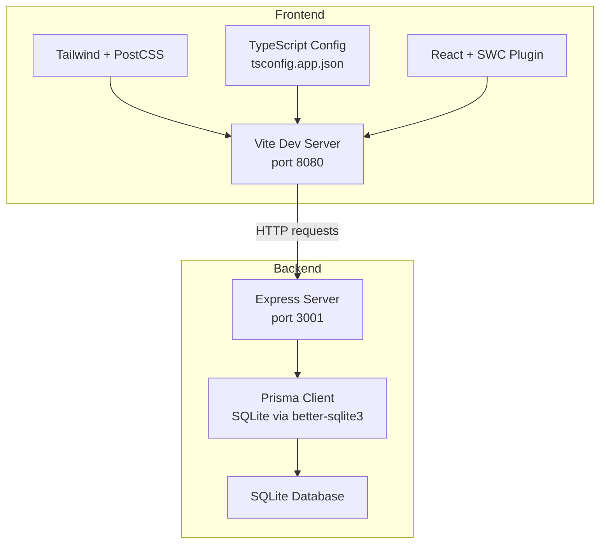
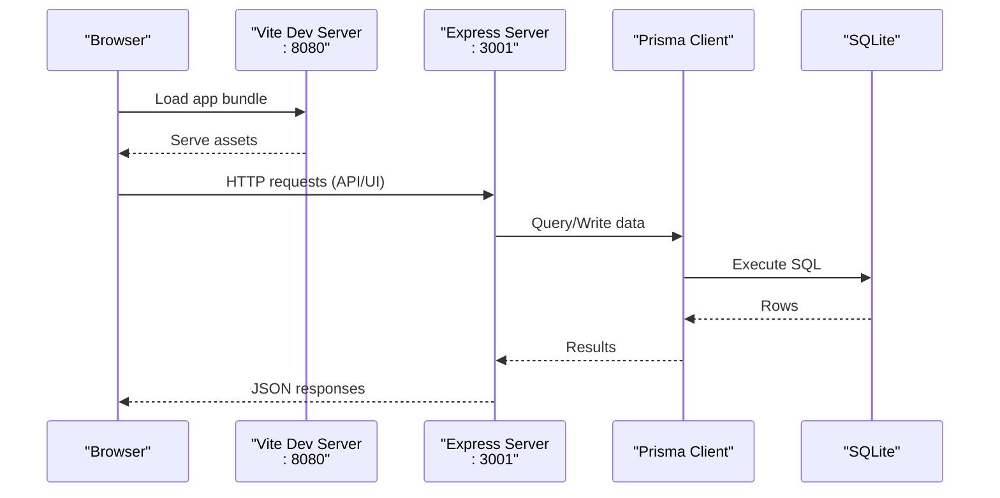
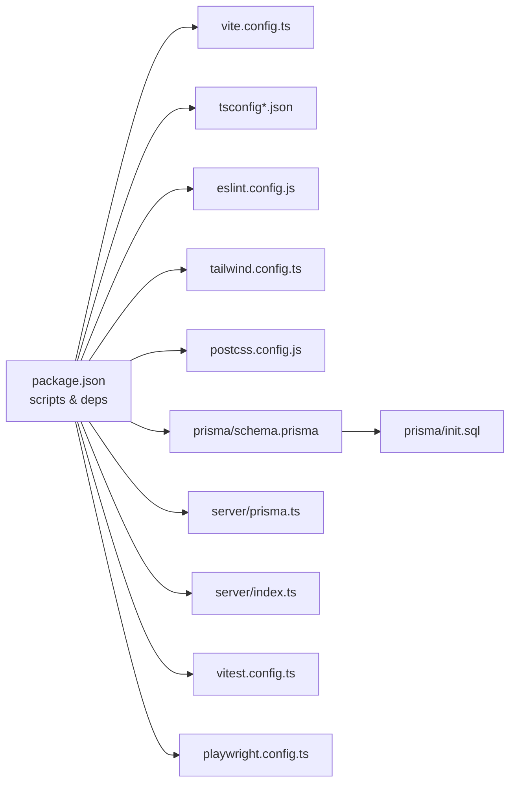

# Development Environment Setup

<cite>
**Referenced Files in This Document**
- [package.json](file://package.json)
- [vite.config.ts](file://vite.config.ts)
- [tsconfig.json](file://tsconfig.json)
- [tsconfig.app.json](file://tsconfig.app.json)
- [tsconfig.node.json](file://tsconfig.node.json)
- [eslint.config.js](file://eslint.config.js)
- [tailwind.config.ts](file://tailwind.config.ts)
- [postcss.config.js](file://postcss.config.js)
- [prisma/schema.prisma](file://prisma/schema.prisma)
- [prisma/init.sql](file://prisma/init.sql)
- [server/prisma.ts](file://server/prisma.ts)
- [server/index.ts](file://server/index.ts)
- [vitest.config.ts](file://vitest.config.ts)
- [playwright.config.ts](file://playwright.config.ts)
</cite>

## Table of Contents
1. [Introduction](#introduction)
2. [Project Structure](#project-structure)
3. [Core Components](#core-components)
4. [Architecture Overview](#architecture-overview)
5. [Detailed Component Analysis](#detailed-component-analysis)
6. [Dependency Analysis](#dependency-analysis)
7. [Performance Considerations](#performance-considerations)
8. [Troubleshooting Guide](#troubleshooting-guide)
9. [Conclusion](#conclusion)
10. [Appendices](#appendices)

## Introduction
This guide explains how to set up a complete local development environment for the project, covering Node.js requirements, dependency management, frontend and backend configuration, database setup, and developer tooling. It also documents the Vite development server, TypeScript compilation, Prisma usage, environment variables, local API mocking, development seeding, debugging, and common pitfalls.

## Project Structure
The project is a full-stack React application with a TypeScript backend using Express and Prisma with a SQLite adapter. The frontend uses Vite and React with SWC, while Tailwind CSS and PostCSS handle styling. Tooling includes ESLint, Vitest for unit tests, Playwright for E2E testing, and Prisma for schema and migrations.

**Diagram sources**
- [vite.config.ts:1-22](file://vite.config.ts#L1-L22)
- [server/index.ts:36-44](file://server/index.ts#L36-L44)
- [server/prisma.ts:1-14](file://server/prisma.ts#L1-L14)
- [prisma/schema.prisma:1-8](file://prisma/schema.prisma#L1-L8)

**Section sources**
- [package.json:1-110](file://package.json#L1-L110)
- [vite.config.ts:1-22](file://vite.config.ts#L1-L22)
- [tsconfig.json:1-24](file://tsconfig.json#L1-L24)
- [tsconfig.app.json:1-35](file://tsconfig.app.json#L1-L35)
- [tsconfig.node.json:1-23](file://tsconfig.node.json#L1-L23)
- [tailwind.config.ts:1-110](file://tailwind.config.ts#L1-L110)
- [postcss.config.js:1-7](file://postcss.config.js#L1-L7)
- [prisma/schema.prisma:1-279](file://prisma/schema.prisma#L1-L279)
- [prisma/init.sql:1-137](file://prisma/init.sql#L1-L137)
- [server/prisma.ts:1-14](file://server/prisma.ts#L1-L14)
- [server/index.ts:36-44](file://server/index.ts#L36-L44)

## Core Components
- Node.js runtime and package manager: The project requires Node.js 20.x and uses npm scripts for development tasks.
- Frontend toolchain: Vite with React plugin, TypeScript for type checking, Tailwind CSS with PostCSS.
- Backend toolchain: Express server, Prisma with better-sqlite3 adapter, and SQLite for local development.
- Developer tooling: ESLint for linting, Vitest for unit tests, Playwright for E2E tests.

Key scripts and commands:
- Frontend dev server: runs on port 8080 with HMR disabled overlay.
- Backend dev server: runs on port 3001 with hot reloading for TypeScript files.
- Build scripts: frontend build and development build modes.
- Prisma commands: generate client and push schema to database.
- Testing: run unit tests and watch mode; Playwright configuration provided.

**Section sources**
- [package.json:9-21](file://package.json#L9-L21)
- [vite.config.ts:7-21](file://vite.config.ts#L7-L21)
- [server/index.ts:36-44](file://server/index.ts#L36-L44)
- [eslint.config.js:1-27](file://eslint.config.js#L1-L27)
- [vitest.config.ts:1-17](file://vitest.config.ts#L1-L17)
- [playwright.config.ts:1-11](file://playwright.config.ts#L1-L11)

## Architecture Overview
The development stack consists of:
- Vite dev server serving the React frontend locally.
- Express server exposing REST endpoints and handling webhooks.
- Prisma managing schema and data access with a SQLite database via better-sqlite3.
- Tailwind CSS and PostCSS for styling.
- TypeScript configuration split between app and node contexts.

**Diagram sources**
- [vite.config.ts:7-21](file://vite.config.ts#L7-L21)
- [server/index.ts:36-44](file://server/index.ts#L36-L44)
- [server/prisma.ts:1-14](file://server/prisma.ts#L1-14)

## Detailed Component Analysis

### Node.js and Package Manager
- Engine requirement: Node.js 20.x.
- Scripts orchestrate development tasks for frontend, backend, Prisma, linting, testing, and preview.
- Use npm or yarn to install dependencies; the repository includes a lock file for deterministic installs.

Best practices:
- Pin Node.js to 20.x using a version manager (e.g., nvm).
- Prefer npm ci for clean installs in CI-like environments.

**Section sources**
- [package.json:6-8](file://package.json#L6-L8)
- [package.json:9-21](file://package.json#L9-L21)

### Vite Development Server
- Host binding: "::" allows access from external devices on IPv6-capable networks.
- Port: 8080.
- HMR overlay disabled to reduce noise during development.
- Alias: "@" resolves to the src directory for cleaner imports.
- Development-only plugin: componentTagger is enabled only in development mode.

Recommendations:
- Keep port 8080 free; otherwise change the port in the Vite config.
- Use the alias consistently to avoid relative path hell.

**Section sources**
- [vite.config.ts:7-21](file://vite.config.ts#L7-L21)

### TypeScript Compilation
- Root tsconfig references two typed configs:
  - tsconfig.app.json: frontend app settings (React JSX, DOM libs).
  - tsconfig.node.json: Node tooling settings (bundler module resolution).
- Path aliases "@/*" mapped to "./src/*" in both configs.
- Strictness is relaxed in app config to accelerate development; enable stricter rules as needed.

Guidance:
- Use tsconfig.app.json for frontend code; tsconfig.node.json for Vite config and tooling.
- Keep path aliases consistent across configs.

**Section sources**
- [tsconfig.json:16-23](file://tsconfig.json#L16-L23)
- [tsconfig.app.json:19-22](file://tsconfig.app.json#L19-L22)
- [tsconfig.node.json:8-12](file://tsconfig.node.json#L8-L12)

### ESLint and Formatting
- ESLint config extends recommended TypeScript and React rules.
- Plugins: react-hooks, react-refresh.
- Rules: disables unused vars lint globally; allows constant exports for components.

Formatting:
- Configure Prettier separately if desired; integrate with editor save hooks.
- Run linting via npm script and fix auto-fixable issues.

**Section sources**
- [eslint.config.js:1-27](file://eslint.config.js#L1-L27)

### Tailwind CSS and PostCSS
- Tailwind scans components, pages, app, and src directories.
- Dark mode strategy via class-based toggling.
- PostCSS pipeline includes Tailwind and Autoprefixer.

Tips:
- Keep content globs aligned with your project structure.
- Use Tailwind utilities consistently to maintain design system coherence.

**Section sources**
- [tailwind.config.ts:4-5](file://tailwind.config.ts#L4-L5)
- [postcss.config.js:1-7](file://postcss.config.js#L1-L7)

### Prisma Development Database
- Provider: sqlite.
- Client generated via Prisma CLI.
- Adapter: better-sqlite3 with Prisma client.
- Required environment variable: DATABASE_URL pointing to a SQLite file path.

Setup steps:
- Generate Prisma client: run the Prisma generate script.
- Push schema to database: run the Prisma push script.
- Initialize schema and seed data: use the provided SQL file and Prisma client initialization.

Environment variables:
- DATABASE_URL must be present in your environment; the backend will fail to start without it.

**Section sources**
- [prisma/schema.prisma:1-8](file://prisma/schema.prisma#L1-L8)
- [prisma/init.sql:1-137](file://prisma/init.sql#L1-L137)
- [server/prisma.ts:5-9](file://server/prisma.ts#L5-L9)
- [package.json:17-18](file://package.json#L17-L18)

### Express Backend and Environment Variables
- CORS enabled with credentials and dynamic origin.
- JSON body parsing middleware enabled.
- Port resolved from environment variable (defaults to 3001).
- Health check endpoint exposed.

Environment variables:
- PORT: server port.
- DATABASE_URL: Prisma connection string to SQLite.

Local API mocking:
- Use the existing routes as a baseline; add mock handlers for endpoints under development.
- For frontend-to-backend isolation, consider intercepting fetch/XHR in the browser devtools network panel.

**Section sources**
- [server/index.ts:36-44](file://server/index.ts#L36-L44)
- [server/index.ts:37](file://server/index.ts#L37)
- [server/index.ts:761-763](file://server/index.ts#L761-L763)

### Testing and E2E
- Unit tests: Vitest with jsdom environment, global setup, and test file inclusion pattern.
- E2E tests: Playwright configuration provided; customize base URL and timeouts as needed.

**Section sources**
- [vitest.config.ts:5-16](file://vitest.config.ts#L5-L16)
- [playwright.config.ts:1-11](file://playwright.config.ts#L1-L11)

### Local Database Seeding
- The schema defines domain models and enums.
- The init SQL file creates tables and indexes for core entities.
- Seed development data by inserting rows via Prisma client or SQL scripts.

Recommended approach:
- Create a seed script that inserts a small set of workspaces, users, contacts, and campaigns.
- Use Prisma’s write APIs or raw SQL to populate initial data for local development.

**Section sources**
- [prisma/schema.prisma:90-279](file://prisma/schema.prisma#L90-L279)
- [prisma/init.sql:1-137](file://prisma/init.sql#L1-L137)

### Debugging Setup
- Browser devtools: inspect network requests, console logs, and React components.
- React DevTools: install the extension and verify component tree and props/state.
- Backend logging: the server writes operational events and failed send logs to the database; use the database viewer to inspect logs.

**Section sources**
- [server/index.ts:258-275](file://server/index.ts#L258-L275)
- [server/index.ts:277-317](file://server/index.ts#L277-L317)

## Dependency Analysis
The project uses a modern, layered setup:
- Frontend: React, TypeScript, Vite, Tailwind CSS.
- Backend: Express, Prisma, better-sqlite3.
- Tooling: ESLint, Vitest, Playwright.

**Diagram sources**
- [package.json:1-110](file://package.json#L1-L110)
- [vite.config.ts:1-22](file://vite.config.ts#L1-L22)
- [tsconfig.json:1-24](file://tsconfig.json#L1-L24)
- [eslint.config.js:1-27](file://eslint.config.js#L1-L27)
- [tailwind.config.ts:1-110](file://tailwind.config.ts#L1-L110)
- [postcss.config.js:1-7](file://postcss.config.js#L1-L7)
- [prisma/schema.prisma:1-279](file://prisma/schema.prisma#L1-L279)
- [prisma/init.sql:1-137](file://prisma/init.sql#L1-L137)
- [server/prisma.ts:1-14](file://server/prisma.ts#L1-L14)
- [server/index.ts:1-800](file://server/index.ts#L1-L800)
- [vitest.config.ts:1-17](file://vitest.config.ts#L1-L17)
- [playwright.config.ts:1-11](file://playwright.config.ts#L1-L11)

**Section sources**
- [package.json:22-107](file://package.json#L22-L107)

## Performance Considerations
- Disable HMR overlay in Vite to reduce UI noise during rapid reloads.
- Keep TypeScript strictness balanced: relax for speed, enable selectively for safety.
- Use efficient Prisma queries and avoid N+1 selects; batch operations where possible.
- Minimize Tailwind purging scope to reduce build times in large projects.

## Troubleshooting Guide
Common issues and resolutions:
- Port conflicts
  - Vite runs on 8080; Express runs on 3001. Change ports in Vite config or backend server code if needed.
  - Verify no other process occupies the ports before starting the servers.
- Dependency resolution problems
  - Clear node_modules and reinstall dependencies using the lock file.
  - Ensure Node.js matches the required engine version.
- Environment variables
  - DATABASE_URL must be set for Prisma; otherwise, the backend fails to initialize.
  - PORT must be set if you want a custom backend port.
- IDE configuration
  - Configure TypeScript path aliases to resolve "@/*".
  - Enable ESLint and Prettier integrations in your editor.
- Pre-commit hooks
  - Add linting and formatting checks to prevent committing problematic code.
  - Example hook flow: run linter, format code, then run tests.

**Section sources**
- [vite.config.ts:8-14](file://vite.config.ts#L8-L14)
- [server/index.ts:37](file://server/index.ts#L37)
- [server/prisma.ts:7-9](file://server/prisma.ts#L7-L9)
- [eslint.config.js:20-25](file://eslint.config.js#L20-L25)

## Conclusion
With Node.js 20.x, npm/yarn installed, and the provided scripts, you can quickly spin up the frontend and backend, configure Prisma with a SQLite database, and leverage the included tooling for linting, testing, and styling. Use the environment variables and seed scripts to tailor the local database to your needs, and adopt the debugging and formatting practices outlined to keep development smooth and consistent.

## Appendices

### Environment Variable Reference
- PORT: Backend server port (default 3001).
- DATABASE_URL: Prisma connection string to SQLite file.

**Section sources**
- [server/index.ts:37](file://server/index.ts#L37)
- [server/prisma.ts:5](file://server/prisma.ts#L5)

### Development Workflow Checklist
- Install Node.js 20.x and dependencies.
- Start backend dev server and frontend dev server concurrently.
- Generate Prisma client and push schema.
- Seed local database with initial data.
- Run linter and tests regularly.
- Use browser devtools and React DevTools for debugging.
- Configure pre-commit hooks for linting and formatting.

**Section sources**
- [package.json:9-21](file://package.json#L9-L21)
- [prisma/schema.prisma:1-8](file://prisma/schema.prisma#L1-L8)
- [prisma/init.sql:1-137](file://prisma/init.sql#L1-L137)
- [eslint.config.js:1-27](file://eslint.config.js#L1-L27)
- [vitest.config.ts:5-16](file://vitest.config.ts#L5-L16)