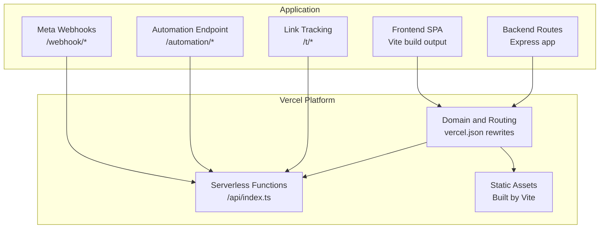
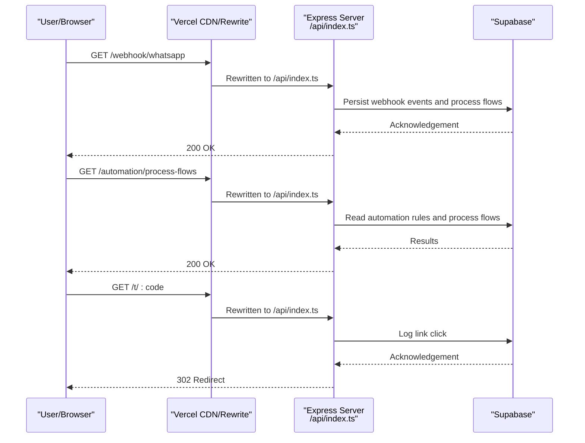
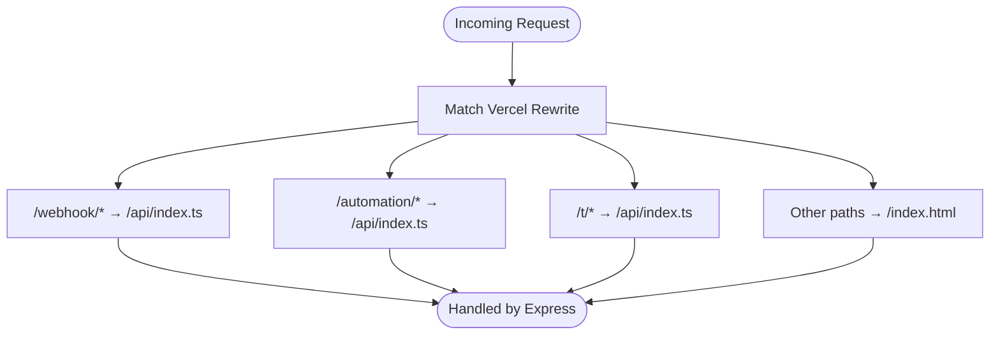
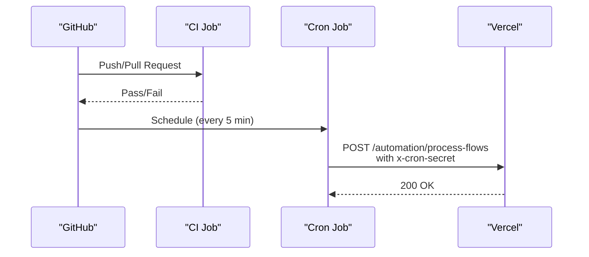
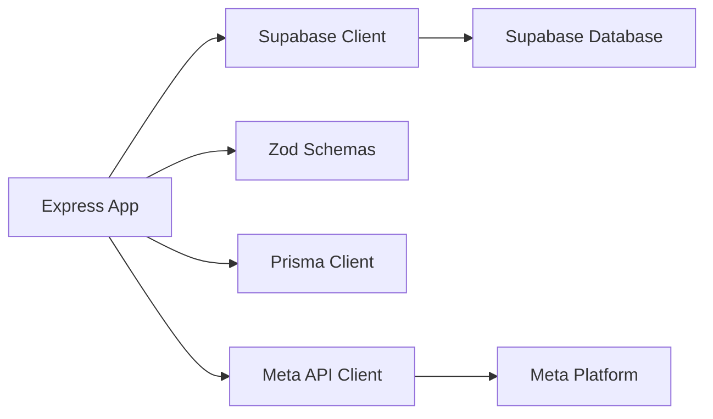

# Production Deployment

<cite>
**Referenced Files in This Document**
- [vercel.json](file://vercel.json)
- [package.json](file://package.json)
- [DEPLOYMENT_GUIDE.md](file://DEPLOYMENT_GUIDE.md)
- [server/index.ts](file://server/index.ts)
- [api/index.ts](file://api/index.ts)
- [server/meta.ts](file://server/meta.ts)
- [server/metaWebhook.ts](file://server/metaWebhook.ts)
- [vite.config.ts](file://vite.config.ts)
- [.github/workflows/cron.yml](file://.github/workflows/cron.yml)
- [.github/workflows/ci.yml](file://.github/workflows/ci.yml)
- [supabase/schema.sql](file://supabase/schema.sql)
</cite>

## Table of Contents
1. [Introduction](#introduction)
2. [Project Structure](#project-structure)
3. [Core Components](#core-components)
4. [Architecture Overview](#architecture-overview)
5. [Detailed Component Analysis](#detailed-component-analysis)
6. [Dependency Analysis](#dependency-analysis)
7. [Performance Considerations](#performance-considerations)
8. [Troubleshooting Guide](#troubleshooting-guide)
9. [Conclusion](#conclusion)
10. [Appendices](#appendices)

## Introduction
This document provides a comprehensive guide to deploying the application to production using Vercel for the frontend and integrating a serverless backend via Vercel’s routing rewrites. It covers environment variable management, GitHub integration for automated builds, Meta webhook configuration, Supabase database setup, and production optimization strategies. It also includes practical guidance for verification, rollback, monitoring, security hardening, and debugging.

## Project Structure
The repository combines a Vite React frontend with a Node.js/Express backend packaged as a single serverless entry. Vercel configuration routes incoming requests to the appropriate handler based on path prefixes, enabling a unified deployment for both frontend and backend.

**Diagram sources**
- [vercel.json:1-22](file://vercel.json#L1-L22)
- [server/index.ts:36-800](file://server/index.ts#L36-L800)
- [api/index.ts:36-800](file://api/index.ts#L36-L800)

**Section sources**
- [vercel.json:1-22](file://vercel.json#L1-L22)
- [package.json:1-110](file://package.json#L1-L110)
- [vite.config.ts:1-22](file://vite.config.ts#L1-L22)

## Core Components
- Vercel routing rewrites: Route specific paths to the serverless function while serving static assets for the rest of the app.
- Serverless function entry: Single Express app handles health checks, webhooks, automation triggers, and link tracking.
- GitHub Actions: Automated CI and a cron job to trigger automation processing.
- Supabase schema: Database schema and row-level security policies for production-grade access control.

Key responsibilities:
- vercel.json: Defines rewrite rules for webhook, automation, and catch-all routes.
- server/index.ts and api/index.ts: Express app with CORS, JSON parsing, and route handlers.
- .github/workflows/cron.yml: Periodic automation processing via a scheduled endpoint.
- supabase/schema.sql: Database schema and RLS policies.

**Section sources**
- [vercel.json:3-20](file://vercel.json#L3-L20)
- [server/index.ts:36-800](file://server/index.ts#L36-L800)
- [api/index.ts:36-800](file://api/index.ts#L36-L800)
- [.github/workflows/cron.yml:1-16](file://.github/workflows/cron.yml#L1-L16)
- [supabase/schema.sql:1-517](file://supabase/schema.sql#L1-L517)

## Architecture Overview
The production deployment integrates Vercel’s global CDN and serverless runtime with a Node.js/Express backend exposed as a single function. Requests are routed by Vercel rewrites to either the frontend SPA or the backend routes.

**Diagram sources**
- [vercel.json:3-20](file://vercel.json#L3-L20)
- [server/index.ts:761-800](file://server/index.ts#L761-L800)
- [api/index.ts:761-800](file://api/index.ts#L761-L800)

## Detailed Component Analysis

### Vercel Routing and Serverless Function
- Rewrite rules:
  - /webhook/(.*) → /api/index.ts
  - /automation/(.*) → /api/index.ts
  - /t/(.*) → /api/index.ts
  - /(.*) → /index.html (SPA fallback)
- This enables:
  - Meta webhooks to reach the backend
  - Automation endpoint to be triggered periodically
  - Link tracking to resolve and log clicks
  - SPA routing to be served statically

**Diagram sources**
- [vercel.json:3-20](file://vercel.json#L3-L20)

**Section sources**
- [vercel.json:1-22](file://vercel.json#L1-L22)

### Environment Variable Management
Production environment variables are required for:
- Meta configuration: APP ID, APP SECRET, WEBHOOK VERIFY TOKEN, API VERSION
- Cron scheduling: CRON_SECRET
- Frontend base URL: VITE_API_BASE_URL
- Supabase client: VITE_SUPABASE_URL, VITE_SUPABASE_ANON_KEY

These are configured in Vercel and GitHub Actions secrets. The backend reads them via process.env.

Practical guidance:
- Store secrets in Vercel under the project settings.
- Mirror required variables in GitHub Actions secrets for cron jobs.
- Keep frontend variables prefixed with VITE_ for client visibility.

**Section sources**
- [DEPLOYMENT_GUIDE.md:18-31](file://DEPLOYMENT_GUIDE.md#L18-L31)
- [server/meta.ts:1-16](file://server/meta.ts#L1-L16)
- [.github/workflows/cron.yml:14-15](file://.github/workflows/cron.yml#L14-L15)

### GitHub Integration and Automatic Builds
- CI workflow validates code quality and tests on pushes and pull requests.
- Cron workflow triggers automation processing every 5 minutes using a shared CRON_SECRET.

**Diagram sources**
- [.github/workflows/ci.yml:1-30](file://.github/workflows/ci.yml#L1-L30)
- [.github/workflows/cron.yml:1-16](file://.github/workflows/cron.yml#L1-L16)

**Section sources**
- [.github/workflows/ci.yml:1-30](file://.github/workflows/ci.yml#L1-L30)
- [.github/workflows/cron.yml:1-16](file://.github/workflows/cron.yml#L1-L16)

### Meta Webhook Configuration and SSL
- Configure Meta Developer App with:
  - Callback URL: https://your-vercel-app.vercel.app/webhook/whatsapp
  - Verify token: match the configured META_WEBHOOK_VERIFY_TOKEN
- Vercel enforces HTTPS by default; SSL certificates are managed by Vercel.

Verification steps:
- Confirm callback URL in Meta Developer Console.
- Ensure verify token matches between Vercel and Meta.
- Monitor backend logs for successful webhook reception.

**Section sources**
- [DEPLOYMENT_GUIDE.md:51-54](file://DEPLOYMENT_GUIDE.md#L51-L54)

### Supabase Database Setup
- Apply schema files in order:
  - schema.sql
  - 20260325_link_tracking.sql
  - 20260325_automation_flows.sql
- Row-level security policies are defined to isolate workspaces and protect sensitive tables.

**Section sources**
- [DEPLOYMENT_GUIDE.md:33-39](file://DEPLOYMENT_GUIDE.md#L33-L39)
- [supabase/schema.sql:1-517](file://supabase/schema.sql#L1-L517)

### Health Checks and Monitoring
- Health endpoint: GET /health returns a simple JSON response for uptime checks.
- Use Vercel’s built-in metrics and logs for monitoring.
- For external monitoring, configure synthetic checks against /health.

**Section sources**
- [server/index.ts:761-763](file://server/index.ts#L761-L763)
- [api/index.ts:761-763](file://api/index.ts#L761-L763)

### Security Considerations
- HTTPS enforcement: Vercel serves HTTPS by default; enforce redirects for HTTP traffic at the edge if needed.
- CORS: Enabled with origin: true and credentials: true; ensure frontend domain matches Vercel domain.
- Secret management: Store all secrets in Vercel and GitHub Actions; avoid committing secrets to the repository.
- Rate limiting and throttling: Consider adding rate limits at the edge or middleware if traffic spikes occur.
- Meta webhook verification: Ensure verify token matches and signature validation is performed in production.

**Section sources**
- [server/index.ts:39-42](file://server/index.ts#L39-L42)
- [server/meta.ts:1-16](file://server/meta.ts#L1-L16)

### Deployment Verification, Rollback, and Debugging
- Verification:
  - Visit /health to confirm backend is reachable.
  - Trigger automation manually via POST to /automation/process-flows with x-cron-secret header.
  - Test link tracking by visiting /t/:code and verifying logs in Supabase.
- Rollback:
  - Use Vercel’s dashboard to revert to a previous production deployment.
  - Alternatively, redeploy a known-good commit.
- Debugging:
  - Inspect Vercel logs for function errors.
  - Enable verbose logging in the backend for webhook and automation flows.
  - Validate environment variables in Vercel project settings.

**Section sources**
- [DEPLOYMENT_GUIDE.md:56-58](file://DEPLOYMENT_GUIDE.md#L56-L58)
- [server/index.ts:761-800](file://server/index.ts#L761-L800)
- [api/index.ts:761-800](file://api/index.ts#L761-L800)

## Dependency Analysis
The backend depends on:
- Express for routing and middleware
- Supabase client for database operations
- Zod for request validation
- Prisma client for database queries
- Meta APIs for WhatsApp and lead generation integrations

**Diagram sources**
- [server/index.ts:1-35](file://server/index.ts#L1-L35)
- [api/index.ts:1-35](file://api/index.ts#L1-L35)

**Section sources**
- [server/index.ts:1-35](file://server/index.ts#L1-L35)
- [api/index.ts:1-35](file://api/index.ts#L1-L35)

## Performance Considerations
- Asset bundling: Vite produces optimized static assets; deploy the dist folder to Vercel for CDN delivery.
- CDN configuration: Vercel automatically caches static assets; ensure cache headers are appropriate for immutable assets.
- Caching strategies:
  - Use cache-control headers for static assets.
  - Consider short-lived cache for HTML and long-lived cache for hashed assets.
- Database optimization:
  - Use Supabase’s edge functions for heavy computations when possible.
  - Optimize queries and add indexes as needed.
- Function cold starts: Keep the function warm by pinging /health periodically if latency-sensitive.

[No sources needed since this section provides general guidance]

## Troubleshooting Guide
Common issues and resolutions:
- Webhook not received:
  - Verify callback URL and verify token in Meta Developer Console.
  - Check Vercel logs for 404 or 5xx responses.
- Automation endpoint failing:
  - Confirm CRON_SECRET matches between Vercel and GitHub Actions.
  - Validate x-cron-secret header in the request.
- CORS errors:
  - Ensure frontend domain matches Vercel domain.
  - Verify origin: true and credentials: true in CORS configuration.
- Database access denied:
  - Confirm Supabase URL and anon key are set in Vercel.
  - Review RLS policies and workspace membership.

**Section sources**
- [DEPLOYMENT_GUIDE.md:51-58](file://DEPLOYMENT_GUIDE.md#L51-L58)
- [server/index.ts:39-42](file://server/index.ts#L39-L42)
- [server/meta.ts:1-16](file://server/meta.ts#L1-L16)

## Conclusion
By leveraging Vercel’s routing rewrites and serverless runtime, the application achieves a streamlined production deployment that serves both frontend and backend from a single entry point. With proper environment variable management, GitHub Actions automation, Meta webhook configuration, and Supabase schema setup, the system is ready for production. Follow the verification, rollback, and debugging practices outlined above to maintain reliability and performance.

[No sources needed since this section summarizes without analyzing specific files]

## Appendices

### Environment Variables Reference
- Required for backend:
  - META_APP_ID
  - META_APP_SECRET
  - META_WEBHOOK_VERIFY_TOKEN
  - META_API_VERSION
  - CRON_SECRET
- Required for frontend:
  - VITE_API_BASE_URL
  - VITE_SUPABASE_URL
  - VITE_SUPABASE_ANON_KEY

**Section sources**
- [DEPLOYMENT_GUIDE.md:18-31](file://DEPLOYMENT_GUIDE.md#L18-L31)
- [server/meta.ts:1-16](file://server/meta.ts#L1-L16)