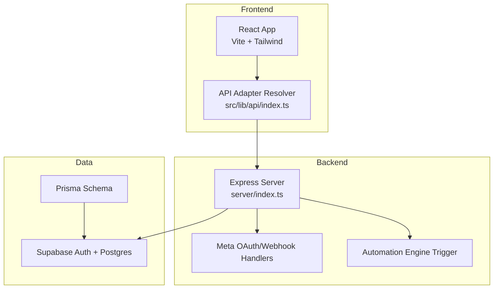
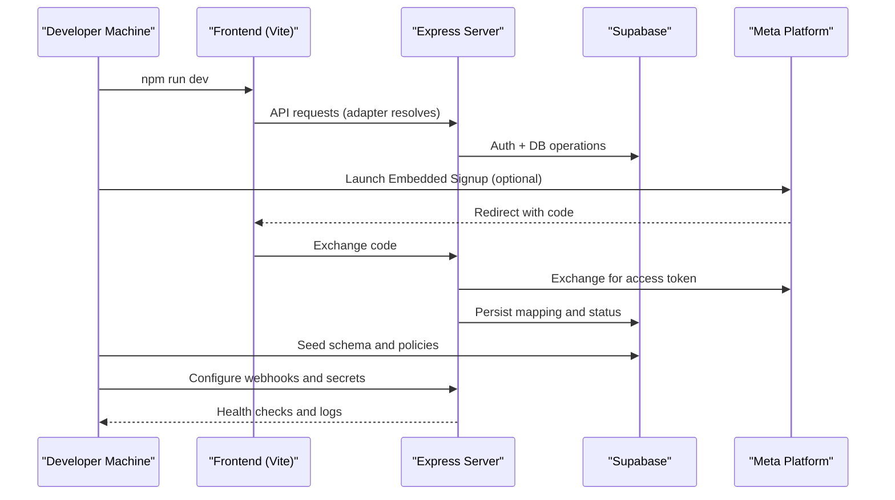
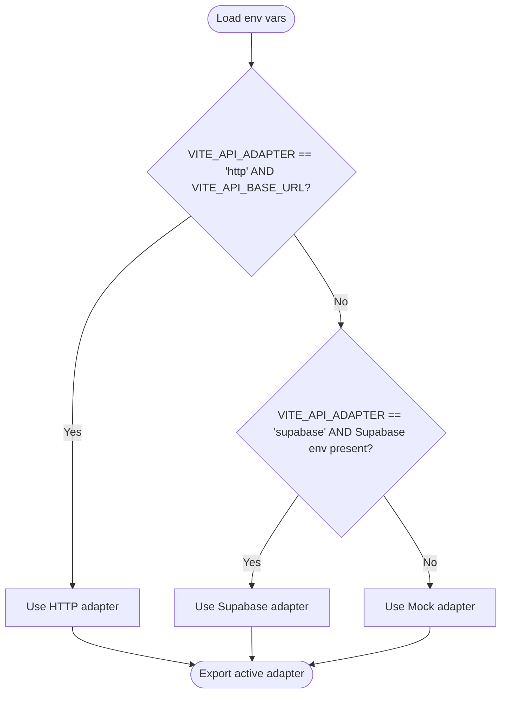
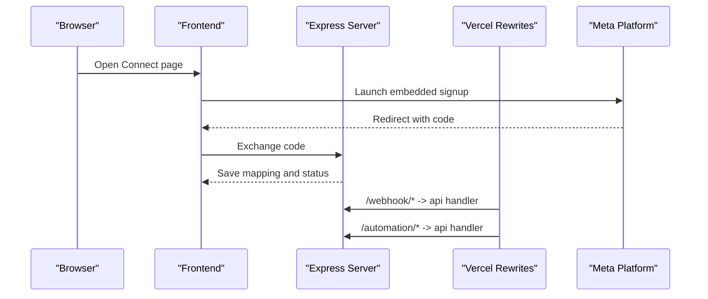
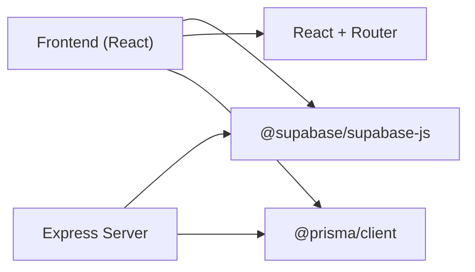

# Getting Started

<cite>
**Referenced Files in This Document**
- [README.md](file://README.md)
- [package.json](file://package.json)
- [DEPLOYMENT_GUIDE.md](file://DEPLOYMENT_GUIDE.md)
- [prisma/schema.prisma](file://prisma/schema.prisma)
- [supabase/schema.sql](file://supabase/schema.sql)
- [server/index.ts](file://server/index.ts)
- [src/pages/ConnectWhatsApp.tsx](file://src/pages/ConnectWhatsApp.tsx)
- [src/lib/api/index.ts](file://src/lib/api/index.ts)
- [src/lib/meta/config.ts](file://src/lib/meta/config.ts)
- [vercel.json](file://vercel.json)
</cite>

## Table of Contents
1. [Introduction](#introduction)
2. [Project Structure](#project-structure)
3. [Core Components](#core-components)
4. [Architecture Overview](#architecture-overview)
5. [Detailed Component Analysis](#detailed-component-analysis)
6. [Dependency Analysis](#dependency-analysis)
7. [Performance Considerations](#performance-considerations)
8. [Troubleshooting Guide](#troubleshooting-guide)
9. [Conclusion](#conclusion)
10. [Appendices](#appendices)

## Introduction
WhatsAppFly (WaBiz) is a WhatsApp Business SaaS platform designed to help Shopify stores, D2C brands, and local businesses manage conversations, automate workflows, and onboard customers via Meta’s WhatsApp APIs. It provides a modern dashboard with conversation management, lead capture, message templates, campaigns, and automation engines, backed by Supabase for authentication and relational data.

Key goals for onboarding:
- Install dependencies and configure environment
- Provision and initialize the Supabase database
- Configure Meta Developer App and OAuth
- Launch the application locally and connect a WhatsApp Business account
- Verify webhooks and automation flows

## Project Structure
High-level layout relevant to onboarding:
- Frontend: Vite + React + Tailwind UI
- Backend: Express server (local development) and Vercel serverless rewrites for production
- Database: Supabase (PostgreSQL) with pre-defined schema and Prisma models
- Authentication: Supabase Auth integrated with workspace scoping
- Meta integration: OAuth flow and webhook handling for WhatsApp and Lead Ads

**Diagram sources**
- [src/lib/api/index.ts:13-23](file://src/lib/api/index.ts#L13-L23)
- [server/index.ts:1-120](file://server/index.ts#L1-L120)
- [prisma/schema.prisma:1-189](file://prisma/schema.prisma#L1-L189)
- [supabase/schema.sql:1-517](file://supabase/schema.sql#L1-L517)

**Section sources**
- [README.md:1-26](file://README.md#L1-L26)
- [package.json:1-110](file://package.json#L1-L110)

## Core Components
- Environment and adapters
  - API adapter selection is driven by environment variables for local vs. production modes.
  - Local development uses Supabase adapter with Vite proxy and dev server.
- Meta configuration
  - Embedded signup configuration is optional; when present, the frontend launches Meta’s OAuth dialog.
- Supabase schema
  - Predefined tables for workspaces, profiles, WhatsApp connections, leads, conversations, templates, campaigns, and operational logs.
- Prisma models
  - Strongly typed models mirror Supabase schema and define enums for statuses and categories.

**Section sources**
- [src/lib/api/index.ts:13-23](file://src/lib/api/index.ts#L13-L23)
- [src/lib/meta/config.ts:1-47](file://src/lib/meta/config.ts#L1-L47)
- [supabase/schema.sql:1-517](file://supabase/schema.sql#L1-L517)
- [prisma/schema.prisma:1-189](file://prisma/schema.prisma#L1-L189)

## Architecture Overview
End-to-end onboarding flow from developer machine to live deployment:

**Diagram sources**
- [src/lib/api/index.ts:13-23](file://src/lib/api/index.ts#L13-L23)
- [server/index.ts:18-34](file://server/index.ts#L18-L34)
- [src/pages/ConnectWhatsApp.tsx:134-157](file://src/pages/ConnectWhatsApp.tsx#L134-L157)

## Detailed Component Analysis

### System Requirements and Prerequisites
- Node.js version aligned with project engines setting
- A Supabase project with Auth and Postgres enabled
- A Meta Developer App with WhatsApp and Marketing APIs enabled
- Optional: Vercel for frontend and backend routing rewrites

Practical checklist:
- Node.js installed per engines requirement
- Supabase project created and SQL Editor ready
- Meta App created and configured for OAuth
- Environment variables prepared for frontend and backend

**Section sources**
- [package.json:6-8](file://package.json#L6-L8)
- [README.md:11-26](file://README.md#L11-L26)
- [DEPLOYMENT_GUIDE.md:5-9](file://DEPLOYMENT_GUIDE.md#L5-L9)

### Step-by-Step Installation

1) Install dependencies
- Use your preferred package manager to install dependencies defined in the project.

2) Prepare environment variables
- Copy the example environment file to .env and populate:
  - Supabase URLs and keys
  - API adapter selection
- For production-like local development, set the HTTP adapter and base URL.

3) Initialize Supabase schema
- Open the Supabase SQL Editor and run the schema files in order:
  - Base schema
  - Link tracking
  - Automation flows

4) Start the backend server
- Run the backend script to start the Express server locally.

5) Launch the frontend
- Start the Vite dev server to run the React UI.

6) Connect a WhatsApp Business account
- Use the Connect WhatsApp page to launch Meta’s embedded signup or save details manually.
- After successful authorization, the backend exchanges the code and persists mapping.

7) Configure webhooks and secrets
- Set up Meta webhook callbacks and verify tokens.
- For free tier limitations, GitHub Actions cron can trigger automation runs.

8) Verify setup
- Check health endpoints and logs.
- Manually trigger automation flows to validate.

**Section sources**
- [README.md:11-26](file://README.md#L11-L26)
- [DEPLOYMENT_GUIDE.md:33-64](file://DEPLOYMENT_GUIDE.md#L33-L64)
- [server/index.ts:761-763](file://server/index.ts#L761-L763)

### Practical Examples

- Connecting a WhatsApp Business account
  - Navigate to the Connect WhatsApp page.
  - If configured, launch Meta’s embedded signup; otherwise, enter business details and save.
  - The backend exchanges the authorization code and persists the mapping.

- Configuring OAuth flow
  - Ensure VITE_META_APP_ID and VITE_META_CONFIG_ID are set for embedded signup.
  - Redirect URI is constructed automatically; state is validated on return.

- Completing first-time setup
  - Seed Supabase schema and policies.
  - Confirm authorization status and connection status are reflected in the UI.
  - Enable automation rules and test with a sample message.

**Section sources**
- [src/pages/ConnectWhatsApp.tsx:134-157](file://src/pages/ConnectWhatsApp.tsx#L134-L157)
- [src/pages/ConnectWhatsApp.tsx:159-179](file://src/pages/ConnectWhatsApp.tsx#L159-L179)
- [src/lib/meta/config.ts:25-46](file://src/lib/meta/config.ts#L25-L46)
- [server/index.ts:225-244](file://server/index.ts#L225-L244)

### API and Adapter Resolution
The frontend selects the active API adapter based on environment variables:
- http adapter requires a base URL
- supabase adapter requires Supabase environment presence
- Otherwise, mock adapter is used

**Diagram sources**
- [src/lib/api/index.ts:13-23](file://src/lib/api/index.ts#L13-L23)

**Section sources**
- [src/lib/api/index.ts:13-23](file://src/lib/api/index.ts#L13-L23)

### Meta OAuth and Webhook Routing
- Embedded signup URL construction uses Meta app and config IDs.
- Vercel rewrites route incoming webhooks and automation endpoints to the serverless handler.

**Diagram sources**
- [src/lib/meta/config.ts:25-46](file://src/lib/meta/config.ts#L25-L46)
- [vercel.json:3-21](file://vercel.json#L3-L21)
- [server/index.ts:36-44](file://server/index.ts#L36-L44)

**Section sources**
- [src/lib/meta/config.ts:1-47](file://src/lib/meta/config.ts#L1-L47)
- [vercel.json:1-22](file://vercel.json#L1-L22)

## Dependency Analysis
- Runtime dependencies include React, Supabase JS, Express, and Prisma client.
- Development dependencies include Vite, TypeScript, Vitest, and Prisma CLI.
- Node.js version pinned to 20.x.

**Diagram sources**
- [package.json:22-78](file://package.json#L22-L78)
- [package.json:80-107](file://package.json#L80-L107)

**Section sources**
- [package.json:1-110](file://package.json#L1-L110)

## Performance Considerations
- Keep Supabase policies minimal and indexed where possible.
- Use Prisma client caching judiciously in serverless environments.
- Batch webhook processing and avoid synchronous heavy operations in hot paths.
- Monitor automation run frequency and adjust cron intervals.

## Troubleshooting Guide

Common setup issues and resolutions:
- Node.js version mismatch
  - Ensure your local Node.js version satisfies the engines requirement.

- Supabase schema not applied
  - Run schema files in order in the SQL Editor; verify triggers and policies are created.

- Missing environment variables
  - Confirm Supabase URL and key, adapter selection, and base URL for HTTP adapter.

- Meta embedded signup not launching
  - Ensure VITE_META_APP_ID and VITE_META_CONFIG_ID are set; otherwise, fallback to manual entry.

- Authorization expired or missing
  - Reconnect Meta authorization from the Connect page; the backend validates expiration.

- Webhook not received
  - Verify callback URL and verify token in Meta; confirm Vercel rewrites are active.

- Automation not triggering
  - For free tiers without cron, use GitHub Actions workflow to trigger automation runs.

**Section sources**
- [package.json:6-8](file://package.json#L6-L8)
- [README.md:15-18](file://README.md#L15-L18)
- [src/lib/meta/config.ts:7-23](file://src/lib/meta/config.ts#L7-L23)
- [server/index.ts:225-244](file://server/index.ts#L225-L244)
- [DEPLOYMENT_GUIDE.md:51-58](file://DEPLOYMENT_GUIDE.md#L51-L58)

## Conclusion
You are now equipped to onboard WhatsAppFly, configure Meta, seed Supabase, and connect your first WhatsApp Business account. Proceed to deploy to a live subdomain, configure webhooks, and begin automating customer engagement with templates, campaigns, and workflows.

## Appendices

### Appendix A: Environment Variables Reference
- VITE_SUPABASE_URL
- VITE_SUPABASE_ANON_KEY
- VITE_API_ADAPTER
- VITE_API_BASE_URL (when using HTTP adapter)
- VITE_META_APP_ID
- VITE_META_CONFIG_ID
- VITE_META_API_VERSION

**Section sources**
- [README.md:15-18](file://README.md#L15-L18)
- [src/lib/meta/config.ts:7-21](file://src/lib/meta/config.ts#L7-L21)
- [src/lib/api/index.ts:13-23](file://src/lib/api/index.ts#L13-L23)