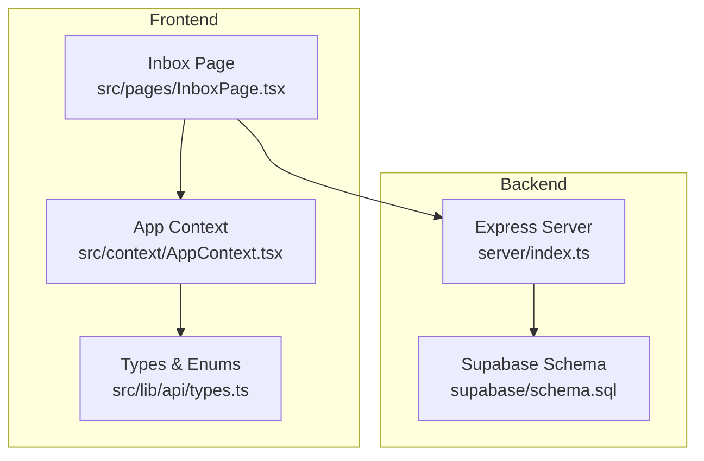
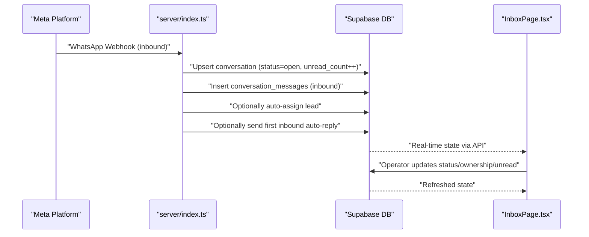
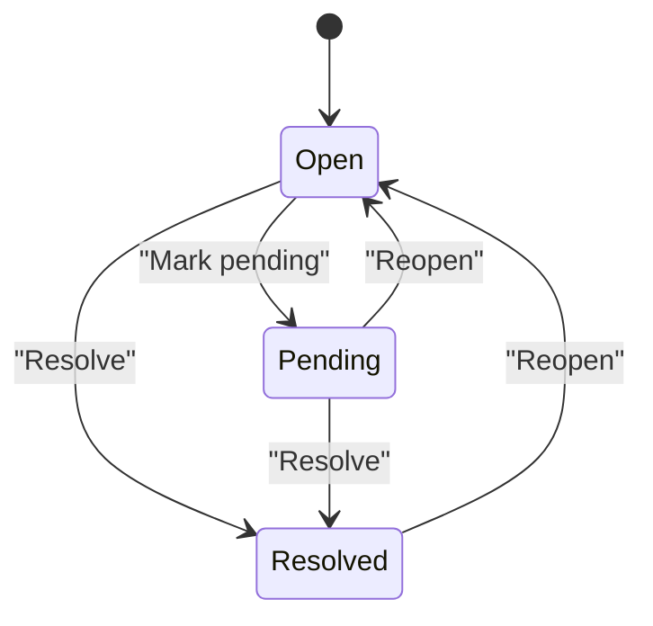
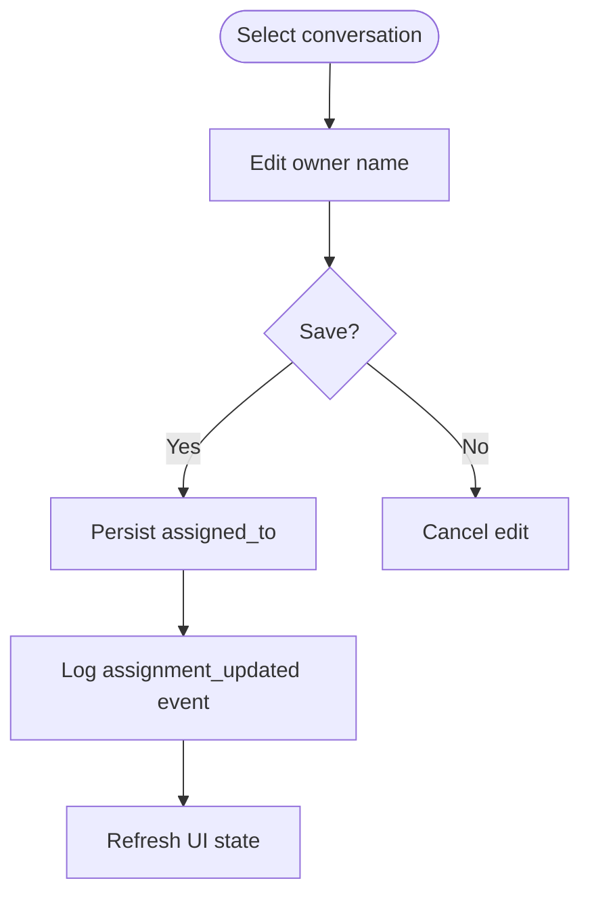
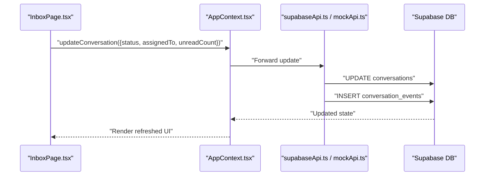
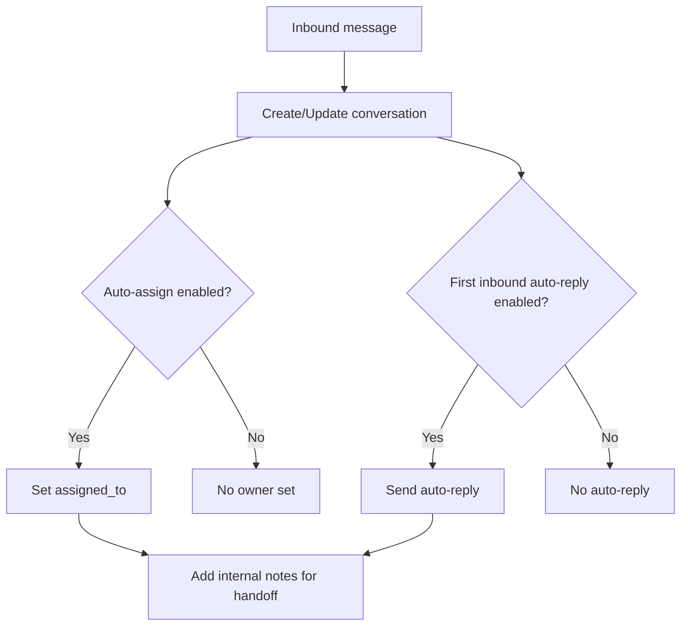
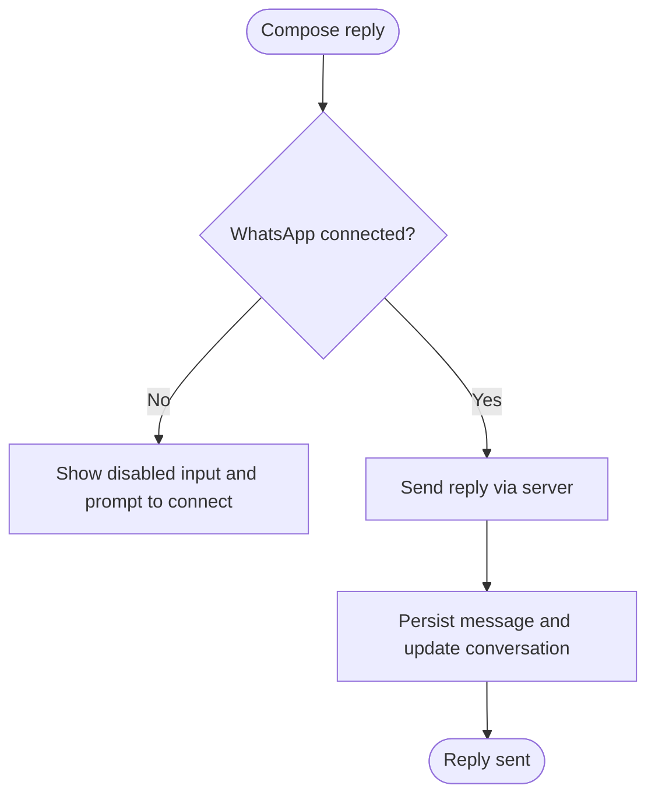
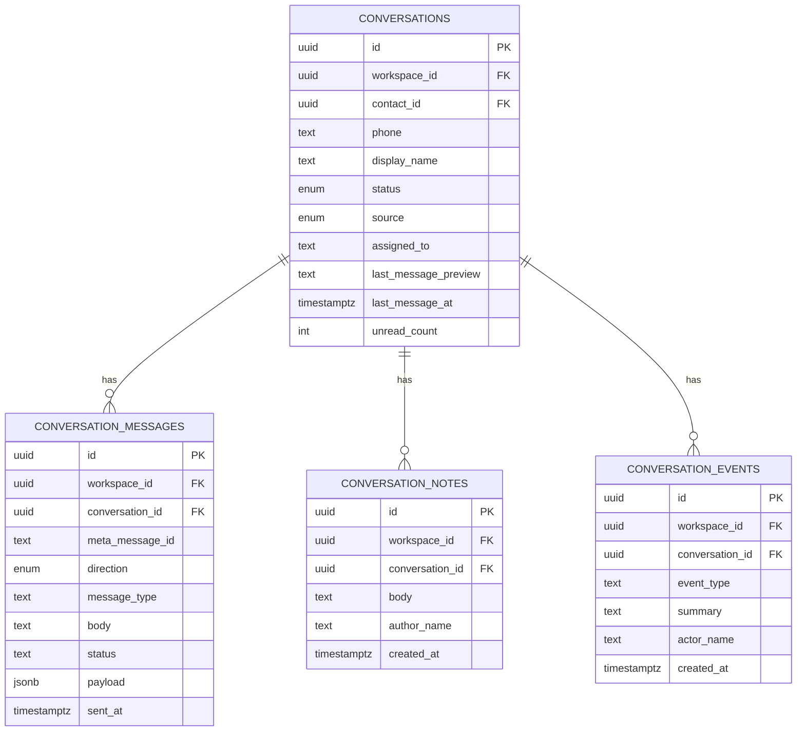
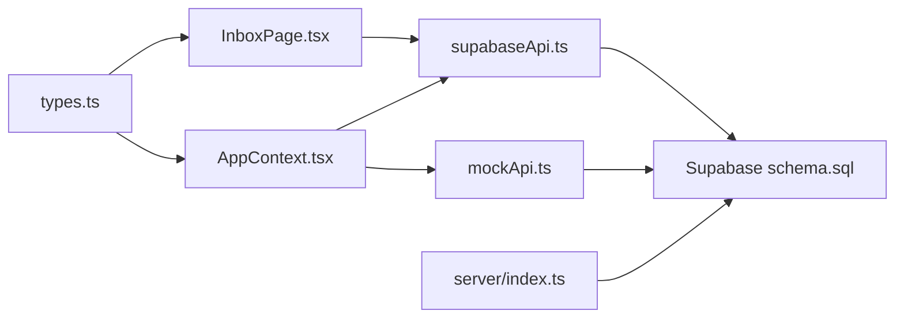

# Conversation Management

<cite>
**Referenced Files in This Document**
- [index.ts](file://server/index.ts)
- [InboxPage.tsx](file://src/pages/InboxPage.tsx)
- [schema.prisma](file://prisma/schema.prisma)
- [init.sql](file://prisma/init.sql)
- [schema.sql](file://supabase/schema.sql)
- [team_inbox_upgrade.sql](file://supabase/team_inbox_upgrade.sql)
- [AppContext.tsx](file://src/context/AppContext.tsx)
- [types.ts](file://src/lib/api/types.ts)
- [supabaseApi.ts](file://src/lib/api/supabaseApi.ts)
- [mockApi.ts](file://src/lib/api/mockApi.ts)
- [status.ts](file://src/lib/meta/status.ts)
</cite>

## Table of Contents
1. [Introduction](#introduction)
2. [Project Structure](#project-structure)
3. [Core Components](#core-components)
4. [Architecture Overview](#architecture-overview)
5. [Detailed Component Analysis](#detailed-component-analysis)
6. [Dependency Analysis](#dependency-analysis)
7. [Performance Considerations](#performance-considerations)
8. [Troubleshooting Guide](#troubleshooting-guide)
9. [Conclusion](#conclusion)

## Introduction
This document explains the Conversation Management subsystem with a focus on the conversation lifecycle, status tracking, and ownership assignment. It covers:
- Conversation statuses (Open, Pending, Resolved) and state transitions
- Assignment mechanism for operators to claim and transfer ownership
- Metadata such as display names, phone numbers, sources, and unread counts
- Update operations for status changes, ownership transfers, and unread count management
- Practical workflows, escalation, and handoffs
- Integration with WhatsApp connection status and reply capability restrictions
- Persistence, real-time updates, and conflict resolution strategies

## Project Structure
Conversation Management spans backend webhook ingestion, database persistence, and frontend UI controls. The key areas are:
- Backend webhook handlers that ingest inbound messages and lead events, persist conversations, and enqueue outbound replies
- Supabase schema defining conversation, message, note, and event tables
- Frontend Inbox page enabling filtering, assignment, status updates, and replies
- API adapters (mock and Supabase) implementing conversation updates and event logging

**Diagram sources**
- [index.ts:1-800](file://server/index.ts#L1-L800)
- [schema.sql:159-206](file://supabase/schema.sql#L159-L206)
- [InboxPage.tsx:1-459](file://src/pages/InboxPage.tsx#L1-L459)
- [AppContext.tsx:1-239](file://src/context/AppContext.tsx#L1-L239)
- [types.ts:18-125](file://src/lib/api/types.ts#L18-L125)

**Section sources**
- [index.ts:1-800](file://server/index.ts#L1-L800)
- [schema.sql:159-206](file://supabase/schema.sql#L159-L206)
- [InboxPage.tsx:1-459](file://src/pages/InboxPage.tsx#L1-L459)
- [AppContext.tsx:1-239](file://src/context/AppContext.tsx#L1-L239)
- [types.ts:18-125](file://src/lib/api/types.ts#L18-L125)

## Core Components
- Conversation entity with fields for status, ownership, source, and unread count
- Conversation message entity capturing inbound/outbound messages and delivery status
- Conversation note and event entities for internal handoff records and audit trails
- Frontend Inbox filters and controls for status, ownership, and unread-only views
- API adapters for mock and Supabase implementations of conversation updates and event logging

Key data model highlights:
- Enumerated statuses: open, pending, resolved
- Enumerated sources: meta_ads, whatsapp_inbound, campaign, manual, organic
- Message directions: inbound, outbound
- Event types: status_updated, assignment_updated, conversation_updated, internal_note_added

**Section sources**
- [schema.sql:8-17](file://supabase/schema.sql#L8-L17)
- [schema.sql:159-173](file://supabase/schema.sql#L159-L173)
- [schema.sql:175-187](file://supabase/schema.sql#L175-L187)
- [schema.sql:198-206](file://supabase/schema.sql#L198-L206)
- [types.ts:18-125](file://src/lib/api/types.ts#L18-L125)

## Architecture Overview
The conversation lifecycle integrates inbound webhooks, automatic assignment and replies, and operator-driven updates.

**Diagram sources**
- [index.ts:407-629](file://server/index.ts#L407-L629)
- [schema.sql:159-173](file://supabase/schema.sql#L159-L173)
- [schema.sql:175-187](file://supabase/schema.sql#L175-L187)
- [InboxPage.tsx:71-88](file://src/pages/InboxPage.tsx#L71-L88)

## Detailed Component Analysis

### Conversation Status System and Transitions
- Status values: Open, Pending, Resolved
- Transitions are initiated by operators via the Inbox UI and persisted to the database
- The UI exposes actions to mark Pending and Resolved, and to reopen Resolved to Open
- Events are logged for status changes

**Diagram sources**
- [InboxPage.tsx:296-324](file://src/pages/InboxPage.tsx#L296-L324)
- [supabaseApi.ts:668-708](file://src/lib/api/supabaseApi.ts#L668-L708)
- [mockApi.ts:269-306](file://src/lib/api/mockApi.ts#L269-L306)

**Section sources**
- [InboxPage.tsx:296-324](file://src/pages/InboxPage.tsx#L296-L324)
- [supabaseApi.ts:668-708](file://src/lib/api/supabaseApi.ts#L668-L708)
- [mockApi.ts:269-306](file://src/lib/api/mockApi.ts#L269-L306)

### Ownership Assignment Mechanism
- Operators can assign ownership by entering an owner name and saving
- Unassigned state is supported by clearing the owner field
- Filtering supports “Mine” and “Unassigned” views
- Auto-assignment can be configured via automation rules

**Diagram sources**
- [InboxPage.tsx:278-326](file://src/pages/InboxPage.tsx#L278-L326)
- [supabaseApi.ts:668-708](file://src/lib/api/supabaseApi.ts#L668-L708)
- [mockApi.ts:269-306](file://src/lib/api/mockApi.ts#L269-L306)

**Section sources**
- [InboxPage.tsx:278-326](file://src/pages/InboxPage.tsx#L278-L326)
- [supabaseApi.ts:668-708](file://src/lib/api/supabaseApi.ts#L668-L708)
- [mockApi.ts:269-306](file://src/lib/api/mockApi.ts#L269-L306)

### Conversation Metadata
- Fields include display_name, phone, status, source, assigned_to, last_message_preview, last_message_at, unread_count
- Sources include Meta Ads, WhatsApp Inbound, Campaign, Manual, Organic
- These fields are populated during inbound webhook ingestion and updated on operator actions

**Section sources**
- [schema.sql:159-173](file://supabase/schema.sql#L159-L173)
- [index.ts:421-449](file://server/index.ts#L421-L449)

### Update Operations
- Status changes, ownership transfers, and unread count resets are performed via API adapters
- Events are inserted to record the change and who performed it
- Both mock and Supabase adapters implement the same contract

**Diagram sources**
- [InboxPage.tsx:71-88](file://src/pages/InboxPage.tsx#L71-L88)
- [AppContext.tsx:151-154](file://src/context/AppContext.tsx#L151-L154)
- [supabaseApi.ts:668-708](file://src/lib/api/supabaseApi.ts#L668-L708)
- [mockApi.ts:269-306](file://src/lib/api/mockApi.ts#L269-L306)

**Section sources**
- [InboxPage.tsx:71-88](file://src/pages/InboxPage.tsx#L71-L88)
- [AppContext.tsx:151-154](file://src/context/AppContext.tsx#L151-L154)
- [supabaseApi.ts:668-708](file://src/lib/api/supabaseApi.ts#L668-L708)
- [mockApi.ts:269-306](file://src/lib/api/mockApi.ts#L269-L306)

### Practical Workflows and Escalation
- First-inbound auto-reply: Sent automatically when a new conversation is created and a rule is enabled
- Auto-assignment: New leads can be assigned to a configured owner upon creation
- Handoff notes: Internal notes capture escalation details and follow-up instructions
- Pending follow-ups: Conversations can be moved to Pending to track follow-up reminders

**Diagram sources**
- [index.ts:407-629](file://server/index.ts#L407-L629)
- [index.ts:502-534](file://server/index.ts#L502-L534)
- [index.ts:542-613](file://server/index.ts#L542-L613)
- [InboxPage.tsx:327-378](file://src/pages/InboxPage.tsx#L327-L378)

**Section sources**
- [index.ts:407-629](file://server/index.ts#L407-L629)
- [index.ts:502-534](file://server/index.ts#L502-L534)
- [index.ts:542-613](file://server/index.ts#L542-L613)
- [InboxPage.tsx:327-378](file://src/pages/InboxPage.tsx#L327-L378)

### Reply Capability and WhatsApp Integration
- Reply capability is gated by WhatsApp connection status and phone number availability
- The UI disables the reply input and sends button when not connected
- Authorization status impacts whether outbound replies can be sent

**Diagram sources**
- [InboxPage.tsx:116-154](file://src/pages/InboxPage.tsx#L116-L154)
- [status.ts:1-84](file://src/lib/meta/status.ts#L1-L84)

**Section sources**
- [InboxPage.tsx:116-154](file://src/pages/InboxPage.tsx#L116-L154)
- [status.ts:1-84](file://src/lib/meta/status.ts#L1-L84)

### Persistence, Real-Time Updates, and Conflict Resolution
- Conversations, messages, notes, and events are persisted in Supabase tables
- The frontend hydrates state on load and refreshes on auth changes
- Events table records operator actions for auditability
- Conflict resolution is implicit through upserts and normalized updates

**Diagram sources**
- [schema.sql:159-173](file://supabase/schema.sql#L159-L173)
- [schema.sql:175-187](file://supabase/schema.sql#L175-L187)
- [schema.sql:189-206](file://supabase/schema.sql#L189-L206)

**Section sources**
- [schema.sql:159-173](file://supabase/schema.sql#L159-L173)
- [schema.sql:175-187](file://supabase/schema.sql#L175-L187)
- [schema.sql:189-206](file://supabase/schema.sql#L189-L206)
- [AppContext.tsx:64-98](file://src/context/AppContext.tsx#L64-L98)

## Dependency Analysis
- Backend depends on Supabase for persistence and Meta APIs for outbound messaging
- Frontend depends on AppContext for state and API adapters for updates
- Types define shared contracts for status, direction, and entities

**Diagram sources**
- [types.ts:18-125](file://src/lib/api/types.ts#L18-L125)
- [InboxPage.tsx:1-459](file://src/pages/InboxPage.tsx#L1-L459)
- [AppContext.tsx:1-239](file://src/context/AppContext.tsx#L1-L239)
- [supabaseApi.ts:1-200](file://src/lib/api/supabaseApi.ts#L1-L200)
- [mockApi.ts:269-355](file://src/lib/api/mockApi.ts#L269-L355)
- [schema.sql:159-206](file://supabase/schema.sql#L159-L206)
- [index.ts:1-800](file://server/index.ts#L1-L800)

**Section sources**
- [types.ts:18-125](file://src/lib/api/types.ts#L18-L125)
- [InboxPage.tsx:1-459](file://src/pages/InboxPage.tsx#L1-L459)
- [AppContext.tsx:1-239](file://src/context/AppContext.tsx#L1-L239)
- [supabaseApi.ts:1-200](file://src/lib/api/supabaseApi.ts#L1-L200)
- [mockApi.ts:269-355](file://src/lib/api/mockApi.ts#L269-L355)
- [schema.sql:159-206](file://supabase/schema.sql#L159-L206)
- [index.ts:1-800](file://server/index.ts#L1-L800)

## Performance Considerations
- Minimize repeated reads/writes by batching UI updates and debouncing filters
- Use indexed fields (workspace_id, conversation_id) for queries
- Limit event log volume by consolidating frequent updates where appropriate
- Cache frequently accessed conversation metadata in memory on the client

## Troubleshooting Guide
Common issues and resolutions:
- Outbound replies fail: Verify WhatsApp connection status and authorization status; reconnect if needed
- Auto-reply not sent: Confirm automation rule is enabled and properly configured
- Assignment not sticking: Ensure the owner name is saved and the update completes without errors
- Stale UI after update: Trigger a refresh to pull latest state from the API

**Section sources**
- [InboxPage.tsx:116-154](file://src/pages/InboxPage.tsx#L116-L154)
- [status.ts:1-84](file://src/lib/meta/status.ts#L1-L84)
- [supabaseApi.ts:668-708](file://src/lib/api/supabaseApi.ts#L668-L708)

## Conclusion
Conversation Management provides a robust foundation for handling multi-operator workflows on WhatsApp. It supports clear status transitions, flexible ownership assignment, rich metadata, and integrated audit trails. The system balances automation with operator control, ensuring scalable and reliable customer engagement while maintaining transparency through events and notes.