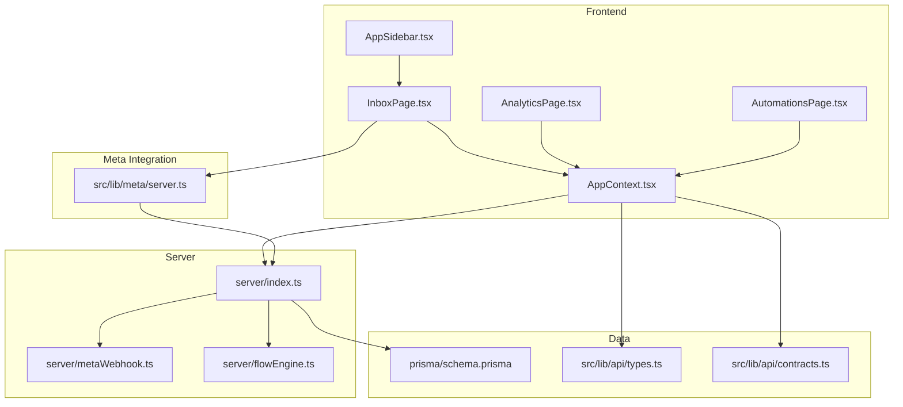
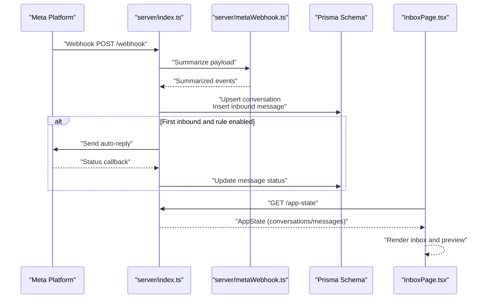
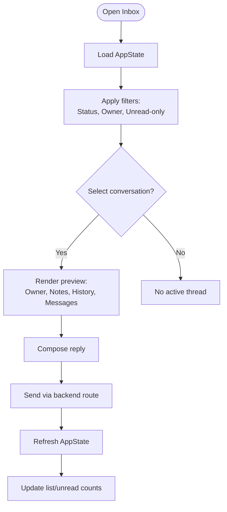
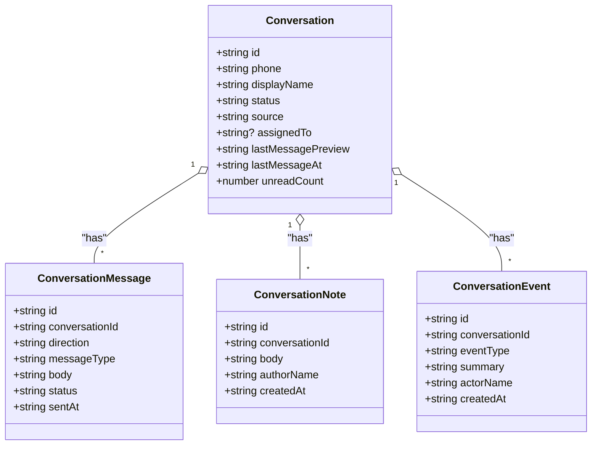
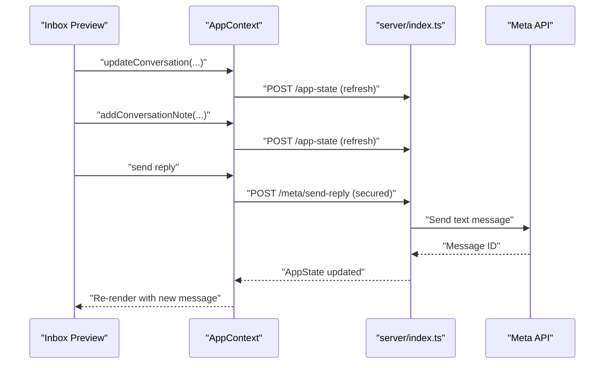
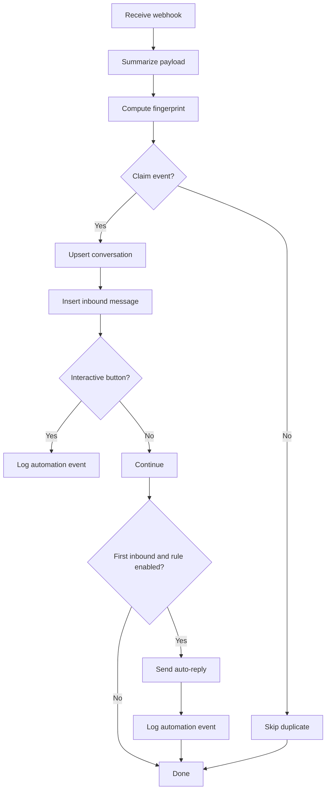
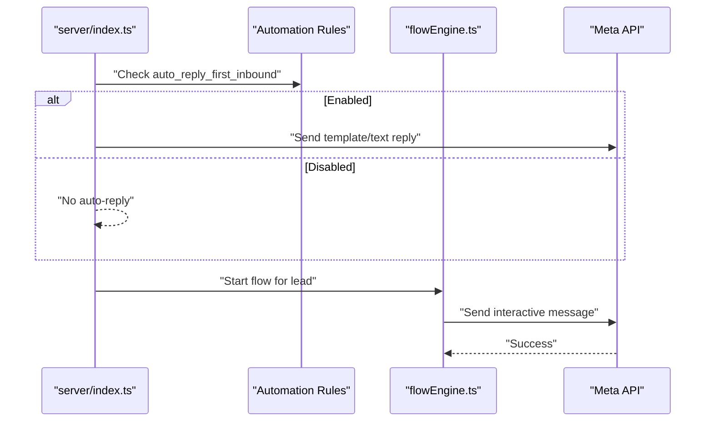
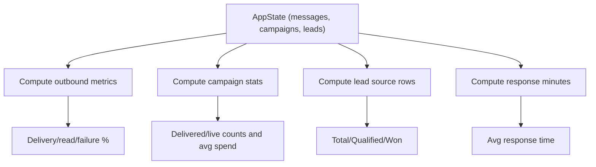
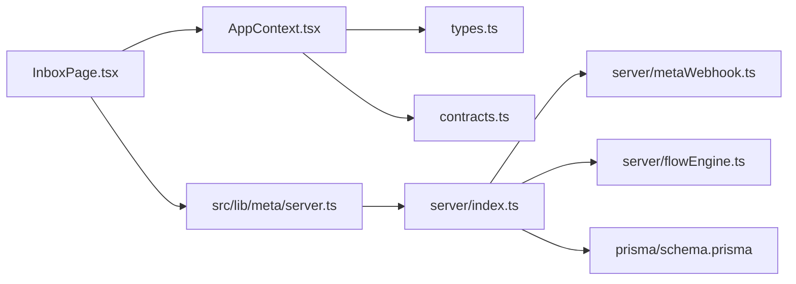

# Inbox & Conversations

<cite>
**Referenced Files in This Document**
- [InboxPage.tsx](file://src/pages/InboxPage.tsx)
- [AppContext.tsx](file://src/context/AppContext.tsx)
- [AppSidebar.tsx](file://src/components/AppSidebar.tsx)
- [AnalyticsPage.tsx](file://src/pages/AnalyticsPage.tsx)
- [AutomationsPage.tsx](file://src/pages/AutomationsPage.tsx)
- [index.ts](file://server/index.ts)
- [metaWebhook.ts](file://server/metaWebhook.ts)
- [flowEngine.ts](file://server/flowEngine.ts)
- [server.ts](file://src/lib/meta/server.ts)
- [schema.prisma](file://prisma/schema.prisma)
- [types.ts](file://src/lib/api/types.ts)
- [contracts.ts](file://src/lib/api/contracts.ts)
</cite>

## Table of Contents
1. [Introduction](#introduction)
2. [Project Structure](#project-structure)
3. [Core Components](#core-components)
4. [Architecture Overview](#architecture-overview)
5. [Detailed Component Analysis](#detailed-component-analysis)
6. [Dependency Analysis](#dependency-analysis)
7. [Performance Considerations](#performance-considerations)
8. [Troubleshooting Guide](#troubleshooting-guide)
9. [Conclusion](#conclusion)
10. [Appendices](#appendices)

## Introduction
This document explains the Inbox and Conversation Management system with a focus on the real-time chat interface, conversation handling, message composition, and analytics. It covers:
- Inbox interface design: conversation lists, search/filtering, sorting, and selection
- Conversation management: threading, participant/ownership, notes, and status tracking
- Message composition: reply composition, outbound sending, and template/campaign integration
- Real-time communication: webhook ingestion, deduplication, and delivery confirmation
- Analytics and quality signals: delivery/read rates, response times, and spend efficiency
- Practical workflows: automated first replies, reminders, and handoffs between AI and human agents

## Project Structure
The system comprises:
- Frontend pages and UI for inbox, analytics, automations, and navigation
- Application state management and API adapters
- Server-side webhook handlers, automation engine, and Meta integration
- Prisma schema modeling conversations, messages, leads, and automations

**Diagram sources**
- [InboxPage.tsx:1-459](file://src/pages/InboxPage.tsx#L1-L459)
- [AnalyticsPage.tsx:1-269](file://src/pages/AnalyticsPage.tsx#L1-L269)
- [AutomationsPage.tsx:1-336](file://src/pages/AutomationsPage.tsx#L1-L336)
- [AppContext.tsx:1-193](file://src/context/AppContext.tsx#L1-L193)
- [AppSidebar.tsx:1-142](file://src/components/AppSidebar.tsx#L1-L142)
- [index.ts:1-800](file://server/index.ts#L1-L800)
- [metaWebhook.ts:1-161](file://server/metaWebhook.ts#L1-L161)
- [flowEngine.ts:1-260](file://server/flowEngine.ts#L1-L260)
- [server.ts:1-148](file://src/lib/meta/server.ts#L1-L148)
- [schema.prisma:1-189](file://prisma/schema.prisma#L1-L189)
- [types.ts:1-299](file://src/lib/api/types.ts#L1-L299)
- [contracts.ts:1-156](file://src/lib/api/contracts.ts#L1-L156)

**Section sources**
- [InboxPage.tsx:1-459](file://src/pages/InboxPage.tsx#L1-L459)
- [AppContext.tsx:1-193](file://src/context/AppContext.tsx#L1-L193)
- [index.ts:1-800](file://server/index.ts#L1-L800)

## Core Components
- Inbox page: renders conversation list, filters, selection, and conversation preview with messages, notes, and actions
- App context: centralizes state hydration, actions (update conversation, add note, refresh), and API bindings
- Analytics page: computes delivery/read/failure rates, campaign stats, lead source performance, and response time
- Automations page: manages automation rules (first reply, assignment, reminders, follow-ups) and runs sweeps
- Server webhook handler: ingests Meta webhooks, deduplicates events, creates/updates conversations, persists messages, and triggers automation
- Flow engine: orchestrates custom workflows for leads (interactive messages, tagging, waits)
- Meta server helpers: secure backend routes for template, campaign, and inbox reply sends

**Section sources**
- [InboxPage.tsx:1-459](file://src/pages/InboxPage.tsx#L1-L459)
- [AppContext.tsx:1-193](file://src/context/AppContext.tsx#L1-L193)
- [AnalyticsPage.tsx:1-269](file://src/pages/AnalyticsPage.tsx#L1-L269)
- [AutomationsPage.tsx:1-336](file://src/pages/AutomationsPage.tsx#L1-L336)
- [index.ts:1-800](file://server/index.ts#L1-L800)
- [flowEngine.ts:1-260](file://server/flowEngine.ts#L1-L260)
- [server.ts:1-148](file://src/lib/meta/server.ts#L1-L148)

## Architecture Overview
High-level flow:
- Meta sends inbound messages and status updates to the server webhook endpoint
- Server deduplicates incoming events, upserts conversations, persists messages, and optionally auto-replies
- Frontend hydrates state and displays the inbox with filtered/sorted conversations
- Operators compose replies via the inbox, which are sent through backend routes secured by session tokens
- Analytics compute delivery/read/failure rates and lead/source metrics
- Automations enforce first replies, ownership assignment, reminders, and follow-ups

**Diagram sources**
- [index.ts:369-629](file://server/index.ts#L369-L629)
- [metaWebhook.ts:111-160](file://server/metaWebhook.ts#L111-L160)
- [schema.prisma:108-175](file://prisma/schema.prisma#L108-L175)
- [InboxPage.tsx:1-459](file://src/pages/InboxPage.tsx#L1-L459)

## Detailed Component Analysis

### Inbox Interface Design
- Filters and sorting:
  - Status filter (All/Open/Pending/Resolved)
  - Owner filter (All/Mine/Unassigned)
  - Unread-only toggle
- Conversation list:
  - Displays customer name, phone, last message preview, status, source, unread count
  - Selection highlights active conversation and clears unread count on open
- Conversation preview:
  - Customer info, phone, assigned owner
  - Actions: assign owner, mark pending, reopen/resolved
  - Internal notes section with add/save
  - Conversation history/events
  - Message thread rendering with direction and timestamps/status
  - Reply composer with placeholder guidance and send button

**Diagram sources**
- [InboxPage.tsx:36-58](file://src/pages/InboxPage.tsx#L36-L58)
- [InboxPage.tsx:216-259](file://src/pages/InboxPage.tsx#L216-L259)
- [InboxPage.tsx:268-422](file://src/pages/InboxPage.tsx#L268-L422)
- [InboxPage.tsx:116-154](file://src/pages/InboxPage.tsx#L116-L154)

**Section sources**
- [InboxPage.tsx:182-261](file://src/pages/InboxPage.tsx#L182-L261)
- [InboxPage.tsx:263-424](file://src/pages/InboxPage.tsx#L263-L424)

### Conversation Management
- Threading:
  - Messages grouped by conversationId, ordered by sentAt
  - Direction (Inbound/Outbound) and status (e.g., received/sent/delivered/read)
- Participant management:
  - Owner assignment via update action
  - Auto-assignment rule for new leads
- Conversation notes:
  - Internal notes appended with author and timestamp
- Status tracking:
  - Open/Pending/Resolved transitions with event logging

**Diagram sources**
- [types.ts:114-152](file://src/lib/api/types.ts#L114-L152)
- [schema.prisma:108-175](file://prisma/schema.prisma#L108-L175)

**Section sources**
- [types.ts:114-152](file://src/lib/api/types.ts#L114-L152)
- [InboxPage.tsx:58-61](file://src/pages/InboxPage.tsx#L58-L61)
- [InboxPage.tsx:297-324](file://src/pages/InboxPage.tsx#L297-L324)
- [InboxPage.tsx:334-357](file://src/pages/InboxPage.tsx#L334-L357)

### Message Composition and Outbound Replies
- Composition:
  - Textarea for reply body with placeholder guidance
  - Disabled when WhatsApp is not connected or sending
- Outbound sending:
  - Uses backend route secured by session token
  - On success, refreshes state and clears composer
  - On failure, shows error toast

**Diagram sources**
- [InboxPage.tsx:116-154](file://src/pages/InboxPage.tsx#L116-L154)
- [server.ts:116-147](file://src/lib/meta/server.ts#L116-L147)
- [index.ts:369-629](file://server/index.ts#L369-L629)

**Section sources**
- [InboxPage.tsx:399-417](file://src/pages/InboxPage.tsx#L399-L417)
- [server.ts:116-147](file://src/lib/meta/server.ts#L116-L147)

### Webhook Processing, Deduplication, and Delivery Confirmation
- Deduplication:
  - Event fingerprint computed and inserted into processed events table
  - Duplicate fingerprints are rejected to prevent reprocessing
- Inbound handling:
  - Upserts conversation with incremental unread count
  - Inserts inbound message with received status
  - Logs automation events for interactive button clicks
- Auto-reply:
  - On first inbound, resolves template placeholders and sends outbound reply
  - Updates conversation preview and logs automation events
- Status callbacks:
  - Updates message status based on webhook status updates

**Diagram sources**
- [index.ts:319-342](file://server/index.ts#L319-L342)
- [index.ts:407-629](file://server/index.ts#L407-L629)
- [metaWebhook.ts:111-160](file://server/metaWebhook.ts#L111-L160)

**Section sources**
- [index.ts:319-342](file://server/index.ts#L319-L342)
- [index.ts:407-629](file://server/index.ts#L407-L629)
- [metaWebhook.ts:111-160](file://server/metaWebhook.ts#L111-L160)

### Automated Responses and Handoff Procedures
- First inbound auto-reply:
  - Rule-driven with templated message and placeholders
  - Sends outbound reply and updates conversation preview
- Lead handoff:
  - Custom workflows orchestrate tagging, waits, and interactive messages
  - Supports joining groups or follow-up steps after initial contact

**Diagram sources**
- [index.ts:537-613](file://server/index.ts#L537-L613)
- [flowEngine.ts:32-75](file://server/flowEngine.ts#L32-L75)
- [flowEngine.ts:230-259](file://server/flowEngine.ts#L230-L259)

**Section sources**
- [index.ts:537-613](file://server/index.ts#L537-L613)
- [flowEngine.ts:32-75](file://server/flowEngine.ts#L32-L75)
- [flowEngine.ts:230-259](file://server/flowEngine.ts#L230-L259)

### Analytics and Quality Assurance
- Metrics:
  - Delivery/read/failure rates for outbound messages
  - Campaign delivery and spend averages
  - Lead source performance (total, qualified, won)
  - Average response time from inbound to first outbound reply
- Quality signals:
  - Operational logs and failed send logs for diagnostics
  - Automation events for auditability

**Diagram sources**
- [AnalyticsPage.tsx:15-73](file://src/pages/AnalyticsPage.tsx#L15-L73)
- [AnalyticsPage.tsx:130-202](file://src/pages/AnalyticsPage.tsx#L130-L202)

**Section sources**
- [AnalyticsPage.tsx:1-269](file://src/pages/AnalyticsPage.tsx#L1-L269)
- [types.ts:154-173](file://src/lib/api/types.ts#L154-L173)

### Navigation and Context
- Sidebar navigation to Inbox, Analytics, Automations, and other sections
- App context provides centralized state and actions for all pages

**Section sources**
- [AppSidebar.tsx:1-142](file://src/components/AppSidebar.tsx#L1-L142)
- [AppContext.tsx:1-193](file://src/context/AppContext.tsx#L1-L193)

## Dependency Analysis
- Frontend depends on AppContext for state and actions
- AppContext delegates to API adapters (HTTP/SUPABASE/MOCK) and exposes typed contracts
- Server integrates Meta webhook summarization, deduplication, and automation
- Data model supports conversations, messages, leads, templates, campaigns, and logs

**Diagram sources**
- [InboxPage.tsx:1-459](file://src/pages/InboxPage.tsx#L1-L459)
- [AppContext.tsx:1-193](file://src/context/AppContext.tsx#L1-L193)
- [types.ts:1-299](file://src/lib/api/types.ts#L1-L299)
- [contracts.ts:1-156](file://src/lib/api/contracts.ts#L1-L156)
- [server.ts:1-148](file://src/lib/meta/server.ts#L1-L148)
- [index.ts:1-800](file://server/index.ts#L1-L800)
- [metaWebhook.ts:1-161](file://server/metaWebhook.ts#L1-L161)
- [flowEngine.ts:1-260](file://server/flowEngine.ts#L1-L260)
- [schema.prisma:1-189](file://prisma/schema.prisma#L1-L189)

**Section sources**
- [AppContext.tsx:1-193](file://src/context/AppContext.tsx#L1-L193)
- [index.ts:1-800](file://server/index.ts#L1-L800)

## Performance Considerations
- Deduplication reduces redundant processing and prevents duplicate replies
- Incremental unread counters minimize UI churn and improve responsiveness
- Batched state refresh after send/reply operations avoids partial renders
- Automation rules and workflow nodes are designed to be lightweight and retryable

## Troubleshooting Guide
- WhatsApp not connected:
  - UI blocks reply composition and shows guidance
- Send failures:
  - Error toast with message; check authorization and connection status
  - Server logs failed sends and operational events for diagnostics
- Automation failures:
  - Review automation events and logs; sweeps can be re-run to flag overdue conversations

**Section sources**
- [InboxPage.tsx:126-154](file://src/pages/InboxPage.tsx#L126-L154)
- [index.ts:277-317](file://server/index.ts#L277-L317)
- [index.ts:196-217](file://server/index.ts#L196-L217)

## Conclusion
The Inbox and Conversation Management system integrates a real-time webhook pipeline, robust conversation threading, operator-friendly composition tools, and comprehensive analytics. Automation rules and custom workflows enable scalable first replies, lead routing, reminders, and handoffs—supporting efficient AI-to-human agent transitions while maintaining quality and observability.

## Appendices

### Practical Examples

- Automated first reply on inbound:
  - Enable rule and configure message template with placeholders
  - On first inbound, system sends auto-reply and updates conversation preview

- Reminder sweep:
  - Configure “no-reply reminder” hours
  - Run sweep to flag overdue conversations and log automation events

- Handoff to human agent:
  - Use automation events to trigger custom workflows
  - Assign ownership and mark status as Pending for follow-up

- Campaign vs. support balance:
  - Monitor message mix and delivery/read rates
  - Adjust campaign spend and template approval to optimize outcomes

[No sources needed since this section provides general guidance]