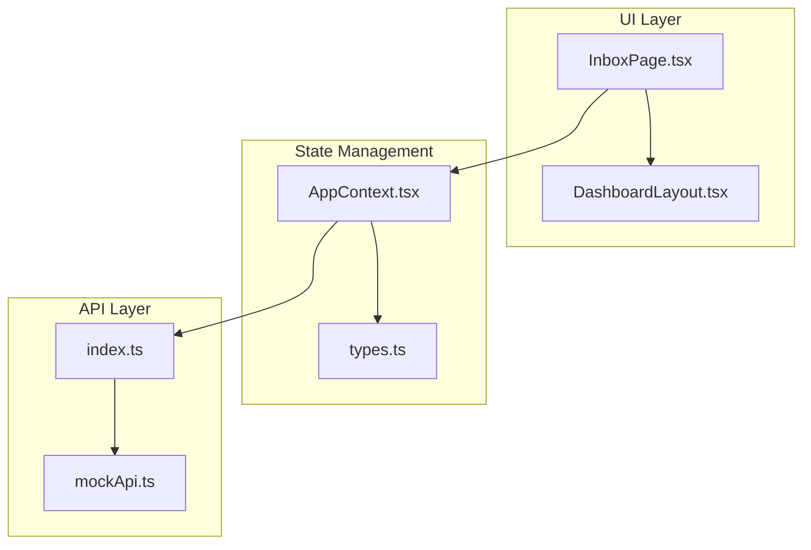
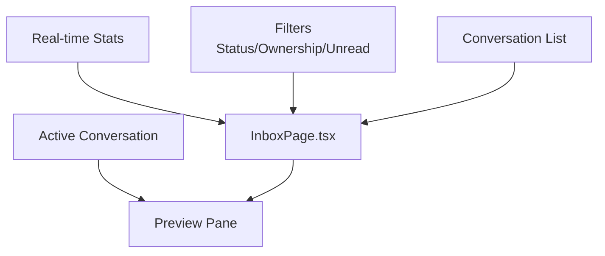
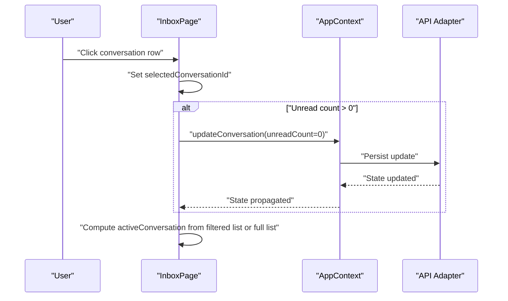
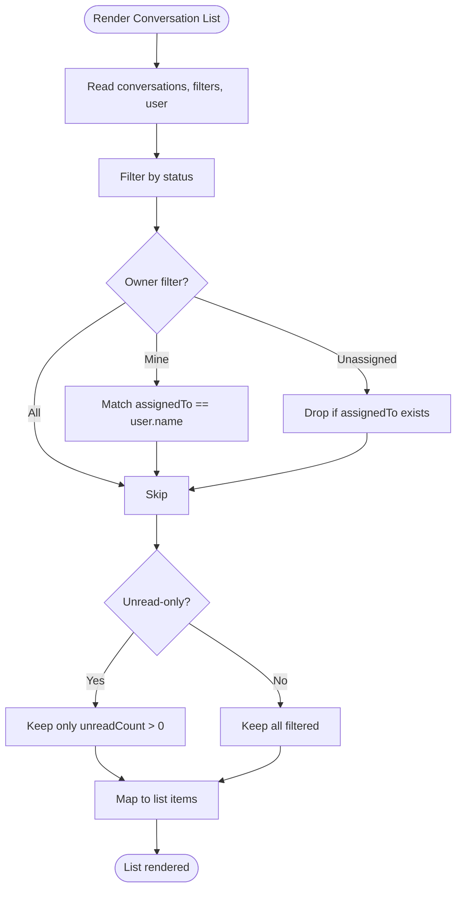
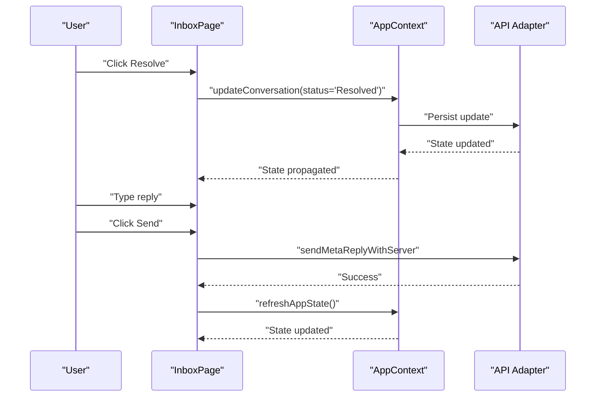
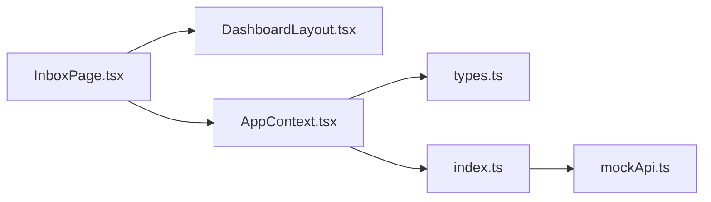

# Inbox Interface & Navigation

<cite>
**Referenced Files in This Document**
- [InboxPage.tsx](file://src/pages/InboxPage.tsx)
- [DashboardLayout.tsx](file://src/components/DashboardLayout.tsx)
- [AppContext.tsx](file://src/context/AppContext.tsx)
- [types.ts](file://src/lib/api/types.ts)
- [mockApi.ts](file://src/lib/api/mockApi.ts)
- [use-mobile.tsx](file://src/hooks/use-mobile.tsx)
- [index.ts](file://src/lib/api/index.ts)
</cite>

## Table of Contents
1. [Introduction](#introduction)
2. [Project Structure](#project-structure)
3. [Core Components](#core-components)
4. [Architecture Overview](#architecture-overview)
5. [Detailed Component Analysis](#detailed-component-analysis)
6. [Dependency Analysis](#dependency-analysis)
7. [Performance Considerations](#performance-considerations)
8. [Troubleshooting Guide](#troubleshooting-guide)
9. [Conclusion](#conclusion)

## Introduction
This document describes the Inbox Interface and Navigation system, focusing on the two-panel layout architecture with a conversation list sidebar and an active conversation preview pane. It explains the filtering mechanisms (status, ownership, unread-only), conversation selection and auto-selection logic, state management for active conversations, and real-time statistics. Practical navigation workflows, responsive design considerations, and performance optimization strategies for large conversation lists are also covered.

## Project Structure
The Inbox feature is implemented as a page component that composes reusable UI and layout components. The page consumes application state via a context provider and integrates with API adapters for data persistence and updates.

**Diagram sources**
- [InboxPage.tsx:1-459](file://src/pages/InboxPage.tsx#L1-L459)
- [DashboardLayout.tsx:1-37](file://src/components/DashboardLayout.tsx#L1-L37)
- [AppContext.tsx:1-239](file://src/context/AppContext.tsx#L1-L239)
- [types.ts:114-152](file://src/lib/api/types.ts#L114-L152)
- [index.ts:1-23](file://src/lib/api/index.ts#L1-L23)
- [mockApi.ts:122-190](file://src/lib/api/mockApi.ts#L122-L190)

**Section sources**
- [InboxPage.tsx:1-459](file://src/pages/InboxPage.tsx#L1-L459)
- [DashboardLayout.tsx:1-37](file://src/components/DashboardLayout.tsx#L1-L37)
- [AppContext.tsx:1-239](file://src/context/AppContext.tsx#L1-L239)
- [types.ts:114-152](file://src/lib/api/types.ts#L114-L152)
- [index.ts:1-23](file://src/lib/api/index.ts#L1-L23)
- [mockApi.ts:122-190](file://src/lib/api/mockApi.ts#L122-L190)

## Core Components
- InboxPage: Implements the two-panel layout, filtering controls, conversation list rendering, active conversation preview, and action handlers for updates and replies.
- DashboardLayout: Provides the shared layout with sidebar, header, and main content area.
- AppContext: Centralizes application state hydration, subscriptions, and actions for updating conversations and notes.
- Types: Defines data contracts for conversations, messages, notes, and events.
- API Adapter: Selects between mock, HTTP, or Supabase adapters at runtime.
- Mobile Hook: Supplies a responsive breakpoint for mobile adaptations.

Key responsibilities:
- Filtering: Status (All/Open/Pending/Resolved), Ownership (All/Mine/Unassigned), Unread-only toggle.
- Selection: Single active conversation with auto-selection from filtered results.
- Preview: Customer info, assignment controls, internal notes, conversation history, message timeline, and reply composer.
- Stats: Open conversations, unread messages, lead-linked chats.

**Section sources**
- [InboxPage.tsx:9-428](file://src/pages/InboxPage.tsx#L9-L428)
- [DashboardLayout.tsx:5-36](file://src/components/DashboardLayout.tsx#L5-L36)
- [AppContext.tsx:100-226](file://src/context/AppContext.tsx#L100-L226)
- [types.ts:114-152](file://src/lib/api/types.ts#L114-L152)
- [index.ts:13-23](file://src/lib/api/index.ts#L13-L23)
- [use-mobile.tsx:1-20](file://src/hooks/use-mobile.tsx#L1-L20)

## Architecture Overview
The Inbox renders a grid with two panels:
- Left panel: Filterable conversation list with selection logic and unread indicators.
- Right panel: Active conversation preview with assignment, notes, events, message history, and reply composer.

**Diagram sources**
- [InboxPage.tsx:174-260](file://src/pages/InboxPage.tsx#L174-L260)
- [InboxPage.tsx:263-423](file://src/pages/InboxPage.tsx#L263-L423)

## Detailed Component Analysis

### Two-Panel Layout and Navigation
- Layout: Responsive grid with left sidebar (conversation list) and right preview pane.
- Navigation: Clicking a conversation row selects it and clears unread count if present.
- Auto-selection: If no active conversation exists, the first filtered conversation becomes active; otherwise falls back to the first conversation.

**Diagram sources**
- [InboxPage.tsx:216-256](file://src/pages/InboxPage.tsx#L216-L256)
- [InboxPage.tsx:54-57](file://src/pages/InboxPage.tsx#L54-L57)
- [AppContext.tsx:151-154](file://src/context/AppContext.tsx#L151-L154)
- [mockApi.ts:269-296](file://src/lib/api/mockApi.ts#L269-L296)

**Section sources**
- [InboxPage.tsx:182-260](file://src/pages/InboxPage.tsx#L182-L260)
- [InboxPage.tsx:54-57](file://src/pages/InboxPage.tsx#L54-L57)

### Conversation Filtering System
- Status filter: "All", "Open", "Pending", "Resolved".
- Ownership filter: "All", "Mine", "Unassigned".
- Unread-only toggle: Boolean flag to hide read conversations.
- Filtering logic: Computed via useMemo over conversations and applied to the list rendering.

**Diagram sources**
- [InboxPage.tsx:36-52](file://src/pages/InboxPage.tsx#L36-L52)

**Section sources**
- [InboxPage.tsx:188-212](file://src/pages/InboxPage.tsx#L188-L212)
- [InboxPage.tsx:36-52](file://src/pages/InboxPage.tsx#L36-L52)

### Active Conversation Preview and Controls
- Preview area displays customer identity, phone, assignment, and source.
- Assignment controls: Edit owner, mark pending, reopen/resolved transitions.
- Internal notes: Add and view notes with author and timestamps.
- Events: View conversation history with actor and timestamps.
- Messages: Render inbound/outbound messages with timestamps and statuses.
- Reply composer: Send outbound replies via connected WhatsApp number.

**Diagram sources**
- [InboxPage.tsx:287-324](file://src/pages/InboxPage.tsx#L287-L324)
- [InboxPage.tsx:116-154](file://src/pages/InboxPage.tsx#L116-L154)
- [AppContext.tsx:182-185](file://src/context/AppContext.tsx#L182-L185)
- [mockApi.ts:269-296](file://src/lib/api/mockApi.ts#L269-L296)

**Section sources**
- [InboxPage.tsx:263-423](file://src/pages/InboxPage.tsx#L263-L423)

### Real-time Statistics Display
- Open conversations: Count of items with status "Open".
- Unread messages: Sum of unreadCount across all conversations.
- Lead-linked chats: Count of items where source is "Meta Ads" or "WhatsApp Inbound".

These stats update reactively as the conversation list changes.

**Section sources**
- [InboxPage.tsx:174-176](file://src/pages/InboxPage.tsx#L174-L176)

### Practical Navigation Workflows and UX Patterns
- Workflow 1: Filter by "Mine" and "Unread only" to focus on personal, unread threads; click a thread to open and clear unread.
- Workflow 2: Assign ownership ("Save owner"), mark "Pending follow-up", then resolve after handling.
- Workflow 3: Add internal notes for handoffs, then review conversation history and message timeline.
- Workflow 4: Reply from the inbox using the connected WhatsApp number; the system validates connection and shows progress.

**Section sources**
- [InboxPage.tsx:188-212](file://src/pages/InboxPage.tsx#L188-L212)
- [InboxPage.tsx:287-324](file://src/pages/InboxPage.tsx#L287-L324)
- [InboxPage.tsx:116-154](file://src/pages/InboxPage.tsx#L116-L154)

### Responsive Design and Mobile Adaptations
- Breakpoint: Mobile detection uses a 768px threshold.
- Layout: Uses Tailwind grid classes to stack panels on smaller screens and split into two columns on larger screens.
- Typography and spacing: Consistent padding and typography scales ensure readability across devices.

Recommendations:
- Stack panels vertically on mobile for single-column usability.
- Increase touch targets for buttons and selection areas.
- Consider a drawer or bottom sheet for filters on very small screens.

**Section sources**
- [use-mobile.tsx:1-20](file://src/hooks/use-mobile.tsx#L1-L20)
- [InboxPage.tsx:182](file://src/pages/InboxPage.tsx#L182)

## Dependency Analysis
The Inbox depends on:
- UI layout and controls (DashboardLayout, Button, etc.) for presentation.
- AppContext for state hydration, subscriptions, and actions.
- Types for conversation/message/note/event contracts.
- API adapter for persistence and updates.

**Diagram sources**
- [InboxPage.tsx:1-10](file://src/pages/InboxPage.tsx#L1-L10)
- [DashboardLayout.tsx:1-37](file://src/components/DashboardLayout.tsx#L1-L37)
- [AppContext.tsx:1-239](file://src/context/AppContext.tsx#L1-L239)
- [types.ts:114-152](file://src/lib/api/types.ts#L114-L152)
- [index.ts:1-23](file://src/lib/api/index.ts#L1-L23)
- [mockApi.ts:122-190](file://src/lib/api/mockApi.ts#L122-L190)

**Section sources**
- [InboxPage.tsx:1-10](file://src/pages/InboxPage.tsx#L1-L10)
- [AppContext.tsx:100-226](file://src/context/AppContext.tsx#L100-L226)
- [index.ts:13-23](file://src/lib/api/index.ts#L13-L23)

## Performance Considerations
Current implementation highlights:
- Filtering: Applied via useMemo to avoid recomputation when dependencies are unchanged.
- Rendering: Lists iterate over filtered conversations; consider virtualization for very large datasets.
- State updates: Individual conversation updates trigger a full state refresh; batching updates could reduce re-renders.
- API calls: Updates and replies are asynchronous; ensure optimistic UI and proper error handling.

Optimization strategies:
- Virtualize the conversation list to render only visible items.
- Debounce filter inputs for smoother interaction.
- Memoize derived data (stats, filtered lists) with stable keys.
- Lazy load message history and notes for inactive conversations.
- Use selective state updates for unread counts and status changes.

[No sources needed since this section provides general guidance]

## Troubleshooting Guide
Common issues and resolutions:
- No active conversation after filtering: The system falls back to the first filtered conversation; if none, then the first conversation. Verify filters and initial data.
- Reply fails due to missing connection: The UI disables the reply composer and shows a toast when WhatsApp is not connected.
- Update failures: Try again; the UI shows a destructively styled toast with the error message.
- Stats not reflecting changes: Ensure state refresh completes after updates.

**Section sources**
- [InboxPage.tsx:54-57](file://src/pages/InboxPage.tsx#L54-L57)
- [InboxPage.tsx:126-133](file://src/pages/InboxPage.tsx#L126-L133)
- [InboxPage.tsx:80-87](file://src/pages/InboxPage.tsx#L80-L87)

## Conclusion
The Inbox Interface provides a robust two-panel design with powerful filtering, reliable selection logic, and integrated conversation management. Its modular architecture leverages a central context for state and actions, while the UI remains responsive and extensible. For large-scale deployments, consider virtualization and selective updates to maintain performance and responsiveness.