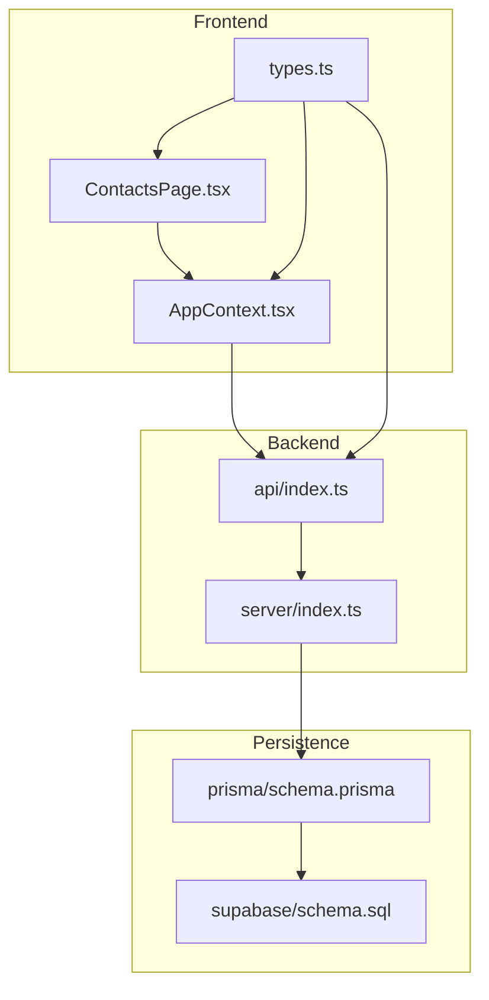
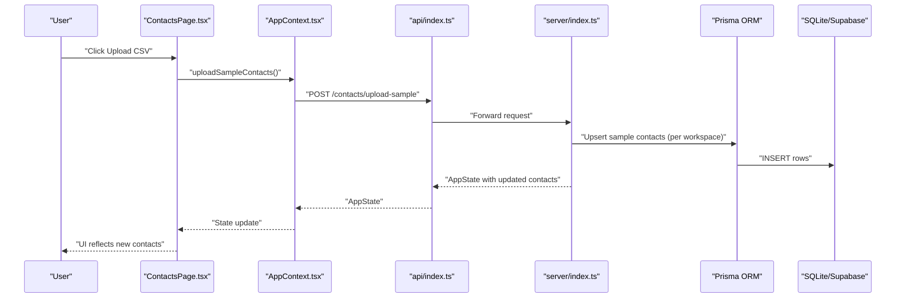
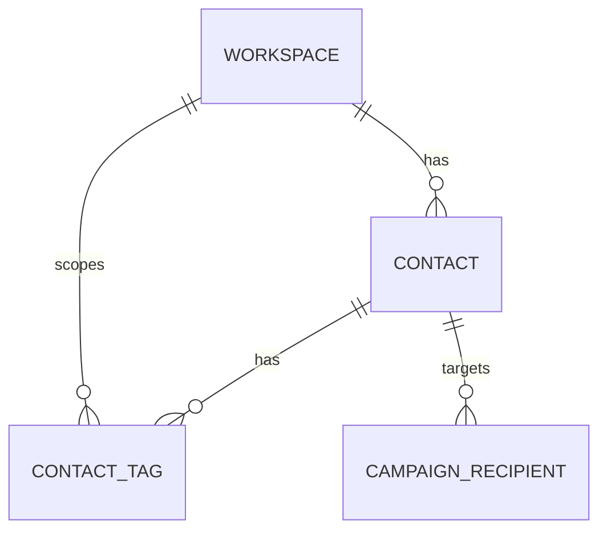
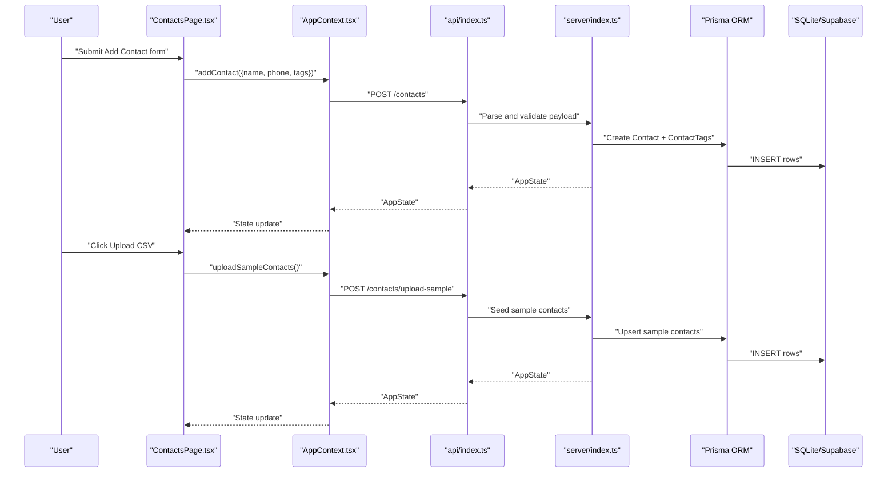
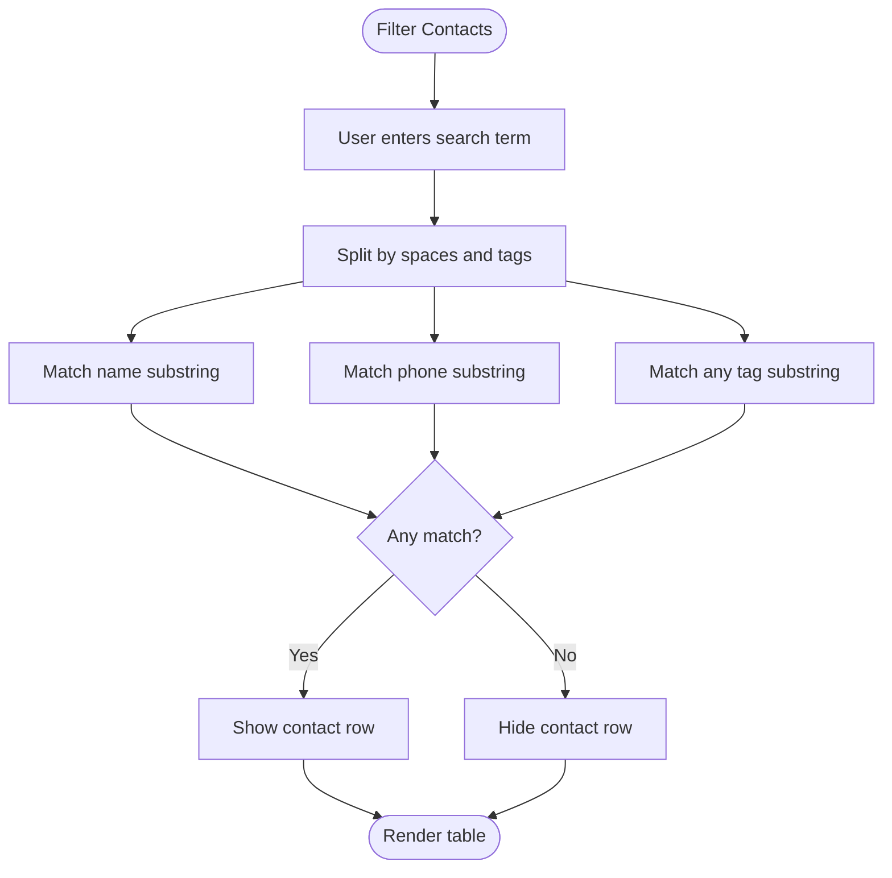
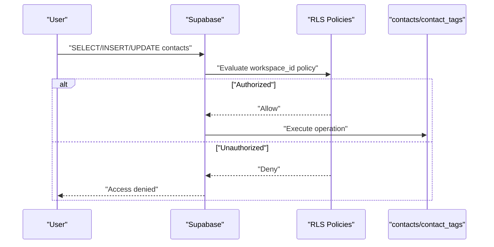
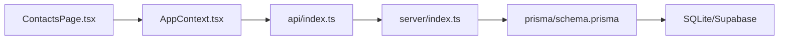

# Contact Management

<cite>
**Referenced Files in This Document**
- [ContactsPage.tsx](file://src/pages/ContactsPage.tsx)
- [AppContext.tsx](file://src/context/AppContext.tsx)
- [types.ts](file://src/lib/api/types.ts)
- [mockData.ts](file://src/lib/api/mockData.ts)
- [schema.prisma](file://prisma/schema.prisma)
- [schema.sql](file://supabase/schema.sql)
- [index.ts](file://api/index.ts)
- [index.ts](file://server/index.ts)
- [CampaignsPage.tsx](file://src/pages/CampaignsPage.tsx)
</cite>

## Table of Contents
1. [Introduction](#introduction)
2. [Project Structure](#project-structure)
3. [Core Components](#core-components)
4. [Architecture Overview](#architecture-overview)
5. [Detailed Component Analysis](#detailed-component-analysis)
6. [Dependency Analysis](#dependency-analysis)
7. [Performance Considerations](#performance-considerations)
8. [Troubleshooting Guide](#troubleshooting-guide)
9. [Conclusion](#conclusion)
10. [Appendices](#appendices)

## Introduction
This document describes the contact management system, focusing on contact import, tagging and segmentation, search and filtering, privacy and data protection, and integration points with campaigns. It synthesizes frontend UI behavior, backend APIs, database schema, and Supabase Row Level Security (RLS) policies to provide a complete picture of how contacts are modeled, validated, stored, and used across the platform.

## Project Structure
The contact management feature spans UI pages, application state, API routes, and persistence layers:
- Frontend page for contacts and campaign targeting
- Application context exposing CRUD actions and hydration
- API endpoints for adding contacts and uploading sample contacts
- Prisma schema modeling contacts, tags, and relationships
- Supabase RLS policies enforcing workspace-scoped access

**Diagram sources**
- [ContactsPage.tsx:1-222](file://src/pages/ContactsPage.tsx#L1-L222)
- [AppContext.tsx:1-239](file://src/context/AppContext.tsx#L1-L239)
- [types.ts:71-76](file://src/lib/api/types.ts#L71-L76)
- [api/index.ts:1893-1958](file://api/index.ts#L1893-L1958)
- [server/index.ts:1893-1958](file://server/index.ts#L1893-L1958)
- [schema.prisma:145-168](file://prisma/schema.prisma#L145-L168)
- [schema.sql:64-72](file://supabase/schema.sql#L64-L72)

**Section sources**
- [ContactsPage.tsx:1-222](file://src/pages/ContactsPage.tsx#L1-L222)
- [AppContext.tsx:1-239](file://src/context/AppContext.tsx#L1-L239)
- [types.ts:71-76](file://src/lib/api/types.ts#L71-L76)
- [api/index.ts:1893-1958](file://api/index.ts#L1893-L1958)
- [server/index.ts:1893-1958](file://server/index.ts#L1893-L1958)
- [schema.prisma:145-168](file://prisma/schema.prisma#L145-L168)
- [schema.sql:64-72](file://supabase/schema.sql#L64-L72)

## Core Components
- Contact data model: id, name, phone, tags, workspace scoping
- Tagging and segmentation: tags are stored per contact and rendered in UI
- Search and filtering: filter by name, phone, or tag substring
- Import workflow: add single contacts and upload sample contacts
- Privacy and access control: workspace-scoped entities with RLS policies

Key implementation references:
- Contact type definition and action signatures
- UI rendering of contacts and tags
- API endpoints for adding contacts and uploading sample contacts
- Prisma relations and uniqueness constraints
- Supabase RLS policies for contacts and contact_tags

**Section sources**
- [types.ts:71-76](file://src/lib/api/types.ts#L71-L76)
- [ContactsPage.tsx:27-36](file://src/pages/ContactsPage.tsx#L27-L36)
- [ContactsPage.tsx:194-200](file://src/pages/ContactsPage.tsx#L194-L200)
- [api/index.ts:1893-1958](file://api/index.ts#L1893-L1958)
- [server/index.ts:1893-1958](file://server/index.ts#L1893-L1958)
- [schema.prisma:145-168](file://prisma/schema.prisma#L145-L168)
- [schema.sql:447-453](file://supabase/schema.sql#L447-L453)

## Architecture Overview
The contact lifecycle involves UI interactions, state updates via context, API calls, and persistence. Workspace scoping ensures isolation between teams.

**Diagram sources**
- [ContactsPage.tsx:104-117](file://src/pages/ContactsPage.tsx#L104-L117)
- [AppContext.tsx:147-150](file://src/context/AppContext.tsx#L147-L150)
- [api/index.ts:1920-1958](file://api/index.ts#L1920-L1958)
- [server/index.ts:1920-1958](file://server/index.ts#L1920-L1958)

## Detailed Component Analysis

### Contact Data Model and Validation
- Fields: id, name, phone, tags
- Uniqueness: composite unique constraint on workspaceId and phone
- Relationships: Contact belongs to Workspace; Contact has many ContactTag; Contact participates in CampaignRecipient
- Validation: API routes parse and persist contact payloads; UI enforces presence of name and phone before submission

**Diagram sources**
- [schema.prisma:145-168](file://prisma/schema.prisma#L145-L168)
- [schema.prisma:159-168](file://prisma/schema.prisma#L159-L168)
- [schema.prisma:201-212](file://prisma/schema.prisma#L201-L212)

**Section sources**
- [types.ts:71-76](file://src/lib/api/types.ts#L71-L76)
- [schema.prisma:145-168](file://prisma/schema.prisma#L145-L168)
- [schema.prisma:159-168](file://prisma/schema.prisma#L159-L168)
- [schema.prisma:201-212](file://prisma/schema.prisma#L201-L212)

### Contact Import and Upload
- Single contact creation: UI collects name, phone, and comma-separated tags; backend persists with workspace scoping
- Sample CSV upload: endpoint seeds sample contacts if not present for the workspace
- Duplicate prevention: uniqueness on (workspaceId, phone) prevents duplicates per workspace

**Diagram sources**
- [ContactsPage.tsx:38-57](file://src/pages/ContactsPage.tsx#L38-L57)
- [AppContext.tsx:143-150](file://src/context/AppContext.tsx#L143-L150)
- [api/index.ts:1893-1958](file://api/index.ts#L1893-L1958)
- [server/index.ts:1893-1958](file://server/index.ts#L1893-L1958)

**Section sources**
- [ContactsPage.tsx:38-57](file://src/pages/ContactsPage.tsx#L38-L57)
- [AppContext.tsx:143-150](file://src/context/AppContext.tsx#L143-L150)
- [api/index.ts:1893-1958](file://api/index.ts#L1893-L1958)
- [server/index.ts:1893-1958](file://server/index.ts#L1893-L1958)
- [schema.prisma:156](file://prisma/schema.prisma#L156)

### Contact Tagging, Segmentation, and Search
- Tagging: tags are stored per contact; UI renders colored badges for known tags
- Segmentation: UI computes unique tag count across contacts
- Search: filter by name, phone, or tag substring; supports real-time filtering

**Diagram sources**
- [ContactsPage.tsx:27-36](file://src/pages/ContactsPage.tsx#L27-L36)
- [ContactsPage.tsx:194-200](file://src/pages/ContactsPage.tsx#L194-L200)

**Section sources**
- [ContactsPage.tsx:9-17](file://src/pages/ContactsPage.tsx#L9-L17)
- [ContactsPage.tsx:27-36](file://src/pages/ContactsPage.tsx#L27-L36)
- [ContactsPage.tsx:194-200](file://src/pages/ContactsPage.tsx#L194-L200)

### Contact Search and Filtering
- Real-time filtering in UI using useMemo
- Search across name, phone, and tags
- Integration with campaign targeting UI for selecting contacts

**Section sources**
- [ContactsPage.tsx:27-36](file://src/pages/ContactsPage.tsx#L27-L36)
- [CampaignsPage.tsx:287-309](file://src/pages/CampaignsPage.tsx#L287-L309)

### Privacy Controls and GDPR Compliance Measures
- Workspace scoping: all contact-related tables enforce workspace_id checks
- Row Level Security: contacts, contact_tags, campaigns, and related tables enable RLS
- Access policies: members can only access their workspace’s data
- Data deletion: while explicit deletion endpoints are not shown in the referenced files, RLS policies and workspace scoping provide strong isolation; deletion would follow similar workspace-scoped patterns

**Diagram sources**
- [schema.sql:447-453](file://supabase/schema.sql#L447-L453)
- [schema.sql:402-516](file://supabase/schema.sql#L402-L516)

**Section sources**
- [schema.sql:402-516](file://supabase/schema.sql#L402-L516)
- [schema.prisma:145-168](file://prisma/schema.prisma#L145-L168)

### Bulk Operations and Contact Merging
- Bulk selection: campaign UI demonstrates multi-select checkboxes for contacts
- Contact merging: not implemented in the referenced files; recommended approach would involve deduplicating by phone within a workspace and consolidating tags and associations

**Section sources**
- [CampaignsPage.tsx:287-309](file://src/pages/CampaignsPage.tsx#L287-L309)

### Contact Export and Data Portability
- Export capability: not implemented in the referenced files; recommended approach would serialize contacts and tags to CSV or JSON for download
- Data portability: workspace-scoped design enables migration to another system by exporting and re-importing within the same workspace constraints

[No sources needed since this section provides general guidance]

### Integration with External CRM Systems
- No direct CRM integration endpoints are present in the referenced files
- Recommended integration pattern: expose a contacts export endpoint and accept a contacts import endpoint with mapping of fields to internal tags and attributes

[No sources needed since this section provides general guidance]

## Dependency Analysis
- UI depends on AppContext for state and actions
- AppContext delegates to API adapter (HTTP/Supabase/Mock)
- API routes call server handlers which use Prisma ORM
- Prisma schema maps to SQLite; Supabase schema defines RLS policies

**Diagram sources**
- [ContactsPage.tsx:19-20](file://src/pages/ContactsPage.tsx#L19-L20)
- [AppContext.tsx:100-226](file://src/context/AppContext.tsx#L100-L226)
- [api/index.ts:1893-1958](file://api/index.ts#L1893-L1958)
- [server/index.ts:1893-1958](file://server/index.ts#L1893-L1958)
- [schema.prisma:145-168](file://prisma/schema.prisma#L145-L168)

**Section sources**
- [ContactsPage.tsx:19-20](file://src/pages/ContactsPage.tsx#L19-L20)
- [AppContext.tsx:100-226](file://src/context/AppContext.tsx#L100-L226)
- [api/index.ts:1893-1958](file://api/index.ts#L1893-L1958)
- [server/index.ts:1893-1958](file://server/index.ts#L1893-L1958)
- [schema.prisma:145-168](file://prisma/schema.prisma#L145-L168)

## Performance Considerations
- Filtering is client-side; for large datasets, consider server-side filtering and pagination
- Tag rendering uses small arrays; performance impact is minimal
- API endpoints should validate input early and leverage database constraints to avoid unnecessary writes

[No sources needed since this section provides general guidance]

## Troubleshooting Guide
- Missing name or phone: UI prevents submission and shows a toast notification
- Duplicate phone within workspace: uniqueness constraint prevents duplicate creation
- Workspace access denied: RLS policies restrict access to authorized members

**Section sources**
- [ContactsPage.tsx:38-42](file://src/pages/ContactsPage.tsx#L38-L42)
- [schema.prisma:156](file://prisma/schema.prisma#L156)
- [schema.sql:447-453](file://supabase/schema.sql#L447-L453)

## Conclusion
The contact management system centers on a clean data model with workspace scoping and RLS enforcement. Import workflows support both single contacts and sample uploads, while tagging and search enable segmentation and targeting. Privacy and data isolation are enforced at the database level. Future enhancements could include explicit deletion, export/import endpoints, and contact merging.

## Appendices

### Example Workflows
- Adding a single contact:
  - UI collects name, phone, tags
  - AppContext dispatches addContact
  - API route validates and persists
  - UI updates and displays the new contact
- Uploading sample contacts:
  - UI triggers uploadSampleContacts
  - API seeds sample contacts if not present
  - UI reflects updated contact list

**Section sources**
- [ContactsPage.tsx:38-57](file://src/pages/ContactsPage.tsx#L38-L57)
- [AppContext.tsx:143-150](file://src/context/AppContext.tsx#L143-L150)
- [api/index.ts:1920-1958](file://api/index.ts#L1920-L1958)
- [server/index.ts:1920-1958](file://server/index.ts#L1920-L1958)