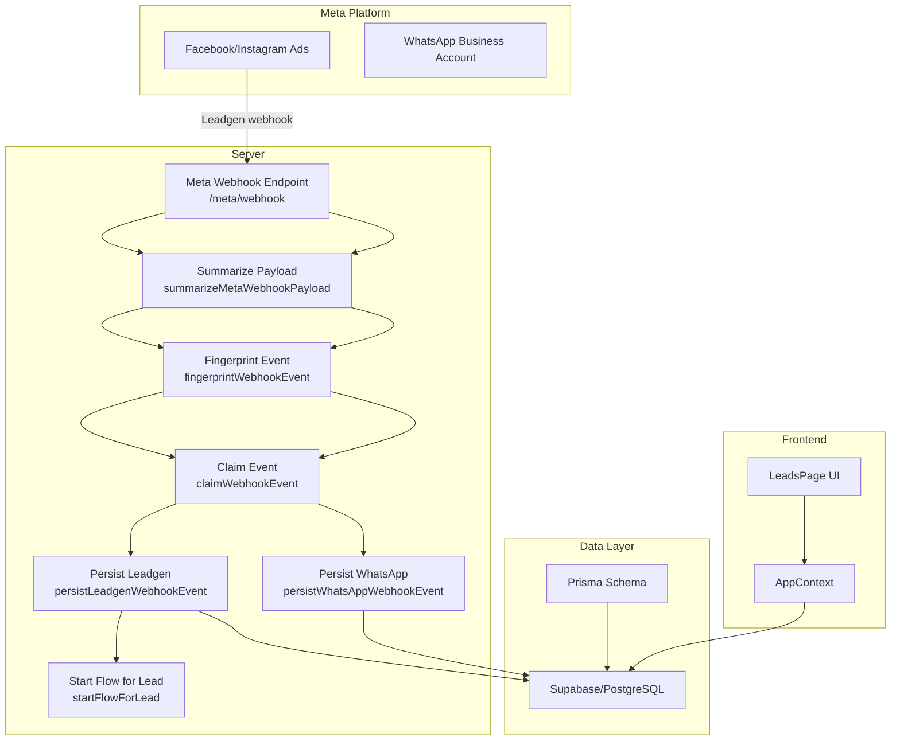
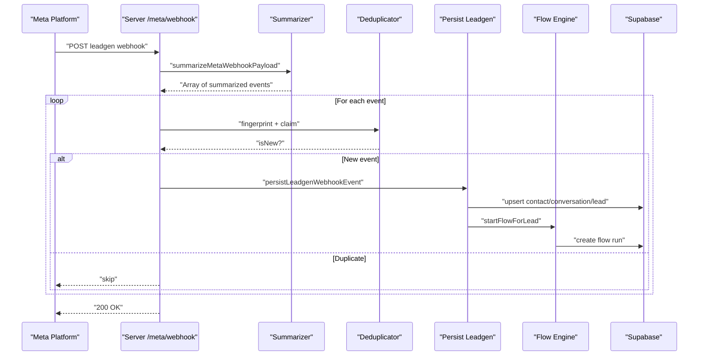
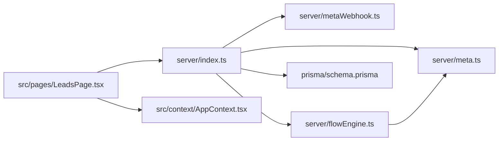
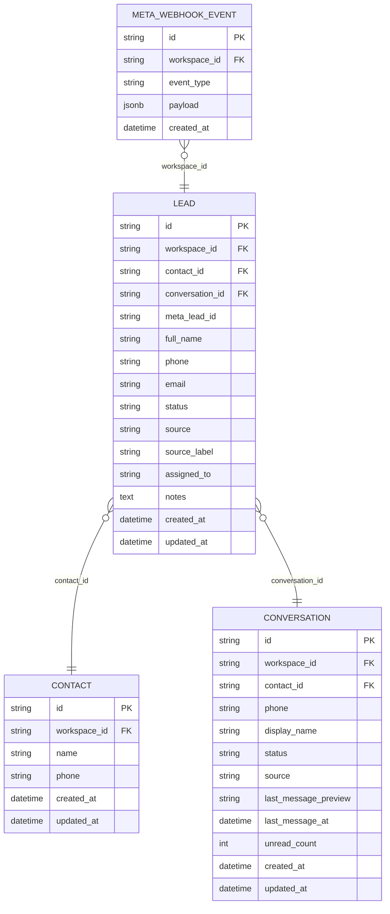

# Lead Capture and Processing

<cite>
**Referenced Files in This Document**
- [server/index.ts](file://server/index.ts)
- [server/metaWebhook.ts](file://server/metaWebhook.ts)
- [server/meta.ts](file://server/meta.ts)
- [server/flowEngine.ts](file://server/flowEngine.ts)
- [prisma/schema.prisma](file://prisma/schema.prisma)
- [src/pages/LeadsPage.tsx](file://src/pages/LeadsPage.tsx)
- [src/context/AppContext.tsx](file://src/context/AppContext.tsx)
- [api/index.ts](file://api/index.ts)
</cite>

## Table of Contents
1. [Introduction](#introduction)
2. [Project Structure](#project-structure)
3. [Core Components](#core-components)
4. [Architecture Overview](#architecture-overview)
5. [Detailed Component Analysis](#detailed-component-analysis)
6. [Dependency Analysis](#dependency-analysis)
7. [Performance Considerations](#performance-considerations)
8. [Troubleshooting Guide](#troubleshooting-guide)
9. [Conclusion](#conclusion)
10. [Appendices](#appendices)

## Introduction
This document explains the lead capture and processing functionality, focusing on Meta webhook integration for lead generation from Facebook and Instagram ads. It covers the leadgen webhook payload structure, event fingerprinting, duplicate prevention, the end-to-end lead capture workflow from ad click to form submission, field mapping, data validation, enrichment, scoring and qualification, assignment rules, automation engine integration, error handling, retries, and data consistency checks. It also outlines GDPR compliance considerations, data privacy controls, and consent management practices.

## Project Structure
The lead capture pipeline spans backend webhook handlers, data persistence, automation orchestration, and the frontend CRM interface:
- Webhook ingestion and summarization
- Duplicate prevention via event fingerprinting
- Lead enrichment and persistence
- Automation triggers and flows
- Frontend lead management UI

**Diagram sources**
- [server/index.ts:808-849](file://server/index.ts#L808-L849)
- [server/metaWebhook.ts:111-161](file://server/metaWebhook.ts#L111-L161)
- [server/flowEngine.ts:32-75](file://server/flowEngine.ts#L32-L75)
- [prisma/schema.prisma:90-108](file://prisma/schema.prisma#L90-L108)
- [src/pages/LeadsPage.tsx:1-266](file://src/pages/LeadsPage.tsx#L1-L266)

**Section sources**
- [server/index.ts:808-849](file://server/index.ts#L808-L849)
- [server/metaWebhook.ts:111-161](file://server/metaWebhook.ts#L111-L161)
- [prisma/schema.prisma:90-108](file://prisma/schema.prisma#L90-L108)

## Core Components
- Meta webhook endpoint and verification
- Payload summarization and event classification
- Duplicate prevention using cryptographic fingerprinting
- Lead enrichment and persistence (contacts, conversations, leads)
- Automation rules and flow engine integration
- Frontend lead operator panel and attribution display

Key implementation references:
- Webhook verification and ingestion: [server/index.ts:808-849](file://server/index.ts#L808-L849)
- Payload summarization: [server/metaWebhook.ts:111-161](file://server/metaWebhook.ts#L111-L161)
- Duplicate prevention: [server/index.ts:319-342](file://server/index.ts#L319-L342)
- Lead enrichment and persistence: [server/index.ts:631-750](file://server/index.ts#L631-L750)
- Automation integration: [server/flowEngine.ts:32-75](file://server/flowEngine.ts#L32-L75)
- Frontend lead UI: [src/pages/LeadsPage.tsx:1-266](file://src/pages/LeadsPage.tsx#L1-L266)

**Section sources**
- [server/index.ts:808-849](file://server/index.ts#L808-L849)
- [server/metaWebhook.ts:111-161](file://server/metaWebhook.ts#L111-L161)
- [server/index.ts:319-342](file://server/index.ts#L319-L342)
- [server/index.ts:631-750](file://server/index.ts#L631-L750)
- [server/flowEngine.ts:32-75](file://server/flowEngine.ts#L32-L75)
- [src/pages/LeadsPage.tsx:1-266](file://src/pages/LeadsPage.tsx#L1-L266)

## Architecture Overview
The lead capture architecture integrates Meta’s leadgen webhook with internal CRM and automation systems:
- Incoming leadgen events are validated and summarized
- Events are fingerprinted and deduplicated
- Enrichment resolves workspace and source mapping
- Persistence creates or updates contacts, conversations, and leads
- Automation rules trigger initial assignment and follow-up flows
- Frontend displays lead pipeline and attribution details

**Diagram sources**
- [server/index.ts:822-849](file://server/index.ts#L822-L849)
- [server/metaWebhook.ts:111-161](file://server/metaWebhook.ts#L111-L161)
- [server/index.ts:319-342](file://server/index.ts#L319-L342)
- [server/index.ts:631-750](file://server/index.ts#L631-L750)
- [server/flowEngine.ts:32-75](file://server/flowEngine.ts#L32-L75)

**Section sources**
- [server/index.ts:822-849](file://server/index.ts#L822-L849)
- [server/metaWebhook.ts:111-161](file://server/metaWebhook.ts#L111-L161)
- [server/index.ts:319-342](file://server/index.ts#L319-L342)
- [server/index.ts:631-750](file://server/index.ts#L631-L750)
- [server/flowEngine.ts:32-75](file://server/flowEngine.ts#L32-L75)

## Detailed Component Analysis

### Meta Webhook Integration
- Verification endpoint supports the standard challenge-response pattern.
- POST endpoint receives leadgen and WhatsApp events, logs summaries, and dispatches to persistence.

Key references:
- Verification handler: [server/index.ts:808-820](file://server/index.ts#L808-L820)
- Webhook receiver and dispatcher: [server/index.ts:822-849](file://server/index.ts#L822-L849)

**Section sources**
- [server/index.ts:808-849](file://server/index.ts#L808-L849)

### Payload Summarization and Classification
- Summarizer extracts leadgen and WhatsApp-specific fields into structured summaries.
- Classifies events by kind ("leadgen" vs "whatsapp") for downstream processing.

Key references:
- Summarizer function and types: [server/metaWebhook.ts:111-161](file://server/metaWebhook.ts#L111-L161)

**Section sources**
- [server/metaWebhook.ts:111-161](file://server/metaWebhook.ts#L111-L161)

### Duplicate Prevention and Event Fingerprinting
- Each event is fingerprinted using a cryptographic hash of the serialized event.
- A database-backed claim ensures idempotency; duplicates are skipped.

Key references:
- Fingerprinting: [server/index.ts:319-321](file://server/index.ts#L319-L321)
- Claim mechanism: [server/index.ts:323-342](file://server/index.ts#L323-L342)

**Section sources**
- [server/index.ts:319-342](file://server/index.ts#L319-L342)

### Lead Capture Workflow: From Ad Click to Form Submission
- Field mapping: Full name, phone, email are extracted from leadgen field data.
- Attribution: Source label and notes are built from page/ad/form identifiers.
- Persistence: Upserts contact, creates conversation, and inserts lead with status "new".
- Assignment: Respects enabled automation rule for auto-assignment.
- Automation: Starts Phase 1 flow for new leads.

Key references:
- Field extraction and enrichment: [server/index.ts:631-750](file://server/index.ts#L631-L750)
- Attribution helpers: [server/index.ts:142-171](file://server/index.ts#L142-L171)
- Auto-assignment and flow start: [server/index.ts:705-749](file://server/index.ts#L705-L749), [server/flowEngine.ts:32-75](file://server/flowEngine.ts#L32-L75)

**Section sources**
- [server/index.ts:631-750](file://server/index.ts#L631-L750)
- [server/index.ts:142-171](file://server/index.ts#L142-L171)
- [server/flowEngine.ts:32-75](file://server/flowEngine.ts#L32-L75)

### Data Validation and Enrichment
- Validation: Requires a phone number; otherwise, the event is ignored.
- Enrichment: Resolves workspace via source mappings (page/ad/form), upserts contact, and creates conversation.
- Notes and labels: Build contextual attribution for reporting and filtering.

Key references:
- Validation and enrichment: [server/index.ts:631-750](file://server/index.ts#L631-L750)

**Section sources**
- [server/index.ts:631-750](file://server/index.ts#L631-L750)

### Automation Engine Integration
- Flow definition: Active flow definition is retrieved and a flow run is created for the lead.
- Step execution: Tags, waits, and interactive messages are supported.
- Retry policy: Nodes retry up to a threshold with exponential backoff-like delays.

Key references:
- Start flow: [server/flowEngine.ts:32-75](file://server/flowEngine.ts#L32-L75)
- Process flow run: [server/flowEngine.ts:77-168](file://server/flowEngine.ts#L77-L168)

**Section sources**
- [server/flowEngine.ts:32-75](file://server/flowEngine.ts#L32-L75)
- [server/flowEngine.ts:77-168](file://server/flowEngine.ts#L77-L168)

### Frontend Lead Operator Panel
- Filters leads by status, displays source and attribution details, and allows updating owner, notes, and stage.
- Parses attribution details from lead notes for display.

Key references:
- Lead pipeline and operator panel: [src/pages/LeadsPage.tsx:1-266](file://src/pages/LeadsPage.tsx#L1-L266)

**Section sources**
- [src/pages/LeadsPage.tsx:1-266](file://src/pages/LeadsPage.tsx#L1-L266)

### Practical Examples

#### Example: Webhook Event Processing
- Receive leadgen event
- Summarize and fingerprint
- Claim event to prevent duplicates
- Persist lead with enriched fields and attribution
- Start automation flow

References:
- [server/index.ts:822-849](file://server/index.ts#L822-L849)
- [server/metaWebhook.ts:111-161](file://server/metaWebhook.ts#L111-L161)
- [server/index.ts:319-342](file://server/index.ts#L319-L342)
- [server/index.ts:631-750](file://server/index.ts#L631-L750)
- [server/flowEngine.ts:32-75](file://server/flowEngine.ts#L32-L75)

#### Example: Lead Data Transformation
- Extract name, phone, email from field data
- Build source label and notes
- Upsert contact and create conversation
- Insert lead with status and attribution

References:
- [server/index.ts:631-750](file://server/index.ts#L631-L750)

#### Example: Integration with Automation Engine
- Retrieve active flow definition
- Create flow run for the lead
- Execute steps (tag, wait, send interactive)

References:
- [server/flowEngine.ts:32-75](file://server/flowEngine.ts#L32-L75)
- [server/flowEngine.ts:77-168](file://server/flowEngine.ts#L77-L168)

**Section sources**
- [server/index.ts:822-849](file://server/index.ts#L822-L849)
- [server/metaWebhook.ts:111-161](file://server/metaWebhook.ts#L111-L161)
- [server/index.ts:319-342](file://server/index.ts#L319-L342)
- [server/index.ts:631-750](file://server/index.ts#L631-L750)
- [server/flowEngine.ts:32-75](file://server/flowEngine.ts#L32-L75)
- [server/flowEngine.ts:77-168](file://server/flowEngine.ts#L77-L168)

## Dependency Analysis
The lead capture pipeline depends on:
- Supabase for event logging, authorization storage, and CRM data
- Prisma schema for domain modeling
- Meta APIs for authorization exchange and message sending
- Frontend context for state management and UI updates

**Diagram sources**
- [server/index.ts:1-120](file://server/index.ts#L1-L120)
- [server/metaWebhook.ts:1-161](file://server/metaWebhook.ts#L1-L161)
- [server/meta.ts:1-391](file://server/meta.ts#L1-L391)
- [server/flowEngine.ts:1-260](file://server/flowEngine.ts#L1-L260)
- [prisma/schema.prisma:1-279](file://prisma/schema.prisma#L1-L279)
- [src/pages/LeadsPage.tsx:1-266](file://src/pages/LeadsPage.tsx#L1-L266)
- [src/context/AppContext.tsx:1-239](file://src/context/AppContext.tsx#L1-L239)

**Section sources**
- [server/index.ts:1-120](file://server/index.ts#L1-L120)
- [server/metaWebhook.ts:1-161](file://server/metaWebhook.ts#L1-L161)
- [server/meta.ts:1-391](file://server/meta.ts#L1-L391)
- [server/flowEngine.ts:1-260](file://server/flowEngine.ts#L1-L260)
- [prisma/schema.prisma:1-279](file://prisma/schema.prisma#L1-L279)
- [src/pages/LeadsPage.tsx:1-266](file://src/pages/LeadsPage.tsx#L1-L266)
- [src/context/AppContext.tsx:1-239](file://src/context/AppContext.tsx#L1-L239)

## Performance Considerations
- Deduplication minimizes redundant processing and database writes.
- Asynchronous event handling prevents blocking the webhook response.
- Batch-friendly flow execution reduces per-lead overhead.
- Idempotent upserts avoid race conditions during concurrent events.

[No sources needed since this section provides general guidance]

## Troubleshooting Guide
Common issues and remedies:
- Duplicate events: Investigate fingerprint collisions or missing claim insertions.
  - References: [server/index.ts:319-342](file://server/index.ts#L319-L342)
- Missing authorization: Ensure Meta authorization is present and not expired.
  - References: [server/index.ts:225-244](file://server/index.ts#L225-L244)
- Failed send retries: Use the retry endpoint to resend failed messages or templates.
  - References: [server/index.ts:1582-1751](file://server/index.ts#L1582-L1751)
- Operational logs: Review operational logs for errors and warnings.
  - References: [server/index.ts:258-275](file://server/index.ts#L258-L275)

**Section sources**
- [server/index.ts:319-342](file://server/index.ts#L319-L342)
- [server/index.ts:225-244](file://server/index.ts#L225-L244)
- [server/index.ts:1582-1751](file://server/index.ts#L1582-L1751)
- [server/index.ts:258-275](file://server/index.ts#L258-L275)

## Conclusion
The lead capture and processing system integrates Meta’s leadgen webhooks with robust deduplication, enrichment, and automation. It persists leads with attribution, enforces privacy-safe defaults, and provides operators with a UI to manage and qualify leads. The automation engine enables scalable follow-ups and qualification flows, while error handling and retry mechanisms maintain data consistency.

[No sources needed since this section summarizes without analyzing specific files]

## Appendices

### GDPR Compliance and Data Privacy Controls
- Consent management: Store explicit consent flags and purpose restrictions in lead notes or dedicated fields.
- Data minimization: Only collect and persist required fields (e.g., phone) and enrich incrementally.
- Right to erasure: Implement soft-delete and anonymization flows for contacts and leads.
- Data retention: Configure automated cleanup policies for old leads and logs.
- Transparency: Include attribution notes and source labels for auditability.

[No sources needed since this section provides general guidance]

### Data Model Highlights Relevant to Leads
- Leads, contacts, conversations, and meta webhook events are central to the lead capture model.

**Diagram sources**
- [prisma/schema.prisma:90-108](file://prisma/schema.prisma#L90-L108)
- [prisma/schema.prisma:145-157](file://prisma/schema.prisma#L145-L157)
- [prisma/schema.prisma:184-212](file://prisma/schema.prisma#L184-L212)
- [prisma/schema.prisma:214-225](file://prisma/schema.prisma#L214-L225)

**Section sources**
- [prisma/schema.prisma:90-108](file://prisma/schema.prisma#L90-L108)
- [prisma/schema.prisma:145-157](file://prisma/schema.prisma#L145-L157)
- [prisma/schema.prisma:184-212](file://prisma/schema.prisma#L184-L212)
- [prisma/schema.prisma:214-225](file://prisma/schema.prisma#L214-L225)