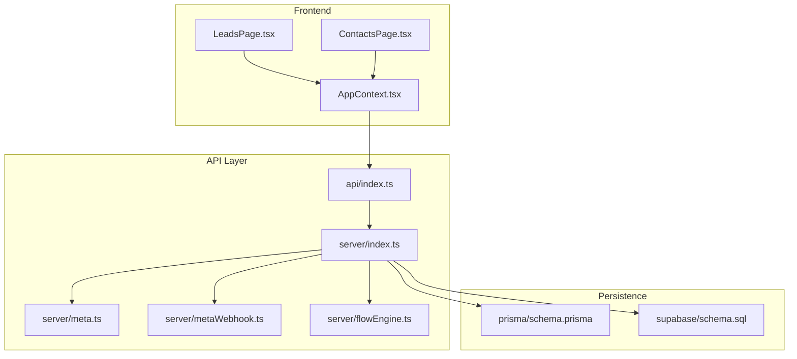
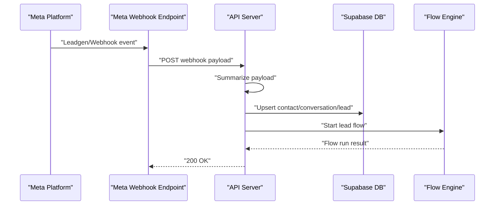
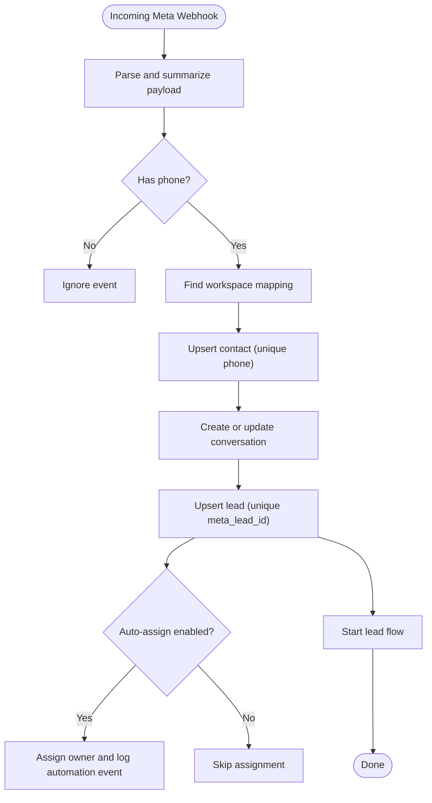
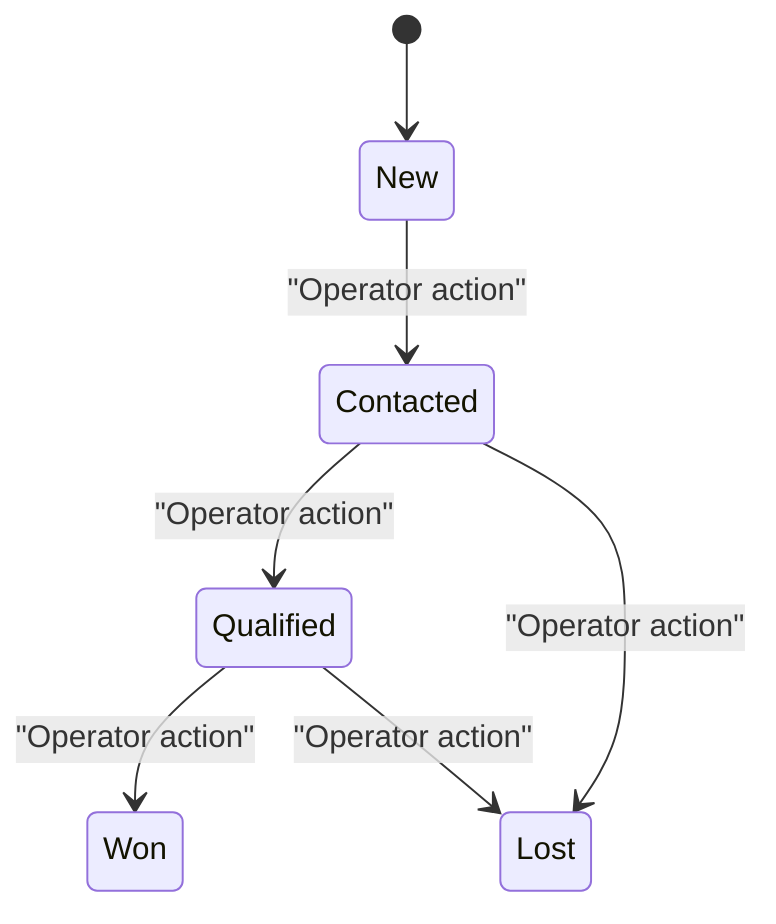
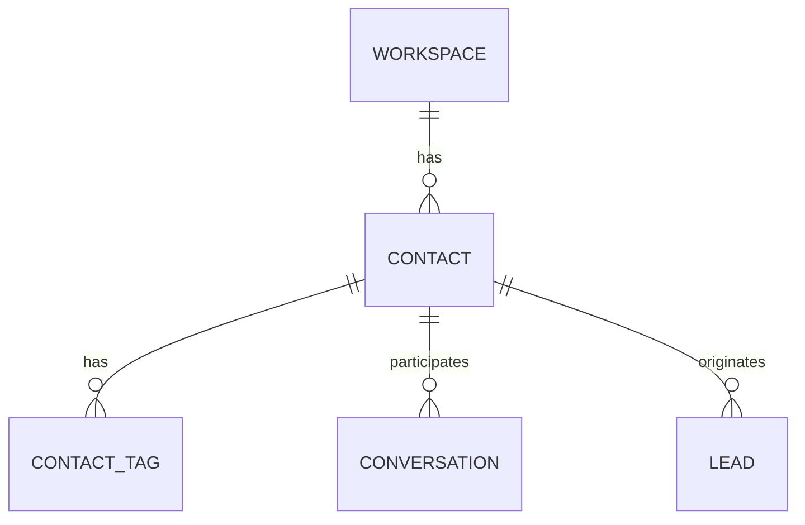
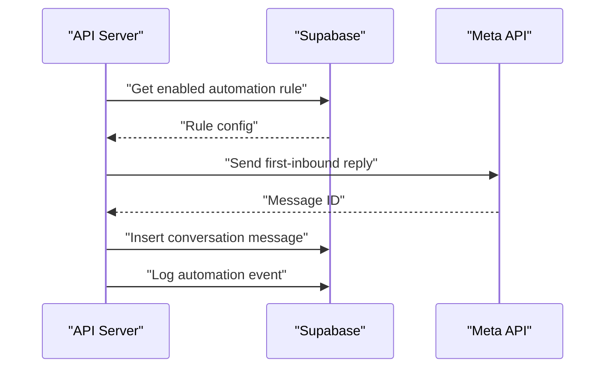
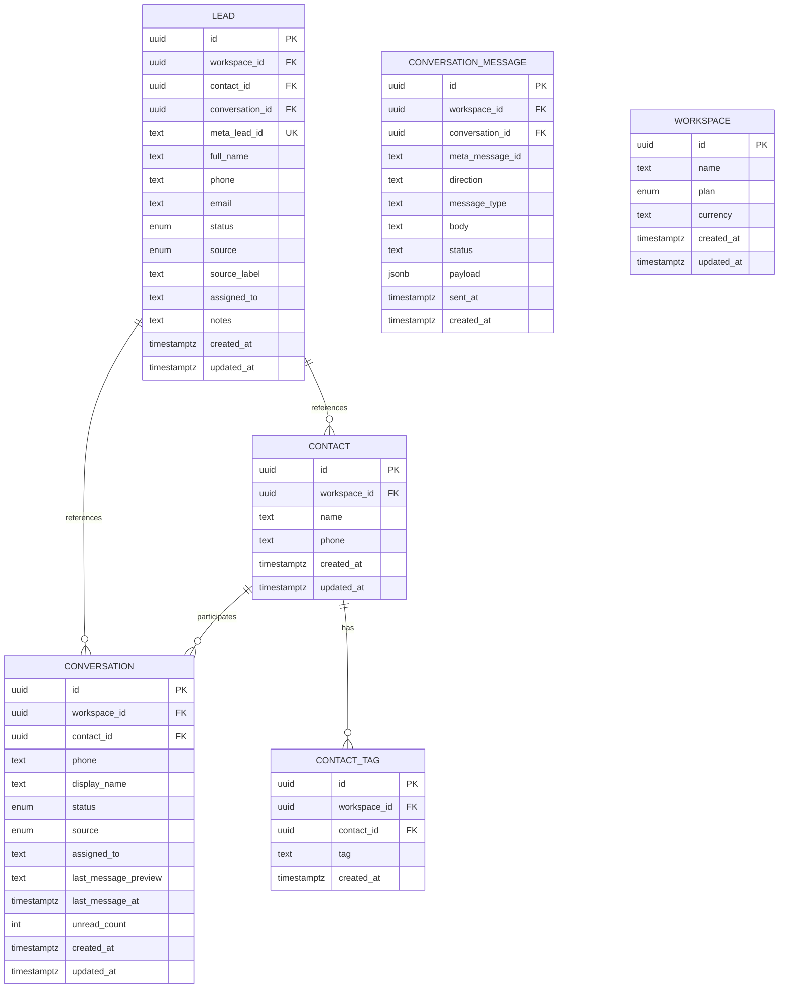
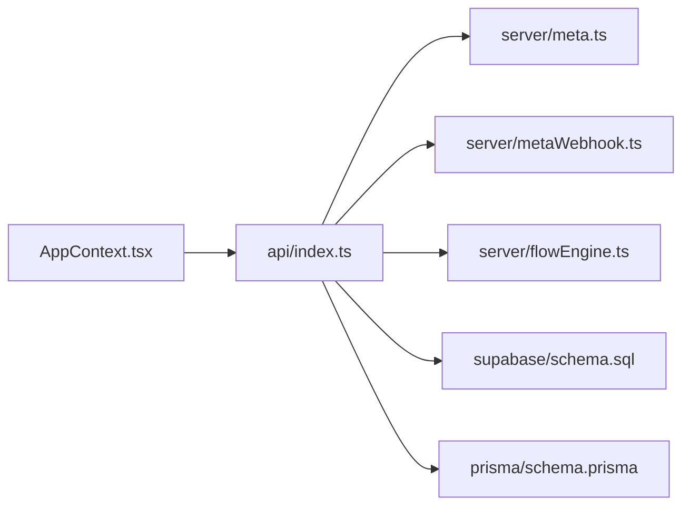

# Lead Management System

<cite>
**Referenced Files in This Document**
- [schema.prisma](file://prisma/schema.prisma)
- [schema.sql](file://supabase/schema.sql)
- [api/index.ts](file://api/index.ts)
- [server/index.ts](file://server/index.ts)
- [meta.ts](file://server/meta.ts)
- [metaWebhook.ts](file://server/metaWebhook.ts)
- [flowEngine.ts](file://server/flowEngine.ts)
- [LeadsPage.tsx](file://src/pages/LeadsPage.tsx)
- [ContactsPage.tsx](file://src/pages/ContactsPage.tsx)
- [AppContext.tsx](file://src/context/AppContext.tsx)
- [types.ts](file://src/lib/api/types.ts)
- [contracts.ts](file://src/lib/api/contracts.ts)
- [api/index.ts](file://src/lib/api/index.ts)
- [automation_v1_upgrade.sql](file://supabase/automation_v1_upgrade.sql)
- [inbox_leads_upgrade.sql](file://supabase/inbox_leads_upgrade.sql)
</cite>

## Table of Contents
1. [Introduction](#introduction)
2. [Project Structure](#project-structure)
3. [Core Components](#core-components)
4. [Architecture Overview](#architecture-overview)
5. [Detailed Component Analysis](#detailed-component-analysis)
6. [Dependency Analysis](#dependency-analysis)
7. [Performance Considerations](#performance-considerations)
8. [Troubleshooting Guide](#troubleshooting-guide)
9. [Conclusion](#conclusion)
10. [Appendices](#appendices)

## Introduction
This document describes the Lead Management System that captures leads from Meta ads, orchestrates lead lifecycle management, and organizes contacts for repeatable engagement. It covers the lead generation workflow from ad clicks to lead capture, qualification, and assignment to sales representatives. It documents lead lifecycle stages, contact management features, automation rules, database schema, validation rules, export capabilities, quality assurance, duplicate detection, privacy controls, analytics, conversion tracking, and performance optimization.

## Project Structure
The system is a full-stack application with:
- Frontend dashboard pages for Leads and Contacts
- API server handling authentication, state hydration, and webhook processing
- Supabase-backed PostgreSQL schema for persistence and row-level security
- Prisma schema for ORM modeling
- Meta integration for lead capture and messaging

**Diagram sources**
- [LeadsPage.tsx:1-266](file://src/pages/LeadsPage.tsx#L1-L266)
- [ContactsPage.tsx:1-222](file://src/pages/ContactsPage.tsx#L1-L222)
- [AppContext.tsx:1-193](file://src/context/AppContext.tsx#L1-L193)
- [api/index.ts:1-800](file://api/index.ts#L1-L800)
- [server/index.ts:1-800](file://server/index.ts#L1-L800)
- [meta.ts:1-391](file://server/meta.ts#L1-L391)
- [metaWebhook.ts:1-161](file://server/metaWebhook.ts#L1-L161)
- [flowEngine.ts](file://server/flowEngine.ts)
- [schema.prisma:1-189](file://prisma/schema.prisma#L1-L189)
- [schema.sql:1-517](file://supabase/schema.sql#L1-L517)

**Section sources**
- [LeadsPage.tsx:1-266](file://src/pages/LeadsPage.tsx#L1-L266)
- [ContactsPage.tsx:1-222](file://src/pages/ContactsPage.tsx#L1-L222)
- [AppContext.tsx:1-193](file://src/context/AppContext.tsx#L1-L193)
- [api/index.ts:1-800](file://api/index.ts#L1-L800)
- [server/index.ts:1-800](file://server/index.ts#L1-L800)
- [meta.ts:1-391](file://server/meta.ts#L1-L391)
- [metaWebhook.ts:1-161](file://server/metaWebhook.ts#L1-L161)
- [flowEngine.ts](file://server/flowEngine.ts)
- [schema.prisma:1-189](file://prisma/schema.prisma#L1-L189)
- [schema.sql:1-517](file://supabase/schema.sql#L1-L517)

## Core Components
- Lead capture and enrichment via Meta Leadgen webhooks and Meta WhatsApp inbound messages
- Lead lifecycle management with stages: New, Contacted, Qualified, Won, Lost
- Contact management with tagging, segmentation, and privacy controls
- Automation engine supporting auto-assignment, first-inbound replies, reminders, and follow-ups
- Database schema with row-level security and unique constraints for deduplication
- Analytics and conversion tracking through attribution notes and link click logging

**Section sources**
- [api/index.ts:631-750](file://api/index.ts#L631-L750)
- [server/index.ts:631-750](file://server/index.ts#L631-L750)
- [metaWebhook.ts:111-161](file://server/metaWebhook.ts#L111-L161)
- [schema.sql:208-224](file://supabase/schema.sql#L208-L224)
- [schema.sql:64-81](file://supabase/schema.sql#L64-L81)
- [schema.sql:19-26](file://supabase/schema.sql#L19-L26)

## Architecture Overview
The system integrates Meta’s lead and messaging APIs with internal CRM logic. Webhooks are summarized and persisted, then mapped into leads, contacts, and conversations. Automation rules are evaluated to assign owners and send first-inbound replies. The frontend surfaces lead pipelines and contact lists with filtering and tagging.

**Diagram sources**
- [metaWebhook.ts:111-161](file://server/metaWebhook.ts#L111-L161)
- [api/index.ts:631-750](file://api/index.ts#L631-L750)
- [server/index.ts:631-750](file://server/index.ts#L631-L750)
- [flowEngine.ts](file://server/flowEngine.ts)

## Detailed Component Analysis

### Lead Generation and Capture
- Meta Leadgen webhooks are parsed and mapped into leads with source attribution and notes containing Page ID, Ad ID, and Form ID.
- WhatsApp inbound messages create or update contacts, open conversations, and may create new leads with automatic assignment based on enabled automation rules.
- Duplicate detection leverages unique constraints on (workspace_id, phone) for contacts and unique(meta_lead_id) for leads.

**Diagram sources**
- [metaWebhook.ts:111-161](file://server/metaWebhook.ts#L111-L161)
- [api/index.ts:631-750](file://api/index.ts#L631-L750)
- [server/index.ts:631-750](file://server/index.ts#L631-L750)
- [schema.sql:64-72](file://supabase/schema.sql#L64-L72)
- [schema.sql:213-213](file://supabase/schema.sql#L213-L213)

**Section sources**
- [metaWebhook.ts:111-161](file://server/metaWebhook.ts#L111-L161)
- [api/index.ts:631-750](file://api/index.ts#L631-L750)
- [server/index.ts:631-750](file://server/index.ts#L631-L750)
- [schema.sql:64-72](file://supabase/schema.sql#L64-L72)
- [schema.sql:213-213](file://supabase/schema.sql#L213-L213)

### Lead Lifecycle Management
- Lifecycle stages: New, Contacted, Qualified, Won, Lost.
- Operators can move leads between stages and assign owners directly from the Leads page.
- Attribution details are extracted from lead notes for Meta Ads sources.

**Diagram sources**
- [types.ts:20-26](file://src/lib/api/types.ts#L20-L26)
- [LeadsPage.tsx:21-28](file://src/pages/LeadsPage.tsx#L21-L28)

**Section sources**
- [types.ts:20-26](file://src/lib/api/types.ts#L20-L26)
- [LeadsPage.tsx:1-266](file://src/pages/LeadsPage.tsx#L1-L266)

### Contact Management and Tagging
- Contacts are stored with unique phone per workspace.
- Tags are stored separately with unique (contact_id, tag) to enable segmentation.
- Import capability exists via “Upload CSV” and “Add Contact” forms.
- Privacy controls enforced via row-level security policies scoped to current workspace.

**Diagram sources**
- [schema.sql:64-81](file://supabase/schema.sql#L64-L81)
- [schema.sql:74-81](file://supabase/schema.sql#L74-L81)
- [schema.sql:159-173](file://supabase/schema.sql#L159-L173)
- [schema.sql:208-224](file://supabase/schema.sql#L208-L224)

**Section sources**
- [ContactsPage.tsx:1-222](file://src/pages/ContactsPage.tsx#L1-L222)
- [schema.sql:64-81](file://supabase/schema.sql#L64-L81)
- [schema.sql:74-81](file://supabase/schema.sql#L74-L81)

### Automation Rules and Workflows
- Supported rules: auto_reply_first_inbound, auto_assign_new_lead, no_reply_reminder, follow_up_after_contacted.
- Enabled rules are queried per workspace and rule type; automation events are logged.
- First-inbound replies are sent using stored Meta authorization and phone number ID.
- Auto-assignment applies configured owner name to newly created leads.

**Diagram sources**
- [api/index.ts:180-194](file://api/index.ts#L180-L194)
- [api/index.ts:537-613](file://api/index.ts#L537-L613)
- [server/index.ts:180-194](file://server/index.ts#L180-L194)
- [server/index.ts:537-613](file://server/index.ts#L537-L613)

**Section sources**
- [api/index.ts:180-194](file://api/index.ts#L180-L194)
- [api/index.ts:537-613](file://api/index.ts#L537-L613)
- [server/index.ts:180-194](file://server/index.ts#L180-L194)
- [server/index.ts:537-613](file://server/index.ts#L537-L613)
- [automation_v1_upgrade.sql:1-60](file://supabase/automation_v1_upgrade.sql#L1-L60)

### Database Schema and Validation
- Enumerations define statuses and types for leads, conversations, templates, campaigns, and more.
- Unique constraints prevent duplicate contacts and leads.
- Row-level security policies ensure data isolation per workspace.
- Triggers update timestamps on all tables.

**Diagram sources**
- [schema.sql:208-224](file://supabase/schema.sql#L208-L224)
- [schema.sql:64-81](file://supabase/schema.sql#L64-L81)
- [schema.sql:74-81](file://supabase/schema.sql#L74-L81)
- [schema.sql:159-187](file://supabase/schema.sql#L159-L187)
- [schema.sql:19-26](file://supabase/schema.sql#L19-L26)

**Section sources**
- [schema.sql:1-517](file://supabase/schema.sql#L1-L517)
- [schema.prisma:1-189](file://prisma/schema.prisma#L1-L189)

### Export Capabilities
- CSV import is supported via the Contacts page (“Upload CSV”) and programmatic endpoint.
- Export is not explicitly implemented in the reviewed files; downstream systems can query the Supabase tables for export.

**Section sources**
- [ContactsPage.tsx:104-117](file://src/pages/ContactsPage.tsx#L104-L117)
- [api/index.ts:1-800](file://api/index.ts#L1-L800)

### Lead Quality Assurance and Duplicate Detection
- Unique constraint on (workspace_id, phone) prevents duplicate contacts.
- Unique constraint on meta_lead_id prevents duplicate leads from the same Meta event.
- Deduplication also occurs during conversation creation by phone number.

**Section sources**
- [schema.sql:64-72](file://supabase/schema.sql#L64-L72)
- [schema.sql:213-213](file://supabase/schema.sql#L213-L213)
- [api/index.ts:680-687](file://api/index.ts#L680-L687)
- [server/index.ts:680-687](file://server/index.ts#L680-L687)

### Privacy Controls and GDPR Compliance
- Row-level security policies restrict access to workspace-scoped data.
- Policies applied to contacts, conversations, leads, automation rules/events, and related tables.
- Operational logs and failed send logs are stored for auditability.

**Section sources**
- [schema.sql:402-517](file://supabase/schema.sql#L402-L517)
- [api/index.ts:258-275](file://api/index.ts#L258-L275)
- [api/index.ts:277-317](file://api/index.ts#L277-L317)

### Lead Analytics, Conversion Tracking, and Performance Optimization
- Attribution notes include Page ID, Ad ID, and Form ID for Meta Ads leads.
- Link click tracking logs IP address and user agent for external links.
- Cost-per-message constant and thresholds are exposed for budgeting and alerts.
- Automation events and operational logs provide observability for performance tuning.

**Section sources**
- [api/index.ts:158-171](file://api/index.ts#L158-L171)
- [api/index.ts:785-800](file://api/index.ts#L785-L800)
- [types.ts:1-7](file://src/lib/api/types.ts#L1-L7)

## Dependency Analysis
- Frontend depends on AppContext for state and API adapters.
- API server depends on Supabase for persistence and Meta SDK for messaging.
- Meta integration depends on environment variables for app credentials and API version.
- Flow engine orchestrates lead-specific automation runs.

**Diagram sources**
- [AppContext.tsx:1-193](file://src/context/AppContext.tsx#L1-L193)
- [api/index.ts:1-800](file://api/index.ts#L1-L800)
- [meta.ts:1-391](file://server/meta.ts#L1-L391)
- [metaWebhook.ts:1-161](file://server/metaWebhook.ts#L1-L161)
- [flowEngine.ts](file://server/flowEngine.ts)
- [schema.sql:1-517](file://supabase/schema.sql#L1-L517)
- [schema.prisma:1-189](file://prisma/schema.prisma#L1-L189)

**Section sources**
- [AppContext.tsx:1-193](file://src/context/AppContext.tsx#L1-L193)
- [api/index.ts:1-800](file://api/index.ts#L1-L800)
- [meta.ts:1-391](file://server/meta.ts#L1-L391)
- [metaWebhook.ts:1-161](file://server/metaWebhook.ts#L1-L161)
- [flowEngine.ts](file://server/flowEngine.ts)
- [schema.sql:1-517](file://supabase/schema.sql#L1-L517)
- [schema.prisma:1-189](file://prisma/schema.prisma#L1-L189)

## Performance Considerations
- Use unique constraints and upserts to avoid redundant writes.
- Batch webhook processing and deduplicate by fingerprinting events.
- Index frequently queried fields (workspace_id, phone, meta_lead_id) in production deployments.
- Monitor automation and operational logs to identify slow flows and failures.

[No sources needed since this section provides general guidance]

## Troubleshooting Guide
- Authentication errors: Ensure active session and proper API adapter configuration.
- Meta authorization errors: Verify stored access token and expiration; reconnect if expired.
- Webhook duplication: Events are fingerprinted and de-duplicated; check processed_webhook_events table.
- Automation failures: Review automation_events and failed_send_logs for error summaries and payloads.

**Section sources**
- [api/index.ts:225-244](file://api/index.ts#L225-L244)
- [api/index.ts:319-342](file://api/index.ts#L319-L342)
- [api/index.ts:196-217](file://api/index.ts#L196-L217)
- [api/index.ts:277-317](file://api/index.ts#L277-L317)

## Conclusion
The Lead Management System integrates Meta lead capture with robust lead lifecycle management, contact organization, and automation. It enforces privacy via row-level security, prevents duplicates with unique constraints, and provides observability through automation and operational logs. The modular architecture supports extensibility for advanced scoring, assignment rules, and analytics.

[No sources needed since this section summarizes without analyzing specific files]

## Appendices

### Practical Examples

- Lead Scoring Algorithms
  - Score based on lead source, recency, and engagement metrics (e.g., time since first message, number of replies).
  - Store scores in lead notes or a dedicated scoring table and filter leads by score thresholds.

- Automated Assignment Rules
  - Configure auto_assign_new_lead with ownerName to assign inbound leads immediately upon creation.
  - Use follow_up_after_contacted to schedule reminders after a lead moves to Contacted.

- Lead Nurturing Workflows
  - Use auto_reply_first_inbound to greet users and offer quick actions.
  - Use no_reply_reminder to re-engage leads who did not respond within a configured window.

[No sources needed since this section provides general guidance]