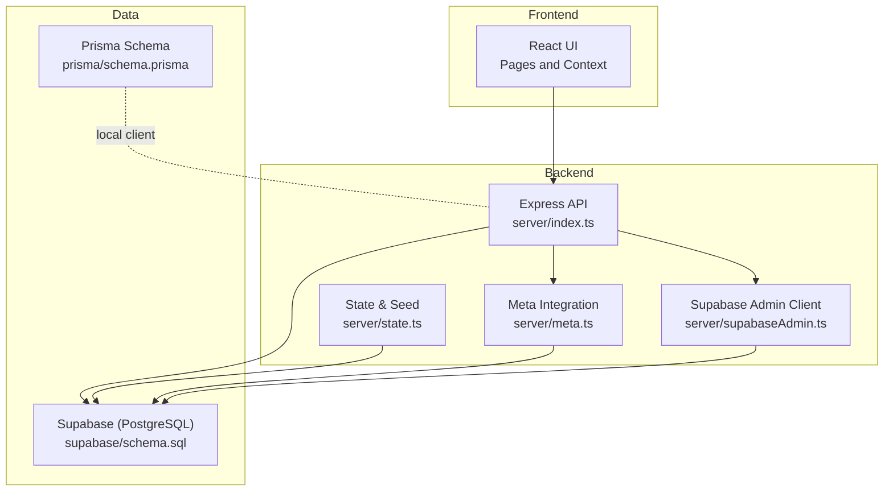
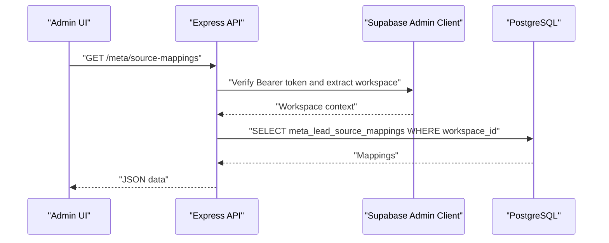
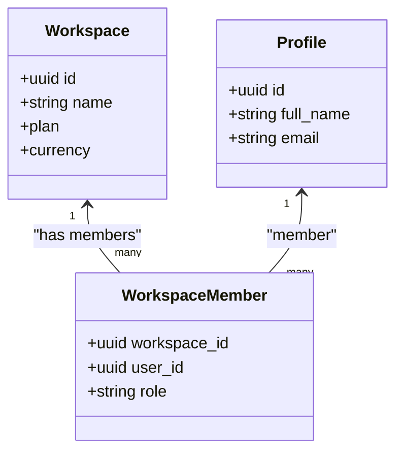
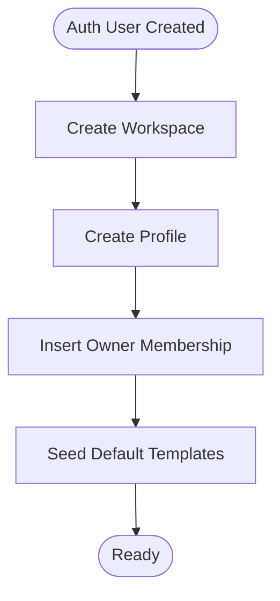
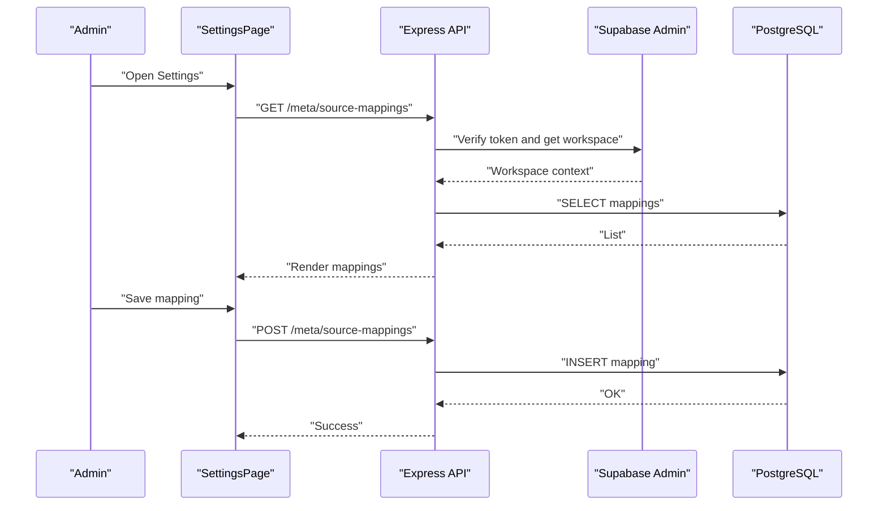
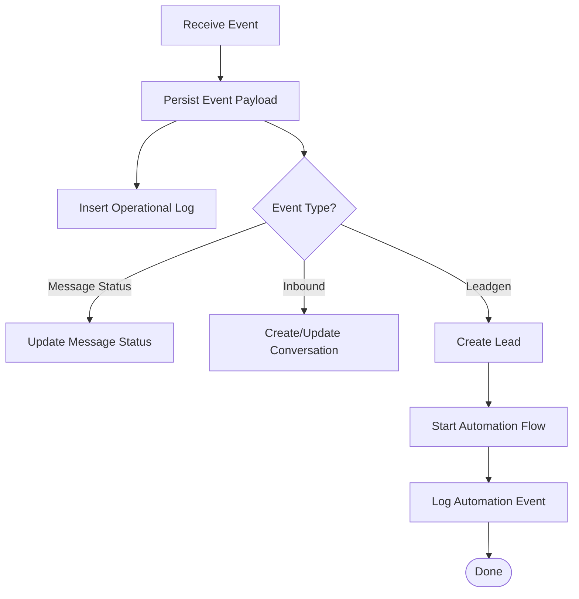
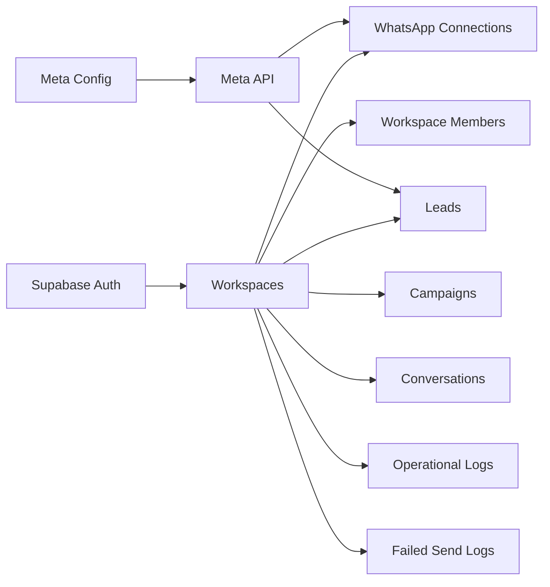

# System Administration

<cite>
**Referenced Files in This Document**
- [README.md](file://README.md)
- [DEPLOYMENT_GUIDE.md](file://DEPLOYMENT_GUIDE.md)
- [server/index.ts](file://server/index.ts)
- [server/state.ts](file://server/state.ts)
- [server/meta.ts](file://server/meta.ts)
- [server/supabaseAdmin.ts](file://server/supabaseAdmin.ts)
- [prisma/schema.prisma](file://prisma/schema.prisma)
- [supabase/schema.sql](file://supabase/schema.sql)
- [supabase/reliability_upgrade.sql](file://supabase/reliability_upgrade.sql)
- [src/pages/SettingsPage.tsx](file://src/pages/SettingsPage.tsx)
- [src/pages/ReliabilityPage.tsx](file://src/pages/ReliabilityPage.tsx)
- [src/context/AppContext.tsx](file://src/context/AppContext.tsx)
- [src/lib/api/types.ts](file://src/lib/api/types.ts)
- [src/lib/meta/sourceMappings.ts](file://src/lib/meta/sourceMappings.ts)
</cite>

## Table of Contents
1. [Introduction](#introduction)
2. [Project Structure](#project-structure)
3. [Core Components](#core-components)
4. [Architecture Overview](#architecture-overview)
5. [Detailed Component Analysis](#detailed-component-analysis)
6. [Dependency Analysis](#dependency-analysis)
7. [Performance Considerations](#performance-considerations)
8. [Troubleshooting Guide](#troubleshooting-guide)
9. [Conclusion](#conclusion)
10. [Appendices](#appendices)

## Introduction
This document provides a comprehensive System Administration guide for the platform, focusing on workspace configuration, user administration, settings management, system monitoring, and backup and recovery procedures. It explains how to manage teams, permissions, branding and connection settings, operational logging, reliability workflows, and how to maintain a robust and scalable environment. Practical examples and diagrams illustrate administrative workflows and system behavior.

## Project Structure
The system is a full-stack application with:
- Frontend built with Vite + React + Tailwind
- Backend as an Express server (Vercel Serverless)
- Database via Supabase (PostgreSQL)
- Authentication and authorization handled by Supabase Auth
- Operational telemetry via PostgreSQL tables for logs and failed sends

**Diagram sources**
- [server/index.ts:36-44](file://server/index.ts#L36-L44)
- [server/state.ts:110-255](file://server/state.ts#L110-L255)
- [server/meta.ts:1-391](file://server/meta.ts#L1-L391)
- [server/supabaseAdmin.ts:1-50](file://server/supabaseAdmin.ts#L1-L50)
- [prisma/schema.prisma:1-279](file://prisma/schema.prisma#L1-L279)
- [supabase/schema.sql:1-517](file://supabase/schema.sql#L1-L517)

**Section sources**
- [README.md:1-26](file://README.md#L1-L26)
- [DEPLOYMENT_GUIDE.md:1-64](file://DEPLOYMENT_GUIDER.md#L1-L64)

## Core Components
- Workspace and Membership: Workspaces are the top-level administrative units. Users belong to a workspace via membership records with roles. Row-level security policies ensure data isolation per workspace.
- User and Session Management: Sessions are tracked via an app session record. Users are provisioned automatically on Auth signup and seeded with a default workspace and initial data.
- WhatsApp/Meta Integration: The backend manages Meta OAuth, authorization persistence, and webhook ingestion for WhatsApp and leadgen events. It also supports outbound messaging and interactive templates.
- Monitoring and Reliability: Operational logs capture info/warning/error events. Failed send logs track delivery failures with retry tracking and resolution.
- Settings and Branding: The Settings page surfaces workspace profile, connection status, and lead source mappings for Meta lead attribution.

**Section sources**
- [supabase/schema.sql:19-43](file://supabase/schema.sql#L19-L43)
- [server/state.ts:51-108](file://server/state.ts#L51-L108)
- [server/meta.ts:237-292](file://server/meta.ts#L237-L292)
- [server/index.ts:258-275](file://server/index.ts#L258-L275)
- [src/pages/SettingsPage.tsx:20-98](file://src/pages/SettingsPage.tsx#L20-L98)

## Architecture Overview
The system integrates Supabase Auth and Storage with a custom Express backend. The backend enforces workspace membership, persists operational telemetry, and orchestrates Meta integrations.

**Diagram sources**
- [server/index.ts:877-899](file://server/index.ts#L877-L899)
- [server/supabaseAdmin.ts:19-49](file://server/supabaseAdmin.ts#L19-L49)
- [src/lib/meta/sourceMappings.ts:34-65](file://src/lib/meta/sourceMappings.ts#L34-L65)

## Detailed Component Analysis

### Workspace Administration
- Team Member Management
  - Membership table defines workspace members and roles. Policies enforce per-workspace access.
  - New users are auto-provisioned with a workspace and an Owner role via a database trigger.
- Permission Controls
  - Row-level security policies restrict reads/writes to the current workspace.
  - Workspace context is extracted from the Authorization header for protected endpoints.
- Branding and Connection Settings
  - The Settings page displays profile, connection status, authorization state, and lead source mappings.
  - Lead source mappings route Meta ad leads to the correct workspace using page/ad/form identifiers.

**Diagram sources**
- [supabase/schema.sql:19-43](file://supabase/schema.sql#L19-L43)
- [supabase/schema.sql:351-387](file://supabase/schema.sql#L351-L387)

**Section sources**
- [supabase/schema.sql:37-43](file://supabase/schema.sql#L37-L43)
- [supabase/schema.sql:426-441](file://supabase/schema.sql#L426-L441)
- [server/supabaseAdmin.ts:19-49](file://server/supabaseAdmin.ts#L19-L49)
- [src/pages/SettingsPage.tsx:100-171](file://src/pages/SettingsPage.tsx#L100-L171)

### User Administration
- Role-Based Access Control
  - Membership role is enforced at the database level; current workspace is derived from the authenticated user.
- Provisioning and Deprovisioning
  - New Supabase users trigger a function that creates a workspace, profile, and initial templates.
  - Deprovisioning is implicit via cascading deletes on workspace removal.
- Activity Monitoring
  - Operational logs capture administrative actions and system events.
  - Failed send logs track message delivery failures and retries.

**Diagram sources**
- [supabase/schema.sql:351-387](file://supabase/schema.sql#L351-L387)

**Section sources**
- [server/state.ts:98-108](file://server/state.ts#L98-L108)
- [server/state.ts:110-255](file://server/state.ts#L110-L255)
- [supabase/schema.sql:426-441](file://supabase/schema.sql#L426-L441)
- [src/context/AppContext.tsx:111-137](file://src/context/AppContext.tsx#L111-L137)

### Settings Management
- Global Configurations
  - Cost-per-message and thresholds are defined in shared types.
- Feature Toggles
  - Automation rules are persisted per workspace and can be enabled/disabled.
- Integration Settings
  - Meta authorization and connection details are stored and validated before sending.
- Compliance Controls
  - Operational logs and failed send logs provide audit trails for compliance reporting.

**Diagram sources**
- [src/pages/SettingsPage.tsx:20-98](file://src/pages/SettingsPage.tsx#L20-L98)
- [src/lib/meta/sourceMappings.ts:34-65](file://src/lib/meta/sourceMappings.ts#L34-L65)
- [server/index.ts:877-899](file://server/index.ts#L877-L899)

**Section sources**
- [src/lib/api/types.ts:1-7](file://src/lib/api/types.ts#L1-L7)
- [src/lib/api/types.ts:22-41](file://src/lib/api/types.ts#L22-L41)
- [server/meta.ts:237-292](file://server/meta.ts#L237-L292)
- [supabase/reliability_upgrade.sql:1-27](file://supabase/reliability_upgrade.sql#L1-L27)

### System Monitoring and Reliability
- Health Checks
  - A simple health endpoint confirms backend availability.
- Operational Logs
  - Structured logs capture info/warning/error events with payloads for diagnostics.
- Failed Send Logs
  - Dedicated table tracks failures, retry counts, and resolution timestamps.
- Reliability Dashboard
  - The Reliability page lists unresolved failed sends and operational warnings/errors, with retry actions.

**Diagram sources**
- [server/index.ts:369-629](file://server/index.ts#L369-L629)
- [server/index.ts:631-750](file://server/index.ts#L631-L750)
- [server/index.ts:196-217](file://server/index.ts#L196-L217)

**Section sources**
- [server/index.ts:761-763](file://server/index.ts#L761-L763)
- [server/index.ts:258-275](file://server/index.ts#L258-L275)
- [server/index.ts:277-317](file://server/index.ts#L277-L317)
- [src/pages/ReliabilityPage.tsx:1-43](file://src/pages/ReliabilityPage.tsx#L1-L43)
- [supabase/reliability_upgrade.sql:1-27](file://supabase/reliability_upgrade.sql#L1-L27)

### Backup and Recovery Procedures
- Database Backups
  - Use Supabase-managed backups or export SQL via the SQL editor for critical schemas.
  - Export schema and data for workspaces, users, and telemetry tables.
- Disaster Recovery Planning
  - Maintain environment variables for Supabase and Meta in a secure secrets manager.
  - Store deployment artifacts and CI/CD configurations under version control.
- Data Integrity Measures
  - Enforce referential integrity via foreign keys and unique constraints.
  - Use atomic operations for webhook deduplication and operational logging.

**Section sources**
- [supabase/schema.sql:1-517](file://supabase/schema.sql#L1-L517)
- [DEPLOYMENT_GUIDE.md:33-59](file://DEPLOYMENT_GUIDE.md#L33-L59)

## Dependency Analysis
- Workspace membership and RLS
  - All domain tables reference the workspace, and policies gate access based on the current workspace derived from the authenticated user.
- Meta integration
  - OAuth exchange, authorization persistence, and webhook ingestion depend on Meta API configuration and Supabase admin client.
- Frontend-to-backend contracts
  - The frontend consumes typed state and invokes API endpoints for settings, reliability, and operational actions.

**Diagram sources**
- [supabase/schema.sql:19-276](file://supabase/schema.sql#L19-L276)
- [server/meta.ts:1-391](file://server/meta.ts#L1-L391)
- [server/supabaseAdmin.ts:1-50](file://server/supabaseAdmin.ts#L1-L50)

**Section sources**
- [supabase/schema.sql:426-517](file://supabase/schema.sql#L426-L517)
- [server/meta.ts:237-292](file://server/meta.ts#L237-L292)

## Performance Considerations
- Database Indexing and Constraints
  - Unique indexes on (workspace_id, phone) for contacts and (contact_id, tag) for tags improve lookup performance.
  - Foreign keys ensure referential integrity and enable efficient joins.
- Operational Logging Overhead
  - Batch writes for webhook events and logs where possible; ensure indexing on workspace_id and timestamps for fast queries.
- Message Delivery Scaling
  - Use scheduled campaigns and queue-like patterns via campaign recipients to avoid burst loads.
- Frontend Hydration
  - Minimize state hydration frequency; cache app state and refresh selectively after administrative actions.

[No sources needed since this section provides general guidance]

## Troubleshooting Guide
- Authorization and Membership Issues
  - Verify the Authorization header and that the user belongs to a workspace. Workspace context extraction fails if membership is missing.
- Meta Integration Problems
  - Confirm Meta app credentials and webhook verify token. Check authorization persistence and expiration.
- Operational Diagnostics
  - Review operational logs for errors and warnings. Use the Reliability dashboard to identify unresolved failed sends and retry them.
- Environment Configuration
  - Ensure Supabase service role key and URLs are present. Verify Meta API version and app credentials.

**Section sources**
- [server/supabaseAdmin.ts:19-49](file://server/supabaseAdmin.ts#L19-L49)
- [server/meta.ts:6-16](file://server/meta.ts#L6-L16)
- [src/pages/ReliabilityPage.tsx:17-43](file://src/pages/ReliabilityPage.tsx#L17-L43)

## Conclusion
This guide outlined how to administer workspaces, manage users and permissions, configure settings, monitor reliability, and plan backups. By leveraging Supabase’s RLS, operational logging, and Meta integration, administrators can maintain a secure, observable, and scalable environment. Apply the recommended practices for capacity planning, alerting, and recovery to sustain long-term platform health.

[No sources needed since this section summarizes without analyzing specific files]

## Appendices

### Administrative Dashboards and Workflows
- Settings Dashboard
  - Manage profile, connection trust, and lead source mappings.
- Reliability Dashboard
  - View and resolve failed sends and operational alerts.
- Onboarding Workflow
  - Auto-provisioning on first login, seeding templates, and initial setup.

**Section sources**
- [src/pages/SettingsPage.tsx:20-250](file://src/pages/SettingsPage.tsx#L20-L250)
- [src/pages/ReliabilityPage.tsx:1-43](file://src/pages/ReliabilityPage.tsx#L1-L43)
- [server/state.ts:110-255](file://server/state.ts#L110-L255)