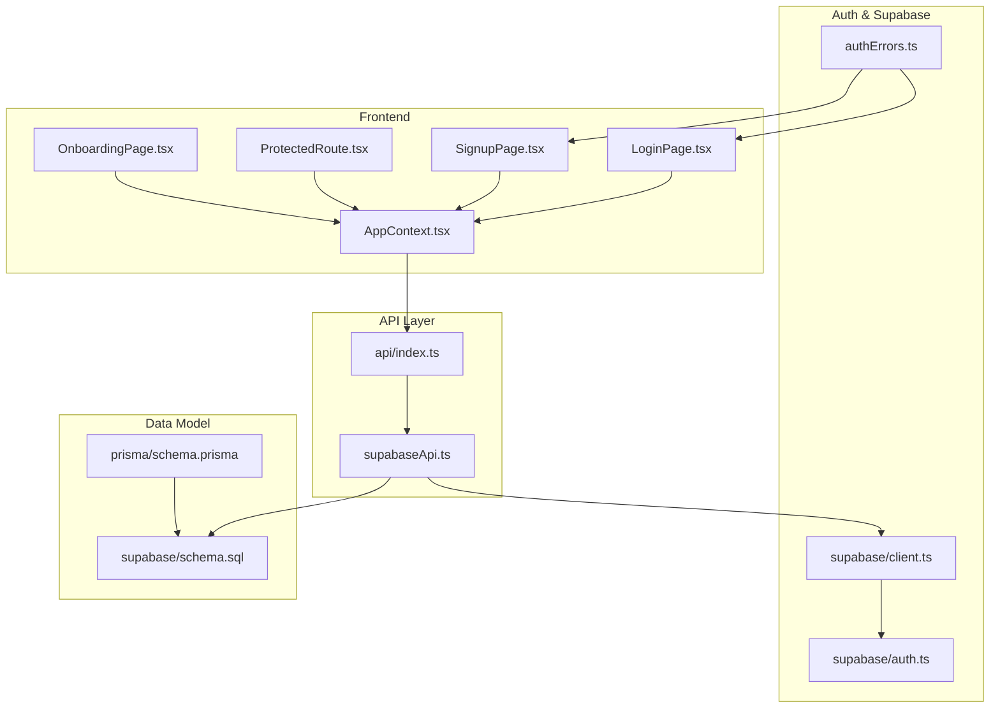
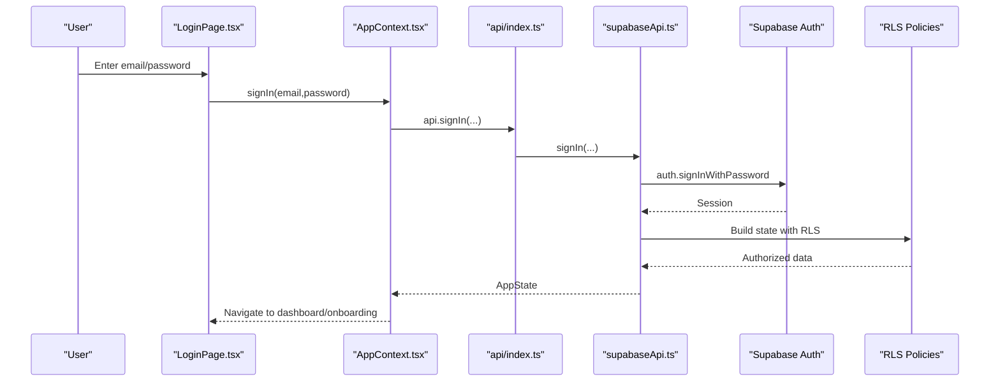
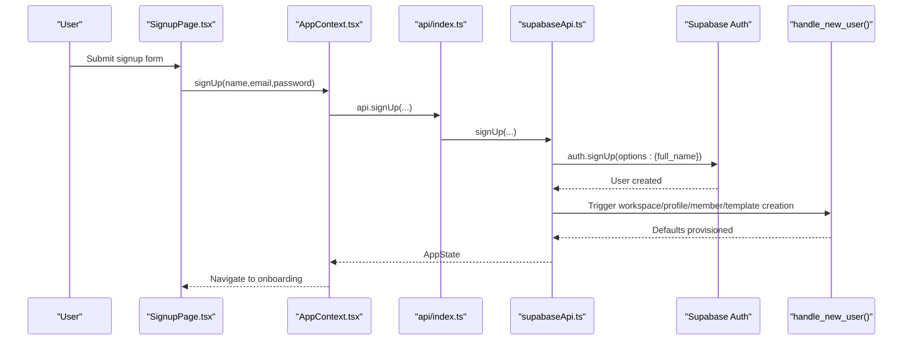
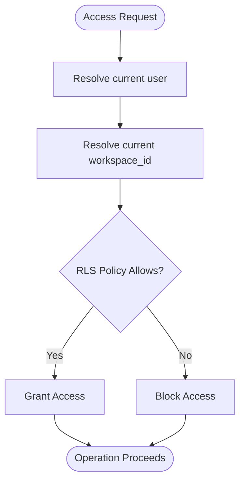
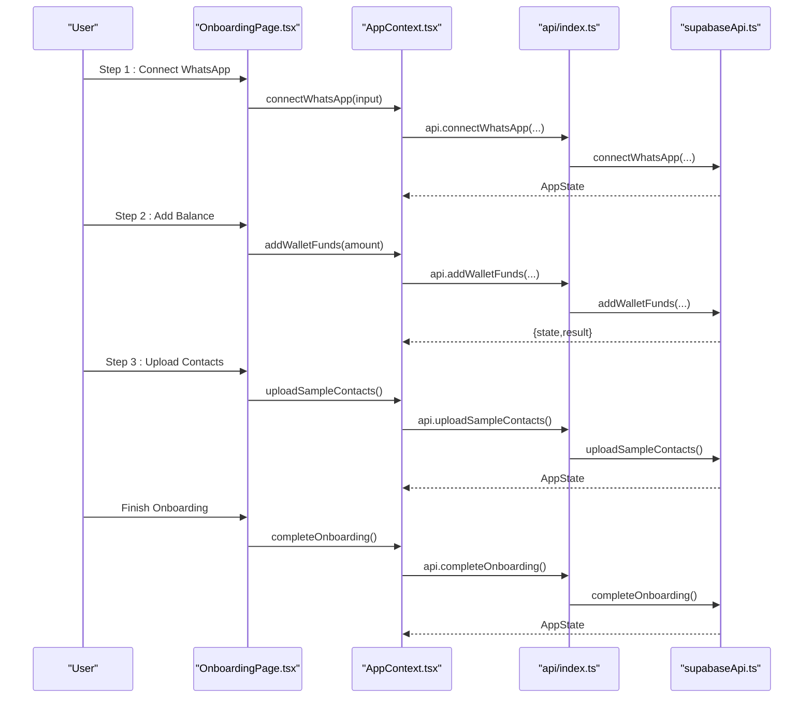
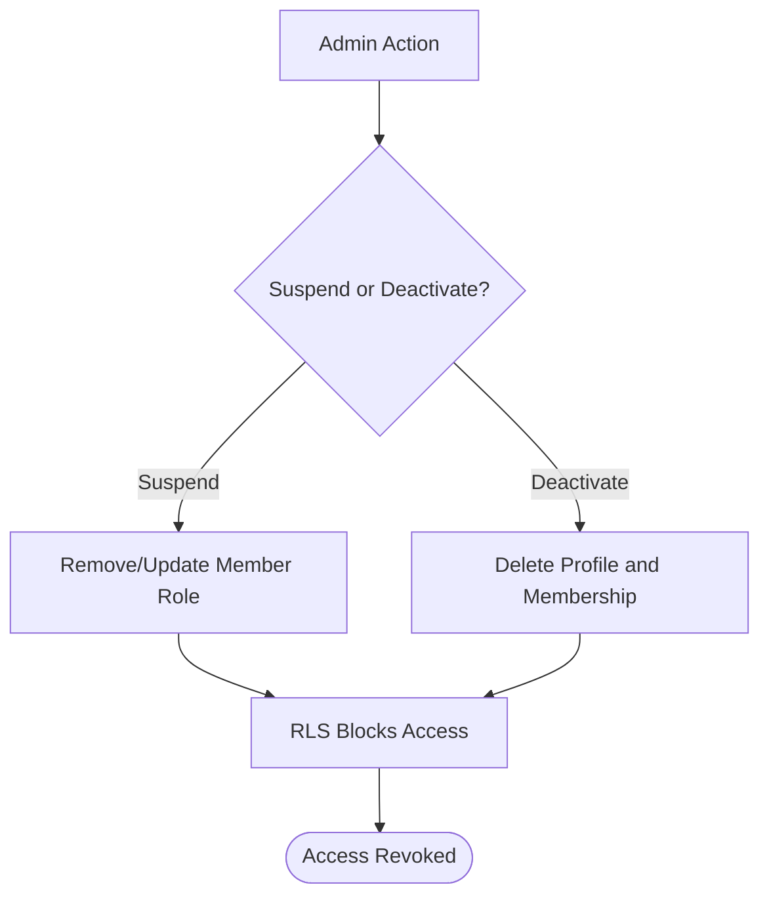
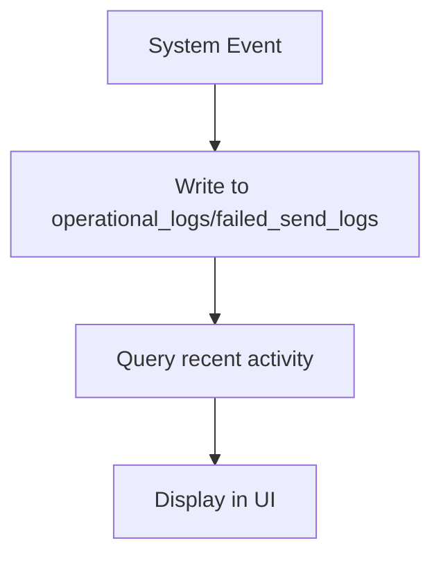
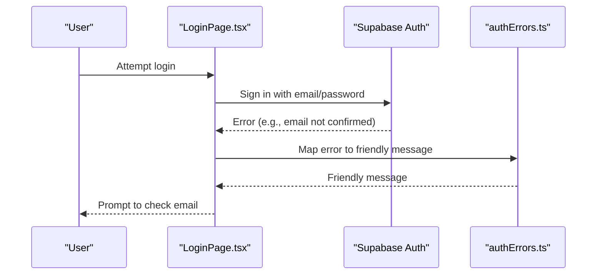
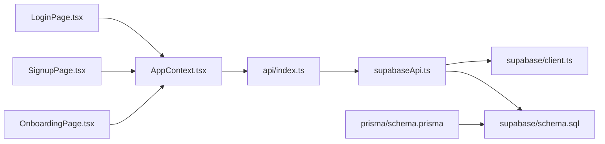
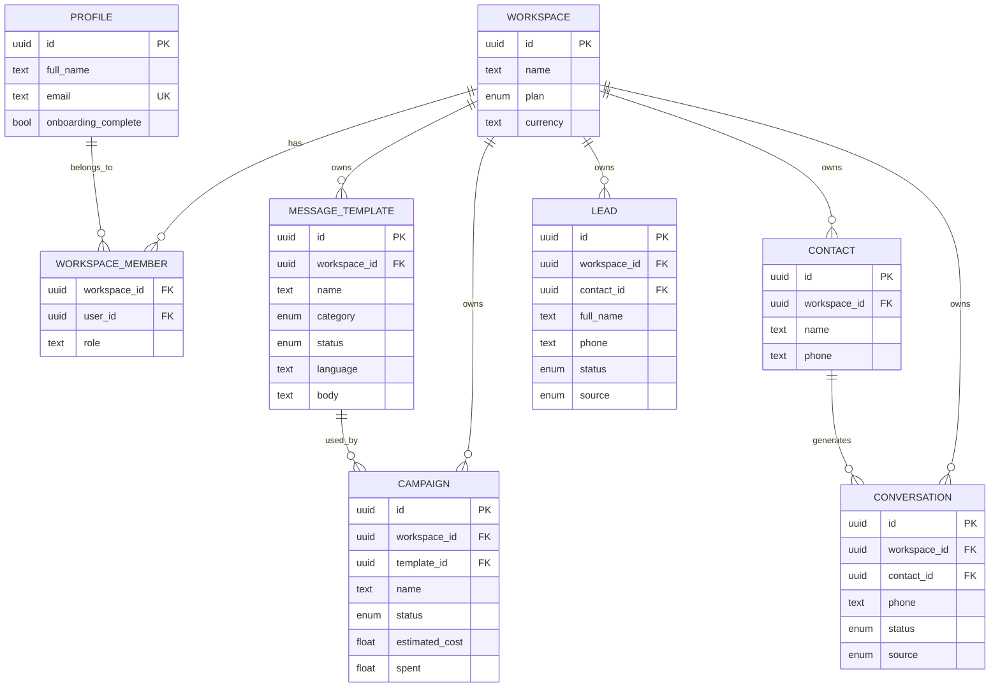

# User Administration

<cite>
**Referenced Files in This Document**
- [LoginPage.tsx](file://src/pages/LoginPage.tsx)
- [SignupPage.tsx](file://src/pages/SignupPage.tsx)
- [OnboardingPage.tsx](file://src/pages/OnboardingPage.tsx)
- [ProtectedRoute.tsx](file://src/components/ProtectedRoute.tsx)
- [AppContext.tsx](file://src/context/AppContext.tsx)
- [index.ts](file://src/lib/api/index.ts)
- [supabaseApi.ts](file://src/lib/api/supabaseApi.ts)
- [client.ts](file://src/lib/supabase/client.ts)
- [auth.ts](file://src/lib/supabase/auth.ts)
- [authErrors.ts](file://src/lib/authErrors.ts)
- [schema.prisma](file://prisma/schema.prisma)
- [schema.sql](file://supabase/schema.sql)
</cite>

## Table of Contents
1. [Introduction](#introduction)
2. [Project Structure](#project-structure)
3. [Core Components](#core-components)
4. [Architecture Overview](#architecture-overview)
5. [Detailed Component Analysis](#detailed-component-analysis)
6. [Dependency Analysis](#dependency-analysis)
7. [Performance Considerations](#performance-considerations)
8. [Troubleshooting Guide](#troubleshooting-guide)
9. [Conclusion](#conclusion)
10. [Appendices](#appendices)

## Introduction
This document provides comprehensive guidance for user administration in the platform, focusing on user lifecycle management, role-based access control, and provisioning workflows. It covers user onboarding, authentication and authorization, provisioning of accounts and workspaces, deprovisioning and suspension procedures, activity monitoring, self-service capabilities, and privacy/compliance considerations. The content is grounded in the repository’s frontend pages, context/provider, API adapters, Supabase integration, and backend schema.

## Project Structure
The user administration functionality spans several layers:
- Authentication and routing: Login, signup, protected routes, and context-driven state
- Provisioning and onboarding: Workspace creation, initial setup, and welcome configuration
- Authorization and RBAC: Row-level security policies and workspace membership roles
- Data model: Prisma and Supabase schemas defining users, workspaces, and related entities
- API abstraction: Adapter pattern supporting mock, HTTP, and Supabase backends

**Diagram sources**
- [LoginPage.tsx:1-158](file://src/pages/LoginPage.tsx#L1-L158)
- [SignupPage.tsx:1-144](file://src/pages/SignupPage.tsx#L1-L144)
- [ProtectedRoute.tsx:1-24](file://src/components/ProtectedRoute.tsx#L1-L24)
- [AppContext.tsx:1-239](file://src/context/AppContext.tsx#L1-L239)
- [OnboardingPage.tsx:1-245](file://src/pages/OnboardingPage.tsx#L1-L245)
- [index.ts:1-23](file://src/lib/api/index.ts#L1-L23)
- [supabaseApi.ts:1-800](file://src/lib/api/supabaseApi.ts#L1-L800)
- [client.ts:1-16](file://src/lib/supabase/client.ts#L1-L16)
- [auth.ts:1-20](file://src/lib/supabase/auth.ts#L1-L20)
- [authErrors.ts:1-59](file://src/lib/authErrors.ts#L1-L59)
- [schema.prisma:1-279](file://prisma/schema.prisma#L1-L279)
- [schema.sql:1-517](file://supabase/schema.sql#L1-L517)

**Section sources**
- [LoginPage.tsx:1-158](file://src/pages/LoginPage.tsx#L1-L158)
- [SignupPage.tsx:1-144](file://src/pages/SignupPage.tsx#L1-L144)
- [ProtectedRoute.tsx:1-24](file://src/components/ProtectedRoute.tsx#L1-L24)
- [AppContext.tsx:1-239](file://src/context/AppContext.tsx#L1-L239)
- [OnboardingPage.tsx:1-245](file://src/pages/OnboardingPage.tsx#L1-L245)
- [index.ts:1-23](file://src/lib/api/index.ts#L1-L23)
- [supabaseApi.ts:1-800](file://src/lib/api/supabaseApi.ts#L1-L800)
- [client.ts:1-16](file://src/lib/supabase/client.ts#L1-L16)
- [auth.ts:1-20](file://src/lib/supabase/auth.ts#L1-L20)
- [authErrors.ts:1-59](file://src/lib/authErrors.ts#L1-L59)
- [schema.prisma:1-279](file://prisma/schema.prisma#L1-L279)
- [schema.sql:1-517](file://supabase/schema.sql#L1-L517)

## Core Components
- Authentication and session management:
  - Email/password and Google OAuth login/signup flows
  - Auth error handling and user feedback
  - Protected route enforcement
- Provisioning and onboarding:
  - Workspace creation and default resource provisioning
  - Initial setup steps: connect WhatsApp, add wallet balance, upload contacts
  - Onboarding completion and redirect to dashboard
- Authorization and RBAC:
  - Workspace membership and roles
  - Row-level security policies restricting data access to members
- Activity monitoring:
  - Operational logs and failed send logs
  - Conversation events and recent activity aggregation

**Section sources**
- [LoginPage.tsx:13-64](file://src/pages/LoginPage.tsx#L13-L64)
- [SignupPage.tsx:13-87](file://src/pages/SignupPage.tsx#L13-L87)
- [ProtectedRoute.tsx:4-23](file://src/components/ProtectedRoute.tsx#L4-L23)
- [AppContext.tsx:111-129](file://src/context/AppContext.tsx#L111-L129)
- [OnboardingPage.tsx:27-91](file://src/pages/OnboardingPage.tsx#L27-L91)
- [supabaseApi.ts:486-537](file://src/lib/api/supabaseApi.ts#L486-L537)
- [schema.sql:35-43](file://supabase/schema.sql#L35-L43)
- [schema.sql:402-516](file://supabase/schema.sql#L402-L516)

## Architecture Overview
The system uses an adapter pattern to support multiple backends. The Supabase adapter powers authentication, workspace membership, and data access via row-level security policies. The frontend context coordinates state hydration, authentication actions, and onboarding.

**Diagram sources**
- [LoginPage.tsx:20-41](file://src/pages/LoginPage.tsx#L20-L41)
- [AppContext.tsx:111-115](file://src/context/AppContext.tsx#L111-L115)
- [index.ts:18-22](file://src/lib/api/index.ts#L18-L22)
- [supabaseApi.ts:486-493](file://src/lib/api/supabaseApi.ts#L486-L493)
- [client.ts:8-15](file://src/lib/supabase/client.ts#L8-L15)
- [schema.sql:402-516](file://supabase/schema.sql#L402-L516)

## Detailed Component Analysis

### Authentication and Authorization
- Login and signup:
  - Email/password and Google OAuth flows
  - Error messaging mapped to user-friendly hints
- Protected routes:
  - Redirect unauthenticated users to login
  - Show loading state during hydration
- Supabase integration:
  - Client initialization with persisted sessions
  - OAuth redirect configuration
- Row-level security:
  - Workspace-scoped policies for all tables
  - Membership checks via current workspace ID

**Diagram sources**
- [SignupPage.tsx:25-55](file://src/pages/SignupPage.tsx#L25-L55)
- [AppContext.tsx:116-120](file://src/context/AppContext.tsx#L116-L120)
- [index.ts:18-22](file://src/lib/api/index.ts#L18-L22)
- [supabaseApi.ts:495-515](file://src/lib/api/supabaseApi.ts#L495-L515)
- [schema.sql:351-387](file://supabase/schema.sql#L351-L387)

**Section sources**
- [LoginPage.tsx:13-64](file://src/pages/LoginPage.tsx#L13-L64)
- [SignupPage.tsx:13-87](file://src/pages/SignupPage.tsx#L13-L87)
- [ProtectedRoute.tsx:4-23](file://src/components/ProtectedRoute.tsx#L4-L23)
- [authErrors.ts:1-59](file://src/lib/authErrors.ts#L1-L59)
- [client.ts:1-16](file://src/lib/supabase/client.ts#L1-L16)
- [auth.ts:1-20](file://src/lib/supabase/auth.ts#L1-L20)
- [schema.sql:402-516](file://supabase/schema.sql#L402-L516)

### Role-Based Access Control (RBAC)
- Workspace membership and roles:
  - Membership stored in workspace_members with role defaults
  - Current workspace derived via helper function
- Row-level security:
  - All workspace tables enable RLS
  - Policies restrict reads/writes to members of the current workspace
- Implications:
  - Data isolation per workspace
  - Access governed by membership and policies

**Diagram sources**
- [schema.sql:389-400](file://supabase/schema.sql#L389-L400)
- [schema.sql:402-516](file://supabase/schema.sql#L402-L516)

**Section sources**
- [schema.sql:35-43](file://supabase/schema.sql#L35-L43)
- [schema.sql:402-516](file://supabase/schema.sql#L402-L516)

### User Provisioning Workflows
- Account creation:
  - Supabase auth signup with profile metadata
  - Automatic workspace, member, and default template provisioning
- Profile setup:
  - Onboarding completion flag stored in profiles
- Initial workspace assignment:
  - New user becomes owner of a newly created workspace
- Onboarding steps:
  - Connect WhatsApp Business
  - Add wallet balance
  - Upload sample contacts
  - Complete onboarding and enter dashboard

**Diagram sources**
- [OnboardingPage.tsx:47-91](file://src/pages/OnboardingPage.tsx#L47-L91)
- [AppContext.tsx:125-137](file://src/context/AppContext.tsx#L125-L137)
- [index.ts:18-22](file://src/lib/api/index.ts#L18-L22)
- [supabaseApi.ts:526-563](file://src/lib/api/supabaseApi.ts#L526-L563)

**Section sources**
- [supabaseApi.ts:495-515](file://src/lib/api/supabaseApi.ts#L495-L515)
- [supabaseApi.ts:526-563](file://src/lib/api/supabaseApi.ts#L526-L563)
- [OnboardingPage.tsx:27-91](file://src/pages/OnboardingPage.tsx#L27-L91)

### User Deactivation, Suspension, and Deprovisioning
- Suspension and deactivation:
  - No explicit “suspend user” endpoint in the adapter
  - Workspace membership role governs access; removal revokes access
- Deprovisioning:
  - Deleting a user removes their profile and workspace membership
  - Cascading deletes propagate to dependent records
- Practical guidance:
  - To suspend, remove or modify the user’s membership record
  - To fully deprovision, remove the user profile and associated membership

**Diagram sources**
- [schema.sql:351-387](file://supabase/schema.sql#L351-L387)
- [schema.sql:402-516](file://supabase/schema.sql#L402-L516)

**Section sources**
- [schema.sql:351-387](file://supabase/schema.sql#L351-L387)
- [schema.sql:402-516](file://supabase/schema.sql#L402-L516)

### User Activity Monitoring and Audit Logging
- Operational logs:
  - Logged events with type, level, and payload
- Failed send logs:
  - Channel, destination, error messages, retry tracking
- Conversation events:
  - Status updates, assignments, internal notes
- Recent activity:
  - Aggregated from campaigns and wallet transactions

**Diagram sources**
- [supabaseApi.ts:252-264](file://src/lib/api/supabaseApi.ts#L252-L264)
- [supabaseApi.ts:699-707](file://src/lib/api/supabaseApi.ts#L699-L707)
- [supabaseApi.ts:456-470](file://src/lib/api/supabaseApi.ts#L456-L470)

**Section sources**
- [supabaseApi.ts:252-264](file://src/lib/api/supabaseApi.ts#L252-L264)
- [supabaseApi.ts:699-707](file://src/lib/api/supabaseApi.ts#L699-L707)
- [supabaseApi.ts:456-470](file://src/lib/api/supabaseApi.ts#L456-L470)

### Self-Service Capabilities, Password Management, and Recovery
- Self-service:
  - Frontend pages expose login/signup and onboarding flows
- Password management:
  - Supabase handles password authentication and resets
- Recovery:
  - Email confirmation required for login in demo mode
  - Auth error messages guide users to confirm emails or retry

**Diagram sources**
- [LoginPage.tsx:20-41](file://src/pages/LoginPage.tsx#L20-L41)
- [authErrors.ts:12-18](file://src/lib/authErrors.ts#L12-L18)

**Section sources**
- [LoginPage.tsx:13-64](file://src/pages/LoginPage.tsx#L13-L64)
- [authErrors.ts:1-59](file://src/lib/authErrors.ts#L1-L59)

### Privacy, Compliance, and Consent
- Data isolation:
  - Row-level security ensures per-workspace data isolation
- Minimal PII:
  - Profiles store name and email; additional fields can be added per policy
- Consent and policies:
  - Implement consent mechanisms at signup and data processing stages
- Auditability:
  - Operational logs and conversation events support audit trails

**Section sources**
- [schema.sql:402-516](file://supabase/schema.sql#L402-L516)
- [supabaseApi.ts:456-470](file://src/lib/api/supabaseApi.ts#L456-L470)

## Dependency Analysis
- Frontend depends on AppContext for state and actions
- AppContext delegates to the active API adapter
- Supabase adapter depends on Supabase client and RLS policies
- Prisma schema and Supabase schema define the canonical data model

**Diagram sources**
- [LoginPage.tsx:1-158](file://src/pages/LoginPage.tsx#L1-L158)
- [SignupPage.tsx:1-144](file://src/pages/SignupPage.tsx#L1-L144)
- [OnboardingPage.tsx:1-245](file://src/pages/OnboardingPage.tsx#L1-L245)
- [AppContext.tsx:1-239](file://src/context/AppContext.tsx#L1-L239)
- [index.ts:1-23](file://src/lib/api/index.ts#L1-L23)
- [supabaseApi.ts:1-800](file://src/lib/api/supabaseApi.ts#L1-L800)
- [client.ts:1-16](file://src/lib/supabase/client.ts#L1-L16)
- [schema.prisma:1-279](file://prisma/schema.prisma#L1-L279)
- [schema.sql:1-517](file://supabase/schema.sql#L1-L517)

**Section sources**
- [index.ts:1-23](file://src/lib/api/index.ts#L1-L23)
- [supabaseApi.ts:1-800](file://src/lib/api/supabaseApi.ts#L1-L800)
- [client.ts:1-16](file://src/lib/supabase/client.ts#L1-L16)
- [schema.prisma:1-279](file://prisma/schema.prisma#L1-L279)
- [schema.sql:1-517](file://supabase/schema.sql#L1-L517)

## Performance Considerations
- Minimize round-trips:
  - Batch reads for state hydration
  - Use optional queries for tables that may not exist yet
- Efficient UI updates:
  - Use context memoization to avoid unnecessary re-renders
- RLS overhead:
  - Keep policies simple and leverage indexed columns
- Network resilience:
  - Surface meaningful errors and retry strategies for provisioning steps

## Troubleshooting Guide
Common issues and resolutions:
- Email confirmation required:
  - Ensure email confirmation is completed before login
- Permission denied or RLS violations:
  - Verify workspace setup and membership policies
- Missing tables:
  - Run latest upgrade SQL scripts to initialize CRM tables
- Demo mode limitations:
  - Some flows rely on configured environment variables

**Section sources**
- [authErrors.ts:12-18](file://src/lib/authErrors.ts#L12-L18)
- [authErrors.ts:28-38](file://src/lib/authErrors.ts#L28-L38)
- [supabaseApi.ts:201-216](file://src/lib/api/supabaseApi.ts#L201-L216)

## Conclusion
The platform implements robust user lifecycle management with Supabase-backed authentication, workspace-scoped provisioning, and comprehensive row-level security. The adapter pattern enables flexible backend integration, while onboarding and activity monitoring streamline user administration tasks. Administrators can manage access via membership roles, enforce privacy through RLS, and maintain auditability with operational logs.

## Appendices
- Data model overview (high level):
  - Users belong to workspaces via membership records
  - Workspaces own contacts, templates, campaigns, and related entities
  - Conversations and leads are scoped to workspaces with RLS policies

**Diagram sources**
- [schema.prisma:90-128](file://prisma/schema.prisma#L90-L128)
- [schema.prisma:145-157](file://prisma/schema.prisma#L145-L157)
- [schema.prisma:170-182](file://prisma/schema.prisma#L170-L182)
- [schema.prisma:184-200](file://prisma/schema.prisma#L184-L200)
- [schema.prisma:130-143](file://prisma/schema.prisma#L130-L143)
- [schema.prisma:201-212](file://prisma/schema.prisma#L201-L212)
- [schema.prisma:227-249](file://prisma/schema.prisma#L227-L249)