# Workspace Management

<cite>
**Referenced Files in This Document**
- [README.md](file://README.md)
- [SettingsPage.tsx](file://src/pages/SettingsPage.tsx)
- [AppContext.tsx](file://src/context/AppContext.tsx)
- [DashboardLayout.tsx](file://src/components/DashboardLayout.tsx)
- [AppSidebar.tsx](file://src/components/AppSidebar.tsx)
- [api/index.ts](file://src/lib/api/index.ts)
- [client.ts](file://src/lib/supabase/client.ts)
- [schema.prisma](file://prisma/schema.prisma)
- [schema.sql](file://supabase/schema.sql)
- [authErrors.ts](file://src/lib/authErrors.ts)
- [index.ts](file://server/index.ts)
- [status.ts](file://src/lib/meta/status.ts)
</cite>

## Table of Contents
1. [Introduction](#introduction)
2. [Project Structure](#project-structure)
3. [Core Components](#core-components)
4. [Architecture Overview](#architecture-overview)
5. [Detailed Component Analysis](#detailed-component-analysis)
6. [Dependency Analysis](#dependency-analysis)
7. [Performance Considerations](#performance-considerations)
8. [Troubleshooting Guide](#troubleshooting-guide)
9. [Conclusion](#conclusion)
10. [Appendices](#appendices)

## Introduction
This document explains workspace management in the application, focusing on workspace configuration, team member administration, permission controls, and branding customization. It covers:
- Workspace settings: profile management, connection trust establishment, and platform access controls
- Team member workflows: invitations, roles, and access levels
- Permission systems: workspace-level permissions, feature access, and administrative privileges
- Practical onboarding and provisioning workflows
- Branding and display preferences
- Scaling, multi-workspace support, and isolation mechanisms

The application integrates Supabase for authentication, row-level security (RLS), and relational data modeling, with a frontend built on React and a serverless backend.

## Project Structure
The workspace management surface is primarily implemented in the frontend under src/pages and src/components, backed by Supabase RLS policies and Prisma schema definitions. Authentication and API selection are centralized in the API layer.

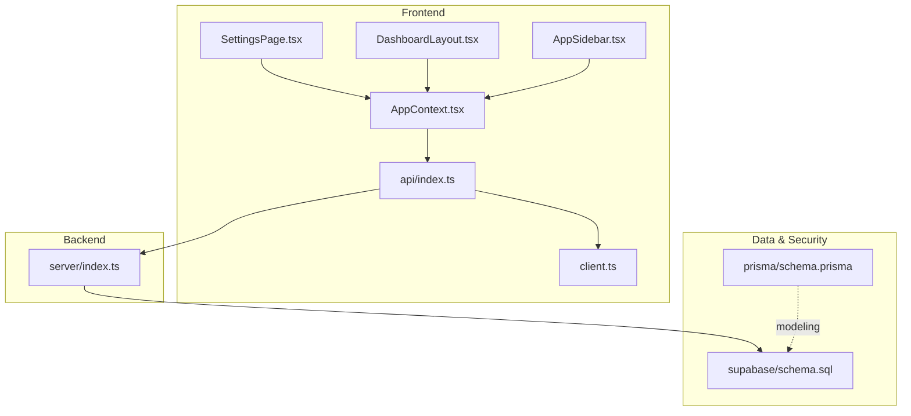

**Diagram sources**
- [SettingsPage.tsx:1-252](file://src/pages/SettingsPage.tsx#L1-L252)
- [DashboardLayout.tsx:1-37](file://src/components/DashboardLayout.tsx#L1-L37)
- [AppSidebar.tsx:1-146](file://src/components/AppSidebar.tsx#L1-L146)
- [AppContext.tsx:1-239](file://src/context/AppContext.tsx#L1-L239)
- [api/index.ts:1-23](file://src/lib/api/index.ts#L1-L23)
- [client.ts:1-16](file://src/lib/supabase/client.ts#L1-L16)
- [index.ts](file://server/index.ts)
- [schema.prisma:1-279](file://prisma/schema.prisma#L1-L279)
- [schema.sql:1-517](file://supabase/schema.sql#L1-L517)

**Section sources**
- [README.md:1-26](file://README.md#L1-L26)
- [api/index.ts:1-23](file://src/lib/api/index.ts#L1-L23)
- [client.ts:1-16](file://src/lib/supabase/client.ts#L1-L16)
- [schema.prisma:90-108](file://prisma/schema.prisma#L90-L108)
- [schema.sql:19-43](file://supabase/schema.sql#L19-L43)

## Core Components
- SettingsPage: Central workspace configuration UI, including profile, WhatsApp connection status, API readiness, and Meta lead source mappings.
- AppContext: Global state provider exposing authentication, workspace state, and actions (connect/disconnect WhatsApp, manage campaigns, etc.).
- DashboardLayout and AppSidebar: Navigation and header context, including wallet balance and connection status.
- API layer: Adapter selection among mock, http, and supabase; resolves active adapter at runtime.
- Supabase client: Environment-driven client initialization with session persistence.
- Prisma and Supabase schemas: Define workspace, members, connections, and RLS policies.

**Section sources**
- [SettingsPage.tsx:20-252](file://src/pages/SettingsPage.tsx#L20-L252)
- [AppContext.tsx:56-239](file://src/context/AppContext.tsx#L56-L239)
- [DashboardLayout.tsx:5-37](file://src/components/DashboardLayout.tsx#L5-L37)
- [AppSidebar.tsx:57-146](file://src/components/AppSidebar.tsx#L57-L146)
- [api/index.ts:13-23](file://src/lib/api/index.ts#L13-L23)
- [client.ts:8-16](file://src/lib/supabase/client.ts#L8-L16)
- [schema.prisma:90-108](file://prisma/schema.prisma#L90-L108)
- [schema.sql:19-43](file://supabase/schema.sql#L19-L43)

## Architecture Overview
Workspace management spans UI, state, API, and database layers with Supabase enforcing per-user workspace membership via RLS.

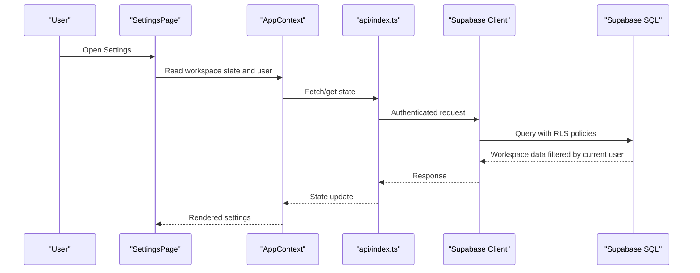

**Diagram sources**
- [SettingsPage.tsx:20-252](file://src/pages/SettingsPage.tsx#L20-L252)
- [AppContext.tsx:100-226](file://src/context/AppContext.tsx#L100-L226)
- [api/index.ts:18-23](file://src/lib/api/index.ts#L18-L23)
- [client.ts:8-16](file://src/lib/supabase/client.ts#L8-L16)
- [schema.sql:432-441](file://supabase/schema.sql#L432-L441)

## Detailed Component Analysis

### Workspace Configuration
Workspace configuration is exposed in the Settings page, including:
- Profile: Owner identity and login details
- WhatsApp connection: Status, authorization, expiry, display number, business portfolio, verification, account review, and OBA
- API readiness: Placeholder for future API access controls
- Future modules: Reserved UI blocks for upcoming integrations
- Meta lead source mappings: Save and list page/ad/form identifiers mapped to a workspace

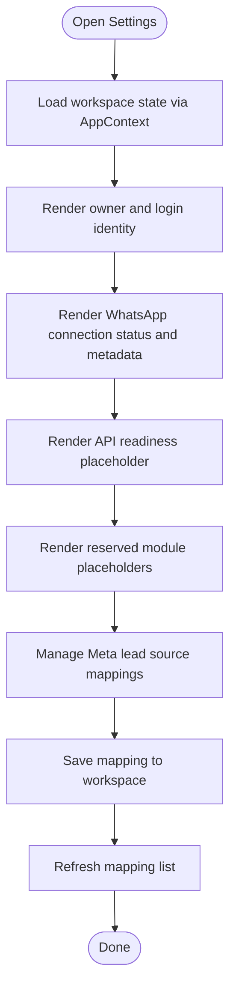

**Diagram sources**
- [SettingsPage.tsx:20-252](file://src/pages/SettingsPage.tsx#L20-L252)
- [AppContext.tsx:100-226](file://src/context/AppContext.tsx#L100-L226)
- [status.ts:57-84](file://src/lib/meta/status.ts#L57-L84)

**Section sources**
- [SettingsPage.tsx:65-250](file://src/pages/SettingsPage.tsx#L65-L250)
- [status.ts:57-84](file://src/lib/meta/status.ts#L57-L84)

### Team Member Administration
Team member administration is modeled in the database with a workspace_members table and RLS policies. The schema defines:
- Workspace model with relations to users and resources
- Profiles and workspace_members linking users to workspaces with a default owner role
- RLS policies ensuring users can only access their own workspace data

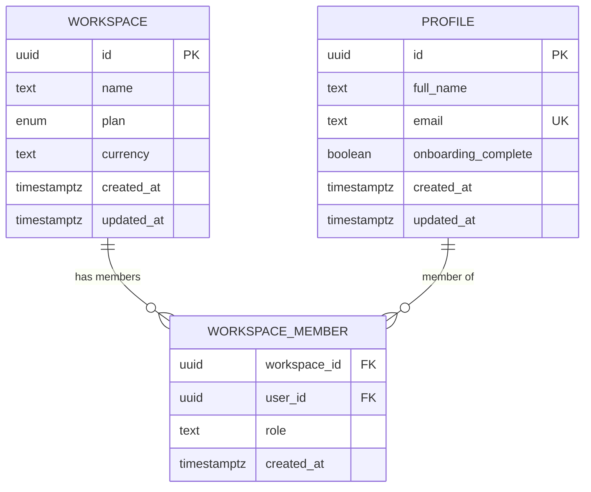

**Diagram sources**
- [schema.prisma:90-120](file://prisma/schema.prisma#L90-L120)
- [schema.sql:19-43](file://supabase/schema.sql#L19-L43)

**Section sources**
- [schema.prisma:90-120](file://prisma/schema.prisma#L90-L120)
- [schema.sql:19-43](file://supabase/schema.sql#L19-L43)
- [schema.sql:432-441](file://supabase/schema.sql#L432-L441)

### Permission Controls and Workspace Isolation
Supabase enforces workspace isolation using:
- Row-level security policies selecting by current workspace derived from the authenticated user
- Policies for all workspace-scoped tables ensuring read/write access is restricted to the user’s workspace
- Functions to derive the current workspace ID for the active session

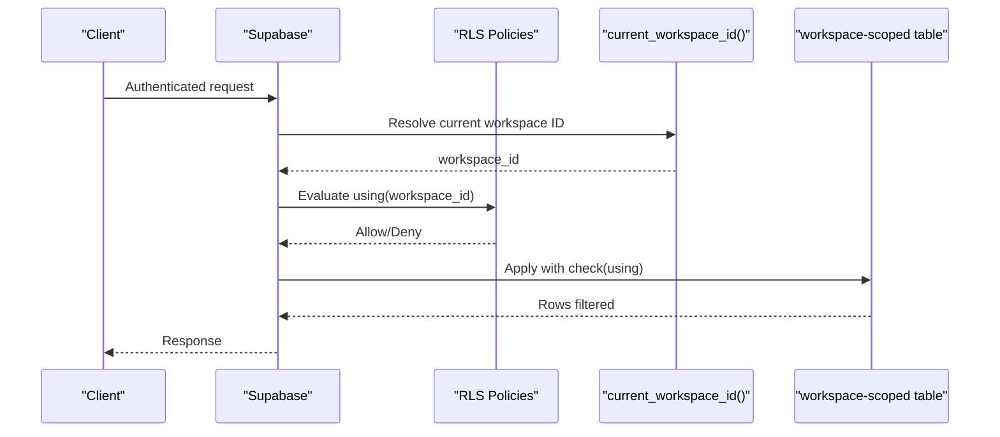

**Diagram sources**
- [schema.sql:389-400](file://supabase/schema.sql#L389-L400)
- [schema.sql:443-499](file://supabase/schema.sql#L443-L499)

**Section sources**
- [schema.sql:402-424](file://supabase/schema.sql#L402-L424)
- [schema.sql:443-499](file://supabase/schema.sql#L443-L499)

### Platform Access Controls and API Keys
The Settings page exposes a placeholder for API access controls and a request mechanism for API access. The backend adapters are selected at runtime based on environment variables.

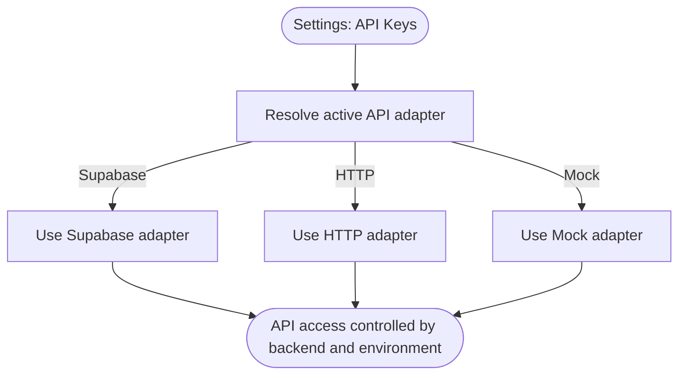

**Diagram sources**
- [SettingsPage.tsx:183-189](file://src/pages/SettingsPage.tsx#L183-L189)
- [api/index.ts:13-23](file://src/lib/api/index.ts#L13-L23)

**Section sources**
- [SettingsPage.tsx:173-190](file://src/pages/SettingsPage.tsx#L173-L190)
- [api/index.ts:13-23](file://src/lib/api/index.ts#L13-L23)

### Connection Trust Establishment (Meta/WhatsApp)
Connection trust is represented by multiple statuses and persisted in the database. The UI surfaces connection, authorization, business verification, account review, and OBA states.

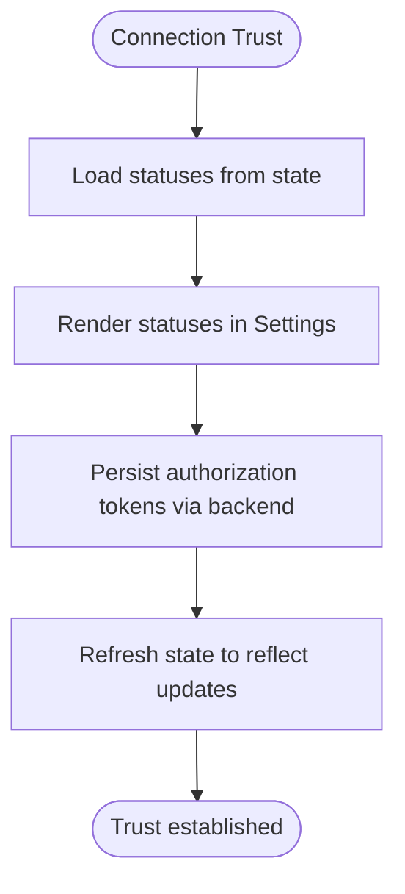

**Diagram sources**
- [SettingsPage.tsx:20-27](file://src/pages/SettingsPage.tsx#L20-L27)
- [index.ts](file://server/index.ts)
- [status.ts:57-84](file://src/lib/meta/status.ts#L57-L84)

**Section sources**
- [SettingsPage.tsx:133-170](file://src/pages/SettingsPage.tsx#L133-L170)
- [index.ts](file://server/index.ts)
- [status.ts:57-84](file://src/lib/meta/status.ts#L57-L84)

### Branding Customization and Display Preferences
Branding and display preferences are not explicitly modeled in the current schema. The UI demonstrates workspace identity and branding elements in the header and sidebar. Customization would require extending the workspace model and adding UI controls.

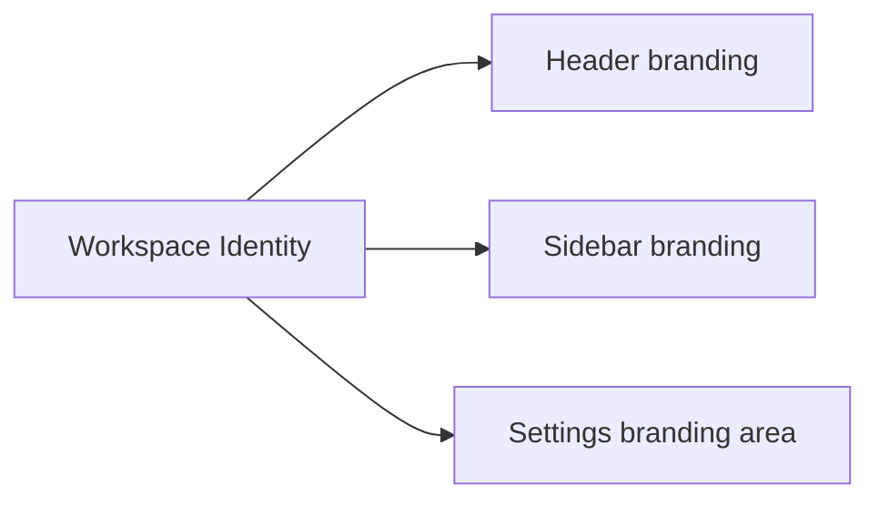

**Diagram sources**
- [DashboardLayout.tsx:13-28](file://src/components/DashboardLayout.tsx#L13-L28)
- [AppSidebar.tsx:64-77](file://src/components/AppSidebar.tsx#L64-L77)
- [SettingsPage.tsx:68-98](file://src/pages/SettingsPage.tsx#L68-L98)

**Section sources**
- [DashboardLayout.tsx:13-28](file://src/components/DashboardLayout.tsx#L13-L28)
- [AppSidebar.tsx:64-77](file://src/components/AppSidebar.tsx#L64-L77)
- [SettingsPage.tsx:68-98](file://src/pages/SettingsPage.tsx#L68-L98)

### Multi-Workspace Support and Isolation
Multi-workspace is supported by:
- A workspace table and workspace_members linking users to workspaces
- RLS policies filtering all queries by the current workspace derived from the authenticated user
- Backend functions resolving the current workspace ID for enforcement

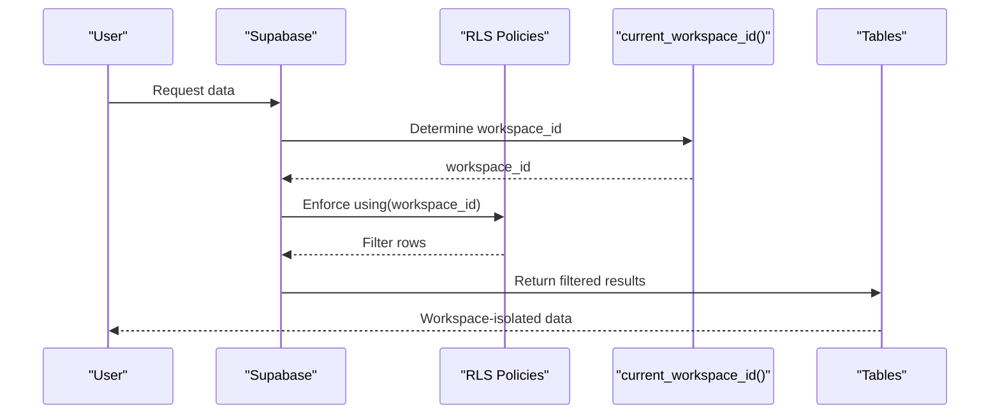

**Diagram sources**
- [schema.sql:389-400](file://supabase/schema.sql#L389-L400)
- [schema.sql:432-441](file://supabase/schema.sql#L432-L441)
- [schema.sql:443-499](file://supabase/schema.sql#L443-L499)

**Section sources**
- [schema.prisma:90-120](file://prisma/schema.prisma#L90-L120)
- [schema.sql:389-400](file://supabase/schema.sql#L389-L400)
- [schema.sql:432-441](file://supabase/schema.sql#L432-L441)
- [schema.sql:443-499](file://supabase/schema.sql#L443-L499)

## Dependency Analysis
The workspace management stack depends on:
- Frontend state and UI components
- API adapter resolution
- Supabase client and RLS policies
- Backend server endpoints for authorization persistence and mapping retrieval

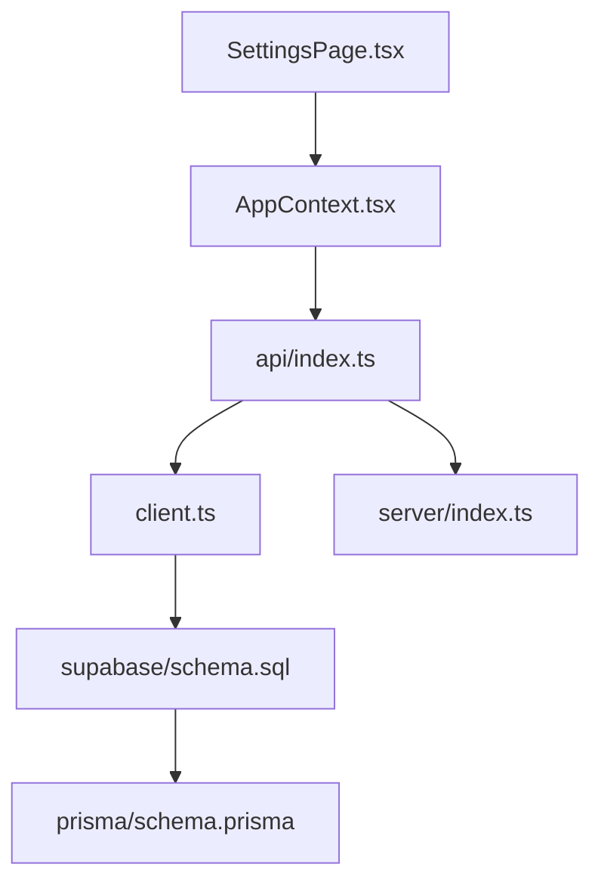

**Diagram sources**
- [SettingsPage.tsx:1-252](file://src/pages/SettingsPage.tsx#L1-L252)
- [AppContext.tsx:1-239](file://src/context/AppContext.tsx#L1-L239)
- [api/index.ts:1-23](file://src/lib/api/index.ts#L1-L23)
- [client.ts:1-16](file://src/lib/supabase/client.ts#L1-L16)
- [index.ts](file://server/index.ts)
- [schema.sql:1-517](file://supabase/schema.sql#L1-L517)
- [schema.prisma:1-279](file://prisma/schema.prisma#L1-L279)

**Section sources**
- [api/index.ts:13-23](file://src/lib/api/index.ts#L13-L23)
- [client.ts:8-16](file://src/lib/supabase/client.ts#L8-L16)
- [schema.sql:402-424](file://supabase/schema.sql#L402-L424)

## Performance Considerations
- Minimize unnecessary state refreshes by batching API calls in AppContext actions
- Use RLS efficiently by structuring queries to leverage workspace filters
- Cache frequently accessed workspace metadata (e.g., connection status) in the frontend state
- Keep Supabase policies simple and selective to avoid heavy scans on large datasets

## Troubleshooting Guide
Common issues and remedies:
- Authentication errors: Email confirmation required, invalid credentials, or permission denied by RLS
- Workspace setup errors: Missing profiles/workspace_members entries or incomplete CRM tables
- Authorization failures: Missing or expired Meta authorization tokens

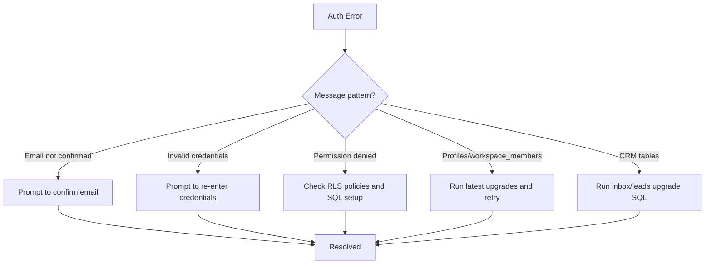

**Diagram sources**
- [authErrors.ts:1-59](file://src/lib/authErrors.ts#L1-L59)

**Section sources**
- [authErrors.ts:1-59](file://src/lib/authErrors.ts#L1-L59)

## Conclusion
Workspace management in this application is centered around a robust Supabase-backed data model with strong isolation enforced by RLS. The frontend provides a comprehensive settings surface for workspace configuration, connection trust, and future platform access controls. Team member administration is modeled with clear ownership semantics, and multi-workspace support is achieved through workspace-scoped policies and functions. Extending branding customization and administrative dashboards would involve augmenting the workspace model and adding UI controls aligned with the existing patterns.

## Appendices
- Practical onboarding and provisioning workflows:
  - New user registration triggers automatic workspace creation, profile creation, initial membership, and default templates via a Supabase function.
  - Provisioning steps:
    - Register user via Supabase Auth
    - Supabase function creates workspace, profile, owner membership, and default templates
    - User logs in and navigates to Settings to configure WhatsApp and Meta mappings

- Administrative dashboard usage:
  - Use the sidebar navigation to access relevant sections (e.g., Campaigns, Inbox, Leads, Automations)
  - Settings serves as the central control panel for workspace configuration and connection trust

- Scaling considerations:
  - RLS ensures data isolation across workspaces
  - Prisma and Supabase schemas define clear relationships and constraints
  - Backend adapters allow switching between mock, HTTP, and Supabase modes for development and production

**Section sources**
- [schema.sql:351-387](file://supabase/schema.sql#L351-L387)
- [AppSidebar.tsx:36-51](file://src/components/AppSidebar.tsx#L36-L51)
- [SettingsPage.tsx:65-98](file://src/pages/SettingsPage.tsx#L65-L98)