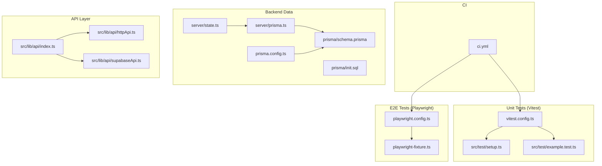
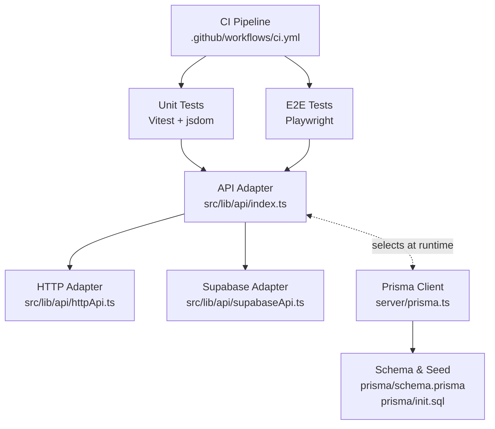
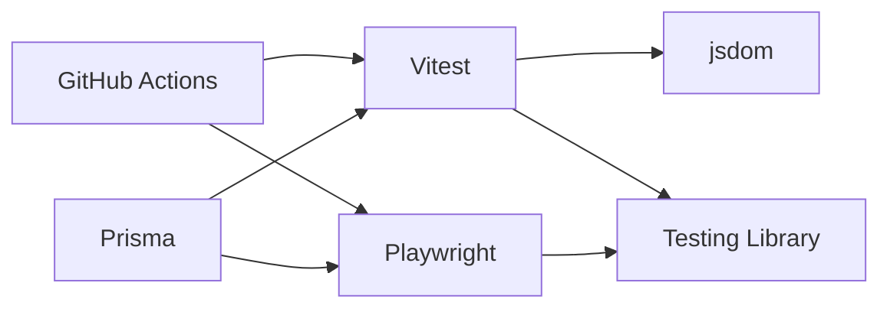

# Testing & Quality Assurance

<cite>
**Referenced Files in This Document**
- [vitest.config.ts](file://vitest.config.ts)
- [playwright.config.ts](file://playwright.config.ts)
- [playwright-fixture.ts](file://playwright-fixture.ts)
- [src/test/setup.ts](file://src/test/setup.ts)
- [src/test/example.test.ts](file://src/test/example.test.ts)
- [.github/workflows/ci.yml](file://.github/workflows/ci.yml)
- [package.json](file://package.json)
- [server/prisma.ts](file://server/prisma.ts)
- [prisma/schema.prisma](file://prisma/schema.prisma)
- [prisma/init.sql](file://prisma/init.sql)
- [prisma.config.ts](file://prisma.config.ts)
- [src/lib/api/index.ts](file://src/lib/api/index.ts)
- [src/lib/api/httpApi.ts](file://src/lib/api/httpApi.ts)
- [src/lib/api/supabaseApi.ts](file://src/lib/api/supabaseApi.ts)
- [src/components/ui/button.tsx](file://src/components/ui/button.tsx)
- [server/state.ts](file://server/state.ts)
</cite>

## Table of Contents
1. [Introduction](#introduction)
2. [Project Structure](#project-structure)
3. [Core Components](#core-components)
4. [Architecture Overview](#architecture-overview)
5. [Detailed Component Analysis](#detailed-component-analysis)
6. [Dependency Analysis](#dependency-analysis)
7. [Performance Considerations](#performance-considerations)
8. [Troubleshooting Guide](#troubleshooting-guide)
9. [Conclusion](#conclusion)
10. [Appendices](#appendices)

## Introduction
This document defines the Testing and Quality Assurance strategy for the project. It covers unit testing with Vitest, end-to-end testing with Playwright, test fixtures, and quality assurance processes. It also documents testing best practices, setup (including environment configuration, database seeding, and cleanup), practical examples for component, API, and workflow testing, coverage expectations, performance testing, regression strategies, automation via CI, quality gates, maintenance, debugging, and test data management.

## Project Structure
The testing stack is organized around:
- Unit tests powered by Vitest with jsdom environment and a global setup file for DOM APIs.
- Playwright-based E2E tests using a shared fixture re-export from a reusable configuration package.
- CI pipeline that installs dependencies, runs linting, and executes tests.
- Prisma-managed SQLite database for backend data modeling and seeding during development and tests.

**Diagram sources**
- [vitest.config.ts:1-17](file://vitest.config.ts#L1-L17)
- [src/test/setup.ts:1-16](file://src/test/setup.ts#L1-L16)
- [src/test/example.test.ts:1-8](file://src/test/example.test.ts#L1-L8)
- [playwright.config.ts:1-11](file://playwright.config.ts#L1-L11)
- [playwright-fixture.ts:1-4](file://playwright-fixture.ts#L1-L4)
- [.github/workflows/ci.yml:1-30](file://.github/workflows/ci.yml#L1-L30)
- [prisma/schema.prisma:1-279](file://prisma/schema.prisma#L1-L279)
- [prisma/init.sql:1-137](file://prisma/init.sql#L1-L137)
- [prisma.config.ts:1-9](file://prisma.config.ts#L1-L9)
- [server/prisma.ts:1-14](file://server/prisma.ts#L1-L14)
- [server/state.ts:67-255](file://server/state.ts#L67-L255)
- [src/lib/api/index.ts:1-22](file://src/lib/api/index.ts#L1-L22)
- [src/lib/api/httpApi.ts:1-60](file://src/lib/api/httpApi.ts#L1-L60)
- [src/lib/api/supabaseApi.ts:46-72](file://src/lib/api/supabaseApi.ts#L46-L72)

**Section sources**
- [vitest.config.ts:1-17](file://vitest.config.ts#L1-L17)
- [playwright.config.ts:1-11](file://playwright.config.ts#L1-L11)
- [playwright-fixture.ts:1-4](file://playwright-fixture.ts#L1-L4)
- [src/test/setup.ts:1-16](file://src/test/setup.ts#L1-L16)
- [src/test/example.test.ts:1-8](file://src/test/example.test.ts#L1-L8)
- [.github/workflows/ci.yml:1-30](file://.github/workflows/ci.yml#L1-L30)
- [prisma/schema.prisma:1-279](file://prisma/schema.prisma#L1-L279)
- [prisma/init.sql:1-137](file://prisma/init.sql#L1-L137)
- [prisma.config.ts:1-9](file://prisma.config.ts#L1-L9)
- [server/prisma.ts:1-14](file://server/prisma.ts#L1-L14)
- [server/state.ts:67-255](file://server/state.ts#L67-L255)
- [src/lib/api/index.ts:1-22](file://src/lib/api/index.ts#L1-L22)
- [src/lib/api/httpApi.ts:1-60](file://src/lib/api/httpApi.ts#L1-L60)
- [src/lib/api/supabaseApi.ts:46-72](file://src/lib/api/supabaseApi.ts#L46-L72)

## Core Components
- Vitest configuration sets up jsdom, global setup file, and test discovery pattern for the src tree.
- Playwright configuration is bootstrapped via a shared package; the fixture re-exports test and expect for E2E tests.
- Global setup ensures DOM APIs like matchMedia are available in unit tests.
- CI workflow installs dependencies, runs lint, and executes tests.
- Prisma schema and init SQL define the database model and initial indices; prisma.config centralizes datasource resolution.
- API adapters expose mock, HTTP, and Supabase implementations, enabling testable API layers.

**Section sources**
- [vitest.config.ts:1-17](file://vitest.config.ts#L1-L17)
- [src/test/setup.ts:1-16](file://src/test/setup.ts#L1-L16)
- [playwright.config.ts:1-11](file://playwright.config.ts#L1-L11)
- [playwright-fixture.ts:1-4](file://playwright-fixture.ts#L1-L4)
- [.github/workflows/ci.yml:1-30](file://.github/workflows/ci.yml#L1-L30)
- [prisma/schema.prisma:1-279](file://prisma/schema.prisma#L1-L279)
- [prisma/init.sql:1-137](file://prisma/init.sql#L1-L137)
- [prisma.config.ts:1-9](file://prisma.config.ts#L1-L9)
- [src/lib/api/index.ts:1-22](file://src/lib/api/index.ts#L1-L22)

## Architecture Overview
The testing architecture integrates unit, E2E, and CI layers with a deterministic API adapter selection and a seeded database for repeatable tests.

**Diagram sources**
- [vitest.config.ts:1-17](file://vitest.config.ts#L1-L17)
- [playwright.config.ts:1-11](file://playwright.config.ts#L1-L11)
- [.github/workflows/ci.yml:1-30](file://.github/workflows/ci.yml#L1-L30)
- [src/lib/api/index.ts:1-22](file://src/lib/api/index.ts#L1-L22)
- [src/lib/api/httpApi.ts:1-60](file://src/lib/api/httpApi.ts#L1-L60)
- [src/lib/api/supabaseApi.ts:46-72](file://src/lib/api/supabaseApi.ts#L46-L72)
- [server/prisma.ts:1-14](file://server/prisma.ts#L1-L14)
- [prisma/schema.prisma:1-279](file://prisma/schema.prisma#L1-L279)
- [prisma/init.sql:1-137](file://prisma/init.sql#L1-L137)

## Detailed Component Analysis

### Unit Testing with Vitest
- Environment: jsdom via Vitest config.
- Global setup: Adds DOM polyfills for unit tests.
- Test discovery: Scans src/**/*.(test|spec).(ts|tsx).
- Aliasing: Resolves @ to src for imports.

Recommended practices:
- Organize tests alongside source files under src/ with .test.ts or .spec.ts suffixes.
- Use describe blocks to group related tests and it for individual assertions.
- Prefer Testing Library patterns for DOM interactions.
- Keep setup minimal; rely on global setup for shared mocks.

Example reference:
- [src/test/example.test.ts:1-8](file://src/test/example.test.ts#L1-L8)
- [src/test/setup.ts:1-16](file://src/test/setup.ts#L1-L16)
- [vitest.config.ts:1-17](file://vitest.config.ts#L1-L17)

**Section sources**
- [vitest.config.ts:1-17](file://vitest.config.ts#L1-L17)
- [src/test/setup.ts:1-16](file://src/test/setup.ts#L1-L16)
- [src/test/example.test.ts:1-8](file://src/test/example.test.ts#L1-L8)

### End-to-End Testing with Playwright
- Configuration: Uses a shared configuration package; customize via overrides in the exported config.
- Fixture: Re-exports test and expect from a shared package to standardize assertions and helpers.

Recommended practices:
- Place E2E tests under a dedicated directory (e.g., e2e/) or within src/ with a .e2e.ts suffix.
- Use the provided fixture for consistent page objects and assertions.
- Parameterize tests with environment-specific base URLs and credentials.
- Keep flaky checks stable with retries and explicit waits.

Example reference:
- [playwright.config.ts:1-11](file://playwright.config.ts#L1-L11)
- [playwright-fixture.ts:1-4](file://playwright-fixture.ts#L1-L4)

**Section sources**
- [playwright.config.ts:1-11](file://playwright.config.ts#L1-L11)
- [playwright-fixture.ts:1-4](file://playwright-fixture.ts#L1-L4)

### API Testing Strategy
The API layer exposes three adapters selectable at runtime:
- Mock adapter for isolated unit tests.
- HTTP adapter for server-backed integration tests.
- Supabase adapter for backend integration tests.

Key patterns:
- Adapter selection logic chooses HTTP, Supabase, or mock based on environment variables.
- HTTP adapter parses JSON and throws typed errors on non-OK responses.
- Supabase adapter includes robust error detection for missing relations.

Recommended practices:
- Write adapter-agnostic tests by importing from src/lib/api/index.ts and asserting on returned data shapes.
- For HTTP tests, spin up a local server or use a test harness that serves routes under test.
- For Supabase tests, ensure environment variables are set and schema is initialized.

Example reference:
- [src/lib/api/index.ts:1-22](file://src/lib/api/index.ts#L1-L22)
- [src/lib/api/httpApi.ts:1-60](file://src/lib/api/httpApi.ts#L1-L60)
- [src/lib/api/supabaseApi.ts:46-72](file://src/lib/api/supabaseApi.ts#L46-L72)

**Section sources**
- [src/lib/api/index.ts:1-22](file://src/lib/api/index.ts#L1-L22)
- [src/lib/api/httpApi.ts:1-60](file://src/lib/api/httpApi.ts#L1-L60)
- [src/lib/api/supabaseApi.ts:46-72](file://src/lib/api/supabaseApi.ts#L46-L72)

### Component Testing Example
Test a UI component by rendering it in jsdom and asserting behavior:
- Render the component under test.
- Simulate user interactions (clicks, input changes).
- Assert DOM updates and emitted events.
- Use Testing Library patterns for accessibility and correctness.

Reference component:
- [src/components/ui/button.tsx:1-50](file://src/components/ui/button.tsx#L1-L50)

**Section sources**
- [src/components/ui/button.tsx:1-50](file://src/components/ui/button.tsx#L1-L50)

### Database Seeding and Cleanup
Prisma manages the schema and seeding logic:
- Schema defines models, enums, and relations.
- Initialization SQL creates tables and indices.
- Runtime seeding populates workspace data deterministically when missing.

Recommended practices:
- Seed once per test suite or per test file as needed.
- Use transactions or database snapshots to rollback after tests.
- Ensure DATABASE_URL is set for tests requiring database access.

Example reference:
- [prisma/schema.prisma:1-279](file://prisma/schema.prisma#L1-L279)
- [prisma/init.sql:1-137](file://prisma/init.sql#L1-L137)
- [server/state.ts:67-255](file://server/state.ts#L67-L255)
- [server/prisma.ts:1-14](file://server/prisma.ts#L1-L14)
- [prisma.config.ts:1-9](file://prisma.config.ts#L1-L9)

**Section sources**
- [prisma/schema.prisma:1-279](file://prisma/schema.prisma#L1-L279)
- [prisma/init.sql:1-137](file://prisma/init.sql#L1-L137)
- [server/state.ts:67-255](file://server/state.ts#L67-L255)
- [server/prisma.ts:1-14](file://server/prisma.ts#L1-L14)
- [prisma.config.ts:1-9](file://prisma.config.ts#L1-L9)

### Workflow Testing Scenarios
Representative scenarios:
- Authentication flow: Select adapter, sign in, assert session creation and redirects.
- Campaign creation: Seed workspace, create a campaign, assert persisted state and recipient assignments.
- Wallet top-up: Seed workspace, initiate top-up, assert transaction records and balance updates.

Reference components:
- [src/lib/api/index.ts:1-22](file://src/lib/api/index.ts#L1-L22)
- [server/state.ts:67-255](file://server/state.ts#L67-L255)

**Section sources**
- [src/lib/api/index.ts:1-22](file://src/lib/api/index.ts#L1-L22)
- [server/state.ts:67-255](file://server/state.ts#L67-L255)

## Dependency Analysis
Testing dependencies and their roles:
- Vitest: Unit test runner and assertion library.
- jsdom: DOM environment for unit tests.
- Playwright: Browser automation for E2E tests.
- Testing Library: DOM testing utilities and matchers.
- Prisma: ORM and database client for data seeding and cleanup.
- CI: GitHub Actions orchestrates linting and test execution.

**Diagram sources**
- [vitest.config.ts:1-17](file://vitest.config.ts#L1-L17)
- [playwright.config.ts:1-11](file://playwright.config.ts#L1-L11)
- [prisma.config.ts:1-9](file://prisma.config.ts#L1-L9)
- [.github/workflows/ci.yml:1-30](file://.github/workflows/ci.yml#L1-L30)

**Section sources**
- [vitest.config.ts:1-17](file://vitest.config.ts#L1-L17)
- [playwright.config.ts:1-11](file://playwright.config.ts#L1-L11)
- [prisma.config.ts:1-9](file://prisma.config.ts#L1-L9)
- [.github/workflows/ci.yml:1-30](file://.github/workflows/ci.yml#L1-L30)

## Performance Considerations
- Prefer lightweight unit tests with mocked adapters to avoid heavy I/O.
- Use database snapshots or transactions to minimize teardown overhead.
- Parallelize independent tests; avoid shared mutable state.
- For E2E tests, reduce browser startup costs by reusing contexts and focusing on critical user journeys.

[No sources needed since this section provides general guidance]

## Troubleshooting Guide
Common issues and resolutions:
- Missing DOM APIs in unit tests: Ensure global setup is loaded by Vitest.
  - Reference: [src/test/setup.ts:1-16](file://src/test/setup.ts#L1-L16), [vitest.config.ts:1-17](file://vitest.config.ts#L1-L17)
- DATABASE_URL not set: Prisma client requires a valid connection string.
  - Reference: [server/prisma.ts:1-14](file://server/prisma.ts#L1-L14)
- Supabase relation/table errors: Detect and handle missing relations gracefully.
  - Reference: [src/lib/api/supabaseApi.ts:46-72](file://src/lib/api/supabaseApi.ts#L46-L72)
- CI failures on lint or test commands: Verify scripts and environment variables.
  - Reference: [.github/workflows/ci.yml:1-30](file://.github/workflows/ci.yml#L1-L30), [package.json:9-21](file://package.json#L9-L21)

**Section sources**
- [src/test/setup.ts:1-16](file://src/test/setup.ts#L1-L16)
- [vitest.config.ts:1-17](file://vitest.config.ts#L1-L17)
- [server/prisma.ts:1-14](file://server/prisma.ts#L1-L14)
- [src/lib/api/supabaseApi.ts:46-72](file://src/lib/api/supabaseApi.ts#L46-L72)
- [.github/workflows/ci.yml:1-30](file://.github/workflows/ci.yml#L1-L30)
- [package.json:9-21](file://package.json#L9-L21)

## Conclusion
The project’s testing and QA approach combines fast unit tests with Vitest, robust E2E coverage via Playwright, and CI-driven automation. The API adapter abstraction enables flexible testing across environments, while Prisma provides deterministic data seeding and cleanup. By following the recommended practices—organizing tests, mocking strategies, assertion patterns, and CI quality gates—you can maintain high-quality, reliable software.

[No sources needed since this section summarizes without analyzing specific files]

## Appendices

### Test Organization and Best Practices
- Unit tests: Place near source under src/ with .test.ts/.spec.ts suffixes; use describe/it blocks; rely on global setup for DOM polyfills.
- E2E tests: Use the shared fixture for consistent assertions; parameterize base URLs and credentials.
- Mocking: Prefer adapter-agnostic tests via src/lib/api/index.ts; isolate network calls with HTTP adapter tests.
- Assertions: Favor semantic selectors and Testing Library patterns; assert both UI and state changes.
- Coverage: Aim for high coverage across components, API adapters, and critical workflows; measure with Vitest coverage flags.

[No sources needed since this section provides general guidance]

### Continuous Integration and Quality Gates
- CI job installs dependencies, runs lint, and executes tests.
- Gate enforcement: Fail on lint errors or test failures; consider adding coverage thresholds.

**Section sources**
- [.github/workflows/ci.yml:1-30](file://.github/workflows/ci.yml#L1-L30)
- [package.json:9-21](file://package.json#L9-L21)

### Practical Examples Index
- Component test example: [src/test/example.test.ts:1-8](file://src/test/example.test.ts#L1-L8)
- UI component under test: [src/components/ui/button.tsx:1-50](file://src/components/ui/button.tsx#L1-L50)
- API adapter selection: [src/lib/api/index.ts:1-22](file://src/lib/api/index.ts#L1-L22)
- HTTP adapter error parsing: [src/lib/api/httpApi.ts:1-60](file://src/lib/api/httpApi.ts#L1-L60)
- Supabase error detection: [src/lib/api/supabaseApi.ts:46-72](file://src/lib/api/supabaseApi.ts#L46-L72)
- Database seeding workflow: [server/state.ts:67-255](file://server/state.ts#L67-L255)