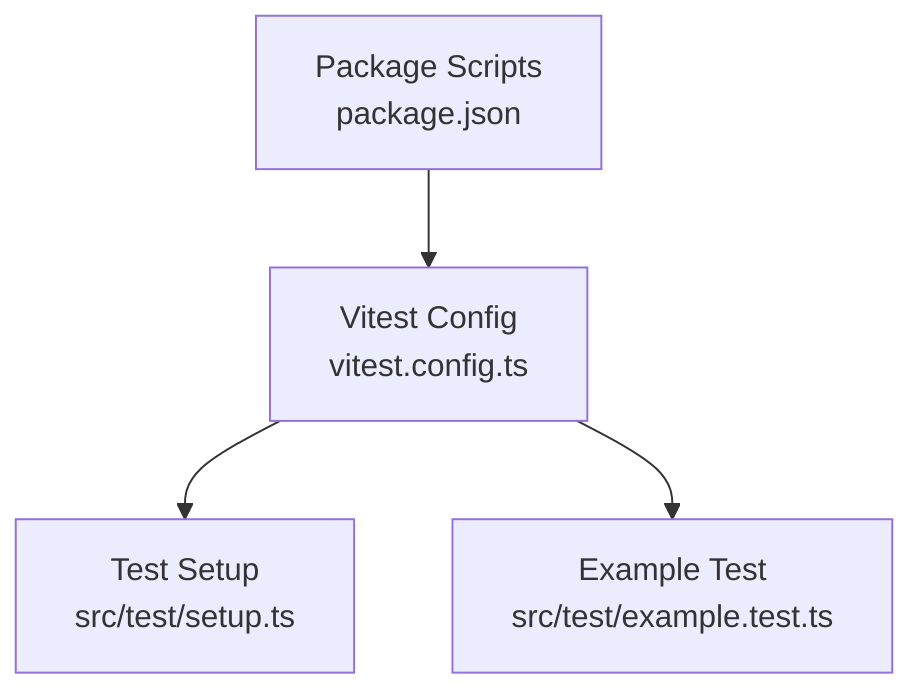
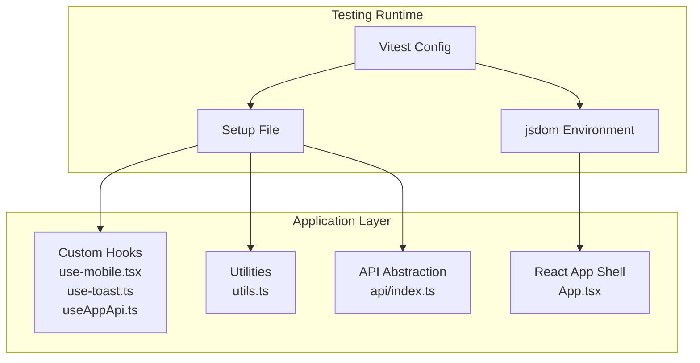
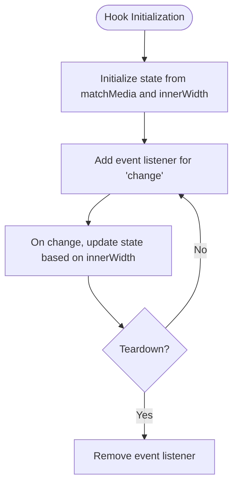
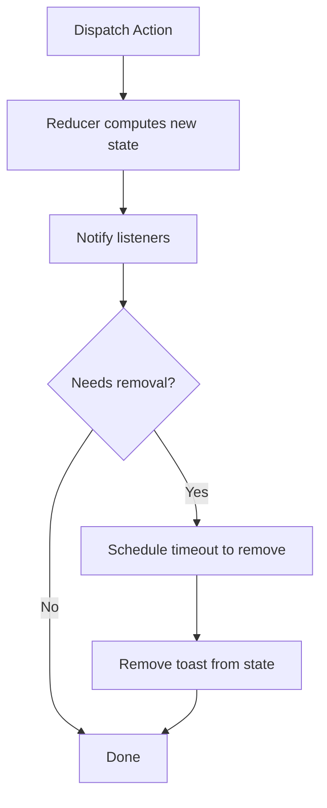
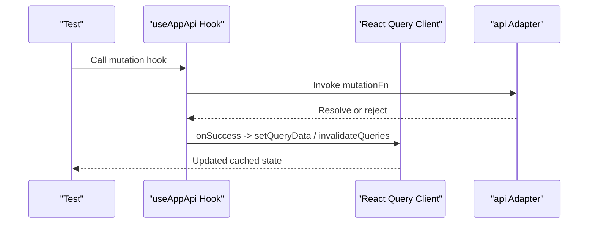
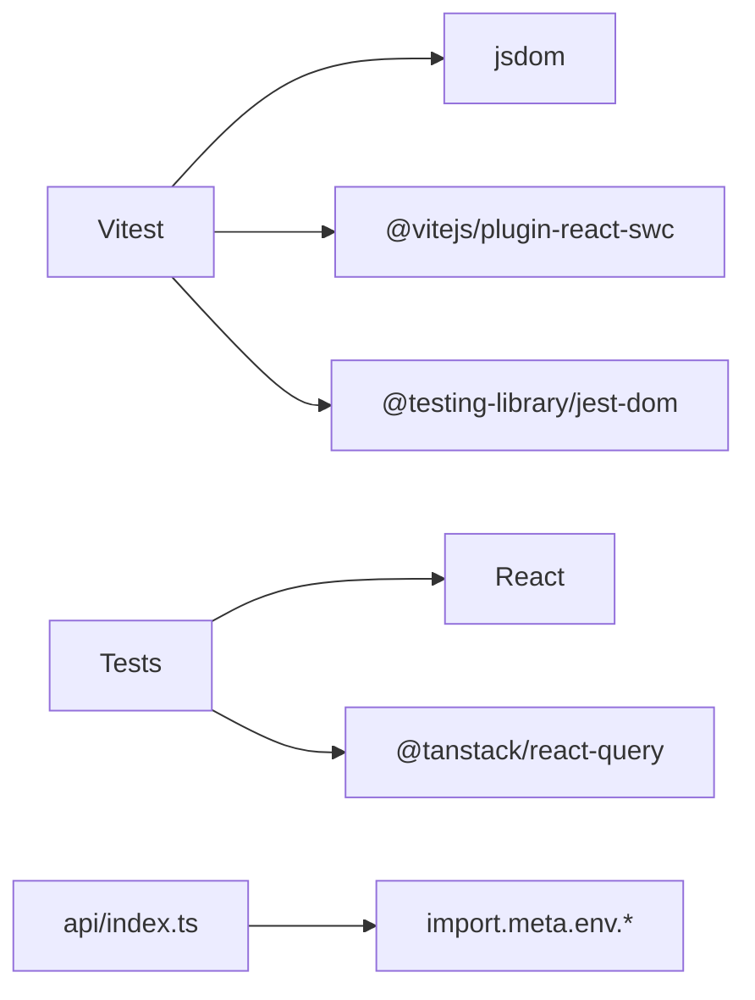

# Unit Testing

<cite>
**Referenced Files in This Document**
- [vitest.config.ts](file://vitest.config.ts)
- [setup.ts](file://src/test/setup.ts)
- [example.test.ts](file://src/test/example.test.ts)
- [package.json](file://package.json)
- [use-mobile.tsx](file://src/hooks/use-mobile.tsx)
- [use-toast.ts](file://src/hooks/use-toast.ts)
- [useAppApi.ts](file://src/hooks/useAppApi.ts)
- [utils.ts](file://src/lib/utils.ts)
- [api/index.ts](file://src/lib/api/index.ts)
- [App.tsx](file://src/App.tsx)
- [main.tsx](file://src/main.tsx)
- [playwright.config.ts](file://playwright.config.ts)
</cite>

## Table of Contents
1. [Introduction](#introduction)
2. [Project Structure](#project-structure)
3. [Core Components](#core-components)
4. [Architecture Overview](#architecture-overview)
5. [Detailed Component Analysis](#detailed-component-analysis)
6. [Dependency Analysis](#dependency-analysis)
7. [Performance Considerations](#performance-considerations)
8. [Troubleshooting Guide](#troubleshooting-guide)
9. [Conclusion](#conclusion)
10. [Appendices](#appendices)

## Introduction
This document explains the unit testing architecture and patterns used in the project with Vitest. It covers configuration, jsdom environment setup, global configurations, plugin integration, test organization, and practical strategies for testing React components, hooks, and utilities. It also provides guidance on async testing, error boundary considerations, performance testing, coverage measurement, debugging, and maintaining a healthy test suite.

## Project Structure
The testing setup is centered around a dedicated configuration and a small shared setup file. Tests are organized alongside source code under src/** with a conventional naming pattern for test files. Scripts in package.json enable running the test suite in both single-run and watch modes.

**Diagram sources**
- [vitest.config.ts:1-17](file://vitest.config.ts#L1-L17)
- [setup.ts:1-16](file://src/test/setup.ts#L1-L16)
- [example.test.ts:1-8](file://src/test/example.test.ts#L1-L8)
- [package.json:19-21](file://package.json#L19-L21)

**Section sources**
- [vitest.config.ts:1-17](file://vitest.config.ts#L1-L17)
- [setup.ts:1-16](file://src/test/setup.ts#L1-L16)
- [example.test.ts:1-8](file://src/test/example.test.ts#L1-L8)
- [package.json:19-21](file://package.json#L19-L21)

## Core Components
- Vitest configuration defines the jsdom environment, enables globals, loads a setup file, and includes test files via a glob pattern.
- The setup file adds jest-dom matchers and polyfills window.matchMedia for SSR/browser-like behavior.
- Example test demonstrates a minimal passing assertion to validate the test runner configuration.

Key behaviors:
- Environment: jsdom for DOM APIs in tests.
- Globals: Vitest globals enabled for concise test syntax.
- Setup: Shared setup executed before each test.
- Inclusion: Tests under src/** with .test or .spec suffix and .ts/.tsx extensions.
- Aliasing: Path alias @ resolves to src for imports.

**Section sources**
- [vitest.config.ts:5-16](file://vitest.config.ts#L5-L16)
- [setup.ts:1-16](file://src/test/setup.ts#L1-L16)
- [example.test.ts:1-8](file://src/test/example.test.ts#L1-L8)

## Architecture Overview
The unit testing architecture integrates Vitest with React and DOM APIs through jsdom. The configuration sets up environment, aliases, and test discovery. The setup file ensures DOM APIs are available and standardized. Tests can leverage React Query and custom hooks for realistic component behavior.

**Diagram sources**
- [vitest.config.ts:5-16](file://vitest.config.ts#L5-L16)
- [setup.ts:1-16](file://src/test/setup.ts#L1-L16)
- [use-mobile.tsx:1-20](file://src/hooks/use-mobile.tsx#L1-L20)
- [use-toast.ts:1-187](file://src/hooks/use-toast.ts#L1-L187)
- [useAppApi.ts:1-156](file://src/hooks/useAppApi.ts#L1-L156)
- [utils.ts:1-7](file://src/lib/utils.ts#L1-L7)
- [api/index.ts:1-23](file://src/lib/api/index.ts#L1-L23)
- [App.tsx:1-75](file://src/App.tsx#L1-L75)

## Detailed Component Analysis

### Vitest Configuration and Setup
- Environment: jsdom provides DOM APIs for tests.
- Globals: Enables expect and describe without imports.
- SetupFiles: Loads src/test/setup.ts before each test.
- Include Pattern: src/**/*.{test,spec}.{ts,tsx}.
- Alias: @ -> src for clean imports.

Practical implications:
- Write tests adjacent to source files for discoverability.
- Use setup.ts to polyfill missing browser APIs.
- Keep test files named with .test or .spec suffixes.

**Section sources**
- [vitest.config.ts:5-16](file://vitest.config.ts#L5-L16)
- [setup.ts:1-16](file://src/test/setup.ts#L1-L16)

### Example Test
- Demonstrates a basic test case using Vitest globals and assertions.
- Serves as a baseline for new tests.

**Section sources**
- [example.test.ts:1-8](file://src/test/example.test.ts#L1-L8)

### Custom Hook: useIsMobile
- Purpose: Detect mobile viewport using window.matchMedia and window.innerWidth.
- Behavior: Initializes state, listens to media change events, and cleans up listeners.
- Testing strategy:
  - Mock window.matchMedia and window.innerWidth in setup.ts.
  - Assert initial state and effect-driven updates.
  - Verify cleanup removes event listeners.

**Diagram sources**
- [use-mobile.tsx:8-16](file://src/hooks/use-mobile.tsx#L8-L16)

**Section sources**
- [use-mobile.tsx:1-20](file://src/hooks/use-mobile.tsx#L1-L20)

### Custom Hook: useToast
- Purpose: Manage toast notifications with a reducer and global listeners.
- Behavior: Generates IDs, enforces limits, schedules removal, and updates state.
- Testing strategy:
  - Mock timers to control asynchronous behavior.
  - Assert state transitions for add/update/dismiss/remove actions.
  - Verify listeners receive updates and toast removal after delay.

**Diagram sources**
- [use-toast.ts:71-122](file://src/hooks/use-toast.ts#L71-L122)
- [use-toast.ts:53-69](file://src/hooks/use-toast.ts#L53-L69)

**Section sources**
- [use-toast.ts:1-187](file://src/hooks/use-toast.ts#L1-L187)

### Custom Hook: useAppApi
- Purpose: Encapsulate TanStack React Query hooks for application state and mutations.
- Behavior: Provides typed queries and mutations with optimistic updates and cache invalidation.
- Testing strategy:
  - Mock api module to isolate network-dependent logic.
  - Use React Query devtools or manual cache inspection to assert state changes.
  - Test success callbacks and error handling via mocked adapters.

**Diagram sources**
- [useAppApi.ts:20-26](file://src/hooks/useAppApi.ts#L20-L26)
- [useAppApi.ts:124-132](file://src/hooks/useAppApi.ts#L124-L132)
- [api/index.ts:18-23](file://src/lib/api/index.ts#L18-L23)

**Section sources**
- [useAppApi.ts:1-156](file://src/hooks/useAppApi.ts#L1-L156)
- [api/index.ts:1-23](file://src/lib/api/index.ts#L1-L23)

### Utility Function: cn
- Purpose: Merge Tailwind classes with clsx and twMerge.
- Testing strategy:
  - Provide various input combinations to assert final class string.
  - Validate precedence and deduplication behavior.

**Section sources**
- [utils.ts:1-7](file://src/lib/utils.ts#L1-L7)

### API Abstraction: Active Adapter Selection
- Purpose: Select runtime API adapter based on environment variables.
- Behavior: Chooses mock, HTTP, or Supabase adapter depending on configuration.
- Testing strategy:
  - Override import.meta.env.VITE_API_ADAPTER and VITE_API_BASE_URL in setup or per-test environment.
  - Assert activeApiAdapter and exported api instance reflect selected adapter.

**Section sources**
- [api/index.ts:13-23](file://src/lib/api/index.ts#L13-L23)

### React Application Shell and Providers
- Purpose: Wrap the app with QueryClientProvider, AppProvider, TooltipProvider, and routing.
- Testing strategy:
  - Render components under test within the same provider context.
  - Use React Testing Library helpers to query rendered nodes.

**Section sources**
- [App.tsx:32-72](file://src/App.tsx#L32-L72)
- [main.tsx:1-6](file://src/main.tsx#L1-L6)

## Dependency Analysis
- Vitest depends on jsdom for DOM APIs and @vitejs/plugin-react-swc for JSX/TSX support.
- The setup file depends on @testing-library/jest-dom for extended assertions.
- Tests depend on React and React Query for component and hook tests.
- API abstraction depends on environment variables to select adapters.

**Diagram sources**
- [vitest.config.ts:1-3](file://vitest.config.ts#L1-L3)
- [setup.ts:1](file://src/test/setup.ts#L1)
- [package.json:80-106](file://package.json#L80-L106)
- [api/index.ts:13-14](file://src/lib/api/index.ts#L13-L14)

**Section sources**
- [vitest.config.ts:1-3](file://vitest.config.ts#L1-L3)
- [setup.ts:1](file://src/test/setup.ts#L1)
- [package.json:80-106](file://package.json#L80-L106)
- [api/index.ts:13-14](file://src/lib/api/index.ts#L13-L14)

## Performance Considerations
- Prefer lightweight mocks and deterministic timers to avoid flaky tests.
- Use React Query’s cache invalidation strategically to minimize unnecessary re-renders.
- Keep tests focused and isolated to reduce teardown overhead.
- Use Vitest’s built-in timing controls to avoid real-time waits.

## Troubleshooting Guide
Common issues and resolutions:
- Missing DOM APIs:
  - Ensure setup.ts is loaded and window.matchMedia is defined.
- Asynchronous timing:
  - Use fake timers or await utilities to control async flows.
- Provider context:
  - Wrap tests with providers similar to App.tsx to avoid missing contexts.
- Environment-specific behavior:
  - Set VITE_API_ADAPTER and related variables in setup or per-test environment.
- Coverage gaps:
  - Run Vitest with coverage flags and review uncovered branches.

**Section sources**
- [setup.ts:3-15](file://src/test/setup.ts#L3-L15)
- [App.tsx:32-72](file://src/App.tsx#L32-L72)
- [api/index.ts:13-14](file://src/lib/api/index.ts#L13-L14)

## Conclusion
The project’s unit testing setup leverages Vitest with jsdom, a shared setup file, and a pragmatic test organization pattern. By aligning tests with the existing hooks, utilities, and API abstractions, teams can write reliable, maintainable unit tests. Focus on deterministic mocks, provider context, and environment configuration to achieve consistent results.

## Appendices

### Test Organization Patterns and Naming Conventions
- Place tests adjacent to source files with .test or .spec suffixes.
- Use descriptive describe blocks and concise it expectations.
- Keep tests self-contained and isolated.

**Section sources**
- [vitest.config.ts:11](file://vitest.config.ts#L11)
- [example.test.ts:1-8](file://src/test/example.test.ts#L1-L8)

### Async Testing Strategies
- Use fake timers for timeouts and intervals.
- Await async utilities and promises.
- Leverage React Query devtools or manual cache inspection for stateful hooks.

**Section sources**
- [use-toast.ts:53-69](file://src/hooks/use-toast.ts#L53-L69)
- [useAppApi.ts:20-26](file://src/hooks/useAppApi.ts#L20-L26)

### Error Boundary Testing
- Render components under test within providers and simulate errors.
- Assert fallback UI or error logs.

**Section sources**
- [App.tsx:32-72](file://src/App.tsx#L32-L72)

### Performance Testing
- Measure render performance with React Profiler in test environments.
- Use Vitest’s timing controls to avoid real-time waits.

[No sources needed since this section provides general guidance]

### Test Coverage Measurement
- Enable coverage via Vitest configuration and scripts.
- Review coverage reports and target untested branches.

**Section sources**
- [package.json:19-21](file://package.json#L19-L21)

### Debugging Failed Tests
- Use console logging sparingly; prefer structured logs.
- Inspect React DevTools and React Query devtools during tests.
- Narrow failing tests with describe.only or it.only temporarily.

[No sources needed since this section provides general guidance]

### Maintaining Test Suites
- Keep setup.ts minimal and focused.
- Regularly refactor tests alongside feature changes.
- Use watch mode for rapid feedback during development.

**Section sources**
- [vitest.config.ts:10](file://vitest.config.ts#L10)
- [package.json:20](file://package.json#L20)