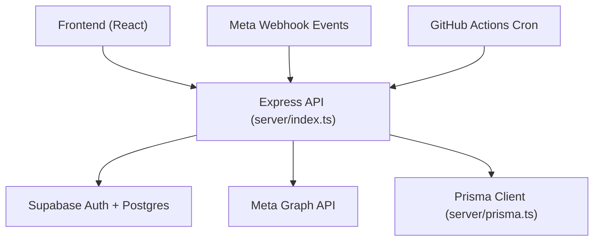
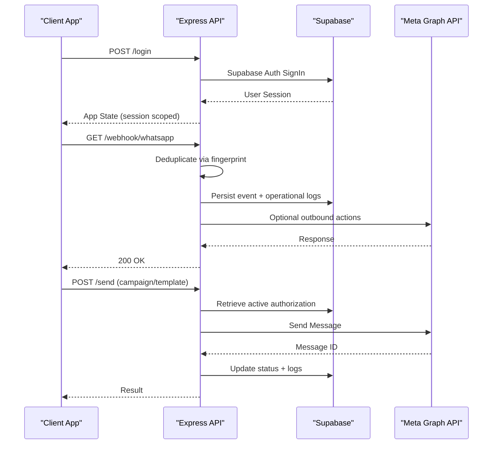
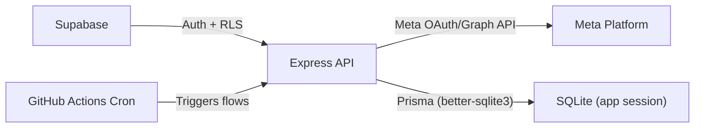
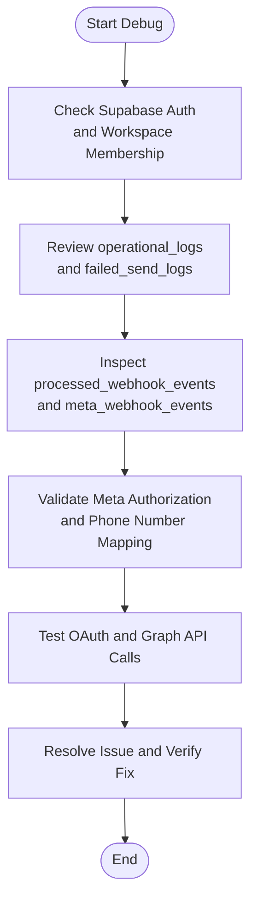

# Troubleshooting & FAQ

<cite>
**Referenced Files in This Document**
- [README.md](file://README.md)
- [DEPLOYMENT_GUIDE.md](file://DEPLOYMENT_GUIDE.md)
- [server/index.ts](file://server/index.ts)
- [server/meta.ts](file://server/meta.ts)
- [server/metaWebhook.ts](file://server/metaWebhook.ts)
- [server/supabaseAdmin.ts](file://server/supabaseAdmin.ts)
- [server/state.ts](file://server/state.ts)
- [server/prisma.ts](file://server/prisma.ts)
- [src/lib/authErrors.ts](file://src/lib/authErrors.ts)
- [src/lib/api/types.ts](file://src/lib/api/types.ts)
- [src/pages/LoginPage.tsx](file://src/pages/LoginPage.tsx)
- [src/hooks/useAppApi.ts](file://src/hooks/useAppApi.ts)
- [supabase/schema.sql](file://supabase/schema.sql)
</cite>

## Table of Contents
1. [Introduction](#introduction)
2. [Project Structure](#project-structure)
3. [Core Components](#core-components)
4. [Architecture Overview](#architecture-overview)
5. [Detailed Component Analysis](#detailed-component-analysis)
6. [Dependency Analysis](#dependency-analysis)
7. [Performance Considerations](#performance-considerations)
8. [Troubleshooting Guide](#troubleshooting-guide)
9. [Security Best Practices](#security-best-practices)
10. [Debugging Procedures](#debugging-procedures)
11. [System Monitoring & Alerting](#system-monitoring--alerting)
12. [Incident Response Protocols](#incident-response-protocols)
13. [Preventive Measures & Maintenance](#preventive-measures--maintenance)
14. [Conclusion](#conclusion)

## Introduction
This Troubleshooting & FAQ guide focuses on diagnosing and resolving common issues in the WhatsApp Business SaaS platform. It covers authentication failures, webhook processing errors, campaign delivery issues, and integration connectivity problems. It also provides error code references, root cause analysis, step-by-step resolutions, performance optimization techniques, security best practices, debugging procedures, monitoring and alerting guidance, and preventive maintenance recommendations.

## Project Structure
The platform consists of:
- Frontend built with Vite + React + Tailwind
- Backend as an Express server (Vercel Serverless)
- Database via Supabase (Postgres) with row-level security policies
- Automation engine integrated with GitHub Actions or cron
- Meta (WhatsApp/Meta) APIs for authentication, webhooks, and messaging

**Diagram sources**
- [server/index.ts:1-800](file://server/index.ts#L1-L800)
- [server/meta.ts:1-391](file://server/meta.ts#L1-L391)
- [server/metaWebhook.ts:1-161](file://server/metaWebhook.ts#L1-L161)
- [server/prisma.ts:1-14](file://server/prisma.ts#L1-L14)
- [DEPLOYMENT_GUIDE.md:1-64](file://DEPLOYMENT_GUIDE.md#L1-L64)

**Section sources**
- [README.md:1-26](file://README.md#L1-L26)
- [DEPLOYMENT_GUIDE.md:1-64](file://DEPLOYMENT_GUIDE.md#L1-L64)

## Core Components
- Authentication and session management with Supabase Auth and workspace scoping
- Meta OAuth token exchange and authorization lifecycle
- Webhook ingestion and deduplication with fingerprinting
- Campaign orchestration and failed-send logging
- Operational logging and low-level error capture
- Row-level security and workspace isolation via Supabase policies

Key implementation references:
- Authentication error mapping and UX messaging
- Operational and failed-send logging
- Webhook summarization and persistence
- Meta authorization retrieval and validation
- Supabase admin client and workspace context extraction

**Section sources**
- [src/lib/authErrors.ts:1-59](file://src/lib/authErrors.ts#L1-L59)
- [server/index.ts:246-317](file://server/index.ts#L246-L317)
- [server/index.ts:319-406](file://server/index.ts#L319-L406)
- [server/index.ts:225-244](file://server/index.ts#L225-L244)
- [server/supabaseAdmin.ts:19-49](file://server/supabaseAdmin.ts#L19-L49)
- [supabase/schema.sql:426-517](file://supabase/schema.sql#L426-L517)

## Architecture Overview
High-level runtime flows:
- Login and session establishment with Supabase Auth
- Meta OAuth code exchange and authorization persistence
- Webhook reception, deduplication, and event processing
- Campaign creation and message sending via Meta Graph API
- Operational logs and failed-send logs for observability

**Diagram sources**
- [server/index.ts:761-800](file://server/index.ts#L761-L800)
- [server/index.ts:319-406](file://server/index.ts#L319-L406)
- [server/meta.ts:237-292](file://server/meta.ts#L237-L292)
- [server/meta.ts:298-353](file://server/meta.ts#L298-L353)
- [server/supabaseAdmin.ts:19-49](file://server/supabaseAdmin.ts#L19-L49)

## Detailed Component Analysis

### Authentication and Session Management
Common issues:
- Email confirmation required or not confirmed
- Invalid login credentials
- Permission denied due to RLS policies
- Workspace profile setup incomplete
- CRM tables not initialized

Resolution steps:
- Verify Supabase Auth email confirmation settings
- Confirm workspace membership and policies are applied
- Ensure CRM tables (leads, conversations, etc.) are created via schema upgrades
- Re-run SQL scripts if tables are missing

**Section sources**
- [src/lib/authErrors.ts:12-38](file://src/lib/authErrors.ts#L12-L38)
- [supabase/schema.sql:19-276](file://supabase/schema.sql#L19-L276)
- [server/supabaseAdmin.ts:31-48](file://server/supabaseAdmin.ts#L31-L48)

### Meta OAuth and Authorization Lifecycle
Common issues:
- Missing Meta app credentials
- Expired or missing access token
- Authorization not present for workspace

Resolution steps:
- Set META_APP_ID and META_APP_SECRET
- Reconnect WhatsApp to refresh authorization
- Validate authorization expiration and renew if needed

**Section sources**
- [server/meta.ts:6-16](file://server/meta.ts#L6-L16)
- [server/index.ts:225-244](file://server/index.ts#L225-L244)

### Webhook Processing Pipeline
Common issues:
- Duplicate events (replay/deduplication)
- Missing workspace context
- Inbound message parsing errors
- Status update synchronization

Resolution steps:
- Inspect processed_webhook_events fingerprint uniqueness
- Verify phone_number_id mapping to workspace
- Review persisted meta_webhook_events and operational logs
- Ensure webhook verify token matches Meta configuration

**Section sources**
- [server/index.ts:319-342](file://server/index.ts#L319-L342)
- [server/index.ts:369-406](file://server/index.ts#L369-L406)
- [server/metaWebhook.ts:111-161](file://server/metaWebhook.ts#L111-L161)
- [DEPLOYMENT_GUIDE.md:51-58](file://DEPLOYMENT_GUIDE.md#L51-L58)

### Campaign Delivery and Outbound Messaging
Common issues:
- No connected phone number for workspace
- Template send failures
- Reply/send failures logged in failed_send_logs

Resolution steps:
- Confirm WhatsApp connection and phone_number_id
- Validate template language and parameters
- Inspect failed_send_logs for error_message and retry_count
- Trigger manual retry via retry endpoint if available

**Section sources**
- [server/index.ts:344-367](file://server/index.ts#L344-L367)
- [server/meta.ts:298-353](file://server/meta.ts#L298-L353)
- [src/lib/api/types.ts:154-165](file://src/lib/api/types.ts#L154-L165)

### Operational Logging and Diagnostics
Common issues:
- Missing operational logs
- Ambiguous error messages
- Hard-to-trace automation failures

Resolution steps:
- Query operational_logs for event_type and level
- Cross-reference with failed_send_logs for correlated failures
- Use automation_events to trace rule triggers and outcomes

**Section sources**
- [server/index.ts:258-275](file://server/index.ts#L258-L275)
- [server/index.ts:277-317](file://server/index.ts#L277-L317)
- [src/lib/api/types.ts:167-173](file://src/lib/api/types.ts#L167-L173)

## Dependency Analysis
Key dependencies and their roles:
- Supabase Auth and Postgres for identity, RLS, and data persistence
- Meta Graph API for WhatsApp business operations
- Prisma client for SQLite-backed app session (local/dev)
- GitHub Actions cron for automation scheduling

**Diagram sources**
- [server/supabaseAdmin.ts:6-17](file://server/supabaseAdmin.ts#L6-L17)
- [server/meta.ts:18-27](file://server/meta.ts#L18-L27)
- [server/prisma.ts:1-14](file://server/prisma.ts#L1-L14)
- [DEPLOYMENT_GUIDE.md:24-31](file://DEPLOYMENT_GUIDE.md#L24-L31)

**Section sources**
- [server/supabaseAdmin.ts:6-17](file://server/supabaseAdmin.ts#L6-L17)
- [server/meta.ts:18-27](file://server/meta.ts#L18-L27)
- [server/prisma.ts:1-14](file://server/prisma.ts#L1-L14)
- [DEPLOYMENT_GUIDE.md:24-31](file://DEPLOYMENT_GUIDE.md#L24-L31)

## Performance Considerations
- Database indexing and query patterns
  - Ensure unique constraints and indexes exist for workspace-scoped tables (e.g., contacts unique workspace+phone)
  - Use selective filters with workspace_id to leverage RLS efficiently
- API rate limiting
  - Apply rate limits on webhook endpoints and campaign send endpoints
  - Backoff and retry strategies for Meta Graph API calls
- Memory management
  - Avoid loading large datasets into memory; stream or paginate
  - Use Prisma’s efficient query patterns and limit projections
- Caching
  - Cache frequently accessed configuration (e.g., authorization) per workspace
- Automation scheduling
  - Use cron intervals appropriate to traffic volume; avoid overlapping runs

[No sources needed since this section provides general guidance]

## Troubleshooting Guide

### Authentication Failures
Symptoms:
- “Email not confirmed” or “confirmation required”
- “Invalid login credentials”
- “Permission denied” or “row-level security”

Root causes:
- Supabase email confirmation policy
- Incorrect credentials
- Missing workspace membership or RLS policy misconfiguration

Resolution:
- Confirm email confirmation flow and resend confirmation if needed
- Verify credentials and Supabase Auth settings
- Ensure workspace_members record and RLS policies are applied

**Section sources**
- [src/lib/authErrors.ts:12-30](file://src/lib/authErrors.ts#L12-L30)
- [supabase/schema.sql:426-517](file://supabase/schema.sql#L426-L517)

### Webhook Processing Errors
Symptoms:
- Duplicate inbound messages
- Missing workspace context for events
- Status updates not reflected

Root causes:
- Replay/duplicate webhook events
- Unmapped phone_number_id to workspace
- Missing verify token or callback URL mismatch

Resolution:
- Check processed_webhook_events fingerprint uniqueness
- Verify phone_number_id mapping and connection records
- Validate Meta webhook verify token and callback URL

**Section sources**
- [server/index.ts:319-342](file://server/index.ts#L319-L342)
- [server/index.ts:369-406](file://server/index.ts#L369-L406)
- [DEPLOYMENT_GUIDE.md:51-58](file://DEPLOYMENT_GUIDE.md#L51-L58)

### Campaign Delivery Issues
Symptoms:
- “No stored Meta authorization found” or “authorization expired”
- “Connected phone number is missing”
- Failed-send logs with error_message

Root causes:
- Missing or expired Meta access token
- No active WhatsApp connection
- Template language/code mismatch or invalid parameters

Resolution:
- Reconnect WhatsApp to refresh authorization
- Confirm phone_number_id exists for workspace
- Validate template language and body parameters

**Section sources**
- [server/index.ts:225-244](file://server/index.ts#L225-L244)
- [server/index.ts:344-367](file://server/index.ts#L344-L367)
- [src/lib/api/types.ts:154-165](file://src/lib/api/types.ts#L154-L165)

### Integration Connectivity Problems
Symptoms:
- Meta Graph API request failures
- OAuth code exchange errors

Root causes:
- Missing META_APP_ID or META_APP_SECRET
- Invalid redirect URI or code
- Network or rate-limit issues

Resolution:
- Set META_APP_ID and META_APP_SECRET
- Verify redirect_uri and code validity
- Implement retry/backoff and monitor rate limits

**Section sources**
- [server/meta.ts:6-16](file://server/meta.ts#L6-L16)
- [server/meta.ts:237-292](file://server/meta.ts#L237-L292)

### Error Code Reference
- Operational logs
  - event_type: contextual event identifier (e.g., meta_webhook_received)
  - level: info/warning/error
- Failed-send logs
  - channel: campaign/reply/automation/template
  - status: failed/retried/resolved
  - retry_count: number of attempts
- Database constraint violation
  - Example: unique violation on processed_webhook_events fingerprint indicates duplicate event

**Section sources**
- [src/lib/api/types.ts:167-173](file://src/lib/api/types.ts#L167-L173)
- [src/lib/api/types.ts:154-165](file://src/lib/api/types.ts#L154-L165)
- [server/index.ts:337-342](file://server/index.ts#L337-L342)

### Step-by-Step Resolution Procedures
- Authentication
  - Confirm Supabase environment variables and policies
  - Re-run schema SQL upgrades if needed
  - Test login flow and observe error messages
- Webhooks
  - Validate verify token and callback URL
  - Inspect processed_webhook_events and meta_webhook_events
  - Check operational logs for webhook receipt
- Campaigns
  - Reconnect WhatsApp and confirm authorization
  - Validate template language and parameters
  - Review failed_send_logs and retry failed sends
- Integrations
  - Set Meta app credentials
  - Test OAuth code exchange
  - Monitor rate limits and implement retries

**Section sources**
- [DEPLOYMENT_GUIDE.md:51-58](file://DEPLOYMENT_GUIDE.md#L51-L58)
- [server/meta.ts:237-292](file://server/meta.ts#L237-L292)
- [server/index.ts:277-317](file://server/index.ts#L277-L317)

## Security Best Practices
- OAuth security
  - Store META_APP_ID and META_APP_SECRET securely
  - Enforce HTTPS and secure cookies for sessions
  - Rotate secrets periodically and invalidate cached tokens
- Data encryption
  - Use TLS for all external API calls
  - Encrypt sensitive fields at rest if required by policy
- Input validation
  - Validate and sanitize all webhook payloads and API inputs
  - Use Zod schemas for request validation (already used in server routes)
- Vulnerability prevention
  - Enforce RLS policies and workspace scoping
  - Limit exposed endpoints and enforce CORS appropriately
  - Regularly audit permissions and policies

**Section sources**
- [server/meta.ts:6-16](file://server/meta.ts#L6-L16)
- [server/index.ts:45-116](file://server/index.ts#L45-L116)
- [supabase/schema.sql:426-517](file://supabase/schema.sql#L426-L517)

## Debugging Procedures
- Log analysis
  - Query operational_logs by event_type and level
  - Correlate with failed_send_logs for root cause
- Error tracking
  - Capture getErrorMessage outputs for server-side errors
  - Map client-side auth errors via getAuthErrorMessage
- Diagnostic tools
  - Use React Query devtools to inspect query states
  - Inspect Supabase Auth user context and workspace membership
  - Validate Meta webhook payloads with summarizeMetaWebhookPayload

**Diagram sources**
- [server/index.ts:258-317](file://server/index.ts#L258-L317)
- [server/index.ts:319-406](file://server/index.ts#L319-L406)
- [server/index.ts:225-244](file://server/index.ts#L225-L244)
- [src/lib/authErrors.ts:1-59](file://src/lib/authErrors.ts#L1-L59)

**Section sources**
- [src/lib/authErrors.ts:1-59](file://src/lib/authErrors.ts#L1-L59)
- [server/index.ts:258-317](file://server/index.ts#L258-L317)
- [server/metaWebhook.ts:111-161](file://server/metaWebhook.ts#L111-L161)

## System Monitoring & Alerting
- Metrics to track
  - Operational log counts by level (info/warning/error)
  - Failed-send counts and retry rates
  - Webhook throughput and duplication rate
  - Campaign send success/failure ratios
- Alerting thresholds
  - Error rate > X% over Y minutes
  - Failed-send retry_count exceeding threshold
  - Webhook duplication rate above baseline
- Tools
  - Supabase Analytics or external logging (e.g., DataDog, ELK)
  - Slack/Pager alerts for critical thresholds

[No sources needed since this section provides general guidance]

## Incident Response Protocols
- Immediate actions
  - Isolate failing workspace if applicable
  - Pause high-volume campaign sends
  - Investigate webhook duplication and deduplication
- Escalation
  - Promote operational logs to warning/error
  - Engage Meta support if Graph API errors persist
- Post-mortem
  - Document root cause, impact, and remediation
  - Update runbooks and alerting thresholds

[No sources needed since this section provides general guidance]

## Preventive Measures & Maintenance
- Database maintenance
  - Keep schema.sql and upgrade scripts synchronized
  - Monitor RLS policy compliance
- Operational hygiene
  - Regularly review operational_logs and failed_send_logs
  - Rotate Meta credentials and refresh expiring tokens
- Health checks
  - Daily /health endpoint checks
  - Weekly automation engine runs verification
  - Monthly Supabase policy audits

**Section sources**
- [supabase/schema.sql:19-276](file://supabase/schema.sql#L19-L276)
- [server/index.ts:761-763](file://server/index.ts#L761-L763)

## Conclusion
By following the structured troubleshooting procedures, leveraging operational and failed-send logs, enforcing security best practices, and implementing robust monitoring and maintenance routines, teams can maintain a reliable and secure WhatsApp Business SaaS platform. Use the provided references to quickly diagnose and resolve issues across authentication, webhooks, campaigns, and integrations.