# Authentication System

<cite>
**Referenced Files in This Document**
- [LoginPage.tsx](file://src/pages/LoginPage.tsx)
- [SignupPage.tsx](file://src/pages/SignupPage.tsx)
- [AppContext.tsx](file://src/context/AppContext.tsx)
- [useAppApi.ts](file://src/hooks/useAppApi.ts)
- [api/index.ts](file://src/lib/api/index.ts)
- [httpApi.ts](file://src/lib/api/httpApi.ts)
- [supabaseApi.ts](file://src/lib/api/supabaseApi.ts)
- [mockApi.ts](file://src/lib/api/mockApi.ts)
- [authErrors.ts](file://src/lib/authErrors.ts)
- [supabase/auth.ts](file://src/lib/supabase/auth.ts)
- [supabase/client.ts](file://src/lib/supabase/client.ts)
- [package.json](file://package.json)
- [vite.config.ts](file://vite.config.ts)
</cite>

## Table of Contents
1. [Introduction](#introduction)
2. [Project Structure](#project-structure)
3. [Core Components](#core-components)
4. [Architecture Overview](#architecture-overview)
5. [Detailed Component Analysis](#detailed-component-analysis)
6. [Dependency Analysis](#dependency-analysis)
7. [Performance Considerations](#performance-considerations)
8. [Security Considerations](#security-considerations)
9. [Practical Authentication Flows](#practical-authentication-flows)
10. [Troubleshooting Guide](#troubleshooting-guide)
11. [Conclusion](#conclusion)

## Introduction
This document explains the Authentication System for the application, covering login, registration, and session management. It details the signIn, signUp, and signOut methods across the API layer, the login and signup page components, form validation and error handling, the useAppApi hook for state management, and security considerations such as password handling, token/session persistence, and protections against common authentication vulnerabilities. Practical flows and troubleshooting guidance are included to help developers and operators deploy and maintain a secure and reliable authentication experience.

## Project Structure
The authentication system spans UI pages, a global application context, a reusable API abstraction, and multiple backend adapters (HTTP, Supabase, and mock). Environment variables control which adapter is active, and the UI integrates with toast notifications and routing for user feedback.

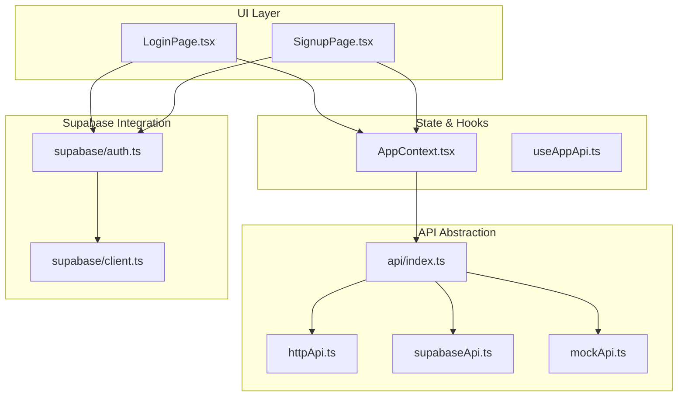

**Diagram sources**
- [LoginPage.tsx:1-158](file://src/pages/LoginPage.tsx#L1-L158)
- [SignupPage.tsx:1-144](file://src/pages/SignupPage.tsx#L1-L144)
- [AppContext.tsx:1-239](file://src/context/AppContext.tsx#L1-L239)
- [useAppApi.ts:1-156](file://src/hooks/useAppApi.ts#L1-L156)
- [api/index.ts:1-23](file://src/lib/api/index.ts#L1-L23)
- [httpApi.ts:1-212](file://src/lib/api/httpApi.ts#L1-L212)
- [supabaseApi.ts:1-1205](file://src/lib/api/supabaseApi.ts#L1-L1205)
- [mockApi.ts:1-768](file://src/lib/api/mockApi.ts#L1-L768)
- [supabase/auth.ts:1-20](file://src/lib/supabase/auth.ts#L1-L20)
- [supabase/client.ts:1-16](file://src/lib/supabase/client.ts#L1-L16)

**Section sources**
- [LoginPage.tsx:1-158](file://src/pages/LoginPage.tsx#L1-L158)
- [SignupPage.tsx:1-144](file://src/pages/SignupPage.tsx#L1-L144)
- [AppContext.tsx:1-239](file://src/context/AppContext.tsx#L1-L239)
- [useAppApi.ts:1-156](file://src/hooks/useAppApi.ts#L1-L156)
- [api/index.ts:1-23](file://src/lib/api/index.ts#L1-L23)
- [httpApi.ts:1-212](file://src/lib/api/httpApi.ts#L1-L212)
- [supabaseApi.ts:1-1205](file://src/lib/api/supabaseApi.ts#L1-L1205)
- [mockApi.ts:1-768](file://src/lib/api/mockApi.ts#L1-L768)
- [supabase/auth.ts:1-20](file://src/lib/supabase/auth.ts#L1-L20)
- [supabase/client.ts:1-16](file://src/lib/supabase/client.ts#L1-L16)

## Core Components
- LoginPage: Handles email/password login, Google OAuth fallback/demo, form validation, submission state, and navigation based on onboarding completion.
- SignupPage: Handles name/email/password registration, Google OAuth fallback/demo, form validation, email confirmation handling, and navigation.
- AppContext: Exposes signIn, signUp, signOut methods that delegate to the active API adapter and update global state.
- useAppApi: Provides React Query hooks for signIn and signUp mutations that call the active API adapter and update cached app state.
- API Adapters:
  - httpApi: HTTP adapter using fetch with credential handling and ApiError parsing.
  - supabaseApi: Supabase adapter implementing signIn/signUp/signOut and building AppState from database tables.
  - mockApi: Local storage-backed adapter for development/demo scenarios.
- Error Handling: Centralized mapping of backend errors to user-friendly messages.
- Supabase Integration: Google OAuth initiation and client configuration with session persistence.

**Section sources**
- [LoginPage.tsx:13-158](file://src/pages/LoginPage.tsx#L13-L158)
- [SignupPage.tsx:13-144](file://src/pages/SignupPage.tsx#L13-L144)
- [AppContext.tsx:111-125](file://src/context/AppContext.tsx#L111-L125)
- [useAppApi.ts:20-35](file://src/hooks/useAppApi.ts#L20-L35)
- [httpApi.ts:62-104](file://src/lib/api/httpApi.ts#L62-L104)
- [supabaseApi.ts:486-524](file://src/lib/api/supabaseApi.ts#L486-L524)
- [mockApi.ts:127-160](file://src/lib/api/mockApi.ts#L127-L160)
- [authErrors.ts:1-59](file://src/lib/authErrors.ts#L1-L59)
- [supabase/auth.ts:3-19](file://src/lib/supabase/auth.ts#L3-L19)
- [supabase/client.ts:8-15](file://src/lib/supabase/client.ts#L8-L15)

## Architecture Overview
The authentication flow routes through UI pages to AppContext, which delegates to the active API adapter. The adapter performs the operation (e.g., Supabase auth or HTTP endpoint), then builds AppState and returns it to the caller. UI pages navigate based on onboarding state and show user feedback via toasts.

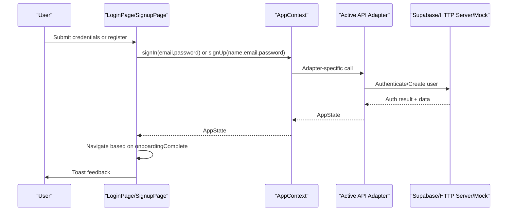

**Diagram sources**
- [LoginPage.tsx:20-41](file://src/pages/LoginPage.tsx#L20-L41)
- [SignupPage.tsx:25-55](file://src/pages/SignupPage.tsx#L25-L55)
- [AppContext.tsx:111-125](file://src/context/AppContext.tsx#L111-L125)
- [supabaseApi.ts:486-524](file://src/lib/api/supabaseApi.ts#L486-L524)
- [httpApi.ts:91-104](file://src/lib/api/httpApi.ts#L91-L104)
- [mockApi.ts:127-160](file://src/lib/api/mockApi.ts#L127-L160)

## Detailed Component Analysis

### Login Page Component
- Responsibilities:
  - Capture email and password.
  - Validate presence of credentials.
  - Call signIn via AppContext and navigate based on onboarding state.
  - Handle Google login via Supabase OAuth or demo fallback.
  - Show user feedback via toast and manage submission state.
- Validation and UX:
  - Prevents submission with empty fields.
  - Disables buttons during submission.
  - Uses getAuthErrorMessage for friendly messages.
- Navigation:
  - Routes to dashboard if onboardingComplete is true, otherwise to onboarding.

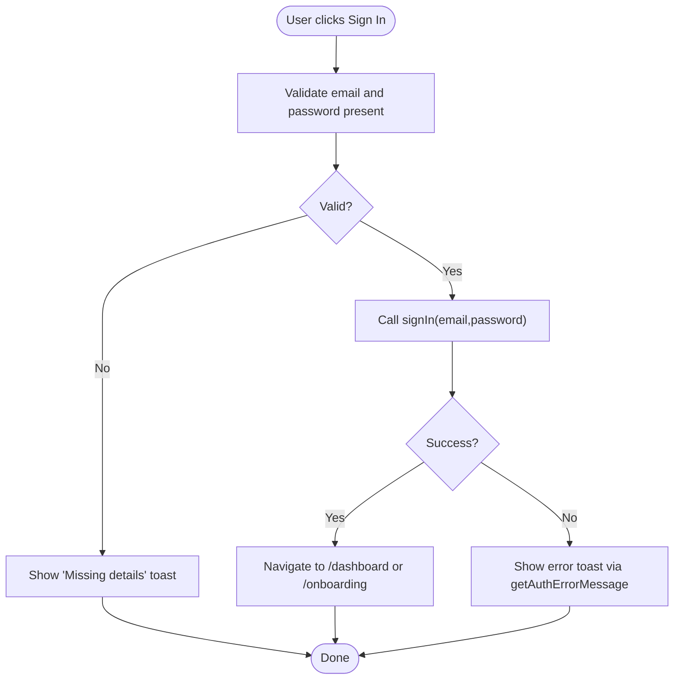

**Diagram sources**
- [LoginPage.tsx:20-41](file://src/pages/LoginPage.tsx#L20-L41)
- [authErrors.ts:1-59](file://src/lib/authErrors.ts#L1-L59)

**Section sources**
- [LoginPage.tsx:13-158](file://src/pages/LoginPage.tsx#L13-L158)
- [authErrors.ts:1-59](file://src/lib/authErrors.ts#L1-L59)

### Signup Page Component
- Responsibilities:
  - Capture name, email, password.
  - Validate presence of all fields.
  - Call signUp via AppContext and navigate based on onboarding state.
  - Handle Google signup via Supabase OAuth or demo fallback.
  - Special-case email confirmation requirement with dedicated messaging and redirect.
- Validation and UX:
  - Prevents submission with empty fields.
  - Disables buttons during submission.
  - Detects "email confirmation is required" and guides the user to check email and return to login.
  - Uses getAuthErrorMessage for friendly messages.

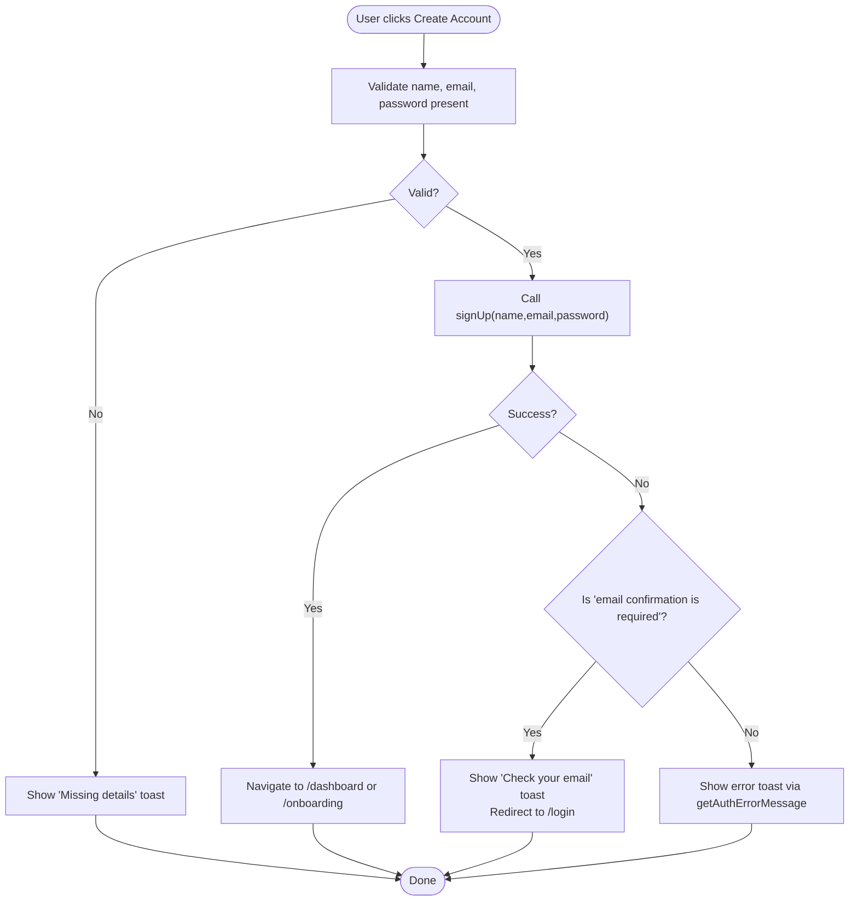

**Diagram sources**
- [SignupPage.tsx:25-55](file://src/pages/SignupPage.tsx#L25-L55)
- [authErrors.ts:16-18](file://src/lib/authErrors.ts#L16-L18)

**Section sources**
- [SignupPage.tsx:13-144](file://src/pages/SignupPage.tsx#L13-L144)
- [authErrors.ts:1-59](file://src/lib/authErrors.ts#L1-L59)

### AppContext Authentication Methods
- signIn(email, password):
  - Delegates to api.signIn and updates state with returned AppState.
- signUp(name, email, password):
  - Delegates to api.signUp and updates state with returned AppState.
- signOut():
  - Delegates to api.signOut and resets state to empty.
- Active adapter selection:
  - Determined by activeApiAdapter and environment variables.

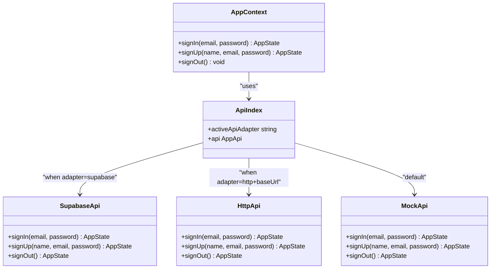

**Diagram sources**
- [AppContext.tsx:111-125](file://src/context/AppContext.tsx#L111-L125)
- [api/index.ts:13-23](file://src/lib/api/index.ts#L13-L23)
- [supabaseApi.ts:486-524](file://src/lib/api/supabaseApi.ts#L486-L524)
- [httpApi.ts:91-104](file://src/lib/api/httpApi.ts#L91-L104)
- [mockApi.ts:127-160](file://src/lib/api/mockApi.ts#L127-L160)

**Section sources**
- [AppContext.tsx:111-125](file://src/context/AppContext.tsx#L111-L125)
- [api/index.ts:13-23](file://src/lib/api/index.ts#L13-L23)

### useAppApi Hook Pattern
- useSignInMutation:
  - Mutation function calls api.signIn and on success updates the app-state cache.
- useSignUpMutation:
  - Mutation function calls api.signUp and on success updates the app-state cache.
- Shared pattern:
  - Both use react-query’s useMutation and useQueryClient to update cached state.

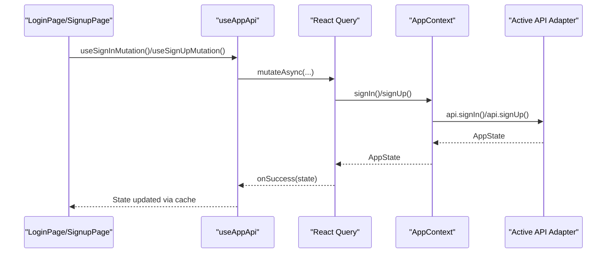

**Diagram sources**
- [useAppApi.ts:20-35](file://src/hooks/useAppApi.ts#L20-L35)
- [AppContext.tsx:111-125](file://src/context/AppContext.tsx#L111-L125)
- [api/index.ts:13-23](file://src/lib/api/index.ts#L13-L23)

**Section sources**
- [useAppApi.ts:1-156](file://src/hooks/useAppApi.ts#L1-L156)
- [AppContext.tsx:111-125](file://src/context/AppContext.tsx#L111-L125)

### API Layer Implementations

#### Supabase Adapter
- signIn:
  - Calls Supabase auth.signInWithPassword.
  - Builds AppState by fetching related tables and normalizing data.
- signUp:
  - Calls Supabase auth.signUp with profile metadata.
  - Throws a specific error when email confirmation is required before session creation.
- signOut:
  - Calls Supabase auth.signOut and returns empty state.
- Additional helpers:
  - Ensures default templates and automation rules per workspace.
  - Handles optional tables with graceful fallbacks.

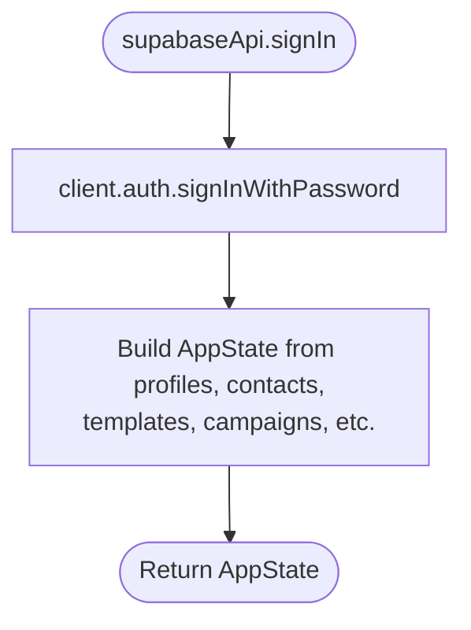

**Diagram sources**
- [supabaseApi.ts:486-524](file://src/lib/api/supabaseApi.ts#L486-L524)
- [supabaseApi.ts:218-471](file://src/lib/api/supabaseApi.ts#L218-L471)

**Section sources**
- [supabaseApi.ts:486-524](file://src/lib/api/supabaseApi.ts#L486-L524)
- [supabaseApi.ts:218-471](file://src/lib/api/supabaseApi.ts#L218-L471)

#### HTTP Adapter
- signIn:
  - Sends POST to session route with email/password.
  - Returns state from response.
- signUp:
  - Sends POST to signup route with name, email, password.
  - Returns state from response.
- signOut:
  - Sends POST to signout route.

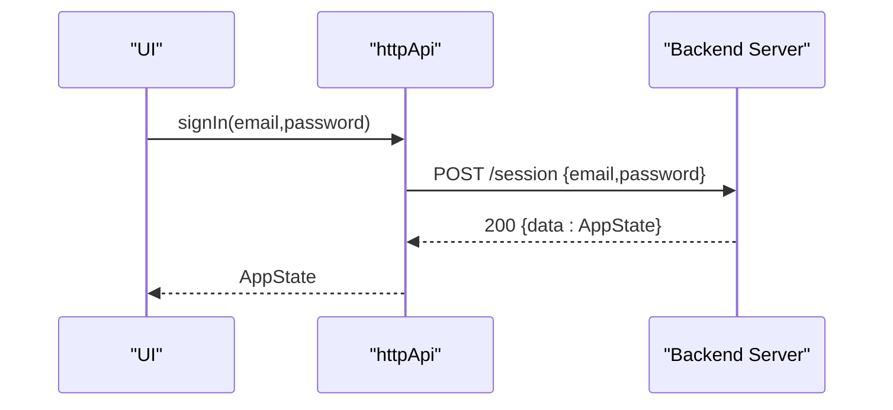

**Diagram sources**
- [httpApi.ts:91-104](file://src/lib/api/httpApi.ts#L91-L104)

**Section sources**
- [httpApi.ts:62-104](file://src/lib/api/httpApi.ts#L62-L104)

#### Mock Adapter
- signIn:
  - Reads local state, sets user, writes back.
- signUp:
  - Reads local state, sets user, writes back.
- signOut:
  - Resets user and onboarding flag, writes back.

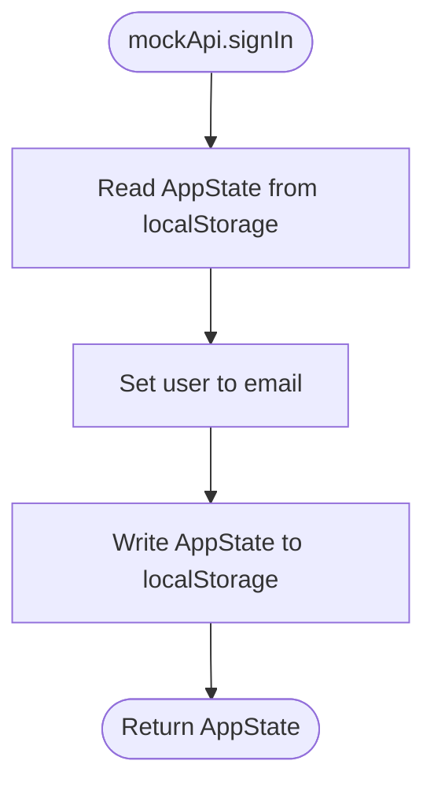

**Diagram sources**
- [mockApi.ts:127-160](file://src/lib/api/mockApi.ts#L127-L160)

**Section sources**
- [mockApi.ts:127-160](file://src/lib/api/mockApi.ts#L127-L160)

### Supabase Client and Google OAuth
- Client initialization:
  - Creates Supabase client with environment variables.
  - Enables session persistence and token auto-refresh.
- Google OAuth:
  - Initiates OAuth with provider "google".
  - Redirects to configured URL.

**Section sources**
- [supabase/client.ts:8-15](file://src/lib/supabase/client.ts#L8-L15)
- [supabase/auth.ts:3-19](file://src/lib/supabase/auth.ts#L3-L19)

## Dependency Analysis
- UI depends on AppContext for authentication actions.
- AppContext depends on activeApiAdapter selection.
- activeApiAdapter chooses between httpApi, supabaseApi, or mockApi.
- Supabase adapter depends on Supabase client and database tables.
- HTTP adapter depends on backend routes and credentials.
- Error handling is centralized in authErrors module.

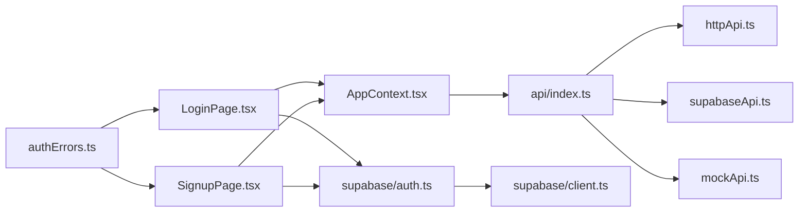

**Diagram sources**
- [LoginPage.tsx:18](file://src/pages/LoginPage.tsx#L18)
- [SignupPage.tsx:19](file://src/pages/SignupPage.tsx#L19)
- [AppContext.tsx:2](file://src/context/AppContext.tsx#L2)
- [api/index.ts:16-23](file://src/lib/api/index.ts#L16-L23)
- [supabase/auth.ts:1](file://src/lib/supabase/auth.ts#L1)
- [supabase/client.ts:1](file://src/lib/supabase/client.ts#L1)
- [authErrors.ts:1](file://src/lib/authErrors.ts#L1)

**Section sources**
- [api/index.ts:13-23](file://src/lib/api/index.ts#L13-L23)
- [authErrors.ts:1-59](file://src/lib/authErrors.ts#L1-L59)

## Performance Considerations
- Supabase adapter:
  - Uses concurrent queries to build AppState; ensure database is indexed appropriately for workspace-scoped tables.
  - Optional tables are handled gracefully to avoid blocking on missing relations.
- HTTP adapter:
  - Uses include credentials for cookie-based sessions; ensure CORS and SameSite policies are aligned.
- Mock adapter:
  - Operates in-memory with local storage; suitable for development but not production-grade.
- UI:
  - Submission state prevents duplicate requests; consider debouncing for real-time validation if extended.

[No sources needed since this section provides general guidance]

## Security Considerations
- Password Handling:
  - Supabase adapter delegates authentication to Supabase; client-side does not handle password hashing.
  - HTTP adapter expects backend to enforce secure password policies and hashing.
- Token and Session Storage:
  - Supabase client persists session and auto-refreshes tokens; ensure HTTPS and secure cookies in production.
  - HTTP adapter relies on backend-managed session cookies; configure SameSite and Secure flags.
- CSRF and CORS:
  - HTTP adapter sends credentials; backend must set appropriate Access-Control-Allow-Origin and credentials handling.
- Error Messages:
  - Centralized mapping avoids leaking internal details; sanitize error messages shown to users.
- Email Confirmation:
  - Supabase adapter enforces pre-session email confirmation; UI handles this scenario with explicit user guidance.
- Environment Variables:
  - Adapter selection depends on VITE_API_ADAPTER and VITE_API_BASE_URL; ensure secrets are not exposed in client code for HTTP adapter.

**Section sources**
- [supabase/client.ts:8-15](file://src/lib/supabase/client.ts#L8-L15)
- [httpApi.ts:64-74](file://src/lib/api/httpApi.ts#L64-L74)
- [supabaseApi.ts:510-512](file://src/lib/api/supabaseApi.ts#L510-L512)
- [authErrors.ts:12-18](file://src/lib/authErrors.ts#L12-L18)

## Practical Authentication Flows

### Login Flow (Supabase)
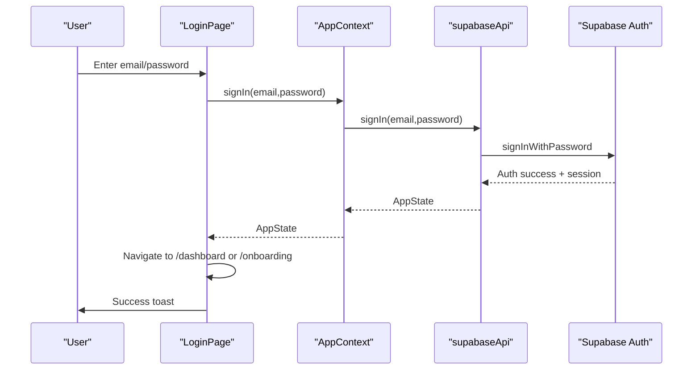

**Diagram sources**
- [LoginPage.tsx:20-41](file://src/pages/LoginPage.tsx#L20-L41)
- [AppContext.tsx:111-115](file://src/context/AppContext.tsx#L111-L115)
- [supabaseApi.ts:486-493](file://src/lib/api/supabaseApi.ts#L486-L493)

### Registration Flow (Supabase)
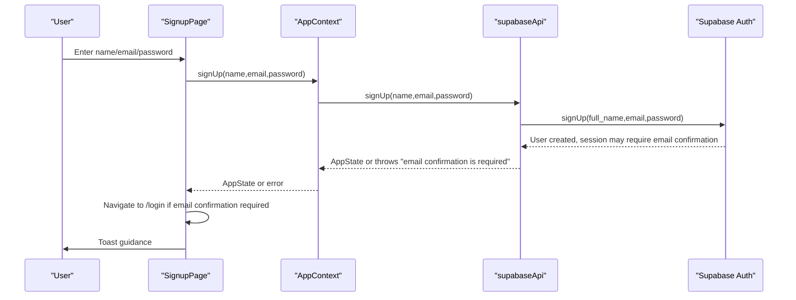

**Diagram sources**
- [SignupPage.tsx:25-55](file://src/pages/SignupPage.tsx#L25-L55)
- [AppContext.tsx:116-120](file://src/context/AppContext.tsx#L116-L120)
- [supabaseApi.ts:495-515](file://src/lib/api/supabaseApi.ts#L495-L515)

### Logout Flow
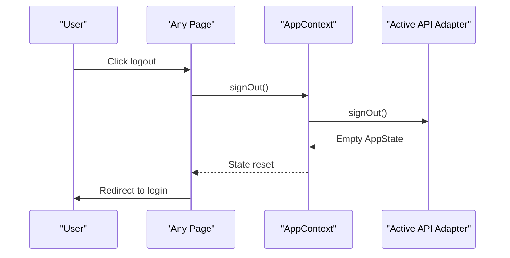

**Diagram sources**
- [AppContext.tsx:121-124](file://src/context/AppContext.tsx#L121-L124)
- [supabaseApi.ts:517-524](file://src/lib/api/supabaseApi.ts#L517-L524)
- [httpApi.ts:101-104](file://src/lib/api/httpApi.ts#L101-L104)
- [mockApi.ts:151-160](file://src/lib/api/mockApi.ts#L151-L160)

## Troubleshooting Guide
- Invalid login credentials:
  - Symptom: Friendly message indicating invalid credentials.
  - Action: Verify email and password; ensure account exists.
  - Reference: [authErrors.ts:20-22](file://src/lib/authErrors.ts#L20-L22)
- Email not confirmed:
  - Symptom: Message indicating email not confirmed; Supabase blocks sign-in until confirmed.
  - Action: Ask user to check inbox and confirm; optionally disable email confirmation in Supabase for testing.
  - Reference: [authErrors.ts:12-14](file://src/lib/authErrors.ts#L12-L14)
- Email confirmation required:
  - Symptom: Error indicates email confirmation is required before sign-in.
  - Action: Show "Check your email" toast and redirect to login; guide user to sign in after confirmation.
  - Reference: [authErrors.ts:16-18](file://src/lib/authErrors.ts#L16-L18), [supabaseApi.ts:510-512](file://src/lib/api/supabaseApi.ts#L510-L512)
- Supabase blocked workspace query:
  - Symptom: Permission denied or row-level security error.
  - Action: Review Supabase policies and SQL setup; ensure workspace profile is complete.
  - Reference: [authErrors.ts:28-30](file://src/lib/authErrors.ts#L28-L30)
- CRM tables not set up:
  - Symptom: Errors referencing conversations/conversation_messages/leads tables.
  - Action: Run latest upgrade SQL and retry.
  - Reference: [authErrors.ts:36-38](file://src/lib/authErrors.ts#L36-L38)
- Missing Supabase environment:
  - Symptom: Google login throws configuration error.
  - Action: Set VITE_SUPABASE_URL and VITE_SUPABASE_ANON_KEY; ensure redirect URL is configured.
  - Reference: [supabase/auth.ts:4-6](file://src/lib/supabase/auth.ts#L4-L6), [supabase/client.ts:3-6](file://src/lib/supabase/client.ts#L3-L6)
- HTTP adapter issues:
  - Symptom: Requests fail with 401/403 or CORS errors.
  - Action: Verify VITE_API_BASE_URL; ensure backend sets credentials and CORS; check SameSite/Secure flags.
  - Reference: [api/index.ts:13-23](file://src/lib/api/index.ts#L13-L23), [httpApi.ts:64-74](file://src/lib/api/httpApi.ts#L64-L74)

**Section sources**
- [authErrors.ts:1-59](file://src/lib/authErrors.ts#L1-L59)
- [supabase/auth.ts:4-6](file://src/lib/supabase/auth.ts#L4-L6)
- [supabase/client.ts:3-6](file://src/lib/supabase/client.ts#L3-L6)
- [api/index.ts:13-23](file://src/lib/api/index.ts#L13-L23)
- [httpApi.ts:64-74](file://src/lib/api/httpApi.ts#L64-L74)

## Conclusion
The authentication system provides a clean separation between UI, state management, and API adapters. Supabase is the primary production adapter with robust session handling and workspace-aware state building. The HTTP adapter supports backend-driven sessions, while the mock adapter enables rapid development. Centralized error handling ensures consistent user feedback, and environment-driven adapter selection allows flexible deployment configurations. Following the security and troubleshooting guidance will help maintain a reliable and secure authentication experience.