# Session Management

<cite>
**Referenced Files in This Document**
- [AppContext.tsx](file://src/context/AppContext.tsx)
- [client.ts](file://src/lib/supabase/client.ts)
- [auth.ts](file://src/lib/supabase/auth.ts)
- [supabaseApi.ts](file://src/lib/api/supabaseApi.ts)
- [mockApi.ts](file://src/lib/api/mockApi.ts)
- [index.ts](file://src/lib/api/index.ts)
- [ProtectedRoute.tsx](file://src/components/ProtectedRoute.tsx)
- [LoginPage.tsx](file://src/pages/LoginPage.tsx)
- [SignupPage.tsx](file://src/pages/SignupPage.tsx)
- [App.tsx](file://src/App.tsx)
- [authErrors.ts](file://src/lib/authErrors.ts)
- [package.json](file://package.json)
</cite>

## Table of Contents
1. [Introduction](#introduction)
2. [Project Structure](#project-structure)
3. [Core Components](#core-components)
4. [Architecture Overview](#architecture-overview)
5. [Detailed Component Analysis](#detailed-component-analysis)
6. [Dependency Analysis](#dependency-analysis)
7. [Performance Considerations](#performance-considerations)
8. [Troubleshooting Guide](#troubleshooting-guide)
9. [Conclusion](#conclusion)

## Introduction
This document explains the session management system, focusing on the user session lifecycle, token handling, and state persistence. It documents the centralized AppContext implementation, the hydration process, and real-time session updates driven by Supabase auth. It also covers session persistence, token refresh strategies, automatic logout on session expiration, and protected route handling with unauthorized access redirection. Practical examples illustrate session state management, token storage strategies, and session recovery mechanisms, along with guidance for common session-related issues such as token expiration, concurrent sessions, and session hijacking prevention.

## Project Structure
The session management spans several layers:
- Centralized state and session orchestration via AppContext
- Authentication adapters (Supabase vs. mock)
- Protected routing and hydration guards
- UI pages for login/signup and protected routes

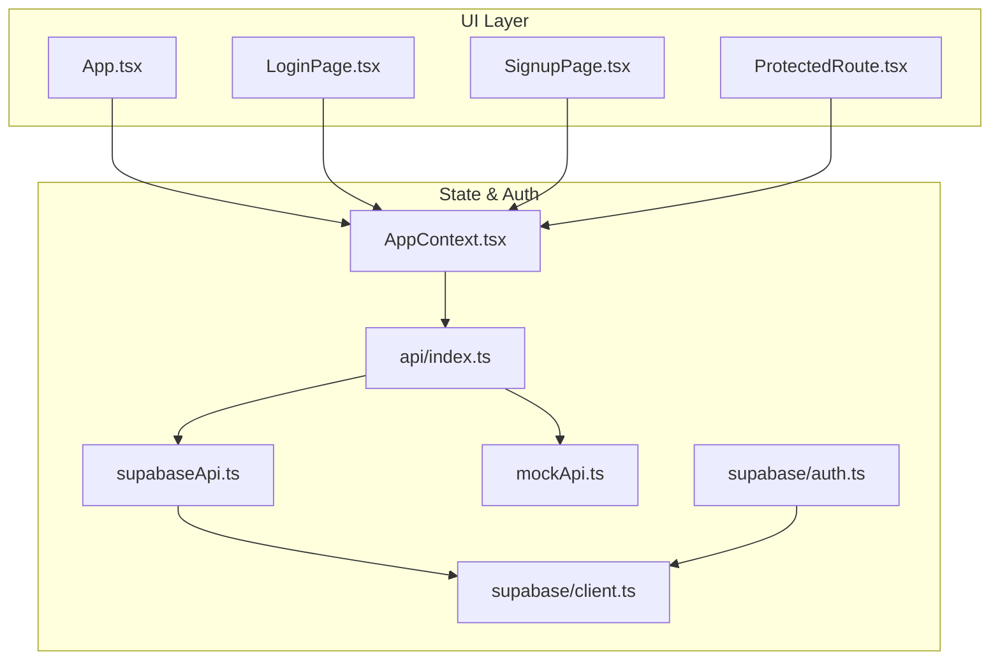

**Diagram sources**
- [App.tsx:34-72](file://src/App.tsx#L34-L72)
- [AppContext.tsx:58-98](file://src/context/AppContext.tsx#L58-L98)
- [index.ts:18-23](file://src/lib/api/index.ts#L18-L23)
- [supabaseApi.ts:481-524](file://src/lib/api/supabaseApi.ts#L481-L524)
- [mockApi.ts:122-160](file://src/lib/api/mockApi.ts#L122-L160)
- [client.ts:8-15](file://src/lib/supabase/client.ts#L8-L15)
- [auth.ts:3-19](file://src/lib/supabase/auth.ts#L3-L19)

**Section sources**
- [App.tsx:34-72](file://src/App.tsx#L34-L72)
- [AppContext.tsx:58-98](file://src/context/AppContext.tsx#L58-L98)
- [index.ts:18-23](file://src/lib/api/index.ts#L18-L23)

## Core Components
- AppContext: Centralizes session state, hydration, and actions. It listens to Supabase auth state changes and synchronizes app state accordingly. It exposes authentication actions and derived flags such as isAuthenticated and isHydrating.
- Supabase client: Configured with session persistence and automatic token refresh.
- Supabase API adapter: Implements authentication, workspace state building, and session cleanup.
- ProtectedRoute: Guards protected routes using AppContext’s authentication flags and hydration state.
- Login/Signup pages: Trigger authentication actions and redirect based on onboarding completion.

Key responsibilities:
- Hydration: Loads initial app state on mount and marks isHydrating until complete.
- Real-time updates: Subscribes to Supabase auth state changes and refreshes state automatically.
- Token handling: Delegates token persistence and refresh to Supabase client configuration.
- Protected routing: Blocks unauthenticated users and renders a loading state during hydration.

**Section sources**
- [AppContext.tsx:58-229](file://src/context/AppContext.tsx#L58-L229)
- [client.ts:8-15](file://src/lib/supabase/client.ts#L8-L15)
- [supabaseApi.ts:481-524](file://src/lib/api/supabaseApi.ts#L481-L524)
- [ProtectedRoute.tsx:4-23](file://src/components/ProtectedRoute.tsx#L4-L23)
- [LoginPage.tsx:13-41](file://src/pages/LoginPage.tsx#L13-L41)
- [SignupPage.tsx:13-55](file://src/pages/SignupPage.tsx#L13-L55)

## Architecture Overview
The session lifecycle integrates React state, Supabase auth, and API adapters.

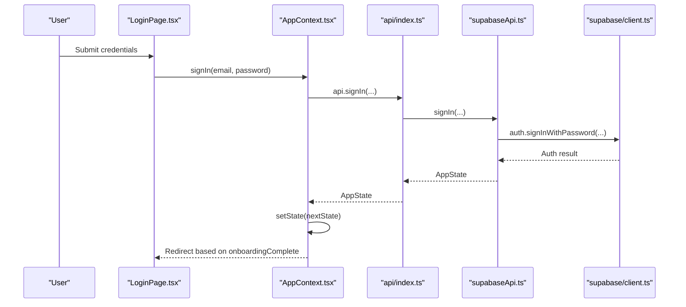

**Diagram sources**
- [LoginPage.tsx:20-41](file://src/pages/LoginPage.tsx#L20-L41)
- [AppContext.tsx:111-115](file://src/context/AppContext.tsx#L111-L115)
- [index.ts:18-23](file://src/lib/api/index.ts#L18-L23)
- [supabaseApi.ts:486-493](file://src/lib/api/supabaseApi.ts#L486-L493)
- [client.ts:8-15](file://src/lib/supabase/client.ts#L8-L15)

## Detailed Component Analysis

### AppContext: Centralized Session State Management
AppContext manages:
- Initial hydration: Fetches app state on mount and sets isHydrating until completion.
- Real-time session updates: Subscribes to Supabase auth state changes and refreshes state.
- Derived flags: isAuthenticated, isHydrating, computed metrics (e.g., approvedTemplates, totalContacts).
- Authentication actions: signIn, signUp, signOut, completeOnboarding, and workspace operations.
- State synchronization: Updates React state atomically and consistently across actions.

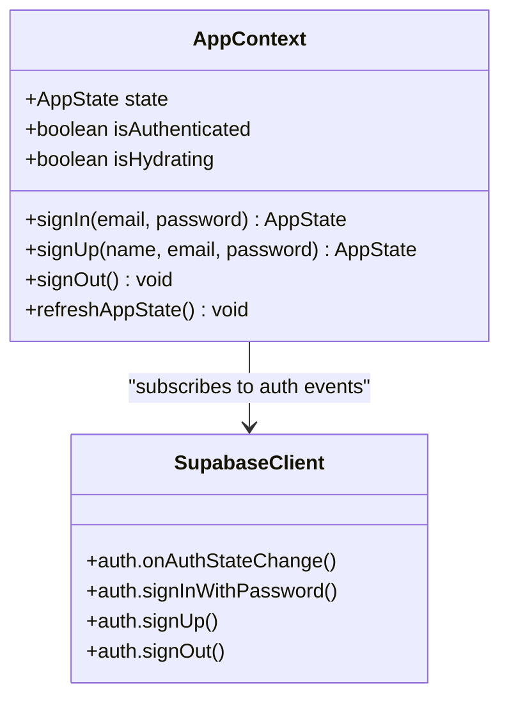

**Diagram sources**
- [AppContext.tsx:24-54](file://src/context/AppContext.tsx#L24-L54)
- [AppContext.tsx:84-93](file://src/context/AppContext.tsx#L84-L93)
- [client.ts:8-15](file://src/lib/supabase/client.ts#L8-L15)

**Section sources**
- [AppContext.tsx:58-98](file://src/context/AppContext.tsx#L58-L98)
- [AppContext.tsx:100-226](file://src/context/AppContext.tsx#L100-L226)

### Supabase Auth Integration and Token Handling
- Supabase client is configured with session persistence and automatic token refresh.
- OAuth login triggers Supabase auth state changes, which AppContext listens to for real-time updates.
- Supabase API adapter handles sign-in/sign-out and builds app state from Supabase tables.

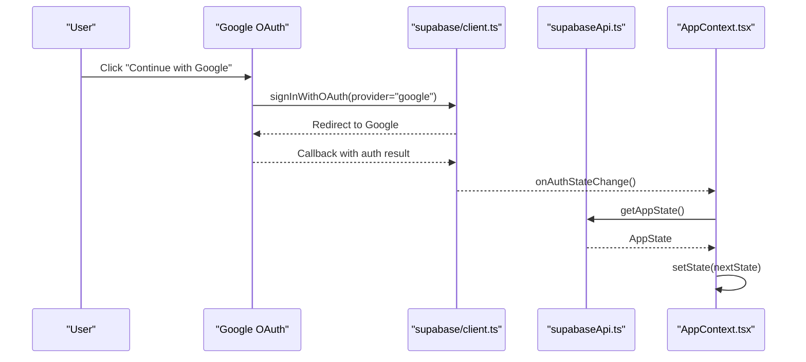

**Diagram sources**
- [auth.ts:3-19](file://src/lib/supabase/auth.ts#L3-L19)
- [client.ts:8-15](file://src/lib/supabase/client.ts#L8-L15)
- [supabaseApi.ts:482-484](file://src/lib/api/supabaseApi.ts#L482-L484)
- [AppContext.tsx:84-87](file://src/context/AppContext.tsx#L84-L87)

**Section sources**
- [client.ts:8-15](file://src/lib/supabase/client.ts#L8-L15)
- [auth.ts:3-19](file://src/lib/supabase/auth.ts#L3-L19)
- [supabaseApi.ts:486-524](file://src/lib/api/supabaseApi.ts#L486-L524)

### Protected Route Handling and Unauthorized Access Redirection
ProtectedRoute enforces:
- Loading state during hydration (isHydrating).
- Redirect to login when not authenticated.
- Rendering of nested protected routes when authenticated.

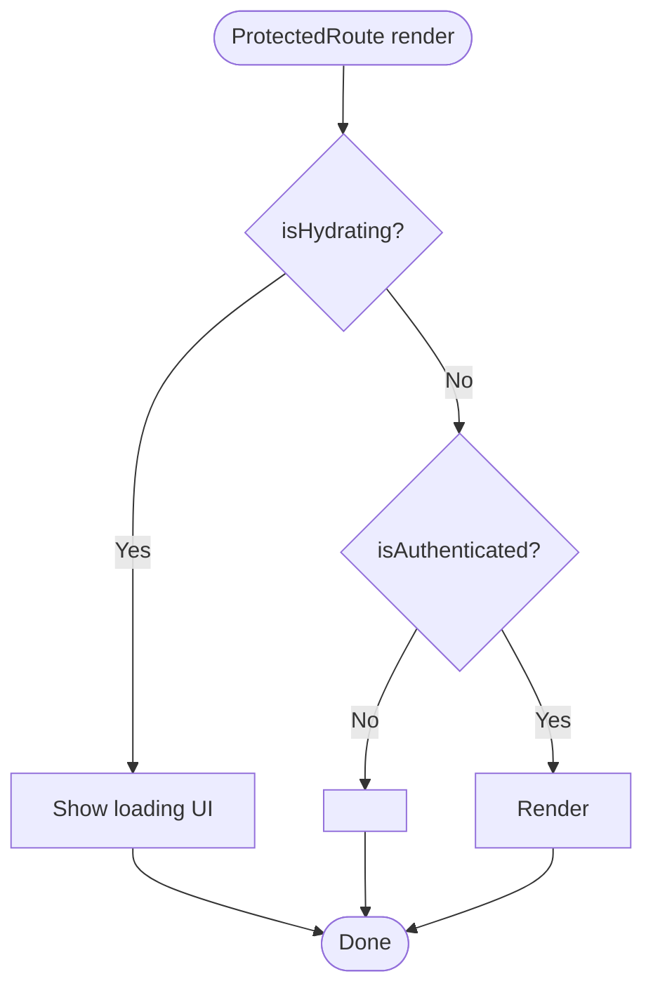

**Diagram sources**
- [ProtectedRoute.tsx:4-23](file://src/components/ProtectedRoute.tsx#L4-L23)

**Section sources**
- [ProtectedRoute.tsx:4-23](file://src/components/ProtectedRoute.tsx#L4-L23)

### Session Persistence Mechanisms and Token Refresh Strategies
- Session persistence: Supabase persists session in storage and restores it on app load.
- Automatic token refresh: Supabase automatically refreshes tokens before expiry.
- Supabase API adapter builds app state from database tables and normalizes data for the UI.

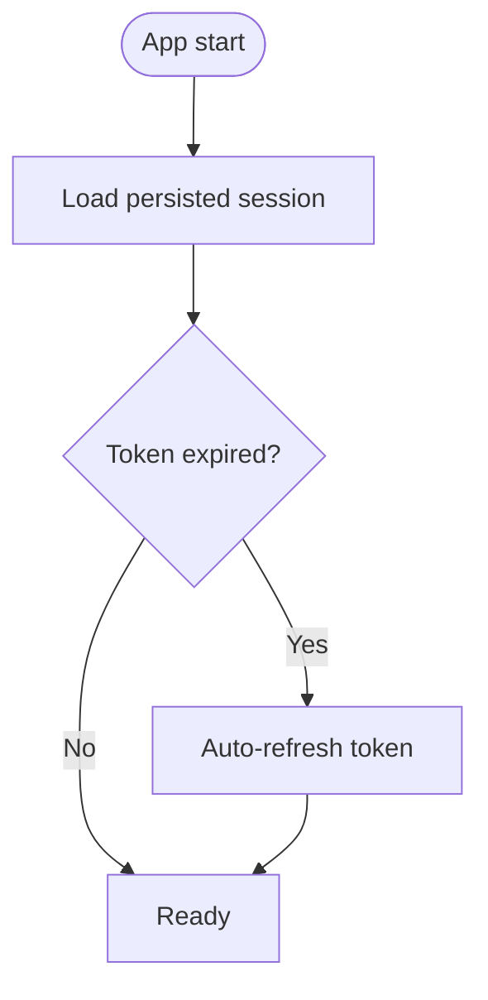

**Diagram sources**
- [client.ts:10-14](file://src/lib/supabase/client.ts#L10-L14)
- [supabaseApi.ts:218-471](file://src/lib/api/supabaseApi.ts#L218-L471)

**Section sources**
- [client.ts:8-15](file://src/lib/supabase/client.ts#L8-L15)
- [supabaseApi.ts:218-471](file://src/lib/api/supabaseApi.ts#L218-L471)

### Automatic Logout on Session Expiration
- Supabase auth state changes trigger AppContext to refresh state.
- If the backend indicates session invalidation or the user is not found, AppContext updates state to reflect logged-out status.

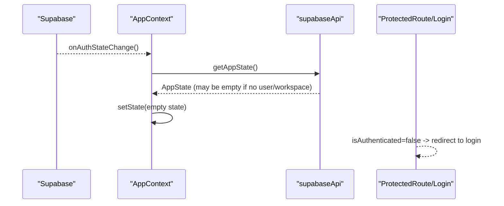

**Diagram sources**
- [AppContext.tsx:84-87](file://src/context/AppContext.tsx#L84-L87)
- [supabaseApi.ts:482-484](file://src/lib/api/supabaseApi.ts#L482-L484)
- [ProtectedRoute.tsx:18-20](file://src/components/ProtectedRoute.tsx#L18-L20)

**Section sources**
- [AppContext.tsx:84-87](file://src/context/AppContext.tsx#L84-L87)
- [supabaseApi.ts:482-484](file://src/lib/api/supabaseApi.ts#L482-L484)
- [ProtectedRoute.tsx:18-20](file://src/components/ProtectedRoute.tsx#L18-L20)

### isHydrating State Management During Initial App Load
- AppContext sets isHydrating to true during mount and clears it after the first successful state fetch.
- ProtectedRoute displays a loading UI while isHydrating is true, preventing navigation until state is ready.

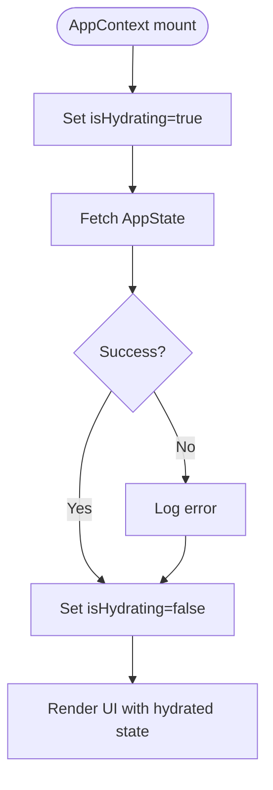

**Diagram sources**
- [AppContext.tsx:64-79](file://src/context/AppContext.tsx#L64-L79)
- [ProtectedRoute.tsx:8-16](file://src/components/ProtectedRoute.tsx#L8-L16)

**Section sources**
- [AppContext.tsx:64-79](file://src/context/AppContext.tsx#L64-L79)
- [ProtectedRoute.tsx:8-16](file://src/components/ProtectedRoute.tsx#L8-L16)

### Authentication State Synchronization Patterns
- AppContext memoizes values to avoid unnecessary re-renders and ensures derived flags are computed consistently.
- Actions return AppState to enable immediate UI updates and subsequent redirects based on onboarding completion.

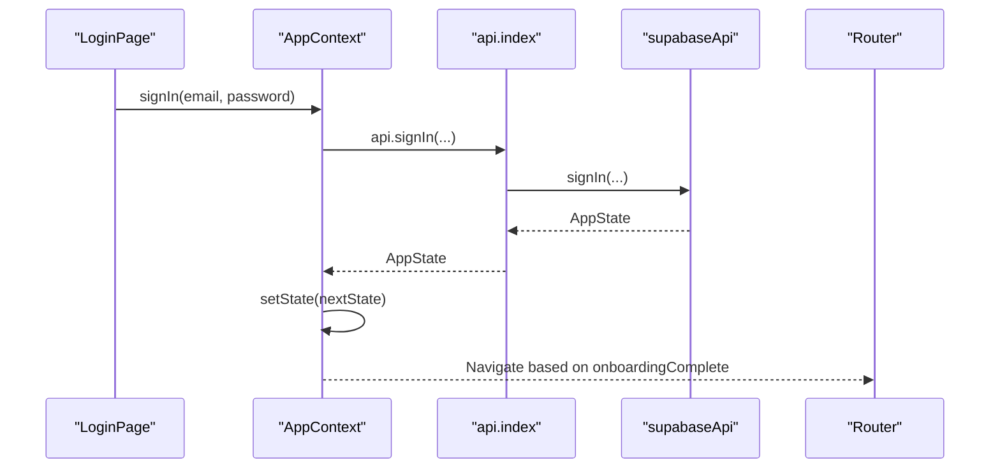

**Diagram sources**
- [LoginPage.tsx:20-41](file://src/pages/LoginPage.tsx#L20-L41)
- [AppContext.tsx:111-115](file://src/context/AppContext.tsx#L111-L115)
- [index.ts:18-23](file://src/lib/api/index.ts#L18-L23)
- [supabaseApi.ts:486-493](file://src/lib/api/supabaseApi.ts#L486-L493)

**Section sources**
- [AppContext.tsx:100-226](file://src/context/AppContext.tsx#L100-L226)
- [LoginPage.tsx:20-41](file://src/pages/LoginPage.tsx#L20-L41)

### Session Validation Processes and Workspace Context
- The Supabase API adapter resolves the current user and workspace membership, ensuring state is only built for authenticated users with a valid workspace.
- It normalizes database rows into a unified AppState shape, including wallet balances, contacts, campaigns, and metadata.

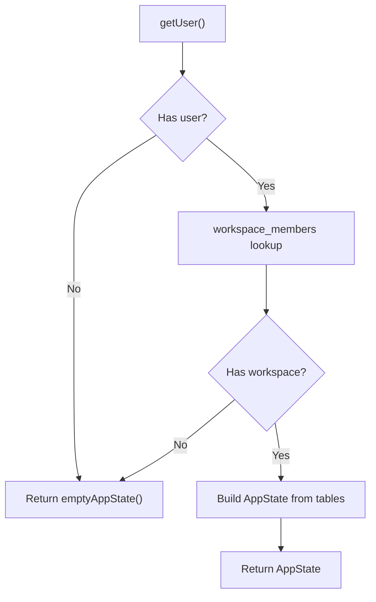

**Diagram sources**
- [supabaseApi.ts:110-139](file://src/lib/api/supabaseApi.ts#L110-L139)
- [supabaseApi.ts:218-471](file://src/lib/api/supabaseApi.ts#L218-L471)

**Section sources**
- [supabaseApi.ts:110-139](file://src/lib/api/supabaseApi.ts#L110-L139)
- [supabaseApi.ts:218-471](file://src/lib/api/supabaseApi.ts#L218-L471)

### Token Storage Strategies and Session Recovery
- Supabase stores session data and refresh tokens in browser storage, enabling seamless recovery across page reloads and app restarts.
- The adapter validates token status and rebuilds state on auth state changes, minimizing manual intervention.

Practical tips:
- Ensure environment variables for Supabase are present to enable Supabase adapter.
- Use the mock adapter for local development without external dependencies.

**Section sources**
- [client.ts:8-15](file://src/lib/supabase/client.ts#L8-L15)
- [index.ts:18-23](file://src/lib/api/index.ts#L18-L23)

### Session Recovery Mechanisms
- On auth state change, AppContext triggers a state refresh to recover from transient errors or expired tokens.
- If the user is not found or workspace setup is incomplete, the system gracefully falls back to an empty state and redirects to login.

**Section sources**
- [AppContext.tsx:84-87](file://src/context/AppContext.tsx#L84-L87)
- [supabaseApi.ts:482-484](file://src/lib/api/supabaseApi.ts#L482-L484)

## Dependency Analysis
- AppContext depends on the active API adapter (Supabase or mock) to fetch and mutate state.
- Supabase API adapter depends on the Supabase client for authentication and database queries.
- ProtectedRoute depends on AppContext for authentication flags and hydration state.
- Login/Signup pages depend on AppContext for authentication actions and navigation.

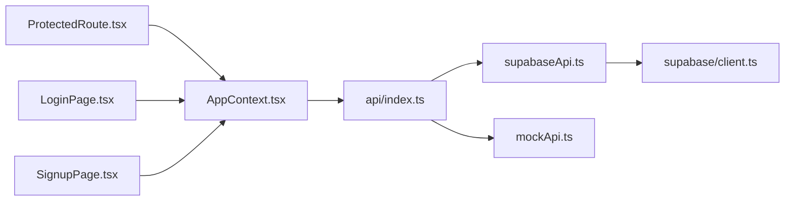

**Diagram sources**
- [AppContext.tsx:58-98](file://src/context/AppContext.tsx#L58-L98)
- [index.ts:18-23](file://src/lib/api/index.ts#L18-L23)
- [supabaseApi.ts:481-524](file://src/lib/api/supabaseApi.ts#L481-L524)
- [mockApi.ts:122-160](file://src/lib/api/mockApi.ts#L122-L160)
- [client.ts:8-15](file://src/lib/supabase/client.ts#L8-L15)
- [ProtectedRoute.tsx:4-23](file://src/components/ProtectedRoute.tsx#L4-L23)
- [LoginPage.tsx:13-41](file://src/pages/LoginPage.tsx#L13-L41)
- [SignupPage.tsx:13-55](file://src/pages/SignupPage.tsx#L13-L55)

**Section sources**
- [AppContext.tsx:58-98](file://src/context/AppContext.tsx#L58-L98)
- [index.ts:18-23](file://src/lib/api/index.ts#L18-L23)

## Performance Considerations
- Minimize re-renders by memoizing derived values in AppContext.
- Batch database reads during state hydration to reduce round trips.
- Avoid blocking UI during hydration; show lightweight loading indicators.
- Keep token refresh off the critical path; rely on Supabase’s internal refresh logic.

## Troubleshooting Guide
Common issues and resolutions:
- Missing Supabase environment variables: The Supabase client becomes null, and the adapter falls back to mock. Ensure VITE_SUPABASE_URL and VITE_SUPABASE_ANON_KEY are set.
- Email confirmation required: Supabase may require email confirmation before sign-in. The UI surfaces a helpful message and redirects to login.
- Permission denied or row-level security errors: Indicates missing policies or incomplete database setup. Review Supabase policies and run required upgrades.
- Workspace tables not initialized: CRM tables must be created before state hydration succeeds. Run the latest upgrade scripts.
- Invalid login credentials: The UI shows a concise error message for incorrect email/password.

**Section sources**
- [client.ts:6-7](file://src/lib/supabase/client.ts#L6-L7)
- [authErrors.ts:1-59](file://src/lib/authErrors.ts#L1-L59)
- [supabaseApi.ts:49-64](file://src/lib/api/supabaseApi.ts#L49-L64)

## Conclusion
The session management system centers around AppContext for centralized state orchestration, Supabase for robust authentication and token handling, and a clean API abstraction that supports both Supabase and mock adapters. ProtectedRoute ensures secure navigation, while hydration and real-time auth state changes provide a smooth user experience. By leveraging Supabase’s session persistence and automatic token refresh, the system minimizes manual session management overhead and improves reliability.