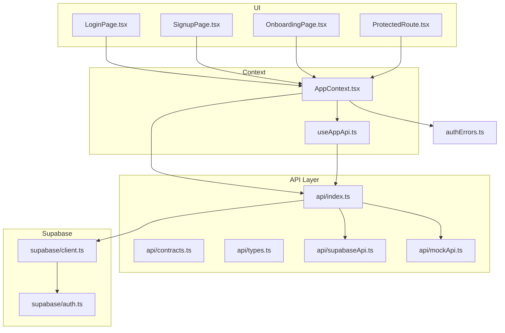
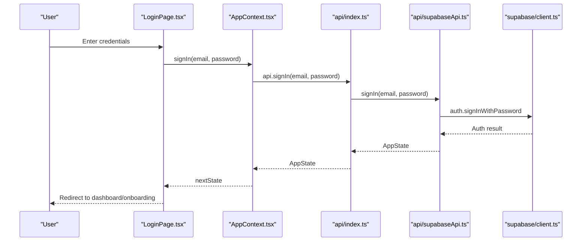
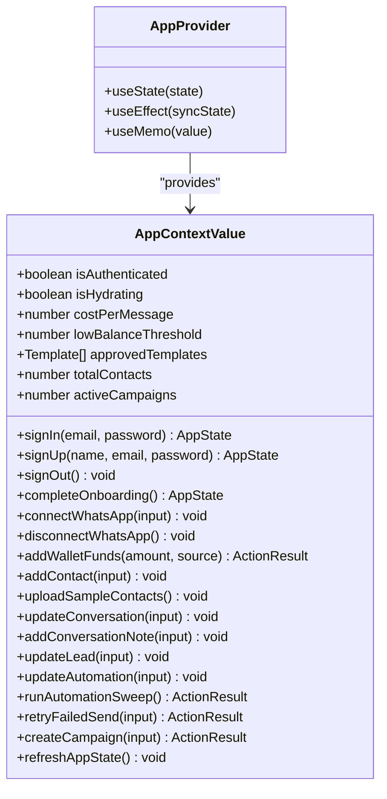
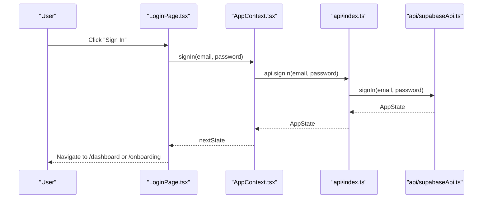
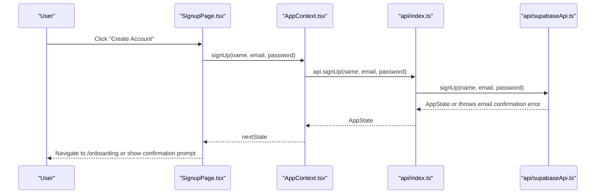
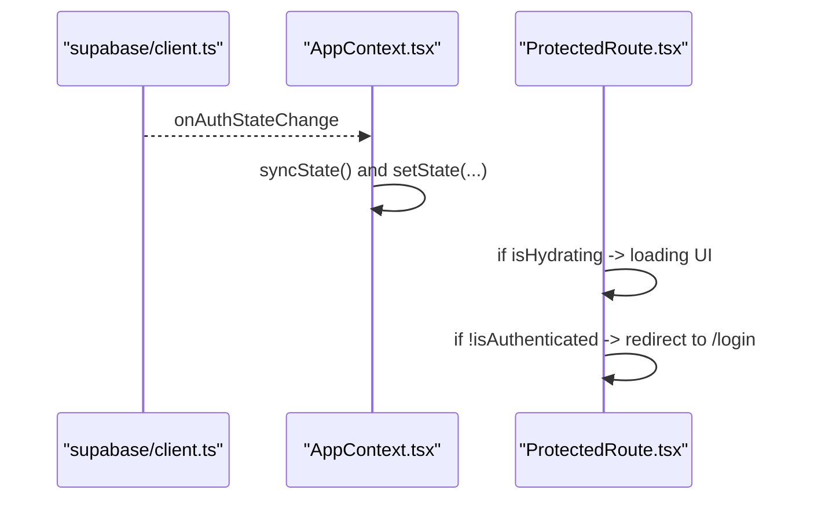
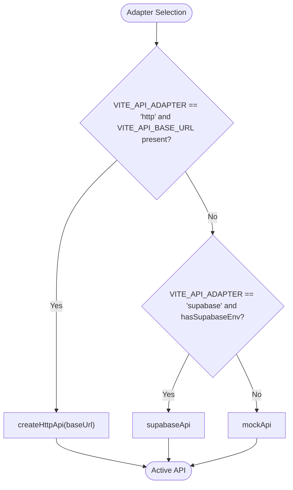
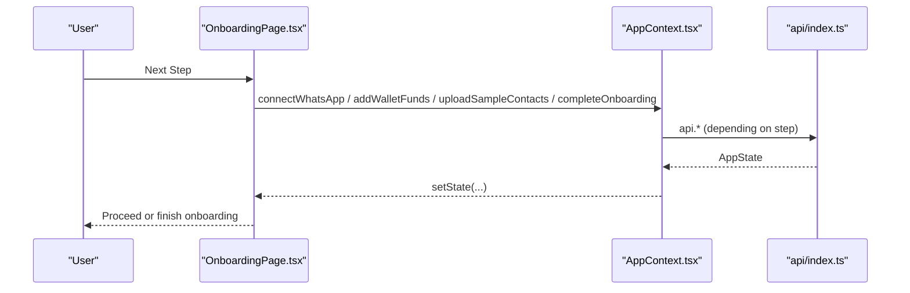
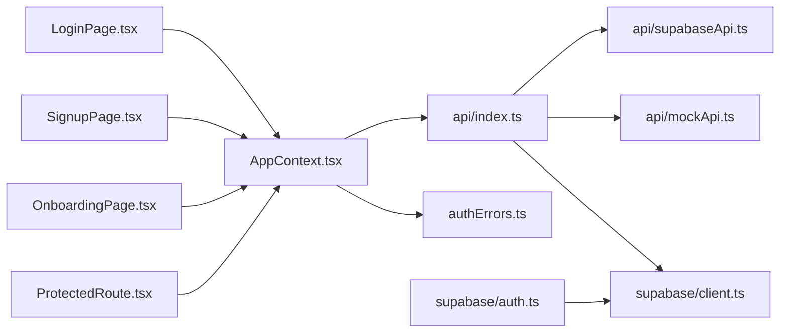

# User Management

<cite>
**Referenced Files in This Document**
- [AppContext.tsx](file://src/context/AppContext.tsx)
- [LoginPage.tsx](file://src/pages/LoginPage.tsx)
- [SignupPage.tsx](file://src/pages/SignupPage.tsx)
- [OnboardingPage.tsx](file://src/pages/OnboardingPage.tsx)
- [ProtectedRoute.tsx](file://src/components/ProtectedRoute.tsx)
- [useAppApi.ts](file://src/hooks/useAppApi.ts)
- [api/index.ts](file://src/lib/api/index.ts)
- [api/contracts.ts](file://src/lib/api/contracts.ts)
- [api/types.ts](file://src/lib/api/types.ts)
- [api/supabaseApi.ts](file://src/lib/api/supabaseApi.ts)
- [api/mockApi.ts](file://src/lib/api/mockApi.ts)
- [supabase/auth.ts](file://src/lib/supabase/auth.ts)
- [supabase/client.ts](file://src/lib/supabase/client.ts)
- [authErrors.ts](file://src/lib/authErrors.ts)
</cite>

## Table of Contents
1. [Introduction](#introduction)
2. [Project Structure](#project-structure)
3. [Core Components](#core-components)
4. [Architecture Overview](#architecture-overview)
5. [Detailed Component Analysis](#detailed-component-analysis)
6. [Dependency Analysis](#dependency-analysis)
7. [Performance Considerations](#performance-considerations)
8. [Troubleshooting Guide](#troubleshooting-guide)
9. [Conclusion](#conclusion)
10. [Appendices](#appendices)

## Introduction
This document explains the User Management system with a focus on authentication, session management, and user lifecycle. It covers how users register, log in, and maintain sessions, how the AppContext provider centralizes state and permissions, and how API integrations are structured for secure user operations. Practical workflows for registration, login, and session validation are included, along with security measures and troubleshooting guidance.

## Project Structure
The User Management system spans UI pages, a central AppContext provider, API adapters (HTTP, Supabase, Mock), and Supabase client configuration. Key areas:
- Pages: Login, Signup, Onboarding, ProtectedRoute
- Context: AppContext provider and hooks for API mutations
- API: Adapter selection, contracts, types, Supabase adapter, Mock adapter
- Supabase: Client initialization and Google OAuth integration

**Diagram sources**
- [LoginPage.tsx:1-158](file://src/pages/LoginPage.tsx#L1-L158)
- [SignupPage.tsx:1-144](file://src/pages/SignupPage.tsx#L1-L144)
- [OnboardingPage.tsx:1-245](file://src/pages/OnboardingPage.tsx#L1-L245)
- [ProtectedRoute.tsx:1-24](file://src/components/ProtectedRoute.tsx#L1-L24)
- [AppContext.tsx:1-193](file://src/context/AppContext.tsx#L1-L193)
- [useAppApi.ts:1-63](file://src/hooks/useAppApi.ts#L1-L63)
- [api/index.ts:1-23](file://src/lib/api/index.ts#L1-L23)
- [api/contracts.ts:1-156](file://src/lib/api/contracts.ts#L1-L156)
- [api/types.ts:1-299](file://src/lib/api/types.ts#L1-L299)
- [api/supabaseApi.ts:1-887](file://src/lib/api/supabaseApi.ts#L1-L887)
- [api/mockApi.ts:1-452](file://src/lib/api/mockApi.ts#L1-L452)
- [supabase/client.ts:1-16](file://src/lib/supabase/client.ts#L1-L16)
- [supabase/auth.ts:1-20](file://src/lib/supabase/auth.ts#L1-L20)
- [authErrors.ts:1-59](file://src/lib/authErrors.ts#L1-L59)

**Section sources**
- [AppContext.tsx:52-182](file://src/context/AppContext.tsx#L52-L182)
- [api/index.ts:13-23](file://src/lib/api/index.ts#L13-L23)

## Core Components
- AppContext provider: Centralizes user state, hydration, authentication actions, and derived metrics. It listens to Supabase auth state changes and synchronizes app state accordingly.
- Authentication pages: LoginPage and SignupPage orchestrate user input, call AppContext actions, and route users based on onboarding completion.
- ProtectedRoute: Guards routes until the user is authenticated and state is hydrated.
- API adapters: Adapter selection determines whether to use Supabase-backed APIs, HTTP backend, or a mock adapter. Contracts and types define request/response shapes.
- Supabase client: Initializes Supabase with session persistence and auto-refresh, and exposes Google OAuth integration.

**Section sources**
- [AppContext.tsx:23-182](file://src/context/AppContext.tsx#L23-L182)
- [LoginPage.tsx:13-41](file://src/pages/LoginPage.tsx#L13-L41)
- [SignupPage.tsx:13-55](file://src/pages/SignupPage.tsx#L13-L55)
- [ProtectedRoute.tsx:4-23](file://src/components/ProtectedRoute.tsx#L4-L23)
- [api/index.ts:18-23](file://src/lib/api/index.ts#L18-L23)
- [api/contracts.ts:10-62](file://src/lib/api/contracts.ts#L10-L62)
- [api/types.ts:8-211](file://src/lib/api/types.ts#L8-L211)
- [supabase/client.ts:8-15](file://src/lib/supabase/client.ts#L8-L15)

## Architecture Overview
The system supports multiple API adapters. The active adapter is chosen at runtime based on environment configuration. Supabase adapter integrates with Supabase Auth and database tables to build AppState. Mock adapter persists state locally for development/demo.

**Diagram sources**
- [LoginPage.tsx:20-41](file://src/pages/LoginPage.tsx#L20-L41)
- [AppContext.tsx:105-109](file://src/context/AppContext.tsx#L105-L109)
- [api/index.ts:18-23](file://src/lib/api/index.ts#L18-L23)
- [api/supabaseApi.ts:480-487](file://src/lib/api/supabaseApi.ts#L480-L487)
- [supabase/client.ts:8-15](file://src/lib/supabase/client.ts#L8-L15)

## Detailed Component Analysis

### AppContext Provider
Responsibilities:
- Hydrate app state on mount and on auth state changes
- Expose authentication actions (signIn, signUp, signOut)
- Derive computed values (isAuthenticated, counts, thresholds)
- Provide convenience actions for onboarding, WhatsApp connection, wallet top-ups, contacts, campaigns, and automation operations
- Refresh state via getAppState

**Diagram sources**
- [AppContext.tsx:23-48](file://src/context/AppContext.tsx#L23-L48)
- [AppContext.tsx:52-182](file://src/context/AppContext.tsx#L52-L182)

**Section sources**
- [AppContext.tsx:52-182](file://src/context/AppContext.tsx#L52-L182)

### Authentication Flow: Login
- LoginPage collects email/password, validates inputs, and calls AppContext.signIn
- AppContext.signIn delegates to api.signIn, which resolves to either Supabase or Mock adapter
- On success, the page navigates to dashboard or onboarding depending on onboarding state
- Error messages are normalized via getAuthErrorMessage

**Diagram sources**
- [LoginPage.tsx:20-41](file://src/pages/LoginPage.tsx#L20-L41)
- [AppContext.tsx:105-109](file://src/context/AppContext.tsx#L105-L109)
- [api/index.ts:18-23](file://src/lib/api/index.ts#L18-L23)
- [api/supabaseApi.ts:480-487](file://src/lib/api/supabaseApi.ts#L480-L487)

**Section sources**
- [LoginPage.tsx:13-41](file://src/pages/LoginPage.tsx#L13-L41)
- [authErrors.ts:1-59](file://src/lib/authErrors.ts#L1-L59)

### Authentication Flow: Registration
- SignupPage collects name, email, password, validates inputs, and calls AppContext.signUp
- If email confirmation is required, the UI redirects to login and prompts the user to check email
- Otherwise, errors are normalized and shown to the user

**Diagram sources**
- [SignupPage.tsx:25-55](file://src/pages/SignupPage.tsx#L25-L55)
- [AppContext.tsx:110-114](file://src/context/AppContext.tsx#L110-L114)
- [api/index.ts:18-23](file://src/lib/api/index.ts#L18-L23)
- [api/supabaseApi.ts:489-509](file://src/lib/api/supabaseApi.ts#L489-L509)

**Section sources**
- [SignupPage.tsx:13-55](file://src/pages/SignupPage.tsx#L13-L55)
- [authErrors.ts:16-18](file://src/lib/authErrors.ts#L16-L18)

### Session Management and Persistence
- Supabase client is initialized with session persistence and automatic token refresh
- AppContext listens to Supabase auth state changes and triggers state synchronization
- ProtectedRoute blocks navigation until hydration and authentication are resolved

**Diagram sources**
- [supabase/client.ts:8-15](file://src/lib/supabase/client.ts#L8-L15)
- [AppContext.tsx:78-87](file://src/context/AppContext.tsx#L78-L87)
- [ProtectedRoute.tsx:4-23](file://src/components/ProtectedRoute.tsx#L4-L23)

**Section sources**
- [supabase/client.ts:8-15](file://src/lib/supabase/client.ts#L8-L15)
- [AppContext.tsx:58-92](file://src/context/AppContext.tsx#L58-L92)
- [ProtectedRoute.tsx:4-23](file://src/components/ProtectedRoute.tsx#L4-L23)

### API Integration Patterns and Token Handling
- Adapter selection: http, supabase, or mock based on environment variables
- Supabase adapter:
  - Uses Supabase Auth for sign-in/sign-up/sign-out
  - Builds AppState by querying multiple tables and normalizing data
  - Handles optional tables and missing relations gracefully
- Mock adapter:
  - Persists state to localStorage
  - Provides deterministic demo behavior

**Diagram sources**
- [api/index.ts:13-23](file://src/lib/api/index.ts#L13-L23)
- [supabase/client.ts:6](file://src/lib/supabase/client.ts#L6)

**Section sources**
- [api/index.ts:18-23](file://src/lib/api/index.ts#L18-L23)
- [api/supabaseApi.ts:475-518](file://src/lib/api/supabaseApi.ts#L475-L518)
- [api/mockApi.ts:56-94](file://src/lib/api/mockApi.ts#L56-L94)

### User Lifecycle: Onboarding and Profile Management
- OnboardingPage guides users through connecting WhatsApp, adding wallet funds, and uploading sample contacts
- AppContext actions update AppState and persist changes via the active API adapter
- After onboarding completion, users are redirected to the dashboard

**Diagram sources**
- [OnboardingPage.tsx:47-91](file://src/pages/OnboardingPage.tsx#L47-L91)
- [AppContext.tsx:124-127](file://src/context/AppContext.tsx#L124-L127)
- [AppContext.tsx:132-136](file://src/context/AppContext.tsx#L132-L136)
- [AppContext.tsx:141-144](file://src/context/AppContext.tsx#L141-L144)
- [AppContext.tsx:119-123](file://src/context/AppContext.tsx#L119-L123)

**Section sources**
- [OnboardingPage.tsx:27-91](file://src/pages/OnboardingPage.tsx#L27-L91)
- [AppContext.tsx:119-123](file://src/context/AppContext.tsx#L119-L123)

### Role-Based Permissions and Profile Management
- Supabase adapter derives workspace context from the authenticated user and enforces row-level access patterns
- Workspace defaults (templates, automation rules) are ensured during state build
- Profile updates (e.g., onboarding completion) are performed via Supabase tables

**Section sources**
- [api/supabaseApi.ts:104-133](file://src/lib/api/supabaseApi.ts#L104-L133)
- [api/supabaseApi.ts:135-193](file://src/lib/api/supabaseApi.ts#L135-L193)
- [api/supabaseApi.ts:520-531](file://src/lib/api/supabaseApi.ts#L520-L531)

### Security Measures
- Supabase Auth integration with persistent sessions and token auto-refresh
- Email confirmation requirement surfaced to users during sign-up
- Graceful handling of missing tables and RLS policies with actionable messages
- Normalized error messaging for invalid credentials, permission denials, and incomplete setups

**Section sources**
- [supabase/client.ts:8-15](file://src/lib/supabase/client.ts#L8-L15)
- [api/supabaseApi.ts:489-509](file://src/lib/api/supabaseApi.ts#L489-L509)
- [authErrors.ts:8-41](file://src/lib/authErrors.ts#L8-L41)

## Dependency Analysis
- UI pages depend on AppContext for authentication and state
- AppContext depends on the active API adapter
- API adapter selection depends on environment variables and Supabase availability
- Supabase adapter depends on Supabase client and database schema
- Error handling utilities normalize messages for user feedback

**Diagram sources**
- [LoginPage.tsx:18](file://src/pages/LoginPage.tsx#L18)
- [SignupPage.tsx:19](file://src/pages/SignupPage.tsx#L19)
- [OnboardingPage.tsx:40](file://src/pages/OnboardingPage.tsx#L40)
- [ProtectedRoute.tsx:5](file://src/components/ProtectedRoute.tsx#L5)
- [AppContext.tsx:2,10:2-10](file://src/context/AppContext.tsx#L2-L10)
- [api/index.ts:1-12](file://src/lib/api/index.ts#L1-L12)
- [supabase/client.ts:1-16](file://src/lib/supabase/client.ts#L1-L16)
- [supabase/auth.ts:1-20](file://src/lib/supabase/auth.ts#L1-L20)
- [authErrors.ts:1-59](file://src/lib/authErrors.ts#L1-L59)

**Section sources**
- [api/index.ts:13-23](file://src/lib/api/index.ts#L13-L23)
- [supabase/client.ts:8-15](file://src/lib/supabase/client.ts#L8-L15)

## Performance Considerations
- Supabase adapter fetches multiple tables concurrently; ensure database indexing on workspace_id and foreign keys
- Local storage usage in mock adapter scales with AppState size; avoid excessive growth of logs and large arrays
- React Query hooks cache AppState; tune staleTime appropriately for real-time needs
- Auth state change subscriptions should be cleaned up to prevent memory leaks

[No sources needed since this section provides general guidance]

## Troubleshooting Guide
Common issues and resolutions:
- Email confirmation required after sign-up: The system surfaces a specific message guiding users to check email and sign in after confirmation.
- Invalid login credentials: Normalized message indicates incorrect email or password.
- Permission denied or RLS policy missing: Indicates missing database policies or incomplete schema setup.
- Workspace tables not initialized: Suggests missing CRM tables; run the latest upgrade SQL.
- Supabase not configured: Missing environment variables cause adapter fallback to mock; configure VITE_SUPABASE_URL and VITE_SUPABASE_ANON_KEY.

**Section sources**
- [authErrors.ts:12-41](file://src/lib/authErrors.ts#L12-L41)
- [api/supabaseApi.ts:43-58](file://src/lib/api/supabaseApi.ts#L43-L58)
- [api/index.ts:60-66](file://src/lib/api/index.ts#L60-L66)

## Conclusion
The User Management system provides a robust, adapter-driven authentication and state management layer. It supports secure Supabase-backed operations with session persistence and clear error messaging, while offering a convenient mock adapter for development. The AppContext provider centralizes user lifecycle operations, and ProtectedRoute ensures secure routing. Following the recommended patterns and troubleshooting steps will help maintain a reliable and user-friendly experience.

[No sources needed since this section summarizes without analyzing specific files]

## Appendices

### Practical Examples

- User Registration Workflow
  - Input collection: name, email, password
  - Call AppContext.signUp
  - Handle email confirmation requirement and navigate to login
  - On success, redirect to onboarding or dashboard

  **Section sources**
  - [SignupPage.tsx:25-55](file://src/pages/SignupPage.tsx#L25-L55)
  - [AppContext.tsx:110-114](file://src/context/AppContext.tsx#L110-L114)

- Login Process
  - Input collection: email, password
  - Call AppContext.signIn
  - Navigate to dashboard or onboarding based on onboarding state

  **Section sources**
  - [LoginPage.tsx:20-41](file://src/pages/LoginPage.tsx#L20-L41)
  - [AppContext.tsx:105-109](file://src/context/AppContext.tsx#L105-L109)

- Session Validation
  - Supabase auth state changes trigger state sync
  - ProtectedRoute prevents navigation until hydration and authentication are ready

  **Section sources**
  - [AppContext.tsx:78-87](file://src/context/AppContext.tsx#L78-L87)
  - [ProtectedRoute.tsx:4-23](file://src/components/ProtectedRoute.tsx#L4-L23)

### API Contracts Reference
- Routes: session, signup, signout, onboarding, app-state, whatsapp connect/disconnect, wallet top-up, contacts, campaigns
- Types: AppState, User, WhatsAppConnection, Contact, Template, Campaign, Transaction, Conversation, Lead, AutomationRule, ActionResult

**Section sources**
- [api/contracts.ts:10-62](file://src/lib/api/contracts.ts#L10-L62)
- [api/types.ts:8-211](file://src/lib/api/types.ts#L8-L211)