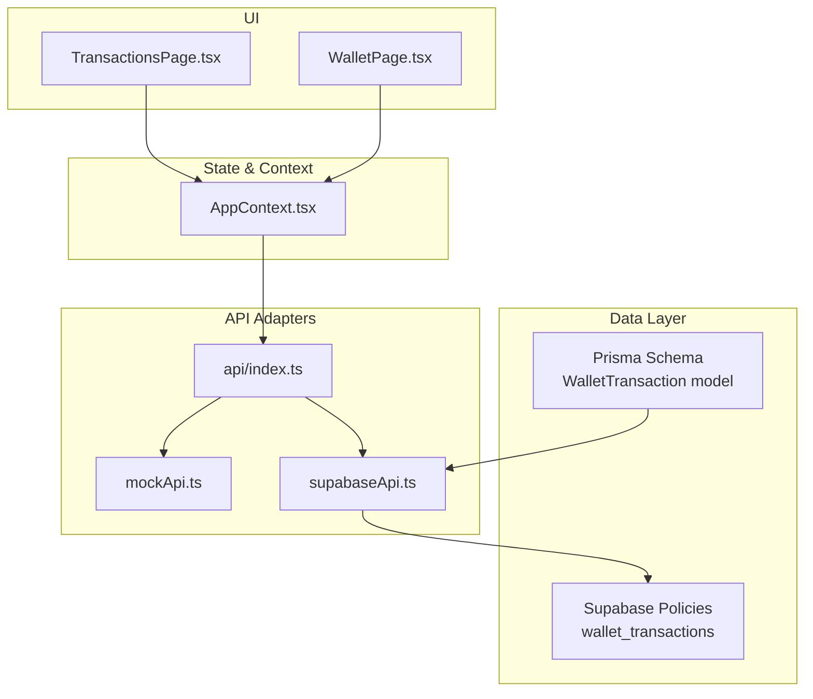
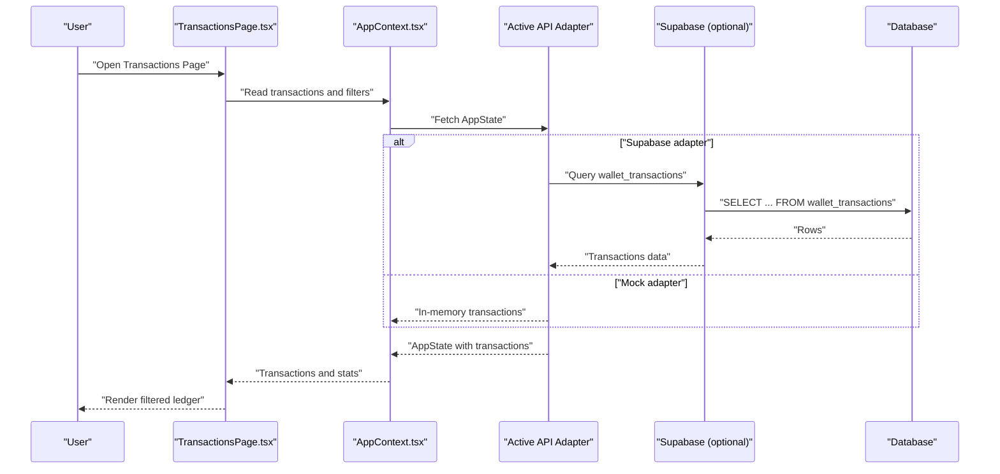
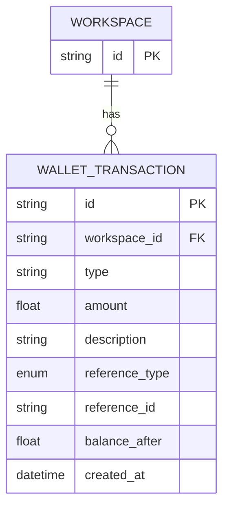
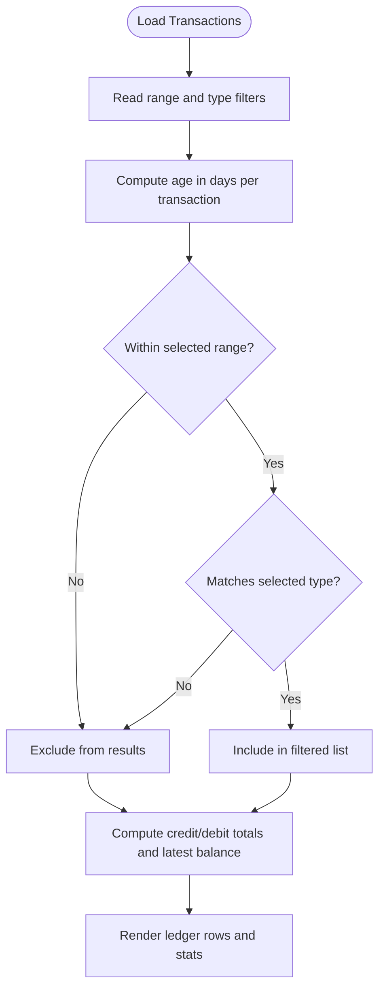
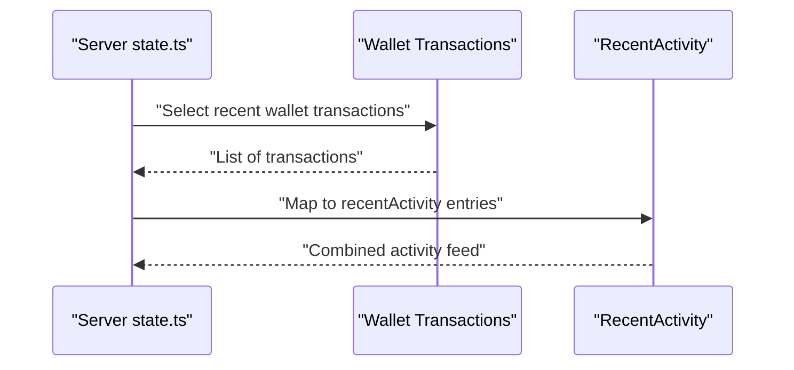
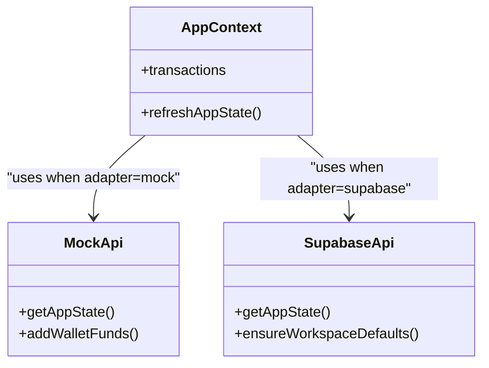
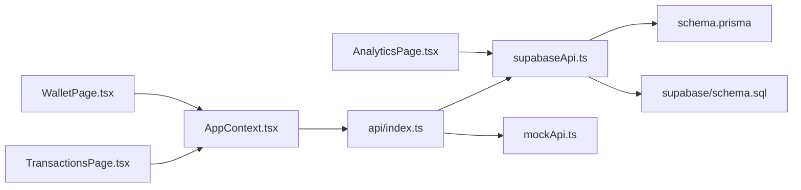

# Transaction History

<cite>
**Referenced Files in This Document**
- [TransactionsPage.tsx](file://src/pages/TransactionsPage.tsx)
- [WalletPage.tsx](file://src/pages/WalletPage.tsx)
- [AppContext.tsx](file://src/context/AppContext.tsx)
- [schema.prisma](file://prisma/schema.prisma)
- [supabase/schema.sql](file://supabase/schema.sql)
- [supabaseApi.ts](file://src/lib/api/supabaseApi.ts)
- [mockApi.ts](file://src/lib/api/mockApi.ts)
- [index.ts](file://src/lib/api/index.ts)
- [state.ts](file://server/state.ts)
- [AnalyticsPage.tsx](file://src/pages/AnalyticsPage.tsx)
</cite>

## Table of Contents
1. [Introduction](#introduction)
2. [Project Structure](#project-structure)
3. [Core Components](#core-components)
4. [Architecture Overview](#architecture-overview)
5. [Detailed Component Analysis](#detailed-component-analysis)
6. [Dependency Analysis](#dependency-analysis)
7. [Performance Considerations](#performance-considerations)
8. [Troubleshooting Guide](#troubleshooting-guide)
9. [Conclusion](#conclusion)
10. [Appendices](#appendices)

## Introduction
This document describes the Transaction History system responsible for recording, categorizing, filtering, and reporting wallet movements. It covers transaction types (credits, debits), metadata (description, amount, balance, timestamps), and status tracking. It also documents filtering/search capabilities, export functionality, validation and duplicate detection, reconciliation processes, archiving and retention, compliance, and integration with accounting/reporting systems.

## Project Structure
The Transaction History system spans UI pages, state management, Prisma schema, Supabase policies, and API adapters:
- UI pages render transaction lists and summaries, and expose filters.
- AppContext provides shared state and API accessors.
- Prisma defines the WalletTransaction model and enums.
- Supabase policies enforce per-workspace access to wallet transactions.
- API adapters (mock, Supabase) supply transaction data and implement operations.

**Diagram sources**
- [TransactionsPage.tsx](file://src/pages/TransactionsPage.tsx)
- [WalletPage.tsx](file://src/pages/WalletPage.tsx)
- [AppContext.tsx](file://src/context/AppContext.tsx)
- [schema.prisma](file://prisma/schema.prisma)
- [supabase/schema.sql](file://supabase/schema.sql)
- [index.ts](file://src/lib/api/index.ts)
- [mockApi.ts](file://src/lib/api/mockApi.ts)
- [supabaseApi.ts](file://src/lib/api/supabaseApi.ts)

**Section sources**
- [TransactionsPage.tsx](file://src/pages/TransactionsPage.tsx)
- [AppContext.tsx](file://src/context/AppContext.tsx)
- [schema.prisma](file://prisma/schema.prisma)
- [supabase/schema.sql](file://supabase/schema.sql)
- [index.ts](file://src/lib/api/index.ts)

## Core Components
- Transaction model and metadata:
  - Fields include id, workspaceId, type, amount, description, referenceType, referenceId, balanceAfter, createdAt.
  - Enumerated reference types include manual top-up, campaign send, and adjustment.
- UI pages:
  - TransactionsPage renders a filtered ledger with totals and recent activity.
  - WalletPage displays recent transactions and balances.
- State and API:
  - AppContext exposes transactions and refresh mechanisms.
  - API adapters (mock/Supa base) provide transaction data and operations.
- Filtering and search:
  - Date range windows and transaction type filters.
  - Sorting and pagination are implicit via frontend rendering.

Key implementation references:
- Transaction model definition and enums: [schema.prisma](file://prisma/schema.prisma)
- Ledger page UI and filters: [TransactionsPage.tsx](file://src/pages/TransactionsPage.tsx)
- Recent transactions display: [WalletPage.tsx](file://src/pages/WalletPage.tsx)
- State and transactions access: [AppContext.tsx](file://src/context/AppContext.tsx)
- API selection and adapters: [index.ts](file://src/lib/api/index.ts), [mockApi.ts](file://src/lib/api/mockApi.ts), [supabaseApi.ts](file://src/lib/api/supabaseApi.ts)

**Section sources**
- [schema.prisma](file://prisma/schema.prisma)
- [TransactionsPage.tsx](file://src/pages/TransactionsPage.tsx)
- [WalletPage.tsx](file://src/pages/WalletPage.tsx)
- [AppContext.tsx](file://src/context/AppContext.tsx)
- [index.ts](file://src/lib/api/index.ts)
- [mockApi.ts](file://src/lib/api/mockApi.ts)
- [supabaseApi.ts](file://src/lib/api/supabaseApi.ts)

## Architecture Overview
The system follows a layered architecture:
- Presentation: React pages (TransactionsPage, WalletPage) consume AppContext.
- State: AppContext hydrates AppState from the active API adapter.
- Data: Prisma schema models WalletTransaction; Supabase policies secure access.
- Access: API adapters (mock or Supabase) supply transaction data and implement operations.

**Diagram sources**
- [TransactionsPage.tsx](file://src/pages/TransactionsPage.tsx)
- [AppContext.tsx](file://src/context/AppContext.tsx)
- [index.ts](file://src/lib/api/index.ts)
- [supabaseApi.ts](file://src/lib/api/supabaseApi.ts)
- [schema.prisma](file://prisma/schema.prisma)
- [supabase/schema.sql](file://supabase/schema.sql)

## Detailed Component Analysis

### Transaction Model and Metadata
- Fields:
  - id, workspaceId, type, amount, description, referenceType, referenceId, balanceAfter, createdAt.
- Enums:
  - WalletReferenceType includes manual_topup, campaign_send, adjustment.
- Timestamps:
  - createdAt is managed by the backend; frontend surfaces dates for display.
- Status tracking:
  - No explicit status field; status can be inferred from type and referenceType.

**Diagram sources**
- [schema.prisma](file://prisma/schema.prisma)

**Section sources**
- [schema.prisma](file://prisma/schema.prisma)

### UI Ledger: Filtering, Search, and Display
- Filters:
  - Date range windows: all, 7, 30, 90 days.
  - Transaction type: all, credit, debit.
- Computed metrics:
  - Credit total, debit total, latest balance derived from filtered transactions.
- Rendering:
  - Responsive grid with description, date, type, and amount.
  - Color-coded amounts and icons for credit/debit.

**Diagram sources**
- [TransactionsPage.tsx](file://src/pages/TransactionsPage.tsx)

**Section sources**
- [TransactionsPage.tsx](file://src/pages/TransactionsPage.tsx)

### Recent Activity and Balances
- Recent transactions display:
  - WalletPage shows recent entries with amount and balance-after.
- Recent activity aggregation:
  - Server-side recentActivity combines campaigns and wallet transactions.

**Diagram sources**
- [state.ts](file://server/state.ts)

**Section sources**
- [WalletPage.tsx](file://src/pages/WalletPage.tsx)
- [state.ts](file://server/state.ts)

### API Adapters and Data Access
- Active adapter selection:
  - Based on environment variables, chooses mock, HTTP, or Supabase.
- Supabase adapter:
  - Queries wallet_transactions for the workspace.
  - Aggregates totals and recent activity.
- Mock adapter:
  - Provides in-memory transactions for development/demo.

**Diagram sources**
- [AppContext.tsx](file://src/context/AppContext.tsx)
- [index.ts](file://src/lib/api/index.ts)
- [mockApi.ts](file://src/lib/api/mockApi.ts)
- [supabaseApi.ts](file://src/lib/api/supabaseApi.ts)

**Section sources**
- [index.ts](file://src/lib/api/index.ts)
- [mockApi.ts](file://src/lib/api/mockApi.ts)
- [supabaseApi.ts](file://src/lib/api/supabaseApi.ts)

### Compliance and Access Control
- Supabase policies:
  - Enforce workspace-scoped access to wallet_transactions.
- Implication:
  - All transaction queries are scoped to the authenticated workspace.

**Section sources**
- [supabase/schema.sql](file://supabase/schema.sql)

### Reporting and Analytics Integration
- Analytics page computes spend-derived metrics using totalSpent from transactions.
- Integration:
  - Analytics consumes the same transaction dataset used by the ledger.

**Section sources**
- [AnalyticsPage.tsx](file://src/pages/AnalyticsPage.tsx)
- [supabaseApi.ts](file://src/lib/api/supabaseApi.ts)

## Dependency Analysis
- UI depends on AppContext for transactions and filters.
- AppContext selects the active API adapter.
- Supabase adapter depends on Prisma schema and Supabase policies.
- Analytics depends on transaction data for reporting.

**Diagram sources**
- [TransactionsPage.tsx](file://src/pages/TransactionsPage.tsx)
- [WalletPage.tsx](file://src/pages/WalletPage.tsx)
- [AppContext.tsx](file://src/context/AppContext.tsx)
- [index.ts](file://src/lib/api/index.ts)
- [supabaseApi.ts](file://src/lib/api/supabaseApi.ts)
- [mockApi.ts](file://src/lib/api/mockApi.ts)
- [schema.prisma](file://prisma/schema.prisma)
- [supabase/schema.sql](file://supabase/schema.sql)
- [AnalyticsPage.tsx](file://src/pages/AnalyticsPage.tsx)

**Section sources**
- [TransactionsPage.tsx](file://src/pages/TransactionsPage.tsx)
- [AppContext.tsx](file://src/context/AppContext.tsx)
- [index.ts](file://src/lib/api/index.ts)
- [supabaseApi.ts](file://src/lib/api/supabaseApi.ts)
- [mockApi.ts](file://src/lib/api/mockApi.ts)
- [schema.prisma](file://prisma/schema.prisma)
- [supabase/schema.sql](file://supabase/schema.sql)
- [AnalyticsPage.tsx](file://src/pages/AnalyticsPage.tsx)

## Performance Considerations
- Frontend filtering:
  - Filtering and totals are computed client-side; performance scales with transaction volume.
- Pagination:
  - Current UI renders all filtered transactions; consider virtualized lists or server-side pagination for large datasets.
- Data freshness:
  - AppContext refreshes state periodically; ensure appropriate intervals for real-time needs.
- Database queries:
  - Supabase queries should leverage workspace scoping and indexes on frequently filtered columns (e.g., created_at, workspace_id).

## Troubleshooting Guide
- Missing Supabase configuration:
  - Ensure environment variables for Supabase are set; otherwise, adapter falls back to mock.
- Workspace access errors:
  - Verify Supabase policies for wallet_transactions are applied and active.
- Empty transaction list:
  - Confirm adapter is returning data; check mock vs. Supabase behavior.
- Duplicate detection:
  - No explicit duplicate detection logic exists; implement idempotency keys or deduplication at ingestion points if needed.
- Export functionality:
  - Not present in current UI; implement CSV/PDF exports by adding handlers that serialize filtered transactions.

**Section sources**
- [index.ts](file://src/lib/api/index.ts)
- [supabase/schema.sql](file://supabase/schema.sql)
- [TransactionsPage.tsx](file://src/pages/TransactionsPage.tsx)

## Conclusion
The Transaction History system provides a clear ledger of wallet movements with robust filtering, totals, and recent activity. The design cleanly separates presentation, state, and data access, enabling easy extension for export, advanced analytics, and compliance controls.

## Appendices

### Transaction Types and Categorization
- Credits:
  - Manual top-ups and similar inflows.
- Debits:
  - Campaign sends and related deductions.
- Adjustments:
  - Manual adjustments via referenceType.

**Section sources**
- [schema.prisma](file://prisma/schema.prisma)

### Practical Examples

- Transaction queries
  - Filter by date range and type:
    - Use TransactionsPage filters to narrow results.
  - Aggregate totals:
    - Credit total and debit total computed from filtered transactions.
  - Latest balance:
    - Derived from the most recent transaction’s balanceAfter.

- Batch operations
  - Add funds:
    - Use addWalletFunds via AppContext to create a credit transaction and update balance.
  - Retry failed sends:
    - Use retryFailedSend to reattempt failed operations; this updates operational logs and may create new transactions depending on implementation.

- Reconciliation processes
  - Compare reported totals (credit/debit) with external systems.
  - Use referenceType to reconcile manual_topup, campaign_send, and adjustment entries.

- Validation and duplicate detection
  - Validate amount positivity and type enumeration.
  - Implement idempotency checks at ingestion points to prevent duplicates.

- Archiving and retention
  - Retention policies should be enforced at the database layer; archive old records to separate storage if needed.
  - Ensure compliance with local regulations for financial records retention.

- Accounting and reporting integrations
  - Export filtered transactions for accounting systems.
  - Map referenceType to accounting categories for automated posting.

**Section sources**
- [TransactionsPage.tsx](file://src/pages/TransactionsPage.tsx)
- [AppContext.tsx](file://src/context/AppContext.tsx)
- [mockApi.ts](file://src/lib/api/mockApi.ts)
- [supabaseApi.ts](file://src/lib/api/supabaseApi.ts)
- [AnalyticsPage.tsx](file://src/pages/AnalyticsPage.tsx)