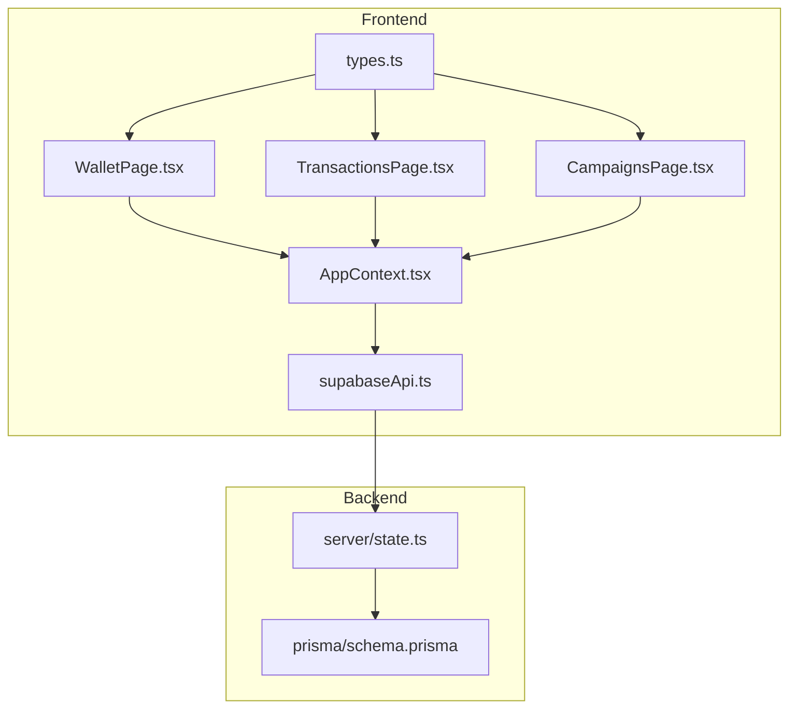
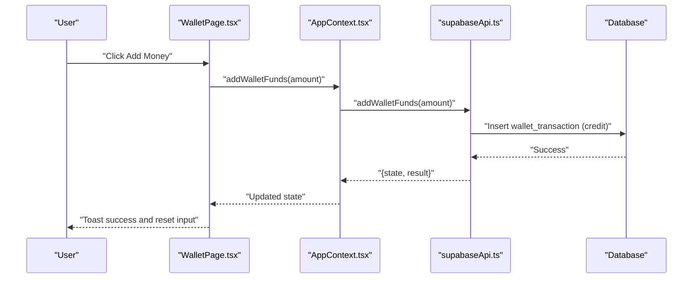
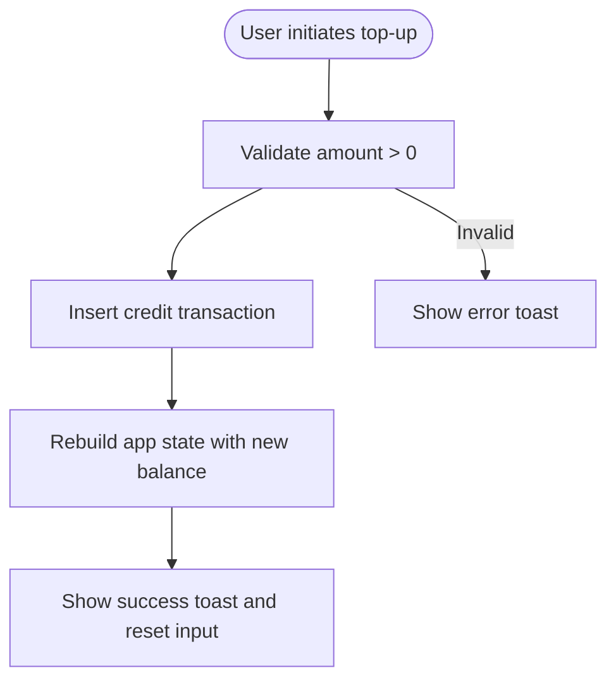
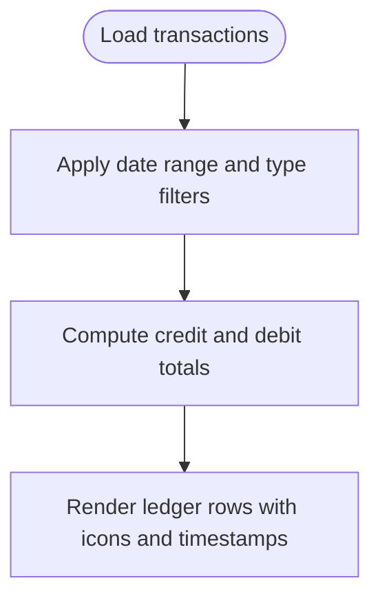
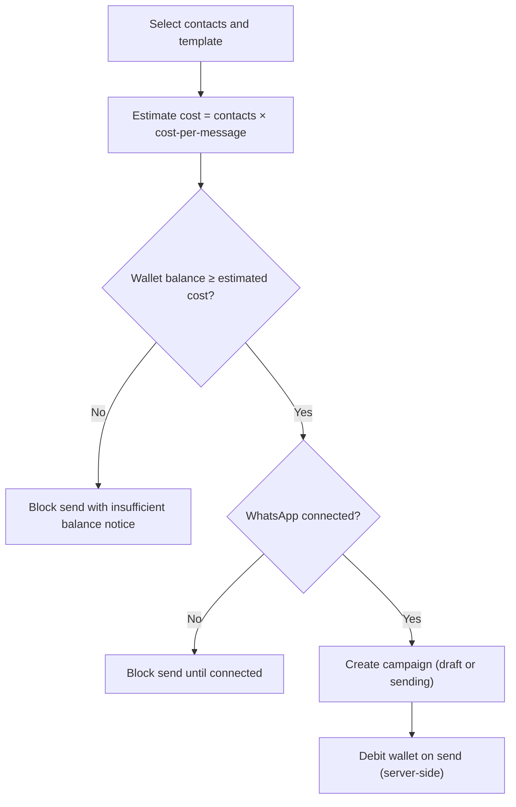
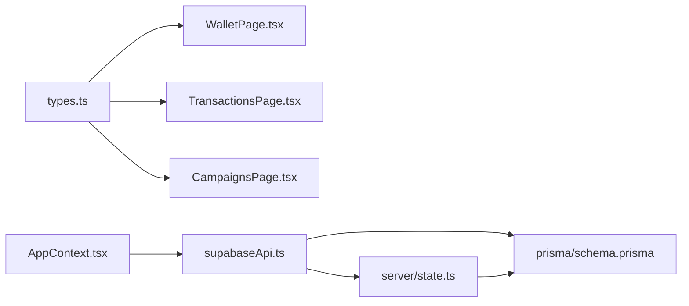

# Wallet & Billing

<cite>
**Referenced Files in This Document**
- [WalletPage.tsx](file://src/pages/WalletPage.tsx)
- [TransactionsPage.tsx](file://src/pages/TransactionsPage.tsx)
- [CampaignsPage.tsx](file://src/pages/CampaignsPage.tsx)
- [AppContext.tsx](file://src/context/AppContext.tsx)
- [types.ts](file://src/lib/api/types.ts)
- [supabaseApi.ts](file://src/lib/api/supabaseApi.ts)
- [state.ts](file://server/state.ts)
- [schema.prisma](file://prisma/schema.prisma)
- [HomePage.tsx](file://src/pages/HomePage.tsx)
- [AnalyticsPage.tsx](file://src/pages/AnalyticsPage.tsx)
- [SettingsPage.tsx](file://src/pages/SettingsPage.tsx)
</cite>

## Table of Contents
1. [Introduction](#introduction)
2. [Project Structure](#project-structure)
3. [Core Components](#core-components)
4. [Architecture Overview](#architecture-overview)
5. [Detailed Component Analysis](#detailed-component-analysis)
6. [Dependency Analysis](#dependency-analysis)
7. [Performance Considerations](#performance-considerations)
8. [Troubleshooting Guide](#troubleshooting-guide)
9. [Conclusion](#conclusion)
10. [Appendices](#appendices)

## Introduction
This document explains the Wallet and Billing system with a focus on wallet management, transaction history, payment processing, cost tracking, and billing-related workflows. It covers:
- Wallet system: balance management, top-up mechanisms, spending limits, and currency handling
- Transaction processing: payment methods, refund procedures, dispute resolution, and audit trails
- Cost tracking: per-message pricing, campaign costs, subscription fees, and usage-based billing
- Practical examples: wallet top-ups, payment processing workflows, and cost optimization strategies
- Billing system: invoice generation, recurring payments, subscription management, and tax calculations
- Financial reporting, reconciliation processes, and compliance requirements
- Guidance on budget management, cost control measures, and financial planning for business optimization

## Project Structure
The Wallet and Billing system spans frontend pages, shared types, and backend state management:
- Frontend pages for wallet and transactions
- Shared constants and types for cost-per-message and thresholds
- API adapters for state hydration and wallet operations
- Server-side state builder for seeding and building app state
- Database schema modeling wallet transactions and related entities

**Diagram sources**
- [WalletPage.tsx:1-169](file://src/pages/WalletPage.tsx#L1-L169)
- [TransactionsPage.tsx:1-214](file://src/pages/TransactionsPage.tsx#L1-L214)
- [CampaignsPage.tsx:1-557](file://src/pages/CampaignsPage.tsx#L1-L557)
- [AppContext.tsx:1-239](file://src/context/AppContext.tsx#L1-L239)
- [types.ts:1-375](file://src/lib/api/types.ts#L1-L375)
- [supabaseApi.ts:1-800](file://src/lib/api/supabaseApi.ts#L1-L800)
- [state.ts:1-452](file://server/state.ts#L1-L452)
- [schema.prisma:1-279](file://prisma/schema.prisma#L1-L279)

**Section sources**
- [WalletPage.tsx:1-169](file://src/pages/WalletPage.tsx#L1-L169)
- [TransactionsPage.tsx:1-214](file://src/pages/TransactionsPage.tsx#L1-L214)
- [CampaignsPage.tsx:1-557](file://src/pages/CampaignsPage.tsx#L1-L557)
- [AppContext.tsx:1-239](file://src/context/AppContext.tsx#L1-L239)
- [types.ts:1-375](file://src/lib/api/types.ts#L1-L375)
- [supabaseApi.ts:1-800](file://src/lib/api/supabaseApi.ts#L1-L800)
- [state.ts:1-452](file://server/state.ts#L1-L452)
- [schema.prisma:1-279](file://prisma/schema.prisma#L1-L279)

## Core Components
- Wallet page: displays current balance, total spent, messages sent, recent transactions, and allows adding money via top-ups
- Transactions page: filters and aggregates credits/debits, shows totals and ledger balance
- Campaigns page: estimates cost per message, validates wallet balance before sending, and shows low-balance warnings
- App context: exposes wallet state, cost-per-message constant, and low-balance threshold
- Types: defines constants for cost-per-message and low-balance threshold
- Supabase API: adds wallet funds and builds app state from database queries
- Server state: seeds wallet transactions and builds app state for mock server
- Database schema: models wallet transactions and related enums

**Section sources**
- [WalletPage.tsx:1-169](file://src/pages/WalletPage.tsx#L1-L169)
- [TransactionsPage.tsx:1-214](file://src/pages/TransactionsPage.tsx#L1-L214)
- [CampaignsPage.tsx:1-557](file://src/pages/CampaignsPage.tsx#L1-L557)
- [AppContext.tsx:1-239](file://src/context/AppContext.tsx#L1-L239)
- [types.ts:1-375](file://src/lib/api/types.ts#L1-L375)
- [supabaseApi.ts:1-800](file://src/lib/api/supabaseApi.ts#L1-L800)
- [state.ts:1-452](file://server/state.ts#L1-L452)
- [schema.prisma:1-279](file://prisma/schema.prisma#L1-L279)

## Architecture Overview
The Wallet and Billing system integrates frontend UI with backend state and persistence:
- Frontend pages consume shared types and constants
- App context orchestrates state hydration and exposes actions like adding wallet funds
- Supabase API performs wallet top-ups and constructs app state from database queries
- Server state seeds wallet transactions and builds app state for mock usage
- Database schema defines wallet transaction model and related enums

**Diagram sources**
- [WalletPage.tsx:27-37](file://src/pages/WalletPage.tsx#L27-L37)
- [AppContext.tsx:138-142](file://src/context/AppContext.tsx#L138-L142)
- [supabaseApi.ts:578-599](file://src/lib/api/supabaseApi.ts#L578-L599)

**Section sources**
- [WalletPage.tsx:1-169](file://src/pages/WalletPage.tsx#L1-L169)
- [AppContext.tsx:1-239](file://src/context/AppContext.tsx#L1-L239)
- [supabaseApi.ts:1-800](file://src/lib/api/supabaseApi.ts#L1-L800)

## Detailed Component Analysis

### Wallet Management
- Balance management: current balance, total spent, and messages sent are derived from wallet transactions
- Top-up mechanism: users enter an amount and submit; the system inserts a credit transaction and updates the balance
- Spending limits: campaign creation checks wallet balance against estimated cost and blocks sends when insufficient
- Currency handling: currency is modeled as INR in schema and types; UI displays amounts in Rupees

**Diagram sources**
- [supabaseApi.ts:578-599](file://src/lib/api/supabaseApi.ts#L578-L599)
- [WalletPage.tsx:27-37](file://src/pages/WalletPage.tsx#L27-L37)

**Section sources**
- [WalletPage.tsx:1-169](file://src/pages/WalletPage.tsx#L1-L169)
- [supabaseApi.ts:578-599](file://src/lib/api/supabaseApi.ts#L578-L599)
- [types.ts:1-375](file://src/lib/api/types.ts#L1-L375)
- [schema.prisma:15-17](file://prisma/schema.prisma#L15-L17)

### Transaction History
- Ledger filters: date range and transaction type filtering
- Totals computation: sums of credits and debits for filtered views
- Audit trail: each transaction includes description, amount, and balance-after

**Diagram sources**
- [TransactionsPage.tsx:26-50](file://src/pages/TransactionsPage.tsx#L26-L50)
- [TransactionsPage.tsx:155-207](file://src/pages/TransactionsPage.tsx#L155-L207)

**Section sources**
- [TransactionsPage.tsx:1-214](file://src/pages/TransactionsPage.tsx#L1-L214)

### Payment Processing and Campaign Costs
- Per-message pricing: constant cost-per-message drives cost estimation
- Estimated spend: computed as contacts × cost-per-message
- Balance after send: computed as wallet balance minus estimated cost
- Send gating: campaign send is blocked if wallet balance is insufficient or WhatsApp is not connected

**Diagram sources**
- [CampaignsPage.tsx:70-72](file://src/pages/CampaignsPage.tsx#L70-L72)
- [CampaignsPage.tsx:430-448](file://src/pages/CampaignsPage.tsx#L430-L448)
- [types.ts:2-3](file://src/lib/api/types.ts#L2-L3)

**Section sources**
- [CampaignsPage.tsx:1-557](file://src/pages/CampaignsPage.tsx#L1-L557)
- [types.ts:1-375](file://src/lib/api/types.ts#L1-L375)

### Billing Alerts and Thresholds
- Low balance threshold: constant defines when to show low reserve warnings
- UI warnings: both wallet and campaigns pages surface warnings when balance is below threshold
- Budget management: operators can proactively top up before sending larger campaigns

**Section sources**
- [types.ts:2-3](file://src/lib/api/types.ts#L2-L3)
- [WalletPage.tsx:78-86](file://src/pages/WalletPage.tsx#L78-L86)
- [CampaignsPage.tsx:420-428](file://src/pages/CampaignsPage.tsx#L420-L428)

### Financial Reporting and Reconciliation
- Spend metrics: total spent aggregated from debit transactions
- Outcome metrics: cost per lead and cost per qualified/won lead computed from CRM data
- Reconciliation: ledger view shows incoming funds and recorded spends for audit

**Section sources**
- [supabaseApi.ts:272-277](file://src/lib/api/supabaseApi.ts#L272-L277)
- [AnalyticsPage.tsx:50-79](file://src/pages/AnalyticsPage.tsx#L50-L79)
- [TransactionsPage.tsx:97-101](file://src/pages/TransactionsPage.tsx#L97-L101)

### Compliance and Controls
- Meta connection and authorization status: settings page surfaces connection trust and authorization state
- Future modules: reserved surfaces for API access and integrations

**Section sources**
- [SettingsPage.tsx:1-252](file://src/pages/SettingsPage.tsx#L1-L252)

## Dependency Analysis
The Wallet and Billing system exhibits clear separation of concerns:
- Frontend pages depend on shared types and constants
- App context depends on API adapter for state hydration and actions
- Supabase API depends on database schema and constructs app state
- Server state depends on Prisma models and seeds data for mock usage

**Diagram sources**
- [types.ts:1-375](file://src/lib/api/types.ts#L1-L375)
- [WalletPage.tsx:1-169](file://src/pages/WalletPage.tsx#L1-L169)
- [TransactionsPage.tsx:1-214](file://src/pages/TransactionsPage.tsx#L1-L214)
- [CampaignsPage.tsx:1-557](file://src/pages/CampaignsPage.tsx#L1-L557)
- [AppContext.tsx:1-239](file://src/context/AppContext.tsx#L1-L239)
- [supabaseApi.ts:1-800](file://src/lib/api/supabaseApi.ts#L1-L800)
- [state.ts:1-452](file://server/state.ts#L1-L452)
- [schema.prisma:1-279](file://prisma/schema.prisma#L1-L279)

**Section sources**
- [types.ts:1-375](file://src/lib/api/types.ts#L1-L375)
- [AppContext.tsx:1-239](file://src/context/AppContext.tsx#L1-L239)
- [supabaseApi.ts:1-800](file://src/lib/api/supabaseApi.ts#L1-L800)
- [state.ts:1-452](file://server/state.ts#L1-L452)
- [schema.prisma:1-279](file://prisma/schema.prisma#L1-L279)

## Performance Considerations
- Filtering and aggregation: ledger filtering uses client-side computations; for large datasets, consider server-side filtering and pagination
- State hydration: app state retrieval consolidates multiple queries; caching and selective fetching can improve responsiveness
- Rendering: transaction lists and campaign summaries render frequently; virtualized lists can help with long histories

## Troubleshooting Guide
Common issues and resolutions:
- Insufficient wallet balance: prevent send by checking balance against estimated cost; prompt user to top up
- WhatsApp not connected: block live sends until connection is established
- Invalid top-up amount: validate numeric and positive amount before inserting transaction
- Ledger discrepancies: reconcile by reviewing transaction descriptions and balance-after fields

**Section sources**
- [CampaignsPage.tsx:430-448](file://src/pages/CampaignsPage.tsx#L430-L448)
- [supabaseApi.ts:578-599](file://src/lib/api/supabaseApi.ts#L578-L599)

## Conclusion
The Wallet and Billing system provides a clear, user-controlled approach to managing prepaid WhatsApp spending:
- Operators can monitor balances, top up funds, and review transaction histories
- Campaign costs are transparent and validated against wallet balance
- Financial reporting and reconciliation are supported through ledger views and spend metrics
- Compliance and connection trust are surfaced in settings for transparency

## Appendices

### Practical Examples

- Wallet top-ups
  - Enter amount and click “Proceed to Pay”
  - System inserts a credit transaction and updates the wallet balance
  - Success toast confirms the update

- Payment processing workflow
  - User selects contacts and template
  - System computes estimated cost and verifies wallet balance and connection
  - On approval, campaign is created and wallet is debited upon send

- Cost optimization strategies
  - Monitor low balance threshold and proactively top up
  - Use ledger filters to identify high-cost campaigns and optimize templates
  - Track cost per lead and adjust targeting to reduce acquisition costs

**Section sources**
- [WalletPage.tsx:27-37](file://src/pages/WalletPage.tsx#L27-L37)
- [CampaignsPage.tsx:121-161](file://src/pages/CampaignsPage.tsx#L121-L161)
- [TransactionsPage.tsx:26-50](file://src/pages/TransactionsPage.tsx#L26-L50)

### Billing System Notes
- Invoice generation: not implemented in the current codebase
- Recurring payments: not implemented in the current codebase
- Subscription management: not implemented in the current codebase
- Tax calculations: not implemented in the current codebase

[No sources needed since this section provides general guidance]