# Wallet Management

<cite>
**Referenced Files in This Document**
- [WalletPage.tsx](file://src/pages/WalletPage.tsx)
- [TransactionsPage.tsx](file://src/pages/TransactionsPage.tsx)
- [AppContext.tsx](file://src/context/AppContext.tsx)
- [types.ts](file://src/lib/api/types.ts)
- [contracts.ts](file://src/lib/api/contracts.ts)
- [httpApi.ts](file://src/lib/api/httpApi.ts)
- [mockApi.ts](file://src/lib/api/mockApi.ts)
- [supabaseApi.ts](file://src/lib/api/supabaseApi.ts)
- [schema.prisma](file://prisma/schema.prisma)
- [prisma.ts](file://server/prisma.ts)
- [state.ts](file://server/state.ts)
- [Dashboard.tsx](file://src/pages/Dashboard.tsx)
- [CampaignsPage.tsx](file://src/pages/CampaignsPage.tsx)
</cite>

## Table of Contents
1. [Introduction](#introduction)
2. [Project Structure](#project-structure)
3. [Core Components](#core-components)
4. [Architecture Overview](#architecture-overview)
5. [Detailed Component Analysis](#detailed-component-analysis)
6. [Dependency Analysis](#dependency-analysis)
7. [Performance Considerations](#performance-considerations)
8. [Troubleshooting Guide](#troubleshooting-guide)
9. [Conclusion](#conclusion)
10. [Appendices](#appendices)

## Introduction
This document describes the Wallet Management system for the application, focusing on wallet balance operations, funding mechanisms, and financial controls. It explains wallet creation, balance tracking, funding workflows (top-up procedures and payment processing), wallet states, balance calculations, and real-time updates. It also covers low balance thresholds, warnings, automatic notifications, security features, access controls, audit trails, maintenance guidance, currency handling, and integration with payment processors and financial institutions.

## Project Structure
The Wallet Management system spans frontend UI pages, shared state via a context provider, and backend adapters (HTTP, Supabase, and mock). Data modeling is handled by Prisma with SQLite in the mock environment and a database adapter in the server.

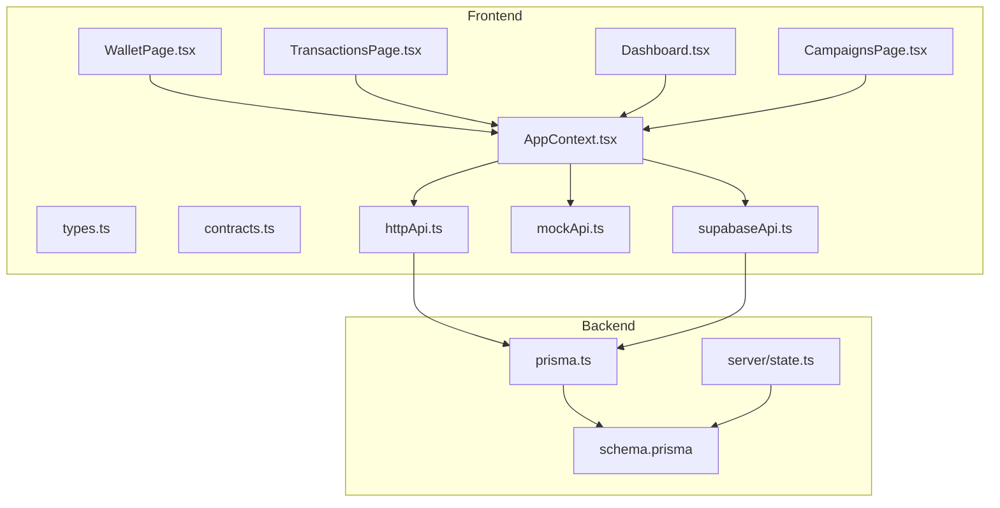

**Diagram sources**
- [WalletPage.tsx:1-169](file://src/pages/WalletPage.tsx#L1-L169)
- [TransactionsPage.tsx:1-214](file://src/pages/TransactionsPage.tsx#L1-L214)
- [AppContext.tsx:1-239](file://src/context/AppContext.tsx#L1-L239)
- [types.ts:1-375](file://src/lib/api/types.ts#L1-L375)
- [contracts.ts:1-167](file://src/lib/api/contracts.ts#L1-L167)
- [httpApi.ts:1-212](file://src/lib/api/httpApi.ts#L1-L212)
- [mockApi.ts:1-768](file://src/lib/api/mockApi.ts#L1-L768)
- [supabaseApi.ts:578-599](file://src/lib/api/supabaseApi.ts#L578-L599)
- [prisma.ts:1-13](file://server/prisma.ts#L1-L13)
- [schema.prisma:1-279](file://prisma/schema.prisma#L1-L279)
- [state.ts:213-255](file://server/state.ts#L213-L255)

**Section sources**
- [WalletPage.tsx:1-169](file://src/pages/WalletPage.tsx#L1-L169)
- [TransactionsPage.tsx:1-214](file://src/pages/TransactionsPage.tsx#L1-L214)
- [AppContext.tsx:1-239](file://src/context/AppContext.tsx#L1-L239)
- [types.ts:1-375](file://src/lib/api/types.ts#L1-L375)
- [contracts.ts:1-167](file://src/lib/api/contracts.ts#L1-L167)
- [httpApi.ts:1-212](file://src/lib/api/httpApi.ts#L1-L212)
- [mockApi.ts:1-768](file://src/lib/api/mockApi.ts#L1-L768)
- [supabaseApi.ts:578-599](file://src/lib/api/supabaseApi.ts#L578-L599)
- [prisma.ts:1-13](file://server/prisma.ts#L1-L13)
- [schema.prisma:1-279](file://prisma/schema.prisma#L1-L279)
- [state.ts:213-255](file://server/state.ts#L213-L255)

## Core Components
- WalletPage: Presents current balance, recent transactions, and top-up UI; triggers addWalletFunds and shows low balance warnings.
- TransactionsPage: Filters and displays wallet ledger entries with totals and balance snapshots.
- AppContext: Centralizes state hydration, exposes addWalletFunds, and provides constants like cost-per-message and low-balance threshold.
- API Adapters:
  - httpApi: HTTP transport for wallet top-ups and other actions.
  - mockApi: Local storage-backed wallet operations for development/demo.
  - supabaseApi: Real backend wallet top-ups persisted to database via wallet_transactions.
- Data Model: WalletTransaction entity stores credits/debits, reference types, and balance-after values.
- Server State: Provides seeded wallet transactions for demo environments.

Key runtime constants:
- Cost per message: 0.50 INR
- Low balance threshold: 500 INR

**Section sources**
- [WalletPage.tsx:19-169](file://src/pages/WalletPage.tsx#L19-L169)
- [TransactionsPage.tsx:21-214](file://src/pages/TransactionsPage.tsx#L21-L214)
- [AppContext.tsx:100-226](file://src/context/AppContext.tsx#L100-L226)
- [types.ts:2-3](file://src/lib/api/types.ts#L2-L3)
- [types.ts:255-282](file://src/lib/api/types.ts#L255-L282)
- [contracts.ts:18-49](file://src/lib/api/contracts.ts#L18-L49)
- [httpApi.ts:120-124](file://src/lib/api/httpApi.ts#L120-L124)
- [mockApi.ts:207-236](file://src/lib/api/mockApi.ts#L207-L236)
- [supabaseApi.ts:578-599](file://src/lib/api/supabaseApi.ts#L578-L599)
- [schema.prisma:214-225](file://prisma/schema.prisma#L214-L225)
- [state.ts:213-255](file://server/state.ts#L213-L255)

## Architecture Overview
The Wallet Management system integrates UI pages with a shared state provider and multiple API adapters. Funding operations route through addWalletFunds, which delegates to the active adapter. The mock adapter updates local state and transaction lists; the Supabase adapter persists to wallet_transactions and returns updated state.

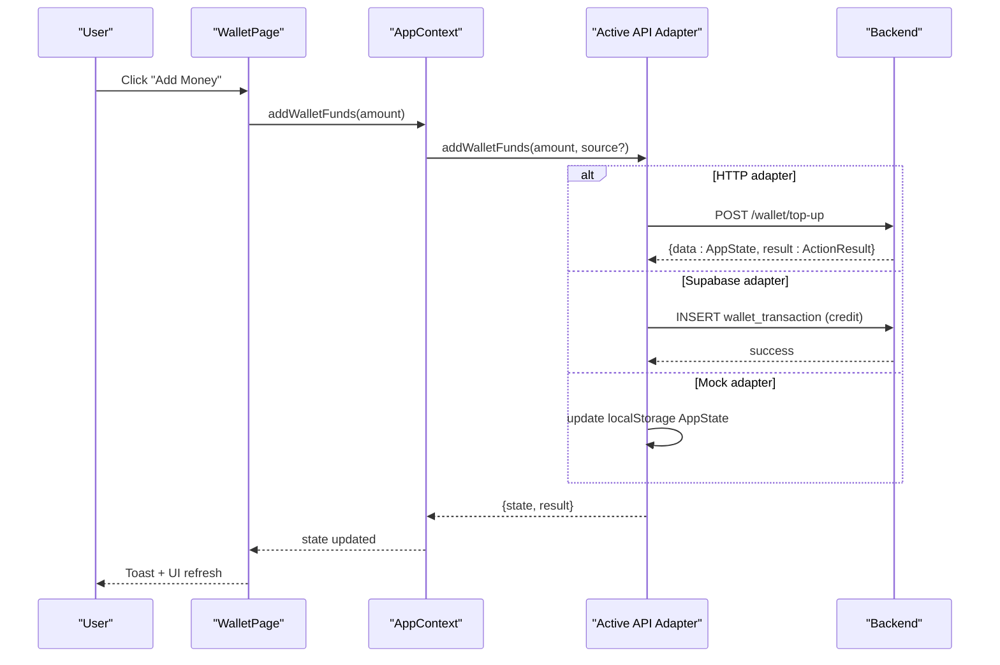

**Diagram sources**
- [WalletPage.tsx:27-37](file://src/pages/WalletPage.tsx#L27-L37)
- [AppContext.tsx:138-142](file://src/context/AppContext.tsx#L138-L142)
- [httpApi.ts:120-124](file://src/lib/api/httpApi.ts#L120-L124)
- [supabaseApi.ts:578-599](file://src/lib/api/supabaseApi.ts#L578-L599)
- [mockApi.ts:207-236](file://src/lib/api/mockApi.ts#L207-L236)

## Detailed Component Analysis

### WalletPage: Top-up, Warnings, and Ledger
- Displays current balance, total spent, and messages sent.
- Shows a low balance warning when balance ≤ threshold.
- Provides an Add Money panel to enter amount and trigger top-up.
- Renders recent transactions with type icons, amounts, and balance-after.

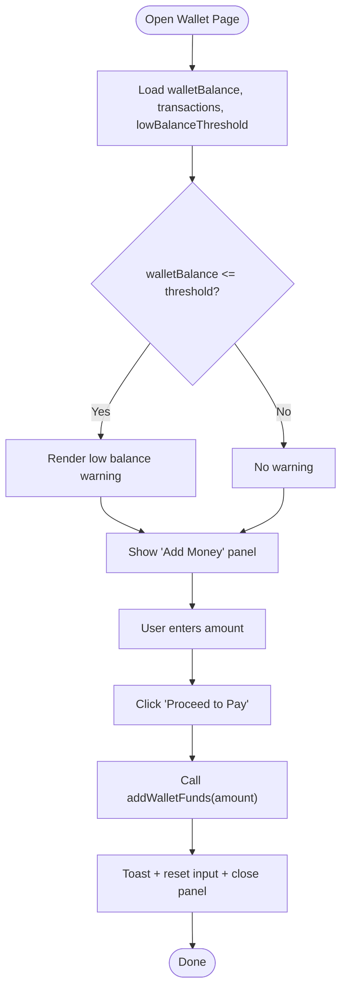

**Diagram sources**
- [WalletPage.tsx:23-37](file://src/pages/WalletPage.tsx#L23-L37)
- [WalletPage.tsx:78-86](file://src/pages/WalletPage.tsx#L78-L86)
- [WalletPage.tsx:115-130](file://src/pages/WalletPage.tsx#L115-L130)
- [WalletPage.tsx:132-163](file://src/pages/WalletPage.tsx#L132-L163)

**Section sources**
- [WalletPage.tsx:19-169](file://src/pages/WalletPage.tsx#L19-L169)

### TransactionsPage: Filtering and Totals
- Filters transactions by date range and type.
- Computes credit and debit totals and shows latest balance snapshot.
- Displays transaction rows with icons, dates, types, and amounts.

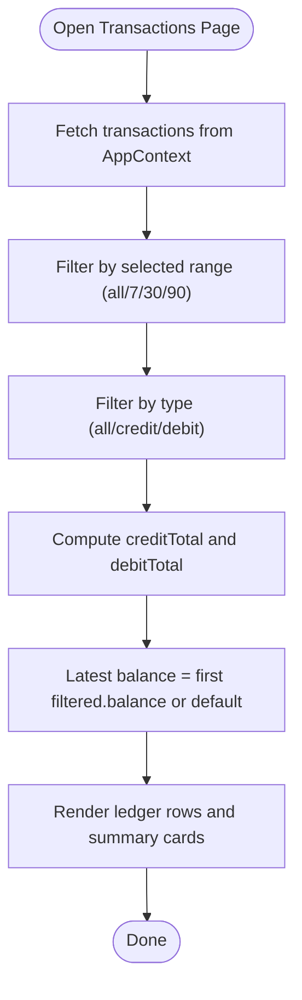

**Diagram sources**
- [TransactionsPage.tsx:26-53](file://src/pages/TransactionsPage.tsx#L26-L53)
- [TransactionsPage.tsx:155-200](file://src/pages/TransactionsPage.tsx#L155-L200)

**Section sources**
- [TransactionsPage.tsx:21-214](file://src/pages/TransactionsPage.tsx#L21-L214)

### AppContext: State and Actions
- Exposes walletBalance, transactions, totalSpent, messagesSent, and lowBalanceThreshold.
- Provides addWalletFunds that delegates to the active API adapter and updates state.
- Hydrates state on mount and subscribes to auth changes (Supabase).

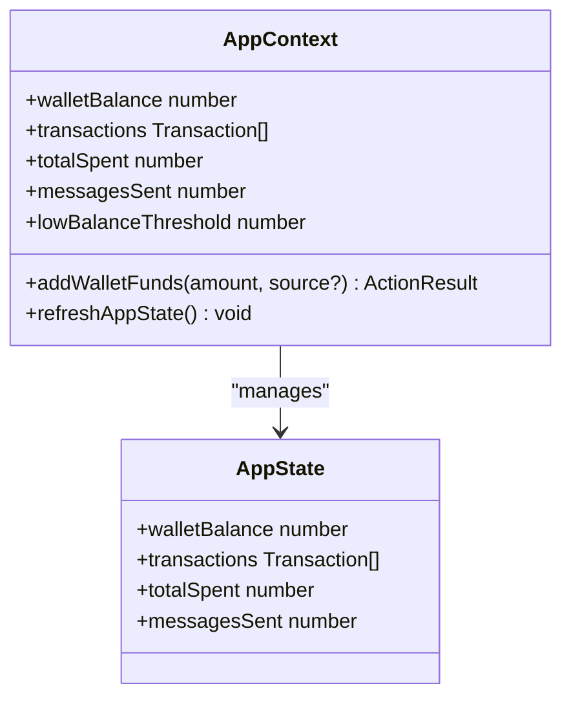

**Diagram sources**
- [AppContext.tsx:24-54](file://src/context/AppContext.tsx#L24-L54)
- [AppContext.tsx:100-226](file://src/context/AppContext.tsx#L100-L226)
- [types.ts:255-282](file://src/lib/api/types.ts#L255-L282)

**Section sources**
- [AppContext.tsx:58-226](file://src/context/AppContext.tsx#L58-L226)
- [types.ts:255-282](file://src/lib/api/types.ts#L255-L282)

### API Contracts and Types
- WalletTopUpRequest defines amount and optional source.
- BackendWalletTransactionRecord mirrors wallet transaction schema.
- Constants include cost-per-message and low-balance threshold.

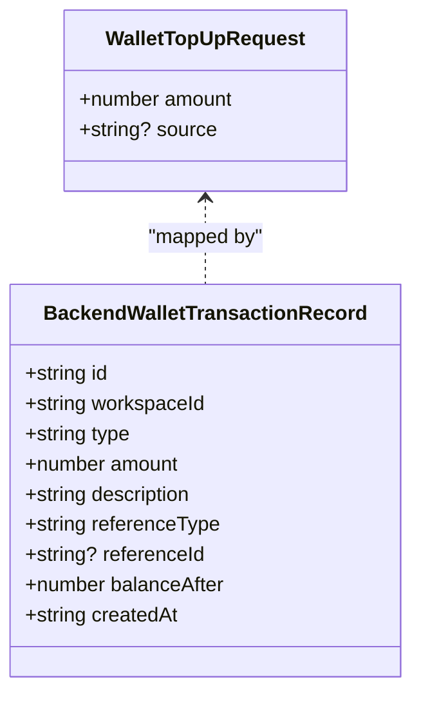

**Diagram sources**
- [contracts.ts:46-49](file://src/lib/api/contracts.ts#L46-L49)
- [contracts.ts:107-117](file://src/lib/api/contracts.ts#L107-L117)

**Section sources**
- [contracts.ts:18-49](file://src/lib/api/contracts.ts#L18-L49)
- [contracts.ts:107-117](file://src/lib/api/contracts.ts#L107-L117)
- [types.ts:2-3](file://src/lib/api/types.ts#L2-L3)

### HTTP API Adapter
- Implements addWalletFunds via POST /wallet/top-up.
- Returns combined state and action result for UI updates.

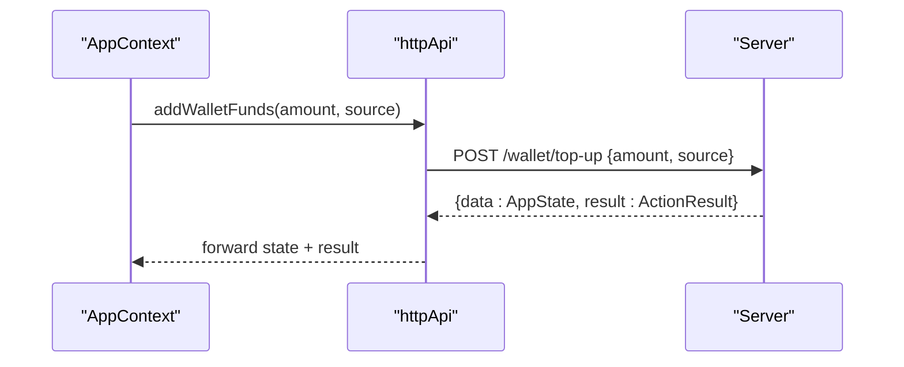

**Diagram sources**
- [httpApi.ts:120-124](file://src/lib/api/httpApi.ts#L120-L124)
- [contracts.ts:18](file://src/lib/api/contracts.ts#L18)

**Section sources**
- [httpApi.ts:62-124](file://src/lib/api/httpApi.ts#L62-L124)
- [contracts.ts:18](file://src/lib/api/contracts.ts#L18)

### Mock API Adapter
- Validates amount and updates local AppState.
- Adds a credit transaction to the front of the list and updates recentActivity.
- Persists state to localStorage.

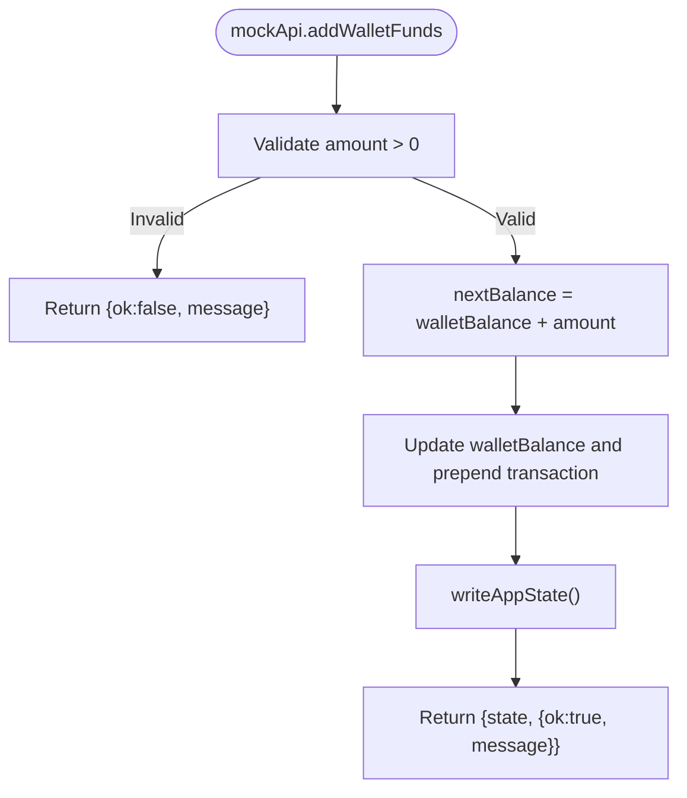

**Diagram sources**
- [mockApi.ts:207-236](file://src/lib/api/mockApi.ts#L207-L236)

**Section sources**
- [mockApi.ts:207-236](file://src/lib/api/mockApi.ts#L207-L236)

### Supabase API Adapter
- Inserts a wallet_transaction row with type=credit, reference_type=manual_topup, and balance_after.
- Returns updated AppState after persistence.

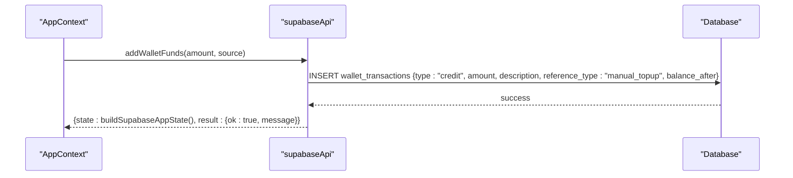

**Diagram sources**
- [supabaseApi.ts:578-599](file://src/lib/api/supabaseApi.ts#L578-L599)
- [schema.prisma:214-225](file://prisma/schema.prisma#L214-L225)

**Section sources**
- [supabaseApi.ts:578-599](file://src/lib/api/supabaseApi.ts#L578-L599)

### Data Model: WalletTransaction
- Stores type, amount, description, referenceType, referenceId, and balanceAfter.
- Reference types include manual_topup, campaign_send, and adjustment.

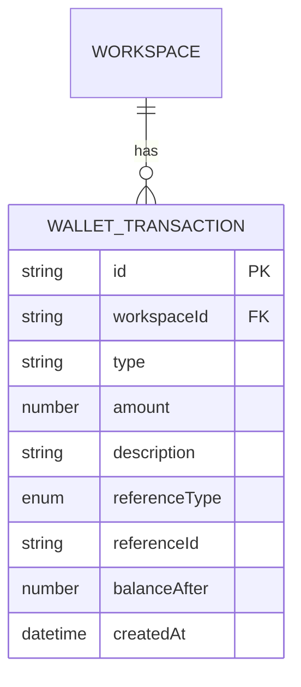

**Diagram sources**
- [schema.prisma:214-225](file://prisma/schema.prisma#L214-L225)

**Section sources**
- [schema.prisma:25-29](file://prisma/schema.prisma#L25-L29)
- [schema.prisma:214-225](file://prisma/schema.prisma#L214-L225)

### Server State Seed
- Seeds wallet transactions for demo environments to populate recent activity and ledger.

**Section sources**
- [state.ts:213-255](file://server/state.ts#L213-L255)

### Low Balance Thresholds and Notifications
- UI components render low balance warnings when walletBalance ≤ threshold.
- Threshold constant is exposed via AppContext.

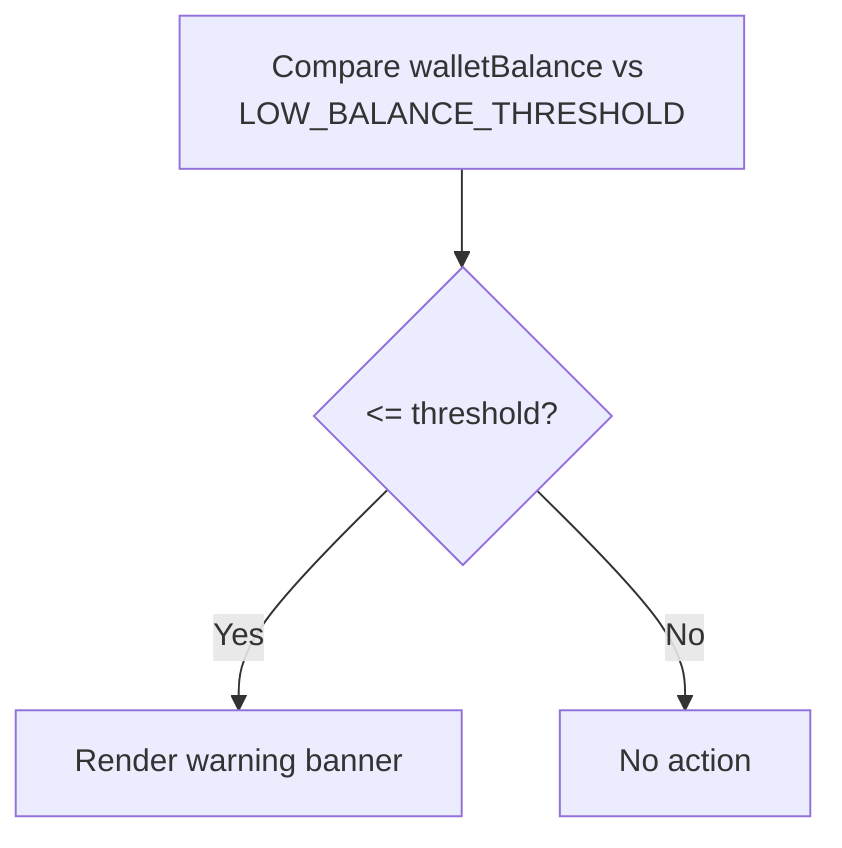

**Diagram sources**
- [WalletPage.tsx:78-86](file://src/pages/WalletPage.tsx#L78-L86)
- [Dashboard.tsx:99-109](file://src/pages/Dashboard.tsx#L99-L109)
- [CampaignsPage.tsx:420-428](file://src/pages/CampaignsPage.tsx#L420-L428)
- [types.ts:3](file://src/lib/api/types.ts#L3)

**Section sources**
- [WalletPage.tsx:78-86](file://src/pages/WalletPage.tsx#L78-L86)
- [Dashboard.tsx:99-109](file://src/pages/Dashboard.tsx#L99-L109)
- [CampaignsPage.tsx:420-428](file://src/pages/CampaignsPage.tsx#L420-L428)
- [types.ts:3](file://src/lib/api/types.ts#L3)

## Dependency Analysis
- UI depends on AppContext for state and actions.
- AppContext routes addWalletFunds to the active adapter (HTTP/Supabase/mocks).
- HTTP adapter communicates with backend routes; Supabase adapter writes to wallet_transactions.
- Data model is defined in Prisma and mirrored in backend records.

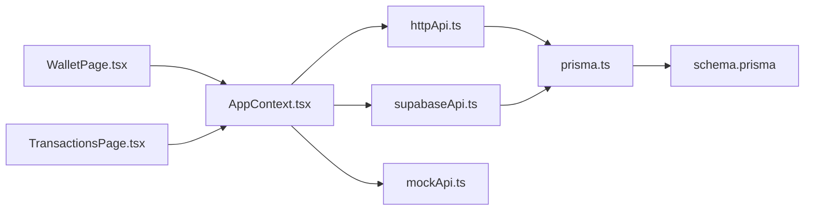

**Diagram sources**
- [WalletPage.tsx:1-169](file://src/pages/WalletPage.tsx#L1-L169)
- [TransactionsPage.tsx:1-214](file://src/pages/TransactionsPage.tsx#L1-L214)
- [AppContext.tsx:1-239](file://src/context/AppContext.tsx#L1-L239)
- [httpApi.ts:1-212](file://src/lib/api/httpApi.ts#L1-L212)
- [supabaseApi.ts:578-599](file://src/lib/api/supabaseApi.ts#L578-L599)
- [mockApi.ts:1-768](file://src/lib/api/mockApi.ts#L1-L768)
- [prisma.ts:1-13](file://server/prisma.ts#L1-L13)
- [schema.prisma:1-279](file://prisma/schema.prisma#L1-L279)

**Section sources**
- [AppContext.tsx:100-226](file://src/context/AppContext.tsx#L100-L226)
- [httpApi.ts:62-124](file://src/lib/api/httpApi.ts#L62-L124)
- [supabaseApi.ts:578-599](file://src/lib/api/supabaseApi.ts#L578-L599)
- [mockApi.ts:207-236](file://src/lib/api/mockApi.ts#L207-L236)
- [schema.prisma:214-225](file://prisma/schema.prisma#L214-L225)

## Performance Considerations
- UI rendering: Memoization of recent transactions and computed totals reduces re-renders.
- Local storage usage in mock adapter avoids network overhead during development.
- Backend adapter selection (HTTP vs Supabase) impacts latency; ensure appropriate environment configuration.
- Filtering large transaction sets is client-side; consider pagination or server-side filtering for scale.

[No sources needed since this section provides general guidance]

## Troubleshooting Guide
Common issues and resolutions:
- Top-up fails with invalid amount:
  - Verify amount is finite and positive before calling addWalletFunds.
  - See validation in adapters.
- Insufficient balance for campaign launch:
  - Estimated cost equals contact count × cost-per-message.
  - Prevent launch when balance < estimated cost.
- Low balance warnings not appearing:
  - Confirm lowBalanceThreshold constant and UI comparison logic.
- Ledger discrepancies:
  - Compare transaction list order and balance-after values.
  - Use TransactionsPage filters to isolate entries.

**Section sources**
- [mockApi.ts:209-211](file://src/lib/api/mockApi.ts#L209-L211)
- [supabaseApi.ts:579-581](file://src/lib/api/supabaseApi.ts#L579-L581)
- [mockApi.ts:443-446](file://src/lib/api/mockApi.ts#L443-L446)
- [types.ts:2-3](file://src/lib/api/types.ts#L2-L3)
- [WalletPage.tsx:78-86](file://src/pages/WalletPage.tsx#L78-L86)

## Conclusion
The Wallet Management system provides a cohesive balance tracking and funding workflow across UI pages and API adapters. It enforces financial controls via thresholds and validations, offers real-time updates, and maintains a clear audit trail through wallet transactions. Integrations support HTTP and Supabase backends, while mock mode enables rapid development. Security and access controls are managed by the active adapter and auth subscription in AppContext.

[No sources needed since this section summarizes without analyzing specific files]

## Appendices

### Practical Examples
- Top-up wallet:
  - Navigate to Wallet page, open Add Money panel, enter amount, click Proceed to Pay.
  - Observe toast notification and updated balance.
- Balance verification:
  - Use TransactionsPage to filter by date range and type; confirm credit/debit totals and latest balance.
- Fund allocation for campaigns:
  - Estimate cost (contacts × 0.50 INR), ensure sufficient balance, then launch campaign.
  - View resulting debit transaction and updated balance-after.

**Section sources**
- [WalletPage.tsx:27-37](file://src/pages/WalletPage.tsx#L27-L37)
- [TransactionsPage.tsx:26-53](file://src/pages/TransactionsPage.tsx#L26-L53)
- [mockApi.ts:443-446](file://src/lib/api/mockApi.ts#L443-L446)

### Security Features and Access Controls
- Authentication state subscription updates state on auth changes.
- API adapters encapsulate transport-specific logic; ensure secure credential handling and HTTPS in production.

**Section sources**
- [AppContext.tsx:84-93](file://src/context/AppContext.tsx#L84-L93)
- [httpApi.ts:63-74](file://src/lib/api/httpApi.ts#L63-L74)

### Audit Trails and Compliance
- Every top-up and campaign deduction creates a wallet transaction with referenceType and balanceAfter.
- Recent activity aggregates wallet events for dashboard visibility.

**Section sources**
- [mockApi.ts:217-232](file://src/lib/api/mockApi.ts#L217-L232)
- [state.ts:339-352](file://server/state.ts#L339-L352)

### Maintenance and Internationalization Notes
- Currency: INR is enforced in schema and types; adjust constants and display formatting if expanding to other currencies.
- Payment processors: Integrate via HTTP adapter by extending addWalletFunds contract and backend route.
- Financial institutions: Use Supabase adapter to persist transactions and maintain compliance-ready audit logs.

**Section sources**
- [schema.prisma:15-17](file://prisma/schema.prisma#L15-L17)
- [types.ts:84](file://src/lib/api/types.ts#L84)
- [contracts.ts:18](file://src/lib/api/contracts.ts#L18)