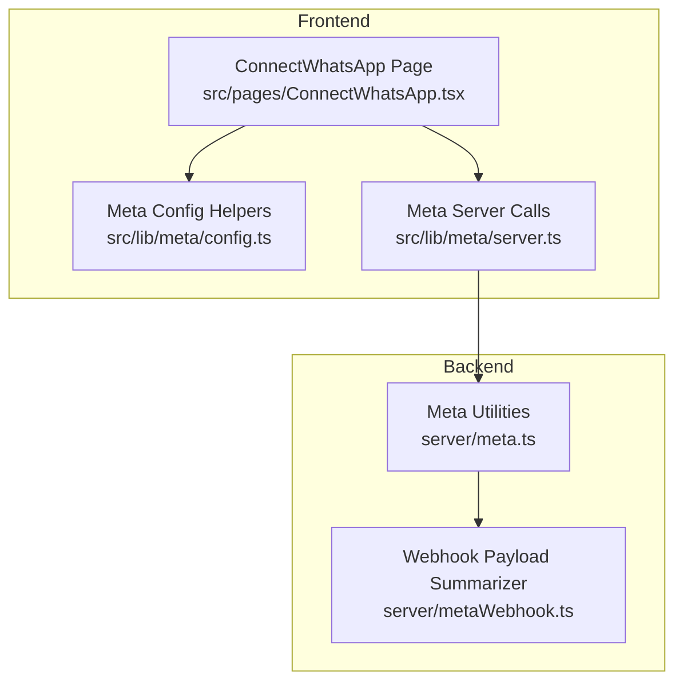
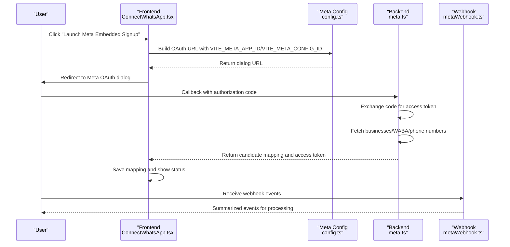
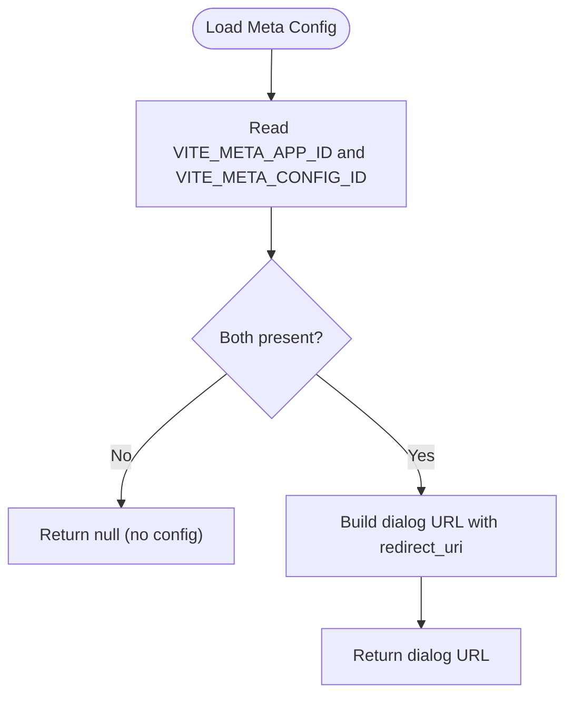
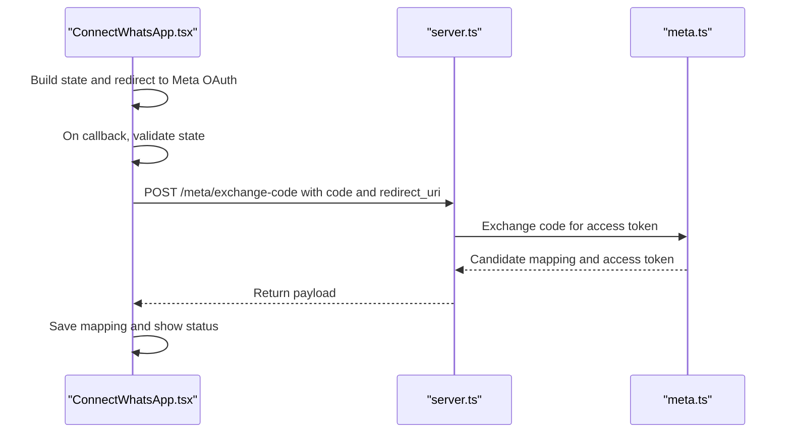
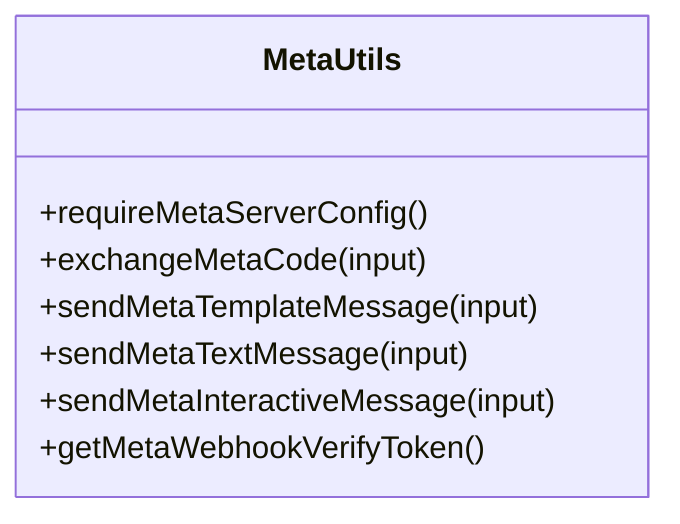
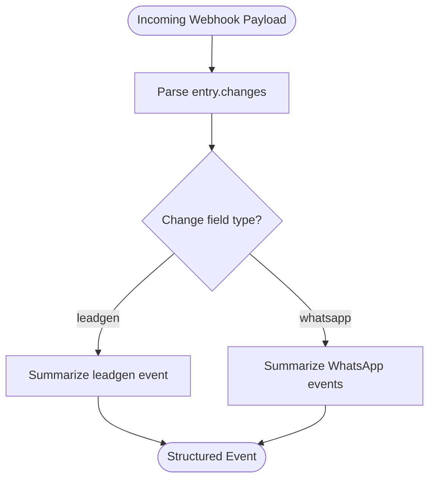
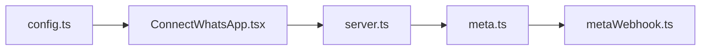

# Meta Developer App Setup

<cite>
**Referenced Files in This Document**
- [meta.ts](file://server/meta.ts)
- [metaWebhook.ts](file://server/metaWebhook.ts)
- [config.ts](file://src/lib/meta/config.ts)
- [server.ts](file://src/lib/meta/server.ts)
- [ConnectWhatsApp.tsx](file://src/pages/ConnectWhatsApp.tsx)
- [DEPLOYMENT_GUIDE.md](file://DEPLOYMENT_GUIDE.md)
- [NGROK_SETUP_GUIDE.md](file://NGROK_SETUP_GUIDE.md)
- [README.md](file://README.md)
</cite>

## Table of Contents
1. [Introduction](#introduction)
2. [Project Structure](#project-structure)
3. [Core Components](#core-components)
4. [Architecture Overview](#architecture-overview)
5. [Detailed Component Analysis](#detailed-component-analysis)
6. [Dependency Analysis](#dependency-analysis)
7. [Performance Considerations](#performance-considerations)
8. [Troubleshooting Guide](#troubleshooting-guide)
9. [Conclusion](#conclusion)
10. [Appendices](#appendices)

## Introduction
This document explains how to configure and set up a Meta Developer App for WhatsApp Business API integration in this project. It covers:
- Creating a Meta Developer account and app
- Enabling WhatsApp Business API and required permissions
- Configuring OAuth redirect URIs and webhook settings
- Obtaining and storing API credentials (App ID and App Secret)
- Environment variable configuration for the backend and frontend
- Practical steps to connect a business, authorize assets, and validate credentials

It also documents the internal integration points in the codebase that rely on these configurations, including the embedded signup flow, code exchange, and webhook processing.

## Project Structure
The Meta integration spans frontend and backend components:
- Frontend: Embedded signup launch, OAuth callback handling, and saving the connection mapping
- Backend: OAuth code exchange, access token retrieval, business and WABA discovery, and webhook payload summarization

**Diagram sources**
- [ConnectWhatsApp.tsx:134-157](file://src/pages/ConnectWhatsApp.tsx#L134-L157)
- [config.ts:25-46](file://src/lib/meta/config.ts#L25-L46)
- [server.ts:18-47](file://src/lib/meta/server.ts#L18-L47)
- [meta.ts:237-292](file://server/meta.ts#L237-L292)
- [metaWebhook.ts:111-160](file://server/metaWebhook.ts#L111-L160)

**Section sources**
- [ConnectWhatsApp.tsx:1-519](file://src/pages/ConnectWhatsApp.tsx#L1-L519)
- [config.ts:1-47](file://src/lib/meta/config.ts#L1-L47)
- [server.ts:1-148](file://src/lib/meta/server.ts#L1-L148)
- [meta.ts:1-391](file://server/meta.ts#L1-L391)
- [metaWebhook.ts:1-161](file://server/metaWebhook.ts#L1-L161)

## Core Components
- Meta configuration helpers: provide embedded signup configuration and build the OAuth dialog URL
- Frontend connection page: launches embedded signup, handles OAuth callbacks, exchanges code, and saves mapping
- Backend Meta utilities: validates environment, exchanges code for tokens, discovers businesses/WABA/phone numbers, and sends messages
- Webhook summarizer: normalizes incoming Meta webhook payloads into structured events

Key environment variables used by the backend:
- META_APP_ID: Meta App ID
- META_APP_SECRET: Meta App Secret
- META_API_VERSION: Graph API version (defaults to v22.0 if not set)
- META_WEBHOOK_VERIFY_TOKEN: Used to verify webhook authenticity

**Section sources**
- [meta.ts:1-16](file://server/meta.ts#L1-L16)
- [config.ts:7-23](file://src/lib/meta/config.ts#L7-L23)
- [server.ts:18-47](file://src/lib/meta/server.ts#L18-L47)
- [metaWebhook.ts:111-160](file://server/metaWebhook.ts#L111-L160)

## Architecture Overview
The Meta integration follows a secure, two-stage flow:
1. Embedded signup: the frontend opens Meta’s OAuth dialog with configured app and config IDs
2. Backend code exchange: upon receiving the authorization code, the backend exchanges it for an access token and retrieves business assets
3. Webhook processing: incoming events are validated and summarized for downstream handlers

**Diagram sources**
- [ConnectWhatsApp.tsx:134-157](file://src/pages/ConnectWhatsApp.tsx#L134-L157)
- [config.ts:25-46](file://src/lib/meta/config.ts#L25-L46)
- [meta.ts:237-292](file://server/meta.ts#L237-L292)
- [metaWebhook.ts:111-160](file://server/metaWebhook.ts#L111-L160)

## Detailed Component Analysis

### Meta Configuration Helpers
- Purpose: Provide embedded signup configuration and construct the OAuth dialog URL
- Key behaviors:
  - Reads VITE_META_APP_ID and VITE_META_CONFIG_ID from the frontend environment
  - Builds the OAuth dialog URL with redirect_uri pointing to the app’s connect route
  - Supports optional state parameter for CSRF protection

**Diagram sources**
- [config.ts:7-23](file://src/lib/meta/config.ts#L7-L23)
- [config.ts:25-46](file://src/lib/meta/config.ts#L25-L46)

**Section sources**
- [config.ts:1-47](file://src/lib/meta/config.ts#L1-L47)

### Frontend Embedded Signup and Code Exchange
- Purpose: Launch Meta’s embedded signup, handle OAuth callback, exchange code, and persist mapping
- Key behaviors:
  - Validates state parameter against sessionStorage to prevent CSRF
  - Exchanges the authorization code via the backend and updates the UI with connection status
  - Provides manual fields for saving Meta identifiers and statuses

**Diagram sources**
- [ConnectWhatsApp.tsx:76-132](file://src/pages/ConnectWhatsApp.tsx#L76-L132)
- [server.ts:18-47](file://src/lib/meta/server.ts#L18-L47)
- [meta.ts:237-292](file://server/meta.ts#L237-L292)

**Section sources**
- [ConnectWhatsApp.tsx:72-132](file://src/pages/ConnectWhatsApp.tsx#L72-L132)
- [server.ts:18-47](file://src/lib/meta/server.ts#L18-L47)
- [meta.ts:237-292](file://server/meta.ts#L237-L292)

### Backend Meta Utilities
- Purpose: Centralize Meta Graph API interactions and environment validation
- Key behaviors:
  - Validates META_APP_ID and META_APP_SECRET presence
  - Exchanges authorization code for access token
  - Discovers businesses, WABA accounts, and phone numbers
  - Sends template/text/interactive messages via the Graph API
  - Provides webhook verify token accessor

**Diagram sources**
- [meta.ts:6-16](file://server/meta.ts#L6-L16)
- [meta.ts:237-292](file://server/meta.ts#L237-L292)
- [meta.ts:298-353](file://server/meta.ts#L298-L353)
- [meta.ts:355-390](file://server/meta.ts#L355-L390)
- [meta.ts:294-296](file://server/meta.ts#L294-L296)

**Section sources**
- [meta.ts:1-391](file://server/meta.ts#L1-L391)

### Webhook Payload Summarizer
- Purpose: Normalize incoming Meta webhook payloads into a unified structure for downstream processing
- Key behaviors:
  - Parses WhatsApp message status and inbound message events
  - Parses lead generation events
  - Extracts phone number IDs and display numbers for correlation

**Diagram sources**
- [metaWebhook.ts:111-160](file://server/metaWebhook.ts#L111-L160)

**Section sources**
- [metaWebhook.ts:1-161](file://server/metaWebhook.ts#L1-L161)

## Dependency Analysis
- Frontend depends on:
  - Meta configuration helpers for building the OAuth URL
  - Server-side endpoints for exchanging the code and sending messages
- Backend depends on:
  - Environment variables for app credentials and API version
  - Meta Graph API for token exchange and resource discovery
- Webhook processing depends on:
  - Verify token configuration and normalized payload structure

**Diagram sources**
- [config.ts:25-46](file://src/lib/meta/config.ts#L25-L46)
- [ConnectWhatsApp.tsx:134-157](file://src/pages/ConnectWhatsApp.tsx#L134-L157)
- [server.ts:18-47](file://src/lib/meta/server.ts#L18-L47)
- [meta.ts:237-292](file://server/meta.ts#L237-L292)
- [metaWebhook.ts:111-160](file://server/metaWebhook.ts#L111-L160)

**Section sources**
- [config.ts:1-47](file://src/lib/meta/config.ts#L1-L47)
- [ConnectWhatsApp.tsx:1-519](file://src/pages/ConnectWhatsApp.tsx#L1-L519)
- [server.ts:1-148](file://src/lib/meta/server.ts#L1-L148)
- [meta.ts:1-391](file://server/meta.ts#L1-L391)
- [metaWebhook.ts:1-161](file://server/metaWebhook.ts#L1-L161)

## Performance Considerations
- Minimize repeated token exchanges by caching access tokens per workspace and refreshing only when nearing expiration
- Batch webhook processing to reduce latency under high traffic
- Use environment-specific API versions to align with Meta’s latest performance improvements

[No sources needed since this section provides general guidance]

## Troubleshooting Guide
Common setup issues and resolutions:
- Missing environment variables
  - Symptom: Backend throws an error indicating incomplete Meta server configuration
  - Resolution: Set META_APP_ID and META_APP_SECRET in the backend environment
- OAuth state mismatch
  - Symptom: Frontend warns about state mismatch during embedded signup
  - Resolution: Ensure state is generated and persisted in sessionStorage before redirect and matches the callback
- Invalid redirect URI
  - Symptom: Meta rejects the OAuth callback
  - Resolution: Ensure redirect_uri matches the configured OAuth redirect URIs in the Meta App settings
- Webhook verification failure
  - Symptom: Incoming webhooks are rejected due to invalid verify token
  - Resolution: Set META_WEBHOOK_VERIFY_TOKEN consistently across the app and Meta Developer Console
- Insufficient permissions
  - Symptom: Access denied when fetching businesses or sending messages
  - Resolution: Confirm the app has the required permissions and scopes for WhatsApp Business API access

**Section sources**
- [meta.ts:6-16](file://server/meta.ts#L6-L16)
- [ConnectWhatsApp.tsx:96-104](file://src/pages/ConnectWhatsApp.tsx#L96-L104)
- [DEPLOYMENT_GUIDE.md:51-54](file://DEPLOYMENT_GUIDE.md#L51-L54)

## Conclusion
This guide outlined the complete Meta Developer App setup required to integrate WhatsApp Business API in this project. By configuring embedded signup, validating environment variables, and ensuring proper permissions and webhook settings, you can securely connect business assets, exchange authorization codes, and process inbound events. The included diagrams and references map directly to the codebase to streamline implementation and troubleshooting.

[No sources needed since this section summarizes without analyzing specific files]

## Appendices

### Required Permissions and Scopes for WhatsApp Business API
- business_management
- whatsapp_business_management
- whatsapp_business_messaging

These permissions enable access to business assets, WABA management, and messaging capabilities.

[No sources needed since this section provides general guidance]

### Environment Variable Configuration
Backend:
- META_APP_ID: Meta App ID
- META_APP_SECRET: Meta App Secret
- META_API_VERSION: Graph API version (default: v22.0)
- META_WEBHOOK_VERIFY_TOKEN: Webhook verify token

Frontend:
- VITE_META_APP_ID: Meta App ID for embedded signup
- VITE_META_CONFIG_ID: Meta Config ID for embedded signup
- VITE_API_BASE_URL: Base URL for backend API calls

**Section sources**
- [meta.ts:1-4](file://server/meta.ts#L1-L4)
- [config.ts:7-23](file://src/lib/meta/config.ts#L7-L23)
- [server.ts:18-23](file://src/lib/meta/server.ts#L18-L23)
- [DEPLOYMENT_GUIDE.md:18-21](file://DEPLOYMENT_GUIDE.md#L18-L21)

### Step-by-Step Meta Developer Console Setup
Note: The following steps describe the console configuration referenced by the codebase. Screenshots are not included here but can be captured during each step.

1. Create a Meta Developer Account
- Visit the Meta for Developers portal and sign in
- Create a new Meta App

2. Enable WhatsApp Business API
- In the app dashboard, navigate to “My Apps” > Select your app > “Add Product”
- Choose “WhatsApp”
- Enable the product and wait for approval

3. Configure OAuth Redirect URIs
- In the app dashboard, go to “Facebook Login” > “Settings” > “OAuth Redirect URIs”
- Add the redirect URI used by the embedded signup flow (typically the app’s connect route)

4. Obtain App ID and App Secret
- In the app dashboard, note the App ID and App Secret
- Store these values in your backend environment as META_APP_ID and META_APP_SECRET

5. Configure Webhooks
- In the app dashboard, go to “Webhooks” > “Subscriptions”
- Subscribe to the required fields (e.g., messages, statuses)
- Set the Callback URL to your deployed endpoint (e.g., https://your-app.vercel.app/webhook/whatsapp)
- Set the Verify Token to match META_WEBHOOK_VERIFY_TOKEN

6. Set Required Permissions and Scopes
- In the app dashboard, go to “App Review” > “Permissions and Features”
- Add the required permissions: business_management, whatsapp_business_management, whatsapp_business_messaging
- Submit for review and ensure approval before testing

7. Deploy and Test
- Deploy the frontend and backend
- Launch the embedded signup from the Connect WhatsApp page
- Complete the OAuth flow and verify that the mapping is saved

**Section sources**
- [DEPLOYMENT_GUIDE.md:51-54](file://DEPLOYMENT_GUIDE.md#L51-L54)
- [NGROK_SETUP_GUIDE.md:18-22](file://NGROK_SETUP_GUIDE.md#L18-L22)
- [README.md:11-19](file://README.md#L11-L19)