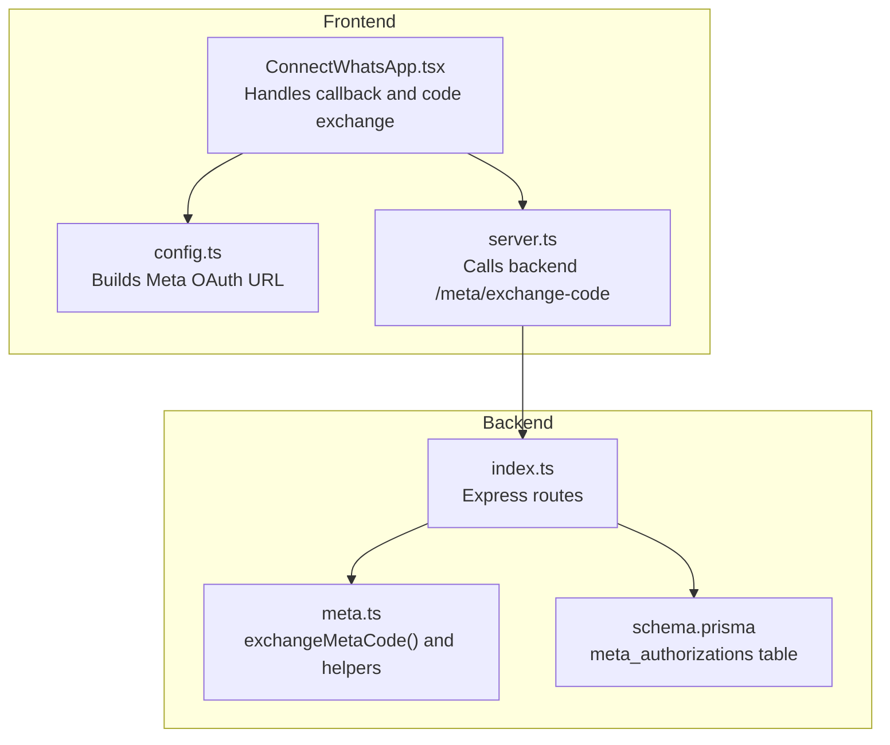
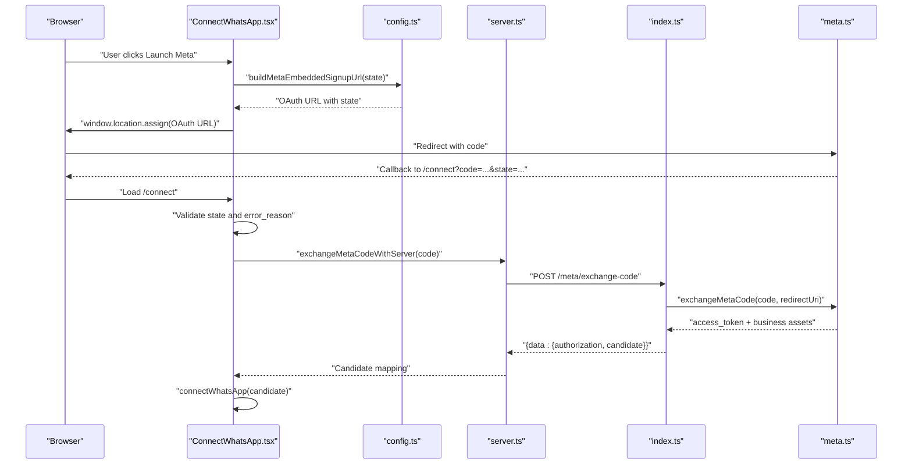
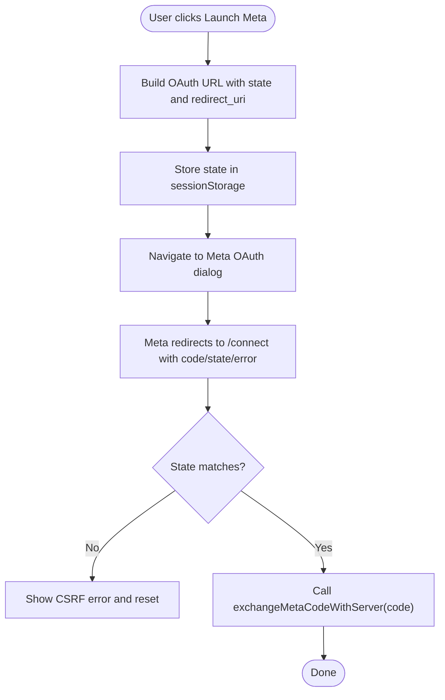
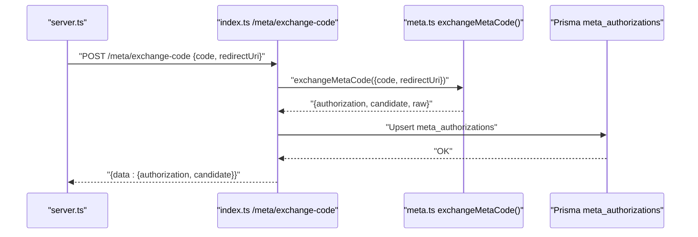
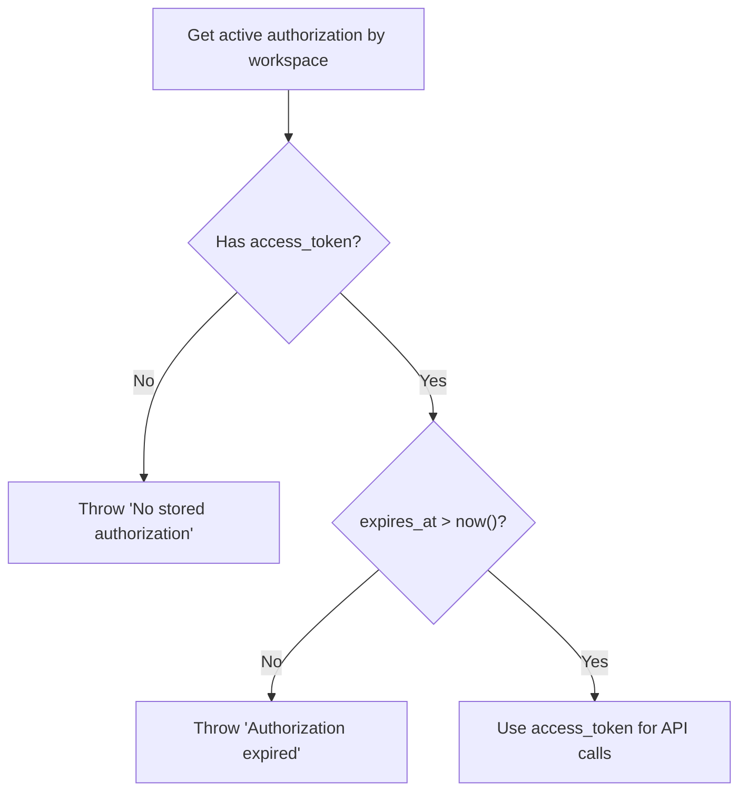
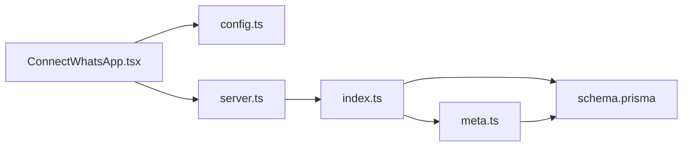

# OAuth Authentication Flow

<cite>
**Referenced Files in This Document**
- [ConnectWhatsApp.tsx](file://src/pages/ConnectWhatsApp.tsx)
- [meta.ts](file://server/meta.ts)
- [index.ts](file://server/index.ts)
- [config.ts](file://src/lib/meta/config.ts)
- [server.ts](file://src/lib/meta/server.ts)
- [types.ts](file://src/lib/api/types.ts)
- [schema.prisma](file://prisma/schema.prisma)
</cite>

## Table of Contents
1. [Introduction](#introduction)
2. [Project Structure](#project-structure)
3. [Core Components](#core-components)
4. [Architecture Overview](#architecture-overview)
5. [Detailed Component Analysis](#detailed-component-analysis)
6. [Dependency Analysis](#dependency-analysis)
7. [Performance Considerations](#performance-considerations)
8. [Troubleshooting Guide](#troubleshooting-guide)
9. [Conclusion](#conclusion)

## Introduction
This document explains the OAuth 2.0 authorization code flow implementation for Meta’s WhatsApp Business API within the project. It covers redirect URI configuration, authorization URL construction, code exchange, token retrieval, token storage, refresh token management, and token expiration handling. It also documents security considerations (CSRF protection, token scopes), error handling, and practical integration steps for frontend initiation and backend token exchange.

## Project Structure
The OAuth flow spans three layers:
- Frontend page that initiates Meta’s embedded signup and handles the callback
- Frontend client that exchanges the authorization code with the backend
- Backend server that validates the code, exchanges it with Meta, persists tokens, and exposes protected endpoints

**Diagram sources**
- [ConnectWhatsApp.tsx:134-157](file://src/pages/ConnectWhatsApp.tsx#L134-L157)
- [config.ts:25-46](file://src/lib/meta/config.ts#L25-L46)
- [server.ts:18-47](file://src/lib/meta/server.ts#L18-L47)
- [index.ts:851-875](file://server/index.ts#L851-L875)
- [meta.ts:237-292](file://server/meta.ts#L237-L292)
- [schema.prisma:1-279](file://prisma/schema.prisma#L1-L279)

**Section sources**
- [ConnectWhatsApp.tsx:134-157](file://src/pages/ConnectWhatsApp.tsx#L134-L157)
- [config.ts:25-46](file://src/lib/meta/config.ts#L25-L46)
- [server.ts:18-47](file://src/lib/meta/server.ts#L18-L47)
- [index.ts:851-875](file://server/index.ts#L851-L875)
- [meta.ts:237-292](file://server/meta.ts#L237-L292)
- [schema.prisma:1-279](file://prisma/schema.prisma#L1-L279)

## Core Components
- Frontend authorization initiation and callback handling
- Redirect URI configuration and state parameter usage
- Backend token exchange with Meta Graph API
- Token persistence and retrieval for sending operations
- Token expiration checks and status labeling

**Section sources**
- [ConnectWhatsApp.tsx:76-132](file://src/pages/ConnectWhatsApp.tsx#L76-L132)
- [config.ts:25-46](file://src/lib/meta/config.ts#L25-L46)
- [server.ts:18-47](file://src/lib/meta/server.ts#L18-L47)
- [index.ts:851-875](file://server/index.ts#L851-L875)
- [meta.ts:237-292](file://server/meta.ts#L237-L292)
- [types.ts:53-69](file://src/lib/api/types.ts#L53-L69)

## Architecture Overview
The end-to-end flow:
1. Frontend builds Meta OAuth URL with state and redirect_uri
2. User authenticates in Meta and is redirected back with code
3. Frontend exchanges code with backend via /meta/exchange-code
4. Backend validates code, exchanges with Meta, persists token, returns candidate mapping
5. Frontend saves mapping and displays status

**Diagram sources**
- [ConnectWhatsApp.tsx:76-132](file://src/pages/ConnectWhatsApp.tsx#L76-L132)
- [config.ts:25-46](file://src/lib/meta/config.ts#L25-L46)
- [server.ts:18-47](file://src/lib/meta/server.ts#L18-L47)
- [index.ts:851-875](file://server/index.ts#L851-L875)
- [meta.ts:237-292](file://server/meta.ts#L237-L292)

## Detailed Component Analysis

### Frontend Authorization Initiation and Callback Handling
- Builds OAuth URL with client_id, config_id, response_type=code, redirect_uri, and optional state
- Stores state in sessionStorage and navigates to Meta’s dialog
- On callback, validates state and error_reason, then exchanges code with backend

**Diagram sources**
- [ConnectWhatsApp.tsx:134-157](file://src/pages/ConnectWhatsApp.tsx#L134-L157)
- [ConnectWhatsApp.tsx:76-132](file://src/pages/ConnectWhatsApp.tsx#L76-L132)
- [config.ts:25-46](file://src/lib/meta/config.ts#L25-L46)

**Section sources**
- [ConnectWhatsApp.tsx:76-132](file://src/pages/ConnectWhatsApp.tsx#L76-L132)
- [config.ts:25-46](file://src/lib/meta/config.ts#L25-L46)

### Redirect URI Configuration and Authorization URL Construction
- Redirect URI is constructed as the current origin plus “/connect”
- Uses VITE_META_APP_ID, VITE_META_CONFIG_ID, and optional VITE_META_API_VERSION
- Adds state parameter for CSRF protection

**Section sources**
- [config.ts:25-46](file://src/lib/meta/config.ts#L25-L46)

### Backend Token Exchange Endpoint (/meta/exchange-code)
- Validates request payload (code, redirectUri)
- Calls exchangeMetaCode() to exchange code for access_token
- Persists authorization to meta_authorizations table
- Returns candidate mapping and authorization info

**Diagram sources**
- [server.ts:18-47](file://src/lib/meta/server.ts#L18-L47)
- [index.ts:851-875](file://server/index.ts#L851-L875)
- [meta.ts:237-292](file://server/meta.ts#L237-L292)
- [schema.prisma:1-279](file://prisma/schema.prisma#L1-L279)

**Section sources**
- [server.ts:18-47](file://src/lib/meta/server.ts#L18-L47)
- [index.ts:851-875](file://server/index.ts#L851-L875)
- [meta.ts:237-292](file://server/meta.ts#L237-L292)
- [schema.prisma:1-279](file://prisma/schema.prisma#L1-L279)

### Token Exchange Endpoint Parameters and Response Handling
- Request body:
  - code: authorization code from Meta
  - redirectUri: must match the original redirect_uri used during authorization
- Response:
  - data.authorization: access_token and token_type
  - data.candidate: mapping of business assets and status fields
  - data.raw: raw business lists for diagnostics

**Section sources**
- [index.ts:79-82](file://server/index.ts#L79-L82)
- [meta.ts:69-126](file://server/meta.ts#L69-L126)

### Token Storage Strategy and Retrieval
- Persisted in meta_authorizations with access_token, token_type, and expires_at
- During send operations, the active authorization is retrieved per workspace
- Expiration is checked before sending; expired tokens trigger re-authentication prompt

**Diagram sources**
- [index.ts:225-244](file://server/index.ts#L225-L244)

**Section sources**
- [index.ts:225-244](file://server/index.ts#L225-L244)
- [schema.prisma:1-279](file://prisma/schema.prisma#L1-L279)

### Token Expiration Handling and Status Labeling
- Candidate mapping sets authorizationExpiresAt to a fixed future date (simulated)
- UI labels authorization status as active/expiring_soon/expired/missing
- Frontend prompts reconnection when authorization is expired or expiring soon

**Section sources**
- [meta.ts:285](file://server/meta.ts#L285)
- [types.ts:53-69](file://src/lib/api/types.ts#L53-L69)
- [ConnectWhatsApp.tsx:204-223](file://src/pages/ConnectWhatsApp.tsx#L204-L223)

### Security Considerations
- CSRF Protection: state parameter is generated and compared against the callback state
- Error Handling: error_reason is checked and surfaced to the user
- Token Scope Management: the code currently requests a long-lived token via the Graph API; ensure minimal required permissions are requested in production
- PKCE: Not implemented in the current flow; consider adding S256 challenge for enhanced security

**Section sources**
- [ConnectWhatsApp.tsx:96-104](file://src/pages/ConnectWhatsApp.tsx#L96-L104)
- [ConnectWhatsApp.tsx:82-90](file://src/pages/ConnectWhatsApp.tsx#L82-L90)
- [meta.ts:237-292](file://server/meta.ts#L237-L292)

### Practical Code Examples
- Frontend OAuth initiation:
  - Build OAuth URL and navigate to Meta dialog
  - Reference: [config.ts:25-46](file://src/lib/meta/config.ts#L25-L46)
- Frontend code exchange:
  - Call exchangeMetaCodeWithServer(code) and then connectWhatsApp(candidate)
  - Reference: [server.ts:18-47](file://src/lib/meta/server.ts#L18-L47)
- Backend token exchange:
  - Route /meta/exchange-code validates payload, calls exchangeMetaCode(), persists authorization
  - Reference: [index.ts:851-875](file://server/index.ts#L851-L875)
- Secure token storage:
  - Upsert meta_authorizations with access_token and expires_at
  - Reference: [index.ts:860-866](file://server/index.ts#L860-L866)

**Section sources**
- [config.ts:25-46](file://src/lib/meta/config.ts#L25-L46)
- [server.ts:18-47](file://src/lib/meta/server.ts#L18-L47)
- [index.ts:851-875](file://server/index.ts#L851-L875)
- [index.ts:860-866](file://server/index.ts#L860-L866)

## Dependency Analysis
- Frontend depends on:
  - config.ts for building the OAuth URL
  - server.ts for calling the backend exchange endpoint
  - types.ts for status enums and UI labeling
- Backend depends on:
  - meta.ts for exchanging code and fetching business assets
  - Prisma schema for storing and retrieving tokens
  - Express routes for validating and handling requests

**Diagram sources**
- [ConnectWhatsApp.tsx:134-157](file://src/pages/ConnectWhatsApp.tsx#L134-L157)
- [config.ts:25-46](file://src/lib/meta/config.ts#L25-L46)
- [server.ts:18-47](file://src/lib/meta/server.ts#L18-L47)
- [index.ts:851-875](file://server/index.ts#L851-L875)
- [meta.ts:237-292](file://server/meta.ts#L237-L292)
- [schema.prisma:1-279](file://prisma/schema.prisma#L1-L279)

**Section sources**
- [ConnectWhatsApp.tsx:134-157](file://src/pages/ConnectWhatsApp.tsx#L134-L157)
- [config.ts:25-46](file://src/lib/meta/config.ts#L25-L46)
- [server.ts:18-47](file://src/lib/meta/server.ts#L18-L47)
- [index.ts:851-875](file://server/index.ts#L851-L875)
- [meta.ts:237-292](file://server/meta.ts#L237-L292)
- [schema.prisma:1-279](file://prisma/schema.prisma#L1-L279)

## Performance Considerations
- Minimize round-trips by batching business asset queries in exchangeMetaCode()
- Cache frequently accessed business details per workspace
- Use efficient Prisma upserts for meta_authorizations

[No sources needed since this section provides general guidance]

## Troubleshooting Guide
Common OAuth errors and remedies:
- State mismatch: Indicates potential CSRF attack; show error and reset state
  - Reference: [ConnectWhatsApp.tsx:96-104](file://src/pages/ConnectWhatsApp.tsx#L96-L104)
- Authorization declined or missing: Prompt user to reconnect
  - Reference: [ConnectWhatsApp.tsx:82-90](file://src/pages/ConnectWhatsApp.tsx#L82-L90)
- Token expired: Prompt re-authentication
  - Reference: [index.ts:239-241](file://server/index.ts#L239-L241)
- Backend exchange failure: Inspect server logs and validate redirect_uri and code
  - Reference: [index.ts:872-874](file://server/index.ts#L872-L874)
- Missing stored authorization: Ensure /meta/exchange-code was called and persisted
  - Reference: [index.ts:235-237](file://server/index.ts#L235-L237)

**Section sources**
- [ConnectWhatsApp.tsx:82-104](file://src/pages/ConnectWhatsApp.tsx#L82-L104)
- [index.ts:235-241](file://server/index.ts#L235-L241)
- [index.ts:872-874](file://server/index.ts#L872-L874)

## Conclusion
The project implements a robust OAuth 2.0 authorization code flow with Meta’s WhatsApp Business API. It includes CSRF protection via state parameters, secure token exchange, persistent storage, and clear error handling. For production hardening, consider implementing PKCE, scoping token permissions, and adding refresh token handling.