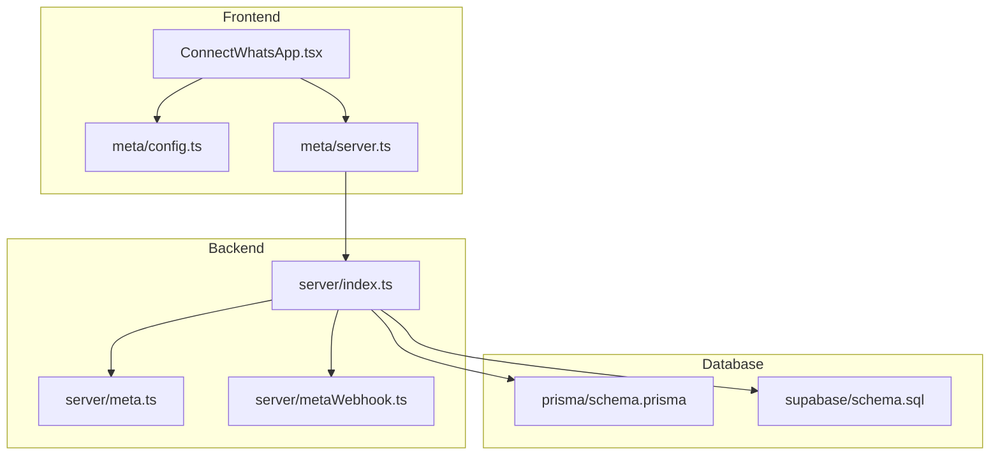
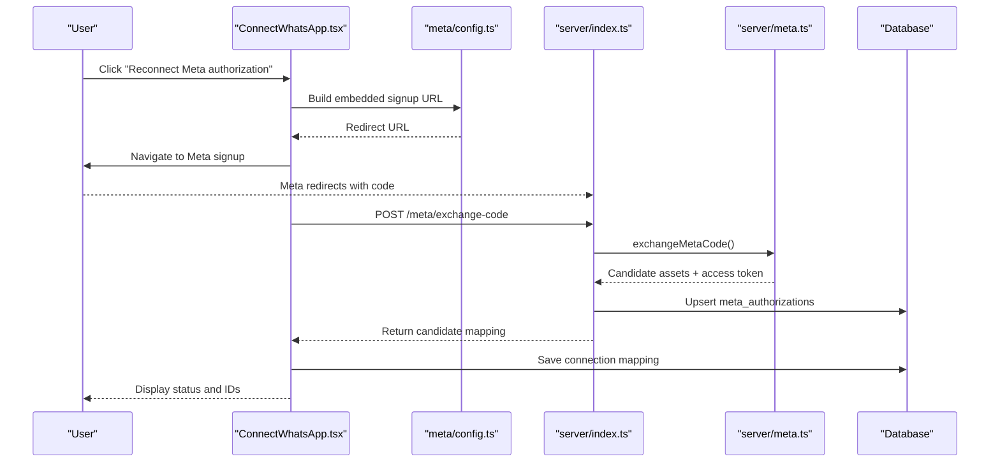
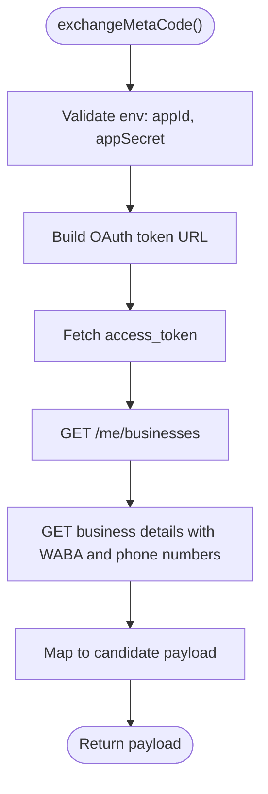
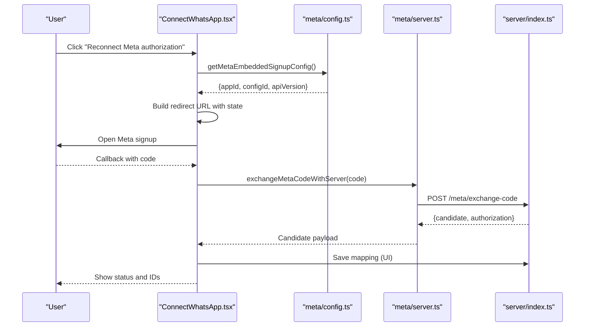
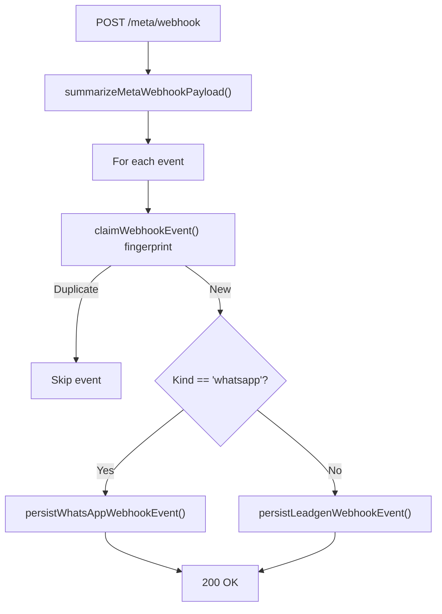
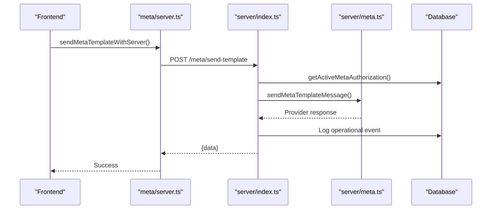
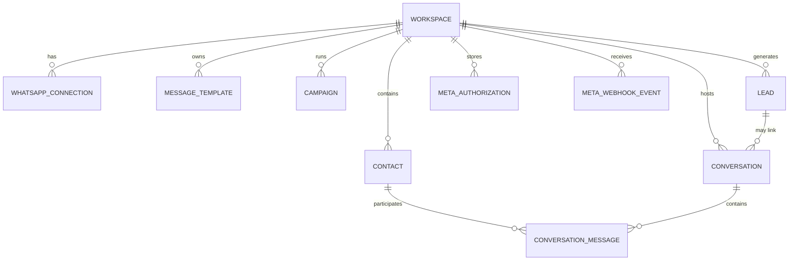
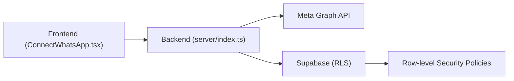

# WhatsApp Integration

<cite>
**Referenced Files in This Document**
- [server/meta.ts](file://server/meta.ts)
- [server/metaWebhook.ts](file://server/metaWebhook.ts)
- [server/index.ts](file://server/index.ts)
- [src/lib/meta/config.ts](file://src/lib/meta/config.ts)
- [src/lib/meta/server.ts](file://src/lib/meta/server.ts)
- [src/pages/ConnectWhatsApp.tsx](file://src/pages/ConnectWhatsApp.tsx)
- [src/lib/api/types.ts](file://src/lib/api/types.ts)
- [prisma/schema.prisma](file://prisma/schema.prisma)
- [supabase/schema.sql](file://supabase/schema.sql)
</cite>

## Table of Contents
1. [Introduction](#introduction)
2. [Project Structure](#project-structure)
3. [Core Components](#core-components)
4. [Architecture Overview](#architecture-overview)
5. [Detailed Component Analysis](#detailed-component-analysis)
6. [Dependency Analysis](#dependency-analysis)
7. [Performance Considerations](#performance-considerations)
8. [Troubleshooting Guide](#troubleshooting-guide)
9. [Conclusion](#conclusion)
10. [Appendices](#appendices)

## Introduction
This document explains the end-to-end WhatsApp Business API integration implemented in the repository. It covers Meta Developer App setup, OAuth authorization flow, real-time webhook processing, message sending, and operational safeguards such as duplicate event handling and authorization lifecycle management. The integration spans frontend UI for connection orchestration, backend server endpoints for OAuth exchange and webhook handling, and database schemas for persistent state.

## Project Structure
The integration is organized into:
- Frontend pages and libraries for Meta Embedded Signup configuration and server communication
- Backend server exposing endpoints for OAuth exchange, webhook verification and ingestion, and message sending
- Database schemas (Prisma and Supabase) modeling WhatsApp connections, authorizations, webhooks, and conversation state
- Utility modules for Meta API interactions and webhook summarization

**Diagram sources**
- [server/index.ts:36-1222](file://server/index.ts#L36-L1222)
- [server/meta.ts:1-391](file://server/meta.ts#L1-L391)
- [server/metaWebhook.ts:1-161](file://server/metaWebhook.ts#L1-L161)
- [src/lib/meta/config.ts:1-47](file://src/lib/meta/config.ts#L1-L47)
- [src/lib/meta/server.ts:1-148](file://src/lib/meta/server.ts#L1-L148)
- [src/pages/ConnectWhatsApp.tsx:1-519](file://src/pages/ConnectWhatsApp.tsx#L1-L519)
- [prisma/schema.prisma:1-189](file://prisma/schema.prisma#L1-L189)
- [supabase/schema.sql:1-517](file://supabase/schema.sql#L1-L517)

**Section sources**
- [server/index.ts:36-1222](file://server/index.ts#L36-L1222)
- [src/pages/ConnectWhatsApp.tsx:1-519](file://src/pages/ConnectWhatsApp.tsx#L1-L519)
- [src/lib/meta/config.ts:1-47](file://src/lib/meta/config.ts#L1-L47)
- [src/lib/meta/server.ts:1-148](file://src/lib/meta/server.ts#L1-L148)
- [prisma/schema.prisma:1-189](file://prisma/schema.prisma#L1-L189)
- [supabase/schema.sql:1-517](file://supabase/schema.sql#L1-L517)

## Core Components
- Meta OAuth and API utilities: token exchange, authorization checks, and message sending helpers
- Webhook ingestion and normalization: parsing incoming events and deduplicating via fingerprints
- Frontend connection flow: launching Meta Embedded Signup, exchanging authorization codes, and saving connection metadata
- Backend endpoints: webhook verification, event ingestion, template/campaign/reply senders, and authorization persistence
- Database models: WhatsApp connections, authorizations, webhooks, conversations, leads, and operational logs

**Section sources**
- [server/meta.ts:1-391](file://server/meta.ts#L1-L391)
- [server/metaWebhook.ts:1-161](file://server/metaWebhook.ts#L1-L161)
- [src/pages/ConnectWhatsApp.tsx:1-519](file://src/pages/ConnectWhatsApp.tsx#L1-L519)
- [server/index.ts:808-1222](file://server/index.ts#L808-L1222)
- [prisma/schema.prisma:93-189](file://prisma/schema.prisma#L93-L189)
- [supabase/schema.sql:45-284](file://supabase/schema.sql#L45-L284)

## Architecture Overview
The integration follows a secure, event-driven pattern:
- Frontend launches Meta’s Embedded Signup with a state parameter
- Meta redirects back with an authorization code
- Frontend exchanges the code via a backend endpoint
- Backend validates and persists authorization, then returns candidate Meta assets
- Frontend saves connection mapping and displays status
- Meta’s WhatsApp webhook posts events to the backend
- Backend deduplicates and persists events, updates conversations/leads, and triggers automations

**Diagram sources**
- [src/pages/ConnectWhatsApp.tsx:134-157](file://src/pages/ConnectWhatsApp.tsx#L134-L157)
- [src/lib/meta/config.ts:25-46](file://src/lib/meta/config.ts#L25-L46)
- [src/lib/meta/server.ts:18-47](file://src/lib/meta/server.ts#L18-L47)
- [server/index.ts:851-875](file://server/index.ts#L851-L875)
- [server/meta.ts:237-292](file://server/meta.ts#L237-L292)
- [supabase/schema.sql:131-138](file://supabase/schema.sql#L131-L138)

**Section sources**
- [src/pages/ConnectWhatsApp.tsx:134-157](file://src/pages/ConnectWhatsApp.tsx#L134-L157)
- [src/lib/meta/config.ts:25-46](file://src/lib/meta/config.ts#L25-L46)
- [src/lib/meta/server.ts:18-47](file://src/lib/meta/server.ts#L18-L47)
- [server/index.ts:851-875](file://server/index.ts#L851-L875)
- [server/meta.ts:237-292](file://server/meta.ts#L237-L292)
- [supabase/schema.sql:131-138](file://supabase/schema.sql#L131-L138)

## Detailed Component Analysis

### Meta OAuth and Token Management
- Environment configuration and validation for Meta app credentials and webhook verify token
- Exchange authorization code for access token and fetch business assets
- Persist authorization with expiration and expose helper to retrieve active authorization
- Send text, template, and interactive messages via Meta Graph API

**Diagram sources**
- [server/meta.ts:6-16](file://server/meta.ts#L6-L16)
- [server/meta.ts:237-292](file://server/meta.ts#L237-L292)

**Section sources**
- [server/meta.ts:6-16](file://server/meta.ts#L6-L16)
- [server/meta.ts:237-292](file://server/meta.ts#L237-L292)
- [server/index.ts:225-244](file://server/index.ts#L225-L244)

### Frontend Connection Flow
- Launch Meta Embedded Signup with state parameter for CSRF protection
- On callback, exchange code with backend and persist candidate mapping
- Allow manual editing of connection fields and saving to database
- Display live status cards for connection, authorization, verification, review, and OBA

**Diagram sources**
- [src/pages/ConnectWhatsApp.tsx:134-157](file://src/pages/ConnectWhatsApp.tsx#L134-L157)
- [src/lib/meta/config.ts:7-23](file://src/lib/meta/config.ts#L7-L23)
- [src/lib/meta/server.ts:18-47](file://src/lib/meta/server.ts#L18-L47)
- [server/index.ts:851-875](file://server/index.ts#L851-L875)

**Section sources**
- [src/pages/ConnectWhatsApp.tsx:134-157](file://src/pages/ConnectWhatsApp.tsx#L134-L157)
- [src/lib/meta/config.ts:7-23](file://src/lib/meta/config.ts#L7-L23)
- [src/lib/meta/server.ts:18-47](file://src/lib/meta/server.ts#L18-L47)
- [server/index.ts:851-875](file://server/index.ts#L851-L875)

### Webhook Architecture and Event Processing
- Verify webhook subscription using verify token
- Normalize incoming payload into structured events
- Deduplicate events using a fingerprint hash
- Persist events and update conversations/leads
- Handle both WhatsApp inbound messages and Meta Leadgen events

**Diagram sources**
- [server/index.ts:808-849](file://server/index.ts#L808-L849)
- [server/metaWebhook.ts:111-161](file://server/metaWebhook.ts#L111-L161)
- [server/index.ts:319-342](file://server/index.ts#L319-L342)
- [server/index.ts:369-629](file://server/index.ts#L369-L629)
- [server/index.ts:631-750](file://server/index.ts#L631-L750)

**Section sources**
- [server/index.ts:808-849](file://server/index.ts#L808-L849)
- [server/metaWebhook.ts:111-161](file://server/metaWebhook.ts#L111-L161)
- [server/index.ts:319-342](file://server/index.ts#L319-L342)
- [server/index.ts:369-629](file://server/index.ts#L369-L629)
- [server/index.ts:631-750](file://server/index.ts#L631-L750)

### Message Sending Capabilities
- Template messages with optional body parameters
- Text replies to conversations
- Interactive messages (buttons/list)
- Rate-limiting and error handling via operational logs and failed send logs

**Diagram sources**
- [src/lib/meta/server.ts:49-81](file://src/lib/meta/server.ts#L49-L81)
- [server/index.ts:936-999](file://server/index.ts#L936-L999)
- [server/meta.ts:298-331](file://server/meta.ts#L298-L331)
- [server/index.ts:225-244](file://server/index.ts#L225-L244)

**Section sources**
- [src/lib/meta/server.ts:49-81](file://src/lib/meta/server.ts#L49-L81)
- [server/index.ts:936-999](file://server/index.ts#L936-L999)
- [server/meta.ts:298-331](file://server/meta.ts#L298-L331)
- [server/index.ts:225-244](file://server/index.ts#L225-L244)

### Data Models and Schemas
- WhatsApp connections, authorizations, webhooks, conversations, leads, and operational logs
- Enumerations for statuses and categories
- Row-level security policies for workspace isolation

**Diagram sources**
- [prisma/schema.prisma:56-189](file://prisma/schema.prisma#L56-L189)
- [supabase/schema.sql:19-284](file://supabase/schema.sql#L19-L284)

**Section sources**
- [prisma/schema.prisma:56-189](file://prisma/schema.prisma#L56-L189)
- [supabase/schema.sql:19-284](file://supabase/schema.sql#L19-L284)

## Dependency Analysis
- Frontend depends on Supabase for session management and on backend endpoints for OAuth exchange and sending
- Backend depends on Meta Graph API for OAuth and messaging, and on Supabase for workspace-scoped persistence
- Database enforces workspace isolation via row-level security policies

**Diagram sources**
- [src/pages/ConnectWhatsApp.tsx:1-519](file://src/pages/ConnectWhatsApp.tsx#L1-L519)
- [server/index.ts:36-1222](file://server/index.ts#L36-L1222)
- [supabase/schema.sql:389-517](file://supabase/schema.sql#L389-L517)

**Section sources**
- [src/pages/ConnectWhatsApp.tsx:1-519](file://src/pages/ConnectWhatsApp.tsx#L1-L519)
- [server/index.ts:36-1222](file://server/index.ts#L36-L1222)
- [supabase/schema.sql:389-517](file://supabase/schema.sql#L389-L517)

## Performance Considerations
- Deduplicate webhook events using a fingerprint to prevent duplicate processing
- Batch operations for campaign sends and log writes
- Use database upserts and conflict resolution to minimize race conditions
- Asynchronous logging and event persistence to keep webhook handlers responsive

[No sources needed since this section provides general guidance]

## Troubleshooting Guide
Common issues and resolutions:
- Missing environment variables for Meta app configuration cause early failures during OAuth exchange
- Authorization expiration triggers errors during send operations; refresh by reconnecting
- Webhook verification failures indicate incorrect verify token or mismatched mode/token
- Duplicate webhook events are safely skipped using the fingerprint mechanism
- Operational logs and failed send logs capture detailed error contexts for diagnosis

**Section sources**
- [server/meta.ts:6-16](file://server/meta.ts#L6-L16)
- [server/index.ts:225-244](file://server/index.ts#L225-L244)
- [server/index.ts:808-820](file://server/index.ts#L808-L820)
- [server/index.ts:319-342](file://server/index.ts#L319-L342)
- [server/index.ts:258-275](file://server/index.ts#L258-L275)
- [server/index.ts:277-317](file://server/index.ts#L277-L317)

## Conclusion
The integration provides a robust, production-ready foundation for WhatsApp Business API connectivity. It includes secure OAuth, resilient webhook processing, comprehensive conversation and lead management, and operational observability. Following the best practices outlined here ensures reliable scaling and maintainability.

[No sources needed since this section summarizes without analyzing specific files]

## Appendices

### Best Practices for Production Deployments
- Store Meta credentials securely via environment variables and secrets managers
- Enforce HTTPS and strict CORS policies for webhook endpoints
- Monitor operational logs and failed send logs; set alerts for recurring failures
- Implement exponential backoff for transient network errors
- Regularly rotate access tokens and monitor expiration windows
- Use distinct verify tokens per environment and rotate periodically

[No sources needed since this section provides general guidance]